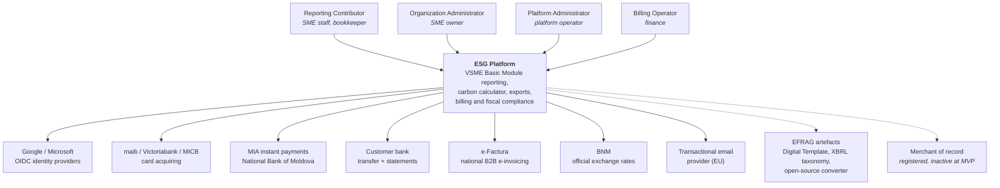
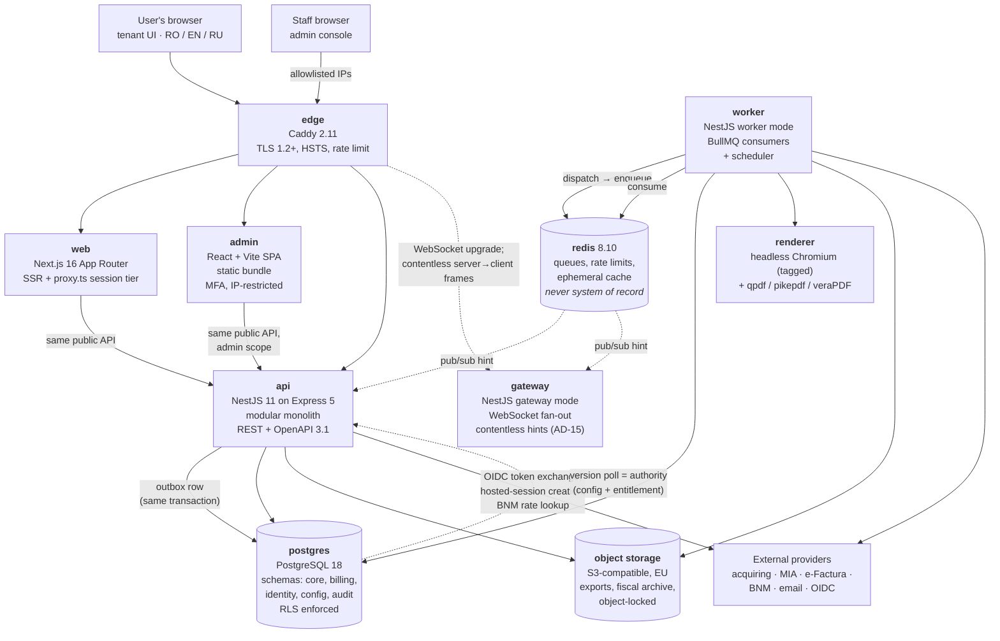
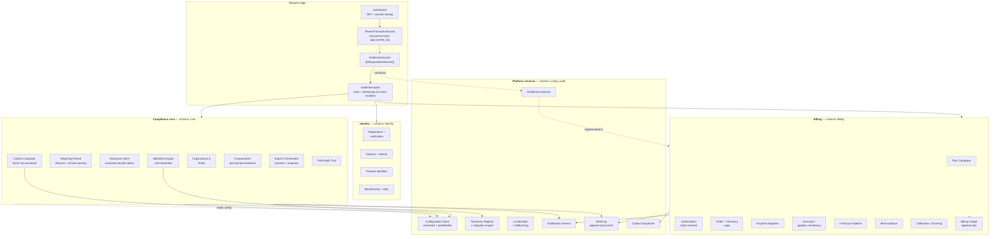
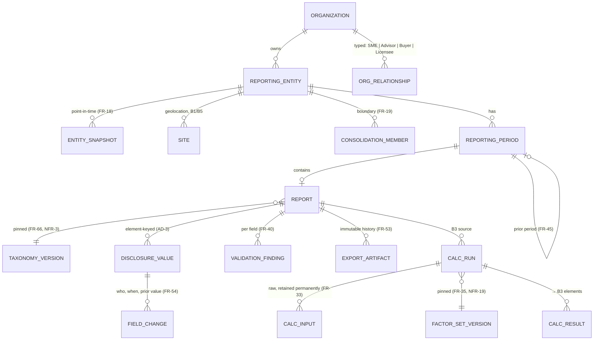
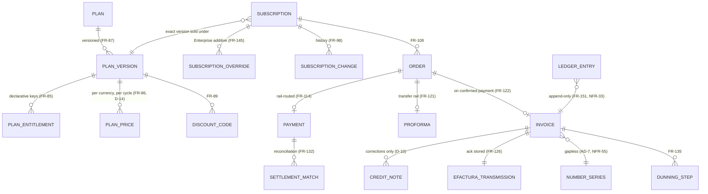
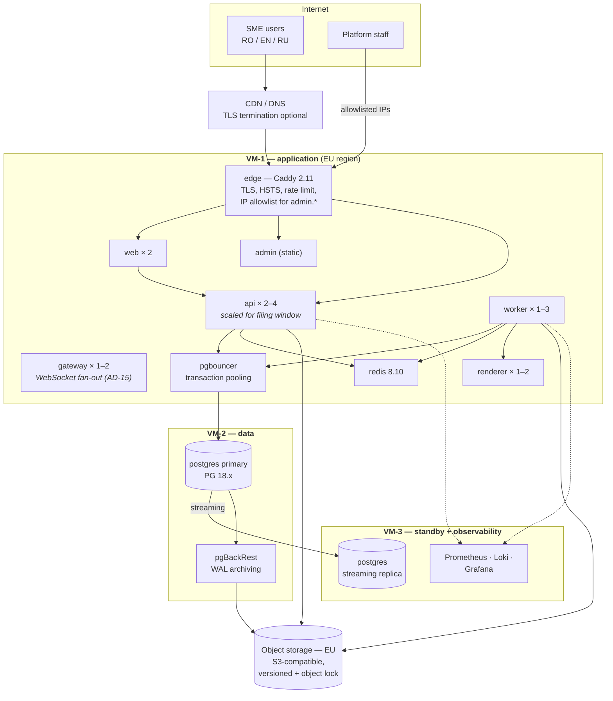
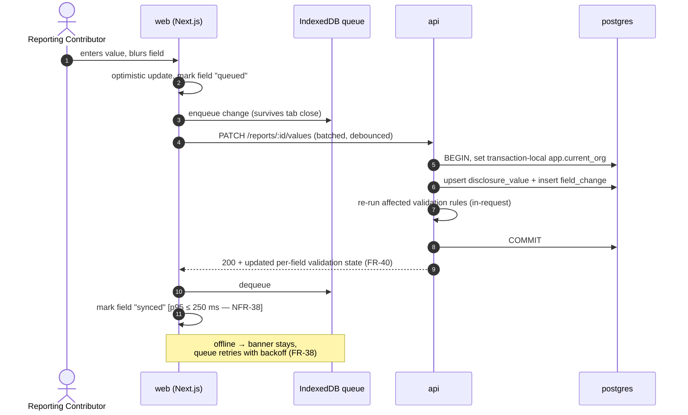
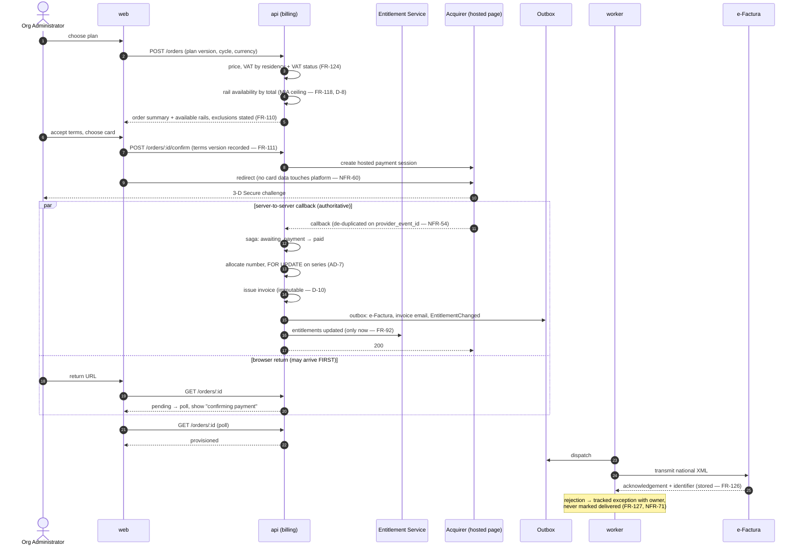
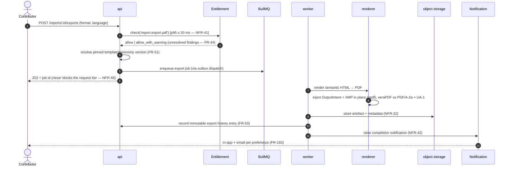

# ESG Platform — System Architecture (MVP)

| Field | Value |
|---|---|
| Document ID | architecture.md |
| Version | 1.0 |
| Status | Consolidated baseline |
| Date | 2026-08-17 |
| Consolidates | `ESG Platform System Architecture (MVP)` (primary, detail), `ESG Platform Architecture Overview (MVP)` (primary, framing), `ESG Platform Private Monetization Architecture` (commercial-layer separation), `ESG Platform Research and Architecture Notes` (background, earlier, lower authority) |

---

## 1. Purpose and scope; how to read this document

### 1.1 What this document is

This is the canonical architecture baseline for the ESG Platform MVP. It defines **how the system is built**, in the same way the FR register defines what it does and the NFR register defines how well. It is written so that a delivery team can start work from it without re-deriving decisions, and so that a reviewer can check any structural claim against the requirement that forced it.

It consolidates four prior documents into one record. Where the two architecture documents overlapped, `System Architecture (MVP)` was preferred for detail and `Architecture Overview (MVP)` for framing; genuine conflicts are recorded in §17.5 rather than silently reconciled.

### 1.2 The system, in one paragraph

A multi-tenant SaaS that lets a Moldovan SME produce a **VSME Basic Module (B1–B11)** sustainability report in Romanian, English or Russian, calculate Scope 1 and location-based Scope 2 emissions feeding B3, and export the result as PDF and as the official EFRAG Excel Digital Template — with a full self-serve billing, invoicing and Moldovan fiscal-compliance stack behind it.

| Dimension | Value |
|---|---|
| Scale envelope | ≤ 2,000 organizations · ≤ 3,000 users · ≤ 2,500 reports/year · ≈ 150 peak concurrent sessions · < 100 GB |
| Peak season | April–May, peaking in the last two weeks of May (Art. 33(3), Law 287/2017 — 150 days after year end) |
| Locales | Romanian (source), English, Russian — all separately authored, none machine-translated |
| Hosting | EU/EEA, self-managed VMs, Docker Compose |
| Scope | Full register: 173 FRs (FR-1 … FR-173); 93 MVP NFRs (NFR-1 … NFR-93) plus 12 deferred (NFR-94 … NFR-105). 8–12 month build |

### 1.3 Companion documents and identifier scheme

This document is a companion to, and traceable against, the six other baseline documents:

- `problem_overview.md` — the problem, the scope and the closed scope decisions
- `actors.md` — the actors `CA`, `RC`, `OA`, `PA`, `BO`, `SYS`
- `use_cases.md` — UC-01 … UC-176, and the use case design decisions and constraints D-1 … D-14
- `functional_requirements.md` — FR-1 … FR-173
- `non_functional_requirements.md` — NFR-1 … NFR-93 (MVP) and NFR-94 … NFR-105 (deferred)
- `design_spec.md` — UX-1 … UX-136, and the screens S-01 … S-28 and A-01 … A-18

This document owns two identifier schemes of its own: the architectural decisions **AD-1 … AD-15** (§4) and the drivers **DR-1 … DR-11** (§2). The four notification qualities authored in §17.3 as NFR-106 … NFR-109 were **ratified into `non_functional_requirements.md` §4.16 on 18 August 2026**.

All identifiers are preserved verbatim from the sources. There is no `ACT-*` scheme: actors are the letter codes `CA`, `RC`, `OA`, `PA`, `BO`, `SYS` (§2.4).

### 1.4 How to read it

- §2 is the load-bearing part. It lists the eleven **drivers** (DR-1 … DR-11) that actually shape the structure. Everything from §4 onward is a consequence of those.
- A reader with thirty minutes should read §2, §3 and §5.
- A reader who needs to know *why* a specific structural choice was made should read the corresponding AD in §4.
- A reader who needs to know what is **not** decided should read §18.

### 1.5 What is out of scope for this architecture

By prior decision: XBRL export and the Comprehensive Module (Phase 2), energy-provider and accounting integrations, AI assistance, the public disclosure portal (Phase 3), the ESAP bridge and blockchain traceability (uncommitted roadmap). Extension points for each are named in §15 so that adding them is additive rather than structural.

### 1.6 Four scope facts that drive the architecture more than the feature list does

1. **Billing is not a thin Stripe wrapper.** Stripe does not serve Moldova-resident businesses. The platform owns the plan catalogue, subscription state machine, order lifecycle, invoice and credit-note documents, gapless fiscal numbering, dunning, reconciliation, and the billing ledger (D-7). Four payment rails sit behind one adapter interface (D-8). This is 69 of 173 functional requirements (FR-84 … FR-152) — about 40% of the register, and the part with statutory consequences.
2. **e-Factura is MVP, not Phase 2.** Moldova's national B2B e-invoicing mandate takes effect **1 October 2026** (D-9). The invoice is therefore modelled as a structured platform-owned record rendered into national XML by an adapter, never as "a PDF that gets emailed".
3. **The compliance core must be able to run with billing switched off.** D-11 and NFR-1 make this a testable obligation, not an aspiration: with `BILLING_ENABLED=false`, the UC-17 … UC-48 suite must pass.
4. **The standard moves.** The VSME XBRL taxonomy had a backwards-incompatible release in February 2026 and updates several times a year. NFR-12, NFR-85 and NFR-86 require content, thresholds, factor sets and validation rules to change **without a code release**, and require a compatible template/taxonomy rollout to need no deployment. This forces a configuration-as-data architecture rather than a code-first one.

---

## 2. Architectural drivers

### 2.1 The eleven structural drivers

These are the constraints that determine structure. Everything else is detail.

| # | Driver | Source | Structural consequence |
|---|---|---|---|
| DR-1 | Billing and the compliance core are separate bounded contexts sharing no transaction, foreign key or table; disabling billing leaves reporting working | D-11, NFR-1, NFR-15, FR-154 | Two PostgreSQL schemas with no cross-schema FKs; communication only by published entitlement state and domain events; a feature flag that disables the billing module wholesale |
| DR-2 | The internal schema mirrors VSME taxonomy element names and structure | NFR-2, FR-155 | A generic, taxonomy-driven disclosure store (element-keyed values), not a hand-modelled table per module |
| DR-3 | Thresholds, factor sets, validation rule definitions, effective dates, notification behaviour, plan definitions, help-centre articles and plan presentation copy change without a redeploy, published within one working day and revertible in one step | NFR-12, NFR-85, NFR-86, FR-61 … FR-74, FR-173 | A versioned, publishable **configuration store** as a first-class subsystem; the application interprets it, it does not embed it. **Narrowed 19 Aug 2026 (OQ-43):** the *wording* of labels, help text, validation messages and notification templates ships in the release as committed message catalogues. The behaviour this driver exists to protect — that a rule, threshold or factor set changes without a redeploy — is unchanged |
| DR-4 | Every report is pinned to an explicit template and taxonomy version and can be re-exported or migrated against a later one | NFR-3, FR-51, FR-65 … FR-69 | Version is a dimension of the data model, not a global; export and validation are parameterised by it; migration is a first-class operational job |
| DR-5 | Tenant isolation is structural at the data-access layer, not a filter at call sites | NFR-63 | PostgreSQL Row-Level Security with a per-request session variable; the connection, not the query, carries the tenant |
| DR-6 | Audit, ledger and metering records are append-only, enforced at database privilege level | NFR-33, FR-151, FR-159, FR-105 | Separate DB roles; no UPDATE/DELETE grant on ledger tables to the application role; corrections are new rows |
| DR-7 | Money is provider-executed; the platform never touches card data or holds funds | D-7, D-8, NFR-60, NFR-74 | Payment adapters only; PCI DSS SAQ-A scope; no custody or settlement code path exists |
| DR-8 | Fiscal documents are immutable, gaplessly numbered per series per year, and transmitted to e-Factura with acknowledgement stored | D-9, D-10, NFR-55, NFR-71, FR-123 … FR-130 | A numbering service holding a row lock inside the issuing transaction; an outbox-driven transmission pipeline; six-year independent archive |
| DR-9 | Payment callbacks, provider webhooks and e-Factura acknowledgements are idempotent under duplicate, delayed and out-of-order delivery; order → payment → invoice → entitlement is all-or-nothing | NFR-54, NFR-59 | Transactional outbox + saga coordinator; every inbound event keyed and de-duplicated at the edge |
| DR-10 | Export generation must not degrade interactive latency; 10× concurrency spike in the filing window with no maintenance window | NFR-37, NFR-42, NFR-44, NFR-46, NFR-48 | Export and all long-running work leaves the request tier by queue into a separate worker container; horizontal scale of API and worker independently |
| DR-11 | Every tenant-facing capability is reachable through one documented, versioned API under identical authorization — no interface-only privileged route | FR-153, NFR-16, NFR-83 | The Next.js app is a client of the same public API, not a privileged backend; OpenAPI generated from source and diffed in CI |

### 2.2 The commercial driver behind DR-1

`Private Monetization Architecture` supplies the reason DR-1 is worth its cost, and it is not a technical reason. EFRAG's own VSME Excel Digital Template and open-source XBRL converter are **free, official and already available to any SME in Europe**. That sets a hard ceiling: the platform cannot charge for "the ability to produce a compliant VSME report" as a standalone feature. Every viable monetization path sells convenience, automation, integration, collaboration, aggregation or distribution — not the compliance content itself.

The architectural consequence is that pricing and packaging decisions must never touch compliance logic, because the packaging is expected to change while the compliance core stays identical for a free-tier user and an enterprise contract alike. That is DR-1, and it is why §5 treats the compliance-core / commercial-layer split as the central structural fact rather than as a modularity preference.

### 2.3 Confirmed platform and operational choices

**Confirmed platform choices** (given, not derived): NestJS for backend services, Next.js for the tenant-facing application, React + Vite for the administrative console, PostgreSQL as the primary store, Docker and Docker Compose as the packaging and deployment mechanism. Versions are in §12.

**Confirmed operational choices** (decided in review): EU-region VPS with Docker Compose; a modular monolith plus a separate worker process; shared-schema multi-tenancy with PostgreSQL Row-Level Security.

### 2.4 Actors

| Code | Actor | Does |
|---|---|---|
| CA | Common Access | Register, authenticate, manage own profile |
| RC | Reporting Contributor | Fills the report, runs the calculator, exports |
| OA | Organization Administrator | Entities, periods, users, plan, billing |
| BO | Billing Operator | Reconciliation, dunning, refunds, fiscal reporting |
| PA | Platform Administrator | Content, taxonomy versions, factor sets, plans, support grants |
| SYS | System | Scheduled and event-driven work |

---

## 3. Architecture principles

These are stated as principles because each one is applied in more than one place, and each is traceable to a driver or a requirement. They are not aspirations; every one has a named enforcement mechanism.

| # | Principle | Enforced by | Traces to |
|---|---|---|---|
| P-1 | **The compliance core knows nothing about plan, price or tenant type.** It only knows how to produce a correct report, and it is identical on the free tier and on an enterprise contract | CI boundary rule; `contracts/` as the only cross-context surface; `BILLING_ENABLED=false` CI job | DR-1, D-11, NFR-1, NFR-15 |
| P-2 | **The standard is data, not code.** Taxonomy elements, labels, thresholds, factor sets and validation rules are registered configuration interpreted at runtime | Configuration store (AD-4), taxonomy-keyed disclosure store (AD-3) | DR-2, DR-3, DR-4, NFR-12, NFR-85, NFR-86 |
| P-3 | **Version is a dimension of the data, not a global setting.** Reports, calculations and exports each record the version of the artefact that produced them | Version pinning on `report`, `calc_run`; effective-dated config with temporal constraints | DR-4, NFR-3, NFR-19, NFR-87 |
| P-4 | **Guarantees belong below the application.** Tenant isolation, append-only-ness and gapless numbering are enforced by the database, not by discipline at call sites | RLS `FORCED`; privilege-level `GRANT`/`REVOKE` plus triggers; `SELECT … FOR UPDATE` on the counter row | DR-5, DR-6, DR-8, NFR-33, NFR-55, NFR-63 |
| P-5 | **One documented API, no privileged back door.** Both front ends are ordinary clients of the same versioned surface, authorized identically | OpenAPI 3.1 generated from source and diffed in CI; route-coverage diff | DR-11, FR-153, NFR-16, NFR-83 |
| P-6 | **Nothing long-running happens in the request tier.** All generation, transmission, dispatch and scheduled work leaves by queue | BullMQ consumers in a separate `worker` container; the outbox is the only producer | DR-10, NFR-42, NFR-46 |
| P-7 | **Every external system sits behind a port with exactly one adapter per provider.** No vendor type appears outside its adapter | Ports in `contracts/`; provider registry read from configuration; dependency review per release | DR-7, NFR-11, NFR-14 |
| P-8 | **Cross-boundary effects are written in the same transaction as the state change that caused them.** No dual writes | `outbox_event` written transactionally; `inbound_event` unique-keyed at the edge | DR-9, NFR-54, NFR-59 |
| P-9 | **Fail closed on tenancy, fail open on already-granted entitlements.** An absent tenant context yields zero rows; an unreachable billing context keeps granted capabilities working | RLS `missing_ok` policy form; `TenantRepository` that throws with no context; cached entitlement snapshot | NFR-49, NFR-63 |
| P-10 | **Instrument every billable-shaped action, including actions not currently billed.** Pricing units must be evaluable end to end without a code change | Append-only `metering_event` stream | FR-105, NFR-10 |
| P-11 | **What is expensive to retrofit is built on day one, regardless of which phase its feature lands in.** Version pinning, RLS, retained calculator inputs, per-field audit, append-only ledgers, multi-period model, outbox, config-as-data | Build order (§15.4); §16.3 debt register | NFR-19, NFR-33, NFR-63, FR-45, FR-54 |
| P-12 | **A requirement verified by rehearsal needs a runbook, and the runbook is a deliverable.** A rehearsal without one is not repeatable and therefore not evidence | `docs/runbooks/` in the repository layout | NFR-28, NFR-29, NFR-31, NFR-51, NFR-52, NFR-85, NFR-86, NFR-93 |

---

## 4. Architecture decision record index

Every architectural decision carries an **AD-n** identifier, cites the drivers and requirements it discharges, and records rejected alternatives where the choice was real. A decision record that only states what was chosen is a description, not a decision.

### 4.1 Index

| ID | Decision | Status | Drivers | Key requirements |
|---|---|---|---|---|
| AD-1 | Modular monolith (`api`) + worker, boundaries enforced in CI | Accepted | DR-1, DR-10 | NFR-1, NFR-15, NFR-46, D-11 |
| AD-2 | Shared schema + PostgreSQL RLS, transaction-local tenant context per request | Accepted | DR-5 | NFR-63, NFR-62, FR-158 |
| AD-3 | Taxonomy-driven element-keyed disclosure store + generated typed facade | Accepted | DR-2, DR-4 | NFR-2, NFR-3, NFR-86, FR-155 |
| AD-4 | Configuration-as-data with versioned publish/revert and effective dating | Accepted | DR-3 | NFR-12, NFR-73, NFR-85 … NFR-87 |
| AD-5 | Single key-based entitlement service, cached, degrading open for granted keys | Accepted | DR-1 | NFR-17, NFR-41, NFR-49, FR-99 … FR-104 |
| AD-6 | Transactional outbox + inbound de-duplication + order saga | Accepted | DR-9 | NFR-54, NFR-59, NFR-50 |
| AD-7 | Gapless fiscal numbering by `SELECT … FOR UPDATE` on a counter row at `READ COMMITTED`, consumed at issuance | Accepted | DR-8 | NFR-55, FR-123, D-10 |
| AD-8 | Port + adapter per third party; merchant-of-record registered but inactive | Accepted | DR-7 | NFR-11, NFR-14, NFR-60, NFR-74 |
| AD-9 | Two front ends, both clients of one public API; admin separately addressed | Accepted | DR-11 | NFR-16, NFR-65, NFR-38, NFR-56 |
| AD-10 | All long-running work leaves the request tier by queue | Accepted | DR-10 | NFR-42, NFR-46, NFR-82 |
| AD-11 | One channel-agnostic notification subsystem with per-recipient delivery evidence | Accepted | — | FR-157, FR-160 … FR-173 |
| AD-12 | Short-lived JWT + server-side revocable refresh sessions | Accepted | — | FR-5 … FR-8, FR-58, NFR-62 |
| AD-13 | TypeScript 6.0.3, single compiler; TS 7 side-by-side documented but not adopted | Accepted | — | NFR-16, NFR-26, NFR-30, NFR-58, NFR-88 |
| AD-14 | TypeORM 1.1 with `synchronize` off, SQL migrations, ALS-bound `QueryRunner`, two `DataSource`s | Accepted | DR-1, DR-5 | NFR-1, NFR-58, NFR-63, NFR-86 |
| AD-15 | A push accelerator over a polling floor: a gateway fans out contentless hints, the HTTP read stays the authority | Accepted | DR-10, DR-11 | FR-58, FR-161, NFR-110 |

### 4.2 AD-1 — Modular monolith plus worker, not microservices

| | |
|---|---|
| **Context** | The scale envelope is ≤ 2,000 organizations, ≤ 3,000 users, ≈ 150 concurrent sessions at peak. DR-1 demands a hard separation between billing and the compliance core; DR-10 demands that export generation not touch interactive latency; NFR-59 demands all-or-nothing behaviour across order, payment, invoice and entitlement. |
| **Decision** | One NestJS deployable, `api`, containing all bounded contexts as NestJS modules with enforced boundaries; one NestJS deployable, `worker`, running the same codebase in worker mode, consuming queues. Both are built from the same image and differ only by entrypoint and configuration. DR-1's separation is a **compilation and schema** boundary, not a network boundary. |
| **Alternatives considered** | *Three separate services from day one* — rejected: distributed-system cost buys nothing at this scale and works against NFR-59, which is far easier to satisfy inside one process with a durable outbox than across a service mesh; splitting later is cheap once the boundary is already enforced, because a module lifts out with its schema. *Single process including workers* — rejected outright by NFR-46: an export burst must not touch NFR-37's p95 ≤ 300 ms. |
| **Consequences** | Boundary enforcement moves to static analysis: `dependency-cruiser` / `eslint-plugin-boundaries` rules in CI forbid any import between `modules/billing/**` and `modules/core/**` except through `contracts/`. Each context owns a PostgreSQL schema, but **runtime enforcement is not claimed** — `search_path` governs only unqualified name resolution, so a schema-qualified cross-context join would work; genuine database-level prevention would need `USAGE` revoked across the boundary, which conflicts with AD-6's outbox. The schema split therefore exists to make a violation obvious in review and to keep contexts physically separable later. Cross-context communication is one-directional: billing publishes `EntitlementChanged`; core reads entitlements through an `EntitlementService` interface whose only implementation lives in billing and whose null implementation (grant-everything) runs when billing is disabled. A second CI job runs UC-17 … UC-48 with `BILLING_ENABLED=false`; that job is what keeps the boundary honest over time. |

### 4.3 AD-2 — Shared schema with PostgreSQL Row-Level Security for tenancy

| | |
|---|---|
| **Context** | NFR-63 requires cross-tenant access to be **structurally prevented rather than filtered at call sites**. The platform is government-branded, holds fiscal and confidential sustainability data, and serves companies who are each other's competitors, while adoption is entirely voluntary. |
| **Decision** | Every tenant-owned table carries `organization_id uuid not null`. RLS is `ENABLED` and `FORCED`, with a policy of the form `organization_id = current_setting('app.current_org', true)::uuid`. **Two clarifications, 20 Aug 2026 (task 12), each forced by writing the first policy — see below the table.** The application connects as a non-superuser, non-owner role for which RLS is not bypassable. A request-scoped interceptor sets `app.current_org` and `app.current_user` on the pooled connection **inside the transaction**, and the ORM never issues a tenant query outside a transaction. |
| **Alternatives considered** | *Schema-per-tenant* — rejected: 2,000 schemas makes every migration a 2,000-step job and makes FR-83's adoption dashboard and FR-105's metering rollups awkward. *ORM global scope or base repository injecting the predicate* — roughly 90% as effective and materially cheaper to live with, but weaker than NFR-63's wording; if the team wants it, the honest route is to amend NFR-63 explicitly rather than implement RLS half-heartedly and describe it as structural. *One deployment per customer* — incompatible with NFR-47's per-free-tier-organization cost ceiling, and turns FR-83 and FR-105 into cross-instance ETL. |
| **Consequences** | Three database roles, not two: `esg_app` and `esg_worker` are both RLS-enforced; only `esg_admin_ro` (read-only, `BYPASSRLS`) bypasses it, used solely for explicit cross-tenant rollups, migration runs and the admin API, with every acquisition logged (FR-79, NFR-66). Giving the worker `BYPASSRLS` would be the obvious shortcut and is wrong: the worker is what materialises one tenant's regulatory and fiscal record into a PDF, an Excel file, an e-Factura payload and an email. Session-scoped `SET` is prohibited — it leaks to the next borrower of a pooled connection, the single most common way RLS multi-tenancy is broken in production. PgBouncer, if used, runs in **transaction** pooling mode. CI carries a cross-tenant probe suite plus a job-level probe that enqueues work for organization A while the worker's context says organization B and asserts the job fails rather than returning data. Policies are enabled in **every** environment from the first sprint: the value of RLS is that a missing tenant context breaks loudly and early. |

**Two clarifications from the first policy, 20 Aug 2026 (task 12).** Both are amendments to the
stated form above rather than exceptions taken quietly against it.

- **The tenant root is scoped by its own `id`.** `core.organization` *is* the tenant, so it carries
  no `organization_id`; its policy reads `id = current_setting('app.current_org', true)::uuid`. The
  rule is therefore two clauses — the root by `id`, every other tenant table by `organization_id` —
  and both are enforced mechanically by the schema-invariant gate rather than by review. A
  self-referencing or generated `organization_id` column was considered for uniformity and declined:
  a stored duplicate of the primary key reads as clever now and as puzzling later, and two clauses
  checked by a gate is not the kind of exception that erodes.
- **`INSERT` on the tenant root carries `WITH CHECK (true)`, and only there.** FR-13 creates an
  organization from a verified account that holds no membership yet, so `app.current_org` cannot
  already equal an id that does not exist — a `WITH CHECK` on that insert makes organization creation
  impossible rather than secure. Creating a row you then own is not a cross-tenant act; reading or
  altering another tenant's data is, and the `SELECT`, `UPDATE` and `DELETE` policies still prevent
  both. Every other tenant table keeps a real `WITH CHECK`.

**A third detail, smaller but load-bearing:** the policy wraps the setting in `NULLIF(..., '')`. The
`missing_ok` form below gives NULL for an *unset* context, which filters to zero rows as intended —
but a context set to the **empty string** casts as `invalid input syntax for type uuid` and raises,
which is the 500-on-every-endpoint this note exists to avoid, arriving by a route it did not
consider. `NULLIF` collapses both to the same fail-closed NULL.

**Implementation note that is part of the decision.** The setting is written with `SELECT set_config('app.current_org', $1, true)` — **not** `SET LOCAL`, which is utility syntax and accepts no bind parameter, so writing it that way forces string interpolation into the one value the entire tenancy model rests on. The `true` third argument makes it transaction-local. The policy reads `current_setting(..., true)` in the `missing_ok` form, so an unset context yields NULL and therefore zero rows rather than a 500 on every endpoint. The organization id comes from the **server-side membership lookup** already performed in `AuthGuard`, never from the raw JWT claim — AD-12 declines to treat the token claim as authoritative, and grounding the RLS boundary in a value the auth design does not trust would make an org-switch race or a revoked membership into a cross-tenant read.

**On the argument that public disclosure makes NFR-63 unnecessary.** It will be raised, so it is answered here. *Timing*: the public portal is Phase 3 and opt-in; at MVP nothing is public, and this product is a **drafting tool** — a report is confidential for the whole period a company is using the system. A leaked draft is not an early copy of a public document; it is a wrong number the company had not yet corrected. B9 carries recordable accidents and fatalities, B11 carries corruption convictions and fines. *Scope*: even if every finished report were public, that justifies relaxing access control on published report content only — one projection of one table. The field-level audit trail with previous values (FR-54, FR-55), calculator raw inputs retained permanently by site and source (FR-33), fields declared not material or omitted as sensitive, all billing data (IDNO, VAT code, legal address, invoices, dunning state), and all identity data are never public. *Consistency*: applying RLS to `billing` and `identity` but not to `core` is worse than applying it everywhere — uniform enforcement is verifiable in one pass; selective enforcement is a rule every future query author must remember, which is exactly what NFR-63 exists to eliminate.

### 4.4 AD-3 — A taxonomy-driven disclosure store, not a table per module

| | |
|---|---|
| **Context** | NFR-2 and FR-155 require the internal schema to mirror the VSME taxonomy. DR-4 requires reports pinned to different taxonomy versions to coexist and be migrated. The taxonomy already delivered one backwards-incompatible release (February 2026) and updates several times a year. Each Excel named range in the Digital Template corresponds exactly by local name to an XBRL taxonomy element, and dimensions are used sparingly — a flat mapping, friendly to a relational store. **Measured against the published `2026-05-01` package on 29 Aug 2026 (task 33.1): 143 reportable elements, of which 34 are dimensioned, along 8 axes.** "Sparingly" holds; "flat" does not, and the difference is the design's, not a correction of it — `report_disclosure_value` was already keyed on `(report_id, element_key, dimension_key, ordinal)`. |
| **Decision** | Disclosure data is stored as element-keyed values against a report, where the element key **is** the VSME XBRL taxonomy element local name (e.g. `EnergyConsumptionFromFuels`, `NumberOfFemaleEmployees`). The set of elements, their datatypes, units, cardinality, dimensions, validation rules and applicability conditions comes from a **registered taxonomy version** held in the configuration store, not from TypeScript types or table columns. |
| **Alternatives considered** | *Column-per-disclosure relational modelling* — rejected on DR-4 / NFR-86 grounds: a hand-modelled `b3_energy_emissions` table would need DDL migration on every taxonomy release. *Whole report as a single JSONB blob* — rejected because per-field audit attribution (FR-54, NFR-7, NFR-35), per-field validation state (FR-40) and per-field comparative display (FR-46) all need row granularity; a blob makes each of those an application-level diff. |
| **Consequences** | A taxonomy release becomes **data registration plus a mapping**, which is what NFR-86 demands. The trade accepted is loss of compile-time typing and database-level check constraints on individual disclosures. That is bought back three ways: a typed **facade** generated per taxonomy version, so application code and the API still see `report.b3.scope1Emissions` rather than string keys; validation running from registered rule definitions (FR-73) rather than column constraints; and a golden-report cross-format regression corpus (NFR-20, NFR-21, NFR-22) that catches what the type system no longer can. |

### 4.5 AD-4 — Configuration-as-data, with an explicit publish/revert step

| | |
|---|---|
| **Context** | DR-3: content, thresholds, factor sets, validation rules, notification templates and plan definitions must change without a redeploy, publish within one working day of approval, and revert in one step. NFR-19 requires a stored calculation to reproduce exactly against its stored raw inputs and factor-set version; NFR-87 forbids a rule or factor change from silently restating a previously reported figure. |
| **Decision** | A single **configuration store** subsystem holds every artefact that must change without a release, each versioned with `draft → in review → published → superseded` states, each revertible in one action, and each with an effective date where the domain needs one. Published versions are **immutable**. Publication is a single transactional action that writes a new immutable version and flips a pointer; revert flips the pointer back. |
| **Alternatives considered** | *Event-based cache invalidation via PostgreSQL `LISTEN/NOTIFY`* — rejected on two counts: `LISTEN` requires a pinned session and is unsupported through PgBouncer in transaction pooling mode, which is exactly what fronts the database; and `NOTIFY` is lossy, so a replica disconnected during the notify never learns it missed one, leaving it indefinitely stale. *Effective-dating without immutability* — rejected: an edited "published" factor set silently rewrites history. |
| **Consequences** | **Implementation note added 20 Aug 2026 (task 16): the store is two tables, and the split is what makes §7.9's stated constraint usable.** §7.9 and §12.3 both specify `PRIMARY KEY (scope, validity WITHOUT OVERLAPS)` for effective-dated configuration, but that cannot sit on a table which also keeps superseded versions — two versions of one scope necessarily cover overlapping dates, so every supersession would violate it. `config.entry_version` therefore holds every version and no validity at all; `config.entry_schedule` holds only what is in force, carries that primary key, and **is** the pointer this decision describes. Publication writes a version and updates the slot's `version_id`; revert updates it back. The store version is bumped by a trigger on the schedule rather than by the publishing code, because a publish that forgot to bump it is a change no replica ever notices — the failure mode `LISTEN/NOTIFY` was rejected for. Cache invalidation is **version-based, not event-based**: every `api` and `worker` replica holds a cached read model stamped with a `config_version`; a cheap poll of a single-row version table (≤ 5 s) is the **authority**, and a Redis pub/sub message is only a latency optimisation. A lost message costs seconds of staleness instead of an indefinitely stale replica. Effective-dated tables carry a non-overlap guarantee at database level (§12.3). |

Artefacts held, and whether they are effective-dated:

| Artefact | Requirement | Effective-dated |
|---|---|---|
| Help-centre articles and plan presentation copy, per locale | FR-61, FR-62, NFR-85 | No — published/superseded |
| Locale registration — which locales are offered; the catalogues themselves are committed (OQ-43) | FR-63, NFR-25 | No |
| Social provider behaviour — enabled state, client id, issuer, scopes, redirect-URI allowlist; the client secret stays in the environment (§12.5.6) | FR-82 | No |
| Organization legal forms, per country — the codes; their wording is committed (OQ-43) | FR-15 | No |
| Organization relationship types — `direct_sme` at MVP; Advisor, Buyer and Licensee added as data | FR-14, NFR-9 | No |
| VSME template + XBRL taxonomy versions and their artefacts | FR-65, FR-66 | Pinned per report, not dated |
| Version-to-version field mappings | FR-67 | Pinned to a version pair |
| Emission and conversion factor sets | FR-71, NFR-19 | **Yes** |
| Conditional-applicability thresholds (≥50 turnover, ≥150 pay gap) | FR-72 | **Yes** |
| Disclosure axis shapes — which explicit axes a reporter answers for every member (a *breakdown*) rather than selects from (a *classification*); EFRAG's package does not distinguish them (task 36.4) | UX-14, UC-21 | **Yes** |
| Validation rule definitions, each naming a message key whose wording is committed (OQ-43) | FR-73 | **Yes** |
| Notification category behaviour — channels, classification, lead times, repeat interval; template wording is committed (OQ-43) | FR-173 | No |
| Plan versions, entitlements, quotas, prices, discounts | FR-84 … FR-89 | **Yes** |
| **Interim seat ceiling** — an organization's maximum active members plus pending invitations, **lapsed ones included** (corrected 13 Sep 2026 from *live pending*; §12.5.6's task-142 row), one global value, until AD-5's entitlement service exists (task 142; **task 54.2 deletes this row**) | FR-57 | No |
| VAT rates and treatment rules | FR-148, NFR-73 | **Yes** |
| MIA per-transaction and cumulative ceilings | FR-118, NFR-73 | **Yes** |
| BNM rate sourcing | FR-129, NFR-73 | **Yes** |

### 4.6 AD-5 — One entitlement service, consulted by everything, depended on by nothing

| | |
|---|---|
| **Context** | FR-100 requires gating logic to live outside the gated capability. NFR-17 requires that adding a gated capability needs no entitlement-service change and that changing a plan needs no capability change. NFR-41 sets p95 ≤ 20 ms (≤ 100 ms on cache miss). NFR-49 requires the core to keep serving UC-17 … UC-48 when the billing context is unavailable. |
| **Decision** | A single `EntitlementService` answers every gated action with `allow \| deny \| allow_with_warning`, plus the reason and the current limit. It is defined by an interface in `contracts/`, implemented in the billing context, consumed by the core. The contract is a **key lookup, not a method per feature**: `check(orgId, key, requested?) → Decision`, where `EntitlementKey` is a string registered in configuration. Entitlements are computed from plan-version entitlements plus per-subscription overrides, cached per organization. |
| **Alternatives considered** | *A method per gated feature* — rejected: it makes NFR-17 false by construction, since a new capability would require an entitlement-service change. |
| **Consequences** | A new gated capability is a new key in the plan catalogue; a new plan is new data. NFR-17's verification — a synthetic entitlement key and a synthetic plan introduced in test — is a CI job. Availability behaviour is a requirement, not an accident: the cache carries a last-known-good snapshot per organization with a generous TTL, and a deny from an unreachable billing context is treated as allow for **already-granted** keys and closed for new purchases; a chaos test that disables billing mid-session is the verification. In-process cache per `api` container means no network hop on the hot path, which is what makes 20 ms trivially achievable — another point in favour of AD-1. The version poll matters more here than for content: a missed invalidation on a downgrade or cancellation would let an organization keep entitlements it no longer holds until the TTL expires. |

Registered keys named in the sources: `report.export.pdf`, `org.entities.max`, `org.seats.max`, `api.calls.monthly`, `module.comprehensive`.

### 4.7 AD-6 — Transactional outbox and a saga for the order lifecycle

| | |
|---|---|
| **Context** | DR-9. Acquirers and national platforms deliver duplicate, delayed and out-of-order events, and NFR-54 requires convergence on a single state under all three. NFR-59 requires order → payment → invoice → entitlement to be all-or-nothing. |
| **Decision** | All cross-boundary effects — e-Factura transmission, email dispatch, payment-provider calls, entitlement propagation, webhook fan-out — are written to an `outbox_event` table **in the same transaction** as the state change that caused them, and dispatched by the worker. All inbound provider events land in an `inbound_event` table keyed `(provider, provider_event_id)` with a unique constraint. The order → payment → invoice → entitlement sequence runs as an explicitly modelled **saga** with persisted state and compensations, not a chain of awaits. |
| **Alternatives considered** | *Direct provider calls inside the request* — rejected by DR-9 and NFR-50. *Claiming exactly-once delivery* — explicitly declined: delivery is at-least-once and processing is **effectively once** (the unique constraint deduplicates insertion, the effect commits with the processed marker). "Exactly once" is not available across a network boundary and is not claimed. *Treating `invoiced` as reversible* — rejected: an issued fiscal document cannot be withdrawn (D-10) and its number cannot be released (AD-7). |
| **Consequences** | **Implementation note added 20 Aug 2026 (task 15): the dispatcher enqueues *before* marking a row dispatched, both inside one transaction.** Reversing that order yields an at-most-once system that passes every test identically — a crash between the mark and the enqueue loses the row silently, because nothing errors. Enqueue-then-mark means a crash rolls the transaction back and the row returns to pending. The `idempotency_key` is passed to BullMQ as the **job id**, so the re-emitted duplicate is discarded by the queue: that pairing is what makes "delivery is at-least-once and processing is effectively once" true in code rather than in intent. Every outbox row carries an `idempotency_key` generated in the originating transaction and passed to every provider that supports one; adapters for providers that do not — e-Factura among them — declare a **recovery query** (for e-Factura, look up by invoice number before re-transmitting). Without this, a dispatcher restart produces a duplicate e-Factura submission or a duplicate refund execution. NFR-59's "all-or-nothing" is, strictly, **eventual convergence with compensation and a surfaced terminal inconsistency**, not atomicity; the saga's terminal `inconsistent` state is a monitored operational metric with a Billing Operator work queue, not a silent log line. Saga states: `draft → awaiting_payment → paid → invoiced → provisioned`, terminals `expired \| cancelled \| failed`, compensation out of `invoiced` is `credit_note_issued`. Invoice numbering is consumed only at the `invoiced` step. Entitlements change on confirmed payment or, for approved transfer terms, on invoice issuance — never on order creation (FR-92, FR-108). |

### 4.8 AD-7 — Gapless fiscal numbering by a row lock on the counter, consumed at issuance

| | |
|---|---|
| **Context** | NFR-55 requires gapless, sequential allocation **under concurrent issuance and partial failure**, verified by a concurrency test with induced mid-transaction failure plus a sequence audit for gaps and duplicates. D-10 makes issued documents immutable. |
| **Decision** | Invoice numbers are allocated inside the issuing transaction by `SELECT next_number FROM billing.number_series WHERE document_type=$1 AND series=$2 AND fiscal_year=$3 FOR UPDATE`, incrementing the counter row and writing the document in the same transaction, at `READ COMMITTED`. The table carries `UNIQUE (document_type, series, fiscal_year, number)` as the invariant of record. A number is consumed **only** at issuance, never reserved at order creation. |
| **Alternatives considered** | *PostgreSQL sequence* — rejected: sequences are explicitly non-transactional, so a rolled-back transaction burns the number and produces a gap. *Advisory lock* — rejected with the flavour distinction spelled out: `pg_advisory_lock()` is **session**-scoped and is not released by `COMMIT` or `ROLLBACK`, so under transaction-pooled PgBouncer it is returned to the pool still held and the next borrower inherits it, deadlocking issuance for that series until the backend is killed; `pg_advisory_xact_lock()` avoids that but keys on `bigint`, so `(document_type, series, fiscal_year)` would have to be hashed, accepting silent collisions between unrelated series. `FOR UPDATE` gives the identical guarantee with no flavour ambiguity, no hashing and no pooler interaction. |
| **Consequences** | The isolation level is part of the decision, not an ambient default: read-then-increment is correct at `READ COMMITTED`, where a waiter re-reads after the lock is released; at `REPEATABLE READ` or `SERIALIZABLE` the waiter resumes on its original snapshot and the `UPDATE` aborts with a serialization failure, turning every concurrent issuance into a retry. AD-6's saga is exactly the code where someone raises the isolation level for unrelated reasons, so the issuing transaction pins its own. The cost is serialised issuance per series — at ≈ 200 documents per month this is not a bottleneck by four orders of magnitude. |

### 4.9 AD-8 — Adapter-and-port for every third party, with the merchant-of-record registered but inactive

| | |
|---|---|
| **Context** | DR-7: money is provider-executed and the platform never touches card data or holds funds. NFR-11 requires no vendor type outside its adapter, verified by a dependency review per release. NFR-14 requires an adapter to be activated with a diff limited to the adapter plus configuration. |
| **Decision** | Each external dependency is reached through a port defined in `contracts/` with exactly one adapter per provider, registered in a provider registry read from configuration. |
| **Alternatives considered** | *Direct SDK use in domain code* — rejected by NFR-11. *Building the merchant-of-record path at MVP* — rejected: D-8 requires activation to be configuration, not a build, so the port is registered and the adapter inactive. |
| **Consequences** | PCI DSS scope stays SAQ-A: no PAN reaches the platform, and no custody or settlement code path exists. Phase 2 XBRL is additive because `DocumentConversionPort` exists at MVP with no adapter wired. |

| Port | MVP adapters | Notes |
|---|---|---|
| `CardAcquiringPort` | maib (primary), Victoriabank, MICB | Hosted page / SDK only. No PAN ever reaches the platform (NFR-60, SAQ-A). Tokenisation for recurring |
| `InstantPaymentPort` | MIA (via participating bank APIs) | Offered only where order total ≤ configured per-transaction ceiling (FR-118) |
| `BankTransferPort` | Proforma + reconciliation | No provider call; settlement is asynchronous and reconciled (FR-131 … FR-134) |
| `MerchantOfRecordPort` | Paddle-class — **registered, inactive** | D-8; NFR-14's verification is adapter activation in staging with the diff limited to adapter + config |
| `EInvoicingPort` | e-Factura national XML; Peppol anticipated | FR-126, FR-127, D-9 |
| `ExchangeRatePort` | BNM official rate, by invoice date | FR-129, D-14 |
| `IdentityProviderPort` | Google, Microsoft (OIDC) | FR-2, FR-82, D-6. Registration/rotation without redeploy |
| `EmailPort` | Transactional ESP, EU region | FR-169, NFR-84 (SPF/DKIM/DMARC) |
| `DocumentConversionPort` | EFRAG open-source converter (MIT), self-hosted | Phase 2 XBRL; the port exists at MVP so Phase 2 is additive |
| `ObjectStoragePort` | S3-compatible, EU region | Exports, archives (NFR-27, NFR-36) |

### 4.10 AD-9 — Two front-end applications, both clients of one public API

| | |
|---|---|
| **Context** | DR-11 and NFR-16 forbid an interface-only privileged route. NFR-65 requires the administrative surface to be separately addressed, network-restricted and MFA-mandatory, sharing no session, cookie scope or credential with the tenant surface. NFR-43 sets LCP ≤ 2.5 s on 4G mid-range. |
| **Decision** | **`web`** — Next.js 16 (App Router), tenant-facing: registration, report wizard, calculator, validation, exports, organization and user administration, billing self-service. Server components for shell, navigation, list views and export preview; client components for the wizard's field-level interaction. **`admin`** — React 19 + Vite 8 SPA, the Platform Administrator console: content and translation publication, taxonomy version registration and migration runs, factor sets and thresholds, plan catalogue, reconciliation and dunning workspaces, adoption metrics, support-access grants. Both authenticate against and call the **same** `api`. |
| **Alternatives considered** | *Admin as a route group inside the tenant app* — rejected: it shares an origin and a cookie scope by construction, which NFR-65 forbids. *Next.js for the admin console* — rejected: an internal, authenticated, behind-the-firewall console has no SEO and no cold-start latency concern, and benefits from the simpler Vite build. *A privileged Next.js server route reaching the database directly* — rejected by DR-11. |
| **Consequences** | Next.js server-side code acts as a **session-holding proxy** — it holds the httpOnly refresh cookie and forwards requests with a short-lived access token, so no token is exposed to browser JavaScript — but every route it calls exists in the public OpenAPI surface and is authorized identically. Three Next.js 16 specifics are load-bearing: `proxy.ts` replaces `middleware.ts` and runs on the Node.js runtime, which is exactly the tier this decision describes, so the project starts on `proxy.ts`; **Cache Components (`"use cache"`) stay off as a security rule, not a performance preference** — every page is tenant-scoped, and a framework-level cache whose key the compiler generated without knowing about `organization_id` would leak across tenants **above** the RLS boundary of AD-2, where none of its probes would catch it; and `next lint` is removed, so CI must invoke ESLint directly or every gate in AD-13's table silently turns off. Turbopack is the default bundler; React Compiler stays off until the wizard's render profile is measured. |

**The wizard's persistence model** is where three requirements collide: FR-37 (autosave on blur/step change, no save button), FR-38 (queue locally and retry offline), NFR-38 (p95 ≤ 250 ms, non-blocking), NFR-56 (no acknowledged change lost — acknowledge only after durable write). The design: field-level optimistic update in a client store, a debounced batched `PATCH` per field group, an IndexedDB-backed outbound queue that survives a tab close, a per-field `synced | queued | failed` indicator, and a persistent banner while anything is unsynced. The server acknowledges only post-commit. Conflict resolution is last-write-wins per field with the audit trail (FR-54) as the reconciliation record — appropriate because the realistic concurrency is one or two people in one SME, not simultaneous editing.

### 4.11 AD-10 — Exports and all long-running work leave the request tier by queue

| | |
|---|---|
| **Context** | NFR-46 requires export generation decoupled from the request tier such that an export burst affects only export latency, verified by fault injection flooding the export queue while measuring NFR-37. NFR-42 requires any generation projected beyond 30 s to run asynchronously with progress indication and completion notification. |
| **Decision** | A BullMQ queue on Redis carries PDF generation, Excel template population, e-Factura transmission, email dispatch, dunning runs, reconciliation imports, taxonomy migration runs, trial and invitation expiry, metering rollups and backup verification. The `worker` container consumes it. The queue store is used for queueing, rate limiting and short-lived caches — **never** as a system of record. **The outbox is the only producer**: `api` does not enqueue directly. |
| **Alternatives considered** | *Synchronous export in the request* — rejected by NFR-46. *A synchronous fast path plus an async slow path* — rejected: since NFR-42 forces the async path to exist anyway, making it the only path removes a branch. *`api` enqueueing to Redis directly* — rejected as a dual write: a job enqueued for a transaction that then rolls back runs against state that does not exist, and a commit whose `LPUSH` fails silently drops the work. *ExcelJS for the EFRAG template* — rejected (see below). *Ghostscript in the PDF path* — rejected (see below). |
| **Consequences** | Every queued job has a durable outbox row behind it, so a total queue-store loss costs in-flight jobs that the dispatcher re-emits, not data. Export is always `202 + job id`. Completion raises a notification through AD-11. |

**PDF, and why the obvious pipeline does not work.** PDF is produced by headless Chromium (Playwright) rendering the same React templates the preview uses, so FR-48's preview and FR-49's PDF cannot drift, with `tagged: true` set — Chromium emits an untagged PDF by default. Semantic HTML is what makes the resulting structure tree meaningful, which is why the templates are semantic rather than absolutely positioned. Two corrections to the conventional recipe:

- **PDF/A-2b is the wrong conformance level for what NFR-75 asks.** 2b is *basic* — visual reproducibility only. Logical structure, tagging and Unicode mapping are level **a**; reading order and accessibility conformance are PDF/UA-1. A veraPDF pass against 2b proves nothing about tagged reading order, so a suite built that way reports green on a requirement it never tested. This architecture targets **PDF/A-2a plus PDF/UA-1** and validates against both profiles; NFR-82 is amended accordingly (§17.1).
- **Ghostscript must not be in this path.** Its `pdfwrite` device does not post-process; it re-interprets and re-emits, and the structure tree, marked content and `/Lang` do not survive — it would strip exactly the tags NFR-75 requires, before veraPDF ever saw the file. (It is also AGPL-3.0, which the network clause makes a live licensing question for a hosted commercial service.) The OutputIntent, ICC profile and conformance XMP are instead injected **in place** with `qpdf`/`pikepdf`, which leave the rest of the file untouched.

Chromium's tagging is real but shallow — headings, paragraphs, lists and tables, but not table header scope, artifact marking for decorative content, or PDF/UA identification metadata. Those are added in the same in-place step. If accessible tagging still proves unreachable, NFR-75 is escalated as a conflict rather than left claimed and untested.

**Excel, and why ExcelJS is not the tool.** FR-50 requires writing into the **official EFRAG template's named ranges** while preserving its dropdowns and consistency formulas. ExcelJS parses an `.xlsx` into its own object model and writes a *new* workbook from it — there is no binary-base mode — so everything it does not model is lost on round trip, and data validation (the dropdowns) is its most frequently reported round-trip loss; sheet-scoped and formula-defined names generally do not survive either, and the template's named ranges are the target. The export therefore treats the `.xlsx` as what it is — a zip of XML parts — and patches it surgically: resolve the named ranges from `xl/workbook.xml`, rewrite only the target `<c>` nodes in the relevant `xl/worksheets/sheetN.xml`, delete `xl/calcChain.xml`, set `<calcPr fullCalcOnLoad="1"/>` so consumers recalculate on open, and rezip **every other part byte-for-byte unchanged**.

NFR-20's verification needs restating for the same reason: LibreOffice Calc headless is automatable in CI and is the automated gate; Microsoft 365 and desktop Excel are not server-automatable on Linux, so those become a manual item on the release checklist rather than a CI job.

### 4.12 AD-11 — One notification subsystem, channel-agnostic, with delivery evidence

| | |
|---|---|
| **Context** | FR-157 requires every producer to raise through one mechanism. FR-167 requires cancelling an outstanding notice when its condition clears and deduplicating on category and subject. FR-170 requires per-recipient channel, dispatch timestamp and outcome as **the evidence that a required update was actually requested** — a compliance artefact, not telemetry. |
| **Decision** | A notification is a first-class record (category, subject reference, recipients, state) held separately from the channels it is delivered on (FR-160). One notice to two people on two channels is one notification with four delivery records. In-app delivery writes directly to the recipient's notification centre with no external dependency (FR-168); email goes through `EmailPort`, language resolved **per recipient** (FR-169). |
| **Alternatives considered** | *Fire-and-forget send per producer* — rejected: FR-167's cancellation and deduplication are only expressible if the notification is a stateful record keyed by `(category, subject_ref, recipient_scope)` with an upsert. |
| **Consequences** | Every producer — payment failure, quota approach, trial expiry, dunning, service restriction, invitation, invoice delivery, version change, outstanding-report, deadline — raises through this one mechanism and acquires no delivery path of its own. FR-160 … FR-173 had no NFR counterpart, which left FR-170's delivery records with no acceptance threshold; NFR-106 … NFR-109 were authored to close that (§17.3). |

### 4.13 AD-12 — Auth by short-lived JWT plus server-side revocable refresh sessions

| | |
|---|---|
| **Context** | FR-6 requires a consumed password-reset link to invalidate all existing sessions; FR-7 offers termination of other sessions; FR-58 requires a role change to take effect **on the user's next request rather than at their next login**. FR-5 requires server-side session termination on logout. |
| **Decision** | The access token is a short-lived (≤ 15 min) signed JWT carrying **`session_id` and nothing else of authorization consequence** — no role, no organization, no entitlement snapshot. Refresh tokens are opaque, stored server-side, rotated on use, revocable. Role, active organization and per-report rights are read server-side on every request from the session and membership records. |
| **Alternatives considered** | *Claims in the token (role, org, entitlements)* — rejected: all three of FR-6, FR-7 and FR-58 need a per-request server-side lookup, and once that lookup exists the token is doing no authorization work. Carrying `role` anyway would be a live footgun — some guard, at some point, trusts the claim instead of the lookup, and nothing in the design would catch it. |
| **Consequences** | The 15-minute lifetime bounds replay of a stolen token; the lookup, not the lifetime, bounds staleness. This is also why AD-2 grounds `app.current_org` in the membership lookup rather than in a claim. The admin surface needs its own token handler: AD-9's httpOnly-cookie proxy pattern depends on a server-side rendering tier, which `web` has and a static Vite SPA does not — left unaddressed, the *more* privileged surface would be the one holding its access token in browser JavaScript, inverting the intended risk gradient. `admin` therefore gets its own token handler so it uses the same httpOnly-cookie pattern. **That handler is a route on `api` — `POST /auth/admin/session` — not an endpoint at `edge`.** This paragraph originally placed it at `edge`; OQ-17 closed it onto `api` because a handler at the edge would be a second auth surface outside the one public API, which no contract test and no OpenAPI diff (P-5) would ever see. Corrected 19 Aug 2026 with the `apps/admin` scaffold; OQ-17 and §12.5 govern. **A known divergence, decided 12 Sep 2026 and closed by task 145 on 13 Sep 2026.** *The lookup, not the lifetime, bounds staleness* was true of the tenant realm and **not** of the admin one: the admin resolver honoured a revoked session's last access token for up to fifteen minutes, the per-request lookup having been deferred to task 28's guard — and task 28 closed without it. The deferral's argument was uniformity with the tenant model; it is reversed with its cost stated, one lookup per admin request. Recorded here rather than only in §12.5.6 because it is this decision's own sentence that was untrue of half the platform. |

### 4.14 AD-13 — TypeScript 6.0.3, single compiler

| | |
|---|---|
| **Context** | TypeScript 7.0 shipped 3 August 2026 as the first stable release of the native Go compiler, 8–12× faster on full builds — and **without a stable programmatic API**, expected in 7.1. typescript-eslint declares support for `>=4.8.4 <6.1.0` with no tsgo support. This architecture leans on static analysis to discharge requirements that have no other verification. |
| **Decision** | Build on **TypeScript 6.0.3**, single compiler. The optional TS 7 side-by-side type-check is documented but **not adopted**. |
| **Alternatives considered** | *Adopt TS 7 on day one* — rejected: it would disable the tooling that several NFRs name *as their acceptance criterion*. The build would be faster and four requirements would become unverifiable — a bad trade at any compile speed. *Side-by-side (TS 7 advisory `typecheck`, TS 6 authoritative `build`)* — Microsoft's own recommended shape, documented, available, not taken; if adopted, TS 6 remains authoritative and a TS 7 failure is a signal to investigate, never a merge block. |
| **Consequences** | Decorators are **not** the blocker — `tsgo` emits the same `__decorate`, `__metadata` and `__param` helpers, so NestJS DI, TypeORM entity metadata and class-validator all work under TS 7. The blocker is every consumer of the compiler API: `nest build` calls `createProgram()` and `program.emit()`, as do the Swagger and GraphQL CLI plugins, ts-jest, ts-loader, ts-morph and type-aware ESLint. 7.1 will ship a *different* API, so tooling must be **ported**, not widened — the wait is likely longer than 7.1's release date. Promotion criterion: make TS 7 the compiler of record when `nest build` **and** typescript-eslint both support it. Building on 6.0.3 now is the shortest route there, since 7.0 converts 6's deprecations into hard errors and makes `strict` and `esnext` the defaults. |

Gates that depend on the TypeScript 6 compiler API, and the requirement each verifies:

| Gate | Requirement it verifies |
|---|---|
| `dependency-cruiser` / `eslint-plugin-boundaries` on `modules/core` ↔ `modules/billing` | DR-1, NFR-15 — the *only* runtime-independent enforcement of the bounded-context split |
| Rule prohibiting float in monetary types | NFR-58's stated verification, verbatim |
| Rule prohibiting hardcoded date/number/currency format patterns | NFR-26's stated verification, verbatim |
| Log-scanning rule for personal data | NFR-30 |
| Route-coverage diff (interface-only privileged routes) | NFR-16 |

### 4.15 AD-14 — TypeORM 1.1, adopted with five parts switched off

| | |
|---|---|
| **Context** | The ORM choice was previously open. TypeORM sat on `0.3.x` for years with patchy maintenance; it reached **1.0 on 19 May 2026** and **1.1 on 13 July 2026**, making it — alongside Prisma — one of only two candidates with a 1.0-and-later stability commitment, while Drizzle (0.45) and Kysely (0.29) remain pre-1.0 on a system carrying a six-year fiscal retention obligation. |
| **Decision** | **TypeORM 1.1.0** with `@nestjs/typeorm` 11.0.3 as the persistence layer, adopted with five parts deliberately switched off. |
| **Alternatives considered** | *Prisma* — the other 1.0-committed candidate; TypeORM chosen for the first-party NestJS adapter, which removes real glue (module wiring, request scoping, health checks, testing utilities). *Drizzle, Kysely* — rejected as pre-1.0 against a six-year retention obligation. *Leaving the choice open* — closed by this decision. |
| **Consequences** | The honest trade: an ORM's headline value is entity-driven schema generation and relational navigation, and this design uses **neither** — AD-3's disclosure store is a keyed upsert, not an object graph, and DR-1 forbids relations across the core/billing boundary. TypeORM is adopted for repository ergonomics, migration tooling and team familiarity, on condition that the parts which fight the design are switched off now rather than discovered in month four. |

The five constraints, each non-negotiable:

1. **`synchronize: false`, permanently, and no auto-generated migrations.** TypeORM's schema generation cannot express RLS policies or `FORCE ROW LEVEL SECURITY`, the `GRANT`/`REVOKE` model, `WITHOUT OVERLAPS` primary keys, `uuidv7()` defaults, statement-level triggers, AD-3's composite `(report_id, organization_id)` foreign key, or expression indexes. The failure mode is worse than "unsupported": a generated migration reads those objects as drift and tries to **revert** them. Migrations are hand-authored SQL inside TypeORM migration classes.
2. **Every tenant query runs on the request's `QueryRunner`.** The largest integration risk in this decision. AD-2's RLS binding is transaction-local; a bare `repository.find()` takes an arbitrary pooled connection with no tenant GUC set. Mitigation: a `TenantRepository` base that resolves the active `QueryRunner` from `AsyncLocalStorage` and **throws when there is none**. Throwing is the point — without context, RLS returns zero rows, which presents as "this customer has no data" rather than as a bug. AD-2's CI probe suite gains a case that calls a repository method outside a request context and asserts it raises.
3. **Two `DataSource`s, not one.** `coreDataSource` and `billingDataSource`, with `audit` entities registered on both so an outbox row commits in the same transaction as the billing state change (AD-6). This makes NFR-1's "disable the billing context" test a matter of not registering the second data source, and makes a cross-context entity relation impossible to declare rather than merely forbidden.
4. **`numeric` stays a string.** The `pg` driver returns `numeric` as a JavaScript string and TypeORM preserves it — exactly what NFR-58 wants. The risk is a well-meaning `transformer` calling `parseFloat`; the CI float rule covers transformers explicitly.
5. **The audit-trail write is raw SQL.** `RETURNING old.*, new.*` is not expressible in the query builder, so any application path that wants both row images uses `queryRunner.query()`. **Amended 20 Aug 2026 (task 14): per-field capture itself is a database trigger, not an application function.** This constraint and §12.3's row both argue about the *application* path — the query builder cannot express `RETURNING old.*`, and PostgreSQL 17 needed a read-then-write under a lock. Neither argues against a trigger, which was not considered and never needed a read at all. The deciding property is that a function must be *called*: a plain `UPDATE` written in a later task bypasses it silently, which is the application-discipline failure DR-6 rejects for append-only records of exactly this kind, and FR-54 exists to support a limited-assurance review (NFR-7) that a trail with unknown gaps cannot serve. P-4 already places RLS, gapless numbering and append-only below the application deliberately; this belongs with them. The capture function is `SECURITY DEFINER`, so `esg_app` holds `SELECT` on `core.field_change` and no `INSERT` — the trail can be read by the application and authored by nothing except the trigger.

Two items for the first-week spike, listed rather than assumed: `@nestjs/typeorm` 11.0.3 declares its peer range as `^0.3.0 || ^1.0.0-dev`, which resolves 1.1.0 but loosely enough to warrant a smoke test — **discharged 18 Aug 2026: it resolves 1.1.0 cleanly with no peer warning; the only peer conflict in the tree was TypeORM's own optional `ioredis` range, recorded above**; and TypeORM and NestJS both rely on `experimentalDecorators` / `emitDecoratorMetadata`, whose behaviour under the eventual TypeScript 7 move should be verified before that migration rather than during it.

---

### 4.16 AD-15 — A push accelerator over a polling floor, never an authority

| | |
|---|---|
| **Context** | §11.1 rejected a push transport by name and stated the procedure for adding one: *"adding a push transport is a deliberate change to §5.4 and §10.4, not an implementation detail."* This is that change, requested 12 Sep 2026 by the project owner with two named drivers — the FR-161 notification centre, and S-16 updating when an invitation is accepted while an administrator is looking at it. The standing rule is **"nothing pushes, everything polls"** (§12.1, OQ-41), and every immediacy requirement the product has — FR-58's role change, FR-5 … FR-7's session termination, FR-197's advisor revocation — is satisfied today by AD-12's per-request lookup and would be satisfied *less* well by a connection authenticated once at handshake. So the question is not "how do we push" but "what may a pushed frame be allowed to mean". |
| **Decision** | A **gateway** process fans out **contentless hints** to connected browsers. A frame is `{event, organizationId, since}` and carries no tenant data, no authorization consequence and nothing to render. Its only effect is to trigger the screen's **existing, already-authorized HTTP read** — sooner than that screen's poll would have. **Every event in the catalogue names the HTTP path that is its authority**, and a CI gate asserts that path exists (task 146). The poll is not removed and not slowed: it remains the floor, so a frame that is never delivered costs latency and never correctness. Transport is a plain **WebSocket** (`ws`), deliberately not Socket.IO — see *Alternatives*. |
| **Alternatives considered** | *Keep polling only* — the status quo, and it remains the floor; rejected as the whole answer because a filing-window administrator watching S-16 has no acceptable poll frequency that also fits §12.5.6's 300 req/min per-organization budget. *Socket.IO* — rejected on a specific property rather than on weight: its HTTP long-polling fallback **requires sticky sessions**, which would reintroduce the replica affinity §11.1 objected to and which `edge` does not implement. *Server-Sent Events* — viable and nearly chosen; a WebSocket was taken because the ticket handshake and the frame cap are easier to state and to bound at the edge, and the browser API needs no polyfill. *A frame that carries the payload* — rejected, and this is the decision's hinge: a frame carrying tenant data executes a read outside AD-2's transaction-local binding and makes a lossy channel load-bearing. *A new FR obliging the interface to reflect a change without the reader acting* — **deliberately not written**, because it would rest a correctness obligation on a delivered frame, which is precisely what this decision refuses. |
| **Consequences** | **This extends AD-4 rather than reversing §11.1.** The architecture already runs this exact pattern server-to-server: a Redis pub/sub hint as a latency optimisation over a version poll that is the authority, chosen *because* `NOTIFY` is lossy. AD-15 is that pattern one hop further, from server-to-server to server-to-browser, which is why it needs no new driver. **AD-2 is untouched** — no tenant-scoped query ever runs on a socket. **AD-12 is untouched** — the socket's authorization does no work that matters, so FR-58 and FR-5 … FR-7 still bind on the next request. **AD-9/P-5 is satisfied by a second contract, not by an exemption**: the event catalogue is emitted, diffed and authority-checked in CI the way `openapi:check` already works for paths. **AD-10/DR-10 is satisfied by placement**: the gateway is a third role on the AD-1 image (`MODE=gateway`) run as its own Compose service, so long-lived connections never sit in the request tier, and the **worker** publishes the hint as it drains the outbox. **No sticky routing is required**, because the gateway holds no per-connection state beyond the account — a reconnect lands on any replica and re-subscribes. **The real cost is testing**: every accelerated surface is proven twice, once connected and once with the socket disabled, and a surface with only the first assertion has quietly made push the authority. |

Three constraints, each non-negotiable:

1. **A frame carries no tenant data.** The catalogue's payload type admits `event`, `organizationId` and `since`, and a gate proves it. This is what keeps AD-2 whole: the client's reaction is an ordinary authenticated request that opens its own transaction and sets `app.current_org`, so even a subscription that should have been torn down can learn nothing — the read it triggers is authorized on its own and returns nothing its caller may not see.
2. **Every event names its authority, and the authority is an HTTP path.** *Push is never the authority* is otherwise a sentence in a document; as a CI assertion over the catalogue against `openapi/v1.json`, it is a property of the build.
3. **The floor is never removed to pay for the accelerator.** Poll intervals do not lengthen because a socket exists (OQ-36 sets them, and NFR-110 makes the disconnected interval the guaranteed ceiling). A change that slows a poll on the grounds that the gateway covers it has made delivery load-bearing and is a breach of this decision, not a tuning of it.


## 5. Logical architecture

### 5.1 The three layers, and why the separation is the central structural fact

`Private Monetization Architecture` states the layering that DR-1 encodes. Keeping these three layers cleanly separated is what allows pricing and packaging decisions never to touch compliance logic.

| Layer | Name | Owns | Knows nothing about |
|---|---|---|---|
| **Layer 1** | **Compliance core — "the truth"** | The entity data model mirroring the VSME taxonomy, the validation engine, and the PDF/Excel export generators | Plan, price, or tenant type. It only knows how to produce a correct report, and it is identical on the free tier and on an enterprise contract |
| **Layer 2** | **Commerce / entitlement layer** | Plan-and-entitlement resolution ("can this org perform this action right now"), usage counters, the metering-event stream, and the payment/invoicing rails | Report content. It gates by key, not by capability |
| **Layer 3** | **Distribution / tenancy layer** | The organization model and the typed relationships between organizations | Which monetization model is active for a given tenant |

Layer 1 is the trust asset the whole product depends on. Layer 2 supports **multiple concurrent pricing units** (per-seat, per-report, per-API-call, per-managed-supplier) rather than one hardcoded unit, which is what lets several packagings run simultaneously for different customer segments without special-casing the core. Layer 3 models organization relationships as a generic typed graph from day one — retrofitting a multi-tenant hierarchy after the fact is one of the most expensive re-architectures to do later.

**Cross-cutting: API-first.** The reporting core has a complete, documented API from day one, not a UI with an API bolted on afterwards. This is what makes usage-based billing, embedded/B2B2B use, enterprise integrations and white-labelling possible later without a separate engineering effort per channel — and it is the same principle DR-11 and NFR-16 require for a different reason (no privileged interface-only route).

### 5.2 How the three layers map onto the deployed modules

The three logical layers do not map one-to-one onto the five schemas; the mapping is stated explicitly so neither model is misread.

| Logical layer | Modules | Schema |
|---|---|---|
| Layer 1 — compliance core | `modules/core/*` (organization, entity, period, disclosure, calculator, validation, comparatives, export, trace) | `core` |
| Layer 2 — commerce / entitlement | `modules/billing/*` (catalogue, subscription, entitlement, account, order, payment, invoicing, efactura, reconciliation, collections, refunds, enterprise, finreporting) | `billing` |
| Layer 3 — distribution / tenancy | `modules/identity/*` (account, session, provider, membership, invitation) plus `core.organization` and `core.org_relationship` | `identity`, `core` |
| Cross-cutting platform services | `modules/platform/*` (configuration, content, taxonomy, localization, notification, metering, audit, support-access, admin) | `config`, `audit` |
| The only cross-context surface | `contracts/` — ports and event schemas | — |

Note the deliberate asymmetry: the **organization aggregate lives in `core`**, not in a separate tenancy schema, while `billing` references it **by ID with no foreign key**. That is the physical expression of NFR-15 ("sharing no transaction, foreign key or table"). Metering — the instrumentation that makes Layer 2's pricing units evaluable — lives in `audit`, not in `billing`, so that the metering stream keeps flowing with `BILLING_ENABLED=false`.

### 5.3 System context (C4 level 1)



Dotted edges are offline/artefact relationships rather than runtime calls: EFRAG artefacts are registered into the configuration store by a Platform Administrator (FR-65), not fetched live — a live dependency on an external standards body inside the export path would put NFR-42 and NFR-48 at the mercy of someone else's uptime.

`CA` (Common Access) and `SYS` do not appear as boxes on this diagram: `CA` is the pre-organizational capability set every authenticated principal holds, and `SYS` is the platform's own scheduled and event-driven work, which is internal. Both remain valid actors in the register.

### 5.4 Container view (C4 level 2)



**Eight Compose services, plus two stores outside the Compose file** — PostgreSQL runs on its own VM from the launch stage onward and object storage is an external EU S3-compatible provider. Each container exists because a requirement forces it, not because it is conventional.

| Container | Responsibility | Replicas | Exists because |
|---|---|---|---|
| `edge` | TLS 1.2+, HSTS, rate limiting, admin IP allowlist, dynamic upstreams | 1 | NFR-61, NFR-64, and NFR-65's admin network restriction |
| `web` | Tenant UI; holds the httpOnly refresh cookie; calls the public API only | 2 | SSR of list/preview views (NFR-43) and server-side session holding (AD-9) |
| `admin` | Static SPA on `admin.<host>`; separate auth realm; MFA mandatory | 1 | NFR-65 — separate address, cookie scope and credential realm |
| `api` | All bounded contexts; HTTP only; no long-running work | 2–4 | AD-1 |
| `worker` | Outbox dispatch, queue consumers, scheduler | 1–3 | NFR-46, NFR-42, NFR-93 |
| `gateway` | WebSocket fan-out of contentless hints; holds no per-connection state beyond the account | 1–2 | AD-15. Its own service rather than a role inside `api`, so DR-10's *nothing long-running in the request tier* stays literally true; a third entrypoint on the AD-1 image rather than a second image, so NFR-89's reproducibility drill still has one build |
| `renderer` | Tagged PDF generation, PDF/A-2a + PDF/UA-1 conformance | 1–2 | Chromium is heavy, has a different memory profile from Node, and must be independently restartable; NFR-82 and NFR-75 both live here |
| `postgres` | Primary store | 1 (+ standby) | Primary store; NFR-51 |
| `redis` | Queues, rate limits, ephemeral cache. **Never a system of record** | 1 | AD-10 |
| `object storage` | Exports, fiscal archive (six years, object-locked) | external | NFR-36, NFR-72 |

`api` and `worker` are the **same image**, different entrypoint. That matters for NFR-89 (buildable to a deployable artefact from source with no manual step) and for the reproducibility drill — one build, one version, two roles.

---

## 6. Component model

### 6.1 Component view of the `api` container (C4 level 3)



### 6.2 The request edge — four cross-cutting obligations discharged once

This is the only way those obligations stay true across 173 requirements.

| Component | Responsibility | Requirement |
|---|---|---|
| `AuthGuard` | Server-side evaluation on every request; the interface layer is untrusted. Resolves session → user → membership → active organization, the last step by `selectActiveMembership` — a pure function whose rules task 25.3 fixed outside the guard, so a stale or revoked preference is seven lines of spec rather than an integration test nobody writes | FR-4 … FR-8, NFR-62 |
| `TenantTransactionGuard` | Opens the transaction and sets `app.current_org` / `app.current_user` transaction-locally (AD-2). A handler reaching the database outside this transaction gets no tenant context and therefore no rows — a fail-closed default | NFR-63 |
| `RequiresRoleGuard` | `@RequiresRole(MEMBERSHIP_ROLE.ORGANIZATION_ADMINISTRATOR)`, reading the role `AuthGuard` resolved onto the request context — never a token claim, which AD-12 leaves empty of authorization consequence. Added 25 Aug 2026 with task 25.2 | FR-158, NFR-62 |
| `AdminRealmGuard` | `@RequiresAdminRole(ADMIN_ROLE.PLATFORM_ADMINISTRATOR)` on an admin-realm route — **the realm's own first obligation, parallel to `AuthGuard` rather than after it**. The tenant `AuthGuard` stands aside for such a route, which carries no bearer (NFR-65); this guard resolves the sealed admin cookie through the realm's per-request session read (task 145), re-sets it when it rotates, and compares the operator's role. Added 13 Sep 2026 with task 67.3, whose §12.5.6 row carries the refusals and the read path the guard opens | FR-75, FR-76, NFR-65 |
| `EntitlementGuard` | `@RequiresEntitlement('report.export.pdf')` decorator, so the gated capability contains no gating logic | FR-100, NFR-17 |
| `AuditInterceptor` | Attributes every state-changing action to an actor with a timestamp, across reporting, administration and billing alike. **Since task 67.4 it records every successful state-changing admin-realm request** — one row in `audit.system_audit_log` per request, under the action the route declares with `@AuditAction`, carrying the operator, the target and the time — and a route-table gate fails an admin-realm write that declares none. **FR-159 is discharged by three mechanisms, not duplicated by one:** a tenant mutation is attributed per field by `core.field_change`'s trigger (task 14), a billing one by its ledger (DR-6), and an administrative one here. §12.5.6's task-67.4 row carries the rest | FR-81, FR-159 |

**The order above is normative; the component *kinds* are not, and one of them could not be what
this table originally called it.** Rows two and three read `TenantContextInterceptor` until
19 Aug 2026 (task 11), when building it made the contradiction concrete: **NestJS runs every guard
before any interceptor**, and `EntitlementGuard` reads per-organization subscription state, which
needs `app.current_org` already bound. An interceptor cannot open a transaction that a guard
running earlier depends on. It is therefore a **guard**, `TenantTransactionGuard`, and the naming
is corrected here rather than left to a working-notes file.

**The surface is closed by default, and `@Public()` is the whole of the exception. Task 28.1,
25 Aug 2026.** `AuthGuard` is an `APP_GUARD`, so a route added later is closed by omission rather
than open by it — the reverse of the state it replaced, in which nothing was authenticated at all.
There are exactly three kinds of exemption and each carries its reason at the route: the routes that
make a session exist (`/auth/*`, including sign-out, which AD-12 has authenticate by refresh token
so it still works in UC-07's state), liveness (`/health`, which must not depend on the database),
and **the admin realm** — `/auth/admin/*` is public to the *tenant* guard and not public at all,
carrying no bearer because NFR-65 gives it a separate credential store and a sealed cookie its own
handler verifies. Swagger needs no marker: `SwaggerModule.setup` mounts express middleware rather
than a Nest route, so no `APP_GUARD` runs for it.

**What the guard closed that was open.** §12.5.6 recorded a deferral against this task: a revoked
session's last access token was honoured for up to 15 minutes, because nothing re-read the session.
The per-request lookup is what makes AD-12's "the lookup, not the lifetime, bounds staleness" true,
and it is the same mechanism FR-58 rests on — the role is read from the membership record on every
request, so a demotion binds on the member's next request with the token they are already holding.

**Two refusals, and the distinction is for the client rather than the user.** *(This is the tenant
`AuthGuard`'s line. The admin realm draws its own — a revoked admin session answers
`authentication-required` — and §12.5.6's task-145 row says why.)*
`authentication-required` means there is nothing to work with — no token, a token this API did not
issue, a session that does not exist. `session-expired` means the token was ours and the session
behind it is over, which is the signal to refresh or to re-authenticate in place with work preserved
(UC-07, UX-38). A resolved actor with **no** organization is a success, not a refusal: it is the
state UC-16's list exists to report and task 25.4's branch reads.

**`@RequiresRole` applies its own guard, and that is the row's point rather than an implementation
note. Decided 25 Aug 2026 (task 25.2).** The conventional shape registers the guard globally and
sets metadata per route, which leaves the guard ubiquitous and the *gate* opt-in: a route carrying
the metadata and not the guard is open, and a route carrying neither is open, and both read as gated
in review. The decorator therefore composes `SetMetadata` with `UseGuards`, so the two cannot
separate. What that does not solve — a route declaring neither — is `AuthGuard`'s, because
"authenticated by default" is a property of the chain and not of any decorator.

It refuses in three distinguishable ways, and the distinction is required rather than decorative:
no resolved actor is `401 authentication-required`, an actor with no active organization is
`403 membership-required`, and a member in the wrong role is `403 insufficient-role`. NFR-79 makes
each a different "what now" — sign in, join or create an organization, ask an administrator — and a
front end cannot branch on wording.

Two consequences follow and are worth stating, because both are easy to get wrong once:

- **Commit and rollback are not symmetric.** A `TransactionInterceptor` commits on the success
  path, but rollback cannot live there — a guard that throws never reaches an interceptor, so
  `AuthGuard` or `EntitlementGuard` failing would leave the transaction open. Rollback belongs to
  the exception filter, which is the single error exit every failure passes through (§6.8).
- **No transaction is opened when no organization is bound.** Anonymous and pre-authentication
  requests, and `/health`, take no connection at all, so liveness does not depend on the database.
  A tenant query on such a request then fails loudly at `TenantRepository` rather than quietly
  returning zero rows, which is T-11's stated mitigation.

### 6.3 Compliance-core components

| Component | Responsibility | Owned data | Depends on |
|---|---|---|---|
| Organization & Entity | Organization profile, typed organization relationships, reporting entities, sites, consolidation boundary, point-in-time entity snapshots | `core.organization`, `core.org_relationship`, `core.reporting_entity`, `core.entity_snapshot`, `core.site`, `core.consolidation_member` | Configuration (relationship types) |
| Reporting Period | Period lifecycle, prior-period linkage, due date, template and taxonomy version pinning at period open | `core.reporting_period` | Taxonomy Registry, Configuration |
| Disclosure Store | Element-keyed disclosure values, per-field state, carried-forward flags | `core.report`, `core.report_disclosure_value` | Taxonomy Registry, Field Audit Trail |
| Validation Engine | Interprets registered rule definitions; produces per-field findings and per-module/per-report roll-up | `core.validation_finding` | Configuration (rules, thresholds) |
| Carbon Calculator | Raw energy/fuel input capture, unit conversion, factor-set application, results written to B3 elements | `core.calc_run`, `core.calc_input`, `core.calc_result` | Configuration (factor sets) |
| Comparatives | Prior-period resolution and year-over-year movement flags at the point of entry | — (reads across periods) | Reporting Period |
| Export Orchestrator | Preview rendering, entitlement check, version resolution, enqueue, immutable export history | `core.export_artifact` | Entitlement Service, Outbox, Object Storage |
| Field Audit Trail | Per-field who/when/previous-value capture, written from the same statement as the change; survives membership revocation | `core.field_change` | — |

### 6.4 Commercial-layer (billing) components

| Component | Responsibility | Owned data | Depends on |
|---|---|---|---|
| Plan Catalogue | Plans, plan versions, declarative entitlement keys, per-currency/per-cycle prices, discount codes | `billing.plan`, `plan_version`, `plan_entitlement`, `plan_price`, `discount_code` | Configuration |
| Subscription | Subscription state machine, per-subscription overrides (Enterprise additive), change history | `billing.subscription`, `subscription_override`, `subscription_change` | Plan Catalogue |
| Entitlement (implements `contracts/entitlement.port`) | Resolves plan entitlements + overrides into decisions; quota evaluation | — (derived; cached) | Plan Catalogue, Subscription, Metering |
| Billing Account | Billing identity and fiscal attributes of the paying party | `billing` account records (FR-106, FR-107) | — |
| Order + Checkout saga | Order lifecycle as its own aggregate; rail availability; terms-version capture; saga state and compensations | `billing.order` | Payment, Invoicing, Entitlement, Outbox |
| Payment | Rail routing and provider adapters; tokenisation for recurring | `billing.payment` | `CardAcquiringPort`, `InstantPaymentPort`, `BankTransferPort` |
| Invoicing | Proforma and invoice documents, gapless numbering, credit notes, FX rate capture at issuance | `billing.invoice`, `proforma`, `credit_note`, `number_series` | `ExchangeRatePort`, Outbox |
| e-Factura Pipeline | Renders the invoice record into national XML, transmits, stores acknowledgement and identifier, tracks rejections | `billing.efactura_transmission` | `EInvoicingPort`, Outbox |
| Reconciliation | Bank statement import, settlement matching, exception queue | `billing.settlement_match` | `BankTransferPort` |
| Collections / Dunning | Dunning step sequencing, service-restriction decisions | `billing.dunning_step` | Notification, Entitlement |
| Refunds | Refund execution against the original rail, with idempotent dispatch | (FR-139 … FR-141) | Payment, Outbox |
| Enterprise | Contract path, additive subscription overrides, approved transfer terms | (FR-142 … FR-147) | Subscription |
| Financial reporting | VAT treatment, fiscal reporting outputs, ledger consistency | (FR-148 … FR-152) | Billing Ledger, Configuration |
| Billing Ledger | Append-only entries; corrections are superseding entries referencing the original | `audit.ledger_entry` | — |

### 6.5 Identity components

| Component | Responsibility | Owned data |
|---|---|---|
| Registration + verification | Account creation, email verification, password reset, uniform responses regardless of account existence. **Captures the account's given and family name at registration** (FR-9), which a provider sign-up seeds from its assertion and never overwrites | accounts — including the two name parts, from which the display name is **derived and not stored** (`design_spec.md` UX-137) — credentials, verification tokens |
| Session + refresh | Short-lived access token issuance, opaque server-side refresh sessions rotated on use, server-side termination | sessions |
| Provider identities | OIDC identities matched on **subject identifier**, not email | provider identities |
| Membership + roles | Organization membership, role in active organization, and the inputs from which **per-report rights are evaluated** (see below); revocation without cascading historical attribution | memberships |
| Invitation | Invitation issuance, expiry, acceptance | invitations |

**Per-report rights are derived, not stored. Decided 18 Aug 2026.** FR-158 requires authorization
"scoped per organization and per report", and this row previously read as though a grant existed per
report. No functional requirement creates, grants or revokes one: FR-57 assigns a single organization
role at invitation (edit or view-only), FR-22's period lock is what makes a report read-only, and
`design_spec.md` has no screen for managing per-report access — S-16 is organization-level. A product
that genuinely had per-report ACLs would have a surface for them.

So the rights on a report are **computed per request** from the acting user's organization role, the
state of the report's period (open or locked), and the entity the report belongs to. FR-158 is
satisfied as written — the *evaluation* is per report; what does not exist is a per-report grant record.

What this costs, stated so it is not rediscovered as a surprise: in a multi-entity organization
(FR-17), every member holding the edit role can edit every entity's report. Narrowing that to one
entity is not expressible and is not an MVP capability. Adding it later is additive rather than a
rewrite — an explicit grant table would further restrict, with this derivation as the default where no
grant exists — which is why the cheap option is also the reversible one. Related and still open:
OQ-26, how scoped permissions are evaluated across an organization relationship, which is what an
Advisor acting for a client organization would need.

**The role vocabulary, and what removal does to a row. Decided 25 Aug 2026 (task 25.1).** The three
roles above are §3's data-model row — *edit / view-only / Organization Administrator* — carried into
the schema as `editor`, `viewer` and `organization_administrator`, one per membership per
organization (FR-12). **CA is not among them**: actors.md is explicit that Common Access is "not a
role and not a permission level" but the capabilities every authenticated user holds regardless of
role, so admitting it would make *no role* representable as a role and force every authorization
check to special-case the one value granting nothing.

**FR-59's removal is a status change, not a delete, and no runtime role holds `DELETE` on the
table.** `core.field_change` already keeps a removed member's field-level attribution — its
`actor_id` carries no foreign key precisely so it survives (FR-55) — but a deleted membership row
still erases the *membership's own* history: when the role was granted, by whom, and when access was
withdrawn, which is what an assurance reviewer asking who could see this data in March is asking.
Withholding the privilege rather than relying on the application to remember follows P-4: the row
leaves only on the cascade from its account (NFR-28's erasure) or its organization, and
referential-integrity actions bypass row security by design, so those still work.

**The active organization is a column on the session record.** AD-12 requires role and active
organization to be "read server-side on every request from the session and membership records";
`identity.session.active_organization_id` is that record, written by the post-sign-in branch and the
global-tier switcher (`design_spec.md` OQ-6) and read by `AuthGuard`. It is deliberately *not* named
`organization_id`: the schema-invariant gate treats that name as the mark of a tenant-scoped table
and would require RLS on `identity.session`, where a policy scoped to the bound organization would
break the pre-authentication lookup for the same reason §7.6 gives for membership. A session is an
account's and merely points at a tenant.

### 6.6 Platform-service components

| Component | Responsibility | Owned data | Notes |
|---|---|---|---|
| Configuration Store | Versioned artefacts with `draft → in review → published → superseded`, one-step revert, effective dating | `config.*` | AD-4. Version-poll invalidation is the authority |
| Taxonomy Registry + migration engine | Registration of template and taxonomy versions and their artefacts, version-pair mappings, migration runs that preserve pre-migration state | `config` taxonomy tables | FR-65 … FR-70 |
| Localization | Locale registration; per-key runtime fallback logging into a review queue for FR-61 content; and, since task 33.2, **VSME disclosure label resolution per taxonomy version, with each label's EFRAG standing attached** (NFR-24, T-14, DR-4). **Amended 1 Sep 2026**: this row read *"Catalogue text resolves in the front ends from committed message files and never reaches this module (OQ-43)"*, which OQ-43's closure makes true of application **chrome** and untrue of disclosure labels — the PDF and Excel exports are rendered by the worker against a report's *pinned* version, and a front-end catalogue is exactly what a worker cannot reach. So chrome text still resolves in the front ends and never reaches here; disclosure labels resolve here. **How a label reaches the *browser* is deliberately left open** — see §18's open question, raised by task 33.2 rather than closed by it | `config` locale tables; committed per-version label catalogues | FR-63, FR-64, NFR-24 |
| Notification Service | Stateful notifications with N delivery records; dedup, cancellation, per-recipient channel and language | notification + delivery records | AD-11 |
| Metering | Append-only event stream for every billable-shaped action, including actions not currently billed | `audit.metering_event` | FR-105, NFR-10 |
| Audit | System audit log, support-access log | `audit.system_audit_log`, `audit.support_access_log` | FR-79, FR-81, FR-151, FR-159 |
| Support access | Time-boxed, reasoned, ticket-referenced, auto-expiring grants to tenant content, fully logged | grant records | D-5, FR-77 … FR-79 |
| Admin | Platform-administration surface behind the separate admin realm | — | FR-75, FR-76, FR-80, FR-82, FR-83 |
| Outbox Dispatcher | Reads `audit.outbox_event`, dispatches with idempotency keys, is the **sole** queue producer | `audit.outbox_event`, `audit.inbound_event` | AD-6, AD-10 |
| Entitlement Service (interface) | The `contracts/` port every gated capability consults; null implementation grants everything | — | AD-5 |

### 6.7 Internal interfaces — the `contracts/` surface

`contracts/` is the **only** cross-context surface, and the CI rule over it is one line of configuration and one of the highest-leverage things in the build: `modules/core/**` may not import `modules/billing/**`, and vice versa; both may import `contracts/**`. Without it, DR-1 degrades within about three sprints, because the shortest path to "show the plan name on the report page" is always a direct import.

```
apps/api/src/
├─ contracts/                  # the ONLY cross-context surface
│   ├─ entitlement.port.ts     # EntitlementService interface (AD-5)
│   ├─ notification.port.ts
│   └─ events/                 # EntitlementChanged, SubscriptionLapsed,
│                              #   ConfigurationPublished, ReportCompleted
│
├─ modules/
│   ├─ core/                   # ← schema: core        (FR-13 … FR-55, FR-83)
│   │   ├─ organization/       #   FR-13 … FR-16
│   │   ├─ entity/             #   FR-17 … FR-20
│   │   ├─ period/             #   FR-21, FR-22, FR-23
│   │   ├─ disclosure/         #   FR-24 … FR-32   (AD-3)
│   │   ├─ calculator/         #   FR-33 … FR-36
│   │   ├─ validation/         #   FR-40 … FR-44
│   │   ├─ comparatives/       #   FR-45 … FR-47
│   │   ├─ export/             #   FR-48 … FR-53
│   │   └─ trace/              #   FR-54, FR-55
│   │
│   ├─ identity/               # ← schema: identity    (FR-1 … FR-12, FR-56 … FR-60)
│   │   ├─ account/  session/  provider/  membership/  invitation/
│   │
│   ├─ billing/                # ← schema: billing     (FR-84 … FR-152)
│   │   ├─ catalogue/          #   FR-84 … FR-89
│   │   ├─ subscription/       #   FR-90 … FR-98
│   │   ├─ entitlement/        #   FR-99 … FR-105  ← implements contracts/entitlement.port
│   │   ├─ account/            #   FR-106, FR-107
│   │   ├─ order/              #   FR-108 … FR-113  (saga, AD-6)
│   │   ├─ payment/            #   FR-114 … FR-120  (adapters, AD-8)
│   │   ├─ invoicing/          #   FR-121 … FR-130  (numbering, AD-7)
│   │   ├─ efactura/           #   FR-126, FR-127   (D-9)
│   │   ├─ reconciliation/     #   FR-131 … FR-134
│   │   ├─ collections/        #   FR-135 … FR-138
│   │   ├─ refunds/            #   FR-139 … FR-141
│   │   ├─ enterprise/         #   FR-142 … FR-147
│   │   └─ finreporting/       #   FR-148 … FR-152
│   │
│   └─ platform/               # ← schema: config, audit
│       ├─ configuration/      #   FR-61, FR-62, FR-71 … FR-74   (AD-4)
│       ├─ content/            #   FR-61 read side, UC-180, UC-181  (OQ-44)
│       ├─ taxonomy/           #   FR-65 … FR-70
│       ├─ localization/       #   FR-63, FR-64
│       ├─ notification/       #   FR-157, FR-160 … FR-173       (AD-11)
│       ├─ metering/           #   FR-105
│       ├─ audit/              #   FR-79, FR-81, FR-151, FR-159
│       ├─ support-access/     #   FR-77, FR-78, FR-79           (D-5)
│       └─ admin/              #   FR-75, FR-76, FR-80, FR-82, FR-83
│
└─ infrastructure/
    ├─ persistence/            # RLS session management, repositories, migrations
    ├─ outbox/                 # AD-6
    ├─ queue/                  # BullMQ producers
    └─ adapters/               # one directory per port (AD-8)
```

### 6.8 The public API surface

One versioned REST surface. OpenAPI 3.1 generated from source and diffed in CI. `web` and `admin` are ordinary clients — no privileged route exists. Base `/api/v1`; breaking changes only in a new version, after a stated deprecation window. Bearer access token; the active organization comes from the session, not from a header or a path segment. Errors are RFC 9457 problem+json, with *what failed / consequence / resolving action* in the detail.

**Success responses carry an envelope; errors do not. Decided 18 Aug 2026.** A successful
response is wrapped by a global interceptor in `ResultObjectDto<T>` (`htmlcode`, `object`,
`messages`) or `ResultListDto<T>` (`htmlcode`, `objects`, `total`, `totalpages`, `messages`),
matching the two sibling projects so one response shape spans all three codebases. Two
consequences follow and are recorded rather than left to be rediscovered. The siblings carry an
`error: boolean` and route failures through the same envelope; here they cannot, because errors
leave as problem+json — so the field is omitted rather than shipped permanently false. And
`messages` carries a `MessageType` of `SUCCESS` or `WARNING` only: `WARNING` is what conveys
AD-5's `allow_with_warning` to a caller who still got what they asked for. Each message carries a
stable `key` **and** its rendered `text`, never a literal sentence written at the call site.
**Clarified 19 Aug 2026 (OQ-46):** the earlier wording — "holds message keys resolved through
`platform/localization`" — read either as *the wire carries keys* or as *the values come from keys
rather than hardcoded sentences*. The second is what holds: the API resolves wording server-side
against the locale negotiated from `Accept-Language`, so `text` is what a caller displays and `key`
is the machine-readable discriminator it may branch on, never something it renders. Four bypasses exist: an explicit 204, `StreamableFile`/`Buffer` (FR-53
requires an export to be re-downloadable byte-for-byte, and an envelope would corrupt it), and
anything already wrapped.

**Pagination is the compact list format. Decided 18 Aug 2026** — the doc set had specified none.
`?filters=field,v1,v2|field2,v3&order=field,asc&page=1&onpage=25`, parsed by an opt-in
`ListQueryInterceptor` so routes that do not list cannot silently accept list parameters. It
carries filtering and sorting in the same parse, which is why it beats a bare `page`/`pageSize`
here. `onpage=-1` ("all rows") is honoured **only on routes explicitly marked bounded**; every
route over an append-only store — `audit.system_audit_log`, the billing ledger, metering events,
all retained for six years under §12.5.7 — clamps to `MAX_ON_PAGE` instead. Accepted cost:
OpenAPI describes a bespoke query encoding only as three strings, so the generated client types
them loosely. NFR-83's contract tests and NFR-16's route-coverage diff are unaffected — they
check routes, status codes and declared security, not query grammar.

**Time on the wire is an epoch-millisecond integer. Decided 18 Aug 2026.** Every instant — creation,
update, dispatch, transmission, token expiry, metering event — leaves the API as a UTC-based Unix
timestamp in milliseconds; no locale-formatted string reaches a DTO (NFR-26 puts formatting at
presentation). OpenAPI can only type it `integer`, so the field name must read as a time and its
`@ApiProperty` must state the unit — nothing else in the contract will.

**Corrected 19 Aug 2026 (OQ-50).** This paragraph originally read "in storage and in the DTO alike",
which reached past what this section owns: **storage is `timestamptz`** and always was, per §7.8 and
§7.9's conventions table. This section owns the wire contract; §7 owns the column. The two
representations meet in one place — the mapping between a persistence row and a DTO — which is where
clean architecture puts a representation change anyway.

This does **not** extend to a date carrying legal force, and the distinction is load-bearing rather
than stylistic. NFR-34 requires the originating timezone to be stored wherever a legal date is
determined, and an epoch instant cannot settle which fiscal year a document belongs to. Invoice and
credit-note dates, the fiscal year a number series rolls on (AD-7, DR-8), reporting period start, end
and due dates (FR-21), the BNM rate date (FR-129), and the effective dates on VAT rules, factor sets
and thresholds (AD-4) therefore stay calendar dates plus the timezone that determines them. The test:
*would a different timezone change the answer to a legal or regulatory question?* If yes, it is a date.
An invoice dated 31 December encoded as an instant lands in the wrong fiscal year, and FR-125 makes
that uncorrectable by editing — only by credit note.

| Area | Paths |
|---|---|
| Identity | `/auth/*`, `/me`, `/me/notifications`, `/me/preferences` |
| Organization | `/organizations/{id}`, `/members`, `/invitations` |
| Entities | `/entities`, `/entities/{id}/periods` |
| Reporting | `/reports/{id}`, `/reports/{id}/values`, `/validate`, `/preview` |
| Calculator | `/reports/{id}/calculations`, `/inputs` |
| Export | `POST /reports/{id}/exports` → 202 + job id; `/exports/{id}` |
| Billing | `/plans`, `/subscription`, `/orders`, `/invoices`, `/payment-methods` |
| Admin | `/admin/*` — organizations (task 67.3), accounts, invitations and the system audit log (task 67.4), content, taxonomy, factors, rules, plans, metrics, support-grants; an invitation's acceptance sits beside the handshake at `/auth/admin/invitation/*` (task 67.4), because its bearer holds no session |

---

## 7. Domain and data model

### 7.1 Schema layout and the cross-context rule

Five schemas in one PostgreSQL 18 instance:

| Schema | Contents | Cross-schema FKs |
|---|---|---|
| `identity` | accounts, credentials, provider identities, sessions, memberships, invitations | to `core.organization` only (membership target) |
| `core` | organizations, entities, snapshots, periods, reports, disclosure values, calculator inputs/results, exports, field audit | none outward |
| `billing` | plans, subscriptions, orders, payments, invoices, credit notes, ledger, dunning, reconciliation, number series | **none** — organization is referenced by ID, unenforced, deliberately (NFR-15) |
| `config` | content, locales, taxonomy versions, mappings, factor sets, thresholds, rules, notification templates, plan data | none |
| `audit` | system audit log, support-access log, billing ledger, metering events, outbox, inbound events | none |

A sixth schema, `migration`, sits beside these and is deliberately not in the table above: it holds nothing but TypeORM's applied-migration ledger. **Added 19 Aug 2026, with task 9.** The five are domain storage and this is bookkeeping. Separating it does two things: no runtime role is granted `USAGE` on it, so the record of what has been applied is unreadable and unforgeable from the application tier by construction rather than by table grants someone has to remember not to write; and the table above stays literally true — the five schemas are the domain, and `public` still holds nothing but extensions. It is created by `infra/postgres/init/init.sh` rather than by the baseline migration, and that is forced rather than chosen: TypeORM's `MigrationExecutor` calls `createMigrationsTableIfNotExist()` before executing anything, and that path calls `createTable()` without ever calling `createSchema()` — so a ledger schema created by a migration could never be created at all. Same shape as the roles below, same resolution.

That `billing` holds **no foreign key** to `core.organization` is the physical expression of NFR-15. It costs referential integrity across the boundary, bought back by a nightly reconciliation job that reports orphaned billing records as an operational metric. This is the correct trade: an FK would make NFR-1's "disable billing entirely" test impossible to run, because the schema itself would not load.

### 7.2 The reporting core



Four modelling points carry disproportionate weight.

**`ENTITY_SNAPSHOT`** exists because FR-18 requires entity master data to be retained point-in-time, so a report for a closed period keeps reflecting the values in force when it was prepared. Without a snapshot, an address correction in 2028 silently rewrites the 2026 report. The snapshot is taken at period open and referenced by **the period** — `core.reporting_period.entity_snapshot_id` — with the report reaching it through its period (§12.5.6's task-31.1 row, 29 Aug 2026). This sentence read *"referenced by the report"* until task 31.1 built the period that takes it: the determining event is period open, so the period is what the snapshot belongs to, and the literal reading left the row unreferenced across two tasks.

**`ORG_RELATIONSHIP` with a typed relationship** is present at MVP with only the direct-SME type active, because FR-14 and NFR-9 require Advisor, Buyer and Licensee types to be addable **without a schema migration** — NFR-9's verification is a fourth relationship type registered as data in staging, so the type is a `config` lookup, not a PostgreSQL enum. This is also Layer 3 of §5.1: the four relationship shapes the commercial model may need — direct SME, advisor managing N clients, buyer monitoring N suppliers, licensee white-labelling for M sub-orgs — are the same typed graph.

**Two typed axes, not one — decided 28 Aug 2026 (task 29.1, project owner).** FR-14 names two things that move at different rates, and merging them loses the property NFR-9 tests. The **kind** of edge — `parent`, `child`, `peer` — is the shape of a graph and does not move with the commercial model, so it is a `CHECK` mirrored by an `as const`, like every other closed vocabulary here. The **organization type** — `direct_sme` at MVP, Advisor, Buyer and Licensee later — is the roadmap axis NFR-9 is written about, so it is a configuration key validated against the registered vocabulary and never a constraint. As one merged column the two would share a release cadence, and registering `advisor` would either need DDL, defeating NFR-9, or leave `parent`/`child`/`peer` unconstrained, defeating the reason a fixed set is a constraint at all.

**No MVP flow writes a row into this table, and that is the state FR-14 describes rather than an omission.** Every MVP tenant is one direct SME holding no relationship to another organization; all four shapes §5.1's Layer 3 anticipates arrive with Phase 2/3 actors. The table is built now because §7.5's expand → migrate → contract would otherwise make it a migration against a live filing window, and because NFR-9's staging demonstration needs somewhere to insert the fourth type's edge. What is verifiable in CI is therefore narrower than it first appears, and the wording matters: **the vocabulary is read from the configuration store at request time, and that its answer moves when the registration moves is specified in both directions** — registered and unregistered. **No function admits a type against it, because nothing writes a relationship to admit.** The database's only guarantee on `organization_type` is a shape regex; the admission belongs with the first flow that creates an edge, and arrives with it. *(Corrected 28 Aug 2026: this paragraph previously claimed an admission function was specified, which overstated what shipped — the code has a reader of the vocabulary and no admitter.)* The demonstration stays what NFR-9 says it is: an operational rehearsal in staging.

**Legal form is a configuration vocabulary scoped by country — decided 28 Aug 2026 (task 29.1, project owner), against the recommendation on record.** FR-15 requires the organization's legal form and no document in the set enumerates the permitted values; `config/efrag/` is not started, so whether B1's taxonomy element carries an enumerated domain is not yet knowable. The declined alternative was free text with the vocabulary question deferred to task 33. Held as configuration it is kind `organization_legal_form` — seeded from `organization-legal-form.<country>.json`, since the loader turns filename dashes into underscores — with **scope = the ISO 3166-1 alpha-2 country code**, lower case, and a payload listing the codes — seeded at MVP for `md` with the forms Law 220/2007 and the Civil Code register: `srl`, `sa`, `snc`, `sc`, `ii`, `cp`, `ci`, `is`, `im`, `gt`.

The country scope is what keeps that vocabulary honest rather than clever. One global list would admit a Romanian *SRL* because Moldova happens to spell it the same way, and refuse a Romanian *PFA* with a message about Moldova — answering a question it was not asked. **Consequence, stated rather than discovered:** an organization whose country registers no vocabulary cannot be created at MVP, and the reversal is one configuration entry, with no code change and no redeploy. That is the property AD-4 exists to provide, so it is the right shape for the limit to take.

**What the consolidation boundary does to B1 and to everything downstream — stated 28 Aug 2026 (task 29.4), because the mechanism lands in three later tasks and the record has to precede all three.** FR-19 says the boundary "feeds B1 and bounds every quantitative figure in the report", which is two obligations with different owners:

- **B1 discloses it** (UC-19, task 36.2). The basis is a disclosure field, and where it is `consolidated` the subsidiaries inside the boundary are disclosed with it. Per **D-2** these values *pre-populate* from the entity record and stay editable in the report, because B1 is a disclosure rather than master data — so the entity is the default, never the authority, and a report may legitimately disclose a boundary that differs from the entity's current one.
- **Every quantitative disclosure is gathered against it** — B3's energy and emissions, B6's water, B8's employee counts, and each of their siblings. `individual` means the undertaking alone; `consolidated` means the undertaking together with the listed subsidiaries. This is not a validation rule, it is what the numbers *mean*: the same figure is correct under one basis and wrong under the other, and nothing in the data distinguishes them.
- **Task 38's calculator aggregates over it.** Scope 1 and location-based Scope 2 are summed across the sites of whatever the boundary contains, so the boundary decides which `core.calc_input` rows belong to a run.

**Which basis a filed report reflects is settled by FR-18, not by the entity's current value.** The snapshot is taken at period open (§7.2 above), so a report for a closed period keeps the basis and the member list in force when it was prepared — an entity that consolidates from 2027 does not retroactively re-scope its 2026 filing. That is the whole reason the snapshot exists, and the consolidation boundary is the field where getting it wrong is most expensive: it would restate every quantitative figure at once.

**The one rule enforced at the record rather than deferred to task 40** is that `consolidated` with an empty boundary is refused. It is a structural contradiction rather than a completeness question — a consolidated basis names a boundary, an empty boundary names nothing, and every figure is gathered against it — so it is refused where the record is written. Whether a report may be *filed* with no basis at all is the ordinary completeness question, and that is FR-73's validation rule in task 40, where the IDNO's requiredness also lives.

**The activity classification is configuration, scoped by country — decided 28 Aug 2026 (task 29.3, project owner).** FR-17 requires NACE code(s) on a reporting entity, and Moldova's classifier is **CAEM Rev.2**, which the National Bureau of Statistics harmonises 1:1 with NACE Rev.2 to four characters — so a code recorded against an entity is the NACE code B1 exports. It is held as configuration under kind `nace_code`, scope = the country code, alongside legal forms and for the same reason.

**The list was sourced, not assembled**, which after task 29.2's IDNO work is the point rather than a detail. The project owner authorised downloading the Bureau's own `caem_rev2.zip`; both documents in it — Romanian and Russian, independently typeset — parse to **996 entries with identical code sets**, and the totals match NACE Rev.2 exactly at every level: 21 sections, 88 divisions, 272 groups, 615 classes. All 88 canonical divisions are present with none missing. That agreement between two documents and an external standard is what makes the seed trustworthy; a list from memory would have been the IDNO mistake with a thousand opportunities to make it.

**This seed carries names, and that is an apparent exception to OQ-43 rather than a real one.** OQ-43 keeps authored wording — labels, help, validation messages — in committed catalogues. A classifier's own published names are not authored here: they are an external authority's text, which is exactly the case NFR-24 already covers for EFRAG's taxonomy labels ("the official EFRAG translation wherever one is published"). The practical alternative confirms it — 996 codes × three locales is 2,988 catalogue entries that must never be machine-translated, for text the state already publishes in two of the three. **Romanian and Russian are seeded from the official documents; English is owed**, and arrives as a configuration revision with no redeploy, which is what AD-4 buys.

**Entity identifiers, decided 28 Aug 2026 (task 29.2, project owner).** Three answers, and the first is a limit on what could be built rather than a preference.

**The IDNO's structure is fixed by Annex 2 of Moldovan Government Decision 272/2002 — and that annex does not carry the check-digit algorithm.** The project owner supplied **two consolidated versions** of the instrument (published in *Monitorul Oficial* 40-42/2002 art. 376 — one as amended by HG 962 of 8 Aug 2016 carrying the full system Conception, one as amended by HG 955 of 28 Dec 2022), and both state the layout at point 5 in identical terms: thirteen digits, of which the first is the identification index, the second to fourth are the last three digits of the year the IDNO was assigned, the fifth to seventh the code of the registering authority, the eighth to twelfth the sequence number within that year and office, and **the thirteenth is the check digit**. What the text says about that digit is only that it exists. Neither contains a formula, weights or a modulus. The word *algoritm* does not occur in either, and every instance of *calcul* in the longer version is `reţele de calcul` — computer networks, nothing to do with the check digit.

That is worth recording rather than treating as a dead end. It **confirms the structure against a primary source** instead of the secondary summaries the shape was first taken from, so the structural validator rests on the instrument itself. And it **narrows the open question** from "where is the algorithm defined" to "which instrument defines it", since this one demonstrably does not — the widely repeated claim that HG 272/2002's Annex 2 carries the algorithm is wrong, and can now be set aside rather than re-checked. What remains to look at is a technical norm of the registering authority (ASP, formerly the Camera Înregistrării de Stat) rather than the government decision.

LEI has no such problem: ISO 17442 fixes the twenty-character shape and ISO 7064 MOD 97-10 the two check digits, both implementable from the standards, and both are implemented.

**A candidate algorithm was tested against twelve real IDNOs and refuted, along with its whole family** (28 Aug 2026). The candidate — weights `1,2,…,10,1,2` over the first twelve digits, modulo 11, with a shifted second pass on a remainder of 10 — reproduced **2 of 12** check digits, which is chance for a one-in-eleven guess. Ten of the twelve were supplied by the project owner from real registrations; two came from a public register listing and behaved identically, so the corpus is sound.

The refutation generalises past those particular weights, and that is the part worth keeping. Treating the check digit as a weighted sum modulo 11 over the first twelve digits gives twelve linear equations over GF(11); **that system is inconsistent**, with or without a constant term. No weight vector whatsoever satisfies it, so the entire family is excluded rather than one member of it. Luhn scored 2–4 of 12, Verhoeff and Damm 1, ISO 7064 MOD 11-10 zero.

**More IDNOs of the same kind will not help, and the sample says so precisely.** Across all twelve, four positions never vary — `d1` is always `1`, `d2` always `0`, `d5`/`d6` always `6`/`0` — so their weights are unidentifiable by construction, and the digit matrix has rank 9 of the 12 needed. What a further sample must supply is **variety in the year (`d2`–`d4`) and in the registering office (`d5`–`d7`)**: registrations from different years and different territorial offices, not more from Chișinău in the 2000s. Failing that, the algorithm is a technical norm of the registering authority, and reading it is cheaper than inferring it.

**So FR-16's checksum clause is satisfied for LEI and open for IDNO.** `validateIdno` reports `checkDigits: null` — *not evaluated*, which a caller must be able to tell from *failed* — and the shape is checked in full. Guessing a modulus would be worse than not checking: a wrong algorithm **rejects real IDNOs**, turning a validator meant to catch a filing-time error into one that stops correct registrations at the door. When the defining instrument is found, one function changes and every caller gains the check at once.

**No uniqueness constraint on `idno` at MVP.** A platform-wide unique index would be an **existence oracle** over the Moldovan company register crossed with our customer list: anyone could learn which companies use the platform by observing which IDNOs are refused, which is the enumeration surface NFR-64 exists to close, opened across the whole tenant population instead of one account at a time. It would also need a cross-tenant read that no RLS policy grants. And the premise is weaker than it looks — a group legitimately running two workspaces for one legal entity is indistinguishable, from here, from a double registration. Duplicates are therefore permitted and the question is operational, alongside T-2's billing reconciliation, rather than structural.

**`idno` is nullable and nothing in the profile requires it.** S-04 does not collect identifiers and S-15 does, so an organization exists before it has one. What makes it *required* is that B1 cannot be filed without it — which is a validation rule interpreted from configuration (FR-73, task 40), not a `NOT NULL` constraint here. That keeps the enforcement where every other B1 field's enforcement lives, and keeps the profile screen usable while half-complete.

**Wording follows OQ-43, not the data.** The payload carries codes; `organization.legalForm.srl` is a catalogue key resolved in the front end and shipped with the release. A form registered as data ahead of its label renders its key — the same consequence AD-3's taxonomy elements carry, accepted here for the same reason.

*(On `state` in the disclosure store being a database enum while relationship types must be config: the rule is whether the value set changes with the standard. Relationship types are a roadmap axis and must move without DDL. The disclosure states are fixed by the Digital Template's own validation vocabulary plus the two the design decisions add, and a new one would be a genuine change in the meaning of the record — worth a migration. If a future FR adds a state such as "pending third-party data", this choice should be revisited.)*

**`CALC_INPUT` retained permanently, `CALC_RUN` pinned to a factor-set version.** NFR-19 requires a stored calculation to reproduce exactly when re-run; a nightly replay of the whole report corpus is a release gate, and divergence blocks the release. This is the single strongest correctness guarantee in the system, costs almost nothing if the model is right from day one, and is nearly impossible to retrofit.

**`FIELD_CHANGE` is written by an `AFTER` trigger on the changing statement** (`core.capture_field_change`, task 14) — so there is no window in which a value has moved and its audit row has not. **Amended 1 Sep 2026 (task 34.1).** This sentence read *"written from the same statement that makes the change — `RETURNING old.*, new.*` on the upsert"*, which describes a mechanism task 14 considered and did not build: capture is a `SECURITY DEFINER` trigger comparing `to_jsonb(OLD)` and `to_jsonb(NEW)`, which is *stronger* than the application path this described, because it is unbypassable by a writer who forgets it. It is the third §7 sentence found describing that superseded design — §7.3's FK-target claim and §7.9's conventions row are the others, all corrected together — and the reason they survived is that none of them is reachable from code, so no gate could ever have contradicted them.

### 7.3 The disclosure store

Element keys are VSME XBRL taxonomy local names. No table per module.

**The three example keys this section used to carry were invented, and all three were wrong** — found
29 Aug 2026 by task 33.1, the first work to hold the published package rather than reason about it.
They are recorded because the two errors point in opposite directions and neither is a typo:

- `EnergyConsumptionFromRenewableSources` **does not exist**. The renewable split is a *dimension
  member* — `EnergyConsumptionFromFuels` taken along `BreakdownOfEnergyConsumptionAxis`, whose
  members are `RenewableEnergyMember` and `NonRenewableEnergyMember`. An element was assumed where
  the standard uses a dimension.
- `NumberOfEmployeesByGender` **does not exist either**. B8 states gender as *four separate
  elements* — `NumberOfFemaleEmployees`, `NumberOfMaleEmployees`, `NumberOfOtherGenderEmployees`,
  `NumberOfNonReportedGenderEmployees`. A dimension was assumed where the standard uses elements.
- `dimension_key`'s comment listed *gender* and *contract* as axes. Neither is one; permanent and
  temporary contracts are elements too. The real set is eight axes, five explicit and three typed.

The lesson is the one AD-3 rests on and is worth stating where the DDL is read: **the taxonomy's
shape is not inferable from the disclosure's prose.** Reading B3 as *"energy from renewable
sources"* and B8 as *"employees by gender"* is a correct reading of the standard's text and yields
the wrong model both times, in both directions. This is why the artefact is extracted from the
published package by a committed script and asserted, rather than transcribed.


```sql
CREATE TABLE core.report_disclosure_value (
  id                   uuid    NOT NULL DEFAULT uuidv7(),  -- surrogate; see the third note below
  report_id            uuid    NOT NULL,
  element_key          text    NOT NULL,             -- e.g. EnergyConsumptionFromFuels
  dimension_key        text    NOT NULL DEFAULT '',  -- an axis member: energy, pollutant, waste,
                                                     -- country of employment, reporting scope
  ordinal              int     NOT NULL DEFAULT 0,   -- sites, subsidiaries, materials
  value_numeric        numeric,                      -- never float
  value_text           text,
  value_boolean        boolean,
  value_date           date,
  unit_code            text,                         -- MWh, tCO2e, m3, kg, t, ha, sqkm (task 91.4's seven)
  state                text    NOT NULL,       -- CHECK against the vocabulary; see below
  not_available_reason text,
  carried_forward      boolean NOT NULL DEFAULT false,
  organization_id      uuid    NOT NULL,
  PRIMARY KEY (id),
  UNIQUE (report_id, element_key, dimension_key, ordinal),
  FOREIGN KEY (report_id, organization_id)
    REFERENCES core.report(id, organization_id)
);
```

`disclosure_state` = `ok | missing | inconsistency | error | invalid_url | not_available | not_material | nil_return` — FR-40's five validation states plus FR-30, FR-31 and FR-32/D-4's three answers. **Carried as `text` with a `CHECK`, not a PostgreSQL enum or domain** (task 34.1): CLAUDE.md makes a `CHECK` the database's own copy of a closed vocabulary and an `as const` its mirror, `core.report.status` established the idiom one task earlier, and `identity.encrypted_secret` is a domain because it makes plaintext unrepresentable — which a state list does not do. This line named `core.disclosure_state` as a type until 1 Sep 2026; it names the vocabulary.

Four structural details are deliberate rather than incidental:

- `dimension_key` and `ordinal` are `NOT NULL` with `''` / `0` defaults so the natural key is a plain composite. PostgreSQL does not accept expressions in a `PRIMARY KEY` or `UNIQUE` *constraint*, so nullable-with-`COALESCE` would leave the natural key unenforceable by a constraint at all.
- **The primary key is a surrogate `id`, and the composite is a `UNIQUE` beside it. Amended 1 Sep 2026 (task 34.1, project owner), and the sentence it replaces was wrong about this project's own audit design.** That sentence read *"an expression unique index cannot be an FK target — which `FIELD_CHANGE` needs"*: task 14 built `core.field_change` as a **generic** trail keyed by `(table_name, record_id)` with **no foreign key to anything**, so nothing needs an FK target here. What `core.capture_field_change` does need is a single `uuid` it can read as `to_jsonb(NEW) ->> 'id'` for a `record_id` column that is `uuid NOT NULL` — and against the composite key as first written, the trigger would have raised a not-null violation on **every write to the table**. FR-54's acceptance criterion is *"for any **disclosure field**, the history shows acting user, timestamp and previous value"*, so this is the one table the per-field trail exists for and exempting it was never available; NFR-7 adds that attribution cannot be retrofitted. **Declined: generalising the trigger to carry a composite subject**, which would have altered `core.field_change.record_id` — partitioned by range and sealed append-only, depended on by every other audited table — to avoid one column here. The cost is accepted and named: one `uuid` and one index per row on the highest-volume table in the system.
- The denormalised `organization_id` is **tied** to the report's, not merely copied: `report` carries `UNIQUE (id, organization_id)` and the composite FK above enforces the pair. Without this, a wrong `organization_id` hides a row from its own tenant or exposes it to another, and RLS will faithfully enforce whatever the column says. The index leads with `organization_id`, since every RLS-filtered scan predicates on it.
- `state` carries **nil return** (FR-30) and **not available with reason** (FR-32, D-4) as first-class values, distinct from an absent row. **`not_material` is in the vocabulary and the `CHECK` and is unreachable** (9 Sep 2026, task 36.13): FR-31 was realigned to the standard's own omission ground, which is a **B1 disclosure** rather than a per-field state, so nothing writes it and nothing should. It stays in the constraint because a migration is frozen history — removing a `CHECK` member is a change to what past rows were allowed to be — and it is named here so a reader does not take its presence for a feature. The reference reports reviewed in this project all disclose gaps explicitly rather than hiding them, and the data model has to be able to say "answered zero" and "deliberately unanswered, because X" in different ways.

**A second, much smaller table beside it: `core.report_derivation_input`** (added 9 Sep 2026,
task 36.10, project owner).

```sql
CREATE TABLE core.report_derivation_input (
  id              uuid    NOT NULL DEFAULT uuidv7(),
  report_id       uuid    NOT NULL,
  organization_id uuid    NOT NULL,
  input_key       text    NOT NULL,   -- e.g. HoursWorkedByOneFullTimeEmployee
  value_numeric   numeric NOT NULL,   -- every input is a number; there is no other kind
  created_at      timestamptz NOT NULL DEFAULT now(),
  updated_at      timestamptz NOT NULL DEFAULT now(),
  PRIMARY KEY (id),
  UNIQUE (report_id, input_key),
  FOREIGN KEY (report_id, organization_id)
    REFERENCES core.report (id, organization_id) ON DELETE CASCADE
);
```

**What it is for.** EFRAG's Digital Template computes two Basic-module figures rather than asking
for them, and **the values it computes them from are not in the taxonomy**:

| Derived element | EFRAG's formula (Digital Template 1.3.0) | Inputs that are reportable |
| --- | --- | --- |
| `EmployeeTurnoverRate` (B8) | `departures ÷ ((employees at start + employees at end) ÷ 2)` | **none of the three** |
| `RateOfRecordableWorkRelatedAccidentsInTheReportingPeriod` (B9) | `(recordable accidents ÷ total hours) × 200 000`, where `total hours = hours per full-time employee × B1 headcount` | the accident count; the headcount is B1's |

So four values — three for B8, one for B9 — are report-scoped, reporter-entered, and have no
element. `total hours` is **shown and not stored**, being a product of two values that are.

**Why not `report_disclosure_value` with a synthetic key.** `WriteDisclosureValues` refuses an
element key the registered version does not carry, which is the guard that keeps invented keys out —
and §7.3 opens by recording three invented keys that were all wrong. Storing these there means
weakening that guard for exactly the class of key it exists to refuse. **Declined with it: carrying
the template's input concepts in the taxonomy artefact as non-reportable elements**, which needs no
migration and was the cheaper answer; it puts two kinds of key in one column and makes the export's
correctness depend on a filter rather than on a table, and it makes this section's opening sentence —
*"Element keys are VSME XBRL taxonomy local names"* — false for the first time.

**What it costs, stated because it is the whole of the objection**: every guarantee the value store
already has is re-established here — the composite tenancy FK, four RLS policies, the period lock and
FR-54's per-field capture. Two of those are free in practice: `core.refuse_locked_disclosure_write()`
reads `report_id` off `OLD` or `NEW` and is attached unchanged, and `core.capture_field_change` is
generic. The table is deliberately **not** a generic key/value store for the report — it holds the
declared inputs of declared derivations and nothing else, which is what keeps it from becoming the
place anything without a home is put.

**The derived figure itself needs nothing new.** It is an ordinary `core.report_disclosure_value`
row with `origin = 'calculated'` — task 36.4's column, whose second member this makes reachable for
the first time. A reporter does not type it (FR-29), and *overriding* one is UC-34's, task 38.5's,
and is not built here.

### 7.4 The billing core



`ORDER` sits between subscription and invoice as its own aggregate with its own lifecycle, exactly as FR-108 requires, so an abandoned checkout leaves neither an orphaned subscription nor a consumed invoice number.

### 7.5 Versioning and effective-dating strategy

Three distinct mechanisms, applied to different things. Conflating them is the most likely modelling error in this area.

| Mechanism | Applies to | Semantics |
|---|---|---|
| **Version pinning** | `reporting_period` **and** `report` → taxonomy and template version; `calc_run` → factor-set version | The record names the exact version that produced it. Re-export and re-calculation resolve the pinned version, not the current one (NFR-3, NFR-19). **The period is where the version is *determined*** (FR-65, UC-56 step 3) and **the report is where FR-66 requires it *stored*** — so the report's pair is **copied from its period at creation, never resolved a second time**: re-asking the registry would answer differently if an adoption were registered in between, producing two disagreeing pins for one filing (§12.5.6's task-31.3 row, 31 Aug 2026). `TAXONOMY_REGISTRY.pinFor()` is the only resolver anywhere, and `esg_app` holds no `UPDATE` privilege on either report column |
| **Publish/supersede** | Help-centre articles, plan presentation copy, locale registrations, notification category behaviour | A pointer flip; the prior version becomes `superseded` and remains immutable. Revert is one action (NFR-85). Catalogue wording is not in this row — it ships with the release (OQ-43) |
| **Effective dating** | Factor sets, applicability thresholds, validation rules, plan prices, VAT rates, MIA ceilings | Validity is a `daterange`; exactly one version is in force for any given date, enforced at database level |

Published configuration versions are **immutable**. Effective-dating without immutability is not enough: an edited "published" factor set silently rewrites history, which NFR-87 forbids.

**Taxonomy version rollout is deliberately not a schema migration** — that is the whole point of AD-3. Registering a version writes configuration; authoring a version-pair mapping writes configuration; a migration run is a worker job over a selected set of reports that **preserves the pre-migration state rather than overwriting in place** (FR-69), so a bad mapping is reversible. Affected organizations are notified through AD-11 (FR-70, FR-166), not left to discover it at export time.

Schema migrations themselves follow **expand → migrate → contract**, because NFR-53 forbids any schema change that cannot be reversed while the prior version runs. Adding a column and backfilling is one release; removing the old one is a later release after the previous version is retired.

### 7.6 Multi-tenancy and the tenant isolation model

Every tenant table carries `organization_id uuid not null`. RLS `ENABLED` and `FORCED`.

```sql
CREATE POLICY tenant_isolation ON core.report
  USING (organization_id = current_setting('app.current_org', true)::uuid);
```

Per request, inside the transaction:

```sql
SELECT set_config('app.current_org',  $1, true);   -- from AuthGuard membership lookup
SELECT set_config('app.current_user', $2, true);   -- never from a JWT claim
```

| Role | RLS | Used by |
|---|---|---|
| `esg_app` | enforced | `api` request path |
| `esg_worker` | enforced — sets context from the job payload's organization | `worker` |
| `esg_admin_ro` | `BYPASSRLS`, read-only, every acquisition logged — since task 67.3 through `infrastructure/persistence/admin-readonly.ts`, which writes the acquisition row before the read and refuses the read when it cannot. Since task 67.4 it also reads `audit.system_audit_log` for A-08 — a platform row is invisible to `esg_app` by that table's own policy — with column grants on `identity.admin_account (id, email)` and `identity.admin_invitation (id, email)` to name who acted and on what, and nothing else of either table | cross-tenant rollups, **taxonomy** migration runs (§11.5), admin API |
| `esg_migrator` | n/a — see below | schema migration job only; not a superuser; credentials never available at runtime |

**The fourth role is named `esg_migrator` as of 19 Aug 2026 (task 9); the row previously read "migration owner" and named nothing, so nothing created it.** Two clarifications came with it. `esg_admin_ro`'s "migration runs" means §11.5's *taxonomy* migration runs — worker jobs over report data — and never schema migrations, which it is read-only and therefore incapable of. And its RLS column reads "n/a" for a reason that is a trap rather than an exemption: a table's **owner is exempt from its own RLS policies regardless of `rolbypassrls`**, so `esg_migrator` is created `NOBYPASSRLS` and AD-2's policies must additionally be written with `FORCE ROW LEVEL SECURITY`. Without `FORCE`, the exemption is invisible until a probe runs as the owner and passes.

TypeORM: all tenant queries run on the request's `QueryRunner`, resolved from `AsyncLocalStorage`. A `TenantRepository` base **throws** when no context is present.

**What is expensive to retrofit is the plumbing, not the policies.** The costly parts are `organization_id` on every tenant table, the `AsyncLocalStorage` wiring and the repository discipline; the `CREATE POLICY` statements are a migration. Policies are nonetheless enabled in **every** environment from the first sprint, because the entire value of RLS is that a missing tenant context breaks loudly and early rather than leaking quietly later.

**`identity.membership` needs a second SELECT policy, and the reason generalises. Decided 25 Aug 2026 (task 25.1).** The binding above is annotated *"from AuthGuard membership lookup"*, and that annotation contains a circularity this section had not stated: the lookup that produces `app.current_org` necessarily runs **before** `app.current_org` exists. A membership table scoped only to the bound organization would therefore answer that lookup with zero rows for every account, forever — and fail as *"this account belongs to no organization"* rather than as an error, which is the quiet-leak failure mode inverted. The membership table carries two permissive `SELECT` policies:

```sql
CREATE POLICY membership_tenant_select ON identity.membership   -- UC-59: this organization's members
  FOR SELECT USING (organization_id = <bound org>);
CREATE POLICY membership_self_select ON identity.membership     -- UC-16, and the bootstrap above
  FOR SELECT USING (account_id = <bound account>
                    AND <no organization bound>);              -- amended 11 Sep 2026, task 130
```

The second grants **read and nothing else** — `INSERT` and `UPDATE` stay scoped to `app.current_org` alone — so an account sees where it belongs from anywhere and can alter a membership only in the organization whose context it actually holds. The general rule this is the first instance of: *a table the tenant binding is derived from cannot be scoped solely by that binding*, and the escape is the second setting, which is already bound and already trusted to the same degree.

**The second conjunct was missing until 11 Sep 2026 (task 130), and its absence was a live FR-60 bypass.** Read the next decision below before this paragraph: task 25.3 added exactly this conjunct to `organization_directory_select` two tasks later, gave the reason in full — *"every later reader would then need an explicit `WHERE id = <active org>` to stay correct, which is the filtering-at-call-sites AD-2 rejects"* — and did not carry it back to the policy it had been modelled on. The measurement recorded there, *"a request bound to Alpha by a member of Alpha and Beta sees two organizations"*, is the same sentence one table over.

What it cost, reproduced before anything was changed: `identity.membership`'s policy set answered *"rows this account may see"* rather than *"rows of the bound tenant"*, so on a tenant request — where `app.current_user` is bound as well as `app.current_org` — every untenanted query over the table quietly received the caller's memberships elsewhere. `listActiveMembers()` put a second row for the caller into S-16's list, carrying a role held in another organization and offering actions `membership_tenant_update` then refuses. `countActiveAdministrators()` is FR-60's lockout counter and counted an administrator role held **elsewhere** toward it: an account administering two organizations demoted itself in one and the API answered **204**, leaving that organization with no administrator and no self-service route back.

Neither query is at fault and neither was changed. `MembershipStoreRepository` is right that naming an organization in a statement would be a second source of tenancy; the policy is the only correct site, which is P-4 and AD-2 working as intended once the policy says what it meant. **Nothing needed the widening while an organization is bound** — UC-16's picker binds only the account, and `AuthGuard` reads before any organization exists, so both keep their rows. Measured: the narrowing moved 4 of 862 api e2e cases and all four were direct policy probes in `tenant-isolation.e2e-spec.ts`, which had constructed the two-organization account and **asserted the widening deliberately**. Those assertions are updated; no consumer path moved.

**The tenant root needs the mirror of that, and it is narrower than the obvious version. Decided 25 Aug 2026 (task 25.3).** Knowing *where* you belong is useless without knowing what those organizations are called: FR-12's switcher and S-05's membership list render names, and `core.organization` is readable only as the bound tenant — so a member of three organizations read three membership rows and zero names. The fix is a third policy, on the tenant root:

```sql
CREATE POLICY organization_directory_select ON core.organization
  FOR SELECT USING (
    <no organization bound>
    AND EXISTS (SELECT 1 FROM identity.membership m
                 WHERE m.organization_id = core.organization.id
                   AND m.account_id = <bound account> AND m.status = 'active'));
```

**The first conjunct is the decision.** Without it the tenant root would be readable beyond the active organization *on every request*, and §7.2's profile fields — IDNO, registered address, contact details — ride on that row; every later reader would then need an explicit `WHERE id = <active org>` to stay correct, which is the filtering-at-call-sites AD-2 rejects, on the one table where it matters most. Conditioned on the pre-tenant state, the policy is active exactly when `AuthGuard` and the switcher read, and inert for every request that has resolved a tenant. Measured rather than argued: without the conjunct, a request bound to Alpha by a member of Alpha and Beta sees **two** organizations.

**A `SECURITY DEFINER` function was the first answer and does not work here**, recorded so it is not retried. It runs as the function's owner; `esg_migrator` owns `core.organization`; and `FORCE ROW LEVEL SECURITY` subjects an owner to its own policies — so it returns nothing. Making it work needs a fifth cluster role holding `BYPASSRLS`, and `CREATE ROLE` is cluster-level, lives in `infra/postgres/init/init.sh` outside the migration ledger, and would amend the four-role table above.


### 7.7 Append-only enforcement at privilege level

NFR-33 requires append-only storage of audit and ledger records **enforced at database privilege level**, with the stated verification that attempted mutation fails at the store, not in application code.

```sql
-- the migration role owns these tables; the application roles get INSERT/SELECT only
REVOKE ALL ON ALL TABLES IN SCHEMA audit FROM PUBLIC, esg_app, esg_worker;
ALTER DEFAULT PRIVILEGES IN SCHEMA audit REVOKE ALL ON TABLES FROM esg_app, esg_worker;
GRANT INSERT, SELECT ON audit.ledger_entry, audit.system_audit_log,
                        audit.metering_event, audit.support_access_log
  TO esg_app, esg_worker;

-- defence in depth: UPDATE/DELETE is a row trigger, TRUNCATE is a separate
-- statement-level trigger — a BEFORE UPDATE OR DELETE trigger does NOT fire on TRUNCATE
CREATE TRIGGER no_mutate  BEFORE UPDATE OR DELETE ON audit.ledger_entry
  FOR EACH ROW       EXECUTE FUNCTION audit_immutable();
CREATE TRIGGER no_truncate BEFORE TRUNCATE ON audit.ledger_entry
  FOR EACH STATEMENT EXECUTE FUNCTION audit_immutable();
```

**Two things partitioning changes, added 20 Aug 2026 (task 13) and verified against PostgreSQL 18
rather than assumed.** §15 requires "a partitioning plan gate for every append-only store", and
§12.5.7's 24-month retention on system audit and metering is only executable by `DETACH PARTITION`
+ `DROP TABLE`, since `DELETE` is denied — so these tables are partitioned, and partitioning
reopens two doors the design above closes:

- **A statement-level `TRUNCATE` trigger on a partitioned parent does not propagate to its
  partitions.** `TRUNCATE audit.system_audit_log_2026` succeeds where `TRUNCATE` on the parent is
  refused — precisely the hole the paragraph above calls the fastest way to lose a ledger, reopened
  by a storage decision. The row trigger *is* cloned onto partitions, so `UPDATE` and `DELETE` are
  covered either way.
- **RLS does not propagate either.** A partition reads `relrowsecurity = false`, and any role
  holding a direct grant on it sees every tenant's rows.

Both are closed by `audit.enforce_append_only(regclass)`, which seals each partition: its own
`TRUNCATE` trigger, and RLS `ENABLED` + `FORCED` with **no policy**, which denies direct access
outright while queries through the parent continue to use the parent's policies. The application is
granted on the parent only — a routed `INSERT` is privilege-checked against the parent — so a
partition is a storage detail the application can never name. The schema-invariant gate asserts all
of this per partition, because the next one is added by a task that will not be reading this
paragraph.

**And a fourth thing, about what is actually doing the work.** The three layers deny in order:
privilege first (`esg_app` holds `INSERT, SELECT` and nothing else), then RLS (no `UPDATE` or
`DELETE` policy exists, so even the owner matches zero rows and sees `UPDATE 0` rather than an
error), and only then the triggers. The triggers are therefore the last line rather than the first,
and become operative exactly in the case this section names — a `GRANT ALL` that should not have
happened. That is why the test suite lifts the first two layers inside a rolled-back transaction to
prove the trigger is live rather than merely present: a trigger that never fires is
indistinguishable from one that was never created.

Three things this deliberately does not leave implicit. The blanket `REVOKE ... FROM PUBLIC` and the `ALTER DEFAULT PRIVILEGES` line are the load-bearing statements, not the `GRANT`: revoking `UPDATE, DELETE` from a role that was only ever granted `INSERT, SELECT` is a no-op, and the realistic failure mode is an ORM bootstrap script having issued `GRANT ALL ON ALL TABLES IN SCHEMA audit`. `TRUNCATE` needs its own statement-level trigger — the one privilege a row trigger cannot defend, and the fastest way to lose a ledger. And NFR-33's "fails at the store" holds only under an assumption that must be written down: **the owning migration role is not a superuser, is used only by the migration job, and its credentials are never available to a runtime process or an operator's psql session** — an owner can `ALTER TABLE ... DISABLE TRIGGER` or simply drop it. `esg_admin_ro` is neither the owner nor a member of the owner role.

Corrections are superseding entries referencing the original (FR-151), which is also what D-10 requires of fiscal documents.

### 7.8 Precision, money and time

- **One representation per kind, not a choice.** Disclosure quantities are `numeric`; monetary amounts are **integer minor units** (bani). "`numeric` or minor units" would not be a rule a static-analysis gate could implement, and NFR-58's stated verification is exactly such a gate. Float is prohibited in both.
- **Rounding is applied once at presentation for disclosure quantities** (NFR-18), so screen, PDF and Excel renderings of the same figure carry the same rounded decimal value — verified by a golden-report cross-format comparison **after locale normalisation**, since RO renders `1.234,5` where EN renders `1,234.5`. The comparison is of values, not of bytes.
- **Money is the explicit exception: it is rounded at issuance and stored.** An invoice must foot — line nets plus VAT must equal the stated total to the bani, the e-Factura schema enforces line-to-total consistency, and the ledger must balance. Presentation-time rounding would let the PDF, the XML and the ledger each round independently from an unrounded value and legitimately differ by one minor unit, producing a rejected transmission of a document that, per D-10, cannot be corrected by editing. The rounding rule (half-up), the level (per line, then summed) and the VAT base are declared and stored with the document.
- Foreign-currency invoices store the BNM rate for the invoice date **on the invoice record** and compute the MDL equivalent once at issuance (D-14, FR-129, NFR-58).
- Timestamps are `timestamptz` in UTC at second precision or better, from an NTP-synchronised clock with drift alarmed above one second (NFR-34). Where a **legal date** is determined — invoice date, period end, deadline — the originating timezone is stored alongside, because "the invoice date" in a fiscal filing is a local-calendar fact, not an instant. **The wire representation differs and that is deliberate** (§6.8, OQ-50): an instant leaves the API as an epoch-millisecond integer and is converted at the persistence-to-DTO boundary. `timestamptz` is what keeps `date_trunc`, range partitioning of `metering_event` and the `audit` tables, and interval arithmetic available on the columns §12.5.7 retains for six years — and what makes those tables readable by an auditor querying them directly in 2032, when `1787097600000` would not be.

### 7.9 Data conventions

| Rule | Applies to |
|---|---|
| `uuidv7()` primary keys | all internal tables — **except** externally visible tokens (verification, password reset, invitation), which stay high-entropy random per NFR-64 |
| `numeric` | disclosure quantities; rounded once at presentation |
| Integer minor units (bani) | money; rounded at issuance, stored, half-up, per line then summed |
| `timestamptz`, UTC, ≥ second precision | every instant in storage; converted to an epoch-ms integer at the DTO boundary, never in the column (§6.8, OQ-50) |
| `date` + IANA timezone column, named `<field>` and `<field>_tz` | every legal date (NFR-34). The pairing is enforced by the schema-invariant gate, not by review — **and since task 34.1 the gate consults `LEGAL_DATE_EXEMPT_COLUMNS`, so *which* `date` columns are legal dates is a declared list with a reason per entry**, on task 31.4's `LOCK_GUARD_EXEMPT_TABLES` pattern. NFR-34 binds a date *"wherever a legal date is determined"*, and a value the reporter asserts rather than a clock determines is not one; a second assertion holds every entry to naming a column that exists |
| `daterange` + `PRIMARY KEY (..., validity WITHOUT OVERLAPS)` | the configuration **schedule** — the table holding what is in force. It cannot go on one that also keeps superseded versions, which necessarily overlap (AD-4, task 16) |
| An `AFTER INSERT OR UPDATE OR DELETE` row trigger calling `core.capture_field_change` | field-change capture. **Corrected 1 Sep 2026 (task 34.1)** from `RETURNING old.*, new.*`, which task 14 did not build — the trigger compares `to_jsonb` row images and cannot be bypassed by a writer who forgets it |
| Append-only at privilege level | all `audit.*` tables; row trigger for UPDATE/DELETE, **statement** trigger for TRUNCATE |
| `synchronize: false`, hand-written SQL migrations | always |
| expand → migrate → contract | all schema change |

**On `uuidv7()` and tokens.** UUIDv7 encodes its creation timestamp, so it must not be used where a value is externally visible and unguessability is the point. This belongs in the code-review checklist, because `uuidv7()` becoming the house default is exactly how such a token quietly becomes predictable.

### 7.10 Key entity inventory

**`core`** — `organization`, `org_relationship` (typed, config-driven), `reporting_entity`, `entity_snapshot` (point-in-time, taken at period open), `site`, `consolidation_member`, `reporting_period` (pins template + taxonomy version, links prior period, holds due date), `report`, `report_disclosure_value`, `validation_finding`, `export_artifact`, `field_change`, `calc_run` (pins factor-set version), `calc_input` (raw, permanent), `calc_result`.

**`billing`** — `plan` → `plan_version` → `plan_entitlement` / `plan_price` / `discount_code`; `subscription` → `subscription_override` / `subscription_change`; `order`, `payment`, `proforma`, `invoice`, `credit_note`, `efactura_transmission`, `number_series`, `settlement_match`, `dunning_step`.

**`audit`** — `ledger_entry`, `system_audit_log`, `support_access_log`, `metering_event`, `outbox_event`, `inbound_event`.

---

## 8. Integration architecture

### 8.1 The anti-corruption-layer approach

All third parties sit behind a **port** declared in `contracts/`, with exactly one **adapter** per provider, registered in a provider registry read from configuration. No vendor type appears outside its adapter — NFR-11's stated verification is a dependency review per release, so this is checkable by static analysis. Activation or replacement of a provider is a configuration change plus an adapter, with the diff limited to those two (NFR-14, verified by activating an adapter in staging).

The port is where the external model is translated into the platform's own: an `invoice` is a platform-owned structured record that an adapter renders into national XML, not "a PDF that gets emailed"; an FX rate is a value captured onto the invoice at issuance, not a live lookup at read time; a taxonomy release is registered configuration, not a fetch.

### 8.2 External systems

| System | Direction | Purpose | Port |
|---|---|---|---|
| Google, Microsoft (OIDC) | out | Social sign-in, matched on subject identifier | `IdentityProviderPort` |
| maib / Victoriabank / MICB | out | Card acquiring, hosted page + tokenisation | `CardAcquiringPort` |
| MIA (National Bank) | out | Instant payment, offered only within the configured per-transaction ceiling (≈ 5,000 MDL) | `InstantPaymentPort` |
| Customer bank | in | Statement import for transfer reconciliation | `BankTransferPort` |
| e-Factura | out | National B2B e-invoicing XML, mandatory from 1 October 2026 | `EInvoicingPort` |
| BNM | out | Official FX rate by invoice date | `ExchangeRatePort` |
| Transactional email (EU) | out | Notification delivery, SPF/DKIM/DMARC aligned | `EmailPort` |
| EFRAG artefacts | offline | Digital Template + XBRL taxonomy, registered by `PA`, **never fetched at runtime** | — (configuration) |
| EFRAG open-source converter | out (Phase 2) | XBRL/iXBRL conversion, MIT-licensed, self-hosted | `DocumentConversionPort` |
| Object storage (EU, S3-compatible) | out | Exports, six-year fiscal archive | `ObjectStoragePort` |
| Merchant of record | out | Non-resident billing — **registered, inactive at MVP** | `MerchantOfRecordPort` |

### 8.3 What is stubbed, inactive or absent at MVP

| Integration | State at MVP | Why |
|---|---|---|
| `MerchantOfRecordPort` | Port registered, adapter **inactive** | D-8: activation must be configuration, not a build. Non-resident billing is Phase 2 |
| `DocumentConversionPort` | Port present, **no adapter wired** | XBRL/iXBRL export is Phase 2; the port exists so Phase 2 is additive. Self-hosting the converter would add an eighth Compose service |
| Peppol | **Anticipated, not built** | `EInvoicingPort` is shaped to accommodate it |
| Energy-provider and accounting ingestion | **Not built** | Phase 3. `CALC_INPUT` already accepts sourced values with provenance, so the seam is an ingestion adapter per provider behind a port |
| AI assistance / risk flagging | **Not built** | Phase 3. New port + adapter; the no-training-on-customer-data obligation (NFR-6) is a contractual gate on the adapter, not a code change |
| ESAP bridge, blockchain traceability | **Not built, no seam claimed** | No requirements written |
| Enterprise SSO (SAML / OIDC federation) | **Not built** | `IdentityProviderPort` is already provider-agnostic (D-6) |

### 8.4 Integration behaviour that is architectural, not per-adapter

- **Inbound events are de-duplicated at the edge**, keyed `(provider, provider_event_id)` with a unique constraint, before any handler runs (AD-6).
- **Outbound calls carry an idempotency key** generated in the originating transaction. Providers without idempotency support — e-Factura among them — require the adapter to declare a **recovery query**; for e-Factura, look up by invoice number before re-transmitting.
- **Provider unavailability is an operational exception with an owner, not a blocked user action.** An untransmitted invoice is a tracked exception (NFR-71); it never blocks checkout, and it is never marked delivered.
- **Per-adapter outage simulation** is part of the availability verification set (NFR-50).
- **e-Factura rejection is reconciled daily** (NFR-71) and cannot be repaired by editing the invoice — per D-10 the correction is a credit note. This is why XML encoding of user-entered narrative text is treated as a first-class injection concern (§9.7).

---

## 9. Cross-cutting concerns

### 9.1 Authentication and authorization

| Concern | Mechanism | Requirement |
|---|---|---|
| Email + password | Argon2id, per-user salt, pepper from secret manager | FR-1 |
| Password policy | ≥ 8 and ≤ 128 characters, requiring a lowercase letter, an uppercase letter, a digit and one further character. The ceiling is a cost bound on a deliberately expensive hash, not a rule about secrets (OQ-51, closed 20 Aug 2026) | FR-1, UX-108 |
| Social sign-in | OIDC to Google/Microsoft; matched on **subject identifier, not email** | FR-2, FR-4, D-6 |
| Provider registration | Config-driven; disabling stops new registrations, existing accounts keep other credentials | FR-82 |
| Verification, reset, invitation | Single-use, high-entropy, time-limited tokens; uniform responses regardless of account existence | FR-3, FR-6, FR-11, NFR-64 |
| Session | ≤ 15-min JWT carrying `session_id` only + server-side revocable refresh (AD-12) | FR-5 … FR-8 |
| Active organization | Session-scoped — `identity.session.active_organization_id`, resolved server-side per request, never from a claim or a path segment (§6.5, task 25.1) | FR-12 |
| Authorization | Server-side per request, role in active org + per-report rights. `RequiresRoleGuard` reads the role from the request context, which `AuthGuard`'s membership lookup wrote — so a role change binds on the member's next request rather than at their next sign-in (§6.2, task 25.2) | FR-158, NFR-62 |
| Tenant isolation | RLS (AD-2) | NFR-63 |
| Secrets at rest | AES-256-GCM under a 256-bit key HKDF-derived from `SECRET_ENCRYPTION_KEY`, ciphertext carrying the key version it was written under. Distinct from the rows above and deliberately so: a password hash is one-way and a session secret rotates at no cost to data, while a *recoverable* secret — today `identity.admin_account.totp_secret`, tomorrow the tenant's — must survive its own key's rotation. The storage TYPE refuses plaintext — `identity.encrypted_secret`, a domain over `text` — so the guarantee is the store's rather than the caller's (P-4). Task 27.1; §12.5.6's secrets-at-rest row is normative | NFR-61, NFR-69 |
| Tenant MFA | **Opt-in TOTP**, available to any user, recommended to Organization Administrators (amended — §17.1) | — |
| Admin surface | Separate host, IP allowlist, mandatory MFA, separate cookie scope and credential store | FR-75, NFR-65 |
| Support access to tenant content | Time-boxed, reasoned, ticket-referenced grant; auto-expiring; logged | D-5, FR-77 … FR-79, NFR-66 |
| Abuse | Rate limiting and lockout on all auth paths | FR-4, NFR-64 |

**Matching a provider identity on subject rather than email (FR-4)** is worth calling out because getting it wrong is a real account-takeover path: email addresses are reassignable, and a provider may assert an address the account holder no longer controls.

**WCAG 2.2's Accessible Authentication criterion constrains the login path** (§17.1), so AD-12 and D-6's social sign-in must be designed against it from the start rather than audited against it later.

### 9.2 Auditability and append-only ledgers

Four distinct audit surfaces, each with a different subject and a different retention driver:

| Surface | Records | Retention driver |
|---|---|---|
| `core.field_change` | Per-field who / when / previous value, written from the same statement as the change; survives membership revocation | FR-54, FR-55, NFR-7, NFR-35 |
| `audit.system_audit_log` | Platform events attributed to an actor with a timestamp: since task 67.4 every state-changing admin-realm request, written by `AuditInterceptor` under the action its route declares, and the events a use case records where no session-bearing request carries them — every admin sign-in attempt (task 28.4), an invitation's acceptance, the provisioning CLI. Tenant attribution is `core.field_change`'s and billing's is the ledger's (§6.2) | FR-81, FR-159 |
| `audit.ledger_entry` | Billing ledger; corrections are superseding entries referencing the original | FR-151, NFR-33 |
| `audit.support_access_log` | Every support-access grant and every acquisition of the `BYPASSRLS` role — the acquisition half created by task 67.3, the grant half task 67.9's | FR-79, NFR-66 |

All are append-only at **database privilege level** (§7.7), not by convention. Fiscal documents are additionally written to write-once object storage with a six-year retention lock, readable independently of the application and the database (NFR-36, NFR-72); the annual verification is a restore-and-read from cold storage.

### 9.3 Configurability without redeploy

AD-4 is the mechanism; this is what it buys, expressed as obligations the platform must be able to meet:

- A wording fix, a threshold change, a new factor set, a new validation rule, a new plan or a new notification template is published **within one working day of approval** and **reverted in one step** (NFR-85).
- A compatible template/taxonomy rollout needs **no deployment** (NFR-86).
- A fourth locale is content and configuration only — no code change, no schema change, no redeploy (NFR-25).
- A new gated capability is a new entitlement key; a new plan is new data. Neither touches the other's code (NFR-17).
- A fourth organization-relationship type is registered as data (NFR-9).
- An unsold pricing unit can be evaluated end to end without a code change (NFR-10), because metering already emits for actions not currently billed.

The staging environment is where each of these is rehearsed, and NFR-14, NFR-25, NFR-85 and NFR-86 all name staging rehearsal as their verification.

### 9.4 Localization

Three locales are live at MVP: **Romanian is the source**, with English and Russian each separately authored rather than machine-translated (NFR-23, as amended in §17.1).

- Where EFRAG publishes an official translation of a VSME label, that translation is used **verbatim** (NFR-24) and diffed against the official template on every version rollout — the platform must not invent its own wording for a standard's label.
- **This is unavailable for Romanian *and* Russian at `2026-05-01`. Amended 1 Sep 2026 (task 33.2), and the bullet it replaces was wrong in the direction that matters.** It read *"This is unavailable for Russian … NFR-24 therefore applies to RO and EN … an export intended for a bank or EU buyer should be produced in RO or EN"*, which pointed a bank at Romanian — a locale with no more standing than the one being caveated. EFRAG's published package ships label linkbases for 23 languages of which **twelve carry labels**, and `ro` is a 1,161-byte stub holding zero; the Digital Template's own Language Selection sheet offers the same twelve. So **of this product's three live locales NFR-24 binds English alone**, Romanian and Russian VSME labels are both platform-authored, each needs its own editorial sign-off, and the language to produce for a bank or an EU buyer is **English**. See T-14, NFR-24, UX-47, UX-98 and `problem_overview.md` OQ-5, all amended together on 31 Aug 2026 — **this bullet was missed by that sweep and by 33.2's own**, which is why §12.5.6 carries the miss rather than only the correction. **Written against which labels are official rather than naming locales**: EFRAG ships the `ro` stub as a file it evidently means to fill, `standing.json` records the answer per `(version, locale)` as data, and NFR-12's quarterly watch re-checks it.
- **Text divides by who is blocked waiting on a release** (OQ-43, closed 19 Aug 2026). Application chrome, VSME disclosure labels and help text, validation finding messages, units and notification template wording ship as **committed message catalogues** in the release — a developer editing a catalogue file is not waiting on anyone, and it is the faster path for them. Help-centre articles and plan presentation copy stay **versioned configuration** (FR-61, FR-62), because support and marketing cannot deploy. Every non-text configuration artefact is untouched by this line: rule definitions, thresholds, factor sets, effective dates, notification channels, lead times and repeat intervals remain data, which is what DR-3 and AD-4 are actually for.
- **Catalogue gaps are a build failure, not a runtime queue.** Every locale's catalogue is present at build time, so a key in the source catalogue and absent from another fails CI (FR-64). The runtime per-key fallback queue (FR-64, FR-10) remains for FR-61 content, where a translation genuinely is absent until authored.
- **VSME label catalogues are scoped by taxonomy version, not global.** DR-4 pins each report to a template and taxonomy version, so a report authored under one version must still render that version's labels years later. Catalogues therefore live in per-version directories and are append-only — the same shape `config/efrag/` already uses for the official template binaries. The directory is EFRAG's own release identifier, `YYYY-MM-DD` (OQ-45, closed 29 Aug 2026), which sorts chronologically as text.
- Dates, numbers, units and currency format come from the active locale, with hardcoded format patterns blocked by a CI static-analysis rule (NFR-26).
- Interface language, **export language** (FR-52) and **email language** (per recipient, FR-169) are selected independently.
- Russian's addition at MVP is itself the NFR-25 verification, replacing the planned staging rehearsal. NFR-4 imposes no architectural limit on locale count.

### 9.5 Notifications

AD-11 is the mechanism. Operationally: a notification is one stateful record with N delivery records, deduplicated on `(category, subject_ref, recipient_scope)`, cancelled when its condition clears. In-app delivery writes directly to the notification centre with no external dependency; email goes through `EmailPort` with language resolved per recipient. Delivery records — channel, dispatch timestamp, outcome, read state — are **compliance evidence**, not telemetry. Quality thresholds are NFR-106 … NFR-109 (§17.3).

### 9.6 Entitlement, metering and graceful reduction

One append-only event stream (`audit.metering_event`) carries `organization_id`, action type, quantity, timestamp and a stable event key. **Every billable-shaped action emits, including actions not currently billed** (FR-105) — which is what makes NFR-10 achievable and what makes future pricing models a pricing decision rather than an instrumentation project.

Three consumers read that one stream: organization usage counters (FR-105, surfaced per UC-66), quota evaluation in the entitlement service (FR-99), and the adoption dashboard (FR-83). Delivery is at-least-once with de-duplication on the event key, producing exact rather than approximate counters, continuously reconciled (NFR-57). It also feeds NFR-47's per-organization infrastructure cost attribution, which is how the free tier's viability gets measured rather than assumed.

**Entitlement reduction never deletes.** Per D-13, FR-103 and FR-104: content beyond a reduced entitlement goes read-only by a deterministic, published rule — most recently active retained — with the outcome shown to the customer **before** the change takes effect (NFR-80). Previously generated documents stay downloadable throughout, and full data export in an open format works irrespective of subscription state (NFR-31), rehearsed as an exit drill.

### 9.7 Output encoding and injection defence

NFR-70 has three distinct destinations and one shared source — user-entered narrative text — so all three live in **one output-encoding layer** with an injection corpus in the export regression suite:

| Destination | Threat | Neutralisation |
|---|---|---|
| Excel | A leading `=`, `+`, `-` or `@` turns the export into a formula-injection vector in the recipient's spreadsheet | Neutralise or escape the leading character |
| PDF and interface | Markup and script injection | Markup and script escaping |
| e-Factura XML | A malformed payload is rejected by the national platform and, per D-10, **cannot be corrected by editing the invoice** — only by a credit note | Proper XML encoding |

### 9.8 Validation as a cross-cutting mechanism

Validation is a **rule interpreter over registered rule definitions** (FR-73), not compiled logic, so that a rule change is a configuration publish (NFR-85). Rules are typed:

- **presence** — is a required element answered, given applicability
- **applicability** — the ≥50-employee turnover threshold, the ≥150-employee gender pay gap threshold, site-driven biodiversity relevance, sector-driven water relevance (FR-28), each evaluated **dynamically from B1 inputs** so fields are shown or hidden rather than presented and later rejected
- **consistency** — the taxonomy's calculation linkbase, reused directly: headcount by gender and contract must total headcount; waste fractions must total waste; GHG rollups must reconcile
- **range / format** — units, non-negativity, URL validity
- **cross-period** — year-over-year movement flags surfacing beside the prior-period value at the point of entry (FR-46)

Every finding carries the field, the rule, its plain-language explanation and a deep link (FR-42, NFR-78, NFR-79). Validation is idempotent at any completeness level (FR-43), which makes it a drafting tool rather than only a pre-export gate. State rolls up per module and per report, **discounting sections declared omitted as classified or sensitive** (FR-31, as realigned by task 36.13) so a legitimate exclusion does not depress the completion figure (FR-41). Export with unresolved findings is permitted after explicit warning, with gaps marked visibly in the output rather than silently omitted (FR-44). Target: p95 ≤ 2 s for a fully populated Basic Module report (NFR-39), benchmarked against a maximum-population fixture.

`packages/validation` is shared between `api` and `web`: the wizard shows validation inline as the user types (FR-40) and the server re-validates authoritatively. One rule interpreter, two execution sites, no drift.

**The package also holds the password policy (added 20 Aug 2026, task 20).** OQ-51 closed the policy's values in task 19 and its implementation landed in `apps/api`'s identity domain; task 20 then needed the same check client-side — S-02 requires the policy enforced at the point of entry — and `apps/web` may not import `apps/api/src` (DR-11's boundary rule). The shared home was chosen over the two alternatives on structural grounds: duplicating the check in `web` is a second source of truth of exactly the kind this section exists to prevent, and `@easyesg/contracts` cannot hold it because `apps/api` must never import the package it produces. This does not widen the package into a general utility bin: the charter is *validation logic evaluated identically in both runtimes*, the rule interpreter is its main occupant, and the password policy is the first, smaller instance of the same property. `apps/api`'s domain module re-exports from the package so the API remains authoritative and no call site moved.

### 9.9 Carbon calculation

Raw energy and fuel inputs are stored permanently by source and site in invoice units, converted to MWh, and a factor set is applied; results are written to B3 elements. Every `calc_run` pins the factor-set version. A nightly replay of the whole report corpus is a release gate, and divergence blocks the release. Computed values may be overridden with attribution, and the superseded value is retained. Target: p95 ≤ 1 s.

### 9.10 Observability and operations

- **Correlation identifier** propagated across order → payment → fiscal document → e-Factura transmission → entitlement change (NFR-90), with weekly sampled trace-completeness checks. This is what makes a customer's "I paid and nothing happened" answerable in one query.
- **Structured logs, no personal data** — pseudonymous identifiers in logs, error traces, metering events and analytics, with a log-scanning gate in CI and sampled scanning in production (NFR-30).
- **Alerts** for unreconciled settlements beyond tolerance, e-Factura rejections, dunning backlog, metering-event lag, migration-run failures and locale-fallback spikes (NFR-91) — each exercised at least annually, because an untested alert is a decoration.
- **Scheduled-job heartbeats with absence alerting** for dunning, trial and invitation expiry, reconciliation import, backup and taxonomy migration (NFR-93). Absence alerting matters more than failure alerting: a job that stops running silently is the failure mode that actually happens.
- **SLI collection** for NFR-37 … NFR-42 and NFR-48 against a monthly-reviewed error budget (NFR-92).
- Stack: OpenTelemetry SDK in `api` and `worker` → self-hosted Prometheus + Loki + Grafana on VM-3, which keeps NFR-27's EU data-residency assertion trivially true and adds no sub-processor.

---

## 10. Deployment and infrastructure architecture

### 10.1 Hosting and residency constraints

All compute and all stores are in the **same EU region**, with backups replicated to EU object storage (NFR-27). The platform is operated as a privately owned, EU/EEA-hosted service acting as controller or processor directly with each customer under standard EU data-protection rules; residency is asserted for the primary store, replicas, backups, exports and logs. NFR-5 and NFR-27 stand unamended. Self-hosted observability and self-hosted PostgreSQL are chosen partly for this reason — each avoids adding a sub-processor.

Packaging and deployment are **Docker and Docker Compose** on self-managed VMs. Named candidate regions in the sources are illustrative (e.g. Hetzner Falkenstein, OVH Gravelines) rather than a committed provider.

### 10.2 Runtime topology — end state



**Three VMs, not one.** A single-VM Compose stack cannot meet NFR-51, because the database and the application share a failure domain. Separating data onto VM-2 with a streaming replica on VM-3 makes recovery a promotion rather than a restore. Three specifics that the diagram alone would leave misleading:

- **Asynchronous streaming replication cannot deliver RPO = 0.** By default a commit is acknowledged before the WAL reaches the standby, so losing VM-2 loses the replication-lag window — and NFR-51 asks for zero on exactly the records where one lost commit is a fiscal-numbering gap. The answer is **scoped synchronous commit**: `synchronous_standby_names` names the VM-3 standby, and the invoice, payment and ledger transactions run `SET LOCAL synchronous_commit = on` while the rest of the workload stays asynchronous. The consequence must be accepted explicitly: if the sole synchronous standby is down, those transactions block — mitigated by a quorum (`ANY 1 (...)`) or a documented degradation procedure.
- **PgBouncer runs on VM-1 with the application, not on VM-2.** Co-locating the connection router with the primary means it fails with the primary, and every client must be reconfigured before promotion counts as recovery.
- **Failover is a manual runbook unless something automates it.** No Patroni, repmgr or VIP/DNS switch is specified. That is acceptable against RTO ≤ 4 h but must be stated rather than implied by the phrase "streaming replica".

### 10.3 The topology is a schedule, not a prerequisite

Nothing requires the end state on day one, and of everything in this document it is the **easiest** thing to defer, because it is the only structural decision that is fully reversible: moving PostgreSQL to its own host is a connection string and a restore, with no application code change.

Two things are worth separating before choosing a start point. **Capacity is not the driver** — the scale envelope fits comfortably on one modest machine. And **the third VM buys durability, not uptime**: `edge`, `redis` and VM-1 remain single points of failure regardless, so anyone justifying the third machine on availability grounds is justifying it wrongly.

| Stage | Trigger | Topology | What it satisfies |
|---|---|---|---|
| **Build and pilot** — free tier, invited cohort | — | **1 VM.** Everything in one Compose stack, PostgreSQL included. Nightly base backup plus WAL archiving to EU object storage | RPO in minutes, RTO "restore from backup" — adequate while no fiscal document, payment or invoice exists, which are the records NFR-51 singles out |
| **Public launch** — open registration | Public launch | **2 VMs.** PostgreSQL on its own host | The application VM can be rebuilt, redeployed or lost without touching data. The step that buys the most per unit of effort |
| **Commercial** | First paid invoice, or first filing window | **3 VMs.** Add the streaming standby, scoped `synchronous_commit` on fiscal transactions, PgBouncer on the app host | NFR-51 in full, including RPO = 0 where it now has actual subjects |

The one thing not to defer alongside the machines is the **restore rehearsal**. NFR-52 is verified by rehearsal rather than by test, and a backup nobody has restored is a hypothesis. Run it at the single-VM stage, when it is a ten-minute exercise.

### 10.4 Compose services

```yaml
# docker-compose.yml (structure; values via .env, secrets via file mounts)
services:
  edge:      # Caddy — TLS, HSTS, rate limiting, admin IP allowlist, dynamic upstreams
  web:       # Next.js, standalone output          [replicas 2, no host ports]
  admin:     # static Vite bundle served by edge
  api:       # NestJS HTTP mode                    [replicas 2–4, no host ports]
  worker:    # same image, MODE=worker             [replicas 1–3]
  gateway:   # same image, MODE=gateway            [replicas 1–2, no host ports, no sticky routing — AD-15]
  renderer:  # Chromium (tagged PDF) + qpdf/pikepdf + veraPDF  [memory-limited, restart policy]
  redis:     # queues, rate limits, ephemeral cache
  # postgres — see the note below: in the base file, not in docker-compose.prod.yml
```

**Clarified 19 August 2026**, with the Compose scaffold. The comment above described the
**production** file, and read as though `postgres` were absent everywhere. It is not.
`infra/compose/docker-compose.yml` is the base file and carries `postgres`, because §10.3's
build-and-pilot stage is one VM with PostgreSQL in the stack and §12.5.10 makes that same file the
local development environment — a base file without `postgres` would mean no developer and no CI
job has a database. It is `docker-compose.prod.yml` that drops the service at the launch stage,
when the primary moves to VM-2 and the application connects to it across the private network.
`redis` stays in every file: it is on VM-1 in the end-state topology (§10.2).

The base file as scaffolded holds `postgres` and `redis` only. **Three Dockerfiles now exist
(20 Aug 2026, task 18)** — `apps/{api,web,admin}/Dockerfile`, each built with the repository root as
context because a pnpm workspace install needs the lockfile and every workspace package. `renderer`
arrives with task 44, where Chromium and veraPDF have a pipeline to serve; the Compose services
themselves still wait for the deploy work of task 72.

**`pnpm deploy` is deliberately not used, and CLAUDE.md's Docker guidance is amended with the
reason.** Both of its paths are wrong for this workspace on pnpm 11: `--legacy` (which pnpm 11
requires, otherwise refusing with `ERR_PNPM_DEPLOY_NONINJECTED_WORKSPACE`) ignores the shared
lockfile and re-resolves the whole graph — observed resolving 475 packages with 0 reused before
dying on `JavaScript heap out of memory` — and the non-legacy path needs
`inject-workspace-packages: true`, which copies workspace packages instead of linking them and would
make a rebuild of `packages/i18n` invisible to `apps/api` until a reinstall. What replaces it is
`pnpm install --frozen-lockfile --prod --filter <app>...`, which resolves nothing, followed by
copying the three directories pnpm's **relative** links span: the root `node_modules`, the workspace
package, and the app. The rule CLAUDE.md states still holds and is the reason this works — an app's
`node_modules` copied alone yields dangling links.

### 10.5 Environments

| Environment | Purpose | Data | Gates |
|---|---|---|---|
| `local` | Full Compose stack + seeded fixtures | Synthetic only | — |
| `ci` | Ephemeral stack per pipeline | Synthetic | Migrations, RLS cross-tenant probe, module boundaries, contract tests, coverage floors, accessibility, injection corpus, cross-browser, `BILLING_ENABLED=false` suite |
| `staging` | Production-shaped; the rehearsal environment NFR-14, NFR-25, NFR-85 and NFR-86 all name as their verification | **Anonymised** (NFR-32) | Adapter activation, locale addition, config publish/revert, taxonomy rollout |
| `production` | — | Live | — |

NFR-32 prohibits production customer data in non-production environments. The anonymisation job is part of the platform, not a manual script, because a manual script is what gets skipped.

### 10.6 Release, rollback and the filing window

- **Zero-downtime, reversible deployment** (NFR-53) needs a mechanism Compose does not have. `deploy.replicas` is honoured by Compose v2, but `deploy.update_config` — the key that defines health-gated, one-at-a-time replacement — is **Swarm-only and ignored by `docker compose up`**, whose recreate strategy is stop-then-start with no drain and no rollback primitive. The mechanism is therefore **blue/green**: two Compose project instances behind `edge`, health-check the new one, switch the Caddy upstream, retire the old. Caddy must be configured with dynamic upstreams or an explicit upstream list, or it resolves the Docker DNS name once at config load and pins a single container — making the filing-window scale-up have no effect on traffic distribution. A service fronted by `edge` must also publish no host `ports:` mapping, or replicas collide on the port. Schema changes follow expand → migrate → contract, with a rollback drill per release train.
- **Filing-window posture.** The window is **April–May, peaking in the final two weeks of May** (§17.2). Ahead of it: scale `api` and `worker` replicas, run the 10× load test and a 24-hour soak at 3× (NFR-44), and impose a change freeze. NFR-48 permits **no** announced maintenance inside the window.
- **Backup and DR.** Continuous WAL archiving to EU object storage with object lock; nightly base backup; **quarterly full restore rehearsal measured against both RPO and RTO** (NFR-52). Fiscal documents are additionally written to write-once object storage with a six-year retention lock, readable independently of the application and the database (NFR-36, NFR-72).
- **Secrets** in a managed secret manager, or SOPS-encrypted files with age keys for a Compose deployment, scoped per environment and access-logged, with CI secret scanning on source and on the image registry (NFR-69).

### 10.7 Repository layout

A single pnpm workspace monorepo. One repository, because the OpenAPI contract, the shared types and the boundary rules are only cheaply enforceable inside one.

```
easyesg/
├─ apps/
│  ├─ api/                 # NestJS — HTTP and worker modes (AD-1)
│  ├─ web/                 # Next.js tenant application
│  └─ admin/               # React + Vite platform console
├─ packages/
│  ├─ contracts/           # OpenAPI-generated client + shared DTOs + event schemas
│  ├─ vsme/                # taxonomy model, element registry, typed facade generator (AD-3)
│  ├─ validation/          # rule interpreter — shared by api and web for inline checks
│  ├─ ui/                  # design system: wizard primitives, WCAG 2.2 AA components (SCSS)
│  ├─ xlsx-patch/          # byte-preserving named-range writer for the EFRAG template
│  └─ i18n/                # locale registry, message loading, fallback reporting
├─ config/
│  ├─ seed/                # initial taxonomy version, factor sets, rules, plans, templates
│  └─ efrag/<version>/     # official Digital Template binaries, per version (OQ-45:
│                          #   the version is EFRAG's own release id, `YYYY-MM-DD`)
├─ design/                # visual identity layer, delivered 18 Aug 2026 (design_spec.md §11)
│  ├─ (tokens.css)         # MOVED to packages/ui/src/styles/tokens.css, 18 Aug 2026
│  ├─ screens/             # 14 hi-fi prototypes; reference, never copied as markup
│  ├─ HANDOFF.md           # as-delivered record, superseded by design_spec.md §11
│  └─ IMPLEMENTATION_PLAN.md  # UI phase sequencing against §15.4
├─ infra/
│  ├─ compose/             # docker-compose.{yml,staging.yml,prod.yml}
│  ├─ caddy/
│  ├─ postgres/            # roles, RLS policies, grants, pgBackRest config
│  ├─ ansible/            # host state: users, SSH, Docker, PgBouncer, pgBackRest (§12.5.5)
│  ├─ tofu/               # VMs, firewalls, DNS, buckets — added with the DR runbook (§12.5.5)
│  └─ ci/
└─ docs/
   ├─ architecture.md      # this document
   └─ runbooks/            # DR restore, taxonomy migration, e-Factura outage,
                           #   reconciliation exception, support-access grant
```

**Amended 18 Aug 2026, with the `apps/web` scaffold.** Three notes on the tree above:

- **`design/tokens.css` is gone from `design/`.** It now lives at `packages/ui/src/styles/tokens.css`,
  moved rather than copied per §15.4, and `git` records it as a rename so the provenance survives.
- **`packages/i18n` no longer owns formatting.** next-intl's global `formats`, declared once in
  `apps/web/src/i18n/formats.ts` and reached by name through `useFormatter`/`getFormatter`, owns it —
  and a second formatting layer beside it is exactly the drift the package exists to prevent. What
  remains here is the locale registry, the message-loader port, the fallback-reporting channel
  (FR-64, UX-97) and the +40 % string-expansion harness.
- **`apps/web`'s internal structure is documented in `apps/web/CLAUDE.md`**, not here — the same
  split as `apps/api`, whose module tree sits in §6.7 rather than in this section. The load-bearing
  shape is six route groups: `(public)` (the only zone where `"use cache"` is legal), `(identity)`,
  `(app)`, and `(app)/(workspace)` and `(app)/(wizard)` as **siblings**, because UX-5 has the wizard
  suppress the workspace tier rather than nest inside it — plus, since task 112,
  `(identity)/(session-issuing)`, which is a group for one reason: its layout is where UX-136's gate
  runs, so *being in the directory* is what makes a screen guarded and no page has to remember a
  call. The count is the directories on disk, which is what `docs:check` compares it to.

**Runbooks are a deliverable, not an afterthought**, because six NFRs are verified by *rehearsal* rather than by test — NFR-28/29 (data-subject requests), NFR-31 (exit), NFR-51/52 (restore), NFR-85 (publish-and-revert), NFR-86 (version rollout), NFR-93 (job failure).

### 10.8 Public URL structure and locale prefixes

**Decided 21 Aug 2026 (product owner), on SEO grounds.** The tenant application serves the **source
locale unprefixed** and prefixes the other two: `/`, `/register`, `/reports/:id` are Romanian;
`/en/register` and `/ru/register` are the English and Russian variants. A request carrying a
superfluous `ro` prefix — `/ro/register` — is `307`-redirected onto the canonical unprefixed
address, so one page never has two live addresses. This is `localePrefix: 'as-needed'` in
`apps/web/src/i18n/routing.ts`, replacing next-intl's `'always'` default, which the scaffold had
adopted deliberately and which is now amended rather than silently flipped.

**What the change buys is the root URL, not a ranking rule.** Google supports either scheme when
`hreflang` is declared, so this is not a conformance question. It is that `/` is the most linked,
most typed and most crawled address in the product, and under `'always'` every hit on it — every
crawl, every card, every typed visit — paid a redirect hop before rendering anything. Romanian is
the source locale (NFR-23) and Moldova the only market at MVP, so the unprefixed address and the
primary audience are the same set of pages.

The alternates are emitted by next-intl's `alternateLinks` as a **`Link` response header** rather
than as `<link>` tags in the markup — a form Google reads for `hreflang`, and worth stating because
grepping the HTML for `rel="alternate"` finds nothing and proves nothing. The set includes
`x-default`, pointing at the unprefixed source locale.

**Language is in the URL; tenancy never is, and the two must not be reasoned about together.** UX-2
forbids the active organization from appearing in a path segment because a second source of tenancy
turns an org-switch race into a cross-tenant read (AD-2). Language carries no such property, and
UX-4 requires every addressable state to have a shareable address.

**One consequence is a security property and is recorded here because it cost a real defect.** Under
`'always'`, `apps/web/src/proxy.ts` could read the locale as path segment 1 and the route as
segment 2. Unprefixed, `/home` has no segment 2 — the auth boundary read that as "no route segment,
therefore the marketing home" and returned *public*. Every authenticated Romanian route would have
been reachable with no session, failing open on the one branch no test covered, because every test
URL at the time was prefixed. The boundary now resolves the first **non-locale** segment and the
allowlist stays default-closed; `e2e/web/routing.spec.ts` is the regression guard, and it asserts
the closed default for an unknown segment as well as for the known authenticated ones.

Interacts with **OQ-31** (which host serves the tenant application, and whether the public marketing
site shares it): that question is still open, and if a host split is confirmed the marketing home
moves off `/` and `/home` takes it. This section fixes the *locale* half of the address; OQ-31 owns
the *host* half.

---

## 11. Key runtime flows

Only flows evidenced in the sources are given here.

### 11.1 Report authoring — autosave under three colliding requirements



The acknowledgement lands **after** commit, never optimistically — that is the whole content of NFR-56, verified by kill-during-write fault injection across the autosave path.

**Validation runs inside the same request and ships in the same response.** The alternative — computing validation asynchronously and pushing the result — would require an asynchronous transport. Since NFR-39's budget is p95 ≤ 2 s for a *full* report and only the rules touching the changed fields re-run here, the incremental cost fits inside NFR-38's 250 ms.

**This paragraph's claim survives AD-15, and amending it to say so is the point.** When it was written, a push transport existed nowhere in the container view, the Compose services or the `edge` configuration, and the paragraph closed by naming the procedure for adding one: *a deliberate change to §5.4 and §10.4, not an implementation detail*. **AD-15 is that change, taken 12 Sep 2026** — and it does not reach this decision. The accelerator carries contentless hints whose only effect is to trigger a read the client was already entitled to make; it carries **no validation result and no autosave acknowledgement**, and validation still runs in-request. Computing validation asynchronously would be a *new* decision argued against this paragraph, never an inference from AD-15 — and the replica-affinity consequence that counted against it is gone for a reason that does not transfer: the gateway holds no per-connection state, where a validation result addressed to one browser would.

### 11.2 Order → payment → invoice → e-Factura → entitlement



**The browser return and the acquirer callback are separate events, and the return very often arrives first.** Collapsing them — drawing the user's "provisioned" screen as a synchronous consequence of the webhook — is the most common checkout bug on hosted-payment-page rails. The rule this design encodes: **order state is authoritative from the callback only**; the return URL triggers a poll and nothing else, and a return-before-callback shows "confirming payment" rather than failing the order.

### 11.3 Export generation



Excel export follows the same path, writing into the official EFRAG template's named ranges at the report's pinned version and preserving its dropdowns and consistency formulas (FR-50, NFR-20). Export history is immutable, and any prior export is re-downloadable exactly as distributed.

### 11.4 Entitlement check

1. A gated handler carries `@RequiresEntitlement('<key>')`; `EntitlementGuard` calls `check(orgId, key, requested?)` through the `contracts/` port.
2. The billing implementation resolves the decision from the in-process cache, keyed by `organization_id` and an entitlement snapshot version. No network hop on the hot path — p95 ≤ 20 ms.
3. On cache miss, entitlements are computed from plan-version entitlements plus per-subscription overrides, and quota keys are evaluated against the metering counters — ≤ 100 ms.
4. Invalidation is a version poll of a single-row table (the authority) with Redis pub/sub as the fast path. A missed message costs seconds of staleness, not an indefinitely stale replica.
5. If the billing context is unreachable, the cached last-known-good snapshot serves: **open** for already-granted keys, **closed** for new purchases (NFR-49).
6. With `BILLING_ENABLED=false`, the null implementation grants everything, and UC-17 … UC-48 pass.

### 11.5 Taxonomy migration

1. `PA` registers a new template and taxonomy version in the configuration store, uploading its artefacts (FR-65, FR-66). This is data registration — no code release, no deployment (NFR-86).
2. `PA` authors a version-to-version field mapping, pinned to the version pair (FR-67).
3. A migration run is enqueued as a worker job over a **selected set** of reports.
4. The run **preserves the pre-migration state** rather than overwriting in place (FR-69), so a bad mapping is reversible.
5. Affected organizations are notified through the notification subsystem (FR-70, FR-166), not left to discover the change at export time.
6. Reports not migrated keep their pinned version and continue to export and validate against it (NFR-3). Two taxonomy versions are registered in staging from day one, with a report pinned to each, so the version dimension is exercised continuously rather than discovered at the first rollout.

### 11.6 Configuration publish and revert

1. An edit is made in the admin console against a **draft**.
2. Review moves it to `in review`, then approval triggers publication.
3. Publication is a **single transactional action**: write a new immutable version, flip a pointer. Effective-dated artefacts carry a validity range with a database-enforced non-overlap guarantee.
4. Replicas notice within ≤ 5 s by version poll; Redis pub/sub may deliver it sooner.
5. Revert flips the pointer back — one action (NFR-85).

---

## 12. Technology stack and rationale

Versions were verified on **10 August 2026** and are part of the build contract, not a detail. This table is accurate as of that date and will not stay accurate: it rides the quarterly regulatory-watch cycle (NFR-12), because the same review that checks EFRAG taxonomy releases should check this table.

### 12.1 The stack

| Layer | Component | Pinned | Rationale as stated in the sources |
|---|---|---|---|
| Runtime | Node.js | **26.7.0** (verified 18 Aug 2026) — **adopted on the Current channel, 10 weeks ahead of its 28 Oct 2026 LTS date; see §12.6** | Deliberate, time-boxed deviation from "never Current". 26 becomes Active LTS on 2026-10-28 and is supported to April 2029; v24 drops to Maintenance on 2026-10-20 |
| Language | TypeScript | **6.0.3** | AD-13. TS 7 has no compiler API, which breaks `nest build`, ts-jest and type-aware ESLint |
| Backend framework | NestJS | **11.1.29** (pin re-verified 12 Sep 2026) | **The pin holds; its reason changed, and that is worth more than the version number.** This cell read *"Current stable (12.0 in alpha)"* until 12 Sep 2026, when a check found **12.0.1 on `latest`** — so the stated condition had expired and the pin was running on an unexamined default. **Checked against the source and still declined: NestJS 12 is ESM-only.** Its `package.json` carries `"type": "module"`, its internal imports use explicit `.js` extensions, and its own migration note says the consuming application must be ESM too. `apps/api` is CommonJS — not by configuration but in the build product: `dist/main.js` opens `"use strict"; Object.defineProperty(exports, "__esModule"…)` and resolves by `require`. **The ecosystem is not the blocker** — `@nestjs/typeorm` 12.0.1, `config` 12.0.0, `swagger` 12.0.1, `bullmq` 12.0.0, `jwt` 12.0.1 and `passport` 12.0.0 all ship v12 peers. **The cost, measured rather than estimated:** 1,571 relative imports across 350 files would need explicit `.js` extensions, nine CJS-specific usages in `src`, the TypeORM CLI entry is the `cli-ts-node-commonjs` variant, and the three jest runs use `--experimental-vm-modules` with ts-jest where NestJS 12's own samples have moved to vitest. Those samples also pin **TypeScript 5.9.3** against this project's **6.0.3** (AD-13), so the combination is untested by upstream as well. **What would change the answer:** a deliberate ESM migration of `apps/api`, which is a task with its own rationale and not a version bump — the move is a module-system change wearing a major's clothes |
| HTTP adapter | Express | **5.2.1** | NestJS's default adapter. Fastify was considered; at ≈ 150 peak concurrent sessions throughput is not the constraint, and Express has the wider middleware ecosystem and the documentation NestJS examples assume |
| ORM | TypeORM | **1.1.0** | AD-14. Left `0.3.x` on 19 May 2026; adopted with five features deliberately switched off |
| NestJS ORM adapter | `@nestjs/typeorm` | **11.0.3** | Peer range `^0.3.0 \|\| ^1.0.0-dev`; smoke-test against 1.1 |
| Auth — password hashing | `@node-rs/argon2` | **2.1.0** (verified 19 Aug 2026) | **Added 19 Aug 2026.** §9.1 closed the algorithm — Argon2id, per-user salt, pepper from the secret manager — but named no package. Chosen over `argon2` 0.45.1: it ships N-API prebuilds as platform `optionalDependencies` with **no install script**, so `strictDepBuilds` has nothing to gate, and an ABI-stable prebuild is indifferent to the §12.6 Node window, while `argon2`'s node-gyp `install` script is exactly the source-build path control 3 warns about. Its `secret` option is where the §9.1 pepper goes. bcrypt (the iftamaster reference's choice) was declined on the spec: §9.1 is closed, and bcrypt truncates input at 72 bytes with no memory hardness. The binding is canaried by `argon2-binding.spec.ts` — a missing prebuild surfaces at require-time, not install-time |
| Auth — tokens and middleware | `@nestjs/jwt` **11.0.2**, `@nestjs/passport` **11.0.5**, `passport` **0.7.0**, `passport-jwt` **4.0.1** | — (verified 19 Aug 2026) | **Added 19 Aug 2026.** AD-12 closed the design — ≤15-min JWT carrying only `session_id`, opaque server-side refresh tokens — but named no packages. `@nestjs/jwt` wraps `jsonwebtoken` 9, which is CommonJS, so no OQ-48 pressure; `jose` was declined for being ESM-only, which would have been OQ-48's stated revisit trigger, not a library choice. The passport trio is the strategy seam the NestJS guard shape documents; a bare guard would also serve AD-12, but the strategy interface is where OIDC (§9.1) later attaches without a second mechanism. Refresh tokens need no package — they are opaque DB rows by design |
| Auth — TOTP (FR-75) | `otpauth` **9.5.1** | — (verified 24 Aug 2026) | **Added 24 Aug 2026, replacing hand-rolled code from task 23.** The admin realm's second factor first shipped as ~90 lines in `platform/admin/domain/totp.ts` — a base32 codec, RFC 4226's truncation and the window loop — argued for on the grounds that RFC 6238 ships test vectors. **Review rejected that argument on evidence:** the hand-rolled version passed all six vectors while carrying a defect (at step 0 the ±1 window reached for counter −1 and `writeBigUInt64BE` threw), found by a negative-case probe rather than by the vectors. A specification's examples cover the happy path; the failures live in boundary and malformed input. Node has no base32 either way (verified on 26.7.0 — `Buffer` does `base64url` and `hex`, not `base32`), so a codec was genuinely needed, but a maintained one existed. `otpauth` covers the whole primitive — base32 `Secret`, HOTP truncation, windowed `validate`, and the Key Uri Format for enrolment — so nothing is left hand-rolled; it is MIT, depends only on `@noble/hashes` **2.2.0**, and compares with `crypto.timingSafeEqual` internally. **It ships a real Node CommonJS build** (`exports['.'].node.require`, confirmed by an actual `require()`), so OQ-48's objection to `jose` does not apply. Declined: `otplib` (needs preset assembly for the same result) and `@scure/base` (a bare codec, which would have left the truncation and window — the half the bug was in — hand-rolled). One recorded behavioural difference: `validate` returns on its first matching window rather than comparing all three, disclosing a ±30 s clock offset by timing to someone who already holds a valid code — not a weakness worth a private implementation |
| Auth — OIDC client (FR-2, FR-4, D-6) | `openid-client` **6.8.7** | — (verified 24 Aug 2026) | **Added 24 Aug 2026, task 24's open-question batch** — the OIDC client this table recorded as deliberately unpinned until the identity build reached it. The certified Relying Party implementation, current (published 20 Aug 2026): one generic OIDC client serves Google and Microsoft alike, which is what keeps D-6's "enterprise SSO is a provider registration rather than a rework" true, and it owns the security-critical plumbing — `state`, `nonce`, PKCE, ID-token validation — that the same-day `otpauth` row establishes must not be hand-rolled. It is **ESM-only**, which fired OQ-48's stated revisit trigger; the revisit concluded **no bridge and no migration**: Node 26's stable `require(esm)` loads it natively from this CommonJS app (proven by an actual `require()` on 26.7.0 — its module graph has no top-level await), and TS 6's `module: nodenext` emits exactly that `require`. The dynamic-import bridge remains `use-intl`'s alone. Declined: `passport-google-oauth20` (last published March 2019, OAuth 2.0-level — it never validates an ID-token nonce) and `passport-microsoft` (community-maintained, same level). The 19 Aug auth row expected OIDC to attach at the passport strategy seam; it does not — §12.5.6's task-24 flow row records why the redirect endpoints live on `apps/web`, leaving the api a back channel behind `IdentityProviderPort`, where passport middleware has nothing to mount on |
| Tenant UI | Next.js | **16.3.0** | App Router; `proxy.ts` session tier; SSR for list and preview views |
| UI library | React | **19.2.8** | No major after 19 exists |
| UI DOM renderer | `react-dom` | **19.2.8** | **Added 18 Aug 2026** with the `apps/web` scaffold. Must equal the `react` pin exactly — React and its renderer are released as one unit and a split pair fails at runtime, not at install |
| Tenant i18n | `next-intl` | **4.13.7** | **Added 18 Aug 2026** with the `apps/web` scaffold; §12.1 previously named no i18n package. Chosen because its `getRequestConfig` accepts messages from an arbitrary async source, which keeps the catalogue's origin a decision rather than a framework constraint. **Note (19 Aug 2026, OQ-43):** that origin is now a committed message file for catalogue text; the property still earns its place, because the loader seam is what lets FR-61 content join the catalogue at runtime without rewriting the front ends. Its global `formats` is also where NFR-26's "no hardcoded format pattern" becomes structural. Pulls two non-optional native builds — `@swc/core` and `@parcel/watcher` — both reviewed and allowed in `pnpm-workspace.yaml` |
| Admin build | Vite | **8.2.1** | Vite 8 makes Rolldown the single bundler and Oxc the React transform, replacing esbuild/Rollup/Babel — a straight build-speed win for an internal SPA. **Added to the catalog 19 Aug 2026** with the `apps/admin` scaffold: §12.1 had pinned it since the table was written, but `pnpm-workspace.yaml` carried no entry, so under `catalogMode: strict` the pin was unenforceable — `pnpm add vite` would have failed rather than resolved to 8.2.1. Registry latest on that date was also 8.2.1, so the pin needed no reconciliation |
| Admin router | `@tanstack/react-router` | **1.170.29** (verified 19 Aug 2026) | **Added 19 Aug 2026** with the `apps/admin` scaffold; no document had named a router. Chosen for typed, schema-validated **search params**: UX-4 requires every addressable state — "an admin queue filter" among the examples it names — to be bookmarkable and restore on load, and the console's whole information architecture is saved filters over exception queues. A router with untyped string params leaves UX-4 a convention nobody enforces; this makes it a compile-time property. Ships with `@tanstack/router-plugin` **1.168.32**, which generates the route tree at build time |
| Admin i18n | `use-intl` | **4.13.7** (verified 19 Aug 2026) | **Added 19 Aug 2026** with the i18n wiring; no document had named one, and the console is Romanian-only (OQ-42) but still resolves every string through a key. `use-intl` is the framework-agnostic core `next-intl` is built on and is already in the tree as its dependency, so the console shares one ICU message syntax and one `Formats` type with `apps/web`. **Pin it to the same version as `next-intl`** — a divergence surfaces as a runtime throw on a plural or a placeholder, not as a build error |
| Admin router codegen | `@tanstack/router-plugin` | **1.168.32** (verified 19 Aug 2026) | **Added 19 Aug 2026.** Moves with the router pin and only with it: the plugin declares the router as a peer at an *exact-looking* caret (`^1.170.29`) and the two are released from one monorepo on independent counters, so the plugin's lower number is normal and the pair must be bumped together. Generates `apps/admin/src/app/route-tree.gen.ts`, which is committed and gated by `pnpm routes:check` — the analogue of `openapi:check` |
| Client server state | `@tanstack/react-query` | **5.101.4** (verified 19 Aug 2026) | **Added 19 Aug 2026** with the `apps/admin` scaffold; no document had named a data-fetching library. A static SPA has no server tier, so leaving it open meant whoever wrote the first exception queue would choose it under time pressure. §11.2 settles the shape — nothing pushes, everything polls — so `refetchInterval` is the transport for every queue and counter, and the cache/stale/error states map onto §8.1's eleven required states. **Extended to `apps/web` on 19 Aug 2026**, ending the deferral this row originally recorded (OQ-41). Its three client-side needs are all server state with cache, staleness and retry semantics — order state after a payment hand-off, export job state past AD-10's 202, and the notification unread count (FR-161) — and FR-37/FR-38 autosave wants debounced batched mutations with retry and a per-field `synced \| queued \| failed` marker, which is the mutation API. One library across both front ends, one catalog entry, one idiom. **Scope boundary, and it is load-bearing: in `apps/web` this is for client islands only, never a parallel data path.** Anything reachable server-side keeps going through the session proxy, because that proxy is what holds the access token out of browser JavaScript (AD-9); a `useQuery` calling the API directly routes around it and puts the token where AD-12 says it must not be |
| Styling | Tailwind CSS | **4.3.3** | Utilities for layout and application UI |
| Styling | `@tailwindcss/postcss` | **4.3.3** | **Added 18 Aug 2026.** Tailwind 4 ships its PostCSS integration separately; it tracks the Tailwind pin |
| Styling | Dart Sass | **1.102.0** | SCSS for design-system primitives and the print/PDF export templates. Modern API only; `@use`, not `@import` |
| Icons | `lucide-react` | **1.32.0** (verified 19 Aug 2026) | **Added 19 Aug 2026**, closing design_spec.md OQ-15 (the icon set, which blocked Phase 1). ISC-licensed continuation of Feather: stroke-consistent, tree-shakeable per-icon exports, and icons inherit `currentColor`, so the tier-2 semantic tokens stay the only colour authority (UX-78). Lives in `packages/ui`, the design system's home. Registry latest on the verification date was 1.33.0, published four hours earlier; pnpm's release-age supply-chain policy held resolution to 1.32.0, and the pin records what installed rather than overriding that guard — the next quarterly pass collects the tail |
| QR rendering (UC-193, NFR-95) | `qrcode.react` | **4.2.0** (verified 12 Sep 2026) | **Added 12 Sep 2026 ahead of task 143.** The API has minted an `otpauth://` Key Uri since task 27.2 and `totp.response.dto.ts` publishes it as *"the same secret in the Key Uri Format an authenticator's QR scanner consumes"* — nothing has ever drawn it, so S-28 renders the raw base32 secret under copy reading *"Scan or enter this code"*. **Not hand-rolled**, on the argument this table already made for `otpauth`: a QR symbol is Reed–Solomon error correction, mask selection and a version/capacity table, and the failures live in the boundary cases a worked example never reaches. It renders **SVG**, so the symbol paints `currentColor` and `tokens.css` stays the only colour authority (UX-78), exactly as the `lucide-react` row requires of icons — and it scales without a raster asset in the print map. **Amended 13 Sep 2026 with task 143** (project owner): the colour it paints is **not** the scheme's. This row said the symbol inherited the tier-2 text colour, which in the dark scheme draws light modules on a dark ground, and ISO/IEC 18004 leaves decoding a reflectance-reversed symbol optional — so a tier-3 pair, `--enrolment-code-module` on `--enrolment-code-ground`, holds dark on light in both schemes, named scheme-independent in `tokens.spec.ts` with that reason (§12.5.6's task-143 row). **No client boundary**: `QRCodeSVG` calls `useMemo` and `forwardRef` and no other React API, and React's server build exports both — read from both packages' source, so re-read on a pin move. **Zero runtime dependencies**, **ISC** — this row said MIT until 13 Sep 2026, and the registry says ISC — React 19 in its peer range. Declined: `qrcode`, which pulls `pngjs`, `dijkstrajs` and **`yargs` — a CLI argument parser — into a component that draws a square**; `@nuintun/qrcode`, which carries `tslib` and a decoder this product has no use for; and `uqr`, which is pre-1.0 and would need exact pinning under this file's own rule for a dependency with no React binding. Lives in `packages/ui`, which is where the design system's components live and where UX-89 requires the inventory addition |
| UI primitives | `radix-ui` | **1.6.7** (verified 19 Aug 2026) | **Added 19 Aug 2026**; no document had named a component library — design_spec.md §1.2 is deliberately library-agnostic and states only the contract one must satisfy. Headless and unstyled, so §12.2's split holds: the SCSS token cascade stays the sole styling authority and UX-79's "re-skinning edits tier 1 only" survives the dependency. The unified `radix-ui` package supersedes the per-primitive `@radix-ui/react-*` scatter. Base UI was declined on the stable-means-stable rule — it has never shipped a stable release, and its `1.0.0-rc.0` had sat unchanged since 4 Dec 2025 on the verification date. React Aria Components (stable, active) was the runner-up, declined for its heavier API surface; a shadcn-style copy-in was declined because its Tailwind-styled output contradicts §12.2. The 14 domain components remain first-party per design_spec.md §11.5 — the primitives sit underneath them only |
| Form state | `react-hook-form` | **7.85.0** (verified 19 Aug 2026) | **Added 19 Aug 2026** for `apps/web` and `apps/admin`; no document had named a form library, though `design/screens/EasyESG Components.dc.html` already cited it on the text-input specimen, so the design layer had assumed one. Uncontrolled-by-default with per-field subscriptions, which is what the B1–B11 wizard needs: a controlled tree re-renders every disclosure field on each keystroke, against NFR-43's budget on the longest form in the product. **It holds form state and field-level UX only.** Business validation stays in `packages/validation`, interpreted from rule definitions and shared with `apps/api` (§9.8) — a rule re-expressed in a resolver schema is a second source of truth, and the drift it produces is precisely what §9.8 exists to prevent. No resolver package is installed, deliberately: the seam between the interpreter and the form belongs to Phase 4 and installing one now would pre-empt it (see OQ-49). `packages/ui` does **not** depend on it — form controls stay presentational and take `value`/`onChange`/`ref`, which is what `ui-is-presentational` enforces and what keeps UX-79's swappability true. **`@tanstack/react-form` 1.33.5 was the considered alternative and is declined on a project-specific ground, not on maturity** — it is genuinely stable (1.0 on 2 Mar 2025, actively released) and `apps/admin` already runs TanStack Router and Query, so ecosystem coherence argued for it. Its headline advantage is end-to-end type inference from a statically declared form shape, and **the largest form surface in this product does not have one**: the B1–B11 wizard renders fields from the taxonomy registry at runtime (AD-4, DR-3), and T-3 has already accepted losing compile-time typing over exactly that data. An advantage that cannot apply to the wizard does not justify a second idiom, and one form library across both front ends is what the catalog exists to hold. Two lesser points, recorded so a re-evaluation starts from facts: `react-hook-form` has **no runtime dependencies**, while `@tanstack/react-form` pulls `@tanstack/react-store` at a pre-1.0 caret, which §12's exact-pin rule for pre-1.0 packages would have to reason about. Revisit if the admin console's static forms outgrow the wizard in volume, or if the disclosure model ever becomes statically typed |
| Database | PostgreSQL | **18.4** | §12.3 — five features are load-bearing. Stable since 25 September 2025; EOL November 2030 |
| DB driver | `pg` | **8.23.0** | Returns `numeric` as a string, which NFR-58 wants |
| Queue store | Redis | **8.10.0** | BullMQ's officially supported and tested backend, which removes a compatibility spike rather than adding one |
| Jobs | BullMQ | **6.0.9** | Runs on its supported backend |
| Transactional mail (FR-3, FR-6, FR-57) | `nodemailer` | **10.0.7** · `@types/nodemailer` **8.0.1** (verified 12 Sep 2026) | **Added 12 Sep 2026 with task 51.1**, the library `task.md`'s row already named. **Zero runtime dependencies**, MIT. It speaks SMTP and nothing else, which is the property that matters here rather than any feature: §12.5.2 requires a provider swap to be *"a configuration change, not a code change"*, and SMTP is the one interface every candidate exposes — so `EmailPort`'s single adapter serves Mailjet, Gmail or an EU host identically and **no vendor type crosses the port because none enters it**. Declined: a provider SDK (Mailjet's, Resend's, SendGrid's), each of which would put a vendor type inside the adapter and make the swap a class rather than an environment value — the exact thing P-7 and §12.5.2 exist to prevent. The registry showed **10.0.9** as `latest` on the verification date and pnpm resolved **10.0.7**: the release-age supply-chain policy holding the newest release back, not a stale cache. The pin records what installed, on the precedent this table set for `lucide-react` 1.32.0. Connection, greeting and socket timeouts are configured rather than defaulted, because the outbox drain awaits each send while holding a row lock |
| Push accelerator (AD-15) | `ws` + `@nestjs/websockets` / `@nestjs/platform-ws` | **8.21.3** · **11.2.3** / **11.2.3** (verified 12 Sep 2026) | **Added 12 Sep 2026 with AD-15**, for tasks 147–149. **Socket.IO was declined on a property, not on weight**: its HTTP long-polling fallback requires **sticky sessions**, which would reintroduce exactly the replica affinity §11.1 objected to and which `edge` does not implement — and AD-15's claim that a reconnect may land on any replica is load-bearing, not incidental. A plain WebSocket has no fallback transport and therefore no affinity requirement. `ws` has **zero dependencies**; the Nest packages are pinned on the **11 line to match `@nestjs/common` 11.1.29**, not on their `latest`. **The 11 line is not a lag, it is the pin:** the NestJS row above was re-checked the same day and 12 was declined on ESM, so these two packages are on the only line their peer range allows. Declined also: SSE, viable and nearly chosen, where a WebSocket made the ticket handshake and the frame cap easier to bound at the edge |
| Redis client | ioredis | **6.0.0** | MIT-licensed. **Note (18 Aug 2026):** TypeORM 1.1.0 declares its `ioredis` peer as `^5.0.4`, so this pin and the TypeORM pin are internally inconsistent. Inert — the peer is `optional: true` and TypeORM touches ioredis only in `cache/RedisQueryResultCache.js`, and this design never enables TypeORM's query-result cache (AD-4 invalidates by version poll; AD-5's cache is in-process; Redis is never a system of record). Recorded as a justified `peerDependencyRules.allowedVersions` entry rather than silenced globally |
| Edge | Caddy | **2.11.4** | TLS, HSTS, rate limiting, admin IP allowlist, dynamic upstreams |
| Rendering | Playwright / Chromium | **1.62.1** | Renderer and cross-browser CI; `tagged: true` for PDF structure |
| PDF post-processing | qpdf / pikepdf, veraPDF | — | In-place metadata injection; conformance validation against PDF/A-2a and PDF/UA-1 |
| Package manager | pnpm | **11.22.0** (verified 18 Aug 2026) | Workspace monorepo. **Moved from 11.21.0 on 18 Aug 2026**: 11.21.0 cannot bootstrap itself from an 11.22.0 host on `darwin-x64` — pnpm writes `@pnpm/exe@11.21.0` into the lockfile and then refuses to run because `@pnpm/exe.darwin-x64` is absent from it. 11.22.0 installs with no override. Same minor; catalog, `allowBuilds` and `catalogMode` behave identically |
| Lint | ESLint | **10.8.1** | Next 16 removed `next lint`; CI calls ESLint directly |
| Build — alias rewrite (api) | `tsc-alias` | **1.9.2** (verified 20 Aug 2026) | **Added 20 Aug 2026** with the `@api/*` import alias. tsc emits path aliases verbatim and Node cannot resolve them, so `postbuild` rewrites `dist/` to relative specifiers — the alternative, `tsconfig-paths/register` at run time, would put a resolver and a shipped tsconfig inside the production image for a problem the build can finish. Dev-only; the emitted image is unchanged. Guarded end to end: dependency-cruiser's `api-no-unresolvable` rule fails the build if the alias ever stops resolving, because a boundary rule whose imports resolve to nothing does not fail — it silently stops matching |
| Test runner (web) | Vitest | **4.1.10** | **Added 18 Aug 2026.** §12.5.6 and OQ-16 named Vitest as the runner for `apps/{web,admin}` and `packages/*` without pinning it. With `jsdom` **30.0.1**, `@vitejs/plugin-react` **6.0.5**, `@testing-library/react` **16.3.2**, `@testing-library/user-event` **14.6.4** and `@testing-library/jest-dom` **7.0.1** (added 20 Aug 2026, task 20 — the DOM matchers, registered in `apps/web/src/test/setup.ts` together with the explicit `cleanup()` that `globals: false` withholds) |
| Contract types | `openapi-typescript` | **7.13.0** (verified 20 Aug 2026) | **Added 20 Aug 2026, task 20** — the generator behind `@easyesg/contracts`' stated design ("OpenAPI-generated client"): `openapi/v1.json` → `src/generated/v1.ts`, types only, no runtime. Committed and diffed by the same `openapi:check` gate as the spec itself, so decorators → JSON → TS is one chain a route change must regenerate whole. Declares a `typescript ^5.x` peer, predating TS 6; verified generating and typechecking under 6.0.3 and recorded as a justified `peerDependencyRules.allowedVersions` entry |
| Fonts | `@fontsource/onest`, `@fontsource/ibm-plex-mono` | **5.3.0**, **5.3.0** (verified 20 Aug 2026) | **Added 20 Aug 2026, task 20** — §11.6's self-hosting obligation (Phase 0 deliverable 2), as lockfile-pinned packages rather than a build-time fetch from Google. Only the delivered weights are imported (Onest 400/500/600/700, Plex Mono 400/500). UX-84's two silent-subsetting failures checked at install: ș/ț comma-below sit in the latin-ext unicode-range (U+0218–021B ⊂ U+0100–02BA) and the Cyrillic subsets ship in full |
| Lint (web) | `eslint-plugin-react-hooks` **7.1.1**, `eslint-plugin-jsx-a11y` **6.10.2**, `@next/eslint-plugin-next` **16.3.1** | — | **Added 18 Aug 2026.** jsx-a11y still declares a peer range ending at ESLint ^9; verified working under 10.8.1 by loading the plugin and asserting a rule fires, and recorded as a justified `peerDependencyRules.allowedVersions` entry |
| Accessibility CI | `@axe-core/playwright` | **4.13.0** | **Added 18 Aug 2026.** The automated half of NFR-75's verification; the manual keyboard and screen-reader audit of the wizard is the other half |
| QR decoding in the browser suite (task 143) | `zxing-wasm` | **3.1.4** (verified 13 Sep 2026) | **Added 13 Sep 2026 with task 143** (project owner), a root dev dependency and nothing more. `e2e/web/support/symbol.ts` decodes the symbol S-28 actually draws, from a screenshot of the element, and the enrolment journey confirms with a code generated from what it read — the one check that fails when the symbol encodes the wrong value, since jsdom rasterises nothing and a check that an SVG exists passes on any squares at all. MIT, published 10 Sep 2026, its two dependencies type-only (`type-fest`, `@types/emscripten`). **Its default loader fetches the wasm binary from jsDelivr on first use — in Node as well, measured on this version** — so the helper hands it the packaged `zxing_reader.wasm` and makes `fetch` a thrower while it decodes: a test run must not execute code downloaded at test time, nor fail offline for a reason unrelated to the screen. Declined: **`jsqr`** 1.4.0, zero dependencies but last published April 2021 — the supported-versus-unsupported axis this table applies everywhere — and **no decoder**, which would leave *a phone authenticator enrols by scanning S-28* asserted by nothing |
| Lint | typescript-eslint | **8.66.0** | The constraint behind AD-13 |
| Lint (conventions) | `eslint-plugin-sonarjs` | **4.2.0** (verified 21 Aug 2026) | **Added 21 Aug 2026** for `no-duplicate-string` alone — not the `recommended` set, which is dozens of rules nobody reviewed. It puts a mechanical check under `CLAUDE.md`'s closed-vocabulary convention, which was review-only. **The pin's rationale must record what it does not cover**, because that is the reusable finding: the rule carries `MIN_LENGTH = 10` and `NO_SEPARATOR_REGEXP = /^\w*$/` internally, and `\w` includes the underscore, so a single word of word-characters is invisible at any repetition count — measured, not assumed (`'unverified'` × 3 and `'password_reset'` × 3 pass; `'a sentence with separators'` × 3 is caught). It therefore covers message keys, route paths, SQL and prose, and misses exactly the bare tokens the convention is mostly about. Kept on that basis rather than as enforcement of the convention. Peer range already includes ESLint ^10, so no `allowedVersions` entry is needed |
| Boundaries | dependency-cruiser | **18.1.1** | AD-1's boundary enforcement |
| Telemetry | OpenTelemetry JS SDK | **0.221.0** | Pre-1.0; pin exactly |
| Observability | Prometheus, Loki, Grafana | — | Self-hosted on VM-3; keeps NFR-27's EU-residency assertion trivially true and adds no sub-processor |
| Backup | pgBackRest | — | Continuous WAL archiving to EU object storage |
| Connection pooling | PgBouncer | — | Transaction pooling mode only, on the application host. Deferred until connection count bites (§16) |
| Configuration poll interval | `CONFIG_POLL_INTERVAL_MS` | **5000 ms** | AD-4's own bound, taken at its limit: the poll of the single-row version table is the authority and must be ≤ 5 s. It is a question about whether a reload is needed, not a reload — one query against a one-row table, answered "no" almost always |
| Outbox dispatch interval | `DISPATCH_INTERVAL_MS` | **1000 ms** | **Set 20 Aug 2026 (task 15).** No source stated one — OQ-36 covers order state, export jobs and the unread count, not this. One second because the user-visible flow that depends on it is verification and invitation email (FR-9, FR-11), where someone is waiting and the interval is dead time before the job is even enqueued; at this scale an empty query against a partial index costs nothing. Tunable, unlike the queue name, which is durable in Redis |
| Outbox dispatch batch | `DISPATCH_BATCH_SIZE` | **100** | Claimed per poll under `FOR UPDATE SKIP LOCKED`, so several dispatchers never contend for the same rows |
| Outbox attempt limit | `MAX_DISPATCH_ATTEMPTS` | **10** | Past this a row stops being retried and becomes a tracked exception with an owner (NFR-71). Retrying for ever turns one poisonous row into a permanent backlog hiding every healthy one behind it |
| Application pool size | `poolSize` per `DataSource` | **10** | **Set 19 Aug 2026 (task 11).** No source stated one, and it stopped being ignorable when every request began holding a `QueryRunner` for its lifetime: the pool is what bounds concurrency until PgBouncer arrives. Four pools exist at peak — `core` + `billing` on `api`, the same two on `worker` — so 40 of PostgreSQL's default `max_connections` of 100, leaving headroom for the migration job, `esg_admin_ro`, monitoring and an operator's `psql`. It is also TypeORM's inherited default, so this records existing behaviour rather than changing it, and gives §16's PgBouncer trigger a number to be measured against |

**The catalog is this table's machine-readable form.** `pnpm-workspace.yaml`'s `catalog:` block
holds one version per dependency across the workspace, and `catalogMode: strict` makes adding a
dependency outside it an install error — so the pins above stop being a table people are meant to
consult and become one the installer enforces. Packages this table does not pin are resolved to
current stable through `pnpm add --save-catalog` and recorded there with the rest; those resolved
**18 Aug 2026** at foundation stage were `@nestjs/swagger` 11.4.7, `@nestjs/config` 4.0.4,
`@nestjs/bullmq` 11.0.5, `class-validator` 0.15.1, `class-transformer` 0.5.1, `nestjs-pino` 4.6.1,
`pino` 10.3.1, `jest` 30.4.2, `ts-jest` 29.4.12 and `@types/node` 26.2.0; `@types/passport-jwt`
4.0.1 followed on **19 Aug 2026** with the auth stack.

Two identity-phase packages were **deliberately left unpinned** here on 19 Aug 2026 — the TOTP
library and the OIDC client §9.1's MFA and SSO rows imply — because neither was needed by the auth
seam installed that day, and pinning them early would have been deciding them without the work in
front of us. Both have since been pinned exactly as intended, each from its own task's
open-question batch: `otpauth` 9.5.1 (24 Aug 2026, the task 23 review) and `openid-client` 6.8.7
(24 Aug 2026, task 24). Their rows above carry the decisions.

### 12.2 The styling split, and two configuration facts

Tailwind utilities for layout and application UI; SCSS for what utilities express badly — the `packages/ui` design-system primitives, and the **export templates**, where the semantic HTML that `renderer` turns into PDF needs `@page` rules, page-break control, counters and print media queries, none of which are utility-shaped.

- Sass runs **before** Tailwind. Write `@use`, never `@import` — Sass would try to resolve `@import "tailwindcss"` itself. Tailwind's own entry stays in a plain `.css` file; `.scss` files consume tokens through `@use` and `@apply`.
- Use the **modern Sass API** (`sass-embedded` where build speed matters). The legacy JS API is deprecated and `@import` is slated for removal in Dart Sass 3.

### 12.3 PostgreSQL 18 — where the version changes a decision, not a version string

| Feature | What it changes |
|---|---|
| **Temporal constraints** (`WITHOUT OVERLAPS`, `PERIOD` foreign keys) | Turns AD-4's effective dating from an application invariant into a database one. Six configuration artefacts are effective-dated, and in every one of them two overlapping validity ranges is a correctness bug of the worst kind: silent, and visible only in a figure that was already reported. `PRIMARY KEY (scope, validity WITHOUT OVERLAPS)` is declarable. This is the single strongest argument for 18 here, because NFR-19 and NFR-87 both rest on exactly one factor set being in force for any given date |
| **`RETURNING OLD.* / NEW.*`** | Available to any caller wanting both row images in one statement. On 17 this is read-then-write with a lock; on 18 the upsert returns both in the same round trip, removing a lock, a round trip and a class of race. **It is no longer how the field audit trail is written** — that is a trigger as of 20 Aug 2026, see AD-14 constraint 5 — because a trigger cannot be bypassed and never needed the read either way. Verified on 18.4 for `INSERT`, `UPDATE` and `DELETE` alike, where the absent image reads NULL |
| **`uuidv7()`** | Time-ordered primary keys keep inserts at the right edge of the B-tree on the append-heavy tables (`report_disclosure_value`, `metering_event`, `outbox_event`, `field_change`), instead of v4's scatter, WAL inflation and page splits. **Not** for externally visible tokens, which encode their creation time |
| **B-tree skip scan** | Every tenant index leads with `organization_id` because of AD-2; pre-18 a query filtering only on a later column could not use the index and needed a duplicate. Skip scan makes the composite index usable, so there are fewer indexes to maintain on already write-heavy tables |
| **`NOT NULL ... NOT VALID`** | Fits expand-migrate-contract. Previously adding `NOT NULL` to a populated table meant a validating scan under `ACCESS EXCLUSIVE` — a de facto maintenance window, which NFR-48 forbids inside the filing window |

Two further conveniences, not decisions: the asynchronous I/O subsystem (`io_method`) gives sequential scans, bitmap heap scans and vacuum more headroom against NFR-37, and `pg_upgrade` now preserves optimizer statistics, removing the post-upgrade "everything is slow until `ANALYZE` finishes" cliff from the major-version runbook.

**Not used:** PostgreSQL 18's OAuth authentication method. It authenticates *database* connections against an identity provider; this system's application roles authenticate by password or certificate from inside the private network, and AD-12 governs *user* authentication. Conflating the two would be a security regression, not a simplification.

**Version policy.** Pin **18.x** and track minor releases on the quarterly cadence. PostgreSQL 19 is due around September 2026, i.e. mid-build; it is a post-launch runbook item, not a build-time decision (§18).

### 12.4 The Redis licence question, answered rather than avoided

Redis 8.10 is tri-licensed **RSALv2 / SSPLv1 / AGPLv3** — the licensee chooses. Valkey (the BSD-3 Linux Foundation fork) was considered and is not needed, because none of the three licences creates an obligation for this platform:

- **AGPLv3** — its network clause triggers on *modified* versions served over a network. The platform runs stock Redis, does not modify it, does not redistribute it, and reaches it over a wire protocol using an MIT-licensed client (`ioredis`), so there is no derivative-work argument either.
- **SSPLv1** — targets offering *the software itself* as a service. This platform uses Redis as an internal job queue; it does not resell Redis.
- **RSALv2** — forbids offering a competing commercial product. Not applicable.

If a procurement review ever objects on principle rather than on obligation, Valkey is a drop-in replacement on the same protocol — that is the fallback, not the default.

The same licence discipline is applied consistently elsewhere: the EFRAG converter is MIT and therefore embeddable; **Ghostscript is AGPL-3.0 and is excluded from the PDF path on technical grounds, with the licence noted as a second reason it should not return** (§16).

---

### 12.6 The Node line — Node 26 adopted early, deliberately

Verified against `nodejs/Release` on **18 August 2026**:

| Line | Status on 18 Aug 2026 | Active LTS from | Maintenance | End of life |
|---|---|---|---|---|
| v24 "Krypton" | Active LTS | 2025-10-28 | 2026-10-20 | 2028-04-30 |
| **v26** | **Current** | **2026-10-28** | 2027-10-20 | **2029-04-30** |
| v25 | End of life | never | 2026-04-01 | 2026-06-01 |

**Decision: pin 26.7.0 now.** This is a knowing, time-boxed departure from the standing rule that production runs Active or Maintenance LTS and never Current. It was taken with the alternative — 24.19 until 28 October — put and declined.

**The reasoning for it.** v26 is the destination on any timeline: it becomes Active LTS on 28 October 2026, ten weeks from this decision and well inside a build estimated at 8–12 months, and it is supported to April 2029 against v24's April 2028. v24 enters Maintenance on 20 October, eight days before v26 becomes Active, so pinning 24 would mean starting a multi-year product on a line that is two months from maintenance. Adopting 26 now also means the runtime is never migrated mid-build: the foundation is laid once, on the version that will carry the product through its first several filing windows.

**What is being accepted, so it is not rediscovered as a surprise.** For the ten weeks to 28 October, 26.x carries no LTS stability commitment and may change in ways an LTS line may not. The ecosystem writes support matrices and ships native prebuilt binaries against LTS lines, so a missing prebuild or an untested combination is likelier here than on 24 — and it will surface during the foundation sprint. v25 in the table is the shape of the risk when it goes wrong: release to end of life in eight months, never LTS. v26 is an even-numbered line and therefore *will* reach LTS, which is what makes this a timing bet rather than a line bet, and is the whole reason it is acceptable.

**Four controls, in force until 28 October 2026:**

1. **Pin the exact patch — 26.7.0 — not a floating `26`.** On a Current line a patch can carry more change than on an LTS line, so each bump is an explicit decision with a re-verification date, never an implicit pickup.
2. **Laptops, the Docker base image and CI run the same 26.7.0.** Dev parity is doing real work here (§12.5.10); on a Current runtime a version split between host and image is the most likely source of a "works locally" failure.
3. **A native-module or prebuild failure is a Node-version hypothesis first.** On an LTS line that would be an unlikely cause; for these ten weeks it is the first thing to check, before the dependency itself.
4. **Any 26.x patch bump inside the window re-runs the full gate set** before acceptance — boundary rules, RLS probes, contract tests, coverage floors, accessibility, injection corpus, cross-browser, `BILLING_ENABLED=false`.

**Scheduled action — on or after 28 October 2026:** confirm v26 has entered Active LTS, record the confirmation date against the §12.1 pin, and **retire this exception**. No migration is involved; the deviation closes by the calendar. Controls 1 and 3 relax to normal practice at that point; controls 2 and 4 are standing policy regardless.

### 12.5 Infrastructure, tooling and operational values

Decided 18 August 2026, closing §18.2's fourteen "the sources are silent" entries. Taken as one decision rather than fourteen because the parts constrain each other: the compute provider determines what "independent of the hosting provider" can mean for the archive (NFR-72), the archive provider determines the backup plan, and NFR-69's wording already narrows the secret store. Nothing here contradicts a stated requirement; where a requirement already narrows a choice more than the open question admitted, that is called out.

| Concern | Decision |
|---|---|
| Compute (OQ-9) | **Hetzner Cloud, Falkenstein (DE)** — VM-1, VM-2, VM-3. Off-site copy to Helsinki (FI) |
| CDN, DNS, TLS (OQ-10) | **No CDN at MVP.** DNS at Hetzner. **TLS terminates at `edge` (Caddy)** |
| Object storage (OQ-11) | **Scaleway Object Storage, Paris** — versioning + Object Lock (Compliance), Glacier for the fiscal archive. **A different provider from compute, on purpose** |
| Transactional email (OQ-12) | **Mailjet (EU)** behind `EmailPort` — one of four adapters the platform can run without a code change |
| Secrets (OQ-13) | **Self-hosted OpenBao on VM-3.** SOPS + age only for the pre-OpenBao bootstrap `.env` |
| CI (OQ-14) | **GitHub Actions.** CI holds no long-lived production credentials |
| Provisioning (OQ-15) | **Ansible** from foundation stage · **OpenTofu** when the DR runbook is written · Compose for the workload |
| Test tooling (OQ-16) | **Jest + ts-jest** in `apps/api` (both modes); **Vitest** in `apps/{web,admin}` and `packages/*`; Playwright for E2E |
| Admin token handler (OQ-17) | **A route on `api`** — not a Caddy module, not a separate service |
| Rate limits and tokens (OQ-19) | Values in §12.5.6 |
| Non-fiscal retention (OQ-20) | Schedule in §12.5.7 |
| Redis durability (OQ-21) | **RDB snapshots on a volume; AOF off; `maxmemory-policy noeviction`** |
| Backups (OQ-22) | 35-day PITR · 12 monthly · 6 yearly Object-Locked · quarterly rehearsal, one per year provider-independent |
| Chromium (OQ-27) | Derived from the Playwright pin — 1.62.1 ships **Chromium 151.0.7922.34** |

#### 12.5.1 Compute, network and the storage split

**Hetzner Cloud, Falkenstein (DE)** for all three VMs. EU-owned, so no CLOUD Act argument has to be made in a compliance product's sub-processor register; lowest per-vCPU price in the EU field, which is what makes NFR-47's €0.50 per free-tier organization comfortable at 2,000 organizations rather than tight; and plain VMs suit the Compose topology, which does not want a managed control plane. No multi-AZ within a location — already priced in, since NFR-48 is scoped to application availability precisely because `edge`, `redis` and VM-1 are unreplicated (R-11, T-7).

**No CDN at MVP.** At ~150 peak concurrent sessions and under 100 GB there is no performance case, and both ways of adding one cost something real: proxying terminates TLS at a third party that then sees every request, and full-strict passthrough adds a hop for almost nothing. Static assets are served by Next.js and Caddy with long-lived immutable cache headers. Reopens only as part of NFR-48's standing second-app-VM alternative (OQ-4).

**Object storage is Scaleway (Paris), deliberately a different provider from compute.** Object Lock in **Compliance mode** is the deciding capability, not a preference: under it an object cannot be overwritten or deleted by anyone — owner and administrator included — until retention expires, which is what DR-6's append-only guarantee and NFR-72's six-year statutory archive actually require. Verified against Scaleway's documentation on 18 Aug 2026: Object Lock requires versioning, cannot be disabled once enabled, and is supported on the Glacier class. Buckets: `esg-fiscal-archive` (locked, Glacier), `esg-exports`, `esg-backups`.

The provider split is load-bearing. NFR-72 requires fiscal documents retrievable "independently of the application, the database and the hosting provider", and `non_functional_requirements.md` OQ-14 records that NFR-36 only ever tests independence from the *application* — so the strongest clause is asserted and unverified. Putting the archive on a different provider from the VMs makes provider-independence **true by construction**, and the rehearsal in §12.5.8 makes it testable.

**Providers evaluated and rejected for storage.** AWS S3 and Google Cloud Storage — excluded on ownership, not capability: both are US-controlled, which turns NFR-27's residency assertion into a transfer-mechanism argument for a product whose whole proposition is regulatory compliance. **bunny.net** — EU-owned (Slovenia) and attractive on price and residency, but Edge Storage is positioned as CDN origin storage and **no Object Lock, versioning or WORM retention capability could be confirmed from its documentation**. For a six-year statutory archive an unconfirmed WORM capability is disqualifying on its own: the requirement is that deletion be structurally impossible, and that cannot rest on an assumption. bunny.net remains the strongest candidate to revisit for OQ-10 — CDN and DNS — if the second application VM is ever added, where its ownership and price are advantages and no WORM guarantee is needed.

#### 12.5.2 Transactional email — provider-swappable by construction

**Mailjet (EU/France)** at MVP, reached only through an `EmailPort` behind a DI token, per P-7 and D-8's adapter pattern. NFR-84 and NFR-108 need SPF/DKIM/DMARC alignment, ≥ 99% accepted delivery and — the part that eliminates most candidates — per-message bounce and complaint events fed back against the notification record (FR-157, NFR-107). Mailjet is EU-resident with a mature event webhook, so NFR-27 needs no transfer-mechanism argument.

**Switching providers must be a configuration change, not a code change**, and three rules make that true rather than aspirational:

- **No vendor type crosses the adapter boundary** (P-7). `EmailPort` speaks in platform terms — recipient, template key, locale, idempotency key — and returns a platform result. No Mailjet SDK type, error class or status string appears in `modules/*`, and dependency-cruiser enforces it.
- **Retry and suppression semantics live in the worker, not in provider configuration.** NFR-107's exponential schedule bounded at 24 hours and its hard-bounce suppression are ours. A provider that offers its own retry is told not to use it. This is what makes the swap LSP-clean: a different adapter cannot change caller behaviour, because the behaviour is not in the adapter.
- **Inbound events normalise at the adapter.** Every provider spells bounces, complaints and deferrals differently; the adapter maps them onto one platform event vocabulary before anything else sees them, so FR-157's records and NFR-109's retention are provider-independent.

The adapter set is the same shape the payment rails and `EInvoicingPort` already use (D-7, D-8), so this is the established pattern rather than a new one. Second candidate on file: **Scaleway TEM**, which consolidates to two providers and is the right swap if the Mailjet relationship fails. **Postmark** has the best transactional deliverability in the field and is US-resident. **GDPR would permit it** — the EU–US Data Privacy Framework is valid, and the General Court dismissed the Latombe challenge in September 2025 — but **NFR-27 relies on no adequacy decision and no SCCs** (amended 25 Aug 2026, `non_functional_requirements.md` OQ-16), so Postmark is excluded by the platform's own rule and not by law. Stating which of the two is doing the work matters: an adequacy decision is a dependency with a judgment date — Safe Harbour fell in 2015, Privacy Shield in 2020, and C-703/25 P is pending against the third — and a rule that rests on one has to be re-argued each time, where this one does not.

**The transport is SMTP and the provider is an environment value** (`task.md` 51.1). Every candidate above exposes SMTP, so a swap — whether forced by a failed relationship or by an adequacy decision falling — is a configuration change in the sense §12.5.2 requires, not a new adapter class. What is *not* provider-neutral is the inbound leg: bounce and complaint webhooks differ per provider and normalise at the adapter, which is where a swap actually costs work (`task.md` 51.4).

#### 12.5.3 Secrets — the open question was already half-decided

**Self-hosted OpenBao on VM-3.** §18.2 framed this as "a managed secret manager **or** SOPS-encrypted files with age keys — the choice is not made". But NFR-69 already requires secrets held "in a managed secret manager, scoped per environment and **access-logged**", and SOPS-encrypted files in a repository cannot produce an access log: decryption happens on whatever host holds the age key, unobserved. Choosing SOPS would have required an NFR amendment, not a decision. Self-hosting rather than buying follows the argument already made for observability — it keeps NFR-27 trivially true and adds no sub-processor. For a platform holding payment-rail credentials and fiscal transmission keys, a real audit log of secret access is proportionate.

SOPS + age is retained for exactly one purpose: encrypting the bootstrap `.env` that Compose needs before OpenBao is reachable. Unseal keys are split and held out-of-band, and the seal/unseal procedure is a runbook deliverable.

#### 12.5.4 CI, and what it may not hold

**GitHub Actions** on hosted `ubuntu-latest` runners. The gates were already fully specified — boundary rules, RLS probes, contract tests, coverage floors, accessibility, injection corpus, cross-browser, `BILLING_ENABLED=false` — and all of them run on a stock Linux runner: PostgreSQL 18 and Redis, Chromium via Playwright, veraPDF for NFR-82, headless LibreOffice Calc for NFR-20's CI half.

**Clarified 20 Aug 2026 (task 17): the database comes from the Compose stack, not from `services:` containers.** This paragraph said "service containers", written before `infra/postgres/init/init.sh` existed. That script creates the four roles of §7.6, and a `services:` block has no clean way to run it — so CI would carry a second copy of the role split, and the copy CI ran would be the one no developer ever executes. `pnpm dev:up` gives the roles, the health checks and the init script for free, and makes CI-versus-dev drift impossible in the one place built to catch drift. `--wait` blocks until every health check passes, so no step races a half-built cluster.

**Workflow entrypoints live in `.github/workflows/`**, which is the only place GitHub reads them; §10.7's `infra/ci` holds the composite setup action every job shares (Node, pnpm, frozen install).

**CI holds no long-lived production credentials.** Deploys use short-lived OIDC-issued credentials; CI never reads from OpenBao. A CI compromise must not be a production compromise. **Forgejo Actions** self-hosted on VM-3 is the drop-in alternative — near-identical workflow syntax — if the repository ever cannot live on GitHub.

#### 12.5.5 Provisioning, staged

Two tools with different jobs, adopted at different times.

- **Ansible** — configuration management. Describes the *state of a host*: users, SSH policy, Docker Engine, PgBouncer, pgBackRest, the node exporter, kernel parameters. It connects over SSH, needs no agent, and is idempotent, so re-running it converges a drifted host rather than duplicating work. **Adopted from foundation stage**, because host configuration drifts continuously and undocumented drift is what makes a rebuild unrepeatable.
- **OpenTofu** — infrastructure provisioning. Describes the *existence of resources*: the three VMs, firewall rules, DNS records, the Scaleway buckets and their lock configuration. It keeps a state file and computes the difference between declared and actual. It is the open-source fork of Terraform, under MPL rather than Terraform's BUSL licence, with an equivalent provider ecosystem for Hetzner and Scaleway. **Adopted when the DR runbook is written**, which is where it pays for itself: recovery becomes an apply against a second region instead of a memory of what was clicked.

The staging is deliberate. Three VMs do not need declarative provisioning for scale, and adopting both at once front-loads two unfamiliar tools onto the foundation sprint. Ansible earns its place immediately; OpenTofu earns its place at the first disaster-recovery rehearsal. The workload itself stays Docker Compose, as already specified. New directories `infra/ansible` and, later, `infra/tofu`.

**Both are deploy-path tooling and neither is a developer-workstation prerequisite.** "Adopted from foundation stage" is when the tool enters the project, not when it is installed on a laptop. They run in one of two places and nowhere else:

| | Where it runs | Installed as |
|---|---|---|
| Normal operation | The CI runner (§12.5.4) | A pinned job step, not a machine-level install |
| Initial bootstrap and disaster recovery | One operator machine | A deliberate, documented install — the estate has to exist before CI can deploy to it |

The bootstrap case is a genuine chicken-and-egg and is the only reason a person installs either locally: CI deploys to infrastructure, and infrastructure is what OpenTofu creates. Recording it here so the first VM is not provisioned by hand "just this once", which is exactly the undocumented drift Ansible is being adopted to prevent. A developer building `apps/*` or `packages/*` never needs either tool.

#### 12.5.6 Test tooling, coverage floors, rate limits and token bounds

**Jest + ts-jest** in `apps/api`, which covers HTTP and worker modes alike — there is no separate `apps/worker` package, only a second entrypoint in the same image (§5.4, §10.7). **Corrected 18 Aug 2026**: this paragraph and OQ-16 previously named `apps/worker` as a workspace package, against §10.7's tree, §5.4's container table and the §10.4 Compose file, all three of which describe one image with `MODE=worker`. Jest is NestJS's default, and AD-13 already assumes ts-jest in its argument for pinning TypeScript at 6.x. **Vitest** in `apps/web`, `apps/admin` and `packages/*` — `apps/admin` is Vite, where Vitest is native and materially faster on component suites. One documented exception costs less than forcing either runner across both sides. **Playwright** for E2E and cross-browser, already pinned.

**Coverage floors** — NFR-88 names five components and requires reporting per component, never as a project average. That per-component reporting is the requirement's real content; these are its missing values, closing `non_functional_requirements.md` OQ-10.

| Component | Line | Branch | Why |
|---|---|---|---|
| Invoice numbering | 100% | **100%** | DR-8 gapless numbering per series per year. A missed branch is a fiscal compliance defect, and the unit is small and pure, so 100% is cheap |
| VAT calculation | 100% | **100%** | Same argument. Wrong VAT on an immutable, transmitted fiscal document cannot be corrected in place |
| Emissions calculator | 95% | 90% | Feeds B3 and a published report; factor-set version pinning (DR-4) multiplies the branch count |
| Validation engine | 95% | 90% | Coverage is over the config interpreter (AD-4), with the rule corpus as fixtures |
| Entitlement service | 90% | 85% | `allow / deny / allow_with_warning` across every gated action; must hold with `BILLING_ENABLED=false` |

Project-wide floor 80%, reported alongside but never in place of the five.

**Rate limits, lockout and token bounds** — closing OQ-19 and `non_functional_requirements.md` OQ-4, whose qualitative terms left NFR-64 and FR-4's "threshold" with no pass condition.

| Control | Value |
|---|---|
| Auth paths — login, reset request, invitation accept | 5 attempts / 15 min per (IP, account); uniform response either way (NFR-64) |
| Account lockout — FR-4's "threshold" | 10 consecutive failures; released by reset link or PA action |
| Unauthenticated API, per IP | 60 req / min at `edge` |
| Provider webhooks (`/api/v1/webhooks/*`), per source IP | **600 req / min at `edge`**, a bucket separate from the unauthenticated budget; 429 beyond it, recovered by provider retry (AD-6 dedup). Alert at 70% sustained. **Set 18 Aug 2026** |
| Authenticated API, per organization | 300 req / min at `edge` |
| Export generation | 10 concurrent per organization; queued beyond, never rejected |
| Token entropy | **≥ 256 bits** from a CSPRNG; stored SHA-256, compared in constant time; single-use |
| Lifetimes | Password reset 60 min · email verification 24 h · invitation 7 days · **admin invitation 24 h** (task 67.4) · **account-setup grant 15 min** (task 155 — a confirmation link's grant to set an account's first password) · admin session 8 h idle, 12 h absolute · **tenant session — two policies, chosen by the person signing in (OQ-35, amended 4 Sep 2026): remembered 7 days idle / 30 days absolute; not remembered 12 h idle / 12 h absolute.** Idle anchors on the current refresh token's issuance so AD-12's rotation rolls it; absolute anchors on sign-in. The two are equal in the second policy on purpose — declining *keep me signed in* must not yield a session that rolls indefinitely through use, so there the absolute cap always binds |
| Session persistence across the factor step — task 97 | **The choice rides the sealed factor challenge, and is never asked again.** A `remember` field on `POST /auth/session/factor` would make the *client* responsible for holding an answer the person gave one screen earlier, so a client that dropped it would quietly shorten the session with nothing failing; sealed into the challenge, the answer is the API's own and cannot be edited by whoever holds it — the property the challenge's `kind` discriminator already exists for. `apps/web` holds a second copy in its own sealed challenge cookie, used **only** to decide the session cookie's `Max-Age`; the API's copy is the authority for the lifetime, so the two cannot disagree about anything that matters. Cost, once, on deploy: a challenge sealed by the previous build lacks the field and reads as no challenge, so anyone mid-factor retypes their password — a five-minute window. **Set 4 Sep 2026** |
| Password policy — nowhere stated before OQ-51 | ≥ 8 and ≤ 128 characters, requiring a lowercase letter, an uppercase letter, a digit and one further character. **Set 20 Aug 2026** |
| Unverified account lifetime — FR-3's "defined window" | **7 days**, after which the record is deleted and the address is registrable again. Enforced at the point of use from task 19; the reclaiming sweep lands with the scheduler in Phase 6 (OQ-52). **Set 20 Aug 2026** **Amended 14 Sep 2026** (project owner, task 155): an account registered through a provider that has not completed its setup (`awaiting_setup`) is deleted on the same rule, seven days after registration — and an account moved into setup from `active` is not, since it may hold organizations (§12.5.6's task-155 row). |
| Web session cookie — OQ-33 | One httpOnly cookie (`easyesg_session`): the AD-12 token pair, expiries and session identity **sealed** with AES-256-GCM under `SESSION_SECRET`. `Secure; SameSite=Lax; Path=/`. **`Max-Age` only where the session is remembered** (amended 4 Sep 2026 with OQ-35): declining leaves a browser-session cookie, so the session is unreachable once the browser closes as well as being capped at 12 h server-side. The server's cap is the authority; the cookie is what the person on a shared machine actually experiences. **A sealed payload with no such field reads as remembered** — the same view the migration's backfill takes of a session row, and for the same reason: it belongs to a session granted under the original policy, so rejecting it would sign every signed-in user out for a format change and defaulting it `false` would shorten a window already granted. That is the opposite of the wire's default, deliberately: an absent field from a *client* is a client that may never have known the question, while an absent field in a payload **this tier sealed** dates it. **Set 21 Aug 2026** **A sealed payload with no account `status`, or one this tier does not recognise, reads as `active`** (14 Sep 2026, task 155), by the same dating argument: a payload without the field was sealed before that task, when only an active account could hold a session. The one account it misreads is one task 155's migration moves into setup while it is signed in — the proxy lets it through, and the api refuses it `account-setup-required` on each screen until the next rotation re-reads the status, at most an access token's fifteen minutes, rather than sending it to S-36. **Accepted because no deployment holds accounts yet** (tasks 71–72); a deployment that moves signed-in accounts into setup needs the web tier to answer that refusal with S-36 first — the first is tasks 71–72's, which is where this binds. **A cookie the session gate refuses is deleted on the redirect it answers with** (10 Sep 2026, task 112): unsealable, or past the refresh bound, the value is worthless and the browser must stop presenting it. It matters here rather than generally *because* of the clause above — a declined session's cookie carries no `Max-Age`, so nothing else removes it before the browser closes, and it would otherwise ride every navigation for the rest of that tab's life. Until this task the clearing was a side effect of the api refusing a refresh, which no longer runs past the refresh bound and never ran on an unsealable value at all. |
| CSRF stance — OQ-33 | `SameSite=Lax` plus a same-origin proof on every state-changing request through the web pass-through (`Sec-Fetch-Site: same-origin`, falling back to an Origin/Host comparison where the header is absent); Server Actions ride Next's built-in Origin/Host check. No CSRF-token machinery. **Set 21 Aug 2026** |
| Admin session cookie — task 23 | One httpOnly cookie (`easyesg_admin_session`), set by the **api itself** (OQ-17): the same AD-12 pair — ≤15-min HS256 JWT + rotating single-use refresh token — plus the operator identity block, sealed AES-256-GCM. Keys derived (HKDF, distinct labels) from one `AUTH_ADMIN_SECRET`, disjoint from the tenant realm's secrets (NFR-65). `Secure; SameSite=Strict; Path=/`, host-only on the api origin. **Set 21 Aug 2026, project owner** |
| Admin realm CORS and CSRF — task 23 | The api allows exactly the configured `ADMIN_ORIGIN`, with credentials; state-changing admin-realm requests must present an `Origin` equal to it (`Sec-Fetch-Site` alone cannot tell one sibling subdomain from another, and NFR-65 treats each as its own trust zone). `Strict` rather than the web tier's `Lax` because nothing legitimate ever arrives at the api origin by top-level navigation carrying an admin session. **Set 21 Aug 2026** |
| Admin MFA — task 23 | TOTP (RFC 6238, 30 s step, ±1 window), challenged on **every** sign-in (FR-75: without exception). The secret is provisioned with the account — UC-68's own precondition — by CLI until UC-87's screens exist (task 67); enrolment UX and recovery codes land with the TOTP machinery (task 27). Shipped stored unencrypted at rest with the gap **recorded as task 27's hardening debt** rather than waved through; **that debt was paid by task 27.1 on 26 Aug 2026** and the secret is now AES-256-GCM at rest — see the secrets-at-rest row below. **Set 21 Aug 2026** |
| Admin factor challenge — task 23 review | **Five minutes**, stateless: A-01's two-step handshake (chosen by the project owner, 24 Aug 2026, over presentational staging) verifies the credential first and seals `{account, issuedAt}` into its own httpOnly `SameSite=Strict` cookie — no table, TTL evaluated at the point of use. Deliberately NOT single-use: a mistyped code stays on the factor step (A-01's recoverable "failed factor"), with guessing bounded exactly as the one-shot flow bounded it — both steps spend the same 5/15-min window, and factor failures count toward the ten-failure lockout. **Set 24 Aug 2026** |
| Social sign-in flow — task 24 | The OAuth redirect endpoints live on **`apps/web`** — `/auth/social/{provider}/start` and `/auth/social/{provider}/callback`, fixed and unlocalized, because they are the URIs registered at the provider. The api is the confidential client's **back channel**: `POST /auth/social/{provider}/challenge` builds the authorization URL (`state`, `nonce`, PKCE — generated api-side, behind `IdentityProviderPort`), and `POST /auth/social/{provider}/session` performs the token exchange and ID-token validation and answers with the **same session shape as password sign-in**, which web seals into the OQ-33 cookie exactly as task 22 does. The in-flight OIDC transaction (state, nonce, verifier, intent, return path) travels as web's own short-lived sealed httpOnly cookie and never reaches the browser readable. The alternative — passport middleware owning api-side redirect routes — was declined: only web holds `SESSION_SECRET` and only its Route Handlers may write the session cookie, so an api-owned callback would have needed a one-time handoff ticket, a second credential exchange OQ-33 never reviewed. UC-05's alternate flow is carried by an **intent** on the transaction: a sign-in-intent completion that matches no linked identity and no account **offers registration rather than silently creating an account**, and a register-intent completion against an already-registered address refuses without creating a duplicate (BR-ID-3), directing the user to password sign-in — the linking route itself is FR-8, task 27. **Set 24 Aug 2026, project owner** |
| Social provider configuration — task 24 | Split by sensitivity, resolving FR-82 against NFR-69 while OpenBao does not yet exist (§12.5.3). **Behaviour is config-store data** — kind `identity-provider`, scope per provider: enabled state, client id, issuer, scopes, redirect-URI allowlist — so withdrawing a provider lands with no redeploy today (the FR-82 clause that guards against an outage) and A-18 has data to edit in task 67. **The client secret stays an environment variable** (`AUTH_SOCIAL_<PROVIDER>_CLIENT_SECRET`, HTTP tier only, beside `AUTH_JWT_SECRET` and the pepper): a live secret in `config.entry_version` would be plaintext readable by `esg_admin_ro`, replicas and backups, against NFR-69's posture. **Recorded deferral:** FR-82's rotate-without-redeploy clause is therefore rotation-by-restart until OpenBao exists; task 67 (A-18) revisits where rotation lands with the vault in hand. **Set 24 Aug 2026, project owner** **Amended 14 Sep 2026** (project owner, task 67.11): the vault is not in hand, and no task provisioned it — so the deferral had nothing scheduled to end it. **Task 154 is appended to own OpenBao and this clause**; A-18 edits the behaviour half and states where the secret is (the task-67.11 row below). |
| Invitation resend — task 26.1 | **A resend rotates the token and restarts the seven days**, on the same invitation row. FR-57's acceptance ("a resend delivers the same invitation") is satisfied by the record, not by the string: the row keeps its id, its role and its history, so S-16 shows one line per invited person and the change trail reads as one arc. The token itself is reissued, which invalidates the outstanding link immediately and leaves **exactly one live link per invitation, ever** — OQ-55's verification precedent applied to the third token kind. Declined: re-delivering the existing link unchanged, which makes "it expired before they got round to it" unfixable except by revoke-and-reinvite; and re-delivering it with the expiry extended, which lets repeated resends make a link's lifetime unbounded, the property the seven-day limit exists to hold. **Cost accepted:** an invitee who opens the first email after a resend gets a dead link and must use the newer one. **Set 25 Aug 2026, project owner** |
| Invitation email language — task 26.1 | **The invited address's account locale where one exists, the inviting administrator's negotiated locale otherwise**, resolved once at issue and stored on the invitation row (`identity.invitation.locale`), from where it travels in the outbox payload exactly as the verification and reset events already carry theirs. FR-169 resolves language per recipient and a worker has no `Accept-Language` to negotiate; for an invitee with no account there is no preference to honour, and the inviter's is the only evidence in the request. The lookup discloses nothing — it is server-side and its result never reaches the administrator. Declined: always using the inviter's locale, which sends Romanian to an existing user who chose Russian and contradicts FR-169 in terms; and resolving on the worker at send time, which is more current but carries no fallback locale to the tier that would need it and breaks the payload shape both existing email events share. **Set 25 Aug 2026, project owner** |
| Invitation collisions — task 26.1 | **Both refused, each naming its resolving action** (NFR-79). An address already held by an **active member** answers `409` with "they already have access"; an address already holding a **pending invitation** answers `409` with "an invitation is outstanding — resend it or revoke it". Enforced by a partial unique index on `(organization_id, lower(invited_email)) WHERE status = 'pending'` rather than by a prior read, so it is the database's rule rather than the application's memory: two simultaneous invitations of one address both pass a read-then-write check and one of them is wrong. **An expired-but-unrevoked invitation is included in that refusal**, and deliberately — a partial index cannot reference `now()`, and the resolution the message names is the right one anyway, since a resend rotates the token and restarts the window, which is exactly what a lapsed invitation needs. UC-61 already gives the administrator resend and revoke, so neither refusal is a dead end. Declined: treating a duplicate invite as a silent resend, which leaves the administrator unable to tell whether they invited or nudged and makes a re-invite at a different role either a silent role change or a silent no-op; and allowing several live invitations per address, which puts duplicate rows on S-16 for one person and makes FR-57's "invalidates the outstanding link" ambiguous when there are three. **Set 25 Aug 2026, project owner** |
| Invitation mail amplification — task 26.1, **closed by task 141** | **Closed 13 Sep 2026.** The mechanism is the one specified below — `identity.auth_attempt` and `domain/auth-throttle.ts`, 5 per 15 min, the shared constants because this row names no separate number and inventing one would be a threshold nobody decided. **One key over both routes, keyed on (organization, address)** — and the first build did not do that, which is worth recording because the arithmetic is the argument. It read *"keyed per invitation"* literally: issue per (organization, address), resend per invitation id. Those **compose**, because every issue mints a new invitation and therefore a fresh resend budget, so `issue → resend ×5 → revoke → issue …` sends **30 emails per window** — six times the ceiling this row was recorded as buying, with every test green. This row's own stated reason is *"the natural key, since the harm is to one mailbox"*, and an invitation id is a proxy for a mailbox that leaks exactly there; the address **is** the mailbox. The bound is therefore **5 emails per 15 minutes to one address from one organization, 20 an hour** — true by construction rather than by arithmetic nobody did, and a ceiling on an accountable actor rather than a spam control, as this row frames it. The organization qualifies the key because an address-only one would let one tenant exhaust another tenant's budget for the same person. **A success spends the window — like sign-in, and unlike the accept path** (project owner, 13 Sep 2026): `SignIn` admits its attempt before verifying the password, so a successful sign-in records a row; **acceptance is the one key that inverts it**, because a success there proves the caller held a live token (the 26 Aug 2026 review, FR-12's bookkeeper). Here the email **is** the harm, so the admitted call is what counts — the ordinary shape, not a departure. One consequence reads as a bug until that sentence is in hand: an issue refused for a collision rolls its own attempt row back with the request and therefore costs no budget, which is right because no mail left. **`clientIp` is absent** where every other key carries one, because the caller here is a named Organization Administrator and their network is not what is being rationed. What follows is the gap as it stood, kept because the reasoning is what chose the key. **Recorded gap, not a decision that it is fine.** `POST /invitations` and `POST /invitations/{id}/email` both cause mail to be sent to a **third party** who never asked for it, and neither is covered by the auth-path row above — that row names login, reset request and invitation *accept*, and issue and resend are not among them. The only control today is the authenticated 300 req/min per organization at `edge`, which is task 71's and does not yet exist, so an Organization Administrator can currently resend one invitation as fast as the API answers. **What holds meanwhile:** the routes are authenticated, Organization-Administrator-only and tenant-scoped, so the actor is always a named member of the organization being billed for it, and every issue and resend is attributed in `core.field_change` — this is an accountable abuse path, not an anonymous one, which is what makes deferring it acceptable where OQ-55's unauthenticated resend route would not have been. **What closes it:** an application-level throttle of the shape task 21 already built (`identity.auth_attempt` plus `domain/auth-throttle.ts`), keyed per invitation rather than per (IP, account) — the natural key, since the harm is to one mailbox. Surfaced 25 Aug 2026 by task 26.1's `nestjs-best-practices` pass (`security-rate-limiting`), which names "can be abused to spam users with emails" as the case. Task 71 must not treat these two routes as generic authenticated traffic, for the reason OQ-53 records about `register` |
| Invitation bearer read — task 26.2 | **A third transaction-local binding, `app.current_invitation`** — the presented token's SHA-256 — with a permissive `SELECT` policy on `identity.invitation` reading `token_hash = ` that value, served by its own store that binds only it (25.3's `AccountMembershipStore` shape). It states in SQL exactly what is true: *the bearer of this token may read this one row*, signed in or not. UC-15's acceptor reads the invitation **before** they are a member, so `app.current_org` is unbound and 26.1's tenant policy answers zero rows; S-03 additionally has to render the inviting organization's name to a visitor who is still signed out, which no policy over `app.current_user` can serve. It widens nothing: a request that never binds the setting matches no row, so a tenant-bound request sees exactly what it saw before. Declined: a policy on the acceptor's own email address (`SELECT lower(email) FROM identity.account WHERE id = app.current_user`), which serves the authenticated accept and leaves S-03's signed-out preview unserved — asking someone to create an account before being told which organization is asking, at the moment UC-15 step 2 has them deciding; and dropping the preview entirely, which contradicts S-03's stated content in terms. `SECURITY DEFINER` was not an option and 25.3 records why: `FORCE ROW LEVEL SECURITY` subjects the owner to its own policies, so a definer function reading this table returns nothing. **Set 25 Aug 2026, project owner** |
| Invitation and account verification — task 26.2 | **Registering while holding a live invitation token for that same address creates an already-verified account**, with no verification email — one optional field on `POST /auth/register`. This is task 24's precedent rather than a new principle: `markAccountVerified` fires when a provider vouches for **the account's own address**, and an invitation link delivered to that address is the same proof of mailbox control, arriving by the same channel FR-3's own challenge uses. What forced the question: sign-in refuses an unverified account (OQ-57's `403 email-unverified`), so an unverified account can obtain no token and can never reach the accept route — leaving a password invitee two emails and six steps, the second email arriving while they look at a screen telling them to check their inbox. Declined: leaving it, which puts that friction on the platform's main collaboration path in the April–May window; and deferring it to 26.3, which would land an API decision under a web number, the shape task 25.4 was corrected for. **Cost accepted and stated:** FR-3's verification now has two entrances, so anything later reasoning about *how* an account became verified must read both — the invitation path is recorded on FR-1 and FR-3. The token is validated exactly as acceptance validates it, so a spent, revoked, expired or differently-addressed token verifies nothing and registration proceeds as an ordinary unverified one. **Set 25 Aug 2026, project owner** |
| Active organization on acceptance — task 26.2 | **Accepting writes `identity.session.active_organization_id` to the newly joined organization**, making S-03's stated exit — "S-05 in the newly joined organization" — true for everyone rather than only for the member-of-nothing, whom `selectActiveMembership` would have resolved anyway. UX-2 requires the active organization to be a deliberate choice and this is one: the user clicked a link and accepted. Without it a bookkeeper joining their second client lands back in the first client's workspace with no sign anything happened, which is the case the multi-organization model exists for. **The third writer of that column**, after 25.4's post-sign-in branch and ahead of 30.1's switcher; the guard stays the only reader. Declined: leaving it to `selectActiveMembership`, correct for one caller and wrong for the rest; and returning the id for the switcher to apply, which is task 30.1 and would need an interim of the kind 25.4 existed to delete. **Set 25 Aug 2026, project owner** |
| Acceptance by an existing member — task 26.2 | **The invitation is consumed, the member's role is left untouched, and the call succeeds.** Reachable by a race with 26.1's membership check or by an administrator granting access by hand between issue and acceptance. The invitation's purpose — this person has access to this organization — is already true, so the caller gets what they came for, the row stops holding the invited address against the partial unique index, and a link clicked twice behaves the same as a link clicked once. **The role is deliberately not applied:** changing an existing member's role here would be a privilege change through a path FR-58 and UC-62 do not own, and the audit trail would show a role change nobody performed. Declined: refusing with a `409`, which shows an error for a state that is entirely fine and leaves the row holding the address until an administrator notices; and applying the invited role, which lets an invitation issued before a promotion silently demote its holder. A **removed** member is the different case and was already decided — task 25.1's migration reactivates the existing row at the invited role, since the unique constraint over `(account, organization)` admits one row ever. **Set 25 Aug 2026, project owner** |
| Invitation throttling — task 26.2 | **The auth-path row above names invitation accept, and task 26.2 is where it was built.** `POST /invitations/acceptance` is throttled at 5 attempts / 15 min per **(IP, account)** — the specified key, buildable here because the route requires a session, unlike the social path whose account is unknowable before its exchange. **`POST /invitations/preview` carries no application-level throttle**, which task 26.3 corrected after writing one. §12.5.6's row names invitation *accept*, not the preview, and the key it specifies is unbuildable on a route whose entire purpose is serving someone with **no account** — so the first attempt keyed it per IP alone, which made every invitee behind one office NAT share a five-per-quarter-hour budget and refused the sixth colleague to open their invitation. The browser suite hit it on its second test. What bounds that route is the edge's 60 req/min per IP, exactly as it bounds `/auth/register` and `/auth/verification-email`, the two other unauthenticated token paths (OQ-53 and OQ-55 record the same reasoning); guessing is bounded by arithmetic besides, the token being 256 bits. The accept throttle reuses `identity.auth_attempt` and the one shared implementation, so the three paths §12.5.6 names cannot drift on what an attempt is. **The defect this closed, found by task 26.2's `nestjs-best-practices` pass rather than by a gate:** acceptance originally threw its refusals from inside its own transaction, which would have rolled back the very `auth_attempt` row the throttle rests on — so every refusal would have cost the caller nothing and the limit would never have bitten. It now returns an outcome and throws after the commit, which is the shape `RequestPasswordReset` already had and the trap `apps/api/CLAUDE.md` records from task 21. Asserted over real HTTP: a sixth attempt answers `429` while the person the invitation names is unaffected, because the key is per (IP, account). **This did not close 26.1's amplification row** — that one is about issue and resend, which send mail to a third party; **task 141 closed it on 13 Sep 2026** with one window over both routes keyed on (organization, address), and the row above carries the decision. Until then they were bounded only by task 71's edge limit, which does not exist |
| Invitation round trip — task 26.3 | **The invitation rides the URL across the S-03 → S-01 → S-03 hand-off**, as `?return=` plus an invitation parameter on the registration route — not a sealed cookie. The token is already a path segment on S-03 (the route `[locale]/(identity)/invitation/[token]` has existed since task 4), so a query parameter on S-01 opens no new class of exposure: both land in the same browser history and the same server logs, and the only outbound links on either screen are the footer's same-origin legal documents, so no `Referer` leaves the origin. It is also inspectable, which keeps the flow debuggable and the browser test readable. Declined: sealing it into a short-lived httpOnly cookie, the pattern task 24 uses for the OAuth transaction — that one carries `state`, `nonce` and a PKCE verifier, values that exist **only** for the round trip and must never be readable, whereas this token is sitting in the address bar either way; a second codec and lifetime would guard a value already in plain view, and would fail invisibly when the cookie is dropped. **What holds it:** the token is single-use and time-limited (§12.5.6), the preview consumes nothing, and acceptance is an explicit POST — so a link that leaks from history is bounded exactly as the verification and reset links already are. **Set 25 Aug 2026, project owner** |
| `?return=` precedence, refined — task 26.3 | **A deep link is honoured whenever its destination can render**, which task 25.4 stated more narrowly as "only when an organization resolves". That override was written for a real reason and keeps it: returning a member-of-nothing to a route inside `(app)` lands them on a screen that cannot render without a bound organization, and a preserved intention that cannot be honoured is not preserved. What the reasoning never covered is a destination **outside** `(app)`. S-03 is the case that found it: `/invitation/{token}` renders perfectly for someone who belongs nowhere, and is the one deep link such a person must be returned to — a registration handed off from an invitation was landing on S-04 with the invitation lost, which the browser suite caught. The override is now scoped to destinations that need a session, read from **the proxy's own list** (`apps/web/src/lib/route-access.ts`, moved there from `proxy.ts` in this task) rather than from a second one: the closed-by-default session gate and this branch must not disagree about which routes those are, and a route needing no session needs no organization. The two `(app)` screens that need an organization-free session — S-04 and S-35 — are deliberately outside the set, so the rule errs toward the branch's default rather than toward honouring a link that cannot render. **Set 25 Aug 2026, project owner** |
| Secrets at rest — task 27.1 | **One mechanism, one key, and the store is what refuses plaintext.** A *recoverable* secret is sealed AES-256-GCM under a 256-bit key HKDF-derived from **`SECRET_ENCRYPTION_KEY`** (HTTP tier, undefaulted for the pepper's reason), stored as `v<n>.<base64url(iv|tag|ciphertext)>` in a column whose TYPE pins that shape — **`identity.encrypted_secret`, a domain over `text`**, not a per-column `CHECK`. A type is what makes the deliverable's own wording literally true: a base32 TOTP secret is **unrepresentable**, and the refusal binds the api, the provisioning CLI and an operator at a `psql` prompt alike (P-4). The two populations are separated by alphabet rather than by luck — base32 draws from `A-Z2-7=`, and the envelope's lowercase `v` and its `.` are outside that set. A later sealed column declares the same type and cannot drift on what "sealed" means. Its own variable rather than a third HKDF label on `AUTH_ADMIN_SECRET`, and the reason is lifetime, not tidiness: rotating a session secret costs one forced refresh and **no data**, while rotating an at-rest key requires re-encrypting every row — so sharing one would make a routine session rotation silently destroy stored secrets, and would hang task 27.2's *tenant* secrets off the admin realm's credential that NFR-65 keeps disjoint. Encryption is a **persistence** concern and lives at that boundary: the store adapter seals on write and opens on read, exactly as OQ-50 puts the epoch-ms conversion there, so no use case, domain type or DTO knows the column is encrypted. Opening failure **throws**, deliberately unlike the session cookie's `null`: a cookie that will not unseal is an ordinary visitor, whereas a secret that will not open is a wrong key or a corrupt row, and degrading that to "wrong code" would present a misconfiguration as an operator's own typing. Applies today to `identity.admin_account.totp_secret` (task 23's recorded debt, paid); task 27.2's tenant secrets inherit it. **Set 26 Aug 2026, project owner** |
| At-rest key rotation — task 27.1 | **The envelope carries the key version; exactly one key is live, and re-encryption is a recorded deferral.** NFR-61 requires rotation at least annually and on personnel change, so the *format* admits it from the first row written — the adapter refuses an envelope written under a version it does not hold, naming the mismatch, rather than failing as "corrupt". What is **not** built is a second key: no previous-key variable and no decrypt-under-either precedence, because that would ship a mechanism for a rotation nobody has scheduled and make OQ-13's OpenBao decision more expensive rather than less. **What has to change if the assumption is wrong:** a rotation before OpenBao exists is a maintenance job that reads every classified secret column under `v<n>` and rewrites it under `v<n+1>`, run once with both keys present — the same shape as task 27.1's own migration, which is the worked example. **Set 26 Aug 2026, project owner** |
| Secret-column classification — task 27.1 | **"A plaintext secret is unrepresentable" is a gate, not a review note.** `test/schema-invariants.e2e-spec.ts` classifies every column of the five domain schemas that holds a secret: an **encrypted** one must be of the `identity.encrypted_secret` domain, and anything else must be named as plaintext-by-design with its reason (a one-way hash is not a secret at rest, and encrypting it would add a key whose loss destroys every password in the system). A column named `%secret%` or `%password%` that is in neither list fails the gate. The candidate patterns stop there deliberately — `token` and `_key` would sweep in `idempotency_key`, `attempt_key` and every `token_hash`, and a rule producing more noise than signal is one that gets switched off rather than satisfied. That is what makes task 27.2 inherit this decision by construction instead of by memory — the same shape §7.10's audited/not-audited classification already uses, and for the same reason: a rule that matches nothing looks exactly like a rule that passes. **Set 26 Aug 2026, project owner** |
| Tenant second factor — task 27.2 | **Opt-in TOTP over task 23's parameters, and deliberately not task 23's tables.** NFR-95's factor uses the same RFC 6238 shape the admin realm proved (SHA-1, 6 digits, 30 s step, ±1 window, `otpauth` per §12.1) and its own storage: NFR-65 keeps the realms disjoint, so a tenant factor may not live on `identity.admin_account` and a tenant sign-in may not resolve an elevated credential. The secret is `identity.encrypted_secret` from **task 27.1**, which is why that slice ran first — the tenant table inherits encryption at rest rather than shipping plaintext and being migrated twice. **Enrolment is two steps and activation needs the second**: a secret is issued, and the factor becomes active only when a current code proves the authenticator captured it, because activating on issue alone locks out anyone whose scan silently failed. **Enrolling and disenrolling both require the current password** — FR-8's rule for linking a provider, applied for the same reason: a second factor is the control that survives a compromised session, so a compromised session must be unable to install or strip one. A **provider-only account has no password row** (FR-2), and there the session stands as the credential — a recorded assumption, not a decision that it is equivalent; what changes if it is wrong is one re-authentication step routed through task 24's provider flow. **Set 26 Aug 2026, project owner** |
| Recovery codes — task 27.2 | **Ten codes, sixteen Crockford base32 characters each (~80 bits), SHA-256, single-use, shown exactly once.** §12.5.6's token row above specifies ≥ 256 bits for emailed links, which is a different object: a recovery code is transcribed by a person, so entropy is bounded by what a human will copy. Eighty bits is the figure that keeps an **offline** attack on a stolen database dump pointless, where the fifty bits of a ten-character code would not — and online guessing is bounded by the auth-path throttle and FR-4's lockout either way. **SHA-256 rather than Argon2id**, on the same reasoning this section already applies to its tokens: the input is high-entropy, so a slow hash buys nothing against a dump, while it would cost real time on every attempt — codes are indistinguishable until matched, so verification tries each in turn and Argon2id would turn a sign-in step into a denial-of-service lever. Crockford's alphabet because the reader is retyping from paper and `0`/`O` and `1`/`I` are where that goes wrong. **Re-issuing replaces the whole set**, so a set half-spent has no residue, and exhausting the set is a designed state the user is warned about before it arrives (UC-195). **Set 26 Aug 2026, project owner** |
| Tenant factor challenge — task 27.3 | **The admin realm's stateless five-minute challenge, with the transport changed because it has to be.** OQ-17 lets the api set the *admin* session cookie, so that realm's challenge rides one; OQ-33 gives the tenant session cookie to `apps/web` and AD-9 makes the api an ordinary back channel that sets no tenant cookie at all. So step one answers a **sealed opaque challenge in the response body** — `{ accountId, issuedAt, kind }` under AES-256-GCM, keyed by HKDF from `AUTH_JWT_SECRET` under a distinct label, which is `JwtAdminTokens`' one-secret-two-keys split applied to the tenant realm and adds no environment variable. `apps/web` holds it in its own short-lived httpOnly cookie exactly as it holds task 24's OAuth transaction; the api never learns where the client kept it. Everything else is §12.5.6's admin factor row unchanged: **no table**, TTL evaluated at the point of use, and **deliberately not single-use** so a mistyped code stays on the step rather than sending the reader back to the password. A challenge is not a session and cannot become one: it carries no token, and presenting it without a valid code yields nothing. **Set 26 Aug 2026, project owner.** **Amended 27 Aug 2026 after review:** the completion **reads** FR-4's lock as well as writing to it. It incremented `failed_attempts` and never checked `locked_at`, so `AccountLockedError` was unreachable on this route — a challenge issued moments before a lock still minted a session, and S-01's lockout state was dead code on the screen. Written-and-not-read is the one shape a security control must never have. The check sits before the code is verified, which is `SignIn`'s ordering and its reason. Two facts follow and correct an earlier claim here: the counter enters this step at **zero**, because the password success that produces a challenge clears it, and the window admits five attempts against a five-minute challenge — so **ten consecutive failures is not a state this step can reach alone**, and what actually bounds guessing is the throttle rather than the lockout. |
| Sign-in's unchallenged path is unchanged — task 27.3 | **One route, one discriminated answer**, rather than the admin realm's two-call handshake. `POST /api/v1/auth/session` still answers a session for an account with no factor — the overwhelming majority, since NFR-95 is opt-in — and answers a challenge instead for an account that has one; `POST /api/v1/auth/session/factor` completes it. Splitting the tenant flow into `challenge` → `session` the way UC-68 splits the admin one would impose a second round trip on every user to serve a minority who opted in, which is what the task row means by *without changing its unchallenged path*. **The challenged answer is a 200 rather than a problem document**: nothing failed, and NFR-79's three-part refusal shape has nothing to say about a step that is proceeding normally. What it does disclose is that this account has a factor — to someone who has already presented the correct password, which is the only point at which that is knowable, and NFR-64's uniform-response clause is about the credential step that precedes it. **Set 26 Aug 2026, project owner** |
| Re-authentication throttling — task 27.5 | **Every route that asks for the current password behind an existing session is throttled at 5 attempts / 15 min per (IP, account), under its own `reauthentication:` key.** The paths are `POST /account/password` (FR-7) and task 27.2's three password-gated TOTP routes, **retro-fitted here** — they shipped 26 Aug 2026 with no application-level bound, which this row corrects rather than leaves. The reason is that such a route is a password *oracle* reachable by someone who holds only a stolen session: the edge's authenticated budget is 300 req/min per organization, so an unbounded route yields eighteen thousand guesses an hour against a value people reuse across services. Naming the path rather than letting it inherit is the precedent OQ-53 and OQ-55 set. **Its own key, not sign-in's**, for `adminSignInThrottleKey`'s reason — a user fumbling their password on a settings screen has not been probing the sign-in page, and neither budget should exhaust the other. **It is deliberately NOT wired to FR-4's lockout**, unlike sign-in and the factor step: the caller has already proved possession of a session, and a mistyped password on a settings screen must not be able to sign them out of every device. Rate without lockout is the whole of what this buys, and it is what the requirement asked for. **Set 27 Aug 2026, project owner.** **Amended 27 Aug 2026 after review, twice.** *(a)* The window is now **one function**, `admitAuthAttempt`, beside the keys it spends: the count-record-compare shape had been written four times — the factor step, both re-authentication paths and the password change — and all four **recorded the attempt before deciding**, which inverts this section's own rule that a refused attempt is not recorded. The effect is that a hammering client re-arms its own block on every request, so it never drains; the person hammering is usually the account's owner, retrying after a mistype. `SignIn` was the only correct copy, and being right in one copy of four is not a property that survives. *(b)* `TotpService` was **not forwarding the client IP**, so the three TOTP routes built `reauthentication:unknown:<accountId>` while `POST /account/password` built the specified per-(IP, account) key — two different keys, which made this row's own claim that a settings screen has one budget false in the shipped code. |
| Session revocation on a password change — task 27.5 | **A fourth `revoked_reason`, `password_changed`, added by migration rather than borrowing `password_reset`.** The column exists so that a user reporting an unexpected sign-out can be told which of the causes it was — task 21's migration says so in terms — and a change made from a settings screen is a different event from a reset link consumed by someone locked out. Reusing the reset value would make the trail state something untrue about an account the user still holds, which is the one thing an audit column must not do. FR-7's termination is **opt-in**, since the requirement says *where the user elects it*, and it spares the **current** session by construction: revoking it would sign the user out of the device they just changed their password on, which is not what "other active sessions" means. **Set 27 Aug 2026, project owner** |
| Enrolment confirmation is throttled — task 27.2, corrected 27 Aug 2026 | **`POST /account/totp/confirmation` shipped with no window at all, and it is the route that most needed one.** The row above threw a budget at the three TOTP routes that take a *password* and passed over the fourth, which takes a *code* — and answers a correct one with **ten recovery codes**. The asymmetry is backwards: a password is a secret the caller either knows or does not, while six digits is a space of 10^6 that an unbounded caller walks at the edge's 300 req/min. The reachable case is ordinary rather than contrived — `begin` stores the secret **inert**, so an abandoned enrolment is a normal state, and a caller on a stolen session who finds one can guess against it until a hit hands them a credential set that outlives the owner's password change. Bounded now at 5 / 15 min under **its own `totp-confirmation:` key**, for `adminSignInThrottleKey`'s reason: someone mistyping the code their authenticator is showing has not been probing passwords, and neither budget should exhaust the other. Like the re-authentication window and unlike sign-in's, it does **not** feed FR-4's lockout — the caller holds a session, and a fumbled enrolment must not sign them out everywhere. **Set 27 Aug 2026** |
| Provider link and unlink — task 27.6 | **The authorization half is task 24's, reused unchanged; only the completion is new and authenticated.** `POST /auth/social/{provider}/challenge` builds an authorization URL from a provider and a redirect URI and knows nothing about who is asking — no actor, no intent, no secret — so a link begins on exactly the route a sign-in does. What differs is where the code is redeemed: `POST /api/v1/account/providers/{provider}` attaches the assertion to the **caller's** account, and it must be authenticated, which `@Public()` makes impossible on the `/auth/social` controller — that decorator short-circuits `AuthGuard` before any token is read. `SOCIAL_SIGN_IN_INTENT` gains **`LINK`** so the web tier's sealed transaction knows which completion to call on the way back; the state, nonce and PKCE are the same values task 24 already carries. **Both operations require the current password** (§12.5.6's re-authentication row, one key with the second factor and the password change): a link adds a *way in*, and a stolen session that could attach the attacker's provider would survive the very remedy its owner reaches for. A provider-only account has no password and there the session stands as the credential — task 27.2's recorded assumption, unchanged and not widened. **Set 27 Aug 2026, project owner** |
| The last credential is counted, never assumed — task 27.6 | **BR-ID-4 is one predicate over both credential kinds**: the password row plus the provider identities. Unlink is refused when it would leave zero, which is *not* the same as "refuse to unlink the only provider" — an account with a password and one provider may unlink it, and a provider-only account with two may unlink one. UC-12 states the consequence the refusal exists to prevent: an account with no usable credential is unrecoverable **and takes its organization memberships down with it**. The count is taken inside the same transaction as the delete, because a read-then-write would let two concurrent unlinks each see two credentials and both proceed. **Set 27 Aug 2026, project owner** |
| The link round trip on the web tier — task 27.7 | **The password is collected after the provider returns, never carried across the redirect.** `/auth/social/{provider}/callback` already consumes the sealed transaction and completes a sign-in; for `intent=link` it instead **re-seals the transaction** — the same httpOnly `SameSite=Lax` cookie, same five-minute bound — and redirects to S-28, which asks for the current password and posts it with the transaction to `POST /account/providers/{provider}`. Sealing the password into the transaction before leaving was declined: the cookie is httpOnly and sealed, but it would still be a live password in browser storage for the duration of a provider round trip, and nothing else in this product stores one anywhere. A re-authentication token was declined as a fourth credential kind invented to save one prompt. **The start route becomes session-gated for this intent only** — a link has no meaning without an actor, and `beginSocialFlow` reads the session it already has rather than trusting the `intent` parameter. **Set 27 Aug 2026, project owner.** **Amended 27 Aug 2026 after review: the same question has to be asked at the END.** Gating the start proved a session existed a provider round trip ago; nothing checked that the session *confirming* the link is the same one. The re-sealed cookie is path-wide and lives five minutes, so a session that ends in between — expiry, sign-out, a shared machine — leaves it standing, `/account/credentials` bounces to sign-in, and whoever signs in next is offered a confirmation that would attach someone else's provider identity to their account. The cookie now carries the **account id** that began the link; the callback refuses outright when no session remains, and both the screen's pending state and the completing action require the held id to match the live session. |
| The factor step on the web tier — task 27.8 | **Its own route, `/sign-in/factor`, and the challenge never leaves the server tier.** `design_spec.md` §5.1 calls this a *staged step* of S-01 and it is one route all the same — S-02 is the standing precedent, one `S-nn` over `/verify`, `/reset` and `/set-password` — because UX-4 wants an addressable state addressable, and because a two-mode `/sign-in` would have to conditionally suppress the provider buttons, the register link and the reset link, which is the shape that ends up half-suppressed on one path. What makes it *staged* is the precondition, not the URL: the route renders only while the sealed challenge is held, and opened directly it redirects to the password step. **The challenge rides an httpOnly `SameSite=Lax` cookie sealed under `SESSION_SECRET`** — task 24's OAuth-transaction shape, and for its reason: the value proves this API verified this account's password moments ago, and a page whose DOM carried it would put that proof exactly where the sealed cookie exists to keep it from. Only `expiresAt` reaches the browser, so the step can say how long is left without knowing the policy. **The cookie is not single-use either**, matching the API's own stance: a mistyped code puts it back, so a wrong answer costs the reader a retype and not their password. `?return=` rides inside it rather than in the URL, so UX-38's deep link survives a step the reader may spend a minute on. **A lapsed challenge is its own outcome, not `unreachable`** — nothing failed to reach the API, and "try again" is the wrong sentence for a step that cannot be tried again; the screen says *sign in again* and offers S-01. **Set 27 Aug 2026, project owner** |
| Admin sign-in in the system audit log — task 28.4 | **Task 23's deferral, paid: every admin sign-in attempt is a row in `audit.system_audit_log`.** A-01's artboard carries a LOGGED disclosure and task 23 **omitted** it rather than shipping a screen that stated something untrue; this is what makes it true, and the note ships with it. Both outcomes are recorded — a completed sign-in and each way one fails (wrong credential, wrong factor, locked, throttled) — because a log that held only successes would answer *who got in* and not *who tried*, which is the question an operator opens it for. **The row gains a pseudonymous `subject`, and the shape is the decision** (project owner, 27 Aug 2026). The table carried `actor_id` and no free-text column, so an attempt against an address that matches no account was unattributable — recorded as *a failed admin sign-in happened*, with nothing to group repeated probing by. `subject` is the **SHA-256 of the normalised presented address**, never the address: it makes "all attempts against this address" one query while the table, which is append-only and retained 24 months (§12.5.7), never holds personal data it could not later remove. Normalised through `emailIdentityKey` so the grouping survives casing, and `bytea` like every other hash in this schema. It is recorded on **every** attempt including successful ones, because `subject` is what the caller presented and `actor_id` is what resolved — two different facts, and conflating them would make the grouping stop at the outcome boundary. Added by expand→migrate→contract, which task 14's own migration anticipated for this table. Considered and declined: the address in clear, which is what a security log usually carries and which an append-only 24-month table cannot take back. | NFR-30, FR-81, FR-159, §12.5.7 |
| The global tier's two halves — task 30.1 | **The switch is split from the tier and appended as task 83, and the tier ships without it** (project owner, 29 Aug 2026). §4.2's global tier carries the *organization switcher*, and switching writes `identity.session.active_organization_id` — a column with three writers (25.4's branch, 26.2's acceptance, 29.1's founding) and **no route a user can call**. The routes were `PUT /api/v1/session/organization`, chosen over `POST /memberships/{id}/activation` (which names the membership when what changes is the session) and `PATCH /session` (a body that grows where today there is one mutable property). Building it inside 30.1 was declined in favour of appending it, so the global tier is not held behind a new route, a new use case and a permission row. **What ships meanwhile is the organization as a plate, not a trigger**: it carries no caret, because a control that cannot act is worse than an absent one — the same judgement the tier's link set makes. **UX-2 is met, and that needed a second decision.** Nothing told a caller *which* organization the request resolved to: `GET /organization` is `@RequiresRole(ORGANIZATION_ADMINISTRATOR)`, so a viewer or an editor could not read it, while UX-2 binds every authenticated screen for every actor. `GET /memberships` therefore answers **`active`** on each row — `AuthGuard`'s own `selectActiveMembership` result, already on the request context, projected onto the read that carries the names. That **reverses a sentence task 25.3 wrote** on `AccountMembershipResponseDto` ("No `isActive` flag, deliberately"): its principle — only the server resolves the active organization, once, per request, from the session — is kept and is exactly how the field is computed; its premise, that a caller could learn the resolution some other way, was false. Declined: a new `GET /session` returning the resolved context, which is a route rather than a field and belongs with task 83. | FR-12, UC-16, UX-2, AD-2, AD-12 |
| What the tier carries on day one — task 30.1 | **Only the destinations that render** (project owner, 29 Aug 2026). §4.2 names four things in the global tier and two have no screen: S-26 is task 50.2, and the help centre's placement across both chromes is **task 77.5's**, which its own row claims in terms. A chrome entry leading to a page that returns `null` teaches the reader the product is broken rather than unfinished — `WorkspaceNavigation`'s stated rule, applied again — and a greyed one is worse still, since UX-1 requires a boundary to be explained by the screen enforcing it. The same decision moves **S-28 out of the workspace tier**: task 27.7 put credentials there because no account corner existed, and §4.2 puts it under the user menu, so 30.1 is where that correction was always owed. **The artboard's switcher note is deferred with autosave** — *"switching keeps this draft saved"* states a guarantee nothing implements until task 35.2, and task 23 set the precedent by omitting A-01's note rather than shipping it untrue. **The per-organization detail line is role only**: the artboard draws *"Organization admin · 1 entity"*, and a count is a cross-tenant aggregate outside the bound organization — the widening task 25.3's `app.current_org IS NULL` conjunct exists to prevent. **No initials on the avatar**, because `design_spec.md` OQ-16 is open and registration collects no display name (UC-01); initials cut from an address are an identity the product never captured, shown to the person they are wrong about. | UX-1, UX-2, UX-89, OQ-16 |
| Reporting currency, deferred — task 30.2 | **There is none, and MDL is assumed** (project owner, 29 Aug 2026, closing `design_spec.md` OQ-20's currency half). S-04's artboard draws a *Reporting currency* field with real behaviour attached — *"changeable until the first figure is entered"* — and no document in the set carries the concept: every currency in the requirements is billing's (FR-86 prices, FR-110 order totals, FR-129 the BNM rate, FR-150 MDL equivalents). **The clause that followed was false and is corrected 7 Sep 2026 by task 36.3**, which built the first `monetary` disclosure end to end: it read *"no Basic-module disclosure holds a monetary amount"*, and **four do** — `Assets` and `Turnover` in B1, `FinancialInvestmentInTheCapitalOrAssetsOfSocialEconomyEntities` in B2, `TotalAmountOfFinesForTheViolationOfAnticorruptionAndAntibriberyLaws` in B11. The observation about UC-28's B10 was right and was doing the work of a census it never was. **The decision stands on its own argument**, which never depended on that clause:  **The assumption, stated so it is not silent:** the platform serves Moldova-resident SMEs, BR-INV-5 already makes MDL the ledger currency, and any monetary figure a disclosure needs is denominated MDL — so a per-organization *choice* is an abstraction with one member, which is what the open-question protocol forbids coding around. **What must change if it is wrong — and the trigger is corrected with the premise:** the row named `C8 — revenues from certain sectors` (UC-190, task 79.8) as the first monetary disclosure, which is now known to be wrong twice over — B1's `Assets` and `Turnover` are reportable today, and B2's investment field is filled by a reporter in task 36.3's own journey. So the deadline has passed rather than approaching: what makes the assumption safe is no longer *no monetary disclosure exists* but *every one of them is denominated MDL for a Moldova-resident undertaking*, which is a narrower claim and the one to test when a non-resident filer appears. C8 remains where the **standard's** shape becomes knowable; a currency added then is a column on `core.organization`, a field on the create and patch DTOs, and a pin on the report beside its template and taxonomy versions (DR-4) — cheap while no report exists, which is why the deadline is task 31 rather than task 79. **Declined:** adding the column now on P-11 grounds, since P-11 orders what is expensive to retrofit and does not license a field no FR, UC or NFR asks for. **Superseded 9 Sep 2026 by task 36.12** (project owner): `core.report.reporting_currency` now exists, `NOT NULL DEFAULT 'MDL'`, pinned by the same withheld-`UPDATE` mechanism as the two version columns — **the shape this row itself prescribed**. Two of its three supports had gone. The **deadline** it set was *task 31, cheap while no report exists*, and task 31 had passed. The **P-11 declination** rested on *a field no FR, UC or NFR asks for*, and B11 changed that: `TotalAmountOfFinesForTheViolationOfAnticorruptionAndAntibriberyLaws` reached a reporter in 36.12, so FR-24's capture and task 46's export now do ask — XBRL will not accept a monetary fact without an ISO 4217 unit, and three monetary disclosures had already shipped. What has **not** happened is this row's own trigger, a non-resident filer; the assumption *every monetary disclosure is denominated MDL* still holds and the column's default is how it is stated. **Recorded plainly because the reversal was not clean**: the question was put to the owner as though open, this row having been missed in the search that preceded it — `build-log.md`'s task-36.12 entry carries how. | BR-INV-5, DR-4, UC-190, `design_spec.md` OQ-20, task 36.12 |
| Activity classification stays on the entity — task 30.2 | **FR-17 governs and S-04 collects no activity code** (project owner, 29 Aug 2026, closing `design_spec.md` OQ-20's other half). The artboard puts *Primary activity (CAEM-2)* on the organization and claims it *"determines which sector questions appear in your report"*. The claim's premise is sound — conditional applicability is sector-driven, which `problem_overview.md` states for water — but its placement is not: FR-17 puts NACE code(s) on the **reporting entity**, and §9.6's own decision of 28 Aug 2026 registered CAEM Rev.2 as configuration scoped by country **for entities**. Collecting it on the organization as well would give applicability two sources that can disagree, and for a multi-entity organization the entity's code is the correct one — the same class of defect AD-2 and UX-2 prevent for tenancy, where a second source is only ever wrong. The artboard is drawing the one-entity shortcut most SMEs will experience; S-13 (task 30.4) is where the code is actually collected. | FR-17, §9.6, `design_spec.md` OQ-20 |
| Attribution on the organization read — task 30.3 | **`GET /organization` answers `updatedBy`, read from `core.field_change` and not from a column the application maintains** (project owner, 29 Aug 2026). §5 lists change attribution among the Record archetype's fixed elements and the read answered `updatedAt` with no actor, which is `design_spec.md` OQ-19's gap on a second screen. The alternative shapes were both worse: an `updated_by` column on `core.organization` written by the use case is a **second** writer of a fact FR-15 already makes the database's — task 14's capture trigger records the acting user per field, unbypassably and as `SECURITY DEFINER` — and two writers of one fact drift with nothing to notice. So the read takes the newest row for this record from the trail that already exists, over `field_change_record_idx`, whose leading columns are `(organization_id, table_name, record_id, occurred_at DESC)` — the index this query is the reason for. **`actor_id` carries no foreign key**, deliberately (task 14: an attribution must survive the account it names), so the join to `identity.account` for a displayable address is a left join and the DTO's actor is nullable: a change made by a since-erased account still states the field and the moment. **This is not S-12.** One row for a line of text is not the trail, and the trail is task 84 — appended the same day, after this question found that the screen §4.4 names had no task at all. | FR-15, FR-54, UC-47, `design_spec.md` OQ-19 |
| The report-cover contact — task 30.3 | **A real profile field, and FR-15 is amended to say so** (project owner, 29 Aug 2026). `EasyESG Organization Admin.dc.html` draws a *Contact for reports* region on S-15 — a name and an address *printed on the report cover* — and no FR, UC or NFR mentioned one; unlike the artboard's other three extras it traced to nothing rather than to another screen. **It is a second contact, not a rename of the first**, which is what makes it a field rather than a relabelling: the platform writes to `contactEmail` *about* the organization, while this is the person a reader of the published report contacts *about its content*, and in an SME those are routinely different people. Collected on **S-15 only** — S-04 stays at UC-49's four fields, since a founding screen has no report to put a cover on. The columns join `core.organization` and are captured by the same trigger as every other field, so the attribution above covers them with no further work. **Declined:** letting task 44.3's PDF pipeline invent a cover contact from `contactEmail`, which would put a product decision inside a renderer and make the printed value unexplainable on the screen that owns the profile. | FR-15 (amended), UC-50, task 44.3 |
| The activity classifier is offered, not only validated — task 30.4.1 | **`GET /api/v1/entities/nace-codes?q=` searches server-side and answers code + label in the negotiated locale** (project owner, 29 Aug 2026). §9.6 registered CAEM Rev.2 as configuration and the write path admits a code against it, but nothing let a screen *offer* one — S-13 would have had a free-text field for a classifier no SME owner has memorised, and a raw code on screen besides, which the user-facing-text rule forbids. **Not `/organizations/legal-forms`'s shape**, and the difference is size rather than taste: that vocabulary is ten keys and ships whole, this is 996 entries and 182 KB before English existed. Shipping it to the browser to filter there is the one thing the root layout's `messages={null}` exists to prevent (NFR-43), so the search runs where the data already is and returns a bounded page. **The match is over code *and* label, diacritic-insensitive**, because the reader is looking for their trade and types `cereale` or `Chisinau`. | FR-17, AD-4, NFR-43, OQ-43 |
| CAEM's English labels were sourced, not written — task 30.4.1 | **996 English names taken from NACE Rev. 2 itself, through the EU Publications Office SPARQL endpoint, and verified against the seed before use** (29 Aug 2026). §9.6 records that CAEM Rev.2 is harmonised 1:1 with NACE Rev.2 to four characters, so the English is a *published list to match on code* rather than a translation to author — which matters because the alternative was 996 sentences composed from memory, the failure §9.6's own note calls "the IDNO mistake with a thousand opportunities to make it". **The verification is the point.** The endpoint answers 996 concepts under `http://data.europa.eu/ux2/nace2/`; the seed holds 996 codes; the two sets are **identical with nothing on either side only**, and both split 21 / 88 / 272 / 615 across section, division, group and class. That agreement between an external standard and a document independently typeset by the Moldovan Bureau is what makes the merged seed trustworthy. **Section names arrive upper-cased** because NACE typesets them so; they are kept verbatim, since editing sourced data is what the discipline exists to prevent, and the picker deals overwhelmingly in classes. | FR-17, NFR-2, §9.6 |
| `Combobox` enters the inventory — task 30.4.1 | **Built in `packages/ui` as §11.5's own Form-controls entry** (project owner, 29 Aug 2026), with every applicable §8.1 state before any instance (UX-8, UX-90). S-13 is its first consumer and not its only one: task 30.5's entity picker and the wizard's are next, which is exactly what UX-89 means by *reviewed once and reused*. **Radix publishes no combobox primitive**, so it composes `Popover` with a filtered listbox rather than adopting one — §11.5's own rule is that the reference sheet's library column binds only where Radix is named, and here it is not. Declined: offering NACE's 21 sections through the existing `Select`, which needs no new component and leaves FR-17 unsatisfied, since B1 exports a four-character code. | UX-8, UX-89, UX-90, §11.5 |
| Resolving codes a record already holds — task 30.4.2 | **`GET /entities/nace-codes` takes `codes=` beside `q=`, and the search route grows a second mode rather than the entity read growing labels** (project owner, 29 Aug 2026). S-13's Index and Record both have to render an entity's activity as words, and `GET /entities` answers bare keys — `["10.71"]` — which is an internal identifier on a screen. Task 30.4.1's `?q=` is the wrong shape for it: searching by each code in turn is one request per code and matches by *prefix*, so `10.7` would answer three rows where one was asked for. **Declined: labels on `ReportingEntityResponseDto`.** It is the `organizationName`-on-a-membership pattern and would have been one fewer request — but it puts the classifier's wording inside every entity payload including the writes that echo one back, and makes a vocabulary change rewrite the shape of a record it does not belong to. One request labels every code on a page, through the same classifier read and the same locale fallback. | FR-17, AD-4, OQ-43 |
| S-13's two sub-steps ship as one commit — tasks 30.4.2 and 30.4.3 | **Built in sequence and committed together** (project owner, 29 Aug 2026). The rows stay separate because they are the plan's record of what was done, but an Index whose primary action and every row action lead to a screen returning `null` is the shape ruled against twice in this same phase — task 30.1's tier omits notifications and help for exactly that reason. The Index's create affordance is not optional either: §4.6 requires the first-use empty state to offer the action that creates the object, so an Index without it is the archetype missing its defining element. Task 27.7 set the precedent when 27.8 turned out to be inside it, recorded on both rows rather than merged away. | §4.6, UX-1 |
| S-05 ships one empty region, not three — task 30.5 | **UX-6's three regions are all report-derived and reports are task 31's, so the home draws a single explicitly-empty report-status region** (project owner, 29 Aug 2026). *What needs my attention*, *where did I leave off* and *what is the state of everything* are three questions about the same absent object; drawing three empty boxes above the fold teaches a reader that two thirds of their home is broken, where one region named for what it will hold says the product is unfinished here — which is true, and which §4.6's empty-state rule asks a state to *teach*. Task 32.4 splits it into UX-6's order once there is data to order. **The heading names the organization rather than the reader**: *"Good afternoon, Ana"* needs a display name registration does not collect (`design_spec.md` OQ-16, open) and a time of day a Server Component cannot know for the reader, while the organization's name is what UX-2 already requires on every screen. Declined: greeting by email address, which greets somebody by an identifier; and a client-side clock, which buys a nameless greeting for a Client Component on the most-visited screen in the product. | UX-6, UX-2, FR-23, OQ-16 |
| The arrival sentence travels in the address — task 30.5 | **`POST /invitations/acceptance`'s `grant` reaches S-05 as `?joined=`**, following task 24's `?notice=` shape on S-01 and for its reason: an outcome the next screen must state, carried where it is inspectable rather than in a second sealed cookie. Without it the three grants are indistinguishable — somebody who **already had access** sees exactly the landing a new member sees, which is the defect a review recorded on 26 Aug 2026 and left to this row. The parameter is its own name rather than `notice`, because the two vocabularies are different sets on different screens and one name over both is how a value from one starts rendering on the other. | UC-15, FR-11, `MEMBERSHIP_GRANT_KIND` |
| Task 33.1 is pulled ahead of 31.3 — task 31 | **The taxonomy registry is built before the report table that pins it** (project owner, 29 Aug 2026). DR-4, FR-66 and BR-VER-1 require every report to carry an explicit template and taxonomy version, and **no version existed anywhere** — no config artefact, no table, no constant — because task 33 registers them and the build order puts it after 31. Declined: seeding a minimal version artefact in task 31 for 33.1 to extend, which would have unblocked the pin sooner and made the *identity* of a version a thing invented here rather than by the registry that owns it; and pinning a constant, which is the config flag deferring a choice the open-question protocol forbids, load-bearing on every report created meanwhile. **Corrected the same day, before any code**: the batch that took this decision was put with the claim that 31.1 and 31.2 were unaffected, and 31.1 is not. FR-66 is on **31.1's** row, UC-56 step 3 pins the version at *period open*, and §7's own component table puts "template and taxonomy version pinning at period open" on `core.reporting_period` with **Taxonomy Registry** as its dependency. So 33.1 precedes **31.1** as well, and only 31.2 — a lock over a period that already exists — is genuinely free of it. The reorder moves two sub-steps, not one. **The registry is sourceable**, which is what makes the reorder cheap rather than open-ended: EFRAG publishes the VSME XBRL Taxonomy package (`2026-05-01`, 508 KB), carrying 382 elements and label linkbases for 23 languages. **Corrected 31 Aug 2026, by opening the package rather than counting its files** (task 33.2, project owner authorised the download): this row said *"labels in 24 EU languages — Romanian and English among them"*, and **Romanian is a stub**. Twelve languages carry labels — `en` (467), `sl` (401), and `da de es fr ga it lt nl pl pt` (319 each) — while eleven files including `ro` are 1,161 bytes and hold **zero**. That matches the Digital Template's own Language Selection sheet, which offers those same twelve, so the two official artefacts agree and the error was reading a directory listing as a translation set. **English is published and Romanian is not**, which leaves Russian's standing unchanged and puts Romanian in the same position — see the task-33.2 row, since that is a requirement question rather than a correction. | DR-4, FR-66, BR-VER-1, P-11 |
| The report carries an explicit status — task 31.3 | **A stored `report_status` with the four states the prototypes draw** — `open`, `locked`, `ready_to_file`, `filed` (project owner, 29 Aug 2026). No FR or UC names them; `EasyESG Organization Admin.dc.html` and `EasyESG Workspace.dc.html` both label reports with them, and the plan's own S-06 and UC-67 rows assume a lifecycle a reader can see. Declined: deriving the state from the period's lock plus task 41.3's completion roll-up, which needs no column and leaves *filed* with no home at all. **The cost is accepted and named: `open`/`locked` are then true in two places** — the period (FR-22) and the report — so the **period lock is the only writer of that half**, moving every report inside it in the same transaction, and nothing else may set those two values. `ready_to_file` arrives with 41.3's roll-up and `filed` with task 47's export history; until then the lifecycle has two reachable states and two waiting for their owners, which is stated rather than left to be discovered. | FR-22, FR-23, UC-67 |
| There is no report snapshot table — task 31.4 | **The lock is the snapshot** (project owner, 29 Aug 2026). §7 models `core.entity_snapshot` and no report equivalent, and the row's guarantee — that a locked period and an export cannot disagree about what was filed — is already carried by three things that exist: FR-22 makes a locked period read-only, FR-18 makes entity master data point-in-time, and `core.export_artifact` retains the distributed file byte-for-byte (FR-53). A materialised copy of values that cannot move would be a fourth statement of the same fact and the first thing to drift the day a reopen is permitted (UC-58, which is explicitly *recorded* rather than forbidden). **So 31.4 proves the property rather than adding a table**: its deliverable is the test that a report read through a locked period is identical before and after, and that a reopen is visible in the record. Declined: `core.report_snapshot`, and deferring to task 47, which would leave the guarantee unproven until the consumer existed. | FR-18, FR-22, FR-53, UC-58 |
| The entity snapshot is referenced by the period — task 31.1 | **`core.reporting_period.entity_snapshot_id`, not `core.report`'s** (project owner, 29 Aug 2026). §7.2 says the snapshot is *"taken at period open and referenced by the report"*, and those two halves are owned by different tasks — 31.1 opens the period, 31.3 creates the report — so the literal reading has 31.1 writing a row nothing points at, findable for two tasks only by `(reporting_entity_id, taken_at)`. **The determining event is period open, so the period is what the snapshot belongs to**, and the report reaches it through its period; with one report per period the two readings answer the same question. §7.2's sentence is amended to say so. **Declined:** the report carrying its own copy of the id, which would write one fact in two places to survive a hypothetical second report per period that D-A's scope flag explicitly does not create. **What must change if it is wrong:** a period with two reports of different scope would need the reference moved outward, which is a column and a backfill while no report exists — cheap now, which is why it is settled here. | FR-18, §7.2 |
| The prior-period link is maintained, not merely set — task 31.1 | **Creating a period repoints the neighbour that should now follow it** (project owner, 29 Aug 2026). UC-56 step 4 links *"the immediately preceding period"* and FR-45's acceptance names *"the linkage recorded under FR-21"*, so the column is required and deriving it by query was declined. Set-once was declined too, and it is the interesting failure: open FY2026 first and backfill FY2025 afterwards, and FY2026 keeps a null prior **forever** — so comparatives stay empty with nothing failing anywhere, which is D-3's whole feature silently absent in the second reporting year. One `UPDATE` per create closes it. **Declined:** deriving from date adjacency with no column, which is always correct and leaves FR-45's stated criterion pointing at nothing. | FR-21, FR-45, UC-56, D-3 |
| Reporting periods may not overlap, and fiscal year is not unique — task 31.1 | **An `EXCLUDE USING gist` over `(reporting_entity_id, daterange(period_start, period_end, '[]'))`** (project owner, 29 Aug 2026); `btree_gist` has been installed since task 11's baseline for exactly this class of constraint. No document states the rule, and the reason to have it is the row above: overlapping periods make *"the immediately preceding period"* ambiguous, so the comparative a report shows would depend on insertion order. **Uniqueness on `(entity, fiscal_year)` is deliberately NOT added**, which is the part worth writing down — an undertaking changing its fiscal year end produces a short transition period and a new full one that can carry the same year label and do not overlap, so the tighter constraint would refuse a legitimate filing to catch a duplicate the exclusion already catches whenever it matters. **What must change if it is wrong:** a restatement needing a genuinely overlapping period would drop the constraint, which is one migration; UC-58 makes a restatement a recorded *reopen* rather than a second period, so that is not the shape the product uses. | FR-21, FR-45, UC-58 |
| A locked period refuses every write, the administrator's included — task 31.2 | **Locking is not a role gate** (project owner, 30 Aug 2026). UC-57 step 1 says the system *"makes the period read-only for Reporting Contributors"* and FR-22's criterion names only the RC, leaving what an Organization Administrator may do unstated. Read as a role gate, an OA edits a locked period directly and their correction lands in the trail as ordinary editing — which contradicts UC-58's own business rule that *"a post-publication amendment is visible as an amendment"*, and empties UC-57's rule that locking *"gives the change history a defensible endpoint"*: an endpoint one person can move is not one. So the lock refuses **every** write and reopening is the only route through it, which also makes the OA's amendment the thing UX-72 displays. **Declined:** the literal role reading, and a per-report reopen scope, which invents a granularity no document mentions while `core.report` does not yet exist. **FR-22's acceptance criterion is amended in the same change** rather than left to imply the opposite. | FR-22, UC-57, UC-58, UX-72 |
| The reopening is its own append-only table — task 31.2 | **`core.period_reopening`, one row per reopening** (project owner, 30 Aug 2026). FR-22 requires *"acting user, timestamp and stated reason recorded"* and S-14 shows *"the persistent fact that the period was reopened together with the stated reason"*. **Declined: columns on `core.reporting_period`**, which hold only the most recent reopening — a second one silently overwrites the first, and the amendment history UX-72 exists to keep is exactly what is lost. **Declined: `audit.system_audit_log`**, which is append-only already and wrong here for a reason worth stating: its rows carry a NULL organization and are invisible to `esg_app`, so S-14 could only read its own period's history through the `BYPASSRLS` role — a path the product does not use and should not learn. The table is tenant-scoped under 25.1's RLS pattern and **immutable by grant**, following `core.entity_snapshot`: no runtime role holds UPDATE or DELETE, and it carries no policy for either. | FR-22, UC-58, UX-72 |
| The lock freezes the period shell, not only the report — task 31.2 | **`PATCH /periods/{id}` is refused while locked** (project owner, 30 Aug 2026). The disclosure store does not exist until task 34, so the shell is the only writable surface a lock could govern today, and the alternative was shipping a column nothing reads for three tasks. It is also the right answer on its own terms: moving a filed period's dates changes what the report states it covers, and a due date is moot once the report is final. **Declined: exempting the due date**, which is defensible and adds a per-field exception every later writer has to remember. **Enforced in the database as well as in the use case** (P-4): a `BEFORE UPDATE` trigger refuses any write to a row whose `locked_at` is set unless that write is the one clearing it, raising SQLSTATE `45001` so the repository can answer the refusal rather than a 500. **Corrected 1 Sep 2026 (task 34.1, found by review): this row said `BEFORE UPDATE OR DELETE` and the shipped trigger is `BEFORE UPDATE` alone.** The code comment beside it always said so, with the reason — a `BEFORE DELETE` trigger fires during a referential cascade, which would have made a locked period's organization undeletable — but the *record* claimed a coverage that never existed, and task 34.1 inherited the claim into a second table before anyone checked it. The application check is what produces the message; the trigger is what makes the guarantee not depend on every future writer remembering it — and it closes the read-then-lock race the application check alone cannot. | FR-22, UC-57, P-4 |
| D-A's scope flag ships with the report table — task 31.3 | **`core.report.scope` (`basic` / `basic_and_comprehensive`) is created with the table, not migrated onto it** (project owner, 29 Aug 2026), which is what `task.md`'s Phase 10 note already instructed when it said task 78 lands with task 31. P-11 orders the work so that what is expensive to retrofit ships on day one, and this is the worked example: the flag drives form UI, validation and export (FR-27 … FR-32, FR-177), so a report table without it forces a migration over live reports. One column and one `as const` mirroring its `CHECK`. **Task 78.1 is not thereby done** — its deliverable is the flag *driving* what a report contains, and this is the column it drives from. | D-A, P-11, FR-177, OQ-12 |
| A report is created explicitly, and a period may exist without one — task 31.3 | **`POST /api/v1/reports` taking `{ reportingPeriodId, scope }`** (project owner, 31 Aug 2026), rather than a `core.report` row inserted inside `POST /periods`. §7.2's diagram draws `REPORTING_PERIOD \|\|--\|\| REPORT`, which reads as auto-creation, and that reading was tested against two things that outrank a cardinality glyph: task 32.3 is *"Report creation and its visible pins — the creation flow over 31.3"*, which has nothing to build if the period already made the row; and D-A's scope is a **report-level commercial choice** sold as its own plan scope, so putting it on `POST /periods` moves a plan-tier decision onto S-14, the Organization Administrator's administrative screen, and away from the Contributor whose report it scopes. **Declined:** auto-creation with `scope` defaulting to `basic`, which keeps the glyph literally true and makes S-06 list a report for every period whether or not anyone intends to author one — an index whose rows do not mean *somebody started this*; and auto-creation with `scope` on the period request, which is the same objection plus a second field on a form UC-56 has already settled. **§7.2's diagram is amended to `REPORTING_PERIOD \|\|--o\| REPORT` in the same change**, since the optionality is now a real state rather than a transient one. The pairing stays at most one report per period, which is what keeps the entity snapshot reachable through the period (the task-31.1 row above). | FR-177, D-A, UC-18, §7.2 |
| The report's pin is copied from its period, never re-resolved — task 31.3 | **`core.report.{template_version,taxonomy_version}` are written from the period's own columns at creation** (project owner, 31 Aug 2026). Both facts are already true: FR-65 pins *"by periods opened from that point forward"* and UC-56 step 3 pins at period open, while FR-66 stores the version *"against every report"* — so the report carries the pin and the period determines it. **Declined: calling `TAXONOMY_REGISTRY.pinFor()` a second time at report creation**, which `task.md`'s row reads as literally. It answers identically in every case but one — an adoption entry registered between period open and report creation — and in that one case it produces **two disagreeing pins for one filing, with nothing failing**, which is DR-4's "never moves silently" defeated by the mechanism meant to uphold it. The row's instruction is honoured where the resolution happens: `pinFor()` remains the only source of a pin anywhere in the system, and `max(registeredVersions)` appears nowhere. **Also declined:** dropping the period's columns so FR-66's literal subject is the only holder, which contradicts FR-65 and UC-56 and costs a migration over a shipped table. **What must change if it is wrong:** a second report per period of differing scope would need its own resolution, which is the same expansion the task-31.1 snapshot row already prices. | DR-4, FR-65, FR-66, UC-56 |
| Nothing in the request tier can move a pin, enforced by column privilege — task 31.3 | **`esg_app` holds `UPDATE` on every `core.report` column except `template_version` and `taxonomy_version`** (project owner, 31 Aug 2026). The task row calls the pin *"the invariant this slice exists to prove, not a column it happens to write"*, and a pin protected only by the absence of a DTO field is a property of the code somebody remembered to write. This is DR-6's own mechanism — *append-only enforced by DB privileges*, §7.7 — narrowed from a table to two columns, and it costs nothing on the write path. **A schema invariant asserts the exception list in both directions**, so neither a pin quietly regaining `UPDATE` nor a column added by task 34 shipping silently unwritable can pass a gate. **FR-69's migration run is not thereby blocked and is not thereby built**: task 76 grants the privilege to whatever role executes the run, in its own migration — which is what *"nothing but an explicit migration moves them"* means, exactly. **Declined:** a `BEFORE UPDATE` trigger in `refuse_locked_period_write`'s shape, which buys the same guarantee, pays a per-row function call on every report write, and needs an escape hatch that invents the mechanism task 76 owns; and surface absence plus the audit trail alone, which is how the period's pin is protected today and is the weaker half of P-4. | DR-4, DR-6, FR-66, FR-69, P-4 |
| The report follows the editor, where the period follows the administrator — task 31.3 | **`POST /reports` and `PATCH /reports/{id}` admit `organization_administrator` and `editor`; every member reads** (project owner, 31 Aug 2026). It is deliberately *not* the split `PeriodsController` and `EntitiesController` carry, and the difference is the thing being written: a period and an entity are master data, which D-2 makes Organization Administrator-owned, while the report is the Contributor's own workspace — UC-18's actor is the RC and FR-26 grants the editable session on **edit rights**, not on a role. A create route the Contributor cannot reach would mean the person who authors the report cannot start it. Reads stay open to every member because FR-25 requires a view-only member to see *"the same entries without edit affordances"*, which needs the entries. **Declined:** administrator-only writes, defensible on the grounds that `scope` selects a paid tier, at the cost of that consequence; and splitting the two writes so an editor creates and only an administrator upgrades, which is the most precise reading of the commercial axis and states a two-role rule on one table **before task 54's entitlement guard exists to make it mean anything**. **Recorded deferral:** `basic_and_comprehensive` is ungated until task 54 — `apps/api/CLAUDE.md` requires the entitlement key or the reason, and this is the reason. | FR-25, FR-26, FR-177, UC-18, D-2 |
| The lock's reach is a gate, not a review property — task 31.4 | **Every tenant table with a foreign key into `core.report` or `core.reporting_period` must carry the `refuse_locked_write` trigger, or be declared exempt with its reason** (project owner, 31 Aug 2026), asserted by `schema-invariants.e2e-spec.ts`. This row declined `core.report_snapshot` on the grounds that FR-22's lock already carries the guarantee; a gate is what keeps that argument true as tables are added, and **the risk was never that a trigger gets removed — it is that a later task adds a table inside the lock and does not give it one.** Task 34's disclosure store is the concrete case: it hangs off `core.report`, and a report whose values stay editable while its period is locked is FR-22 defeated by a table that shipped afterwards, with RLS and per-field audit correctly attended to and nothing failing. **Reachability is the foreign key rather than a maintained list of names**, so a table joins the rule by being modelled rather than by being remembered. One exemption today, `core.period_reopening`: it is the record *of* the reopening, written in the transaction that clears the lock, and it is immutable by grant — a stronger guarantee than the trigger's, not a weaker one. **Declined:** proving the property once in an e2e and leaving it there, which is what the row's own deliverable literally asks for and which stops being a proof the first time the filing grows a table. | FR-22, FR-53, UC-58, P-4 |
| A legal date's timezone comes from the reporter's browser — task 32.1 | **`Intl.DateTimeFormat().resolvedOptions().timeZone`, with no control on the screen** (project owner, 31 Aug 2026). Every legal date the API takes is `{ date, timezone }` — NFR-34 requires the zone that *determined* the date and task 31.1 built `period_start`/`period_start_tz` that way — but **no artboard draws a timezone control and no screen has ever collected one**, so S-14 is where the question first had to be answered rather than inherited. **Declined:** deriving it from `core.organization.country_code`, which was the recommendation on record — NFR-34's own test is *would a different timezone change the answer to a legal question*, and a fiscal year is determined by the jurisdiction the undertaking files in rather than by where the bookkeeper sits; and a visible control, which is a fourth field beside each of three dates for a value that is identical on essentially every Moldovan filing. **The cost is accepted and named: a reporter working from another country records a period boundary in their own zone rather than the filing's**, and FR-125 makes that uncorrectable by editing — the exact failure NFR-34 exists to prevent, admitted at the one boundary NFR-34 does not reach. **What must change if it is wrong:** the zone becomes a derived value, which is one function in the web tier plus a backfill of whatever periods exist by then — cheap while the count is small, which is why the decision is affordable now and gets dearer every filing season. | NFR-34, FR-21, FR-125 |
| S-14's Date control is the platform's — task 32.1 | **A native `<input type="date">` wearing `TextField`'s clothes** (project owner, 31 Aug 2026), as §11.5's *Date* row's first implementation. The deciding property is not the picker but the value: a native date input reads back **ISO `YYYY-MM-DD` whatever the display locale**, which is exactly what `LegalDate.date` stores, so the control needs no parsing and no locale table and cannot disagree with the wire in one of three languages. Its keyboard and screen-reader behaviour is the platform's, which is the cheapest route to WCAG 2.2 AA on a control that would otherwise own the largest accessibility surface in the inventory. **Declined:** a composed calendar over Radix `Popover`, as `Combobox` was built — it matches the artboard and owns focus management, roving tabindex and locale-aware week starts in three locales, which is the easiest thing here to get subtly and invisibly wrong; and a plain text field with an ISO mask, which asks every reporter to type a format their locale may not use. **Accepted cost:** the picker's own chrome cannot be fully styled, so S-14 will not match its artboard pixel for pixel. | UX-8, UX-89, UX-90, NFR-75 |
| Task 32.1 splits, and widens past `web` — task 32.1 | **`32.1.1` the two inventory additions, `32.1.2` the Index and Record over them; scope `web+pkg:ui`** (project owner, 31 Aug 2026). S-14's own content list names the **version pin indicator (§11.5)**, and `packages/ui/src/domain/` is empty — so the screen cannot be built without adding the inventory's **first domain component** — while three of its fields are dates and §11.5's *Date* row has no implementation either. **A third addition was found by `convention-review` and missed by the audit that produced this row**: §11.5's fourth recorded addition reserves the **reporting-period picker** as its own component, *because of this screen* — *"reporting periods are the one place where a wrong date is expensive and invisible"* — and the first pass read §11.5 for the rows S-14 needed without reading the recorded additions above them. It is built in 32.1.1 with the range rule inside it, exported as a predicate so a form validates on submit with the same one it shows inline. That is task 30.4's situation exactly: S-13 could not classify an entity without a way to offer CAEM's 996 codes, and that row split into 30.4.1 for the `Combobox` and 30.4.2/30.4.3 for the screens. **Declined:** one undivided task, which would ship two inventory components and two screens under a single build-log entry; and inlining both in the screen, which is the defect UX-89 names in terms — a component living in a screen has no state set, no dark map, no expansion coverage and no accessibility review, and the next screen needing a date copies all four. | UX-89, UX-8, UX-90 |
| `GET /reports` answers its subject, not only its id — task 32.2 | **Each row carries the entity's name and the period's year and dates** (project owner, 31 Aug 2026), resolved server-side, and the route widens task 32.2 from `web` to `api+web`. S-06's stated purpose is *"find the entity/period combination to work on"*, and the route answered `reportingPeriodId` and nothing else — a list of opaque identifiers, which is not a screen. **This is task 30.4.2's decision verbatim**: it added `codes=` to the classifier route because both entity screens must render an activity as *words* while `GET /entities` answers bare keys, and the same sentence holds with *report*, *entity and year* and `GET /reports` substituted in. **Declined:** assembling it in the web tier from three reads — `/reports`, `/entities`, and one `/periods` per entity — which needs no API change and is bounded at MVP scale, but is an N+1 on the most-visited screen in the workspace and puts a join in the one tier that cannot test it against the database enforcing the tenancy; and a two-level index listing entities alone, which contradicts §5's own purpose line and duplicates S-13. **The projection reaches `GET /reports/{id}` too**, because a shape that differed between the list and the record would make task 32.3's creation flow read one thing and its own record another. | FR-25, UC-17, §5 |
| S-06 refuses the completion and validation columns — task 32.2 | **Built from what exists — entity, year, dates, scope, status, pinned version — with the two summary columns refused and their owners named** (project owner, 31 Aug 2026). §5 lists *"completion and validation summary"* as S-06's content and neither exists: validation findings are **task 40**'s and the completion roll-up is **task 41.3**'s, which is also what first writes the `ready_to_file` status this screen would render. **Declined:** drawing the columns with a stated *not yet available*, which is 30.5's shape for S-05's report-status region and does not transfer — that was one region on a home screen, and this would be two dead columns on the product's busiest list; and blocking 32.2 until both land, which stalls the whole of task 32 behind a later phase while the index is what makes any report reachable at all. **Precedent:** task 30.4.2 refused four of S-13's six artboard columns the same way, naming FR-107, UC-19, task 31 and task 54.2 as their owners. | FR-25, UC-17, §5 |
| 32.2.2 is unblocked, and ships with 32.3 — tasks 32.2.2, 32.3 | **The blocker had cleared and nothing said so** (project owner, 5 Sep 2026). 32.2.2 was `BLOCKED` on 31 Aug because §4.4 has no report record screen, so an Index row's only exit is S-07 and `reports/[reportId]/page.tsx` rendered nothing — pointing the product's busiest list at it is the dead row action task 30.1 ruled against. Tasks 35.1 … 36.2 built that exit; the redirector now resolves to where work last happened. **The two ship together** because §4.6's teaching empty state needs an action and the creation flow is 32.3's: shipping 32.2.2 alone puts an empty state on screen with nothing to offer, which is the same defect one level down. **This is task 30.4.2's precedent verbatim** — it shipped with 30.4.3 rather than pointing an Index at a Record returning `null`. **Declined:** 32.2.2 alone with the empty state's action absent, honest about being unfinished but reintroducing on the busiest list exactly what 30.4.2 was restructured to avoid; and waiting for both to be scheduled separately, which leaves a nav entry that §4.2 lists first pointing nowhere. A status column records a judgement made on a day, and the world moves — worth re-reading a `BLOCKED` row before believing it. | FR-25, FR-26, UC-17, UC-18, §4.6 |
| S-06's *last activity* ships without its actor — task 32.2.2 | **The instant is shown and the person is not** (5 Sep 2026, found by review). The artboard draws *"Today 14:32 · Ana R."*; `GET /reports` answers `updatedAt` and no actor, so the column carries half of what it draws. Who last touched a report is provenance — **§6.13's provenance chip, UX-68's per-field history** — and it reaches a screen only when a read answers it. **Owner:** whichever read serves UX-68's history surface; no task row claims the report-level actor today, which is itself the finding. **Declined:** refusing the whole column, which would lose the sort dimension the artboard names as the screen's default order and which `updatedAt` fully supports; and deriving an actor from `core.field_change`, an N+1 against an audit table to label a list row. **What holds meanwhile:** a reader sees when a report last moved and not by whom, and the wizard's own history is where the second question is answered. This follows task 32.2's precedent of refusing a deliverable's part and naming its owner. | FR-25, §6.13, UX-68 |
| The creation flow asks for no scope, and FR-177 says it should — task 32.3 | **Recorded as a deferral rather than settled, because the requirement and the code disagree** (5 Sep 2026, found by review). FR-177's acceptance criteria read *"the scope flag is **settable at creation** and on a report in progress"*; the creation flow sends no `scope`, so every report is created `basic` and the API field task 31.3 placed on `POST /reports` — deliberately, so the choice sits *"with the Contributor whose report it scopes"* rather than with a plan tier — is unreachable from the product. **Assumed meanwhile:** Comprehensive is added after the fact, which FR-177's own text permits (*"added to a report already in progress"*) and which the artboard states to the reader in as many words. **What changes if that is wrong:** the creation flow gains a scope control, and its two answers stop being symmetric — narrowing an existing report is `task 78.1`'s open question, unresolved. **No task row owns the creation-surface control**: 78, 78.1, 78.2 and 78.3 are all scoped `api`. That gap is the substance of this row. **Declined:** building the control now, which would ship a choice whose reversal nobody has settled, on a screen whose whole argument is that a control which cannot act is worse than an absent one. | FR-177, D-A, UC-192, task 78.1 |
| 32.3's pins are shown twice, and the template one was nearly not shown at all — task 32.3 | **Both versions render, on the creation screen and on every row** (5 Sep 2026, found by review). The deliverable reads *"a report … carries and **displays its pinned versions**"*, plural, and the first build showed the taxonomy alone — `templateVersion` was on the row model and on no screen. They are separate facts: FR-69 migrates them independently, so a reader checking one learns nothing about the other. Neither claims a *standing*: nothing yet tells a screen a version has been superseded, and task 33.3 registers the second version that makes the question answerable. | DR-4, FR-66, FR-69 |
| 33.2's reader-facing half is deferred, with owners named — task 33.2 | **The task's Expected result has two clauses and this task delivers one** (1 Sep 2026, found by review). *"A label resolves in three locales"* is met; *"the platform-authored status of Romanian and Russian stated where a reader sees it"* is **not** — nothing reader-facing ships, `packages/contracts` and `openapi/v1.json` are untouched, and the row's own scope column reads `api`, which cannot put anything in front of a reader. The owners already exist: **task 47.3** builds S-11, where UX-47 requires the statement at export language selection, and **task 46.3** puts UX-98's statement on the exported document itself. This follows task 32.2's precedent of refusing a deliverable's part and naming its owner rather than redefining the deliverable. **What this task did instead is a design property, not the clause**: text and standing are inseparable in the resolver's return type, so neither of those tasks can render a label having forgotten its provenance — which is worth having, and is not the same claim. The build-log entry opened *"Deliverable met"* and has been corrected. | UX-47, UX-98, NFR-24, task 46.3, task 47.3 |
| Two authored label sets ship without NFR-23's sign-off — task 33.2 | **Recorded as an outstanding verification rather than left in the build log** (1 Sep 2026, found by review). NFR-23's verification method is *"editorial sign-off recorded per translation publication, per locale"*, and its amended note makes the cost explicit — *"two authored label sets, not one, and the source locale is one of them"*. This task ships 143 platform-authored Romanian and 143 Russian VSME labels, on wording a bank reads. **The assumption made meanwhile:** they were separately authored against the English standard label per element, never machine-translated (FR-63), and mechanical checks were run that catch copy errors rather than terminology — full key parity, no duplicated values within a locale, correct script throughout, and no two locales sharing a rendering. **What has to change if the assumption is wrong:** the catalogues are corrected in place *for this version only*, since a version directory is append-only (DR-4) and a report filed under `2026-05-01` must keep rendering what it was filed with. **Where it is discharged:** the pilot's editorial pass, with NFR-23's record per locale; until then the standing manifest says the labels are platform-authored, which is the honest claim and is what a reader is told. | NFR-23, FR-63, NFR-24, DR-4 |
| Generated accessors spell their numbers — task 34.2 | **`GrossScope1GreenhouseGasEmissions` becomes `grossScopeOneGreenhouseGasEmissions`, and module `B11` becomes `bEleven`** (project owner, 1 Sep 2026). Accessor names are the element's own local name camel-cased, mechanically, with digits as words — no curated short-name map. **Mechanical is what makes *"a taxonomy addition regenerates it"* true**, since a new element needs no human naming step, and it keeps NFR-2's vocabulary — the element local name — as the one source of truth; a second, curated name per element is the drift §7.3 already recorded three invented keys from. AD-3's consequence cell shows `report.b3.scope1Emissions`, which is illustrative prose and names an element the published taxonomy does not carry. **The rule is enforced rather than hoped for**: the generator's number table covers what the sources contain — single digits inside element names, modules to eleven — and the run *fails* on anything outside it rather than emitting a digit, so a future `Scope4` is a build failure with a message. **It binds identifiers only.** Axis member keys become string-literal types rather than property names, which matters because the waste and country axes carry keys like `123456` that no spelling rule should touch. Cost accepted and named: the longest accessor is over 170 characters. | AD-3, T-3, NFR-2, §7.3 |
| The facade's shape follows the element — task 34.2 | **Three shapes, not one uniform record** (1 Sep 2026): `Scalar` for the 109 undimensioned elements, `Dimensioned` keyed by axis member for those along an explicit axis, `RepeatingGroup` for the three typed axes the reporter supplies identifiers for. A single `Record<string, unknown>` would compile at every call site and say nothing, which is what T-3 is trying to buy back. Measured against the artefact rather than assumed: 143 elements, 34 dimensioned, **none carrying more than one axis**, so the generated shape models one and the generator *fails* on an element with two rather than guessing. B7's waste axis stays `string` rather than a member union, because its domain is published in a separately-versioned artefact the registry resolves at runtime — narrowing it at generation time would be a tighter type than the truth. **Writes are three methods rather than one branching on the descriptor**, because the arguments genuinely differ — a dimensioned write needs its member, a repeating write its ordinal — and folding them into one signature would make both optional, which is exactly the shape that lets a caller omit the member and silently write the undimensioned total. | AD-3, T-3, DR-4 |
| The disclosure value table takes a surrogate primary key — task 34.1 | **`PRIMARY KEY (id)` with the natural key as a `UNIQUE` beside it** (project owner, 1 Sep 2026, decided before any code was written). §7.3 specified `PRIMARY KEY (report_id, element_key, dimension_key, ordinal)` and no `id`, justified by *"an expression unique index cannot be an FK target — which `FIELD_CHANGE` needs"*. Task 14 built `core.field_change` as a **generic** trail keyed by `(table_name, record_id)` with no foreign key to anything, so nothing needed an FK target; what `core.capture_field_change` needs is a single `uuid` it reads as `to_jsonb(NEW) ->> 'id'` for a `record_id` that is `uuid NOT NULL`. **Against the composite key the audit trigger would have raised a not-null violation on every write to the table** — and nothing would have caught it before the first one, since the migration applies and every invariant passes. FR-54's acceptance criterion names *"any disclosure field"*, so this is the table the per-field trail exists for and exempting it was never available; NFR-7 adds that attribution cannot be retrofitted. **Declined: generalising the trigger to carry a composite subject**, which would have altered `core.field_change.record_id` — range-partitioned, sealed append-only, depended on by every other audited table — to avoid one column here. Cost accepted and named: one `uuid` and one index per row on the highest-volume table in the system. | §7.3, FR-54, NFR-7, DR-6 |
| `value_date` is not a legal date, and NFR-34's gate gains an exemption class — task 34.1 | **`LEGAL_DATE_EXEMPT_COLUMNS`, on task 31.4's `LOCK_GUARD_EXEMPT_TABLES` pattern** (1 Sep 2026). NFR-34 binds a date *"wherever a legal date is **determined**"*, and CLAUDE.md's test is whether a different timezone changes a legal answer. The `2026-05-01` artefact carries **one** date-typed element of 143 — `DateOfAdoptionOfTransitionPlanForUndertakingNotHavingAdoptedTransitionPlanYet` — which the reporter *asserts* where a clock *determines* an invoice date or a period end: *"we will adopt by 30 June 2028"* is the same date in every zone. Its XBRL type is `xbrli:dateItemType`, which carries no zone, so a `_tz` would be a column the export could not use — modelling something the standard lacks, the error §7.3's three invented element keys already made once. **What is given up is that the gate is no longer purely mechanical**: which `date` columns are legal dates is now a declared list, so §7.9's row saying the pairing is *"enforced by the gate, not by review"* was amended in the same change. Two guards hold it: a reason per entry, and an assertion that every entry names a column that exists — extended in the same task to the five sibling lists that had the same hole. **The repository still casts `value_date::text`**, because a date read back a day early is wrong whether or not a timezone decides which day it legally is. | NFR-34, §7.9, §7.3 |
| The lock reaches a `DELETE` of a disclosure value — task 34.1 | **Closed 1 Sep 2026 by extending the trigger, after the reason it was left open failed to survive measurement.** `refuse_locked_write` covered `INSERT` and `UPDATE` only, so a `DELETE` of one value row inside a locked report was refused by nothing — `esg_app` holds `DELETE`, RLS scoped it by tenant and not by lock, and there is no use case above the store. FR-22 as amended says the lock *"refuses every write"*, so it contradicted FR-22 rather than narrowing it. **The premise carried over from task 31.2 was wrong for this guard**, and the distinction is which row a guard reads: the period's reads **its own** `OLD.locked_at`, which is present in `OLD` whenever the trigger fires and therefore *would* refuse the organization → period → report cascade; this one reads **its parent**, `core.report.status`, and PostgreSQL implements `ON DELETE CASCADE` as an `AFTER ROW` trigger on the referenced table, so the parent is already gone when the child's trigger runs. Measured on a throwaway pair: a child `BEFORE DELETE` trigger raising `NOTICE 'parent still visible: %'` under a cascade prints **`f`**. So covering `DELETE` costs nothing here, and 34.1 declined it on an untested inheritance. **Declined, having built, applied and tested it first: an RLS `DELETE` policy excluding locked rows.** It works — RI actions bypass row security by documented guarantee where they do not bypass triggers — and it was replaced as the more complex answer to a problem that did not exist: a `USING` clause filters rather than raises, so a refused delete removed zero rows *silently* and the repository had to re-read to tell "refused" from "never there", buying a second round trip and a second mechanism on one table to avoid a cascade conflict measurement showed was absent. **What the record should carry forward** is not the answer but the shape of the error: a guard's cascade behaviour depends on which row it reads, and 31.2's finding was applied to a guard of a different shape without being re-measured. | FR-22, UC-58, P-4, §7.3 |
| FR-31's not-material rationale has no home yet — task 34.1 | **Not `report_disclosure_value.not_available_reason`, and deliberately not decided here** (1 Sep 2026). The `CHECK` pairs a reason to `not_available` alone, so a `not_material` row cannot carry one — which is right at this layer and leaves FR-31 unsatisfied, since it requires *"a section to be declared not material or not applicable with a recorded rationale"*. **It is section-scoped where this table is field-scoped**: UC-30 marks a module, so a per-field column is the wrong shape, and adding one "to be safe" is the widening the open-question protocol forbids. Raised by review rather than met in passing. **Owner: task 40**, which builds the validation surface FR-31 is satisfied against. **Superseded 9 Sep 2026 by task 36.13: there is no rationale to house.** FR-31 was realigned to the VSME standard, whose ¶24(b) asks the undertaking to *indicate the disclosure that has omitted* and never why — so the question this row left open is answered by being withdrawn, not by finding it a column. This row's own reasoning survives intact and was right: a section-scoped fact does not belong in a field-scoped table. What it could not know is that the fact is neither — it is a **B1 disclosure**, `ListOfOmittedDisclosuresDeemedToBeClassifiedOrSensitiveInformation`, which the store already holds like any other. | FR-31, UC-30, tasks 40, 36.13 |
| Label standing is data per `(version, locale)`, not a constant — task 33.2 | **`standing.json` beside each version's catalogues, written only by `tools/extract-vsme-labels.mjs`** (1 Sep 2026). T-14 as amended says the rule is written against *which labels are official* rather than naming locales, and the code said the opposite: `packages/i18n/src/locales.ts` carried `LOCALES_WITH_OFFICIAL_EFRAG_LABELS = ['ro', 'en']` with a `hasOfficialEfragLabels` predicate. **Both were deleted rather than corrected**, and the value being wrong is the lesser half. The shape could not have been right: standing belongs to a version as well as a locale, because EFRAG ships the `ro` stub as a file it evidently means to fill, and the release that fills it makes Romanian official **for that version and no earlier one** — while a report pinned to `2026-05-01` must still state its Romanian labels were platform-authored, which is DR-4 and which one list cannot express. **The manifest is derived from the same read of EFRAG's linkbases that decides whether to refuse the run**, so the provenance a reader is shown at UX-47's dialogue and on UX-98's exported document cannot disagree with what was extracted. **This was one more site of the 31 Aug amendment**, found only because 33.2 opened the file: that amendment reached four documents in six statements and stopped at the doc set, which is CLAUDE.md's "a rule is applied where it holds, not where it was found" — and nothing failed, because nothing imported the constant. **33.2's own sweep was incomplete in the same way and is recorded below**, so this row is not the end of that story. | T-14, NFR-24, UX-47, UX-98, DR-4 |
| Label resolution is `apps/api`'s, not `packages/i18n`'s — task 33.2 | **The catalogues live in `packages/i18n` and are read in `apps/api/src/modules/platform/localization`** (1 Sep 2026). The resolver was written in the package that owns the data, which is where it looks like it belongs, and it cannot compile there: that package emits twice — ESM for the bundlers, CommonJS because `apps/api` is CJS and jest resolves it through the `require` condition — and the two emits make irreconcilable demands of a JSON import. TypeScript rejects an import attribute under `module: commonjs` (TS2823); `nodenext`, which is how `apps/api` typechecks against that package's *source* via its `types` condition, requires one (TS1543). **The conflict is a boundary signalling itself rather than a toolchain defect**: the package's job is the data and its integrity — within-version parity and that `standing.json` holds only vocabulary members — and resolution belongs to the one consumer that needs it, which is CommonJS, has `resolveJsonModule`, and reaches the files through the `./catalogues/*` export that already existed. `apps/web` needs no *direct* import of the JSON, which is all this placement decides — **how a label reaches the browser is left open, not settled here** (§18). The first draft of this row closed it in passing, citing AD-9 for it; AD-9 governs there being one public API and no privileged back door, and says nothing about whether committed catalogue text is bundled or fetched, while §9.4 and §6.6 both put chrome catalogue text *in* the front ends. A disclosure label is also not tenant-scoped — it is the standard's wording, identical for every organization — and 143 labels per locale over HTTP has an NFR-43 payload cost that belongs to task 36 with the wizard's render profile in front of it. **Declined: widening `rootDir` to `.` and moving every entry point down a level**, which was implemented and reverted — it made the emit work and left `dist/esm` unloadable by bare `node` for want of the same attribute, buying a package-wide layout change to solve half the problem. | AD-9, OQ-43, NFR-24 |
| Only English VSME labels are official at `2026-05-01` — task 33.2 | **NFR-24 binds English alone of the three live locales; Romanian and Russian labels are both platform-authored** (project owner, 31 Aug 2026, on a download they authorised). The package ships label linkbases for 23 languages and **twelve carry labels** — `en` 467, `sl` 401, and `da de es fr ga it lt nl pl pt` 319 each — while eleven files including `ro` are 1,161 bytes and hold zero. The Digital Template already in `config/efrag/` corroborates it: its Language Selection sheet offers those same twelve. **The error being corrected was reading a directory listing as a translation set**, and it had propagated into four normative statements — NFR-23's note, NFR-24, UX-47 and T-14 — all amended in this change. **What it changes for a reader is UX-47's recommendation**: the export dialogue told anyone choosing Russian to prefer *RO or EN* for a bank or EU buyer, which pointed them at a locale carrying no more standing than the one being caveated. **Written against *which labels are official* rather than naming locales**, because EFRAG ships the `ro` stub as a file it evidently means to fill — NFR-12's quarterly watch re-checks it, and 33.2's extractor fails loudly if a stub becomes populated rather than silently keeping an authored label over an official one. | NFR-23, NFR-24, T-14, UX-47, UX-98, FR-51 |
| The e2e ceiling moves to 30 s, and the cause is the host's memory — task 85 | **`testTimeout: 30000` in `apps/api/test/jest-e2e.json`, six times jest's default** (1 Sep 2026). The row asked whether 5 000 ms is right for *"an HTTP suite sharing a machine with a build"* and forbade answering by turning it up, so the number is **calibrated rather than chosen**: 5 000 ms was **7.8×** the slowest test of a standalone run (639 ms across 752), and 30 000 ms is **7.1×** the slowest test of a run made straight after `pnpm build` (4 229 ms) — the margin jest's default held against the idle distribution, restored against the loaded one. **The cause is memory pressure on the development host**, not CPU and not Postgres: an i5-8279U with **8 GB** already carrying 4 399 MB of swap and 2 909 964 compressor pages, where `pnpm build` alone grows the swap file 5 120 → 6 144 MB and takes load average from 10.3 to **39.5 on four cores**, and the e2e run following it performs ~3 M swapins of its own. A page fault lands on one operation and misses its neighbours, so degradation is **episodic** rather than uniform — the median moving 1.7× while the tail moves 6.6×, and in the row's worst instance one file taking 91.8 s against a healthy 2.9 s while the rest of that run passed. A busy CPU would slow everything by one factor; this is why its instances cluster in `gates` and `gates:clean`, the two runs that build immediately before `pnpm e2e`. **Two CPU hypotheses are refuted by measurement and must not be re-run**: eight busy-loop burners moved node's event-loop delay p99 from 2.9 ms to 2.5 ms, and Argon2id at m = 19 MiB from 19.6 ms to 19.4 ms — neither allocates, so neither ever contended for the resource that is short. **The ceiling is not the instrument for noticing a genuine slowdown and never was**; the recorded per-test distribution in `apps/api/test/README.md` is, and p50/p90 are the columns to read, being the two that contention barely moves. CI is unaffected either way: a runner starts fresh, runs one job, keeps no editor or browser resident, and holds Postgres as a native Linux container rather than behind Docker Desktop's VM **This is the fourth ceiling raised for this cause and the first recorded here.** `packages/ui`, `apps/web` and `apps/admin` moved Vitest 5 000 → 15 000 ms on **24 Aug 2026** (commit `c2f156e`), attributing it to parallel-workspace contention, in a code comment and nowhere else — so nothing connected that decision to `apps/api`, which produced eight instances of the same fault over the following week. **The fault belongs to the host, not to any one suite**: on 1 Sep 2026 the gate run closing this task crossed the 15 000 ms ceiling as well, `packages/ui`'s bound-controls spec taking **16 415 ms inside `gates:scoped` and 13.96 s standalone**. Those three ceilings are consequently under-calibrated against the cause named here, and were **left as they were rather than moved in passing** — this task's scope is `api`. **Task 86, in the row below, measured and moved them the same day**, and found the ceiling was not the right lever. | §12.5.6, §12.5.10, task 85 |
| The units gate stops starting seven workspaces at once, and the jsdom ceilings move to 30 s — task 86 | **`pnpm -r --workspace-concurrency=1 test` in the root script, and `testTimeout: 30_000` in the three jsdom Vitest configs** (project owner, 1 Sep 2026). The row above explains the mechanism; this is the same fault in the `units` gate, and it corrects a decision that was taken in the wrong place. `packages/ui`, `apps/web` and `apps/admin` had raised Vitest 5 000 → 15 000 ms on **24 Aug 2026** (`c2f156e`) blaming *"the root `pnpm test` runs the workspaces in PARALLEL"*, recorded in three code comments and nowhere else. **Parallelism was the right correlation and the wrong mechanism**: it is a *memory* multiplier — three jsdom environments resident at once on an 8 GB host — rather than CPU contention, and reading it as contention is why the number chosen was too small. Measured over the same 276 tests, slowest test: **1 198 ms** idle, **3 914 ms** under the gate's own concurrency, **4 998 ms** with a build in front of it — against the real failure of 1 Sep 2026, which was **censored at ≥15 000 ms**, three times the worst reproducible value. That gap is the methodological point: calibrating on a reproduction milder than the known failure is exactly how 15 000 was arrived at. **The concurrency cap is the fix and the ceiling is only the margin.** Serialising the workspaces returns the slowest test to **1 425 ms** *and finishes the gate 11 s faster* (56 s against 67 s) — where the shortage is memory rather than CPU, running fewer things at once finishes sooner, so the parallelism was buying nothing and costing a 3.5× tail. 30 000 ms then matches `jest-e2e.json`, so the host carries one ceiling rather than two, at 6.0× the worst post-build measurement and ~2× the one real failure. **`packages/{i18n,validation,vsme}` are checked and deliberately unchanged**: they declare no Vitest config, so they sit at the 5 000 default, and with no jsdom environment their entire suites are 219 ms and 165 ms of test time. The exposure is jsdom, not Vitest | §12.5.6, §12.5.10, task 85, task 86 |
| The permission matrix separates *inconclusive* from *admitted* — task 88 | **Three problem types are evidence of nothing and must never read as admission: `internal`, `rate-limited`, `session-expired`** (1 Sep 2026), plus any `5xx` carrying no problem+json at all. `route-matrix.e2e-spec.ts` reduced every response to "one of the three guard refusals, or admitted", and that second arm was doing more work than it could support: a **500** means the guard chain's verdict is *unknown*, a **429** means the request was refused before the guards could decide, and a **`session-expired`** is `AuthGuard` refusing with a type this file does not list — so a token lapsing mid-run would have turned every remaining route into a silent `admitted`. This is the gate-integrity failure task 28.2's own header already warned about in a different form (*"the first version sliced the base URI without its separator, read every refusal as `admitted`, and briefly looked like the guards had stopped refusing"*), returning through a second door. **Observed, not hypothesised**: on 1 Sep 2026 a `gates:scoped` run reported `editor › PATCH /periods/:id — Expected: insufficient-role, Received: admitted` on a tree where the declaration and the guard agreed and five sibling routes carrying the identical declaration passed. One transient answer of this family produces exactly that, on whichever request happens to draw it — which is why it read as route-specific without being so. **A status alone cannot make this call**, and a first attempt that used one was wrong: `POST /auth/session` is `@Public()` and answers `401 credential-invalid` to the matrix's empty body, which *is* admission — the guards let it through and the handler formed the opinion. The discriminator is the problem **type**; the status is only the backstop for a crash that never reached the filter. The classification is now a pure function with its four arms under test, because the arm that matters almost never fires against a live server | task 28.2, task 88, NFR-90 |
| An e2e request reaches the server it was addressed to — the harness binds `127.0.0.1` | **Set 14 Sep 2026, project owner, from an investigation of three failures recorded as unreproduced** (tasks 67.4 and 144). **The cause is a port displacement — not the application, and not the host's memory.** supertest's `serverAddress` calls `app.listen(0)` with **no host** for every request against a server that is not listening — every suite passes `app.getHttpServer()` unlistened — and then requests `http://127.0.0.1:<port>`. A host-less listen binds the IPv6 wildcard, and on macOS a wildcard binding does not stop another process binding the same port on `127.0.0.1`, which the kernel then prefers. **Measured**: with ours on `::`, another process's explicit `127.0.0.1` bind of the port succeeds and answers our request; with ours on `127.0.0.1` the same bind is refused with `EADDRINUSE`, and a foreign wildcard or `0.0.0.0` bind leaves ours answering. The kernel's ephemeral allocator never handed either side the other's port in 32 000 allocations, so the displacement takes a tool that **chooses** a port and binds it explicitly. **Caught live** by a temporary trail over eight full runs: run 3's `POST /auth/admin/session/recovery` answered `400 WebSockets request was expected` and a `GET /auth/admin/session` an empty `404` — no correlation id, no server-side write, so neither reached this api — from two ports VS Code's `Code Helper (Plugin)` was still holding afterwards. The same 68 850 lines found no request-context leak, no HTTP-parser refusal and no network error. **The fix is a test-process patch, `apps/api/test/support/supertest-loopback.ts`**: supertest's per-request server listens on `127.0.0.1`, and the request is sent once it is listening, so the address bound and the address requested are one. **It patches supertest rather than `http.Server#listen`, and the first build is why**: a `listen` that names a host binds only after a DNS lookup, even for an IP literal, while supertest reads `address()` synchronously on the next line — so defaulting the host inside `listen` crashed every host-less supertest request, which the proof spec's first run caught. **Central rather than per suite** (owner's decision): each of ~40 suites listening explicitly would work until the next one omitted it — `close-connections.ts`'s reason (tasks 85, 87) for patching the test process rather than trusting every suite. `supertest-loopback.e2e-spec.ts` proves it and fails with the patch removed; it reaches into supertest 7.2.2's private `serverAddress` and `end`, which a version change can move, and the spec is what would say so. **Task 88's one-off `admitted` and task 85's `404` and `401` cascade are consistent with this cause and were not proven to be it** — recorded so the next e2e status that fits no path its request could take is checked against this first, starting with whether the response carries `x-correlation-id`. CI is unlikely ever to have met it — a fresh runner has no desktop tool binding loopback ports — and the patch is harmless there | task 85, task 87, task 88 |
| A suite's fixture cleanup runs **before** it, not only after — task 88 | **A cleanup that only runs at the end does not run when it matters** (1 Sep 2026), because the runs that leave rows behind are exactly the ones that never reach the end. `route-matrix.e2e-spec.ts` created `core.organization` under a hardcoded id with no pre-clean, so any run killed, crashed or cancelled left that row and made the **next** run fail `organization_pkey` and cascade — observed as **282 failed, 470 passed**, 266 of them this one file failing in `beforeAll`. It hides, which is why it survived: the broken run's own `afterAll` removes the row, so the run after it is clean and the whole thing reads as a one-off flake. One helper, called from `beforeAll` *and* `afterAll`, so the two cannot drift. **`ON CONFLICT DO NOTHING` is the wrong fix and was rejected**: it would reuse a leftover organization together with whatever stale memberships hung off it, trading a loud failure for a silent one. **Searched rather than assumed** (`CLAUDE.md`'s rule): of the fourteen e2e suites that insert an organization, nine already pre-clean, four insert inside a rolled-back transaction, and this was the only one that committed a fixed id without cleaning first — so the fix is local and the search is recorded rather than repeated | task 88, task 85 |
| The image's workspace-dependency list is checked hermetically, in both directions — task 90 | **A root script, `pnpm image:check`, comparing `apps/api/Dockerfile`'s runtime `COPY` lines against `apps/api/package.json`'s `@easyesg/*` dependencies** (project owner, 2 Sep 2026). The list had drifted three times by the task row's count, two of them named in the Dockerfile itself — `packages/validation` at task 20, `packages/vsme` at task 34.2 — and the second reached `dev`, because a missing entry **builds cleanly and dies at container start** on a dangling symlink, so the only thing that had ever caught it was the Images job actually running the container: on push, after an image build, with every other gate already green. **Placement was the decision, and a spec was the wrong home.** `apps/api`'s unit runner has `rootDir: 'src'` and this asserts nothing about `src`; `test/` belongs to the e2e runner, which needs Docker, so putting it there would make a sub-second hermetic check wait for Postgres. It is a fact about **repository packaging**, and `CLAUDE.md` already names that shape — *"adding a gate means adding a root script and one line, never workflow-only logic"* — so it is one script wired into all three runners (`gates`, `gates-scoped.sh`'s hermetic group, and the workflow's `hermetic` job). **Equality, not sufficiency**, following `schema-invariants.e2e-spec.ts`'s inverted form: a `COPY` for a package that is *no longer* a dependency fails too, since a runtime image should carry only what it runs, and the manifest layer is checked as a third list. **The directory is resolved from each `packages/*/package.json`'s own `name`**, never by stripping the scope, so a package whose folder and name diverge cannot fool it. **One finding worth keeping**: the first draft matched `packages/([a-z-]+)` and silently skipped `packages/i18n` — a digit — which would have made the gate blind to exactly the class of omission it exists for, and it passed. The charset is `[a-z0-9-]+` and the trap is written into the script. **Proven by seeding, three ways**: the removed `packages/vsme` line (task 34.2's real break), a stray copy for a non-dependency, and a missing manifest copy — each exits 1, and the restored file exits 0 | task 90, task 34.2, DR-1, AD-1 |
| `pnpm gates` and CI are one list, and the claim is now checkable — task 90 | **`facade:check` had no line in `.github/workflows/gates.yml` at all**, while `pnpm gates` had run it since task 85 (2 Sep 2026). Found by verifying `CLAUDE.md`'s *"CI runs exactly these"* rather than repeating it, while wiring the row above — the same drift as the Dockerfile's, one layer up, and with the same shape: a list maintained in two places and compared by nobody. Its effect was that a stale generated disclosure facade could be caught locally and never in CI, on a repository whose whole argument for generated artefacts is that the diff gate is what makes them contracts (P-5, DR-11). **The fix is ordering as much as the missing line**: the workflow's two jobs now concatenate to the `gates` chain in the chain's own order, and `CLAUDE.md` states the counts that follow — **fifteen commands, eleven of them hermetic** and line-for-line the `hermetic` job, the row below having added `eslint:prove` on 7 Sep 2026. A count stated in a document is a claim that decays on every task that adds a gate, which is why the row that adds one corrects it here rather than only in `CLAUDE.md`. A count that can be checked by reading two files is worth more than a count nobody can falsify, which is why the numbers were corrected there rather than dropped. **Two rhetorical *"all nine gates"* claims elsewhere in `CLAUDE.md` became *"every gate"***: they are arguments about coverage, and a literal number in them decays on every task like this one | task 90, P-5, DR-11 |
| The `no-restricted-syntax` selectors get a failing state — task 98 | **`pnpm eslint:prove`, a root script on `boundaries:prove`'s model** (7 Sep 2026). Fourteen selectors encode conventions this repository enforces mechanically, and **nothing ever fired one at a matching file**: `eslint.config.mjs` is in its own `ignores` list, so `pnpm lint` never parses them. **It is not hypothetical — the newest selector shipped inert hours earlier the same day**, written `MemberExpression[property.name='Slot']` where `<Radix.Slot.Root>` parses as a `JSXMemberExpression`; it read correctly, passed `lint`, and matched nothing. Task 74.1's `PROBE_TONE` had the same shape: proven by a hand-planted probe on the day, unprovable afterwards. **Three assertions, and the second is the one that would have caught the last defect.** Per selector, a fixture violating exactly it must be rejected — matched on the selector's own **message**, because all fourteen share one rule id, so rewording a message forces a visit to its fixture. Per carve-out, nine documented exceptions must still pass, over-matching being the expensive failure since it trains the inline disable. **Per block**, read from the resolved config: rule options REPLACE rather than merge, the blocks that set the rule are enumerated, and the change three hours earlier spread a new constant into three of four. **Amended 7 Sep 2026 by task 32.4**: a fifth block was added (a one-file NFR-26 carve-out), this gate refused it exactly as designed — and the first attempt to record it **wrote the hole into the matrix**, because the block had dropped §14.2's inline `"use cache"` selector and `EXPECTED_BLOCKS` was updated to match what the block carried rather than what it should. Two things follow and both are now true: a selector belongs in a **named constant**, never inline in a block, or the "spread it everywhere" habit cannot see it; and recording a new block means reading every selector it must carry, which is what the gate's own message — *revisit every spread, then update EXPECTED_BLOCKS* — asks for in that order. A fixture per (selector × block) would be fifty-six eslint runs; a selector-set matrix is the same assertion for nothing and fails three ways — a fifth block, a missing spread, and a selector whose text the gate does not recognise. **Node rather than the `.sh` the task named**, because the matrix half must import the ESM flat config, and splitting it out would give the spread check its own file and its own chance to rot. **One eslint invocation over all twenty-five fixtures**, unlike the sibling's per-fixture loop — depcruise must re-cruise the graph to see a new file, eslint takes explicit paths — which is why it costs ~20 s rather than ~2 min. **Nothing is written into `apps/api/src`**: the sibling records that a running `nest start --watch` compiled its fixture and left stray emits, fixed by excluding the exact filename `__boundary_fixture.ts`, which `__eslint_fixture_*.ts` inherits nothing from — and excluding these is unavailable, since they must stay in a tsconfig program to be linted at all. The general block is exercised from `packages/validation` instead. **Proven to bite by three breakages, each restored**: a selector made inert, a constant dropped from one block, a fifth block added | task 98, task 90, task 74.1, task 32.4, P-5, DR-11 |
| A comparative says which two versions produced it — task 34.3 | **The prior-period read answers each value with a `comparability` verdict computed from the two pinned taxonomy versions, and carries both pins on the response** (project owner, 1 Sep 2026). DR-4 makes two versions coexist and a report pins the one it was authored under, so the prior report may name an element the current version does not, or the same element with a different kind or period type — and `PERIOD_TYPE`'s own header already records that duration and instant facts "are compared differently against the prior period (FR-46)". `COMPARABILITY` is three values: `comparable`, `element_absent`, `shape_changed`. **They are facts read from the registry, never a decision about what to render** — task 36.14 decides that. **The decision could not be deferred to the screen**, which is what settled it: `TAXONOMY_REGISTRY` is an api port with no browser equivalent, so a read that returned bare values would push a question to the one tier unable to answer it. Values whose element the current taxonomy no longer names are **returned and marked, never dropped** — a version bump must not silently cost a reporter the comparative FR-45 makes mandatory from year two. `PRIOR_PERIOD_AVAILABILITY` distinguishes a first year (`no_prior_period`) from a linked period nobody reported on (`no_prior_report`), because those are different situations for a reporter and an empty list conflates them | FR-45, FR-46, DR-4, NFR-3, UC-45 |
| `core/comparatives` owns a route, and its scaffold said it owned none — task 34.3 | **`GET /reports/:id/prior-period`, on a second controller at the `reports` prefix** (1 Sep 2026). Two written statements said this module has no HTTP surface — its own scaffolded header and `apps/api/CLAUDE.md`'s list of route-less modules — and **neither is normative**: architecture.md's component table records its *storage* as "— (reads across periods)", which is a claim about a table. It still owns no table. Both statements are corrected in the same change rather than left to disagree with the code. The URL belongs to the report resource while the behaviour belongs to the module §17.5 gives FR-45 … FR-47, which is the split `InvitationsController` and `InvitationBearerController` already make at one prefix (task 26.2). **It has to be in this tier at all** because comparability is computed from `TAXONOMY_REGISTRY`; a port-only task 34.3 would have blocked task 36.14 the way task 36 blocks 32.2.2. Reads are open to every member on FR-25's argument, and `TaxonomyModule` is imported rather than the registry re-provided — a second registration is a second parsed cache, silently disagreeing after a publish | §17.5, task 36.14, task 26.2 |
| The report's pin drops its standard, and comparatives assumes VSME — task 34.3 | **Recorded assumption, not a decision.** `TaxonomyPin` carries `standard`, and `core.report` stores `taxonomy_version` and `template_version` with **no standard column** — so the standard is discarded at persistence and `ReadPriorPeriodValues` asks the registry under `TAXONOMY_STANDARD.VSME`. True while VSME is the only registered standard, which it is. **What has to change if it stops being true is a migration, not this file**: a second standard needs a column on the report before anything in `core/comparatives` can read one. Stated here so the next reader meets the assumption rather than the symptom | DR-4, FR-66, task 33.1 |
| EFRAG's February 2026 release is the second registered version — task 33.3 | **`2026-02-01` registered beside `2026-05-01`, extracted from EFRAG's own package** (project owner, 1 Sep 2026). R-7 asks for two versions "from day one … so the version dimension is exercised continuously rather than discovered at the first rollout", and names February 2026 as the backwards-incompatible release — which makes it the one second version that exercises a *real* break rather than a cosmetic gap. Extracted, never authored: `VSME-XBRL-Taxonomy-February-2026.zip`, SHA-256 `c65f2e17…`, 484 889 B, provenance recorded in `config/seed/README.md`. **It earned its place within minutes of arriving.** EFRAG renamed its presentation roles between the two releases — `[B08.300] - Social - …` in February against `[1310] B8 - Social - …` in May — and `tools/extract-vsme-taxonomy.mjs` read only the May shape, so **all 143 February elements extracted with `module: null` and the run exited 0**. Both schemes are read now and both canonicalise to one spelling (`B01` and `B8` both become `B8`), because task 34.3's comparative compares these strings and `B01` beside `B1` would read as two different modules for one disclosure. May replays 143/143 identical, so the existing artefact is provably unchanged | R-7, DR-4, FR-65, task 34.3 |
| The extractor asserts module coverage, which its header had claimed since task 33.1 — task 33.3 | **A reportable element that resolves no module and sits in no catch-all role fails the run** (1 Sep 2026). That header said the script "fails loudly if the element count, the concrete count or the **module coverage** moves, so a shape this does not understand cannot pass silently". The first two were asserted; the third never was. **The omission hid behind the summary line**: a naming scheme the regex cannot read yields `null` for *every* element, and the script then printed `unmoduled 143 (the standard's pillar-level catch-alls)` — a total failure of the derivation reported as a known benign category, with exit 0. **The exception is named by its own words, not by a count**: a catch-all role says *Other and/or entity specific information*, and how many elements hang off it is a property of the release — May splits it three ways by pillar, February has a single `[D99.000]`. A threshold of three would have admitted February's total failure and refused a legitimate release. Proven by seeding: the old regex now exits 1 naming 139 elements, and the artefact is not written | R-7, §7.3, task 33.1 |
| A seed file may hold a schedule, and the loader will not narrow a live one — task 33.3 | **`{ "schedule": [{ validFrom, validTo, payload }] }` as an alternative to a bare payload** (project owner, 1 Sep 2026). R-7's "a report pinned to each" needs two adoption windows, and `pinFor({ on })` resolves through `config.entry_schedule` — so a *starting state* that cannot express a schedule cannot ship an arrangement that depends on one. Generic rather than taxonomy-specific: AD-4 lists effective dates as store data, so factor sets, VAT rules and thresholds each want it. **A file is a schedule only when `schedule` is its one and only key**, so a payload that happens to carry that field is not silently truncated to it. **Idempotence is per window**, compared at a date inside the window rather than at today — otherwise a historical window republishes on every run and moves the store version for nothing. **And the loader refuses to reshape a schedule already in force**: `WITHOUT OVERLAPS` makes narrowing one unbounded slot into two a collision, so rather than surface `entry_schedule_pkey` from four directories away — or silently delete a slot an operator may have scheduled, which `config/seed/README.md` promises seeding will not do — it stops and names the ranges it found. Reshaping an adopted schedule is an operator action with a revert path (NFR-85) | AD-4, DR-3, NFR-34, NFR-85 |
| The adoption boundary is the fiscal year, not EFRAG's publication date — task 33.3 | **A period starting before `2026-01-01` pins `2026-02-01`; on or after it, `2026-05-01`** (1 Sep 2026). Adoption is *this platform's* decision and deliberately not derived from the newest registered version (`config/seed/README.md`), so the boundary had to be chosen. Keyed on **period start** it states a rule a reporter would recognise — the taxonomy a fiscal year is reported under — rather than a date lifted from EFRAG's release calendar, which would pin FY2025 and FY2026 to the same version and exercise nothing. **The arrangement is then structural rather than staged**: the e2e suites already open FY2025 and FY2026 periods, so two differently-pinned reports now exist in every run without a fixture contriving them, which is exactly what R-7 asks for. It also let `prior-period.e2e-spec.ts` delete an `UPDATE core.report` the owner had to perform because no product path could produce two pins — and its cross-version assertion moved from `element_absent` to `comparable`, the verdict task 34.3 could not reach | R-7, DR-4, FR-66, task 34.3 |
| The wizard's reads and write are the api's, not a screen's — task 89 | **`GET /reports/:id/modules`, `GET /reports/:id/modules/:module`, `PUT /reports/:id/values`** (project owner, 1 Sep 2026). Found when task 35 was picked up: the tenant surface was 58 routes and **not one served the taxonomy or read or wrote a disclosure value**, while every row of tasks 35 and 36 is scoped `web` or `pkg:ui`. Task 34.1's module said as much in its own header — *"the wizard that writes through it is task 36"* — and task 36 cannot add a route. Appended as its own row on tasks 84, 67.3 and 67.4's precedent rather than widening a screen task, because each surface carries a decision. **The server joins taxonomy, labels and values; the screen joins none of them** — S-07 asks for *"labels, help text, values, units, state markers"*, and `TAXONOMY_REGISTRY` and the label catalogues are api-side (AD-3; task 33.2) while the values are behind RLS. **Two reads at different cadences**, because S-07's module list is persistent across steps (UX-5) while a step's fields are not, and one route serving both would refetch 143 fields to move the navigation | S-07, UC-19, FR-24 … FR-32, DR-4 |
| Autosave takes a list, and is idempotent by natural key — task 89 | **One endpoint accepting one or more values, upserted on `(report, element, dimension, ordinal)`** (1 Sep 2026). FR-37 persists "on blur **or step change**", so a blur carries one field and a step change or FR-38's offline flush carries whatever accumulated — a per-field endpoint would make the queue flush N round trips on the connection that was just unavailable. **Idempotency needs no token**: §7.3's key is natural and the store upserts on it, so FR-38's retry rewrites the row rather than adding a second answer to one question. AD-6's idempotency keys are for effects that leave the system; this effect is a row. **The lock is not checked in the use case**: FR-22 is enforced by the trigger beneath the store (P-4, task 31.3), and a read-then-write check would be a second copy of the rule that loses the race the trigger cannot. **Every element is checked against the report's own pinned taxonomy before any write**, because a value stored under a key that version does not name is invisible to every read in the module — task 34.2's *"a live row under a key nothing reads"*, one layer down | FR-37, FR-38, UX-34 … UX-36, FR-22, task 34.2 |
| A report pinned to a withdrawn version fails explicitly — task 89 | **`TaxonomyVersionUnavailableError`, 500, its own message key** (1 Sep 2026). `TAXONOMY_REGISTRY.taxonomy()` already took this position — *"`null` when that version is not registered, which is how a report pinned to a withdrawn version surfaces as an explicit failure rather than as an empty form"* — and this is the first caller able to act on it. **Distinct from `core.period.taxonomy_version_unavailable`** though the problem slug is shared, on `ReportNotEditableError`'s precedent: that one answers *no version is registered at all, so a period cannot be opened*; this one answers *this report's own version has gone*, leaves saved answers intact, and says so. **500 rather than 404**, because nothing the caller sent is wrong — the platform is holding a report it can no longer describe, and answering 404 would tell a reporter their report is missing when it is not | DR-4, NFR-79, task 31.1 |
| The Wizard archetype, and the shell rendered by the step rather than the layout — task 35.1 | **`WizardShell` in `packages/ui`, rendered from `[module]/page.tsx`** (project owner, 1 Sep 2026; scope widened from `web` to `web+pkg:ui` in the same decision). §4.6 names Wizard one of the nine archetypes and UX-89 forbids a screen introducing its own component, so a `web`-only task could not have built S-07 without the defect that rule exists to prevent — the correction task 32.1 already made by splitting into `pkg:ui` and `web` halves. **The shell is rendered by the step and not by the layout, and that is a Next.js fact rather than a preference**: a layout at `[reportId]` cannot see the `[module]` segment, so a rail rendered there could not mark which step is current — and `aria-current="step"` is the whole of how a screen-reader user knows their position in an ordered progression (NFR-75). **The exit control is a required prop, not a slot**, because UX-5 requires it be single, always visible and explicitly labelled: a shell that could omit it would be a shell that traps someone inside a form they are told is saving continuously | §4.6, UX-5, UX-89, NFR-75, task 32.1 |
| The module reference is data, not wording — task 35.1 | **`B1` … `C9` render untranslated, from the api's own module list** (1 Sep 2026). `CLAUDE.md`'s user-facing-text rule bans internal identifiers from any surface a person reads and then names its own exception — *"a reference code shown on purpose … present it as a reference the user can cite"*. These are the standard's own identifiers, the tokens EFRAG prints and an auditor cites, so they are the same class as a NACE code or an invoice number rather than an enum member leaking. The module's plain-language name arrives beside them once task 36 has one per module to show; until then a step's heading names the reference alone rather than inventing a translation of a section title EFRAG has already written | FR-65, NFR-24, task 36 |
| The disclosure field takes a tone, not a disclosure state — task 36.1 | **`FIELD_TONE`, the seven roles the token cascade already defines** (1 Sep 2026), rather than the store's eight-value `DisclosureState`. `packages/ui` has **no workspace dependencies at all** and that is deliberate: its values are the single source of truth for the print layer and the email renderer too (UX-127), so importing a persistence model for eight strings would put it in every consumer's graph — the argument `ui-forms-out-of-the-barrel` already makes about react-hook-form. **This is not a second copy of a vocabulary**, which is the rule that would otherwise bind: a *tone* is how the design system paints a verdict and a *state* is what the store recorded, and mapping one to the other is the app's. The tones are `--state-ok` … `--state-neutral`, so the component names nothing the cascade has not already named | UX-127, CLAUDE.md conventions, task 82 |
| A component's "dark map" is discipline, not values — task 36.1 | **The field uses semantic tokens exclusively, and authors no dark values** (1 Sep 2026). 36.1's Expected result asks for *"state sets and dark maps"*, and the second half cannot be met literally: **no dark scheme exists anywhere in the repository** — `tokens.css` has no `prefers-color-scheme` and no `[data-theme]` — because UX-80's cascade-wide scheme is **task 82**, still `TODO`. The coherent reading is the one the cascade was built for: a component that never hardcodes a colour inherits the dark scheme the day task 82 lands, without being reopened. Every colour here is a `var(--state-*)` or a `var(--text-*)`, the tone selectors are CSS attribute selectors rather than computed styles — a colour computed in a component is a colour task 82 cannot reach — and every token was checked against `tokens.css` rather than assumed | UX-80, OQ-14, task 82 **Superseded 12 Sep 2026 by task 82.** The scheme now exists — a second tier-1 palette and a `prefers-color-scheme` block in `tokens.css` — so this row's *"no dark scheme exists anywhere in the repository"* is no longer true and is kept only as the reasoning that shaped the discipline. What the row predicted held: no disclosure field needed a dark map of its own, because every one of them reads tier 3 and inherited the scheme unreopened. |
| Autosave's transport is Query's mutation; its queue is not — task 35.2 | **One `useMutation` per step, `networkMode: 'online'`, retrying an unreachable API three times with exponential backoff; the pending set lives in a reducer and is mirrored to IndexedDB on every change** (2 Sep 2026). §12.1's row pinned Query for *"debounced batched mutations with retry"* and that is exactly the seam it holds: the function reads the reducer's snapshot at the moment it runs, so a flush held for the network or a retry delay carries whatever accumulated while it waited. What it cannot own is FR-38's queue — its mutation cache is memory, and §4.10's design has the queue *survive a tab close* — so the reducer (`features/wizard/tools/autosave-state.ts`) is the state and Query is the wire, and the two persist-client packages that would have made Query's cache durable were declined rather than pinned for one consumer. **Batching is coalescing, not a timer**: a change flushes at once when nothing is on the wire and accumulates otherwise, because a debounce delay is spent from NFR-38's 250 ms before the API has seen anything. **A key is acknowledged only if its sequence still equals the one sent**, which is what makes editing a field while its previous value is in flight safe with no lock on the input. **§4.10's per-field `synced \| queued \| failed` marker is derived from the same pending set**: a field whose key is pending shows *queued*, *saving* or *failed* in the anatomy's marker slot, taking precedence over §6.4's validation marker while it shows — the verdict on a value is not known until the value is acknowledged — and a field whose key is not pending is synced and shows its stored state. One value, two indicators: the shell's answers for the step, the marker for the field | FR-37, FR-38, NFR-38, NFR-56, §4.10, §11.1, §12.1 |
| The queue is scoped to the account, not the report — task 35.2 | **IndexedDB key `<accountId>/<reportId>`, with a memory fallback that says so** (2 Sep 2026). Two people can sign in on one browser; a queue keyed by report alone would let the second session flush the first's changes — refused by RLS where they are not a member, and *silently attributed to them* where they are. The account id comes from the sealed session on the server side of the page, never from the browser. Where IndexedDB is unavailable (site data blocked, a quota error) the store falls back to memory and the banner adds a sentence: the queue still coalesces and retries in the tab, and what is given up — survival across a close — is stated rather than hidden | FR-38, AD-2, UX-37 |
| A step change persists; leaving the wizard warns; sign-out and the switch are owed — task 35.2 | **Unmount fires no request. The queue is already in the store and the next step's mount restores and flushes it, so the indicator on the new step reports the old step's unsent writes** (2 Sep 2026). FR-37's *"or step change"* is met by the durable queue rather than by a request racing the navigation, and IndexedDB's ordering of overlapping `readwrite` transactions across connections is what makes the hand-off safe. **UX-37's warning is on the exit control** — a consequence dialogue naming how many changes are unsent and that they stay on this device until the report is next opened here — and on `beforeunload` for the tab. It is *not* on the rail: a step change abandons nothing. **Two of UX-37's triggers are not built here**: the organization switch is task 83's route, whose row 83.2 already claims the draft-safety note; sign-out lives in the global tier's account corner, and **no open task owns UX-37's draft flush on UC-06** — task 30.1 built that surface and is closed — so it is raised as **OQ-60** (§18) together with UX-38 rather than assigned in passing. The account-scoped key above is what keeps a queue left behind by a sign-out from being drained by the next person meanwhile | FR-37, UX-37, UC-06, task 83, OQ-60 |
| Read-only names two of its three causes — task 35.2 | **A locked period and a view-only membership, each with its own banner and its own remedy; the suspended entitlement is task 54's and absent from the vocabulary** (2 Sep 2026). UX-13 requires the cause to be named and *"what restores editing"* stated, and 35.1 deferred the state until an affordance existed to remove. The lock outranks the role — task 31.2's *"not a role gate"* — so it is the cause named even for a viewer. The report is read for its `status` in the same `Promise.all` as the step; the role is `readActiveMembership()`, already `cache()`d for the global tier. A cause with no producer is left out rather than put in unreachable: a screen state nothing can enter is UX-90's defect wearing a vocabulary member. **The save-state indicator is absent in read-only**, a narrowing of UX-35's *continuously visible* taken deliberately: with no write possible there is no state to report, and a permanent *saved* beside a locked report would claim the lock as this session's doing | UX-13, UX-35, UC-57, UC-142, task 54 |
| The step's controls are generic by kind, and each gap names its module — task 35.2 | **Four controls over ten kinds** (2 Sep 2026): numeric, monetary and percent as a decimal text input with a parser that reads the separators a Moldovan reader types (space thousands, comma decimal — field-level UX, per the root file's rule); date as `DateField`; boolean as a two-option `Select`; everything else as text, with `text_block` on a new `TextArea` inventory row. **Three things are generic on purpose and each has an owner**: `enumeration` and `enumeration_set` render as text because the step read carries no domain members — task **36.2** (B1 holds ten of them) is where the domain reaches the browser, which needs an api addition that task raises (**cross-logged 2 Sep 2026: the addition landed as task 91.1**, so the read now carries `options`, and rendering them is 36.2's); `text_block` is a plain textarea, not UX-19's narrative control with its soft target (task 36.1's recorded gap, **36.2**'s first act); numeric kinds carry no unit chooser because the read carries no unit list (UX-14; the module that first needs one adds it). **Two required slots of the anatomy are passed `null`, on `Callout`'s `action={null}` precedent**: `help`, because no source for UX-17's sentences exists (**OQ-59**, §18 — **closed the same day by task 91.1**, after which `help` is the api's and sparse), and `notAvailable`, because UC-31's declaration is task **36.13**'s. Required-and-null is a decision a reader of the page can see; optional-and-omitted is a slot nobody decided | UX-14, UX-15, UX-17, UX-19, tasks 36.2, 36.13 |
| The disclosure vocabularies reach the browser as mirrors held at compile time — task 35.2 | **`DISCLOSURE_STATE`, `DISCLOSURE_KIND` and `REPORT_STATUS` in `@easyesg/contracts`, each asserted equal to the generated enum by a type** (2 Sep 2026). The wizard writes `state: 'ok'` on every blur and branches on `kind` for its control, and neither may be a literal at the site. `membership.ts` set the pattern — the api produces this package, so a mirror changed by hand — and this tightens it one notch: `Same<Mirror, Generated>` assigned to `true` fails `typecheck` in the package the moment either side moves, before `openapi:check` would. **`DISCLOSURE_KIND` is mirrored rather than imported from `@easyesg/vsme`**, which dual-builds to `dist/` (OQ-47) and carries the generated 143-descriptor facade; a browser bundle needs ten strings, from the package both front ends already read vocabularies from. **`COLUMN_OF_KIND` travels with it** — the operation over the vocabulary, beside the vocabulary — as a mirror of `@easyesg/vsme`'s map with a stated limit: no workspace sees both copies, so no compile-time hold joins them, and a drift would land a value in the wrong typed column, which task 41's validation surfaces as `error` and nothing catches sooner | CLAUDE.md conventions, P-5, OQ-47 |
| The step's controls are not react-hook-form fields — task 35.2 | **`DisclosureControl` renders the presentational controls with a `useState` draft each, committing on blur through the autosave reducer; `@easyesg/ui/forms` is not used** (2 Sep 2026). `apps/web/CLAUDE.md`'s rule — *a form field is `@easyesg/ui/forms`, not `TextField` + `register`* — was opened and declined, for what the binding is for: `control` + `name` derive one id, one error and one summary entry from one `formState`, and a wizard step has none of the three. There is no submit (UX-34), no form-level summary (UX-111's is for a submitted form), and the only client-side verdict is *this is not a number*, which lives on the control and never reaches a summary; the reducer, not `formState`, owns what is dirty. Binding forty fields to a `useForm` whose submission never happens would put a second dirty-tracker beside the one that persists. **How a server verdict reaches a field is OQ-49 and stays open**; task 41 decides it with the interpreter in hand | UX-34, UX-111, OQ-49, `apps/web/CLAUDE.md` |
| The visible label is the group's, and it is the control's programmatic label — task 35.2 | **`DisclosureField` renders its label once, visibly, with a stable id; the control inside carries `aria-labelledby` pointing at it and hides its own `<label>`** (2 Sep 2026). §6.2's anatomy draws one label per question and the input must not render a second copy of the words, so the first draft hid the control's label and cited UX-110 — which requires the opposite: *"a programmatically associated **visible** label"*. The fix is the association, not the hiding: `aria-labelledby` makes the visible words the input's accessible name (it outranks a `<label for>` in name computation), the group's `aria-labelledby` reuses the same element, and the hidden `<label for>` stays for click-to-focus. `labelHidden` on `TextField`, `TextArea` and `DateField` exists for that hidden element, on `Select`'s precedent. **The boolean `Select` keeps the hidden label as its name**, since Radix's trigger takes no `aria-labelledby` through this API — same words, one association fewer | UX-110, §6.2, NFR-75 |
| Wizard position is where work last happened, derived from the values — task 35.3 | **`GET /reports/:id/modules` answers `lastAnsweredAt` per module — the latest `updated_at` among its answered values, epoch milliseconds, `null` where nothing is answered — and the entry route lands on the module with the latest answer, else UX-10's first incomplete step, else the first** (project owner, 2 Sep 2026). FR-39 restores *"wizard position … regardless of the device"* and UC-18 enters a report *"at the first incomplete step"*; read as two triggers they do not conflict, and one rule serves both. **Nothing records anyone's position separately**: the values already carry when and where work happened, so a second device sees the same answer as the first with no new table, no write on a step change, and no identity-to-core reference. A per-person resume point was the alternative and was declined as the widest shape for a fact the store already holds; the cost accepted is that position is per report, not per person — two people in one report resume where *either* last worked, which is the realistic concurrency §4.10 already assumes. Scope widened from `web` to `api+web` for the one field. **The normative text is amended in the same edit**: FR-24's acceptance criterion, UX-10, UC-18's step 3 and `actors.md`'s RC line all said *"the first incomplete step"* alone and now state the rule. **FR-39's third clause — validation flags — is deferred, not met**: no validation exists until task 41, and its findings are *recomputed* rather than resumed, which FR-43's idempotent validation makes equivalent; if a finding ever carries state a re-run cannot reproduce (a dismissed warning, say), that assumption is wrong and task 41 inherits the question. Cross-logged on FR-39 | FR-24, FR-39, FR-43, UC-18, UC-36, UX-10, UX-39, task 35.1, task 41 |
| UX-38's return path is proved; its inline half stays open — task 35.3 | **A change queued while the session is gone is refused with 401, kept under the account's key, and submitted once the reporter signs in again through the proxy's `?return=`** (project owner, 2 Sep 2026, on OQ-60's recommendation). `e2e/web/resume.spec.ts` drives it: cookies cleared under an open wizard, a blur, a reload that meets the gate, sign-in, and the row present on return. That is UX-38's *"queued changes are submitted"* half made true by mechanisms tasks 26.3 and 35.2 already built. The **inline** re-authentication — *"never as a redirect to a blank sign-in screen"* — is not built here and OQ-60 keeps it, together with UX-37's sign-out flush | UX-38, FR-5, UC-07, OQ-60, task 26.3 |
| Applicability is a thresholds artefact evaluated by the api — task 91.3 | **FR-28's four rules — the ≥50-employee turnover threshold, the ≥150-employee gender pay gap threshold, site-driven biodiversity and sector-driven water — are effective-dated configuration in task 16's store, evaluated by the api against B1's stored answers on every module and step read, which answer `applicable` together with the causing B1 answer** (project owner, 2 Sep 2026; decided when task 36.2 was picked up, built by task 91.3). AD-4 and DR-3 already name thresholds as configuration that changes without a redeploy, and P-2 says the standard is data; the two alternatives were a rule kind inside task 40's validation interpreter — which would defer FR-28 to tasks 40 and 41 and evaluate applicability as a *verdict* when it is a *shape* of the form — and a hard-coded rule in the web app, which contradicts DR-3 in terms. Evaluated server-side because only that tier holds the stored answers and the store, and because UX-27's announcement needs the cause, not only the outcome. Under UX-28, a value stored under a field that became inapplicable is retained and returned marked, never dropped — the same posture task 34.3 took for a comparative under a changed taxonomy | FR-28, UX-9, UX-26 … UX-28, AD-4, DR-3, P-2, task 91.3 |
| An enumeration answer is stored as the member's taxonomy-qualified name — task 91.1 | **`vsme:IndividualMember`, `nace:NACE_A0111`, `country:MD`; an `enumeration_set` holds its chosen members space-separated** (2 Sep 2026). The reason is identity, not an export: two taxonomies can declare the same local name, and a bare `IndividualMember` names nothing once the stored value has left the domain it was offered in. The qualified form is also XBRL's own serialisation of an enumeration fact, which is what a Phase 2 XBRL export would emit (FR-176, deferred) — **not what FR-50's Excel Digital Template takes**: that template's dropdowns admit the template's own values, and mapping a stored member to one is task 46's job, recorded here as owed rather than implied. The step read answers each choice field's `options` as `{ value, label, code }` with `value` already in that form, so the browser stores what it was offered and never composes a qualifier. **The store does not yet refuse a value outside the domain** — that is task 41's validation, which is where `error` for an unknown member lands | FR-50, §7.3, task 41, task 46 |
| NACE members are named by the platform's own classifier, keyed by the pointed code — task 91.1 | **The NACE classification EFRAG ships beside VSME is its own artefact, `vsme-nace-classification.<version>.json`, on the waste list's precedent, and its Romanian and Russian names come from `nace-code.md.json` by code** (2 Sep 2026). EFRAG publishes English only; CAEM Rev.2 is NACE Rev.2 with Moldova's typesetting, keyed by the same pointed code (`01.11`), and the platform already carries its three locales for S-13's picker. So the artefact carries the pointed code rather than the member's `NACE_A0111` spelling, the read joins by it, and a locale the classifier lacks falls back to EFRAG's English rather than to the code — OQ-43's stated trade. The member's `NACE_` name remains the value stored, qualified as above. **The join crosses two revisions, and that is a recorded assumption, not an equivalence** (spec review, 2 Sep 2026): EFRAG ships **NACE Rev. 2.1** (a section V, 1 047 members) while CAEM Rev.2 mirrors **NACE Rev. 2** (996 codes). Measured on the committed artefacts: 180 members have no CAEM code and fall back to English in every locale; 129 CAEM codes have no member, so task **91.2**'s pre-population of an entity's activity codes serves the members that map and logs the codes that do not (the owner's decision, 2 Sep 2026 — the row below); and where a code exists in both, the wording may differ because the activity was reclassified. What holds meanwhile: a reader is offered the Rev. 2.1 member with the Rev. 2 name where one exists. What changes if the assumption is wrong: the join key, from the bare code to a code plus revision, and a per-revision correspondence table registered as data | NFR-24, FR-17, OQ-43, task 30.4.1, task 91.2 |
| The country domain offers the countries the platform registers, unnamed by the api — task 91.1 | **`country:CountryDomain` is imported from xbrl.org and not shipped in the package, so the artefact records the reference and the step read offers `registeredLegalForms()`'s countries with `label: null`** (2 Sep 2026). Two things are deliberately not done: shipping an ISO 3166 list the platform has no authority for, and naming countries in the api when the client already resolves a code to a name from its own catalogue (S-04's country field does exactly this). The cost is stated: a Moldovan undertaking with a site abroad cannot name that country until the vocabulary registers it, which is a seed addition and not a code change (§7.2). **Assumed and unverified**: that the ISO 3166 domain's member identifier is the upper-case alpha-2 code (`country:MD`), which task 46 confirms against the template before anything is filed | §7.2, UX-109, task 91.2, task 46 |
| Help is EFRAG's documentation label, sparse by construction — task 91.1 | **`help/{ro,en,ru}.json` beside the labels, extracted from the `documentation` role; 22 of 143 elements at `2026-05-01`, and a field the package does not document carries `help: null`** (2 Sep 2026, closing OQ-59). English is EFRAG's; Romanian and Russian are platform-authored like the labels and carry the same standing — **an assumption the extractor enforces at the only moment it can break**: the standing manifest is derived from which label linkbases carry text, and the `documentation` labels and member labels live in the *same* per-language linkbase, so a release that fills `ro` labels flips the run into the refusal `extract-vsme-labels.mjs` already makes (a specification change, not a re-run), at which point whether `ro` help and members are also official is a question that release answers. Not invented for the other 121: a sentence paraphrasing the label is worse than none, and platform-authored help is content work with no owner. **Found in passing and left for its owner**: the same linkbase carries a `measurementGuidance` role on 42 elements listing the units each admits (`[utr:kg,utr:t]`), which is UX-14's unit list as data; the extractor names it and does not take it, since units are the taxonomy's shape and belong to the task that offers a unit chooser | UX-17, OQ-59, NFR-24, UX-14 |
| Member wording lives in `members/`, and the catalogue layout is three folders — task 91.1 | **`<version>/{ro,en,ru}.json` for element labels, `<version>/help/` and `<version>/members/` beside them, each held to the same within-version parity** (2 Sep 2026). A single file per locale with three sections would have changed the shape every reader of the labels already depends on; three folders add readers without moving one. 80 `vsme` members at both versions, `[member]` stripped as the waste list's names are; the extractor refuses a member with no English label, and `packages/i18n`'s parity suite is what holds the two authored locales to the same key space. Unprefixed member ids — 24 of `ListOfDisclosuresMember`'s 51 are declared `B1ListOfSubsidiariesMember` with no `vsme_` — resolve as `vsme` concepts in both extractors, which is what turned a 27-member domain into the standard's 51 | OQ-43, DR-4, NFR-24 |
| B1 opens pre-filled, and a default is served only where nothing is stored — task 91.2 | **The step read carries `defaultValue` per field — the value columns a write takes, and nothing else — resolved from the period's FR-18 snapshot and the report's own scope, and `null` the moment the store holds a row for that key in any state** (project owner, 2 Sep 2026; FR-27, UX-109, D-2). Three things follow. **A default nobody edits becomes an answer when the client commits it on blur or step change** — UX-34's rule for a typed value, applied to a shown one — so an unvisited B1 holds nothing, a visited one holds its defaults as stored rows, and validation and export read one source; the declined alternatives were *display only, validation flags it* (contradicts UX-109's *never re-requested*) and *the export falls back to the snapshot* (a second source of truth for a disclosure, which §7.2's *the entity is the default, never the authority* argues against). Task 36.2 owns the commit; the api never writes on a read. **A row in any state suppresses the default**, `missing` included: a field the reporter cleared is a decision, and re-filling it would make clearing impossible. **The snapshot, never the live entity** — an Administrator's correction after the period opened does not move the filing, which is FR-18's whole point, proven in `wizard.e2e-spec.ts`. The read tolerates a snapshot taken before a column existed (no `consolidation_basis` before task 29.4) as *unstated*, since a snapshot is immutable by grant. What is not defaulted, and why: `CountryOfPrimaryOperationsAndLocationOfSignificantAssets` (the organization's country is not in the entity's snapshot, and reading it live would break FR-18 at this field too), `RegisteredAddressOfTheSubsidiary` (a consolidation member records no address), `OtherUndertakingsLegalForm` (the form's wording is the client's catalogue's, OQ-43), and the headcount, which no record holds | FR-18, FR-27, UX-34, UX-109, D-2, task 36.2 |
| A country's legal-form artefact classifies each form into EFRAG's five members — task 91.2 | **`organization-legal-form.<country>.json` carries `vsmeMembers`, form → member of `ListOfUndertakingsLegalFormsMember`, read through `OrganizationVocabulary.legalFormMemberFor`** (project owner, 2 Sep 2026). What a form is in the standard's classification is a fact about the form, decided when the country's vocabulary is registered — data, per AD-4, not a table in code — and a form absent from the map pre-fills nothing. **The Moldovan table is the owner's**: `srl` → private limited liability; `snc`, `sc` → partnership; `cp`, `ci` → cooperative; `ii`, `gt` → sole proprietorship (a *gospodărie țărănească* is an individual-enterprise form under Law 1353/2000); `sa`, `is`, `im` → *other*, because EFRAG's list has no public-limited and no state- or municipal-enterprise member. The declined alternatives were mapping only the six unambiguous forms and mapping none. `entity-defaults.spec.ts` holds every registered form classified into a member both shipped versions declare, and the read consults the pinned version's own domain before serving one — a member a version lacks is an empty field, not a wrong one (DR-4 at the default) | AD-4, FR-15, FR-27, §7.2, task 29.1 |
| Activity codes with no NACE member are left out of the default and logged — task 91.2 | **An entity's codes pre-fill `NaceSectorClassificationCodes` as the members whose pointed code matches, space-separated; a code the pinned domain has no member for is dropped from the default and named in a `warn` line** (project owner, 2 Sep 2026). The reporter sees every member in the picker regardless and adds what is missing. The declined alternatives were a wire field naming the unmapped codes (a B1-specific field on a generic DTO, for a gap the Rev. 2 / Rev. 2.1 alignment may close) and all-or-nothing (one unmapped code re-asks every code, against UX-109). The row above records the assumption this rests on and what changes if it is wrong | FR-17, FR-27, UX-109, task 91.1 |
| The basis for preparation defaults from the report's scope, not the snapshot — task 91.2 | **D-A's `scope` flag is EFRAG's `BasisForPreparation`: `basic` → Option A, `basic_and_comprehensive` → Option B, served as the field's default from the report the wizard is reading** (project owner, 2 Sep 2026). The task row named the snapshot as the only source; the report already holds this answer (task 31.3) and UX-109's reasoning is the same. The one default served even where a period took no snapshot | D-A, FR-177, UX-109, task 31.3 |
| Typed axes render as repeating groups on the step read, keyed by ordinal — task 91.2 | **An element on a typed axis — sites, subsidiaries — is served as one row per ordinal: every ordinal the store holds plus one per snapshot entry, in the snapshot's order (by name), and one empty row where there is neither** (2 Sep 2026). §7.3 already reserves `ordinal` for exactly these and `dimension_key` for a member, so a typed row's key is `(element, '', n)`. The 34 elements on *explicit* axes keep task 89's stated limit — one row at the undimensioned key — until the component that draws a member-keyed group exists. A module counts an element as answered when any of its rows is; `total` counts elements, never rows, so a second site does not make B1 look longer | §7.3, task 89, task 36.1 |
| The water rule is a NACE section list in the artefact, matched member-or-descendant — task 91.3 | **FR-28's fourth rule names a *sector* and no document in the set enumerates one, so the sections are data: `nace:NACE_A` … `nace:NACE_E` — agriculture, mining, manufacturing, electricity and gas, water supply and waste — and a stored activity satisfies the rule when it **is** one of them or descends from one** (project owner, 3 Sep 2026). UC-24 is the only source with content: water is *"material for manufacturing and agri-processing, typically immaterial for services"*, which names two sections; the seed carries five because mining, energy and water utilities sit on the same side of that line, and hiding a disclosure that applies is the expensive direction of the error. The declined alternatives were seeding only the two UC-24 names, and leaving B6 applicable to everyone with the sector judgement carried by UC-30's immateriality determination alone — which contradicts FR-28's *showing or hiding fields* in terms. **Descendancy, never a key prefix**: `NaceSectorClassificationCodes` stores a class (`nace:NACE_C1071`), the rule names a section, and the classification's own `parent` chain is what relates them — so `TaxonomyMember` now carries `parent`, which the artefact always held and the registry dropped. Narrowing or widening the list is a publish, never a release (FR-72) | FR-28, FR-72, BR-APP-4, UC-24, UC-30, task 91.1 |
| The site rule governs B5's site-dimensioned elements, not the module — task 91.3 | **Biodiversity's three `IdentifierOfSiteTypedAxis` elements are inapplicable where B1 records no site row; B5's four undimensioned elements — total use of land, sealed area, nature-oriented area on and off site — carry no rule and always apply** (project owner, 3 Sep 2026). UC-23's alternate flow decides it: a company with no qualifying site *"records a negative determination rather than an empty section"*, so the section has to still be there to record it in — and hiding the whole module, the declined alternative, is what *empty section* names. The condition is *any row answered across B1's five site elements*, not one nominated element: a site row carrying only a GPS fix is a site, and naming `AddressOfSite` alone would make an address the definition of one | FR-28, BR-APP-3, UC-23, §7.3, task 91.2 |
| Applicability resolves as at today, from an artefact scoped by the standard, and fails **open** — task 91.3 | **`config/seed/disclosure-applicability.vsme.json`, read through `ConfigurationStore.get` with its own default date, and a payload that will not parse leaves every field applicable** (project owner, 3 Sep 2026). *As at today* rather than the report's period start — which is how DR-4's pin resolves — because UC-81's business rule says a threshold change *"that obliges review of an existing report raises a notice (UC-171)"*, and that only holds if a published change reaches reports already in progress; FR-72's acceptance criterion is then directly demonstrable rather than reachable only by opening a period in another year. The cost is stated: a report's *shape* is not pinned the way its taxonomy version is, so a field can become inapplicable under a reporter mid-year — which is the case UX-28 exists for. **Scope is the standard**, on `reporting_taxonomy`'s precedent: 50 and 150 are VSME's own numbers and the effective dating already carries what transposing legislation moves, so a country that diverges becomes a second scope resolved from the entity's country — a seed addition, not a code change (§7.2). **A malformed payload fails open**, reversing `OrganizationVocabularyService`'s direction for a stated reason: an unreadable legal-form list refuses a save loudly, while an unreadable applicability list would *hide disclosures*, and nobody can see what they were never shown | AD-4, DR-3, FR-72, NFR-34, UC-81, UC-171, UX-28, §7.2 |
| An unevaluable rule is inapplicable; applicability shapes the counts and never the write — task 91.3 | **A conditional field whose B1 driver is unanswered reads `applicable: false`, with the cause saying the driver is unanswered rather than naming a value** (project owner, 3 Sep 2026). UX-9 requires B1 *completed* before any conditional module is presented and BR-APP-5 hides rather than presents-and-rejects, so the field arrives when its **own driver** is answered — precisely the event UX-27's announcement exists to explain. The two grains are deliberate and do not collide: UX-9 gates module *navigation* in the wizard, which is the screens' (tasks 36.2 onward), while `applicable` is the per-field primitive FR-28's own acceptance criterion asks for — *"shows or hides the dependent field without a reload"*. The declined alternative was applicable-until-proven-otherwise, which shows every conditional field before B1 and then withdraws it. Two consequences are decided here rather than left to the screens. **The module list counts applicable elements only**, `answered` and `total` alike, since a services company that can never fill B6 must not be shown a denominator it cannot reach. **A served default is not an answer either**, which follows from task 91.2 and is worth stating: an unvisited B1 stores nothing, so every conditional field is inapplicable until the reporter commits — the shape of a report follows the store and never the entity snapshot, which is the second source of truth §7.2 rules out. **Two more rules are stated now and fire against none of the four**, which is why they are here rather than only in a comment: an element governed by several rules applies when **every** one holds, with the refusing rule reported; and a module names a cause only where its inapplicable elements agree on one, since naming one of two reasons a module vanished is a wrong announcement. Both become load-bearing the day a fifth rule is registered, which is a publish and not a release. **The write refuses nothing**: an inapplicable field is not presented, so rejecting a write to one is the *later rejected* BR-APP-5 forbids — and UX-28 requires a value stored before the condition turned to be retained and returned, which it is, marked by `applicable: false` beside a state that is not `missing` | FR-28, BR-APP-5, UX-9, UX-27, UX-28, task 41 |
| A repeating group is a `Fieldset` per ordinal, and the reporter may add one — task 36.2 | **B1's site and subsidiary elements render grouped by ordinal under a legend, using `Fieldset` — §11.5's own entry, unbuilt until now — with a control that appends the next ordinal** (project owner, 3 Sep 2026). Task 91.2 serves these as one row per ordinal and §5's S-07 row says nothing about grouping, so flat presentation was the default the plan would have produced: a two-site B1 showing *Address of site*, *Address of site*, *City of site*, *City of site* in the standard's presentation order, with nothing saying which belongs to which. Building it in the screen was never an option (UX-89); the choice was between §11.5's listed control and deferring, and the declined alternatives were flat-with-the-ordinal-in-the-label and a later slice covering B1's sites, B7's waste rows and B8's breakdowns together. **The add control is part of it rather than a follow-on**: the api serves the snapshot's ordinals plus whatever is stored, so without one a reporter can never record a site the entity record does not hold — the group would be read-only in a form | UX-89, §11.5, §7.3, task 91.2, task 36.9 |
| The narrative control ships with a length indication and no soft target — task 36.2 | **UX-19's *"soft target derived from the reference corpus"* is deferred, with the count, the paragraph-only structure and the absence of a hard limit built** (project owner, 3 Sep 2026). **No reference corpus exists in this repository**, which task 36.1 recorded rather than discovered — it shipped no narrative control and handed the choice here by name. What is assumed meanwhile: a reporter gets no guidance on length, only a count. What has to change if that is wrong: a corpus of filed VSME reports, a per-element target derived from it, and one prop on the control — the deferral is a missing *value*, not a missing mechanism. Declined: inventing a plausible number, which would read to a reporter as guidance from the standard and is the undocumented decision the open-question rule exists to prevent | UX-19, task 36.1, task 94 |
| A choice field's control follows its **kind**, not its domain size — task 36.2 | **`enumeration` renders a `Select` over the served options; `enumeration_set` renders `Combobox` plus the chosen list, the arrangement S-13's activity picker already established** (3 Sep 2026). No size threshold is invented, which is the point: B1's only large domain is NACE's 1 047 members and it is a *set*, so the kind-driven rule reaches the right control without a number nobody can justify. **Measured rather than assumed**: those options are 98.7 KiB raw and **15.8 KiB gzipped**, so serving them inline — task 91.1's shipped behaviour — costs less over the wire than a search endpoint would cost in round trips, and filtering happens locally with no request per keystroke. What changes if a later module meets a large *single-valued* domain: that element's control, and a rule stated here, rather than a threshold retrofitted onto every field | UX-89, §11.5, task 91.1, task 30.4.3 |
| A shown default is committed when the step **opens**, not when it is left — task 36.2 | **UX-34's *"on blur or step change"* holds unchanged for a value the reporter types; for one the platform *showed* them, the committing event is the step opening** (3 Sep 2026, closing what task 91.2's row left as *"blur or step change"* without saying which). The reason is mechanical rather than a preference: `useAutosave` states in its own header that *"a step change persists; it does not fire"*, and it mirrors its queue to the durable store **in an effect** — so a write enqueued from an unmount cleanup updates a reducer nobody will read and never reaches IndexedDB. Departure would have lost every pre-filled value with nothing failing. What it costs is stated: a reporter who opens B1 and leaves has filed its defaults, which is what task 91.2's row already intended by *"a visited one holds its defaults as stored rows"*, and is why an **unvisited** step still holds nothing. **FR-27's own sentence was amended in the same change**, because it read *"stored nowhere before [leaving]"* and the shipped mechanism contradicted it — a requirement the code disagrees with is the defect, not the code | FR-27, UX-34, UC-35, task 91.2 |
| The step read gains `repeating`, widening task 36.2 from `web` to `api+web` — task 36.2 | **A screen cannot tell a repeating row from a member-keyed one, so the api says which** (3 Sep 2026), on task 32.2's precedent for the same shape. `axes` reports that an element is dimensioned, not whether the dimension takes an arbitrary identifier or a member of a fixed domain; the only other signal on the wire — *several elements share this axis* — is true of **four explicit axes** at `2026-05-01` (energy breakdown, reporting scopes, pollutants, waste types), so the obvious heuristic would offer *add a pollutant row* to a closed classification while B1 looked correct throughout. The value is one `ReadWizardStep` already computed per axis and discarded. The widening is entailed by the owner's own answer to the grouping question: a control that appends the next ordinal cannot be built without it | §7.3, task 32.2, task 91.2 |
| The durable queue holds **one** connection, and every operation is ordered behind the last — task 36.2 | **`indexedDbPendingWriteStore` opens once and keeps the handle, giving it up on `versionchange`; `load` and `save` chain through a single tail** (4 Sep 2026, from a flake this task made visible). The adapter opened a fresh connection per call, so a `save` reached `transaction()` only after an `await` — and opening a database completes on an **event**, so the tab could close in that gap with the write neither issued nor recorded. Measured on the journey below: the transaction was never created **five times in eight**, and §4.10's *"survives a tab close"* silently did not hold, with the indicator reading *queued* throughout because the reducer's own set was right and only the durable mirror was wrong. The module docblock's ordering claim — *"across connections by creation"* — was the tell: IndexedDB orders **transactions**, and this code's gap was in front of the transaction. Chaining is the second half and not decoration: a first attempt kept the connection but let a ready call take a short path, so a later `save` overtook the first of the page and the queue was left holding the snapshot from **before** the reporter's change. **What is not fixed, and cannot be by any page**: a transaction commits when it goes idle and IndexedDB offers no synchronous flush, so a renderer killed in that window still loses the write — assumed acceptable because the window is now sub-millisecond and a real tab close runs the unload path; what would change if that is wrong is UX-35's *queued* deriving from the store's acknowledgement rather than the reducer's, which is a change to the indicator, not to the queue | FR-38, NFR-56, §4.10, UX-35, task 35.2 |
| A step's own defaults make the **shell** save indicator useless as a per-field barrier — task 36.2 | **A browser assertion that a value the reporter entered is queued must read §4.10's per-field marker, never UX-35's step-level indicator** (4 Sep 2026). The two answer different questions on purpose — `saveStateOf` reports whether *anything* is unacknowledged, `syncStateOf(key)` whether *this field* is — and the row above made the first one always true at step open: B1 commits its shown defaults on arrival, so once the connection is cut the indicator reads *În așteptare* before the reporter has touched a field. Three assertions across two suites were satisfied by a write nobody made. That they still *passed* is the hazard: each was also pacing the step that followed it, and a barrier that stops waiting fails somewhere else entirely — here as an intermittent lost draft, blamed on the queue for a day | UX-35, §4.10, FR-38, task 35.2 |
| `GET /periods` answers the organization, not only one entity — task 32.4 | **`reportingEntityId` becomes optional, and every period row carries its entity's name and the report opened against it** (project owner, 7 Sep 2026), which widens task 32.4 from `web` to `api+web`. FR-23's acceptance criterion is *"lists every entity **and period** in the organization"*, and since task 31.3 made a report an explicit creation (`REPORTING_PERIOD \|\|--o\| REPORT`) the row UC-67 most needs — a period with a due date nobody has started — is invisible to `GET /reports` by construction. **This is task 32.2.1's decision with *period* substituted for *report***, and its declined alternative is declined again for the same reason, one screen up: assembling it from `/entities` plus one `/periods` per entity is an N+1 on a busier screen than S-06. **Declined** as well: a purpose-built `GET /overview`, which resolves the entity/period subject a second time and leaves two routes to keep in step; and answering the overview from `/reports` alone, which contradicts FR-23 in terms. **The entity's name is flat, not a `subject` object**, which is where this departs from the report's shape rather than copying it — `Report.subject` exists because a report carried *no* period fact at all, while a period already carries its own entity id, year and three dates, so the join adds exactly one string and a one-field wrapper would be structure with nothing to hold. **The report is nested** for the opposite reason, and it is `LegalDateDto`'s: `reportId` and `reportStatus` as two nullable siblings are two fields a caller can half-supply, where one object makes *started* and *not started* the only two states there are. It carries `id`, `status` and `updatedAt` — the last because UX-6's *where did I leave off* is *which report was touched last*, and asking `GET /reports` for it as well would be a second read answering a question this row already holds. **`scope` is not on it**, which is the same test applied the other way: D-A's flag is a filing choice S-06 renders, and a field with no reader is the thing this register keeps refusing. **One shape on the list and the record**, per `report-store.repository.ts`'s own rule, so S-14 and the overview cannot read a period differently | FR-23, UC-67, UX-6, §5, §7.2, task 32.2.1, task 31.3 |
| The overview answers readiness without completion or validation — task 32.4 | **Both columns FR-23 names are refused, with their owners recorded** (project owner, 7 Sep 2026): the completion roll-up is task **41.3**'s, server-computed because *"two counters would be two answers"*, and findings are task **40**'s. This is task 32.2.2's decision on the same two columns, one screen up. What the overview answers instead is drawn only from facts that exist: whether a report was started, its status, its due date, and whether that date has passed. **Declined:** deriving completion from `GET /reports/:id/modules`' `answered`/`total`, which is one read per report *and* would put a bare percentage where §11.5's completeness meter is defined as *"resolved / reasoned / outstanding and **never** a single percentage"* — the two words it cannot yet distinguish are exactly the ones tasks 40 and 36.13 supply; and pulling 41.3 forward, which computes completion before validation exists to define *resolved*. **No *due soon* threshold is invented**: FR-173 holds deadline lead times as notification-catalogue configuration, unbuilt until task 50, so the overview marks a due date **passed** — a comparison, not a threshold — and orders by the date itself. **Overdue is read in the period's own zone**, since NFR-34 makes the due date a legal date and *has the deadline passed* is a legal question | FR-23, FR-173, NFR-34, UC-67, UX-6, UX-13, §11.5, task 40, task 41.3, task 50 |
| NFR-26's `Intl` ban is lifted for one module, one selector wide — task 32.4 | **`apps/web/src/lib/legal-date.ts` may construct an `Intl` formatter; `toFixed` and the `toLocale*` family stay banned there** (7 Sep 2026). `todayIn` answers *which calendar day is it in this IANA zone*, so that *has the deadline passed* can be asked in the period's own zone as NFR-34 requires — and it formats nothing a reader sees, which is the whole of what NFR-26 governs (*"format all dates, numbers, units and currency values from the active locale"*). The platform offers no other source of zone data: `Temporal.Now.plainDateISO(zone)` is the API this wants and Node 26.7.0 does not have it (checked, not assumed) — re-read the block when it does. **Declined:** an inline disable, which is discoverable only by reading the file that benefits from it and is the shape this repository names as what a badly-scoped rule trains; asking the api to answer `overdue`, which makes a presentation rule a wire field and forces the server to pick the reader's *now*; and a whole-file `off`, which would let a display formatter into the one module nobody would look in. `reports.ts` records the sibling case decided the *other* way — `localeCompare` sorts rather than displays and needed no exemption, because it constructs nothing. **The first draft of this block was not one selector wide, and the way it failed is the durable part** (found by review, 7 Sep 2026): rule options replace rather than merge, so a block matching `apps/web` must respread *everything*, and this one faithfully respread all four hoisted constants — while §14.2's `"use cache"` ban was declared **inline** in the `apps/web` block and therefore invisible to that habit. A security rule (AD-2: a compiler-generated cache key knows nothing about `organization_id`) was silently off for one file, and `EXPECTED_BLOCKS` had recorded the hole rather than caught it. The fix is structural: the selector is hoisted into `restrictedSyntaxCacheComponents` and spread into both blocks, so it is now something a new block has to answer for. **A selector declared inline is one nobody can see is missing** — that, rather than this task's carve-out, is what the incident is about. Proven by planting each of `toFixed`, `toLocaleDateString` and `"use cache"` in the file and watching all three fail. | NFR-26, NFR-34, AD-2, FR-23, §14.2, §12.1 |
| B2 needed no code, and the module slices after it may not either — task 36.3 | **B2 ships as one browser journey and zero production changes** (7 Sep 2026). Task 36.2's row reads as *B1*, and what it built is the **anatomy**: `disclosure-control.tsx` dispatches on `VALUE_COLUMN` off the pinned taxonomy, so a module needs code only where it introduces something the dispatch has not met. B2 introduces nothing — its four kinds (`text_block`, `monetary`, `boolean`, `enumeration_set`) are all kinds B1 also carries, none of its six elements is dimensioned, and no applicability rule names it. **The task is therefore the proof, not the build**, and the proof is the deliverable: a journey that renders each kind, stores a text and a numeric under RLS, and reads the label back in all three locales — which is the one string the app does not own, since task 33.2 resolves it against the report's pinned version and OQ-58 serves it on the step read. **What this implies for 36.4 … 36.12 is a real question and is not answered here**: those rows carry things B1 and B2 do not — a calculated value arriving from elsewhere (36.4), site- and sector-driven applicability (36.6, 36.7), a table-shaped breakdown (36.9), a derived rate beside its inputs (36.10). Each still has to be opened; what B2 settles is that *being a module* is not itself work. **And the module hid a gap in its own use case**: UC-20 step 2 named a contact-point disclosure that exists in neither the taxonomy nor EFRAG's Digital Template 1.3.0 — checked against the workbook, not inferred — so it is amended there, and the verification method that missed it is worth naming: *do the elements render* is not *is the use case discharged*. | UC-20, FR-24, OQ-58, task 36.2, task 33.2, task 35.2 |
| An element belongs to **modules**, not to a module — task 36.4 | **`TaxonomyElement.module: string \| null` becomes `modules: readonly string[]`, and both pinned artefacts are regenerated** (project owner, 8 Sep 2026). EFRAG presents one hypercube — `EstimatedGreenhouseGasEmissions{Table,LineItems}` over `ReportingScopesAxis` — under **both** `[1100] B3 - Estimated Greenhouse Gas Emissions` and `[1240] C3 - Greenhouse Gas Emission Reduction Targets`, so eight reportable disclosures are presented twice. `tools/extract-vsme-taxonomy.mjs` recorded the first presentation role it met and C3's link precedes B3's in **both** releases, so `GrossScope1GreenhouseGasEmissions`, `GrossLocationBasedScope2GreenhouseGasEmissions` and their six neighbours were filed under Comprehensive alone. **The cost was FR-34's acceptance criterion** — *"the results appear in the B3 fields"* — being unmeetable, and a Basic-only report having nowhere to record its emissions at all: B3 served 9 elements of 17. **Nothing could see it**, and that is the part worth keeping: the elements existed, reached *a* presentation role and resolved *a* module, so the extractor's three assertions, the 143-element count and every artefact spec stayed green — the defect was in a **relation recorded as a scalar**, which no count can detect. Rejected: a `B`-before-`C` tie-break keeping the scalar, which is cheaper and loses C3's placement that the Excel export needs, EFRAG's template being laid out by these very roles. `section`, `order` and `parent` stay singular and the extractor now **fails** when a shared element's placements disagree about order or parent — true of all eight today, in both pins, asserted rather than assumed. | FR-34, FR-24, AD-3, DR-4, UC-21, task 33.1 |
| Which explicit axes **expand** is configuration, seeded with one — task 36.4 | **`config/seed/disclosure-axis-shape.vsme.json` registers the axes a reporter answers for every member; every other explicit axis stays one undimensioned row** (project owner, 8 Sep 2026). An explicit axis says an element is reported along a fixed domain and says nothing about *how* it is asked, and the two shapes hiding behind that word are wrong to render alike in both directions: a **breakdown** is one question answered several ways (B3's energy — total, renewable, non-renewable), a **classification** is a domain to select from (B4's 94 pollutants, B7's 973 waste categories, B8's 256 countries — 282 fields on a screen that should ask *which of these do you emit*). **Nothing in EFRAG's package distinguishes them**, so this is data rather than a derivation: member count is an invented threshold and reading the default member's English words is not a rule. It is AD-4 read literally — per axis, reviewable, effective-dated, no redeploy (DR-3) — exactly as `disclosure_applicability` registers FR-28's conditions. **`AxisShapeService` fails closed**, deliberately reversing `ApplicabilityRulesService`'s fail-open direction: an unreadable applicability rule must leave a disclosure *visible*, while an unreadable axis shape that guessed *expand* would put 973 rows on a screen. **`ReportingScopesAxis` is the omission to understand**: its members are baseline year / target year / currently stated — *which year*, not which scope — so on B3 the reporter states the current figure, the axis's own default member, and one row is right. Registering it is task 79.x's. | AD-4, DR-3, UX-14, UC-21, task 91.3 |
| A stored value says **where it came from**, and the marker ships before its producer — task 36.4 | **`core.report_disclosure_value.origin` (`reported` \| `calculated` \| `overridden`) is added now, with only the first reachable** (project owner, 8 Sep 2026). UC-21's alternate flow makes provenance a fact about the *value* — B3's figures are *"normally produced by the carbon calculator rather than typed directly"* — and a reporter cannot tell which by looking. Declared whole because a `CHECK` is frozen history the day it ships, on `REPORT_STATUS`'s precedent; `calculated` arrives with task 39.2, `overridden` with 38.5. **It is on the read shape and deliberately not on the write shape**: the compiler showed every caller would have to supply a value only those two tasks can decide, and the column's `DEFAULT` is the honest answer meanwhile. **`overridden` is not marked on the field**, because UX-43 requires an override to show the superseded value beside the substituted one with a reason — a component, not a word, and 38.5's. | FR-36, UC-21, UC-33, UC-34, UX-12, UX-43, DR-6, tasks 39.2, 38.5 |
| FR-29's two clauses are 39.2's and 91.4's, and the taxonomy settles neither — task 36.4 | **B3 sets no `unit_code` and derives no intensity, and both refusals are findings rather than deferrals** (8 Sep 2026, from this task's spec review). On the **unit**: EFRAG **does** state one, and the first draft of this row said it does not — corrected 8 Sep 2026 by this task's own spec review, which is the sharper finding of the two. The item types (`dtr-types:energyItemType`, `ghgEmissionsItemType`) fix a unit *class*, but the label linkbase carries a **`measurementGuidance`** role on 42 elements naming the units each admits — `[utr:MWh]` on `TotalEnergyConsumption`, `[utr:tCO2e]` on the three Scope figures, `[utr:kg,utr:t]` on B4's emissions, and prose on the intensities naming a numerator of tCO₂e over an ISO 4217 denominator. So **UX-14's first branch is not empty** — several B3 fields are *fixed by the taxonomy* rather than chosen from a list — and task 91.1's own row already recorded that the linkbase carries this. **The decision is unchanged and its reason is replaced**: B3 sets no `unit_code` because carrying `measurementGuidance` into the artefact and onto the field is task **91.4**'s, not because there is nothing to carry. **And 91.4 inherits a fact this task found**: the guidance is not total — `EnergyConsumptionFromFuels` and `EnergyConsumptionFromSelfGeneratedElectricity` carry none while their own total carries `[utr:MWh]`, so two of B3's three breakdown rows have no stated unit and UX-14 needs an answer for them that the package does not give. On the **intensity**: EFRAG's calculation linkbase defines the sums — `Scope1 + Scope2(location) = TotalScope1And2` — and is **silent on all four intensity figures**, so `design_spec.md` §7.2's *"derived intensity figures are computed, not typed"* has no taxonomy backing and is the platform's own rule. It is not orphaned: FR-29 requires the derivation, FR-34 names the computation and says it writes into B3, UC-33 is the flow and task **39.2** is the row. **What 39.2 inherits is the divisor**, which no source names — `ghgEmissionsPerMonetaryItemType` says only that it is monetary. | FR-29, FR-34, UC-33, UX-14, `design_spec.md` §7.2, tasks 39.2, 91.1, 91.4 |
| A unit list is EFRAG's where the whole label is one, and nothing otherwise — task 91.4 | **`TaxonomyElement.unitCodes` carries the units an element admits, parsed from the label linkbase's `measurementGuidance` role, and the four intensities carry none** (8 Sep 2026). UX-14 requires every quantitative field to carry a unit *fixed by the taxonomy or chosen from a constrained list*, and both branches are real: of the **42** reportable elements the role reaches — the same 42 in `2026-02-01` and `2026-05-01` — **25 admit one unit** (fixed: `[utr:MWh]`, `[utr:tCO2e]`) and **13 admit several** (a chooser: `[utr:kg,utr:t]` on B4's three emissions, `[utr:ha,utr:sqkm]` on B5's areas). **The parser is a shape test on the whole label, never a token scrape**, and that is the decision rather than an implementation note: the four intensity elements say *"the numerator is expected to be tCO2e [utr:tCO2e] and the denominator a currency"*, so a reader that harvested `[utr:…]` wherever it appeared would give an intensity the unit **tCO₂e** — a ratio labelled as its numerator, which is a wrong answer wearing a plausible look. A label is a unit list only when it is *nothing but* comma-separated unit tokens. **That also recovers a datum a bracket-keyed parser drops**: `TotalMassOfMaterialUsed` is written `kg, t` with no `utr:` spelling while its own sibling `WeightOfMaterialUsed` is `[utr:kg,utr:t]` — EFRAG being informally inconsistent, the class the extractor header already records for the misspelled `VolumneOfMaterialUsed` locator. **The extraction asserts its own partition**: the prose set is declared by name and the admitted unit codes are declared as a set, so a release that turns a list into prose, or introduces an eighth unit, fails the run rather than silently shipping a field with no chooser. **What is still unanswered is EFRAG's, not ours**: 38 of 78 quantitative elements carry guidance at all — `EnergyConsumptionFromFuels` and `EnergyConsumptionFromSelfGeneratedElectricity` carry none while their own `TotalEnergyConsumption` carries `[utr:MWh]` — and those fields render with no unit and store `unit_code` null, which is the state task 36.4 recorded and this task does not invent a value for. | UX-14, FR-29, DR-4, `design_spec.md` OQ-22, tasks 36.4, 91.1 |
| The unit is the reporter's answer where the standard admits several, and the field's where it admits one — task 91.4 | **A chooser is rendered only for the 13, the 25 render their single unit as the anatomy's `unit` slot, and where several are admitted there is NO default** (project owner, 8 Sep 2026; the last clause replaces this row's first version after task 36.5's spec review). §6.2 already draws a unit beside the value, and UX-14's two branches are two presentations of one fact rather than two features: a fixed unit is *shown*, a choice is *asked*. **`unit_code` is written with the value and not separately**, because a mass of 12 is not a fact until it says kg or t — `writeFor` already threaded `unitCode` through since task 35.2, so the commit path did not change. **The default was the defect, and it is worth stating rather than quietly removing.** This row first said *the default is EFRAG's own first-listed unit* and argued it from the Digital Template shipping *metric tonnes (t)* pre-selected — an argument for `t` under a decision that produced `kg`, since `unitCodes` is `[utr:kg,utr:t]`. **Nothing in the package makes that list an order of preference**; the template contradicts it outright, and its B4 unit cell is `C78:K78` — one merged cell over all three amount columns. Combined with task 91.2's rule that a shown default becomes an answer on commit, a reporter who typed a figure and never opened the chooser would have filed **kilogrammes where the standard's own workbook files tonnes**: a thousandfold error on a pollution disclosure, written silently, with every gate green. So no default — and UX-14 is better served, since it asks for an *explicit* unit and a chosen one is more explicit than an assumed one. A figure entered before the choice stores `unit_code` null, visible as a gap, which validation (task 40) is what expresses. **Declined: defaulting from the template**, which would mean carrying a pre-selection that lives in a spreadsheet cell as a new artefact field, kept in step with every release, to save one click. **Declined: a per-organization unit preference** — the admitted set is per *element* (`TotalWasteGeneratedMass` takes `[utr:kg,utr:t]` while `WasteDirectedToDisposalMass` takes `[utr:kg]` alone), so an organization-level choice is not expressible against the standard. | UX-14, UX-34, FR-27, FR-29, §6.2, tasks 40, 91.2 |
| The unit is chosen per **element**, not per row and not per table — task 36.5 | **One chooser per element, editing one value that every one of its rows shows** (project owner, 8 Sep 2026, raised by this task's spec review). The first implementation held the choice in `StepField`, which is rendered once per served field — so on B4 that was a separate chooser for every pollutant × every column, and one filing could carry **ammonia in kilogrammes beside asbestos in tonnes down a single column**. That is the unusable data UX-14 exists to prevent, and it would hand task 43's byte-identical Excel export N units to reconcile into one cell. **EFRAG's own granularity is coarser than per row and the taxonomy's is coarser still in the other direction**: the template's B4 unit is the merged cell `C78:K78`, one for the whole table, while `measurementGuidance` states admitted units per *element*. **Per element is the one that is always expressible** — a per-*table* unit has no answer where one element on an axis admits a narrower set than its neighbour, which is B7 (`[utr:kg,utr:t]` beside `[utr:kg]`). Every row still *shows* its unit, because a number without one beside it is the thing being avoided; what changed is that there is one unit to be wrong about instead of N. **The store is unaffected** — `unit_code` stays a column on the value, so a unit change re-commits every stored row of that element. | UX-14, FR-29, FR-53, §6.2, task 43 |
| B4 is a **classification**, and 36.5 widens past `web` to render one — task 36.5 | **`36.5` becomes `api+web+pkg:contracts`, on task 36.2's precedent** (project owner, 8 Sep 2026). B4's three numerics are dimensioned by `TypeOfPollutantAxis`, which task 36.4 registered as *not* a breakdown — so `rowsOf` gave each of them one undimensioned row and the step asked *amount of emission to air* with **no pollutant named**, which is not the disclosure EFRAG's template asks for: its B4 sheet is a table headed `Row ID │ Pollutant │ Emission to air │ Emission to water │ Emission to soil`, whose row-id column runs 1 … 21 in the rows read and whose named range spans 100 — the count is the workbook's affordance and not a limit this platform copies. A classification is therefore a **third row shape** and the one no task had built: a repeating group whose row identity is a **chosen member** rather than an ordinal (§7.3's `dimension_key`), where a breakdown fixes its rows and a typed axis numbers them. **The server half is why the row could not stay `web`**: the step read had to serve the rows the store actually holds for an unregistered explicit axis — it returned exactly one undimensioned row, so a stored pollutant was invisible on resume — and to offer the axis's domain as choosable members, which `OptionResolver` answered only for the enumeration kinds. Neither is addable from a browser. | UC-22, FR-24, FR-29, §7.3, AD-4, tasks 36.2, 36.4, 89, 91 |
| UX-15's declaration is built at B4 rather than at 36.13, and the section declaration is not — task 36.5 | **The *field-level* "not available, with reason" ships here for every module; UC-30's *section* exclusion stays task 36.13's** (project owner, 8 Sep 2026). The two were reading as one path because 36.5's own row said *"including the reasoned-exclusion path"*, and they have different owners and different storage. UX-15 requires the declaration *"as a first-class action, not as an alternative discovered after failing to answer"*, and its storage has existed since task 34.1 — `DISCLOSURE_STATE.NOT_AVAILABLE` with `not_available_reason` and the `CHECK` pairing them — while `step-fields.tsx` passed `notAvailable={null}` with 36.13 named. FR-31's *section* rationale has no home at all: the 1 Sep 2026 row above rules it out of `not_available_reason` as section-scoped, `§7.1` names `core.section_declaration` and no task builds it, and closing that in passing while building B4 is what the open-question protocol forbids. **Outcome, 9 Sep 2026 (task 36.13): no task ever should have.** Reading the VSME text found the section exclusion is the standard's *classified or sensitive* omission (¶19, ¶24(b)) — a **B1 disclosure** the store already holds — and that FR-31's *not material* ground does not exist in VSME at all. `core.section_declaration` is withdrawn from §7.1 with the requirement that asked for it. This row's instinct was right for a reason it could not see: the thing had no home because it was not a new kind of thing. **The field-level half stands on UX-15 and D-4, which bind every field of every module**, and is built once for all eleven — 36.13's own argument applied to the half that can be built. **It does NOT stand on UC-22's alternate flow** (spec review, 8 Sep 2026): that flow reads *"resolves to not-applicable, which is recorded explicitly with rationale (**UC-30**)"*, and `design_spec.md` §6.1 sends the same sentence to §6.5 — so the module's common outcome is precisely the **section** declaration this row defers, and citing it here claimed the deferred half as the warrant for the built one. **36.5's deliverable is amended to say which half**, rather than left to read as both. | UX-15, FR-32, D-4, UC-22, UC-31, FR-31, UC-30, tasks 34.1, 36.13, 40 |
| Task 36.6's row is corrected in three places — task 36.6 | **The Description, the Expected result and the workspace, all on 8 Sep 2026** (project owner), recorded here because `task.md` holds no decisions and the row cites this register for them (spec review). **The Description was circular**: it read *"proximity to a sensitive area decides whether the section appears at all"*, and proximity is answered **in** B5 — `design_spec.md` §6.1, which owns the module table, says *"applicability is site-driven from the B1 site geolocations"*, which is the rule task 91.3 registered and BR-APP-5 as amended already proves both ways. **The Expected result** gains *a site the report knows about is a B5 row, named by the report's own answer for it*, because the row as written could be satisfied by B5's elements merely rendering — task 36.3's lesson, that *do the elements render* is not *is the use case discharged*. **The workspace goes `web` → `api+web+pkg:contracts`**, on task 36.5's precedent one row above: the rows and their names are the step read's, which no `web` task can add, and the contract is regenerated. | UC-23, FR-24, `design_spec.md` §6.1, tasks 36.3, 36.5, 91.3 |
| A typed axis's rows are the **axis's**, not each element's — task 36.6 | **`rowsOf`'s repeating branch takes the ordinals any element on the axis is answered at, across the whole report** (8 Sep 2026). This is task 36.5's classification decision — *the rows are the axis's, not the element's* — applied to the kind of axis that already had rows, and it is a **defect repair rather than a feature**: measured, a report whose reporter adds a third site by answering its city serves `CityOfSite` three rows and `AddressOfSite` two, so **that site's address is unanswerable through the wizard** — which makes FR-24's acceptance criterion, *"all B1–B11 fields are reachable through the wizard"*, false. **FR-28 is not what this repairs** (spec review, 8 Sep 2026): applicability is task 91.3's and was already discharged, and `design_spec.md` §6.1's *site-driven from the B1 site geolocations* is an applicability sentence — citing it for a decision about **rows** reads it as something it is not. A typed axis identifies a *thing* — this site, that subsidiary — and the ordinal is that identity (§7.3), so a row exists for the axis the moment any element on it is answered. Computing it per element makes a group ragged and cannot be seen from one element: each reached *a* row count, and no test had asserted a sibling's. **It is what B5 needs too**, and the two are one fix: `IdentifierOfSiteTypedAxis` is presented in B1 **and** B5 (task 36.4's repair), so a site the report knows about is a B5 row by the same rule — which is what `design_spec.md` §6.1's *"site-driven from the B1 site geolocations"* asks for and what UC-23 means by *"using the B1 site geolocations"*. **The snapshot's defaults stay in the union**, since a site nobody has answered yet is still a site the platform knows. | §7.3, **FR-24**, UC-19, UC-23, tasks 36.4, 36.5, 91.2 |
| A typed axis's row is named by what the report shows for it — task 36.6 | **`dimensionLabel` on a typed row carries the first *text* element on the axis that has something for that ordinal, in the standard's presentation order** (project owner, 8 Sep 2026). B5 asks *is this site in or near a biodiversity-sensitive area*, and it was measured serving `dimensionLabel: null` on every row — so a two-site reporter met *Amplasament 1* and *Amplasament 2* with nothing saying which site either was. **"Something" is the stored answer where there is one and the FR-18 snapshot's default otherwise, element by element** — `draftOf`'s own precedence on the client, and the reason this row's first version was withdrawn: it was titled *never by the snapshot*, and the snapshot is exactly what names a site nobody has typed over yet (spec review, 8 Sep 2026). What §7.2's *"the default, never the authority"* actually settles is the **direction**: a stored answer outranks the default offered for the same element, and **clearing one suppresses that default** rather than falling back to it — the step read's own rule that *a row in any state suppresses the default, because cleared is a decision*. A site whose every text field the reporter emptied is named by nothing and reads as *Amplasament 2*; its **row** stays, so it can be answered again. **First wins, and that had to be made true twice**: the stored pass was written last-wins, which named every site by its coordinate pair the moment the browser committed B1's defaults — the one outcome the ordering exists to avoid, invisible to both tests because the api case exercised only defaults and the browser fixture gives a site a locality and nothing else. **Presentation order rather than a declared naming vocabulary**, because it needs no per-axis fact EFRAG does not state: for sites `AddressOfSite`, then `PostalCodeOfSite`, then `CityOfSite`, then `GPSLocationOfSite`. It is well defined here because `order` restarts per **section** and each typed axis's text elements share one; an axis spanning two sections would need a rule this does not give. `CountryOfSite` is excluded by being an `enumeration` — it stores a member key, and a key may not reach a reader. **The ordinal stays in the legend**, so a name that repeats still disambiguates by position. **It reaches every typed axis**, not only B5's: subsidiaries are named by `NameOfTheSubsidiary` and B7's materials by `NameOfMaterialUsed`, which is the rule applied where it holds. | §7.2, §7.3, FR-18, FR-27, UC-23, `design_spec.md` §6.1, tasks 91.2, 91.3 |
| B6 needs no production code either, and 36.3 said that had to be re-asked — task 36.7 | **B6 ships as one browser journey and no production change** (8 Sep 2026). Task 36.3's row settles that *being a module is not itself work* and then names this row by number among those *"each still has to be opened"* — so this is a fresh answer to the question it left, not an inheritance of B2's. Opened against the artefacts: four `numeric` elements, every kind met since B1; **no axis**, so none of 36.2's, 36.4's or 36.5's three group shapes; `m3` on all four, which is UX-14's *fixed by the taxonomy* branch that task 91.4 built; the sector rule registered and proven both ways at the api by task 91.3 (BR-APP-4); and 4/4 labels in `ro`, `en` and `ru`. **What the task is instead is the proof of the direction nothing covered** — the existing browser case asserts only that an untouched B1 leaves B6 *ruled out*, which a rule that had stopped applying to anyone would satisfy exactly. **What falsifies the no-code answer**: B6's four elements are governed by one rule, so narrowing its NACE list is a publish that removes the whole module, and the proof-only status holds only while 91.3's rule and 91.4's fixed-unit branch stay true for it. | UC-24, FR-24, FR-28, FR-29, UX-14, BR-APP-4, tasks 36.3, 91.3, 91.4 |
| The water rule governs all four of B6, where EFRAG's template makes only half of it conditional — task 36.7 | **The rule stands as task 91.3 set it, and the divergence is recorded rather than discovered later** (project owner, 8 Sep 2026). EFRAG's Digital Template 1.3.0 lays B6 out as two sections: `B6 - Water Withdrawal … **[Always to be reported]**` over the total withdrawn and the high-stress share, and `B6 - Water Consumption … **[If applicable]**` over the discharge and the total. This platform's `disclosure_applicability` rule names **all four**, so a Moldovan retailer is shown no water disclosure at all — including the two the workbook marks unconditional. **91.3 never had this evidence**: its row records UC-24 as *"the only source with content"* and lists two declined alternatives, neither of them the template's own split. **Declined now, with it in hand**: UC-24's *"typically immaterial for services"* is a judgement about the whole module, and asking a Moldovan hairdresser for total water withdrawn is the noise FR-28 exists to remove — while UC-30's immateriality determination remains the reporter's route to say so where the rule is wrong about them. **That clause was withdrawn one day later and this row is corrected rather than left standing** (spec review at task 36's parent close, 9 Sep 2026): task 36.13 realigned FR-31 to the VSME text, which permits omission only for classified or sensitive information (¶19) and carries **no materiality assessment at all** — so the route this divergence was accepted on does not exist, and never did in the standard. **What stands in its place is stronger, and it is why the divergence itself is unchanged**: BR-APP-4's water sector list is *published configuration* (FR-72, UC-81), so *the rule is wrong about them* is answered by correcting the rule — for every undertaking it is wrong about, without a redeploy — rather than by letting one reporter opt out of a disclosure EFRAG marks `[Always to be reported]`. The escape hatch was the weaker mechanism and its loss is not a cost. **What is genuinely given up** is the case where the rule is right about the sector and wrong about the undertaking; that reporter now has no recourse, which is the honest statement of this divergence's cost and was obscured by the clause above. **What this costs, stated plainly**: it is the one place the product hides a disclosure the standard's own workbook says is always reported, and 91.3's guiding sentence — *"hiding a disclosure that applies is the expensive direction of the error"* — argues against it. Narrowing the rule to the two Consumption elements is a **publish, not a release** (FR-72), so the cost of being wrong here is one artefact revision. **And EFRAG's own gate is unreportable anyway**: the Consumption section opens with *"does the undertaking have production processes which significantly consume water"*, and no element in the 143 carries it — the same shape B4's row 74 has, and B2's contact point had. | FR-28, FR-72, BR-APP-4, UC-24, UC-30, tasks 91.3, 36.3 |
| A classification's picker offers its **leaves**, never its categories — task 36.8 | **A member no other member names as `parent` is pickable; one with children is not** (8 Sep 2026). EFRAG says so in the workbook itself, on B7's waste table: *"Please select a Type of waste (Hazardous or Non-Hazardous) rather than a category else an ERROR message will appear."* The EU List of Waste is 973 members over three levels — 20 chapters, 111 sub-chapters and **842 entries** — and only the entries carry the hazard classification B7 reports on. **Derived rather than configured**, which is the opposite call from the breakdown/classification distinction one row up, and the difference is that this one *is* derivable: parentage is in the artefact, where a domain's *shape* is nowhere in EFRAG's package. Measured: the leaf set and the hazard-flagged set are **identical**, 842 and 842, so the general rule and the waste-specific one agree and the general one is the one that needs no per-classification knowledge. **One answer for three readers, which the first version was not** (convention and spec reviews, 8 Sep 2026): the rule reached `domainOf`'s picker and left `MemberResolver.admits` and `WriteDisclosureValues` accepting a category. That was strictly worse than not having the rule — a category written by anything but the browser drew a row on every element of the axis *and* rendered `unnamed`, because the picker no longer carried it. The write refuses one now and the read draws none, which is `apps/api/CLAUDE.md`'s own posture: *the client that must not send one is not the layer that can guarantee nobody does*. **A no-op for B4**, whose 94 pollutants are a flat list — which is what makes it safe to derive rather than register. If a future classification wants a category pickable, that becomes a third registered list, on the axis-shape artefact's own precedent. | UC-25, FR-24, AD-4, task 36.5 |
| B7 renders six waste figures where EFRAG's sheet shows three and a switch — task 36.8 | **Each element gets its own field, and the divergence is recorded rather than designed around** (project owner, 8 Sep 2026). The taxonomy gives `TypeOfWasteAxis` six elements — diverted, disposal and total, each as a `…Mass` and a `…Volume` — while the workbook's table has three quantity columns and a *Unit of measurement* column that selects between mass and volume for the row. So a reporter meets six fields per waste entry and fills one of each pair. **Declined: a mass-or-volume switch**, which would be the better screen and needs a rule no source states — that `…Mass` and `…Volume` are one question in two units, where the taxonomy models them as separate elements with separate keys and separate `unitCodes` (`kg` against `m3`). It is also an inventory addition, and 36.8's own task row requires B7 be carried *"without a bespoke field"*. **What it costs**: half of every waste row is blank by construction, and the Excel export (tasks 45, 46) inherits the job of folding six columns into the workbook's three — which is where the template round-trip already lives. | UC-25, FR-24, FR-29, UX-89, §6.2, tasks 36.1, 45, 46 |
| The waste list is published in English alone, and the picker says so — task 36.8 | **`DisclosureAxis` carries the language its member names are actually in, and the screen shows a note where that is not the reader's** (project owner, 8 Sep 2026). All 973 members of the EU List of Waste carry an `en` label and nothing else; B7 is the first screen to put them in front of a reporter, so a Romanian user meets Romanian element labels above an English waste picker. **This is not T-14**, which is about the platform authoring VSME *element* labels EFRAG does not publish — these labels **are** EFRAG's own, and `LABEL_STANDING` would call them `official`, which is true about authority and silent about language. **A locale on the wire rather than a flag**, so the note disappears by itself the day Romanian names are authored rather than needing a second change to turn it off, and `null` means *in the reader's own language*. It is the on-screen counterpart of what UX-47 and UX-98 already require of the export, one surface earlier. **Declined: shipping it silently** — a reader meeting an unexplained language switch mid-form cannot tell a gap from a defect; and **declined: authoring 973 names first**, which is a content project and would block a module slice indefinitely. The waste **code** is shown beside each entry either way, and is what a reporter matches against their own waste manifest.  **The enumeration path is deliberately excluded, and the reason is the shape of the gap** (spec review, 8 Sep 2026): `OptionResolver`'s NACE branch borrows English the same way, but **per member rather than per domain** — most activity classes are named in the reader's language by the platform's own CAEM classifier and a few are not, so *this classification is published in English only* would be false of it. A per-member marker is a different mechanism and belongs to whichever task first needs one. **And SC 3.1.2 is served as well as the note** (WCAG 2.2 AA, NFR-75): the listbox and, once chosen, the row's legend carry `lang`, because a note a sighted reader sees does nothing for a screen reader pronouncing English as Romanian — and axe cannot detect it either way, so the CI pass stays green whether or not it is there. | NFR-23, NFR-24, NFR-75, FR-63, UX-47, UX-98, T-14, tasks 46.3, 47.3 |
| A module slice checks its use case against EFRAG's package, and amends it where the package is wider — standing from task 36.8 | **Every remaining module slice opens the published package alongside the taxonomy artefact and holds its use case to what B*n* actually asks, amending the use case where they differ — with the evidence, the authority and the date on the use case itself** (project owner, 8 Sep 2026). **Three consecutive slices found the same defect and each was raised as though it were new**: UC-20 named an ESG contact point that exists in neither the taxonomy nor the Digital Template (task 36.3), UC-24 named three of B6's four disclosures (36.7), and UC-25 named two of B7's three subjects, omitting five material elements over two sections (36.8). The pattern is not carelessness in the writing: `use_cases.md` predates task 33.1's extraction and was written from the standard's **prose**, so it is systematically less precise than the package — and *nothing* catches it, because a use case is not a gate and a module whose elements all render satisfies every check this repository has. **The rule turns three ad-hoc amendments into the one they were already following.** Its verification is task 36.3's question, which each of the three answered: *do the elements render* is not *is the use case discharged*. **What it is not**: a licence to amend a use case from the artefact alone — the package is the authority, and UC-20's amendment turned on a search of the workbook's 10 909 shared strings rather than on the element list. | UC-20, UC-24, UC-25, FR-24, tasks 33.1, 36.3, 36.7, 36.8 |
| Task 36.8's row is corrected in three places — task 36.8 | **The Description, the Expected result and the workspace, all on 8 Sep 2026** (project owner), recorded here for task 36.6's stated reason: `task.md` holds no decisions and the row cites this register for them. **The workspace goes `web` → `api+web+config+pkg:contracts`** on 36.5's precedent — the leaf rule, the member language and the axis registration are the step read's and the configuration store's, which no `web` task can add. **The Description** gains what B7 actually is: 19 elements over five sections, the only module carrying all three group shapes at once. **The Expected result** gains *a waste entry chosen from the published list and its figures keyed to it*, because *B7 complete and stored* could be satisfied by the elements merely rendering — 36.3's lesson again. | UC-25, FR-24, tasks 36.3, 36.5, 36.6 |
| A domain EFRAG only **references** is named by the platform, in the api — task 36.9 | **`CountryOfEmploymentContractAxis`'s 256 members are named from `Intl.DisplayNames` in the request's locale** (project owner, 9 Sep 2026). Not one of the 257 is worded anywhere — the axis carries `memberTaxonomy: 'country'`, meaning EFRAG *references* ISO 3166 rather than publishing it, and task 36.4's member-label extractor excluded it for that reason with a note calling the names *36.9's problem*. So B8's picker would have offered `AD, AE, AF`. Measured: **255 of the 256 resolve in all three live locales** from data Node already ships. **In the api, for the reason every other member name is there** — the api names and the screen renders. **It does not reach B1's country field and task 91.1's row stands** (corrected 9 Sep 2026, task 36.9's spec review, which read the row this one cited): that row declined *"naming countries in the api"* for a **different set** — `country:CountryDomain`'s members are the countries the platform *registers legal forms for*, a handful, named by the client's own authored catalogue, which S-04's country field already does. This axis is EFRAG's 256, which no authored catalogue covers and no vocabulary registers. Two sets, two naming authorities, both correct; the first version of this row claimed the fix and would have replaced an authored Romanian name with a CLDR one on the field a reporter picks their own country in. **The standing of the 256 is weaker than T-14's and is stated rather than implied**: T-14 says only English VSME labels carry EFRAG standing and RO/RU are platform-authored — here **not one of the three** has it, because EFRAG words no country in any language. CLDR is human-curated locale data and not a machine translation, so `CLAUDE.md`'s never-machine-translate rule is met; NFR-24 is met vacuously, there being no official translation to prefer. What follows is an **export** obligation, not a screen one: task 46 must mark these names as the platform's, in the shape the Russian VSME labels are already marked, rather than let a reader take them for EFRAG's. **NFR-26 does not bite and the lint rule does not reach it**, which are two facts rather than one: that rule forbids *a format pattern chosen at a call site*, and a display name is the locale-derived lookup it asks for; and its `new Intl.*` selector is scoped to `apps/web`, `apps/admin` and `packages/ui` — the tiers that render — so no exception was needed. **`fallback: 'none'`**, so the one code that does not resolve — `NT`, the Neutral Zone, withdrawn from ISO 3166 in 1993 and still in EFRAG's list — answers nothing rather than itself; the picker then shows its code as a *reference*, which the user-facing-text rule permits. **`TaxonomyAxis` gains `memberTaxonomy`**, which the registry had been dropping: `domainTaxonomy` says where to *find* members and the adapter hides it, while this says who is responsible for *naming* them, which the adapter cannot hide because it is not the one that can. | NFR-24, NFR-26, FR-63, UC-26, tasks 36.4, 91.1 |
| B8's four sections stay a flat list of labelled fields — task 36.9 | **The step renders B8's eight fields as B1 … B7 render theirs, and *the breakdowns entered as a table* is met by the classification rather than by section headings** (project owner, 9 Sep 2026). EFRAG draws B8 as **four** titled sections — `[1280]` *type of contract* `[Always]`, `[1290]` *gender* `[Always]`, `[1300]` *country of employment* `[If applicable]`, `[1310]` *turnover rate* — each a two-column table of a row label and a number. **The count read *three* until task 36.9's spec review**, having been taken from the sheet's visible tables rather than from the taxonomy's presentation roles; the dropped one is `[1310]`, which is the only section this platform actually gates — UC-26 step 4's 50-employee threshold, served by the applicability filter in the row below — so the omission hid the one section the argument had to answer for. **Our field label is that row label**: *Number of male employees* says what *Gender · Male* says, so a reader loses nothing and the country half is already a group, being a classification. **Declined: serving `section` and grouping every module by it** — it is on the port and deliberately not on the wire, §6.2's anatomy says nothing about sections, and changing how eleven already-shipped modules render at the ninth of fourteen sub-steps is a screen decision that belongs to a screen review rather than to a module slice. **Declined: grouping B8 alone**, which would make one module render unlike its ten siblings for a reason no document states — the per-screen divergence UX-89 exists to prevent. | UC-26, §6.2, UX-89, tasks 36.1, 36.5 |
| An inapplicable field is **not rendered**, and UX-28 is not an exception — task 36.9 | **The step renders `fields.filter((field) => field.applicable)`; a field the reporter is not asked disappears, and its stored answer is retained and restored if the condition returns** (project owner, 9 Sep 2026). §7.3's third applicability condition has said *"Not applicable — Not rendered"* since the schema was written and nothing implemented it: every field arrived and B8's turnover box sat on screen at 12 employees. **The first version kept it visible, on a misreading of UX-28 put to the owner as the basis for the choice** — UX-28 reads *"Where a conditional field **disappears** after being answered, the entered value shall be retained and restored if the condition returns"*, which **presupposes** the disappearance rather than forbidding it; read as an exception it contradicted §7.3, BR-APP-5, and §6.2's own field contract, which states the retained answer as *"`applicable: false` beside a `state` that is not `missing`"* — a pair that is only observable if the field is gone. It also put the screen permanently at odds with the progress count, which the api computes over applicable elements only. **Defaults are committed over the asked fields, never all of them**, or a default lands on a field nobody was shown. | §7.3, UX-28, BR-APP-5, §6.2, UC-26, FR-28 |
| `TaxonomyAxis.memberTaxonomy` is the vocabulary, not a string — task 36.9 | **Typed `EnumerationTaxonomy \| null` and narrowed at the registry reader by `isEnumerationTaxonomy`** (9 Sep 2026, task 36.9's convention review). It shipped as `string \| null` with a `typeof value.memberTaxonomy === 'string'` guard, which admits any spelling into the one field whose entire purpose is that there are three — leaving `regionName`'s `!== COUNTRY` comparison free to be true of a typo forever, silently, with the picker falling back to bare codes. `readEnumerations`, **one function below in the same file**, already did it correctly: this is `CLAUDE.md`'s *"a rule is applied where it holds, not where it was found"* at a distance of forty lines. | `CLAUDE.md` (closed vocabularies), task 91.1 |
| **One** `NextIntlClientProvider`, at the root, with no props — task 99 | **`[locale]/layout.tsx` mounts the only provider in `apps/web`, and passes nothing** (project owner, 7 Sep 2026). Rendered from a Server Component it inherits `locale`, `messages`, `formats` and `timeZone` from `i18n/request.ts`, so every Client Component in every route group reads the catalogue its request already resolved. **Fifteen providers are deleted**, along with the helper this decision's own first attempt introduced. **The premise the scoping rested on had stopped being true.** The root layout's comment justified `messages={null}` because the default ships *"every B1-B11 field label, help text and validation message across three locales"* against NFR-43 — and both halves are false: a request serves **one** locale, and those labels are not in this catalogue at all. `packages/i18n/catalogues/disclosure/` holds them, and **OQ-58 closed 1 Sep 2026 by serving them through the API on the wizard's step read**, in that row's own words *"so no bundle carries any version's catalogue"*. What remains is `chrome`, `forms`, `identity` and `organization`: **14.4 KB gzipped in `ro`, 17.2 KB in `ru`**, measured. It is serialized in the **layout** segment, which Next reuses across navigations inside it, where the per-page providers it replaces were re-sent on every navigation. **The scoping was also incorrect, not merely unnecessary**: next-intl 4.13 treats `messages` as atomic — *"if you need to combine messages from different levels, you must perform the merge manually"* — so a nested provider **replaces**, and `(workspace)/layout.tsx` passed the whole `organization` namespace while eight pages beneath it passed subsets of it. They could not reduce a payload already sent, they duplicated part of it, and they narrowed their own subtree into a `MISSING_MESSAGE` that `getMessageFallback` renders as an **empty string** (UX-97 forbids a visible marker), so nothing would have shown it. **Declined, and it was this change's own first attempt**: one helper owning a base plus a typed screen argument, which fixed the narrowing and the duplication and left sixteen mount sites where the question was why there was more than one. Recorded because the intermediate is the reasonable-looking answer — it optimises a payload that measurement says is not worth optimising, and buys that with a per-screen argument every new screen must remember. **What is given up is stated**: a screen with no client component still carries the catalogue in its layout's payload, and a future disclosure-sized namespace in `src/messages` would reopen this — which OQ-58 is precisely the decision that prevents. | NFR-43, UX-97, OQ-58, §14.2, task 26.4, task 30.1 |
| A countable claim a CLAUDE.md makes is checked against the repository — task 100 | **`pnpm docs:check`, a root script on `image:check`'s model** (8 Sep 2026), from a CLAUDE.md audit that found fourteen wrong statements across four files. Eight were counts, and **three were wrong on the day they were written** — "36 registered" was authored in a commit where the real figure was already 39, and "36 route files" in one where `page.tsx` numbered 35 — so this is not a staleness gate but the one that refuses a claim at birth. A count in prose is invisible to `lint`, `typecheck` and every other gate, and reads as authoritative *because* it is specific. **The prose is the single source of the claim**: an entry carries no expected value, only a pattern whose capture group is the number as written and an `actual()` computed without reading that document — a manifest holding `{ expected: 44 }` would be the second copy this repository forbids for DTOs and vocabularies. A pattern matching nothing or matching twice fails, because a check whose subject has moved is not satisfied. Each claim is then re-run against a copy with that number changed and must fail, which proves the capture is anchored to the figure a reader would edit rather than agreeing by coincidence. **The manifest pins its own size to a sentence in `CLAUDE.md`**, so emptying it is a build failure rather than a cheerful line about nothing **And the task authored a fifth `CLAUDE.md`, which is a decision no row recorded** (added 9 Sep 2026 by task 36's parent-close spec review). `packages/ui/CLAUDE.md` is new in this task's own commit — 140 lines and eight countable claims — created inside work scoped `root` and described everywhere as *an audit across four files*. Adding a rule surface is not an audit finding: the root file accounts for its own convention volume, and a fifth place a rule can live is the kind of thing a later reader needs to have been told about rather than to discover. The gate itself already disagrees with the prose — `pnpm docs:check` prints *26 claims across 5 documents* — which is how the review found it. | task 100, task 98, task 90, NFR-2 |
| EFRAG derives two Basic figures from values the taxonomy does not carry — task 36.10 | **`EmployeeTurnoverRate` (B8) and `RateOfRecordableWorkRelatedAccidentsInTheReportingPeriod` (B9) are computed by the platform and their four inputs are stored in `core.report_derivation_input`** (project owner, 9 Sep 2026). The Digital Template 1.3.0 computes both — `departures ÷ ((start + end) ÷ 2)`, and `(accidents ÷ (hours per full-time employee × B1 headcount)) × 200 000` — and of the seven values those formulas name, **three are reportable**: the two rates and B9's accident count. **Found while reading B9's block for this task, which means B8 shipped the day before with its rate typed**; the two are fixed together here rather than diverging, because a reporter meets both rates in one wizard and no document states a reason for them to behave differently. FR-29's acceptance criterion — *"the specified intensity figures are derived rather than typed"* — already required this and named no figure, so nothing is amended, only met. **Declined: leaving B8 typed on the grounds that `EmployeeTurnoverRate` is a reportable element** — being reportable says the figure is filed, not that a person keys it in. | FR-29, FR-30, UC-26, UC-27, §7.3, tasks 36.4, 36.9, 39.2 |
| The 2 000-hour working year is data, and the formulas are code — task 36.10 | **`config/seed/disclosure-derivation.vsme.json` carries each derivation's inputs and their defaults; the arithmetic is a named formula kind in code** (project owner, 9 Sep 2026). The split follows AD-4's own line rather than a preference for one or the other. EFRAG prints `2000` in the cell and adds *"the undertaking can modify the value… this figure may vary by country or sector, depending on national rules or collective bargaining agreements"* — a **threshold that varies by jurisdiction**, which is the first thing AD-4 names as configuration, and the product's market is Moldova rather than the EU average the number assumes. The **formula** is not on AD-4's list: it belongs to a template version, which DR-4 already pins per report, so a changed formula arrives with a release regardless. **Declined: an expression language in the artefact** — two derivations do not justify an interpreter, and CLAUDE.md's *"never widen a question by coding around it"* names this exact shape; `DERIVATION_FORMULA` is a closed vocabulary with two members and a pure function each, so a third rate reusing a shape is data and a genuinely new shape is a release. | AD-4, DR-3, DR-4, P-2, `config/seed/README.md` |
| A zero is an answer, and nothing had ever written one — task 36.10 | **`WriteDisclosureValues` records a numeric zero as `nil_return` rather than `ok`, which is FR-30 reaching code for the first time** (9 Sep 2026). `DISCLOSURE_STATE.NIL_RETURN` has existed since task 34.1 — in the vocabulary, in the migration's `CHECK`, and with a tone in the wizard's `field-tone.ts` — and **no code path produced it**, so P3's *"a gap is an answer"* was true of the schema and false of the product. B9 and B11 are where it bites (UC-27, UC-29): *no fatalities* and *no corruption incidents* are the disclosures a reader most needs to tell from an unanswered field. **It binds every numeric kind rather than B9's fields alone** — a zero means the same thing in B4 as in B9, and a per-module rule would be the per-screen divergence UX-89 exists to prevent. **A derived zero counts too**: a rate of zero computed from zero accidents is an affirmative nil return, not a missing figure. | FR-30, P3, UC-27, UC-29, §6.4, task 34.1 |
| A derivation input is shown only where its figure applies — task 36.10 | **The step renders the inputs feeding an applicable element, and hides the rest with it** (9 Sep 2026, found by the B8 browser journey). B8's three turnover figures exist to produce `EmployeeTurnoverRate`, which BR-APP-1 gates at fifty employees; shown regardless, they ask a ten-person undertaking how many people left in the period in aid of a disclosure it does not make — BR-APP-5's *presented and later rejected* in everything but the rejection. **Decided in the screen rather than in the api**, which is where §7.3's third condition already lives: the step serves what the artefact registers, and *shown or not* is one rule in one place. **No api test could have found this** — applicability is a property of the field list and a derivation input is deliberately not in it (§7.3), so the browser was the only tier that could see the question being asked. | FR-28, BR-APP-5, §7.3, UC-26, task 91.3 |
| The Wizard archetype had no `main` landmark, and three siblings are right without one — task 101 | **`WizardShell` renders `<main>` around the step; `IndexShell` and `RecordShell` deliberately do not** (9 Sep 2026). UX-99 requires *"landmark regions"* on every screen and S-07 … S-12 had none: the shell wrapped its step in `<div className={styles.main}>`, a CSS class that reads like a landmark, and nothing above it supplies one — `(app)`'s layout renders the global tier and its children, and the `(wizard)` layout is providers only. **Measured, not reasoned**: `getByRole('main')` answered **0** on a wizard step before the change and **1** after. **The other four shells are correct as they stand, and this is the part worth recording**, because the obvious sweep — give every archetype a landmark — is wrong three times: `FocusColumn` renders one, `FocusShell` composes `FocusColumn`, and `IndexShell` and `RecordShell` are used only inside `(workspace)`, whose layout supplies it. Task 30.1 had already considered putting it in `RecordShell` and declined, recording that it *"would have treated the symptom"*; giving those two one now produces **two** `main` landmarks, proven by mutation. The landmark goes **inside** the shell beside the rail rather than around it, which is 30.1's rule rather than a new one: a `main` containing the module navigation is a landmark whose first content is the thing the reader wanted to skip. | UX-99, UX-100, NFR-75, §4.6, task 30.1 |
| The axe scan runs WCAG tags, so landmark rules are a second pass — task 101 | **`landmark-one-main` and `landmark-unique` run as their own `withRules` pass beside the tagged scan, in both front ends** (9 Sep 2026). The scan's tags are `wcag2a … wcag22aa` and those two rules are in axe's **best-practice** set rather than under a success criterion, so a green scan said nothing about landmarks — and no wizard screen was in the scanned list in any case, which is the second reason it could not have caught this. **Declined: adding `best-practice` to the tag list**, which turns on dozens of unrelated rules at once against `CLAUDE.md`'s *fix the sites first, then turn the gate on* — a targeted pass starts green and every later finding is new code. **One exemption, named rather than skipped**: `/` and its two locales carry no `main` yet, which the screen list already records as **task 74.3**'s until S-29 fills the public body. | NFR-75, UX-99, `CLAUDE.md`, task 74.3 |
| B10's two figures are EFRAG's to compute, and 36.10's mechanism absorbed them — task 36.11 | **`PercentageGapInPayBetweenFemaleAndMaleEmployees` and `PercentageOfEmployeesCoveredByCollectiveBargainingAgreements` are derived, from three inputs the taxonomy does not carry** (9 Sep 2026). The Digital Template computes both — `(male pay − female pay) ÷ male pay` at `D150`, `covered ÷ B1 headcount` at `D152` — and neither pay figure nor the covered count is a reportable element, the third module in a row with that shape. **It cost no new machinery**: two artefact entries, two formula kinds and three catalogue names, which is the measure of whether 36.10's split was drawn in the right place. **Two formula kinds rather than reusing `TURNOVER_RATE`**, whose denominator is an average of two points in time where this one is B1's single figure — folding them needs a flag, and a flag on a formula is a second formula wearing one name. **The gap stays signed**: a negative result is women paid more on average, a real and reportable state, and `Math.abs` would file *a gap of 15%* on an undertaking that has one in the other direction. **The denominator is the male figure, not the pair's mean** — EFRAG's own cell, and what makes the number comparable across filings. The pay figures are monetary and the result is not, so the currency divides out and they are stored as bare numbers, opening none of the currency question the 11 monetary *elements* still carry. | FR-29, UC-28, §7.3, tasks 36.10, 91.3 |
| EFRAG's template pre-answers one Basic field, and this platform carries it — task 36.11 | **B10's minimum-wage affirmation arrives already answered *yes*, as `D147` prints it** (project owner, 9 Sep 2026). **The cost was stated before the choice and is restated here**: it is an affirmation of legal compliance, so a reporter who never opens B10 files a positive claim about paying the minimum wage that nobody made. Declined with it: leaving it blank, which follows the platform's own design — defaults came only from the entity snapshot (task 91.2), facts about *this* undertaking — and offering it the way B9's 2 000 hours is offered, which needs a third presentation state on a boolean that no `design_spec.md` row describes. **Data, not a branch** (AD-4, DR-3): `disclosure-template-default.vsme.json`, because a value the template prints is EFRAG's and changes when the template does. **Measured before it was built** — every constant in the four disclosure sheets' answer column — the Basic module ships exactly **one**; B9's 2 000 is an *offer* rather than an answer and lives in the derivation artefact; C6/C7 carry thirteen for task 79.x. **It reaches the store through 91.2's existing default-commit path**, so it is `origin = 'reported'` and appears in FR-54's trail as an answer — which is the only way a reader could ever tell it was made. **The entity snapshot outranks it** where both name an element, which none do today. | AD-4, DR-3, UC-28, FR-27, tasks 91.2, 79.x |
| A filing states one currency, on the report — task 36.12 | **`core.report.reporting_currency`, ISO 4217 alpha-3, `NOT NULL DEFAULT 'MDL'` and unwritable by the request tier** (project owner, 9 Sep 2026; supersedes the task-30.2 row above). **On the report because EFRAG's template carries one `template_currency` per workbook** — a currency per value would be finer than the standard's own model and would let one filing mix currencies with nothing objecting. **Pinned by the mechanism task 31.3 used for the version columns**: `esg_app` holds `UPDATE` on `scope`, `status` and `updated_at` and on nothing else, so a filing cannot have its currency moved after values are stored — which would silently reinterpret every monetary figure already in it. **No grant, and that is deliberate rather than unfinished**: a per-report *choice* is still what task 30.2 correctly called *"an abstraction with one member"*, so what ships is the **seam** — column, default and shape constraint — and granting `UPDATE` is the work of the task that makes it choosable. **The `CHECK` is a shape, not a list**: `^[A-Z]{3}$`, because the set of live codes is data that changes when a currency is introduced or withdrawn and a `CHECK` is frozen history the day it ships — the argument `element_key` already makes for carrying no key into a taxonomy table. | §7.8, DR-4, DR-6, FR-24, UC-29, tasks 30.2, 31.3, 36.3, 46 |
| A currency is served beside `unitCodes`, never inside it — task 36.12 | **`DisclosureField` gains `currency`, non-null on `monetary` elements alone, and the wizard renders it in UX-14's unit slot** (9 Sep 2026). **Folding it into `unitCodes` was the cheaper option and would have made a measurement false**: task 91.4 measured that role as *the units the standard admits*, and `measurementGuidance` reaches no monetary element — so an empty `unitCodes` on B11's fine is EFRAG saying nothing, and a currency there would be this platform's answer wearing the standard's label. They render in one slot and are two different facts. **UX-14's first branch, not its second**: the currency is *shown, never asked*, because it is fixed by the **filing** rather than chosen on the step — a chooser would offer a decision this screen does not own. **The code, never a symbol**: `MDL` is the reference a reader can cite, where `L` reads as several currencies and none of them unambiguously Moldova's — the user-facing-text rule's own permitted case. | UX-14, NFR-26, task 91.4 |
| FR-31 named an omission ground VSME does not have — task 36.13 | **A section is declared omitted as *classified or sensitive information*, and the mechanism was already in the product** (project owner, 9 Sep 2026, after reading the standard text rather than the template). The VSME Recommendation permits omission on **one** ground — ¶19, *classified or sensitive information* — requires it stated in B1 (¶24(b), *indicate the disclosure that has omitted*, never why), says undertakings **shall report** B1–B11 (¶21), and **has no materiality assessment at all**, double materiality having been judged too burdensome for SMEs. FR-31 required *not material or not applicable with a recorded rationale*: the first ground would make a filing non-conformant, the second is ¶13's instruction-driven *if applicable* which needs no explanation and is already FR-28's, and the rationale is asked for by nothing. **The store was never the problem**: `ListOfOmittedDisclosuresDeemedToBeClassifiedOrSensitiveInformation` is an ordinary `enumeration_set` in B1 over a 51-section domain, rendered since task 91.1 — so `core.section_declaration` is withdrawn from §7.1 unbuilt, and 34.1's open question about where the rationale lives is answered by there being none. **Thirteen sites across five documents said the old thing** and are amended together; `DISCLOSURE_STATE.NOT_MATERIAL` stays in the `CHECK` as frozen history and is recorded as unreachable. **What survives is UX-29 and UX-30**, which is what this task builds: the third module state, the reversibility, and saying at the point of entry that a third party reads it. | FR-31, FR-41, UC-30, UC-38, UX-21, UX-29, UX-30, UX-119, BR-DIS-2, BR-VAL-2, tasks 34.1, 36.5, 91.1 |
| A module reads omitted from its own member or all of its sections — and EFRAG's own roll-up is not copied — task 36.13 | **The third state is derived: a module is omitted when its `<CODE>-…Member` is selected, or when every one of its section members is** (9 Sep 2026). The 51 members carry the structure in their keys — a hyphen after the module code marks the module-level entry, its absence a section — and four members belong to no module, being the *any other / entity-specific* disclosures. **EFRAG's template derives the same thing and its B7 formula is wrong**: `D32` reads `COUNTIF(D34:D35)` while B7 has three section checkboxes at rows 33, 34 and 35, so a reporter who omits only the last two gets a module box reading TRUE while B7's circular-economy description is still being answered — a filing that says the module was omitted against a section that was not. **Measured in the workbook rather than assumed**, and not replicated: the divergence is recorded here as B6's was for task 36.7, and the platform requires **all** of a module's sections. | UX-29, UC-30, UC-38, task 36.7 |
| An enumeration answer is stored qualified, and a reader that forgot matched nothing — task 36.13 | **`omittedModules` reconciles the two forms in one place, and the api test that should have caught the defect had fabricated the wire format instead** (9 Sep 2026). An enumeration answer is written as the member's **taxonomy-qualified** name — `vsme:B7-…Member`, which is what the export must emit (task 91.1) — while the registry's domain carries raw keys. The derivation compared them as given and matched nothing, so a declared module never read as omitted. **The api e2e passed throughout**, because it wrote `valueText: 'B7-…Member'` — a form the product never produces — rather than writing one the way the wizard does. Only the browser journey, which drove the real picker, could fail. **The lesson is narrower than *test through the UI***: an end-to-end case that constructs a stored value by hand is asserting its author's model of the wire, and where that model is the thing under test the case cannot fail. Both are fixed — the api case now writes the qualified form, and the unit spec covers it as the form that actually occurs. | task 91.1, §7.3, `CLAUDE.md` (a test that works around an ambiguity) |
| Carrying a value forward is not VSME's *unchanged* mechanism, and both are real — task 36.14 | **FR-47's carry-forward copies last year's value into this year's report marked `carried_forward`; VSME's own mechanism does the opposite and does not repeat it** (9 Sep 2026). B1 carries **three** elements for the standard's version — `ReportContainsDisclosuresFromThePreviousReportingPeriodThatRemainUnchanged` (a boolean), `ListOfDisclosuresForWhichNoChangesAreReportedComparedToThePreviousPeriodReporting` (an `enumeration_set` over the same 51-section domain as 36.13's omission list) and `LinkToPreviousReportContainingDisclosuresThatRemainUnchanged` (a URL) — so the standard's answer to *nothing changed* is *say so, list the sections, and point the reader at last year's report*. **All three already ship** as ordinary B1 fields, like the omission list did. **They are not alternatives to each other and neither is amended**: carrying forward produces a value that is *this year's disclosure*, which is what a standalone report needs and what FR-46's plausibility check compares against; VSME's is a filing statement that spares a reporter repeating an unchanged narrative. **The `carried_forward` mark is internal and is not exported**: VSME has no element for it, and FR-47's stated purpose is that the value *"is reviewed rather than accumulating unnoticed"* — a reader's obligation on this platform, not a disclosure. | FR-46, FR-47, UC-45, UC-46, UX-31, UX-32, tasks 34.3, 36.13 |
| A comparative is shown only where the two versions agree — task 36.14 | **The wizard indexes last year's answers by §7.3's whole natural key and shows only `comparable` ones** (9 Sep 2026). Task 34.3 resolved comparability across the two pins and the browser does not re-derive it: `element_absent` has no field to sit beside, and `shape_changed` has one whose kind or period type moved — a duration that became an instant is not last year's figure, and showing it would invite exactly the false comparison FR-46 exists to prevent. **Keyed by `writeKey`, the same function the autosave queue addresses a field with**, so the two cannot disagree about what *the same field* means: B8's Moldova row and its Romania row are different answers to one element, and an element-keyed index would put one country's headcount beside another's — a plausible number in the wrong place, which is the failure this requirement is meant to catch rather than cause. **The carry-forward is offered only on an empty field**, UC-46's trigger being *the Contributor judges that a value has not changed* rather than an invitation to overwrite an answer. **UX-32's module-level bulk action is deliberately not built**: one action that marks a whole module carried is the *accumulating unnoticed* FR-47 exists to prevent, that rule calls it *optional*, and it wants its own review rather than a line in this task. | FR-46, FR-47, UX-31, UX-32, §7.3, task 34.3 |
| UX-30's notice is a fallback task 94 will switch off, and that is the deferral — task 36.13 | **The omission notice renders as `field.help ?? <the notice>`, so the day task 94 authors EFRAG help for that element the notice disappears** (recorded 9 Sep 2026 at task 36's parent close; the shape shipped with 36.13 and only its code comment said so). UX-30 is unconditional — *"the interface **shall** say so at the point of entry"* — and the implementation is conditional, which makes this a deferral rather than a completion. **What is assumed meanwhile**: that EFRAG's own documentation label for `ListOfOmittedDisclosuresDeemedToBeClassifiedOrSensitiveInformation`, if it is ever authored, would itself say what the declaration means to a reader. **What must change if that is wrong**: the notice becomes its own slot beside `help` rather than a fallback into it, which is a `DisclosureField` change and not a screen one. **Task 94 is the trigger and has no reason to read this file**, so the obligation is stated here where its own row will be read. | UX-30, UX-17, `design_spec.md` OQ-59, task 94 |
| The derivation inputs' wording ships in the browser bundle — task 36.10 | **`names` and `help` for the seven derivation-input keys live in `apps/web/src/messages`, not on the wire** (recorded 9 Sep 2026 at task 36's parent close; the *why-no-label-on-the-wire* half was recorded with 36.10 and this half was not). EFRAG words these in the Digital Template and not in the taxonomy, so there is no locale in which the package names them and `DisclosureField.label` would be `null` in all three forever. **It sits on the axis OQ-58 was closed on** — *element* labels come through the API so no bundle carries a version's catalogue — and this is the deliberate exception: seven strings that belong to no taxonomy version, which the browser owns as it owns `TypeOfWasteAxis`'s name. **The cost is real and is the reason this row exists**: `disclosure-derivation.vsme.json` is publishable under AD-4, but publishing a fifth derivation needs a three-locale catalogue **release** before the screen can name its inputs — so the artefact is data and its wording is not. | AD-4, DR-3, `architecture.md` OQ-58, UX-79, task 91.1 |
| The session gate had one direction, and the reverse belongs in the render — task 112 | **A caller holding a live session is turned away from the screens that *issue* one, and the destination is §4.3's branch rather than a fixed address** (10 Sep 2026, project owner: *if the user is logged in he should not be able to access the sign in page*). `proxy.ts` has bounced an anonymous caller off an authenticated address since task 22 and nothing did the reverse, so a reader who typed `/sign-in`, followed a bookmark or pressed back after signing in was served the form again — and submitting it called `establishSession` and **replaced their live session in place**, on `/register` as a different account. **The guard is not in the proxy, and the reason is the destination and not the predicate.** The outbound gate's answer is one address; this one's is the branch — none → S-04, one or several → S-05, a failed membership read → S-35 — and resolving it needs `api-client`, which reads cookies through `next/headers`, a scope the proxy does not have (`proxy.spec.ts` asserts exactly that by mocking `cookies()` to reject). Redirecting everyone to `/home` instead would land a member-of-nothing in the empty workspace task 25.4 refused for this same reason. So `server/session/session-entry.ts`'s `redirectWhenSignedIn` runs during render, reading only — `api-client` never rotates, which is what makes it legal there and is the property S-35 already relies on. **It is called from one place: the `(identity)/(session-issuing)` route group's layout** (project owner, 10 Sep 2026, rejecting the first draft's call in each page — *"it is repeating itself … this should be done in one place"*, the same objection that rebuilt `WorkspaceNav` in task 105). Route groups add no URL segment, so membership of the directory **is** the predicate and a screen added there cannot forget the guard, where a per-page call that went missing would be invisible to every gate. The cost is that a layout cannot see `searchParams`, so a `?return=` on the incoming address is not honoured and the branch's own destination wins — acceptable because a `?return=` reaching a request that already carries a session is a leftover from a bounce something else has answered, not UX-38's mid-work expiry, which never lands here. | UX-136, §4.3, FR-4, FR-12, UC-04 |
| §4.3's branch has two seams, split by which session is being asked about — task 112's follow-on | **`resolvePostSignIn` asks about the session the request has just *created*; `destinationForHeldSession` asks about the one it *arrived with*, and only the second uses the memoized read** (11 Sep 2026, from the project owner's question — *every page fetches `readActiveMembership()`; would a provider and hook be cleaner?*). **The answer to the question as asked is no, and it is already closed**: the four homes of state put the active organization server-side, *never* in client state, because a store holding it is the second source of tenancy UX-2 forbids from the URL wearing a different hat — an org-switch race then renders one tenant's chrome around another's data **above** the RLS boundary, where AD-2's probes never look. React Context also does not exist in an RSC render, so a provider would force `global-tier.tsx` client-side and put the `chrome` catalogue back in the bundle that task 30.1 kept it out of. `cache()` is request-scoped memoization, not a cache in §14.2's sense: five call sites, one HTTP call. **What the question did surface is a real duplicate, and it was the seam rather than the pattern.** `/organization-unavailable` sits inside `(app)`, whose layout renders the global tier, so the page's `resolvePostSignIn` and the tier's `readActiveMembership` issued **two identical `/memberships` calls in one render pass** — exactly what `server/data/memberships.ts` says its `cache()` prevents, arriving through the one screen not using it. The two read-only callers (S-35, and UX-136's guard) now take the memoized path. **The establishing callers keep the uncached one, and the reason is defensive rather than live**: `cache()` memoizes on the function and its arguments and cannot see the cookie change underneath it, so a warm entry written before `establishSession` would send a freshly signed-in person to S-04. No caller can reach that today — a Server Action's body runs before Next re-renders, and the provider callback is a Route Handler that renders nothing — which is why this is a guard against the fourth caller rather than a fixed bug. **It is an uncoverable gap and is recorded as one**: React's `cache()` is a pass-through without a request dispatcher, measured at two invocations for two calls under vitest, so a spec asserting the two seams disagree would be green either way — the inert check this repository refuses everywhere else. | UX-2, AD-2, DR-5, §14.2, OQ-41 |
| Issuing a session is a narrower set than the post-sign-in exclusion — task 112 | **Set 10 Sep 2026, author's decision, not the owner's** — the instruction named the sign-in page and this is the line drawn around it. **`SESSION_ISSUING_SEGMENTS` is `sign-in` and `register`; `/reset` and `/set-password` stay reachable while signed in.** Task 26.3's `SESSION_ENTRY_SEGMENTS` holds all four and answers a different question — *where must a post-sign-in branch never send someone*, about a destination this app chose — where this one answers *where must a signed-in reader not be*, about an address they typed or opened from an email. Guarding the recovery pair would make password reset impossible for anyone holding a live session, since a reset link is followed on whatever device is to hand and that device is frequently already signed in: they recover a **credential**, the other two issue a **session**. The invariant between the sets — an issuing route is never a post-sign-in destination — is asserted in `route-access.spec.ts` over the vocabulary's own members rather than left as a comment. `/verify` and `/invitation/{token}` are in neither set, because a signed-in reader confirming an address or accepting an invitation is the ordinary case. | UX-136, FR-6, UC-08, UC-09, UC-15 |
| The gate said *a cookie exists* where `readSession` said *a session is live* — task 112 | **Found 10 Sep 2026 while measuring the half of the request that already worked**, and fixed in the same change. **The proxy's gate now reads `liveSession`, so absent, unsealable and past-the-refresh-bound are one fact in both readers.** It asked `request.cookies.has(REFRESH_COOKIE)` from task 22 until this task, so a value failing the ciphertext's authentication tag — a rotated `SESSION_SECRET`, a truncated or tampered cookie — walked through the closed-by-default gate: the screen rendered authenticated, `api-client` had no token to attach, and the reader met an error state where the sign-in that would have fixed it belonged. `readSession`'s own docblock had stated the correct rule since task 22 (*"absent, unsealable and past its refresh bound are all the same fact"*); the gate was the second copy that disagreed, and the two could not be shared until the predicate took the **cookie value** rather than the store, Next's two cookie surfaces sharing no API exactly as `SessionJar` records on the writing side. Rotation widens to the issuing routes in the same change, because a branch resolved on `/sign-in` with a sixteen-minute-old access token is answered 401 and reads as *organization unavailable* — a wrong screen stated as a fact, unfixable downstream since a Server Component may not write the successor cookie. **And the fourth reader is the one that changes behaviour on the AD-9 boundary**: `api-client`'s `sessionAuthorization` unsealed without the refresh-bound clause, so a session past its absolute end still produced a bearer at the seam every Server Component's API call goes through. It now withholds one — which **narrows a rationale that stood since task 22** and is worth stating rather than inferring: *"attached whenever a session exists, expiry included, because the API is the authority on token liveness"* remains true of the **access** token, and a request whose access token this tier merely believes expired still carries it, because withholding it would turn clock skew into a 401 the API never issued. The *refresh* bound is a different clause and past it there is no session to speak for. The shared predicate lives in `session-codec.ts` rather than `session.ts` because `api-client` and `session.ts` may not import each other, which is the acyclic split that let the clause drift into four readings in the first place. | AD-9, AD-12, OQ-33 |
| The account's name is two columns, and both are nullable — task 139 | **Set 12 Sep 2026** (project owner, closing `design_spec.md` OQ-16's name half). `identity.account` gains `given_name` and `family_name`; there is no `display_name` column, because a stored composite is a third value free to disagree with the two it was built from and `design_spec.md` UX-137 derives it instead. **Both columns are nullable although S-01 requires both fields**, and the two statements are not in tension: the table has live rows that no backfill can invent a name for, and a provider sign-up seeds them from the assertion's single `displayName` claim, which carries no guarantee of two parts — so the *form* requires what the *schema* must tolerate the absence of, which is why UX-137 specifies fallbacks at all. **Declined:** one `full_name`, which cannot answer which part a monogram, a sort or a salutation needs; and a `CHECK` forbidding the empty state, which would make the provider path and the existing rows unrepresentable. **What changes if it is wrong:** a split heuristic over `displayName` — deliberately not written, because Moldovan and Russian naming makes it unreliable and a wrong split is worse than an absent part a person can fill in. |
| UX-137 is derived twice on purpose, and the second one is SQL — task 140 | **Set 12 Sep 2026.** `identity/account/domain/display-name.ts` is the derivation for the session, `AccountResponseDto` and `MemberResponseDto`; `AccessStoreRepository` writes it a second time as a SQL expression, selected into S-16’s union CTE. **The reason is the ordering, not convenience.** S-16’s person column is sortable, and `ORDER BY person` sorted on `email` until this task — so rendering a name while sorting an address would put a row in a position its own cell does not explain, and at a page boundary would make one appear twice or not at all, which is exactly what the `email` tie-break exists to prevent. A name derived in TypeScript necessarily happens *after* the window has been applied, so it cannot be the sort key; deriving it where it is ordered makes the value sorted and the value rendered one column, which cannot disagree. It is the same argument task 131 recorded for `standing`. **The cost is a second implementation**, and it is paid down rather than accepted: `test/access-display-name.e2e-spec.ts` runs UX-137’s own cases through both and compares them to each other rather than to literals, so a divergence fails whichever side moved — proven by mutation, where trimming only spaces and dropping the empty-string fallback each go red. **Known residue, stated rather than closed:** the SQL trims PostgreSQL’s `[[:space:]]` and JavaScript’s `trim()` also removes Unicode space separators, so a name pasted with a leading NBSP would differ. Closing it belongs on the write path — `RegisterAccountRequestDto` carries `@MinLength(1)` and no trim — which is task 139’s DTO rather than this read. |
| The socket handshake is a ticket, not a cookie and not a header — task 147 | **Set 12 Sep 2026 with AD-15.** A browser `WebSocket` sets no headers, and AD-9 keeps the access token out of browser JavaScript, so neither of the two obvious answers is available. A **cookie** would put the gateway inside `web`'s cookie scope and reopen NFR-65's reasoning about disjoint realms. So `apps/web`'s session proxy mints a **single-use, ≤30 s, socket-scoped ticket** carrying no personal data, and the gateway resolves it against the same session lookup `AuthGuard` uses. A ticket in a URL is acceptable **only** under those three properties together — single-use, short, contentless — and a change to any one of them is a change to this row. |
| A frame carries no tenant data, and a gate proves it — task 148 | **Set 12 Sep 2026 with AD-15.** The payload type in `packages/contracts/src/events/` admits `event`, `organizationId` and `since`, and nothing else. This is what keeps AD-2 whole without a second tenancy path: the client's reaction is an ordinary authenticated request that opens its own transaction and sets `app.current_org`, so no tenant-scoped query ever executes on a socket and a subscription that outlived its authorization can still learn nothing. **The publisher is the worker**, on the Redis channel §5.4 already draws, as it drains the outbox — so AD-10's *the outbox is the only producer* stays true of the queue, which is what that rule is about. |
| Every event names an HTTP path as its authority, and CI checks it exists — task 146 | **Set 12 Sep 2026 with AD-15.** *Push is never the authority* is otherwise a sentence in a document. The catalogue carries an `authority` per entry and `events:check` asserts it names a path present in `packages/contracts/openapi/v1.json`, alongside the emit/generate/`git diff --exit-code` idiom `openapi:check` already proves. **AsyncAPI was declined** for this specific reason rather than on weight: its generated artefact cannot express the authority link, which is the only invariant here that is novel. The catalogue ships with zero events, on task 3's precedent. |
| The edge's treatment of the upgrade is written now and honoured by task 71 — task 147 | **Set 12 Sep 2026 with AD-15.** `edge` does not exist until task 71, which sits five stages later, so task 147 widens into `infra` and writes the minimal rule itself: the WebSocket upgrade is **not** generic traffic against the 60 req/min per-IP budget — an upgrade is one request followed by frames — so it carries its own **connection cap per account** and **frame cap per connection** instead. Frames are **server→client only**; the client's reaction is an ordinary HTTP request already counted by the existing budget. This row is an instruction task 71 honours rather than re-decides, in the shape OQ-53, OQ-55 and the task-26.1 amplification row already use. |
| Reconnect is full-jitter, and the disabled-socket assertion is the deliverable — tasks 149, 150 | **Set 12 Sep 2026 with AD-15.** Backoff is full-jitter exponential from the surface's own OQ-36 interval to a five-minute cap — §13.3's manual failover makes a synchronised reconnect storm the realistic load, and jitter is what desynchronises it. A frame triggers the screen's existing authorized refetch and **nothing paints from a frame**. Each accelerated surface is asserted **twice** — connected, and with the socket disabled — because a surface carrying only the first assertion has made push the authority without anyone deciding to, and no other check in this repository would notice. |
| The mail provider is an environment value, bounded by an enumerated set — task 51.1 | **Set 12 Sep 2026.** `EMAIL_PROVIDER=smtp` selects one adapter; `EMAIL_HOST`, `EMAIL_PORT`, `EMAIL_USER` and `EMAIL_PASSWORD` choose the provider. **The host is checked against a permitted set at boot, and the set is the point.** A config-driven provider is exactly as easy to point somewhere non-compliant as somewhere compliant, so NFR-27's obligation would otherwise rest on whoever last edited an environment file. Permitted: **`in-v3.mailjet.com`** (Mailjet EU, the provider OQ-12 chose and the only NFR-27-compliant member) and **`smtp.gmail.com`** (the OQ-17 carve-out, pre-production only). A host outside the set fails the boot rather than warning, on §9.1's precedent that a misconfigured secret takes the tier down instead of running wrong. Local development uses `EMAIL_PROVIDER=log` and never reaches this check. |
| Gmail is a knowing NFR-27 exception, and it is enumerated rather than implicit — task 51.1 | **Set 12 Sep 2026** (project owner, `non_functional_requirements.md` OQ-17). Gmail is Google LLC and therefore subject to the third-country access law NFR-27 names; verification, reset and invitation mail carries an address and a single-use link. The decision was taken with that stated, and the carve-out is narrow — the mail channel only, with the primary store, replicas, backups, exports, logs and every other sub-processor unchanged. **Adding Gmail to the permitted set rather than skipping the check is what keeps it visible**: an exception that has to be written into a list is one a reader meets, where a disabled check is one nobody sees. **Two ceilings, and the second is not legal:** free Gmail caps at 500 messages/day and Workspace at 2,000, against a filing season concentrated in April–May, so NFR-108's ≥99% accepted delivery cannot be met through it at load. **What reverses both:** one environment value, because the adapter speaks SMTP and holds no vendor type. |
| The invitation throttle's key is the invitation, not the caller — task 141 | **Set 12 Sep 2026**, closing the task-26.1 row above with the mechanism that row named. **Resend is keyed per invitation** and **issue per (organization, address)**, because the harm is to one mailbox rather than to this platform — a per-IP key would refuse the sixth colleague behind one office NAT, which is the defect task 26.3 found in the preview route and removed. Refusals are thrown **after** commit, per the trap task 26.2 recorded: throwing inside the transaction rolled back the very `auth_attempt` row the throttle rests on. |
| The seat ceiling is configuration and not an entitlement — task 142 | **Set 12 Sep 2026.** A `seat_allowance` artefact in the AD-4 store, enforced at `POST /invitations` and at membership creation, **counted over members ∪ live pending invitations** — the same union S-16 renders, so the screen and the gate cannot disagree about what a seat is. It is deliberately **not** routed through AD-5's entitlement service, which does not exist until task 54: DR-1 keeps billing a separate context, and `BILLING_ENABLED=false` must still serve UC-17 … UC-48. **It makes an existing claim true rather than adding a new one** — `design_spec.md` §4.6 and the unpaginated `GET /members` and `GET /invitations` already justify themselves by *"the API bounds the collection by the plan's seat allowance"*, which nothing enforced. **The read sits behind one function, and the artefact is designed to be deleted**: task 54.2 swaps the source and no call site moves. Extending it instead would leave a permanent second source of truth about seats, which is what AD-5's *depended on by nothing* forbids. **Four unknowns closed 13 Sep 2026 (project owner), in task 142's batch.** **(1) The value is 10, and it is not the Free plan's cap.** `use_cases.md` OQ-8 leaves that number a commercial decision and it **stays open**: this is an interim operational bound, set where the S-16 and S-17 artboards already draw it and far above the scale envelope's ~1.5 users per organization, so it bounds without refusing a pilot. **(2) A lapsed invitation holds a seat.** The first sentence of this row said *live pending*, which disagreed with its own *"the same union S-16 renders"* — S-16 renders lapsed invitations, and `GET /invitations` publishes them because the partial unique index constrains them — and under a live-only count lapsed rows accumulate outside the ceiling, so the unpaginated justification this row exists to make true would stay false. Counted over every `pending` row, the count needs no clock, a resend changes nothing and needs no gate, and the refusal's way out names revoking an invitation. **(3) Fail closed.** An absent or malformed artefact refuses both writes with `503 seat-allowance-unavailable` and S-16 draws its counter as unavailable; a missing ceiling is exactly the false claim the task removes, and the refusal is loud where the alternative is silent. **(4) One `global` scope, no per-organization override** — a second lookup path is a second thing 54.2 must delete, and tenant identifiers would enter the store for the first time. **Three consequences taken in the same batch, recorded rather than left in the code.** The refusal carries the **`entitlement-quota-exceeded`** problem type with `limit` and `used` extension members (`EntitlementDecision`'s names for both; FR-102 names the limit), status `409` on `AlreadyMemberError`'s reading that the organization's state refuses it — so 54.2 changes neither the type a client branches on nor the screen, which is what *"what 54.2 changes is the source of the allowance, not this screen"* requires. **The issue gate checks after the insert**, so an address already outstanding is still refused as the collision it is, with its own way out, and it serialises on a **transaction-scoped advisory lock per organization** so two simultaneous invitations at the last seat cannot both commit — the race the collision row accepts as benign would here overrun the one number the task makes true. **Acceptance checks only where it creates or restores a membership**, and it converts a counted invitation into a counted member, so it refuses only an organization already over its ceiling — one that lowered the value after issuing. Founding needs no check: it takes the first seat of an organization that has none, and the artefact reader refuses any value below one. **Five further points, settled at the parent close's spec review (13 Sep 2026) and recorded here rather than left in docblocks.** **(a) The invitee's refusal carries no `limit` or `used`** — the same problem type, deliberately without the members: a link holder is not a member, and an organization's head count is not something the link entitles them to read. FR-102's statement of the limit is made to the administrator, who meets the ceiling at issue. **(b) The upgrade path is deferred, not permitted absent**: FR-102 and UC-150 require it and UX-50 lists it; no plan exists to upgrade to until tasks 53 and 63, so the seat block names a way out the reader can take instead, and FR-102 carries the note. **(c) What task 54.2's swap owes is a deferral, not a settled equivalence.** *No call site moves* holds for a ceiling that is a number. AD-5 answers two cases this port cannot yet express — with `BILLING_ENABLED=false` its null implementation *grants everything*, and an unreachable billing context is *allow for already-granted keys* — while this port's `null` means **unreadable, refuse**. So 54.2 decides how an unbounded answer is represented and what then bounds the unpaginated `GET /members` and `GET /invitations`, and whether fail-closed survives AD-5's degradation rule; if it does not, `seat-allowance-unavailable` and S-16's paused arm are deleted with the artefact. **Assumed meanwhile:** every organization is bounded by the configured value. **(d) A seat is not yet what S-17's counter counts**: S-17 lists *active users* from the metering stream (FR-105) and its artboard draws a pending invitation among the free seats, where this ceiling holds pending invitations, lapsed ones included, as taken. The disagreement is named here and in S-17's entry, and reconciling the two is 54.2's, with S-17. **(e) The lock key is hashed** (`hashtextextended`), which is AD-7's objection to the same function for fiscal numbering; here a collision only makes two organizations' seat-taking writes wait on each other for one transaction — latency, never a wrong count. |
| The tenant factor names its own realm, and its symbol sits on a plate that ignores the scheme — task 143 | **Set 13 Sep 2026** (project owner, task 143's batch). **(1) A tenant enrolment URI's issuer is `EasyESG`; the admin realm's stays `EasyESG Admin`.** `ManageTotp` borrows `platform/admin/domain/totp.ts`'s mechanism — correctly, on the task-27.2 row's reading of NFR-65 as separating data rather than algorithms — and until this task borrowed the admin realm's *name* with it, so every tenant factor's URI said *EasyESG Admin*. That was invisible while nothing drew the URI: a typed key lets a person name the authenticator entry themselves, a scanned symbol names it for them, and S-28 drawing one would have put the admin realm's name on a tenant user's phone. `totpEnrolmentUri` now takes the issuer from its caller. **A factor enrolled before this keeps working** — RFC 6238's HMAC never sees the issuer — and keeps its old name until it is enrolled again; nothing migrates, because the name lives on the phone. **Assumed meanwhile: no deployed environment holds a tenant factor**, edge and deploy (tasks 71–73) not being live. If that is wrong, renaming one costs its owner turning the factor off and enrolling again — UC-193's precondition is *no second factor enrolled* — which also replaces their recovery codes. **It went into task 143 without task 133.1's split first**, which `task.md` had ordered ahead of any task amending `manage-totp.use-case.ts`: the change there is one argument, and the owner took it over a second pass (task 133.1's row is amended to say so). **(2) The symbol is dark on light in both schemes** — a tier-3 pair in `tokens.css`, scheme-independent by name in `tokens.spec.ts` and measured there as a pairing — because a camera reads it and ISO/IEC 18004 leaves a reversed symbol's decoding optional; §12.1's `qrcode.react` row said it inherited the text colour and is amended. **(3) The scan is proven by decoding pixels** — `zxing-wasm` (§12.1) in the browser suite, the enrolment journey confirming with a code generated from the decoded URI and holding that URI's secret, issuer and account to the printed key's — and not by asserting that an SVG exists, which passes on any squares. |
| The admin realm gets its own credential self-service, and the CLI stops being the only way in — task 144 | **Set 12 Sep 2026** (project owner, with the Stage 1 re-cut). §12.5.6's task-23 paragraph below records that the realm "deliberately has no password-reset flow" and that a locked-out sole operator's answer is the provisioning CLI — *"an operational answer, not a product one"*, stated as acceptable **before task 67**. Stage 1 is where that expires. The realm gains change-own-password, TOTP re-enrolment, recovery codes, account creation and lockout release — **the last two moved to task 67.4 on 13 Sep 2026** (project owner), which creates accounts by invitation on A-08 and releases lockouts there, so this row's task keeps the operator's own credentials — reusing the pure domain modules and **not** `identity.account`: NFR-65 keeps the realms disjoint, so this is a second set of tables and not a shared one. Sequenced **after task 67.4**, whose `AuditInterceptor` is what attributes them — seven state-changing admin routes landing unattributed is the failure this ordering exists to prevent. |
| The admin realm resolves its session per request, reversing a uniformity argument — task 145 | **Set 12 Sep 2026; built 13 Sep 2026.** `resolve-admin-session.use-case.ts` recorded that a revoked session's last access token was honoured for up to fifteen minutes, the lookup having been deferred to task 28's guard — **and task 28 closed without it**, so no row owned the hole until this one. AD-12 already decides the general case in terms: *the lookup, not the lifetime, bounds staleness*. The argument that deferred it was uniformity with the tenant model, and it is **reversed here with its cost named**: one session lookup per admin request, against an admin request rate that is a rounding error beside the tenant tier. A reversal recorded is fine; a silent one is not. **Two details settled in the building.** The read is one joined statement answering the account as an identity — never the full account row — so a request on a live token opens no TOTP secret; rotation and sign-in are the paths that still do. And **a revoked session answers `authentication-required`**, where the tenant `AuthGuard` answers `session-expired` for revocation: the admin realm's own contract collapses every way a cookie is dead short of its clocks into one answer, so reuse revocation never announces itself to the thief who tripped it, and this realm's rotation tier already answered a revoked session that way. The lifetimes still answer `session-expired`. **The cookie's identity block is kept, and no longer trusted — a recorded deferral.** It is still written at sign-in and rotation and still required by `admin-cookie-codec.ts`, but since this task nothing decides on it: the live-token tier answers from the record and rotation re-reads the account. Removing it changes the cookie's shape, so it waits for a change that touches the cookie anyway. Assumed meanwhile: no reader trusts it. If one ever does, that is AD-12's own footgun — *some guard, at some point, trusts the claim instead of the lookup* — and the block goes in that change. |
| The console's first read — `AdminRealmGuard`, the `BYPASSRLS` read path and the organization register — task 67.3 | **Set 13 Sep 2026, project owner, from the task's open-question batch; built the same day.** **The guard is a decorator per route.** `@RequiresAdminRole(...roles)` composes three things and cannot be half-applied — the `@RequiresRole` shape of task 25.2: an `IS_ADMIN_REALM` marker the tenant `AuthGuard` reads as *not mine* (an admin-realm route carries no bearer, NFR-65), the roles, and `UseGuards(AdminRealmGuard)`. The guard resolves the `easyesg_admin_session` cookie through the realm's session service — task 145's per-request read, rotation included — and **sets the successor cookie on the response when it rotates**, because rotation consumes the presented refresh token and a response that dropped the successor would sign the operator out. It answers exactly as the probe does, `authentication-required` or `session-expired`, and `insufficient-role` (403) for a role the route does not name. It writes the operator's account id into the request context as `adminAccountId`, **never `actorId`**, which is the tenant actor `core.capture_field_change` attributes writes to. The four `/auth/admin/*` handshake routes stay `@Public()`. The route permission table gains an `admin:<roles>` kind, and the admin route matrix drives every admin-realm route as anonymous, a tenant bearer, a Billing Operator and a Platform Administrator. **The read path is `infrastructure/persistence/admin-readonly.ts`**: a third `DataSource`, as `esg_admin_ro`, registered in HTTP mode only with a pool of two, whose credentials (`DB_ADMIN_RO_USER`, `DB_ADMIN_RO_PASSWORD`) a deployment must supply or the api does not start — the secrets split's stance, and the reason CI's image job and the browser suite now pass them. Every acquisition runs in a `READ ONLY` transaction and is **logged first and fails closed**: the row is written to `audit.support_access_log` on the core connection before the read begins, and a failed write refuses the read. That is the opposite of `audit.system_audit_log`'s never-rethrow, on purpose — there the log records a refusal, here §7.6 makes the logging the condition on which the role may be used at all. **`audit.support_access_log` is created now with its acquisition half only** (owner's decision): `entry_kind` (a `CHECK` admitting `acquisition`, which task 67.9 widens), `requester_id` (the admin account, a bare `uuid` for FR-55's retention reason), `organization_id` (`NULL` for a read across organizations), `purpose` (what was read), partitioned by year with a default, append-only through `audit.enforce_append_only`, and RLS enabled and forced with an insert policy admitting only a platform writer and no select policy — `esg_admin_ro` reads it through `BYPASSRLS`. **The register's columns** (owner's decision): name, IDNO, registration date, active entity count, report count, and activity as the most recent sign-in by any active member, `max(identity.session.created_at)` — for which `esg_admin_ro` gains `SELECT (account_id, created_at)` on `identity.session` and nothing more of that table. **Plan is deferred until billing records exist**, recorded in `design_spec.md` §5.2 A-02. **The query**: `GET /admin/organizations`, the compact list format for order and page with the admin ceiling (`MAX_ON_PAGE_ADMIN`), and **search as its own `search` parameter** rather than a compact facet, because an organization's name may contain the grammar's separators; it matches the name case-insensitively anywhere and IDNO as a prefix. Ordering is total — every sort ties on the organization id — and names order through `collated()` (OQ-61). |
| Admin accounts by invitation, their lifecycle, and the interceptor that attributes them — task 67.4 | **Set 13 Sep 2026, project owner, from the task's two open-question batches; built the same day.** **(1) A Platform Administrator manages both realms' accounts** — `actors.md` OQ-6 closes: managing an account is not billing authority, and a PA who invites, suspends or removes a Billing Operator still cannot price, invoice or reconcile, so separation of duties holds at the level of the actions each realm may take. **(2) FR-80's privilege levels within the PA role are deferred to task 67.5 (A-03)**, the first screen one would gate: a level with nothing behind it gates nothing, and its acceptance test cannot run until then. The realm is the level A-08 sets. Assumed meanwhile: every Platform Administrator holds every platform power; if a level is needed sooner, `identity.admin_account` gains it by expand→migrate. Recorded in `design_spec.md` §5.2 A-08. **(3) Accounts are created by invitation, from the console** — pulled forward from task 144, whose row is amended. `identity.admin_invitation` holds the address, the realm, the inviting operator (a bare `uuid`, for FR-55's retention reason), the token's SHA-256 and expiry, and a status (`pending`, `accepted`, `revoked`); **`identity.admin_account` keeps its invariant that every row holds a password and a confirmed second factor**, because only the acceptance that sets both creates one. **The link lives 24 hours** and is single-use; a resend rotates the token and restarts the 24 hours on the same row — task 26.1's *one live link, ever* — and clears any staged secret, so a link superseded mid-enrolment leaves nothing behind. **Acceptance is A-20, over three bearer routes beside the handshake** (`/auth/admin/invitation/{preview,enrolment,acceptance}`, public to both guards, Origin-proven like the handshake's writes): the bearer of a live token reads what it invites; stages a TOTP secret, sealed on the invitation row as `identity.encrypted_secret` and answered unchanged on a repeat, so a reload does not invalidate a scan; and accepts with a password (OQ-51's policy) and a current code, which in **one transaction** creates the account and marks the invitation accepted. **It issues no session**: the new operator signs in on A-01, the path that records a sign-in. **The email is Romanian** — the console is Romanian-only (OQ-42) and an operator account holds no locale — and travels as the tenant invitation's does, the raw token in the outbox payload (OQ-54) and the link built on the worker from `ADMIN_ORIGIN`. **Two windows on task 21's substrate:** issue and resend share one per address, 5 per 15 min, a success spending it (task 141's key shape); the three bearer routes share one per IP that **counts only a refusal** — the tenant acceptance's rule (26 Aug 2026 review), since a holder mistyping a code is not guessing a token. **Collisions are refused with their resolution**: an address held by an account that is not removed (`admin-account-exists`, 409), or one already carrying a pending invitation (`invitation-outstanding`, 409, the tenant's type). **(4) The lifecycle is suspend, reactivate and remove, and removal is final** (owner's decision). `admin_account.active` becomes `status` (`active`, `suspended`, `removed`) in one expand→migrate→contract migration, and **the address is unique among accounts that are not removed**, so a removed operator's address can be invited again as a new account with its own history. **Suspension and removal revoke the account's live sessions** in the same transaction (`revoked_reason` gains `account_suspended` and `account_removed`): task 145's read already refuses a session whose account is not active, and reactivation would otherwise revive every session the suspension ended. **An operator cannot suspend or remove their own account, nor the last active Platform Administrator** — FR-60's lockout rule applied to the realm, counted inside the transaction that writes. **No realm change**: the realms are separate accounts, so changing function is removal and a new invitation. **No second-factor reset**: a lost device is task 144's re-enrolment. **Lockout release** clears `locked_at` and `failed_attempts`, and a release against an account that is not locked is refused rather than logged as a change that did not happen. **(5) `AuditInterceptor` records every successful state-changing admin-realm request, one row each, under the action its route declares** (owner's decision, over a route-keyed row beside a use-case row). `@AuditAction({ action, target })` sits beside `@RequiresAdminRole` on every such route; the interceptor — registered last, HTTP only — writes the operator (`adminAccountId`), the action, the target (a route parameter, or the id of the row the handler created) and the time through the `SYSTEM_AUDIT_LOG` port once the handler has returned, by which point the use cases' own transactions have committed. **`route-permissions.spec.ts` fails an admin-realm write that declares no action, and an action declared anywhere else.** A use case writes explicitly only where no session-bearing request carries the event: sign-in (task 28.4), an acceptance (the new account as actor), and the provisioning CLI (no actor, since a shell is not an account). `audit.system_audit_log` gains `target_id uuid` and an index on `occurred_at`. **Tenant mutations are not the interceptor's**: `core.field_change` attributes them per field (task 14) and billing's ledger its own (DR-6), so FR-159 is discharged by three mechanisms rather than one duplicating two. **`@RequiresAdminRole` now composes `AdminOriginGuard` too**, so every admin-realm write carries task 23's Origin proof by construction — the register was a read and never needed it. **(6) The log is read through `esg_admin_ro`**, since a platform row is invisible to `esg_app` by the table's own policy, with its acquisition logged under a second purpose, `system_audit_log`, and column grants on `identity.admin_account (id, email)` and `identity.admin_invitation (id, email)` to name who acted and on what. Its filters — operator, action and a date range — are the URL's, with no named saved views; the roster itself is read as `esg_app`, which holds the realm's tables already. |
| The operator's own credentials, and a recovery sign-in that reaches a locked account — task 144 | **Set 14 Sep 2026, project owner, from the task's two open-question batches; built the same day.** The planning row above is what was asked; this is what was built. **(1) A recovery code is accepted on a route of its own, and it reaches a locked account.** Task 67.4 moved lockout release to A-08, which needs a second operator, and A-01 refuses a locked account before it judges anything — so a recovery code accepted at the factor step (the tenant's task-27.3 shape) would have rescued a lost authenticator and left this task's own case, a locked-out sole operator, where it was. `POST /auth/admin/session/recovery` takes the address, the password and one recovery code in **one request**, public to the tenant guard and Origin-proven like the handshake's writes. **The code is judged first**, as a lookup of its SHA-256 among the account's unspent codes, and the password only after it: a lock still ends the password oracle, because without a valid code — ~80 bits, per the recovery-code row above — no password is verified at all. On success, in **one transaction**, the code is spent conditionally (two requests carrying one code admit once), `locked_at` and `failed_attempts` clear, and a session is issued exactly as A-01's completed pair issues one — **a full session** (owner's decision), not one confined to A-19. Every refusal — an unknown or inactive address, a wrong or spent code, a wrong password — is **one** `credential-invalid` answer (NFR-64), counts toward FR-4's lockout where an account resolved, and is written to the system audit log by the use case, since no session-bearing request carries it: `admin.sign_in.recovered` on success, `admin.sign_in.recovery_refused` otherwise, `admin.sign_in.throttled` when the window is spent. **Its window is its own**, `admin-recovery:<ip>:<address>`, 5 per 15 min with a success spending it, so an operator who exhausted sign-in's window against a lost authenticator can still recover. The response carries how many codes remain. **A-01's console face is task 151's** (owner's decision), beside A-19; `design_spec.md` §5.2 A-01 is amended now. **The provisioning CLI stays the bootstrap and the last resort**: an operator holding no unspent code has no path back from a lost authenticator or a lock but another Platform Administrator or a shell. **(2) Self-service belongs to both realms** (owner's decision): every route below is `@RequiresAdminRole` for the Platform Administrator and the Billing Operator, and `design_spec.md` A-19 and `use_cases.md` UC-212 name both — a Billing Operator holds the same password and mandatory factor, and A-08 deliberately has no second-factor reset. Credentials are not powers, so separation of duties is untouched. **(3) Recovery codes are minted only by A-19's explicit issue** (owner's decision): accounts created by invitation or by the CLI start with none, A-20 and the CLI are unchanged, and a re-enrolment leaves the set as it is — the codes belong to the account, not to the device. `identity.admin_recovery_code` is the tenant `identity.recovery_code`'s shape over this realm — ten per issue, SHA-256, single-use, the whole set replaced on re-issue — and **the one realm table `esg_app` may `DELETE` from**, for the tenant table's reason: a replaced code is a dead credential, not history. `GET /admin/credentials` answers when the set was issued (null for never) and how many remain, never a code. **(4) Every operation re-authenticates, the confirmation of a re-enrolment included** (owner's decision). The tenant precedent takes the password at `begin` only, which leaves an abandoned staging guessable from a stolen session for as long as it sits; here the confirming request carries the current password as well as the code, so a stolen session alone never completes one. The four writes — `POST /admin/credentials/password`, `…/totp/enrolment`, `…/totp/confirmation` and `…/recovery-codes` — spend **one** window, `admin-reauthentication:<ip>:<account>`, 5 per 15 min admitted before the password is verified, and like the tenant's re-authentication window it does **not** feed FR-4's lockout: the caller already holds a session. **(5) Re-enrolment stages the new secret beside the one in force**, as `identity.admin_account.staged_totp_secret` — sealed (`identity.encrypted_secret`), replaced by each `begin` and returned only by it. The confirmation reads it under the account row's lock, verifies a current code from it, and promotes it in the same transaction; until then the factor in force signs the operator in, so a scan that silently failed locks nobody out. Sessions are untouched — A-19 discloses a consequence only on the password change. **(6) The password change is FR-7's shape over the realm**: OQ-51's policy first, then the current password, then an opt-in end to the account's **other** sessions, sparing the one making the request — `AdminRealmGuard` now writes the session id into the request context beside `adminAccountId` — under a new `revoked_reason`, `password_changed`. **It releases no lock and clears no failure count**: in this realm a release is A-08's or a recovery sign-in's. **(7) The four writes are attributed by `AuditInterceptor`** under `admin.password.changed`, `admin.factor.reenrolment_started`, `admin.factor.reenrolled` and `admin.recovery_codes.issued`, with a third target kind, `operator`, naming the operator's own account. |
| Support access by the organization's consent, and the read a grant opens — task 67.9 | **Set 14 Sep 2026, project owner, from the task's two open-question batches.** **(1) The organization consents** — an amendment to FR-78, UC-85 and UX-124, taken from A-07's artboard over the requirement's first wording: a Platform Administrator's request is only a request, **an active Organization Administrator of the named organization grants or declines it**, and nobody at the platform can grant on the organization's behalf. **(2) A live grant opens the organization's reports, read-only, scoped by RLS**: the api reads under the granted organization's tenant binding in a `READ ONLY` transaction as `esg_app`, so the same policies scope it as scope a member's read, and `esg_admin_ro`'s `BYPASSRLS` is not the path. **Each read is logged before it runs, and a failed log write refuses the read** — `admin-readonly.ts`'s stance, since FR-79's *what was accessed* is the condition of the access, not a record after it. **(3) A grant lasts 60 minutes, fixed, and is read-only, fixed**; a longer need is a new request with its own reason and its own grant. **(4) Any Platform Administrator may end any grant, and every Platform Administrator reads the whole log** — a privilege that needs restraining is restrained by peers. **(5) Any active Organization Administrator answers, from a banner across the signed-in tenant screens**; there is no email until the notification tasks (49 … 52), so a request is seen when an administrator next opens the application. **(6) A request nobody answers lapses after 24 hours.** **(7) While access lasts every member of the organization sees the banner** — the operator's address, the ticket, the reason and the time left — **and any Organization Administrator can end it**: consent that can be given can be withdrawn. **(8) A-08's support-access column counts each operator's requests in the last 30 days**, whatever became of them. **The lifecycle has no table of its own**, task 67.3's decision: `audit.support_access_log`'s `entry_kind` widens, a request and every decision against it — a grant, a decline, an end — are rows carrying the request's id, and the state is folded from them. **Nothing expires by a job**: *awaiting* lasts until a decision or 24 hours, *active* from a grant for 60 minutes unless ended, and both limits are the clock read against the rows — so FR-78's *without administrator action* holds with no worker and no row written at expiry, and the log shows *lapsed* and *expired* as derived states. **Built the same day; four rules the build needed, each a consequence of the decisions above rather than a decision of its own.** **Consent is enforced by the log's policies, not by the api**: the insert policy an unbound connection meets admits an acquisition, a request, an access and a platform end and **never a grant or a decline**, and the organization's insert policy admits a grant, decline or end only for the bound organization, in the organization's realm, with the bound member as actor — so no defect above the database can answer for an organization; *which* member may answer (an Organization Administrator) is the route's role guard, since a policy cannot read a role without binding the membership table. The organization's select policy shows `esg_app` the bound organization's requests and answers and **never an acquisition or an access**. **A grant is the asking operator's alone to read under**, since the organization consents to the operator its banner names (decisions 1 and 7); any Platform Administrator may still end it (decision 4). **An operator holds at most one waiting or running request per organization**, and a second is refused (`support-access-outstanding`, 409) — a routine call: a second banner from the same person is noise to the organization, and the first can be ended or left to lapse. **A-07's form names the organization from the register by id** (`GET /admin/organizations/{id}`), logged as A-02's page is, rather than from a name carried in the address. **The migration's `down` is lossy** — the grant half's rows cannot be held by the table it reverts to — and lifts `FORCE ROW LEVEL SECURITY` and the append-only trigger for its one DELETE, inside its transaction. |
| Identity providers from the console, and a first password by reset — task 67.11 | **Set 14 Sep 2026, project owner, from the task's open-question batch.** **(1) A-18 configures the two providers FR-2 names and no others.** Registering is giving Google or Microsoft its client id; a third provider is a release, since its name is a closed vocabulary with the database's own copy in `provider_identity`'s CHECK and its button a glyph and a catalogue label (OQ-43). The operator edits the enabled state, the client id, the issuer and the redirect addresses; **the requested scopes are shown and fixed at FR-2's three**, because FR-2 forbids a fourth and the flow cannot match or register without the identifier and the email. Amended into `use_cases.md` UC-70 and `design_spec.md` A-18. **(2) One figure from the artboard: the accounts linked to the provider**, and how many of them hold no other credential. The rest is declined and recorded in A-18: the eID gateway (D-6), sign-in and failure counts, the degraded state and the connection test (no per-provider telemetry exists), and the seven-day notice before a disable (tasks 49 … 52 unbuilt, and a leaked secret cannot wait a week). **(3) UC-09's alternate flow wins over UC-08's**: a social-only account completing a password reset gains its first password, so disabling its provider strands it only until it resets — FR-82's *"withdrawn without stranding users"*, which the code met for nobody without a password until now, since `ResetPassword` refused an account holding no credential row. UC-08 amended; built in `identity/account` with this task. **(4) The client secret stays in the environment, and A-18 shows whether the server holds it** — held or not, never a value — with the setting that holds it and that a change takes a restart. **Enabling is refused while the provider has no client id, no redirect address or no secret held**, rather than admitted and left unavailable; and **task 154 is appended** to own OpenBao and FR-82's rotation clause, which the task-24 row had deferred with no task to end it. **Built the same day; four rules the build needed, each a consequence of the decisions rather than a decision of its own.** **A publication carries the revision it was made against**: `ConfigurationPublisher.publish` takes an optional `expectedRevision` and refuses any other in force, under a transaction-scoped advisory lock on the slot — not `FOR UPDATE`, because a slot's first publication has no row to lock — so two operators editing one provider never silently overwrite each other (`identity-provider-changed`, 409). **A save carries the enabled state and never sets it**, so a save and an enablement are two audit actions and a save cannot enable past enablement's checks; a save identical to what is in force, and a state change to the state already held, are refused rather than recorded. **Each write's audit target is the configuration version it put in force** — a provider has no id of its own — and A-08's log names it by provider, joining `config.entry_version`, which `esg_admin_ro` already reads. **The reading comes from the store's tables, not its cache**, since the cache carries no publisher and may be a poll behind; after a publication the acting replica polls, so S-01 changes on it at once and elsewhere within AD-4's interval. The usage counts are read as `esg_app` over `identity.provider_identity` and `identity.credential`, which carry no row security and name no organization, so nothing acquires `esg_admin_ro`. |
| A social registration completes with a password and a name — task 155 | **Set 14 Sep 2026, project owner, from the task's three open-question batches.** **(1) A third account status, `awaiting_setup`,** beside `unverified` and `active`. An account registered through Google or Microsoft enters it; it may sign in through its provider, and **the api refuses it everything except completing its setup — setting its first password, supplying its given name, family name and interface language — and signing out**. **(2) It becomes `active` only when both steps are done**, so the api enforces the name step and nobody skips it by navigating away. **(3) Abandoned setup is deleted seven days after registration**, OQ-52's point-of-use rule for an unverified account; **an account that was already active with no password moves into `awaiting_setup` and is never deleted by that rule** — it may hold organizations and reports — so the deadline is carried on the account row rather than inferred from the status. No deployment holds real accounts yet (tasks 71–72). **(4) The first password needs recent proof, since there is no current password to ask for**: a session created by a provider sign-in within the last 15 minutes, or — on the path where the provider did not assert the address — a confirmation link consumed within the last 15 minutes, which lands on the password step and signs the person in once the password is set. The link stays single-use and valid 24 hours; a stale session signs in at the provider again. **On the link path the password step asks whether to keep the person signed in on this device**, as S-01's credential form does, and the session takes the lifetime chosen — set 14 Sep 2026 by the owner at the task's parent-close review, since that step is a form that can carry the answer and OQ-35's reason for the provider's remembered default does not reach it. **(5) An invitee who registers through a provider completes both steps, then returns to the invitation** (UC-15). **(6) The names and language are saved by a setup-only call**, usable only in `awaiting_setup`; S-27's profile update is task 52.3's and separate. **(7) One new screen, S-36 *Complete your account*,** Focus archetype, a password step then a name-and-language step (`design_spec.md` §5.1). **(8) The password-reset email is worded for an account holding no password** — *set a password*, in three locales — rather than telling it its current password stays unchanged. **So is the page that link opens**: S-02's set-password step reads *set a password*, not *set a new password* — set 14 Sep 2026 by the owner at the task's parent-close review. The setup email's link names the wording, and a link that does not reads as a reset, so every link sent before this lands keeps its meaning. **One rule the decisions need rather than a decision of its own**: a password reset admits an account in `awaiting_setup` as well as an active one — (8)'s wording reaches nobody otherwise, and an account in setup whose provider is disabled on A-18 would have no way back (FR-82); a reset sets the password half of setup and leaves the name step to S-36. **How task 155.1 builds it — implementation, recorded so the decisions above are not re-derived from the code.** The gate is `AuthGuard`'s, from the account's status and deadline now read with the session: an account in setup meets `account-setup-required` on every session-bearing route not marked `@AdmitsAccountInSetup`, and one past its deadline is no account (`authentication-required`); public routes — sign-out and refresh among them — never reach the check. The deadline is `identity.account.setup_expires_at`. The setup routes are `identity/provider`'s, FR-2's module and already the issuer of provider sessions: `GET /account/setup` (what S-36 renders from — address, stored name parts, language, whether a password is held), `POST /account/setup/password`, `POST /account/setup/profile`, and the public `POST /auth/account-setup/password` for the link path. **The provider-sign-in proof needs no new column**: an account holding no password can hold no session but a provider sign-in's — password sign-in needs a credential, and refresh keeps `identity.session.created_at` — so the session's own creation instant is the proof. **The link's grant is a password-reset token with a 15-minute life**, minted by `POST /auth/verify-email` for an account holding no password and returned in its body: it is the same exchange of proven mailbox control for a credential, so it reuses that table's single-use claim rather than adding a fourth token kind. Activation is judged on what the account holds — a password and both name parts — whichever route put them there, and the reset email carries `holdsPassword` so the worker picks (8)'s wording. **Settled at the parent-close review, and recorded here for the same reason.** The grant is kept apart from an emailed reset link by the token row's `purpose` — `reset` or `account_setup` — and each route claims only its own, so a link from UC-08 never signs anyone in and a grant never reaches the reset route; consuming a grant revokes every session the account already held before issuing its own, FR-6's rule for a consumed reset token, under the reset's own reason `password_reset` since the grant is one. The session path revokes nothing: its proof is the session itself, and no link was consumed. Both routes look the token up before hashing the password, so a public request presenting an unknown value costs an indexed read rather than an Argon2id derivation, while the claim inside the transaction still decides single use. Refresh ends a setup past its deadline, the account being no account (OQ-52). The confirmation's answer carries the grant's expiry, which the web tier's sealed cookie takes rather than restating the quarter-hour; and the setup email's link carries `intent=setup`, which only chooses S-02's wording — the token alone decides what consuming it does. |

**Why webhooks need their own bucket, and why 600.** Payment, MIA and e-Factura callbacks are
unauthenticated *by session* — they carry a provider signature, not a user token — so under the general
rule they consume the 60/min unauthenticated budget. That budget is per IP and every callback from one
acquirer shares one source range, which makes it a single allowance spanning every tenant's payments.
The consequence is specific rather than theoretical: §11.2 makes the callback the **only** authoritative
source of order state, so a throttled callback leaves a customer who has paid sitting in
`awaiting_payment`.

Steady-state volume at the stated envelope is single digits per minute and would never approach either
figure. The sizing case is not steady state — it is a backlog draining after a provider outage, which
DR-9 and NFR-54 already treat as expected behaviour rather than an anomaly. At ≤ 2,000 organizations on
monthly cycles the worst realistic backlog is roughly a day of callbacks; 600/min drains that in about
three and a half minutes, and leaves an order of magnitude over the renewal-day sustained rate. The
alert matters more than the ceiling: 70% sustained means the assumption behind the number has changed.

**An IP allowlist was considered and deliberately not adopted as the primary control.** It is the
stronger position — it would stop unknown traffic reaching a `@Public()` endpoint at all — but it
depends on the acquirers publishing stable ranges *and* announcing changes, which is not established
for maib, Victoriabank or MICB. A silently rotated range converts a delay into a hard 403 on every
callback, which is worse than the problem. It remains available as per-provider hardening wherever a
range is actually published; it is not what the correctness of the path rests on. Signature
verification in the adapter, and `(provider, provider_event_id)` de-duplication before any handler
runs, are.

Auth limits are tighter than the general API because NFR-64's uniform-response requirement means "
       "enumeration is bounded by rate, not by response difference. The export concurrency limit is a queue-depth guard, not an entitlement — entitlement quotas stay in the billing context under DR-1.

**The web session cookie and the CSRF stance — closing OQ-33 (21 Aug 2026, project owner, with
task 22).** `apps/web` holds AD-12's whole session in **one** httpOnly cookie: the access token,
the refresh token, both expiries and the session's identity block, sealed as a single AES-256-GCM
payload under `SESSION_SECRET` (node:crypto — no new dependency). Sealing is defence in depth on
top of httpOnly: the raw refresh token never leaves the Node tier in any readable form, and a
tampered cookie fails authentication of the ciphertext rather than reaching a parser. Attributes
as in the table above. `SameSite=Lax` rather than `Strict` because a top-level arrival from an
email link — a reset link, a notification deep link, UX-38's own re-entry path — must present the
cookie; under `Strict` every such arrival looks signed out and bounces to S-01. What `Lax` leaves
open (a cross-site top-level **GET** carries the cookie) is harmless by construction: GETs through
this tier are safe methods, and every state-changing request through `src/app/api/[...path]` must
additionally prove same-origin — `Sec-Fetch-Site: same-origin`, with an Origin/Host comparison as
the fallback where the header is absent, refused as a problem+json 403 otherwise. Server Actions
need no separate check: Next rejects an Origin/Host mismatch on every action POST (verified
against the pinned Next 16 docs). A per-session CSRF token (double-submit) was considered and
rejected: it adds plumbing to every client island and the autosave queue for a vector the
Lax-plus-origin-proof pair already closes, and it is revisitable without migration if a later
surface (an embedded widget, a cross-site POST target) changes the premise.

**Where the access token is rotated on a page load — task 26.4 (26 Aug 2026, project owner).**
The seal above holds a refresh token good for up to 7 days idle (the remembered pair; 12 h where the session was not — OQ-35 as amended), wrapped around an access token good for
≤15 minutes. `proxy.ts` gated `(app)` on the *cookie's presence* and nothing more, and
`src/server/api/api-client.ts` attaches whatever access token the seal holds without rotating —
correctly, since it serves Server Components and a cookie write throws during render. Both were
right in isolation and jointly wrong the moment a Server Component read the API on page load, which
S-16 is the first screen to do: a member returning after twenty minutes would receive a 401 and an
error screen while holding a session with six days left on it.

**`proxy.ts` is therefore the page-load rotation point**, alongside `src/app/api/[...path]` which
already rotates for client-island traffic. It is one of the two places Next permits a cookie write,
it already runs on every `(app)` request, and it runs *before* render — so the token the Server
Component reads from the cookie is the rotated one. `session.ts` single-flights refreshes per
token, which is what keeps a page issuing several parallel reads from spending the single-use
refresh token more than once; spending it twice past the race grace reads as theft and revokes the
session, which is the random-sign-out failure task 22 recorded and did not want to meet again.
Rotation is attempted only when the access token is within the refresh window and the request is
one that **reads** the session — the routes the gate admits, and since task 112 the two that issue
one, which resolve §4.3's branch during render and would otherwise do it with a stale token. A route
that does neither pays nothing, not even an unseal, and a failed refresh falls through to the
existing redirect rather than erroring, since an unrotatable session is one that has ended.

**The admin realm's session — task 23 (21 Aug 2026, project owner, from the task's open-question
batch; sign-in reshaped to A-01's two-step handshake in the 24 Aug 2026 review — the drawn flow's
"Signed in as …" is a server-established fact, per the challenge row above).** OQ-17 put the token
handler on the api; these are the decisions that make it concrete.
The realm **mirrors the tenant session mechanism** — a ≤15-min JWT plus a rotating, single-use,
reuse-detected refresh token with task 21's race grace — rather than an opaque server-side
session, chosen for uniformity: one session model across both realms, at the recorded cost that
revoking an admin session leaves its last access token honoured for up to 15 minutes (the JWT is
verified without a lookup until task 28's guard adds one) — **closed by task 145 on 13 Sep 2026**,
which reads the session on every admin request (§12.5.6's task-145 row). The pair never reaches the browser in
readable form: the api seals it, with the operator's identity block, into the httpOnly cookie
above and rotates it via `Set-Cookie` on its own responses. Separate tables
(`identity.admin_account`, `identity.admin_session`, `identity.admin_refresh_token`), separate
secret, separate cookie — NFR-65's "shares no session, cookie scope or credential" taken
literally. Sign-in throttles and locks exactly as §12.5.6's table says for every auth path; the
lockout's release is a PA action or the provisioning CLI, since the admin realm deliberately has
no password-reset flow. What a locked-out sole operator does before task 67 is the CLI, and that
is an operational answer, not a product one.

**That last sentence had an expiry and 12 Sep 2026 is it.** It was written as acceptable *before task 67*, and the Stage 1 re-cut is where the realm gains its own credential surface: **task 144** adds change-own-password, TOTP re-enrolment, recovery codes and a recovery sign-in that reaches a locked account, **task 67.4** account creation and lockout release on A-08 (moved there 13 Sep 2026), and **task 151** gives the operator's own credentials screen A-19. The CLI remains the bootstrap — something has to create the first operator — and the last resort for an operator holding no unspent recovery code, but it stops being the only way a second one exists or a locked-out first one returns. The reason this could not simply be left is not tidiness: with one operator, no recovery code in the realm at all, and the release living behind shell access, the admin realm's recovery story was a single point of failure that no requirement had ever accepted in writing.

#### 12.5.7 Retention for non-fiscal data

Completes what §18.2 recorded as partial. Required by the DSR runbook (NFR-28) and the exit runbook (NFR-31).

| Category | Retention | Basis |
|---|---|---|
| Disclosure data and report content | Organization life + **1 year** | Matches NFR-109's delivery-record period — one number, one policy |
| Calculator inputs (`CALC_INPUT`) | **Permanent** | Already stated. Required by FR-45 … FR-47 comparatives and the audit trail |
| Generated exports (PDF, Excel) | **24 months** | Regenerable from the pinned template and taxonomy version — what DR-4 buys. Fiscal PDFs excluded; they follow the six-year rule |
| System audit, non-billing | **24 months** | |
| Metering events | **24 months** | NFR-47 cost attribution and FR-83's success metrics |
| Application logs | **90 days** | NFR-30 already forbids personal data in them |
| Error traces | **30 days** | |
| Billing audit, fiscal documents | **6 years** | Unchanged — NFR-72, DR-8 |

Erasure now has a defined behaviour for every category rather than only for fiscal documents via FR-130 — the gap `functional_requirements.md` OQ-5 and `non_functional_requirements.md` OQ-12 record. Those stay open on whether an FR should be written; this supplies the values one would cite.

#### 12.5.8 Redis durability, and backups

**Redis: RDB snapshots to a volume; AOF off; `maxmemory 2gb`; `maxmemory-policy noeviction`; alert at 70%.**

Three separate questions hide inside "does Redis need a volume", and they have different answers.

- **Is Redis a system of record? No**, and the volume does not make it one. PostgreSQL plus the transactional outbox remains the source of truth (DR-9, AD-6), and every outbox row carries an `idempotency_key`, so a replayed job is safe by construction.
- **Is a volume needed for correctness? No** — but only because of an invariant that must be stated rather than assumed: **an outbox row is not marked terminal until the work reaches a terminal state.** Without that, a job sitting in a delayed retry lives *only* in Redis, and NFR-107's exponential schedule is bounded at 24 hours, so a restart could silently drop up to a day of pending notification retries — and delivery records are compliance evidence under FR-170. The invariant is recorded here because it is load-bearing.
- **Is a volume worth having? Yes.** An RDB snapshot costs a few gigabytes and a brief fork at 2 GB `maxmemory`, and it turns a host reboot from "wait for the outbox relay to notice and re-enqueue everything" into a resume. AOF stays off: it buys per-write durability that nothing here needs, at a real write cost, and it is the option that would genuinely start making Redis look like a system of record.

**`noeviction` is the load-bearing setting, not the persistence choice.** The default `allkeys-lru` — and every other eviction policy — will, under memory pressure, silently delete a queued export or a pending e-Factura transmission with no error raised anywhere. `noeviction` makes the write fail loudly instead, so the worker retries and the alert fires. For a queue, evicting is data loss disguised as a cache miss.

**Backups** — pgBackRest to Scaleway `esg-backups`, continuous WAL archiving: weekly full (Sunday, outside the filing-window change freeze), daily differential, **35-day PITR window** (one filing-window cycle plus a month), 12 monthly fulls retained, 6 yearly fulls Object-Locked to match the fiscal archive. Restore rehearsal quarterly, satisfying NFR-36's **D** method.

**One rehearsal per year must restore to a host outside Hetzner**, from Scaleway using only the object store and pgBackRest. That is the rehearsal that actually exercises NFR-72's independence from the hosting provider, and it is what closes the substance of `non_functional_requirements.md` OQ-14 — a six-year statutory archive asserted to survive loss of the hosting provider, with, until then, no evidence that it does.

#### 12.5.10 The local development environment is the Compose stack

**Decided 18 August 2026. No service and no service client is installed on a developer machine.** PostgreSQL, Redis and the worker's document toolchain all run as Compose services locally, the same way they run in staging and production. A developer's host needs Node, pnpm, Docker and git — nothing else.

This is not only convenience. Three things follow from it that a host install would break:

- **Client and server versions cannot drift.** `docker compose exec postgres psql` is the client shipped inside the pinned PostgreSQL 18 image, talking to that same server. A Homebrew `psql` is a separate version on its own upgrade cycle, and the failure it produces is subtle rather than loud.
- **A host PostgreSQL can shadow the container.** A second server listening on 5432 means migrations apply, the application connects, and the two are different databases. This is the single most expensive local-environment failure available here, and not installing a server is the only reliable way to avoid it.
- **The document toolchain must be verified at the CI version, not the laptop version.** NFR-82's PDF/A-2a and PDF/UA-1 conformance is machine-validated by veraPDF, NFR-20's Excel check by headless LibreOffice, and both are gates. A Homebrew veraPDF on a Mac is a *different* validator from the one in the worker image; a local pass that CI rejects is worse than no local check, because it is trusted. **qpdf, veraPDF, LibreOffice and Chromium therefore live in the worker image and are exercised through it**, locally and in CI alike.

The consequence for §12.5.9's Chromium controls is that they hold everywhere by construction: there is one place the renderer is installed, so the assert-at-build check and the veraPDF re-validation on a Playwright bump cover local runs too.

#### 12.5.9 Chromium pinning and upgrade verification

Chromium is **not separately pinnable** — it is derived from the Playwright pin. Playwright **1.62.1 ships Chromium 151.0.7922.34** (verified 18 Aug 2026). Three controls, which together are the upgrade-verification procedure OQ-27 records as missing (R-9, T-13):

1. Install explicitly — `pnpm exec playwright install --with-deps chromium` in the Dockerfile and in CI, at the pinned Playwright version. Never rely on `postinstall`, which pnpm 10+ blocks by default and which fails silently into a runtime PDF-export failure.
2. **Assert the resolved browser build at container build**, failing on mismatch, so a floating resolution cannot change the renderer unnoticed.
3. **Any Playwright bump re-runs the golden-report corpus through veraPDF** for PDF/A-2a and PDF/UA-1 before the bump is accepted. Tagged-PDF output is version-sensitive and NFR-82 is now machine-validated, so a renderer change is a conformance risk, not a patch bump.


## 13. Scalability, availability and performance approach

### 13.1 Performance targets

| Area | Target | Requirement |
|---|---|---|
| Interactive read | p95 ≤ 300 ms · p99 ≤ 800 ms at peak | NFR-37 |
| Autosave acknowledgement | p95 ≤ 250 ms, non-blocking, after durable commit | NFR-38, NFR-56 |
| Full-report validation | p95 ≤ 2 s | NFR-39 |
| Carbon calculation | p95 ≤ 1 s | NFR-40 |
| Entitlement decision | p95 ≤ 20 ms · ≤ 100 ms on cache miss | NFR-41 |
| Export | p95 ≤ 10 s; async + notification beyond 30 s | NFR-42 |
| Web vitals | LCP ≤ 2.5 s · INP ≤ 200 ms at p75, 4G mid-range | NFR-43 |
| Concurrency | 10× median with no maintenance window | NFR-44, NFR-48 |
| Notification dispatch | p95 ≤ 60 s from raise | NFR-106 |
| Content publish | ≤ 1 working day from approval, revertible in one step | NFR-85 |

### 13.2 How each target is reached

- **Interactive latency** is protected by moving all long-running work out of the request tier (AD-10) and by keeping the entitlement decision in-process (AD-5). NFR-46's verification is fault injection that floods the export queue while measuring NFR-37.
- **Autosave** batches debounced field-group `PATCH`es and runs only the validation rules touching the changed fields in-request; `RETURNING OLD/NEW` removes a lock and a round trip from that path.
- **Validation and calculation** are benchmarked against **maximum-population fixtures**, not typical ones.
- **Export throughput** scales by adding `worker` and `renderer` replicas; it is the binding constraint at the stated envelope.
- **Element-keyed reads** are served by indexes leading with `organization_id`, which every RLS-filtered scan predicates on.

### 13.3 Availability

| Aspect | Position |
|---|---|
| Targets | 99.5% outside the filing window, 99.9% inside it — **scoped to application availability, excluding single-host infrastructure loss** (§17.1) |
| Why the scoping is honest | `edge`, `redis` and VM-1 are each unreplicated. The three-VM topology buys durability, not uptime. Either the target excludes VM-1 infrastructure failure, or a second application VM is added behind the CDN |
| Maintenance windows | None announced inside the filing window (NFR-48) |
| RPO / RTO | ≤ 15 min / ≤ 4 h; **RPO = 0** for issued fiscal documents, payments and audit entries, delivered by scoped `synchronous_commit` (§10.2) |
| Degradation | Billing unavailable → the core keeps serving UC-17 … UC-48 on cached entitlements, open for granted keys, closed for new purchases (NFR-49) |
| Provider outages | Per-adapter outage simulation (NFR-50); an untransmitted invoice is a tracked exception, never a blocked checkout |
| Restore | Quarterly full restore rehearsal measured against both RPO and RTO (NFR-52) |
| Schema change | Expand → migrate → contract; nothing ships that cannot be reversed while the prior version runs (NFR-53) |
| Failover | A **manual runbook**. No automated promotion is specified — acceptable against RTO ≤ 4 h, but stated rather than implied |
| Reconnect | **A lost gateway connection is not an outage** — every accelerated surface degrades to the poll that is its authority (AD-15), so a reader sees a correct screen on its own schedule rather than a broken one. That is the property that makes the manual failover above survivable at all: the reconnect storm behind a promotion is bounded by full-jitter exponential backoff to a five-minute cap, and clients that never reconnect keep working. No sticky routing, so a reconnect lands on any `gateway` replica |

### 13.4 Capacity and scaling headroom

At the stated envelope (≤ 2,000 organizations, ≈ 150 peak concurrent sessions, ≈ 200 export generations/hour, < 100 GB) this topology is comfortable, and the binding constraint is export throughput, which scales horizontally.

**NFR-45 requires accommodating 100× the envelope without redesign.** The migration path at that point is: managed PostgreSQL with read replicas, `worker` onto its own VM, and object storage already external. No part of this design has to be rebuilt to get there, which is the actual requirement.

Additional capacity mechanisms named in the sources: independent horizontal scaling of `api`, `worker` and `renderer`; a pre-window 10× load test and a 24-hour soak at 3×; a **partitioning plan gate for every append-only store** (NFR-8, NFR-46); and metering-derived per-organization cost attribution against the €0.50/free-tier-organization/month ceiling (NFR-47).

---

## 14. Security architecture

### 14.1 Layered position

| Layer | Controls | Requirement |
|---|---|---|
| Transport and edge | TLS 1.2 minimum with HSTS; rate limiting on all auth paths; IP allowlist for the admin host | NFR-61, NFR-64, NFR-65 |
| Session and identity | Argon2id password hashing with per-user salt and a pepper from the secret manager; ≤ 15-min JWT carrying only `session_id`; opaque server-side refresh tokens rotated on use and revocable; OIDC matched on subject identifier | FR-1 … FR-8, AD-12 |
| Authorization | Evaluated server-side on **every** request from session and membership records; the interface layer is untrusted; role changes take effect on the next request, not the next login | FR-58, FR-158, NFR-62 |
| Multi-factor | Opt-in TOTP for tenant users; **mandatory** MFA on the isolated admin surface | FR-75, NFR-65, §17.1 |
| Tenancy | RLS `ENABLED` and `FORCED`, transaction-local context, three DB roles, CI cross-tenant probe suite including a job-level probe | NFR-63, AD-2 |
| Data at rest | AES-256 with annual key rotation | NFR-61 |
| Payment | PCI DSS **SAQ-A** scope: hosted pages and SDKs only; no PAN received, stored or transmitted; no custody or settlement code path exists | NFR-60, NFR-74, DR-7 |
| Integrity of records | Append-only at database privilege level with a separate TRUNCATE trigger; gapless numbering with a row lock; immutable issued documents corrected only by credit note | NFR-33, NFR-55, D-10 |
| Privileged access | `esg_admin_ro` (`BYPASSRLS`, read-only) acquisition logged; support access to tenant content is time-boxed, reasoned, ticket-referenced, auto-expiring and logged | FR-77 … FR-79, NFR-66 |
| Secrets | Managed secret manager or SOPS/age-encrypted files, scoped per environment, access-logged; CI secret scanning on source and on the image registry | NFR-69 |
| Supply chain | SCA gate; critical CVE remediation ≤ 7 days, high ≤ 30 | NFR-13, NFR-67, NFR-68 |
| Output | Destination-specific neutralisation for Excel, PDF/interface and e-Factura XML in one encoding layer, with an injection corpus in the export regression suite | NFR-70 |
| Logging | Pseudonymous identifiers only; no personal data in logs, error traces, metering events or analytics; CI log-scanning gate plus sampled production scanning | NFR-30 |

### 14.2 Two structural security properties worth naming

**The risk gradient runs the right way round.** The more privileged surface (`admin`) is the more constrained one: separate host, IP allowlist, mandatory MFA, separate cookie scope and credential store, and — because a static SPA has no server-rendering tier — a dedicated token handler so it uses the same httpOnly-cookie pattern as `web` rather than holding a token in browser JavaScript. That handler is **a route on `api`** (`POST /auth/admin/session`), not an endpoint at `edge`: OQ-17 closed it there so the admin session is established through the same documented, contract-tested surface as everything else, rather than through a second one that P-5's OpenAPI diff cannot see. (This sentence said `edge` until 19 Aug 2026.)

**Framework-level caching is a tenancy risk, not a performance question.** Next.js Cache Components stay disabled and `"use cache"` is prohibited in any component that reads tenant data, enforced by a lint rule. A cache key generated by the compiler without knowledge of `organization_id` would leak a rendered page across tenants **above** the RLS boundary, where none of AD-2's probes would catch it. The only legitimate use is fully static, tenant-independent content: the marketing shell, the legal pages, the locale bundles.

### 14.3 Data protection

EU/EEA residency for customer data at rest wherever it rests — the primary store, replicas, backups, exports and logs, **and every sub-processor holding customer data**, relying on no adequacy decision and no SCCs (NFR-5, NFR-27 as amended 25 Aug 2026 per `non_functional_requirements.md` OQ-16; the five named artefacts enumerate where data rests, not whose systems are in scope). Production customer data is prohibited in non-production environments, with anonymisation implemented as a platform job rather than a manual script (NFR-32). Data-subject request handling and full data export in an open format irrespective of subscription state are verified by **rehearsal** with runbooks as the evidence (NFR-28, NFR-29, NFR-31). For any future AI assistance, the no-training-on-customer-data obligation with stated retention (NFR-6) is a contractual gate on the adapter, not a code change.

---

## 15. Evolution and extensibility

### 15.1 Named seams for deferred capability

Each deferred capability has a named seam so that adding it is additive rather than structural. This is the practical test of whether the MVP architecture was right.

| Deferred capability | Phase | Seam already present |
|---|---|---|
| XBRL / iXBRL export | 2 | `DocumentConversionPort` (AD-8); the EFRAG MIT-licensed converter self-hosted as an eighth Compose service; the export pipeline is already format-parameterised |
| Comprehensive Module C1–C9 | 2 | AD-3 — a taxonomy registration plus rules; the module flag already drives form UI and export logic |
| Completion dashboards, deadline reminders | 2 | FR-165 lead-time notices exist at MVP; the dashboard is a read model over existing data |
| Year-over-year analytics view | 2 | Multi-period data and prior-period resolution are MVP (D-3, FR-45) |
| Energy-provider / accounting ingestion | 3 | `CALC_INPUT` already accepts sourced values with provenance; add an ingestion adapter per provider behind a port |
| AI narrative drafting, risk flagging | 3 | New port + adapter; NFR-6 (no training on customer data, stated retention) is a contractual gate on the adapter, not a code change |
| Public disclosure portal | 3 | A **separate `public_disclosure` schema**, written by an explicit publish action and readable anonymously — **not** a relaxation of AD-2. Carries disclosed fields only: no audit trail, no calculator inputs, no omitted values. Field structure already ESAP-shaped |
| Advisor / Buyer / Licensee organizations | 2–3 | `ORG_RELATIONSHIP` typed and config-driven (FR-14, NFR-9); the Enterprise contract path exists at MVP (D-12) |
| Non-resident billing | 2 | `MerchantOfRecordPort` registered but inactive (D-8, NFR-14) |
| Enterprise SSO (SAML / OIDC federation) | 2–3 | `IdentityProviderPort` is provider-agnostic (D-6) |
| Usage-based pricing | later | Metering already emits for actions not currently billed (FR-105, NFR-10) |
| ESAP bridge, blockchain traceability | uncommitted | **No requirements written; no seam claimed** |

### 15.2 The public portal seam deserves its own note

When the public portal arrives, the right shape is **not** a relaxation of tenancy. It is a separate read model: an explicit publish action projects the finished report into a `public_disclosure` schema readable anonymously, carrying only the disclosed fields and none of the audit trail, raw inputs or omitted values. That is faster (cacheable, CDN-able, no per-request tenant context), it makes the publication boundary an auditable event rather than a permission, and it means the public portal is structurally incapable of being a path into tenant data.

### 15.3 Cheap to defer versus expensive to retrofit

The register is large against the schedule, so the lever that works is scope and sequence, not structure. These two lists say where cuts can land.

**Cheap to defer** — each can be added later without touching the data model or the module boundaries:

| Deferrable | Why it is safe to defer | When to add it |
|---|---|---|
| Three VMs → one | NFR-51's RPO = 0 clause applies to **issued fiscal documents, payments and audit entries**; before the first paid invoice, none exist | Staged, §10.3 |
| Blue/green deployment | NFR-48's 99.9% is an in-filing-window obligation | Before the first filing window |
| PgBouncer | ≈ 150 peak concurrent sessions does not need a pooler | When connection count actually bites |
| Separate `renderer` container | The isolation argument is about burst load a pilot does not have | Before public launch |
| Admin console | Seed configuration from version-controlled files; the console matters when someone who cannot open a pull request needs to edit content | When a non-engineer owns the content |
| Notification channels | In-app plus transactional email for verification and invitation covers the MVP; the category catalogue, preferences and dunning notices follow billing | With billing |
| Comprehensive Module, XBRL, dashboards, integrations, AI, public portal | Already Phase 2/3 by prior decision | Per §15.1 |

**Expensive to retrofit** — each is close to free at the start and close to impossible later, because each changes the meaning of data already written. All are built in the first phase regardless of which phase their *feature* lands in:

- **The taxonomy-keyed store and version pinning** (AD-3, DR-4). Retrofitting version pinning onto reports written without it means guessing which taxonomy each existing report was prepared under. There is no correct answer, only a plausible one.
- **Row-Level Security** (AD-2). Adding RLS to a schema whose queries already assume they see everything means auditing every query path at once, under time pressure, after the incident that prompted it.
- **Retained calculator inputs and factor-set versioning** (NFR-19). A figure computed without its inputs and factor version stored cannot be reconstructed. Ever. This is the guarantee an assurance provider will ask about first.
- **Per-field audit attribution** (FR-54). History not captured is history that does not exist.
- **Append-only audit and ledger tables** (NFR-33). Converting a mutable table to append-only does not make its past trustworthy.
- **The multi-period data model** (FR-45, D-3). Comparatives become mandatory in a company's second reporting year — which arrives on a fixed calendar, not on a roadmap.
- **The transactional outbox** (AD-6). Cheap as a pattern from the first write; a rewrite of every side-effecting path once they exist.
- **Content and rules as data** (AD-4). The alternative is a code release for every wording fix, which the quarterly regulatory-watch cadence turns into a permanent tax.

### 15.4 Build order

Sequence, not phases of scope:

1. **Foundation** — monorepo, CI gates, migrations, RLS roles and policies, tenant context, audit, outbox, configuration store.
2. **Identity** — registration, verification, social sign-in, sessions, memberships, invitations, opt-in TOTP.
3. **Reporting core** — organizations, entities, snapshots, periods, taxonomy registry, disclosure store, wizard, autosave, and **D-A's report-level Basic/Comprehensive scope flag**. The flag lands here rather than with the Comprehensive content because it drives form UI, validation and export, and P-11 puts what is expensive to retrofit on day one; the nine C1–C9 disclosures are authored on top of it (FR-177, promoted into MVP scope 25 Aug 2026 per `problem_overview.md` OQ-12) and NFR-2 already mirrors their element names, so the module is additive rather than a rework.
4. **Calculator and validation** — factor sets, calc runs, rule interpreter, inline state, roll-up.
5. **Export** — preview, PDF pipeline, EFRAG Excel patching, export history. → *free-tier pilot milestone*
6. **Notifications** — categories, in-app centre, email delivery, preferences. Earlier than their register position, because verification and invitation depend on the delivery mechanism.
7. **Billing** — catalogue, entitlement service, order saga, card and transfer rails, invoicing, numbering, **e-Factura in the first billing sprint** because of the 1 October 2026 deadline.
8. **Operations** — reconciliation, collections, refunds, Enterprise contract path, admin console, adoption metrics.
9. **Public tier** — marketing home, the three legal documents and the cookie choice, the published-content read path (FR-61), help centre. **Added 24 Aug 2026.** The list ran to eight and none of them was the unauthenticated surface, while the paragraph below claims to sequence "the interface half of each step" and `design/IMPLEMENTATION_PLAN.md` carries the tier as its Phase 10 — so a plan sliced from this list could not contain it, and `task.md` did not, from its first slice until tasks 74–77 were appended on the same date. Numbered last because nothing above it depends on it; **the legal slice does not wait for step 9** — see the third scheduling fact below.

**The interface half of each step is sequenced separately in `design/IMPLEMENTATION_PLAN.md`**, against this same order — thirteen UI phases, Phase 0 through Phase 12, each with deliverables, an exit check and the prototype in `design/screens/` that governs it. It is a schedule, not a specification: `design_spec.md` §11 owns the values, this section owns the order. Three of its Phase 0 obligations bind earlier than a reader of this list would guess, so they are named here:

- **The token cascade is installed before any screen exists.** `design/tokens.css` becomes `packages/ui/src/styles/tokens.css` in Phase 0 — moved, not copied — so no later phase invents a value.
- **Self-hosted font subsets are verified for comma-below `ș`/`ț` and full Cyrillic at Phase 0**, not at the end. Subsetting that silently drops Cyrillic passes English review unnoticed, and the three-locale ratification (NFR-23) makes that a launch blocker rather than a cosmetic defect.
- **The +40% string-expansion harness is wired in Phase 0** and run at the end of every phase. Retrofitting it after twenty screens finds the same class of bug twenty times.

Three scheduling facts shape the backend order rather than being discovered inside it. **e-Factura is a hard external deadline** and binds from the *first paid invoice*, not from launch — so the sequence must reach billing before the first paying customer, with `EInvoicingPort` and the invoice document model in the first billing sprint, integrated against the national test environment early. **The filing window is April–May**, and a launch landing after May misses a full year of the natural adoption moment, since an SME's motivation to produce a sustainability report peaks when it is already assembling its annual accounts — the strongest argument for getting the reporting core usable early even though the full register ships later, and for treating a free-tier pilot as a milestone inside the plan rather than as a reduced scope. **A privacy notice binds from the first real user, not from step 9.** GDPR Article 13 and Law No. 195/2024 — applicable 23 August 2026, NFR-5 — require the information to be given where personal data is collected, and registration collects an email address at step 2. So step 9's legal slice, the terms of service, the privacy notice, the cookie policy and the cookie choice, binds at **step 5's free-tier pilot**, where the first real SMEs arrive; the rest of the tier does not. A step's position here is a dependency statement, not a date — "sequence, not phases of scope" cuts both ways, and this is the one place in the list where the two visibly differ.

---

## 16. Risks, trade-offs and technical debt accepted

### 16.1 Trade-offs accepted deliberately

Each of these is a known weakness of the design, accepted with a stated reason. None is an oversight.

| # | Trade-off accepted | Why | Residual exposure |
|---|---|---|---|
| T-1 | **The core/billing boundary is enforced at build time, not at runtime.** The schema split makes a violation obvious in review and keeps the contexts physically separable; it does not prevent a schema-qualified cross-context join | Genuine database-level prevention needs `USAGE` revoked across the boundary, which conflicts with AD-6's requirement that a billing state change and its outbox row commit together. Claiming runtime enforcement would be false | A CI rule that is disabled or mis-scoped silently removes the only enforcement. The `BILLING_ENABLED=false` job is the backstop |
| T-2 | **No foreign key from `billing` to `core.organization`** | The physical expression of NFR-15; an FK would make NFR-1's "disable billing entirely" test impossible, because the schema would not load | Orphaned billing records are possible; mitigated by a nightly reconciliation job reporting them as an operational metric |
| T-3 | **The generic disclosure store gives up compile-time typing and per-disclosure check constraints** | DR-4 and NFR-86: DDL per taxonomy release is not viable when the standard already shipped one breaking change | Bought back by the generated typed facade, rule-driven validation and the golden-report cross-format corpus |
| T-4 | **NFR-59's "all-or-nothing" is eventual convergence with compensation, not atomicity** | Atomicity is not available across a network boundary. The requirement's own closing clause about residual inconsistency reaching the Billing Operator concedes as much | The saga's terminal `inconsistent` state must be a monitored metric with a real work queue, or the concession becomes a silent failure |
| T-5 | **"Exactly once" delivery is not claimed.** Delivery is at-least-once; processing is effectively once | Not available across a network boundary | Any adapter without provider-side idempotency must declare a recovery query, or a dispatcher restart duplicates an e-Factura submission or a refund |
| T-6 | **Serialised invoice issuance per series** | The row lock is what makes gaplessness survive rollback | At ≈ 200 documents/month this is four orders of magnitude from being a bottleneck |
| T-7 | **99.9% availability is not achievable in this topology and the target has been re-scoped rather than met** | `edge`, `redis` and VM-1 are unreplicated; the three-VM split buys durability, not uptime | Either the scoping stands, or a second application VM behind the CDN is added |
| T-8 | **Failover is a manual runbook** | Acceptable against RTO ≤ 4 h; no Patroni, repmgr or VIP/DNS switch is specified | RTO depends on a human being available and the runbook being current |
| T-9 | **Scoped `synchronous_commit` blocks fiscal transactions if the sole synchronous standby is down** | The only way to get RPO = 0 where NFR-51 asks for it without paying commit latency everywhere | Needs a quorum (`ANY 1 (...)`) or a documented degradation procedure |
| T-10 | **TypeScript 7's 8–12× build speedup is declined** | Adopting it would disable tooling that four NFRs name as their acceptance criterion | Slower builds until `nest build` and typescript-eslint both support TS 7 |
| T-11 | **TypeORM is adopted for ergonomics while its two headline features go unused** | Entity-driven schema generation cannot express RLS, grants, temporal constraints or the composite FK, and would try to revert them; relational navigation is forbidden across DR-1 | The `QueryRunner` discipline is the largest integration risk; mitigated by a `TenantRepository` that throws without context |
| T-12 | **Microsoft 365 and desktop Excel verification is a manual release-checklist item, not a CI gate** | Server-side Office automation is unsupported on Linux; LibreOffice Calc headless is the automated gate | A round-trip regression specific to Microsoft Excel could reach a release |
| T-13 | **Chromium in the export path** is the most operationally awkward component: memory-hungry, occasionally hangs, version-sensitive for tagged-PDF output | It is the only way FR-48's preview and FR-49's PDF cannot drift | Mitigated by container isolation with hard memory limits and a restart policy, a per-job timeout, and a queue that retries on a fresh instance |
| T-14 | **Only English VSME labels carry official EFRAG standing; Romanian and Russian are both platform-authored** | EFRAG publishes no Russian template, and — **found 31 Aug 2026 by opening the `2026-05-01` package for task 33.2** — its Romanian label linkbase is a **stub**: 23 language files ship, twelve carry labels, and `ro` holds zero, which the Digital Template's own twelve-language selection corroborates | Two locales need separate editorial sign-off rather than one, and **English** is the authoritative rendering for a bank or EU buyer. This row previously named Russian alone and recommended "RO or EN", which pointed the reader at a locale with no more standing than the one being caveated |

### 16.2 Residual delivery risks

Execution risks with mitigations, carried forward with their original identifiers.

| ID | Risk | Mitigation |
|---|---|---|
| R-6 | **e-Factura is a hard external deadline on an integration whose specification this project does not control** | Build the port and the invoice document model in the first billing sprint; integrate against the national test environment early; treat the transmission outbox as the buffer — an untransmitted invoice is a tracked exception with an owner (NFR-71), never a blocked checkout |
| R-7 | **Taxonomy churn during build.** The February 2026 release was backwards-incompatible and further releases are expected | AD-3 and AD-4 are the structural mitigation; the residual risk is that the first implementation hardcodes something. Register two taxonomy versions in staging from day one and keep a report pinned to each, so the version dimension is exercised continuously rather than discovered at the first rollout |
| R-8 | **Scope, now expressed as schedule** | Held at the full register with the timeline re-scoped. AD-1's boundary and AD-5's null entitlement implementation keep the internal build order meaningful (§15.4) |
| R-9 | **Chromium in the export path** — see T-13; more acute since NFR-82's amendment depends on the structure tree surviving intact | Container isolation, memory limits, per-job timeout, retry on a fresh instance |
| R-10 | **NFR-82's original PDF/A-2b target would have reported green on a requirement it never tested** | Amended to PDF/A-2a + PDF/UA-1, validated against both profiles (§17.1) |
| R-11 | **NFR-48's 99.9% asserted against unreplicated single points of failure** | Closed by re-scoping the target to application availability, excluding single-host infrastructure loss (§17.1). Adding a second application VM remains the alternative |
| R-12 | **Ghostscript's licence, if it re-enters the PDF path** | Excluded on technical grounds; note that it is AGPL-3.0 and the network clause applies to a hosted commercial service |
| R-14 | **One first-week spike:** `@nestjs/typeorm` 11.0.3's peer range resolves TypeORM 1.1.0 but loosely enough to warrant a smoke test | Run the spike in week one rather than assuming it |

### 16.3 The largest scope lever, considered and declined

**Decision: full register, all 173 FRs.** The alternative is recorded because it remains the fastest route to a usable product if the schedule comes under pressure later, and because knowing what was declined is worth as much as knowing what was chosen.

The free tier needs no billing. Deferring the billing context would remove **FR-84 … FR-152** (69 requirements, ~40% of the register), the e-Factura integration and its October 2026 deadline, the order saga, gapless numbering, reconciliation, dunning, refunds, chargebacks, the Enterprise contract path, and every PCI-scope question — while still delivering a complete, exportable VSME Basic Module report an SME can hand to a bank. D-12 already defines Free as "deliberately enough to complete a real VSME report".

Scope was held and the **timeline** was re-scoped instead: **173 functional and 93 non-functional requirements, including a complete billing, invoicing and Moldovan fiscal-compliance stack, is an 8–12 month build for a competent team**, not the 4–6 months a much smaller MVP was estimated at. That estimate was made against a reporting core alone; the register has grown roughly fourfold since. This is a defensible trade — it avoids shipping a product whose commercial model is untested — but it makes two things load-bearing: the build order in §15.4, and treating a free-tier pilot as a milestone inside the plan rather than as reduced scope, so real SME feedback arrives before the billing stack is finished rather than after.

### 16.4 Technical debt accepted at MVP

| Item | Nature | Repayment trigger |
|---|---|---|
| Manual database failover | No automated promotion | If RTO tightens below 4 h |
| Unreplicated `edge`, `redis` and VM-1 | Single points of failure | If the availability target is un-scoped, or a second app VM is added |
| PostgreSQL 18 baseline through launch with 19 arriving mid-build | Deliberate deferral | Revisited after the first filing window, against a named benefit rather than on principle |
| TypeScript 6 with the TS 7 side-by-side option documented but unused | Deliberate deferral | When `nest build` **and** typescript-eslint both support TS 7 |
| Nightly orphan-reconciliation job standing in for a foreign key | Compensating control for T-2 | Never — this is the intended end state |
| Requirement amendments in §17.1 not yet reflected back into the FR/NFR registers | Documentation debt | **The only outstanding action against this document** |

---

## 17. Traceability: architectural decisions and components ↔ requirements

This section maps this document against the requirement registers in both directions, and records where the two diverge. §17.1 … §17.3 are divergences that need reflecting back into the registers; §17.4 … §17.7 are the forward matrices; §17.8 records conflicts between the source documents.

### 17.1 Requirement amendments agreed — **ratified 18 August 2026**

These are changes to the FR/NFR registers, not to the architecture. **All eight are now applied to `non_functional_requirements.md` §4 (and FR-63 in `functional_requirements.md`); its C-3 records the ratification.** That register is the record; this table is retained as the rationale and the history of the change, not as the live statement. Closes OQ-3.

| Was | Now | Consequence |
|---|---|---|
| **NFR-82** — PDF/A-2b | **PDF/A-2a + PDF/UA-1** | Archival conformance *and* accessible structure, both machine-validated by veraPDF in CI. Makes NFR-75's tagged reading order actually testable rather than asserted. Costs the harder renderer pipeline in AD-10: Chromium `tagged: true`, in-place metadata injection, table header scope, artifact marking |
| **NFR-75** — WCAG 2.1 AA | **WCAG 2.2 AA** | Superset. The four additions that bite are Target Size (Minimum), Focus Appearance, Dragging Movements and **Accessible Authentication** — the last constrains the login path, so AD-12 and D-6's social sign-in must be designed against it from the start rather than audited against it later. Aligns with EN 301 549 v4.x |
| **NFR-48** — 99.5% / 99.9% availability | **Same targets, scoped to application availability, excluding single-host infrastructure loss**, backed by a stated recovery time | Closes R-11 honestly. `edge`, `redis` and VM-1 remain unreplicated; the three-VM topology buys durability, not uptime, and this document no longer implies otherwise |
| **NFR-47** — cost ceiling unnamed | **€0.50 per active free-tier organization per month** | At 2,000 organizations that is €1,000/month, comfortably above a three-VM EU footprint plus object storage and mail — so it functions as an alarm threshold rather than a constraint on normal operation. Measured from the FR-105 metering stream |
| **Tenant MFA** — deferred entirely | **Opt-in TOTP at MVP** | Not enforced, but available to any user and recommended to Organization Administrators, who can authorise payments and export the company's full regulatory record. The identity model already supports it; the cost is a fraction of retrofitting after a first incident |
| **FR-63 / NFR-23** — Romanian and English live at MVP | **Romanian, English and Russian live at MVP** | Russian is separately authored, not machine-translated. Architecturally free (NFR-4, NFR-25) and it replaces the staging locale rehearsal. Real costs: a third translation set to review on every content publish, and no official EFRAG source for Russian VSME labels (NFR-24 applies to RO/EN only) |
| **Filing window** — assumed March–April, to be confirmed | **April–May, peaking in the final two weeks of May** | See §17.2. Changes when the load test, the soak and the change freeze happen |
| *(absent)* | **NFR-106 … NFR-109**, notification qualities | See §17.3 |

### 17.2 The filing window, resolved factually

The scale envelope previously assumed a March–April peak and flagged it for confirmation. The assumption was wrong.

Under **Article 33(3) of Law 287/2017 on Accounting and Financial Reporting**, Moldovan entities submit annual financial statements within **150 days of the financial year end — 30 May** for a calendar year — with the shorter 120-day deadline (30 April) applying only to **public-interest entities**, which are not this platform's population. Submission is through the *Ghișeul unic de raportare electronică* or to the territorial statistics office.

Two consequences:

- **The load envelope moves by two months.** NFR-44's 10× load test and 24-hour soak, and NFR-48's change freeze and no-maintenance window, are planned for **April through May**, with the peak assumed in the last two weeks of May.
- **This is a proxy, and is labelled as one.** VSME reporting is voluntary and has no statutory deadline of its own; Moldova's draft sustainability-reporting chapter was still in consultation to 19 August 2026. The financial-statement deadline is used because a company preparing a sustainability report will almost certainly prepare it alongside its annual accounts, with the same staff. Revisit once the draft law is published — if it sets its own date, that date governs.

### 17.3 New non-functional requirements: notifications (NFR-106 … NFR-109)

FR-160 … FR-173 had no quality counterpart, which left FR-170's delivery records — explicitly *the evidence that a required update was actually requested* — with no acceptance threshold. Proposed for ratification into the NFR register:

| ID | Category | Requirement | Verification |
|---|---|---|---|
| NFR-106 | Notifications | The system shall dispatch a raised notification to its first channel within p95 ≤ 60 s | **A** — production SLI on raise-to-dispatch latency |
| NFR-107 | Notifications | The system shall retry a transient delivery failure on an exponential schedule bounded at 24 hours, and shall suppress a recipient address on its first hard bounce (FR-171) | **T** — bounce and transient-failure simulation per channel |
| NFR-108 | Notifications | The system shall achieve ≥ 99% accepted delivery for transactional mail, SPF-, DKIM- and DMARC-aligned (extends NFR-84) | **A** — deliverability monitoring, monthly review |
| NFR-109 | Notifications | The system shall retain per-recipient delivery records — channel, dispatch timestamp, outcome, read state — for the life of the organization plus one year | **I** — retention policy review; records readable independently of the notification centre |

These four qualities were originally drafted as NFR-94 … NFR-97. Those identifiers are already occupied by the deferred register (NFR-94 … NFR-105) in `non_functional_requirements.md`, so the proposals were renumbered to NFR-106 … NFR-109. **Ratified into `non_functional_requirements.md` §4.16 on 18 August 2026**; that register is now the record. Closes OQ-2.

### 17.4 Decision ↔ driver ↔ requirement matrix

| AD | Drivers discharged | FRs discharged | NFRs discharged | Design decisions |
|---|---|---|---|---|
| AD-1 | DR-1, DR-10 | FR-154 | NFR-1, NFR-15, NFR-46 | D-11 |
| AD-2 | DR-5 | FR-158, FR-79 | NFR-62, NFR-63, NFR-66 | — |
| AD-3 | DR-2, DR-4 | FR-24 … FR-32, FR-155 | NFR-2, NFR-3, NFR-18, NFR-58, NFR-86 | D-4 |
| AD-4 | DR-3 | FR-61 … FR-74, FR-148, FR-173 | NFR-12, NFR-73, NFR-85, NFR-86, NFR-87 | — |
| AD-5 | DR-1 | FR-99 … FR-104 | NFR-10, NFR-17, NFR-41, NFR-49 | D-13 |
| AD-6 | DR-9 | FR-108, FR-114, FR-120, FR-126, FR-157 | NFR-50, NFR-54, NFR-59 | D-10 |
| AD-7 | DR-8 | FR-123, FR-125 | NFR-55 | D-10 |
| AD-8 | DR-7 | FR-114, FR-156 | NFR-11, NFR-14, NFR-50, NFR-60, NFR-74 | D-7, D-8, D-6, D-14 |
| AD-9 | DR-11 | FR-153, FR-158 | NFR-16, NFR-38, NFR-43, NFR-56, NFR-65, NFR-77 | — |
| AD-10 | DR-10 | FR-48 … FR-53 | NFR-20, NFR-42, NFR-46, NFR-75, NFR-82 | — |
| AD-11 | — | FR-157, FR-160 … FR-173 | NFR-84, NFR-106 … NFR-109 | — |
| AD-12 | — | FR-4 … FR-8, FR-12, FR-58 | NFR-62, NFR-64 | D-6 |
| AD-13 | — | — | NFR-16, NFR-26, NFR-30, NFR-58, NFR-88 | — |
| AD-14 | DR-1, DR-5 | — | NFR-1, NFR-58, NFR-63, NFR-86 | — |

### 17.5 Component ↔ requirement coverage

| Module | FR range | Principal decisions |
|---|---|---|
| `identity/*` | FR-1 … FR-12, FR-56 … FR-60 | AD-12 |
| `core/organization`, `core/entity` | FR-13 … FR-20 | AD-2 |
| `core/period` | FR-21 … FR-23 | AD-3, AD-4 |
| `core/disclosure` | FR-24 … FR-32 | AD-3 |
| `core/calculator` | FR-33 … FR-36 | AD-4 |
| `core/*` wizard and autosave | FR-37 … FR-39 | AD-9 |
| `core/validation` | FR-40 … FR-44 | AD-4 |
| `core/comparatives` | FR-45 … FR-47 | AD-3 |
| `core/export` | FR-48 … FR-53 | AD-10 |
| `core/trace` | FR-54, FR-55 | AD-2 |
| `platform/configuration` | FR-61, FR-62, FR-71 … FR-74 | AD-4 |
| `platform/localization` | FR-63, FR-64 | AD-4 |
| `platform/taxonomy` | FR-65 … FR-70 | AD-3, AD-4 |
| `platform/admin` | FR-75, FR-76, FR-80, FR-82, FR-83 | AD-9 |
| `platform/support-access` | FR-77 … FR-79 | AD-2 |
| `platform/audit` | FR-79, FR-81, FR-151, FR-159 | AD-6 |
| `platform/metering` | FR-105 | AD-5 |
| `platform/notification` | FR-157, FR-160 … FR-173 | AD-11 |
| `billing/catalogue` | FR-84 … FR-89 | AD-4, AD-5 |
| `billing/subscription` | FR-90 … FR-98 | AD-6 |
| `billing/entitlement` | FR-99 … FR-105 | AD-5 |
| `billing/account` | FR-106, FR-107 | — |
| `billing/order` | FR-108 … FR-113 | AD-6 |
| `billing/payment` | FR-114 … FR-120 | AD-8 |
| `billing/invoicing` | FR-121 … FR-130 | AD-7 |
| `billing/efactura` | FR-126, FR-127 | AD-6, AD-8 |
| `billing/reconciliation` | FR-131 … FR-134 | AD-8 |
| `billing/collections` | FR-135 … FR-138 | AD-11 |
| `billing/refunds` | FR-139 … FR-141 | AD-6 |
| `billing/enterprise` | FR-142 … FR-147 | AD-5 |
| `billing/finreporting` | FR-148 … FR-152 | AD-4 |
| Platform-wide surface | FR-153 … FR-159 | AD-1, AD-9 |

### 17.6 NFR category realization

| Category | Principal mechanisms | Decisions |
|---|---|---|
| Architecture & modularity (NFR-1, 9, 10, 11, 14 … 17) | Schema-separated bounded contexts, CI boundary rules, `contracts/`, ports + adapters, key-based entitlements, OpenAPI-only surface | AD-1, AD-5, AD-8, AD-9 |
| Standards conformance & data fidelity (NFR-2, 3, 18 … 22) | Taxonomy-keyed store, version pinning, `numeric` for quantities with presentation-time rounding and integer minor units rounded at issuance for money, golden-report cross-format corpus, byte-preserving EFRAG template patching | AD-3, AD-4, AD-10 |
| Localization (NFR-4, 23 … 26) | Content in the configuration store, RO source with EN and RU authored, official EFRAG labels used verbatim where they exist, per-key fallback logging, CI rule against hardcoded formats | AD-4 |
| Data protection & privacy (NFR-5, 6, 27 … 32) | EU-region hosting for all stores, replicas, backups and exports; pseudonymous logs with a CI scan gate; rehearsed DSR and exit runbooks; anonymised downward data flow | §10, §9.10 |
| Auditability & assurance (NFR-7, 33 … 36) | DB-privilege append-only with a separate TRUNCATE trigger, UTC with stored originating timezone, per-field change history captured by `RETURNING OLD/NEW` in one statement, six-year independently-readable archive | AD-6, §7.7, §7.8, §12.3 |
| Performance (NFR-37 … 43) | In-process entitlement cache, queue-decoupled exports, indexed element-keyed reads, SSR shell + client wizard, benchmarks against maximum-population fixtures | AD-1, AD-5, AD-9, AD-10 |
| Capacity & scalability (NFR-8, 44 … 47) | Independent horizontal scaling of `api`/`worker`/`renderer`, pre-window load test and soak, partitioning plan gate for every append-only store, metering-derived cost attribution against the €0.50/org/month ceiling | AD-10, §10, §13 |
| Availability & continuity (NFR-48 … 53) | Separate data VM + streaming replica with scoped synchronous commit, WAL archiving with quarterly restore rehearsal, cached-entitlement degradation, per-adapter outage simulation, expand-migrate-contract | AD-5, AD-8, §10 |
| Integrity & reliability (NFR-54 … 59) | Inbound de-duplication and outbound idempotency keys, transactional outbox as sole queue producer, saga with credit-note compensation, row-locked numbering, commit-then-acknowledge, integer minor units | AD-6, AD-7, AD-9 |
| Security (NFR-13, 60 … 70) | SAQ-A scope, TLS/HSTS/AES-256 with annual key rotation, server-side authorization, RLS, token hygiene, opt-in TOTP for tenant users and mandatory MFA on the isolated admin surface, time-boxed support grants, SCA gate, secret manager, destination-specific output neutralisation | AD-2, AD-8, AD-12, §9.1, §14 |
| Fiscal & regulatory (NFR-71 … 74) | Outbox-driven e-Factura with daily transmission reconciliation, six-year archive, effective-dated fiscal configuration, no custody code path | AD-4, AD-6, AD-7, AD-8 |
| Usability & accessibility (NFR-75 … 80) | WCAG 2.2 AA component library, tagged semantic-HTML PDFs validated against PDF/UA-1, moderated usability testing with ≥ 8 SME participants, three-part error messages, pre-change disclosure of read-only impact | AD-9, AD-10 |
| Compatibility & interoperability (NFR-81 … 84) | Declared browser matrix in CI, PDF/A-2a **and** PDF/UA-1 conformance validation, versioned OpenAPI with contract tests, SPF/DKIM/DMARC-aligned mail | AD-9, AD-10, AD-11 |
| Maintainability & changeability (NFR-12, 85 … 89) | Configuration-as-data with one-step publish/revert, non-overlapping effective dating enforced by temporal constraints, taxonomy rollout without code release, version-pinned regression suite, per-component coverage floors, clean-room rebuild | AD-3, AD-4, AD-13 |
| Observability & operability (NFR-90 … 93) | End-to-end correlation identifier, operational alert inventory exercised annually, SLI dashboards against an error budget, scheduled-job heartbeats with absence alerting | §9.10 |
| Notifications (NFR-106 … 109) | Stateful notification records with per-recipient delivery evidence, bounded retry, hard-bounce suppression, retention beyond organization life | AD-11 |

### 17.7 Requirements verified by rehearsal rather than by test

These have no automated gate, so the runbook is the evidence (P-12):

| Requirement | Rehearsal |
|---|---|
| NFR-28, NFR-29 | Data-subject request handling |
| NFR-31 | Exit — full data export in an open format irrespective of subscription state |
| NFR-51, NFR-52 | Restore, measured against both RPO and RTO, quarterly |
| NFR-85 | Configuration publish and revert |
| NFR-86 | Template / taxonomy version rollout |
| NFR-93 | Scheduled-job failure and absence |
| NFR-14 | Adapter activation in staging with the diff limited to adapter + config |
| NFR-25 | Locale addition — satisfied at MVP by Russian rather than by a staging rehearsal |

### 17.8 Conflicts between source documents, and how they were resolved

| # | Conflict | Resolution |
|---|---|---|
| C-1 | **NFR count.** `System Architecture` opens citing NFR-1 … NFR-93 and §16 says "93 non-functional requirements"; its own §15.3 then adds NFR-94 … NFR-97 and its footer cites NFR-1 … NFR-97. `Architecture Overview` says 97 | Resolved against the register in `non_functional_requirements.md`: the register is **NFR-1 … NFR-93 (MVP)** plus **NFR-94 … NFR-105 (deferred)**. The identifiers NFR-94 … NFR-97 are therefore already occupied, so the four notification qualities added in review are **renumbered NFR-106 … NFR-109** (§17.3) and were **ratified into that register on 18 August 2026** as its §4.16. The register is now **NFR-1 … NFR-93 + NFR-95 promoted (MVP)**, **NFR-94 … NFR-105 (deferred)**, **NFR-106 … NFR-109 (MVP, notifications)** |
| C-2 | **Filing window.** Earlier text assumes March–April; later text corrects to April–May | Resolved in favour of **April–May**, on the authority of Article 33(3) of Law 287/2017 (§17.2) |
| C-3 | **Timeline.** `System Architecture` §16 opens against a 4–6 month MVP target; §15.5 re-scopes to 8–12 months | Resolved: **8–12 months**, full register retained (§16.3) |
| C-4 | **Billing provider.** `Private Monetization Architecture` describes "integration with a billing provider (Stripe/Paddle/Chargebee-style) via webhooks". `System Architecture` states that **Stripe does not serve Moldova-resident businesses** and that the platform owns the plan catalogue, subscription state machine, order lifecycle, invoicing, numbering, dunning, reconciliation and ledger, with a Paddle-class merchant of record registered but inactive | Resolved in favour of `System Architecture`. This is a genuine evolution, not an error: the monetization document predates the Moldova-resident constraint and D-7/D-8. The **layer separation it argues for survives intact** — only the assumption that Layer 2 could be outsourced to a provider does not |
| C-5 | **Target market.** `Private Monetization Architecture` reframes the target as European SMEs generally, with the Moldova/government scenario as one possible future channel (its Model 6). `System Architecture` scopes the MVP to a Moldovan SME with Moldovan fiscal compliance, and its context diagram names MDED as the Platform Administrator | Resolved: **the MVP is Moldova-specific** — e-Factura, IDNO, BNM, MDL, MIA and Law 287/2017 are all in MVP scope. The monetization document's contribution is retained as the *reason* for the layer separation (§2.2, §5.1) and as the Phase 2–3 seam for advisor, buyer and licensee organizations (§15.1), not as a change of MVP scope |
| C-6 | **XBRL export.** `Research and Architecture Notes` recommends an Excel-first path piped through EFRAG's converter, treating XBRL export as an early module | Resolved in favour of `System Architecture`: **XBRL is Phase 2**, with `DocumentConversionPort` present at MVP so it is additive. The research document's Excel-first reasoning is preserved as the rationale for patching the official template rather than generating XBRL directly |
| C-7 | **Phase numbering.** `Research and Architecture Notes` uses a four-phase map including a Phase 4 for the public portal and ESAP bridge | Resolved in favour of the later documents: **Phase 2 and Phase 3**, with ESAP and blockchain explicitly *uncommitted* and no seam claimed |
| C-8 | **PostgreSQL host.** `Architecture Overview`'s container table says `postgres` is on its "own host from launch", while the staged topology puts everything on one VM during build and pilot | Not a real conflict: "from launch" means **from the public-launch stage**, which is exactly stage 2 of §10.3 |
| C-9 | **Redis naming.** `Architecture Overview`'s container diagram labels the queue-store node `VK` while every statement in both documents names Redis 8.10 | Resolved: **Redis**. `VK` is a residual artefact of the Valkey comparison recorded in §12.4 |
| C-10 | **Deployment topology.** `System Architecture` §11.1 presents three VMs as *the* topology; §16.4 and `Architecture Overview` present it as staged | Resolved: **three VMs is the end state, reached in stages**, and the staging is explicitly reversible (§10.3) |
| C-11 | **Named external tools.** `Research and Architecture Notes` assesses Greenstone/Cority, Workiva and IFC MALENA as tools named in the ToR | Resolved: **none is an MVP integration**. Neither architecture document includes them, and no seam is claimed. MALENA-class document analysis would land behind the Phase 3 AI port |
| C-12 | **NFR-51's RPO = 0 versus asynchronous replication** — an internal tension rather than a cross-document conflict | Resolved by **scoped `synchronous_commit`** on invoice, payment and ledger transactions only, with the blocking consequence accepted explicitly (T-9) |
| C-13 | **Actor set.** `Architecture Overview` lists six actors including `CA`; `System Architecture`'s context diagram shows four boxes (RC, OA, PA, BO) | Resolved: **six actors — CA, RC, OA, PA, BO, SYS.** `CA` and `SYS` are omitted from the context diagram because `CA` is a pre-organizational capability set and `SYS` is internal (§5.3), not because they are not actors |

---

## 18. Open questions

Items genuinely undecided, plus layers on which the sources are **silent**. Silence is recorded as silence; no plausible default has been supplied.

### 18.1 Explicitly open decisions

**Two identifiers collide in this register, recorded 20 Aug 2026 rather than renumbered.** `OQ-43`
and `OQ-44` were each assigned twice on 19 Aug 2026, and neither pair is renumbered because both
of the widely-cited members are cited *by number* from outside this file. Read them by subject:

| ID | Cited elsewhere as | The other row |
|---|---|---|
| `OQ-43` | **Which user-facing text is configuration, and which ships in the release** — cited by `CLAUDE.md`, DR-3, AD-4, FR-61 … FR-64, NFR-25, NFR-85 | *How a static admin bundle gets its per-environment API base URL* |
| `OQ-44` | **The `compact` density steps do not exist** — cited by `CLAUDE.md`, `task.md` task 67, UX-127 | *Which module owns help-centre articles* |

A citation to a bare `OQ-43` or `OQ-44` means the left-hand row. New identifiers continue from
`OQ-51`; nothing is reused.

| # | Question | Status in sources |
|---|---|---|
| OQ-1 | **PostgreSQL 19 arrives around September 2026, mid-build.** Adopt, or stay on 18.x? | Deliberately open. The baseline stays **18.x through launch** and is revisited after the first filing window, against a named benefit rather than on principle |
| OQ-2 | **Closed 18 Aug 2026 — ratified into `non_functional_requirements.md` §4.16** at NFR-106 … NFR-109, above the deferred register so the original NFR-94 … NFR-97 collision stays closed | Resolved. Also closed in `use_cases.md` OQ-5, `functional_requirements.md` OQ-3, `non_functional_requirements.md` OQ-13 and `design_spec.md` OQ-11 |
| OQ-3 | **Closed 18 Aug 2026 — all eight §17.1 amendments are ratified into the registers.** NFR-82, NFR-75, NFR-48, NFR-47, NFR-23, NFR-20 and NFR-95 amended in `non_functional_requirements.md` §4; FR-63 amended in `functional_requirements.md`; the filing window was ratified earlier | Resolved — this was named as the only outstanding action against the architecture baseline. `non_functional_requirements.md` §4 is now the record and §17.1 above is history. Cascaded into `design_spec.md` OQ-1 and OQ-11, `actors.md` OQ-8 and OQ-9, `use_cases.md` OQ-5, `functional_requirements.md` OQ-3 |
| OQ-4 | **NFR-48: accept the re-scoped target, or add a second application VM behind the CDN?** | Closed by re-scoping, with the alternative left standing (R-11, T-7) |
| OQ-5 | **Whether to adopt the TS 7 side-by-side advisory typecheck** now, ahead of full promotion | Documented, available, **not adopted** (AD-13) |
| OQ-6 | **Whether NFR-63 should instead be amended to permit ORM-level scoping** rather than RLS | The honest route is named — amend the NFR explicitly — but the recommendation is to keep RLS. Not reopened |
| OQ-7 | **Whether accessible tagging is reachable at all** through Chromium plus in-place injection | If it proves unreachable, NFR-75 is to be **escalated as a conflict** rather than left claimed and untested |
| OQ-8 | **Narrowed 18 Aug 2026 — the filing-window proxy stands.** Verified: consultation is open to 19 August 2026; the draft mandates disclosure only above >1,000 employees and ~€450M revenue, reports it as a section of the management report, and **takes effect on EU accession** | The draft **sets no submission date of its own**, so the Law 287/2017 April–May proxy in §17.2 is not replaced and NFR-44, NFR-48 and NFR-92 stay planned against April–May. What remains is the final adopted text, now a quarterly regulatory-watch item (NFR-12) rather than a build dependency. Also narrowed in `problem_overview.md` OQ-1 |

### 18.2 Layers on which the sources are silent — **closed 18 Aug 2026, see §12.5**

All fourteen are decided in **§12.5**, taken as one decision because the choices constrain each other. §12.5 is the record for each.

| # | Silent area | What is and is not stated |
|---|---|---|
| OQ-9 | **Closed — Hetzner Cloud, Falkenstein (DE)**; Helsinki (FI) for the off-site copy | EU-owned, so no CLOUD Act argument in the sub-processor register; lowest EU per-vCPU price, which is what makes NFR-47's €0.50 ceiling comfortable at 2,000 organizations; plain VMs suit the Compose topology. No multi-AZ — already priced in by NFR-48's scoping. See §12.5 |
| OQ-10 | **Closed — no CDN at MVP; DNS at Hetzner; TLS terminates at `edge` (Caddy)** | No performance case at ~150 peak concurrent. Proxying would terminate TLS at a third party — a sub-processor entry and a harder NFR-27 story. Reopens only as part of NFR-48's second-app-VM alternative (OQ-4, R-11, T-7). See §12.5 |
| OQ-11 | **Closed — Scaleway Object Storage, Paris**; versioning + Object Lock (Compliance), Glacier for the fiscal archive. AWS and Google excluded on ownership; **bunny.net excluded — no confirmable Object Lock** | Object Lock in Compliance mode is the deciding capability, verified 18 Aug 2026 — no one, owner included, can delete before expiry, which is what DR-6 and NFR-72 require. **Deliberately a different provider from compute**, which makes NFR-72's provider-independence true by construction and testable, addressing OQ-14 in `non_functional_requirements.md`. See §12.5 |
| OQ-12 | **Closed — Mailjet (EU)** behind an `EmailPort` adapter, provider-swappable by configuration | EU-resident with per-message bounce and complaint webhooks, which NFR-107's hard-bounce suppression and FR-157 need. Swappable under P-7; retry semantics stay in the worker, not in provider config, so the swap is LSP-clean. See §12.5 |
| OQ-13 | **Closed — self-hosted OpenBao on VM-3**; SOPS + age only for the pre-OpenBao bootstrap `.env` | **The either/or was already half-decided by NFR-69**, which requires secrets access-logged — SOPS-encrypted files cannot produce an access log. Self-hosting keeps NFR-27 trivially true and adds no sub-processor, the same argument the architecture already makes for observability. See §12.5 |
| OQ-14 | **Closed — GitHub Actions**; Forgejo Actions self-hosted as the drop-in alternative | Every specified gate runs on a stock Linux runner. Part of the decision: **CI holds no long-lived production credentials** — deploys use short-lived OIDC, and CI never reads from OpenBao. See §12.5 |
| OQ-15 | **Closed — Ansible** from foundation stage · **OpenTofu** (VMs, DNS, buckets) when the DR runbook is written · Compose (workload) | Adopted in stages: Ansible immediately, because host configuration drifts continuously; OpenTofu at the first DR rehearsal, where reproducible provisioning is what it buys. Not adopted for scale — the estate stays three VMs. Adds `infra/ansible` and later `infra/tofu` to the §12 layout. See §12.5 |
| OQ-16 | **Closed — Jest + ts-jest** in `apps/api` (HTTP and worker modes), **Vitest** in `apps/{web,admin}` and `packages/*`, Playwright for E2E. **Coverage floors set** | AD-13 already assumes ts-jest; `apps/admin` is Vite, where Vitest is native. Floors: invoice numbering and VAT calculation **100% branch** (a missed branch is a fiscal defect, and both are small pure units), calculator and validation 95/90, entitlement 90/85, project 80 — reported per component, never as an average. Closes `non_functional_requirements.md` OQ-10. See §12.5 |
| OQ-17 | **Closed — a route on `api`** (`/auth/admin/session`), not a Caddy module and not a separate service | DR-11 is one public API with no privileged back door. A token handler at `edge` would be a second auth surface outside the API — one no contract test or OpenAPI diff (P-5) would ever see. See §12.5 |
| OQ-18 | **Closed 18 Aug 2026 — IDNO is the primary entity identifier; LEI is an optional B1 field.** VAT code is retained alongside IDNO in `billing` as it already is. DUNS, EU ID and PermID are not modelled at MVP | **Decided against the research document's LEI-primary recommendation, on population grounds.** IDNO is the Moldovan state registry number: universal across the tenant population, free, already named in the `billing` context, and therefore the only candidate that is actually populated for every organization at signup. LEI carries an annual fee and is held by very few Moldovan SMEs — as the primary key it would be empty for the large majority. Modelling it as an optional B1 field keeps the report VSME-conformant for the cross-border readers who need an LEI (banks, EU buyers) without making the identifier block unsatisfiable for everyone else. **Correction to this question's own premise:** it stated that neither architecture document carries the scheme forward and that `core` names none. In fact **FR-16 already specified "LEI as primary and DUNS, EU ID or PermID as fallback"** — so the register was not silent, it disagreed. FR-16 is amended accordingly (18 Aug 2026), and `functional_requirements.md` §9.5's legacy FR-10 row records that the legacy intent survives while its choice of primary does not. **B1 can be modelled.** Deliberately *not* generalised into a typed multi-identifier list — that would ship an abstraction ahead of a second identifier that anyone has asked for |
| OQ-19 | **Closed — values set.** 5 attempts/15 min per (IP, account) on auth paths; lockout at 10 consecutive failures; 60 req/min per IP and 300 req/min per organization at `edge`; tokens ≥ 256 bits, SHA-256 at rest, single-use; reset 60 min, verification 24 h, invitation 7 days | Also closes `non_functional_requirements.md` OQ-4, which left NFR-64 and FR-4's "threshold" with no pass condition. Auth limits are tighter than the general API because NFR-64's uniform response means enumeration is bounded by rate, not by response difference. See §12.5 |
| OQ-20 | **Closed — schedule set.** Disclosure data and report content: organization life + 1 year. `CALC_INPUT` permanent. Generated exports 24 months. System audit 24 months. Metering 24 months. Application logs 90 days, error traces 30 days. Fiscal and billing audit 6 years, unchanged | Completes the DSR (NFR-28) and exit (NFR-31) runbooks. Erasure now has a defined behaviour for every category rather than only for fiscal documents via FR-130 — this supplies the values that `functional_requirements.md` OQ-5 / `non_functional_requirements.md` OQ-12 would need if an FR is written. See §12.5 |
| OQ-21 | **Closed — RDB snapshots on a volume; AOF off**; `maxmemory 2gb`; **`maxmemory-policy noeviction`**; alert at 70% | RDB does not make Redis a system of record — PostgreSQL plus the outbox remains that, and idempotency keys make replay safe — it shortens recovery. AOF stays off: per-write durability buys nothing here at a real write cost. Correctness rests on a stated invariant: **an outbox row is not marked terminal until the work is terminal**, without which a restart could drop up to 24 hours of pending NFR-107 retries. **`noeviction` is the load-bearing setting**: any eviction policy silently deletes a queued export or a pending e-Factura transmission with no error; `noeviction` fails loudly and the worker retries. See §12.5 |
| OQ-22 | **Closed — 35-day PITR**, weekly full, daily differential, continuous WAL; 12 monthly fulls; 6 yearly Object-Locked fulls; quarterly restore rehearsal | **One rehearsal per year restores to a non-Hetzner host** from Scaleway using only the object store and pgBackRest. That is the rehearsal that actually exercises NFR-72's independence from the hosting provider and closes the substance of `non_functional_requirements.md` OQ-14. See §12.5 |
| OQ-23 | **A public API product.** `api.calls.monthly` exists as an entitlement key and NFR-83 requires a versioned OpenAPI surface, but no MVP requirement defines a customer-facing API offering, its authentication model for machine clients, or its quota enforcement point | Key registered; product undefined |
| OQ-24 | **White-label theming and per-tenant data residency**, which the monetization document identifies as the genuine engineering cost of the institutional-licensee model | No MVP requirement, no seam claimed. Would need a decision before any licensee engagement. Related to, but narrower than, the question of which post-MVP monetization model activates first — that one is logged in `use_cases.md` OQ-2, `functional_requirements.md` OQ-6, `actors.md` OQ-5 and `problem_overview.md` OQ-11; this document logs no equivalent |
| OQ-25 | **Marketplace / referral attribution and consent gating**, and the **aggregate anonymized benchmarking layer**. The monetization document explicitly warns that the anonymization and consent rules are much harder to retrofit than to design in from the start | **No FR, NFR or seam exists for either.** This is the one place where an earlier document's "expensive to retrofit" warning has no counterpart in the architecture baseline, and it should be an explicit accept-or-address decision rather than an omission |
| OQ-26 | **Permission scoping for "one organization manages many client organizations".** `ORG_RELATIONSHIP` is typed and config-driven so a new relationship type needs no migration, but how scoped permissions across a relationship are evaluated — and how `app.current_org` behaves for a user acting on a client organization's behalf — is not specified | Data shape stated; authorization semantics not. Needed before the Advisor or Buyer type is activated |
| OQ-27 | **Closed — Chromium is derived from the Playwright pin**, not separately pinnable. Playwright 1.62.1 ships **Chromium 151.0.7922.34** (verified 18 Aug 2026) | Three controls: explicit `playwright install --with-deps chromium` at the pinned version in Dockerfile and CI, never `postinstall`; the resolved build asserted at container build, failing on mismatch; and **any Playwright bump re-runs the golden-report corpus through veraPDF** for PDF/A-2a + PDF/UA-1 before acceptance. That is the upgrade-verification procedure OQ-27 records as missing (R-9, T-13). See §12.5 |
| OQ-28 | **Team shape and cost.** The 8–12 month estimate is stated for "a competent team"; no team size, composition or budget appears in any source | Silent |
| OQ-29 | **Closed 18 Aug 2026 — provider webhooks get their own 600 req/min per-source-IP bucket at `edge`**, separate from the 60/min unauthenticated budget. Raised at foundation stage: callbacks are unauthenticated by session and all arrive from one acquirer range, so under the general rule a single allowance spans every tenant's payments — and §11.2 makes the callback the only authoritative source of order state. See §12.5.6 | Resolved. An IP allowlist is the stronger control and was **not** adopted as primary: it depends on maib, Victoriabank and MICB publishing stable ranges and announcing changes, which is not established, and a silently rotated range turns a delay into a hard 403 on every callback. Available as per-provider hardening; correctness rests on signature verification and `(provider, provider_event_id)` de-duplication |
| OQ-30 | **Closed 18 Aug 2026 — per-report rights are derived, not stored.** §6.5 previously read as though a per-report grant existed. No FR creates, grants or revokes one; FR-57 assigns an organization role, FR-22's period lock makes a report read-only, and `design_spec.md` has no screen for per-report access. Rights are computed per request from organization role × period state × entity. See §6.5 | Resolved, and FR-158 is satisfied as written — the *evaluation* is per report. Accepted cost: in a multi-entity organization every edit-role member can edit every entity's report, and narrowing that is not an MVP capability. Additive to reverse: an explicit grant table would further restrict, with this derivation as the default. Adjacent and still open: **OQ-26**, permission scoping across an organization relationship |
| OQ-31 | **Which host serves the tenant application, and does the public marketing site share it?** §3.2's surface table lists five surfaces and no public marketing surface at all, yet `design/HANDOFF.md` assigns "public site, identity, workspace, reporting wizard, commerce, help centre" to `apps/web`. The prototypes show `app.easyesg.md` exactly once. This surfaced as a hard build failure, not a preference: the marketing home and S-05 both wanted `/{locale}`, and Next rejects two route groups resolving to one path | **Open — proceeding under a stated, reversible assumption.** `apps/web` scaffolded 18 Aug 2026 with the marketing home at `/{locale}` and S-05 at `/{locale}/home`. The marketing home holds the locale root because it is the SEO landing page and the only page §14.2 permits to be cached. If a host split is confirmed, `/home` becomes `/` on the tenant host behind a redirect. **Scheduled 24 Aug 2026:** §15.4's ninth step and `task.md` task 74 build the marketing home under this assumption rather than around it — the row's reversibility is what makes that legitimate, and the cost of reversing rises from the moment the home is real. Related: `design_spec.md` OQ-12 |
| OQ-32 | **Locale in the URL versus the profile preference — which is authoritative?** UX-2 forbids the active organization from ever appearing in a URL, but says nothing about language, and UX-4 requires every addressable state to have a shareable address | **Closed 18 Aug 2026 — the URL is authoritative for rendering; the profile preference is the default a bare path redirects to.** `/{locale}/` prefixes every route, public and authenticated (`localePrefix: 'always'`). Language is not a security boundary, so the reasoning that makes tenancy session-only does not transfer: a colleague opening a shared link to a validation finding should see the page, in their own language. The mechanism needs no special case — the session writes the `NEXT_LOCALE` cookie at sign-in from the profile preference (S-27, FR-10), and next-intl's ordinary detection then serves authenticated and anonymous alike |
| OQ-33 | **CSRF and `SameSite` policy.** The doc set never uses the words CSRF, XSRF or SameSite. AD-9's design — an httpOnly cookie held by a server tier that forwards authenticated requests — is precisely the shape that makes this live | **Closed 21 Aug 2026 — sealed `SameSite=Lax` cookie plus a same-origin proof on state-changing pass-through requests; no CSRF-token machinery.** Set by the project owner in task 22's open-question batch; §12.5.6 carries the normative text (cookie attributes, the sealing, the `Sec-Fetch-Site`/Origin check, and why `Strict` and double-submit were declined). The locale cookie stays `SameSite=Lax` as scaffolded |
| OQ-34 | **Content Security Policy and the security-header set.** No CSP, no header inventory, and no statement about where they are set — Caddy at the edge, or Next's own headers | **Open.** §14.1's transport row is the complete edge security surface in the doc set. NFR-70 requires markup and script escaping for interface rendering, which a CSP complements rather than replaces |
| OQ-35 | **Tenant session idle and absolute lifetime.** §12.5.6 states 8 h idle / 12 h absolute for the *admin* session and nothing for the tenant one | **Closed 21 Aug 2026 — 7 days idle, 30 days absolute**, set by the project owner in task 21's open-question batch and recorded in §12.5.6's lifetimes row. The idle window anchors on the refresh token's issuance, so AD-12's rotation keeps it rolling while the user keeps returning; the absolute cap anchors on sign-in and is what bounds a stolen refresh token. Decided against the admin values (built for a privileged, IP-allowlisted, MFA-mandatory surface — a different threat model), against 24 h idle (a sign-in wall for reporting that FR-39 and UC-36 describe as intermittent work spread over weeks), and against 30/90 (the weakest posture for fiscal and regulatory records, bought with stickiness the product does not need). Expiry mid-work is a designed-for path, not a failure: UC-07 and UX-38 already require inline re-authentication with drafts preserved.<br><br>**Amended 4 Sep 2026 (project owner) — one policy became two, chosen by the person signing in.** The S-01 artboard draws a *Keep me signed in on this device* checkbox that `design_spec.md` §5's Content and Controls rows never listed; asked whether to build it, the owner said build it, which makes the single fixed window above the *remembered* half of a pair rather than the whole rule. **Not remembered is 12 h idle / 12 h absolute.** 12 h is not a new number — it is this same table's admin-session absolute, so the value is one this document has already reasoned about for a surface that may not be the user's own machine. That is not a reversal of the rejection above: what was declined in 2026-08 was 8 h / 12 h as *the* tenant window, for every session including the reporter's own laptop; borrowing the same absolute for the case where the reporter has said this is **not** their laptop is the argument that rejection turned on, applied where it now fits. Idle equals absolute deliberately: a rolling idle window on a session someone has just declined to keep would answer the checkbox with its opposite. **Four sub-decisions came with it and are recorded rather than left to the code.** The stored fact is the *choice*, never a deadline — `identity.session.remembered`, with the policy staying in `session-expiry.ts` beside its citation, which is the same reason `created_at`/`issued_at` are stored and expiry is computed. An absent `remember` on the wire reads as **false**, so a client that forgets the field gets the safer window. Sessions already live when the column lands are backfilled **true**, because they were issued under this row's original policy and shortening them retroactively would sign every user out for a schema change. And **provider sign-in issues a remembered session** (UC-05's "identical in scope and lifetime to a password session", read against the remembered pair): the checkbox sits above S-01's divider and governs the credential form, while the provider buttons are deliberately plain anchors carrying no client JavaScript (task 24, UX-108), so they cannot carry a value toggled after render. *Assumed meanwhile:* a visitor who wants a short provider session signs out. *What changes if that is wrong:* the choice rides the OAuth transaction cookie, which needs the anchor to become a form POST and costs the zero-JS property.<br><br>**Extended 14 Sep 2026 (project owner, task 155) — a second path that can express the choice.** S-36's password step on S-02's path signs the person in and is a form, so it offers the same *Keep me signed in on this device* as S-01's credential form; the provider's remembered default, whose reason is the anchor that cannot carry an answer, does not reach it (§12.5.6's task-155 row (4), FR-4) |
| OQ-36 | **Poll intervals and backoff.** §11.2 makes polling the named mechanism for order state, and AD-10 for export jobs; FR-161 requires an unread count available from any screen. No interval is stated for any of the three | **Closed 12 Sep 2026** (project owner, with AD-15 — the accelerator needed a floor to accelerate, and NFR-110 makes the disconnected interval its guaranteed ceiling). **Order state 3 s**, only while an order is `awaiting_payment` and stopping the moment it settles — §11.2 makes the callback the sole authority and a person is watching the screen. **Export job state 5 s** while a job is running. **Notification unread count 60 s**, because NFR-106 sets dispatch at p95 ≤ 60 s from raise and polling faster than the thing can arrive buys nothing — which is UX-116 applied rather than restated. **S-16's access list 30 s**, added with AD-15's second driver. **Every poll stops while the tab is hidden**, and that is the control that makes the budget hold rather than the intervals themselves. **Backoff on failure is full-jitter exponential** from the surface's own interval to a 5-minute cap, which §13.3 also relies on for reconnect storms. Against §12.5.6's 300 req/min per organization: the two background surfaces cost 3/min per visible tab, so the budget binds at roughly a hundred simultaneously-open tabs in one organization, well outside the ≈150 peak concurrent sessions of the whole platform; the two bursty surfaces are bounded windows for one user each |
| OQ-37 | **The `apps/web` health-check path.** §10.6's blue/green switch health-checks the new Compose project before moving the Caddy upstream, and never names the endpoint | **Closed 18 Aug 2026 — `GET /health`**, outside the `[locale]` segment and excluded from the proxy matcher so it answers identically regardless of language and requires no session. Matches `apps/api`'s existing `/health` exclusion from the global prefix |
| OQ-38 | **Where do the React templates shared by the preview and the PDF live?** §4.11 requires that headless Chromium render "the same React templates the preview uses, so FR-48's preview and FR-49's PDF cannot drift". S-10 is in `apps/web`; the renderer is a separate container | **Open.** `packages/ui` is the natural home — it already carries the token cascade both surfaces share (UX-127) — but §12.2 puts the export templates' `@page` rules, page-break control and counters in SCSS, and the renderer must run them with no client JS and no late web fonts. Needed before Phase 7 |
| OQ-39 | **`next/root-params` migration.** next-intl 4.13 deprecates **both** `requestLocale` (in `getRequestConfig`) and `setRequestLocale` (per layout and page) in favour of `next/root-params`, which Next 16.3 enables by default | **Deferred 18 Aug 2026, with the blocker recorded. Amended 28 Aug 2026 — the blocker is wider than first written, and the revisit condition was therefore wrong.** `apps/web` stays on `requestLocale` and keeps its `setRequestLocale` calls: root params throw inside a Route Handler (Next error E1043), and the module is a compiler-replaced placeholder that throws on plain import, which breaks any unit test reaching `src/i18n/request.ts`. **next-intl's own migration note states root params are unsupported in Route Handlers *and Server Actions*** — and Server Actions are how `apps/web` reaches the API (task 20), so Route Handler support alone would not unblock this. The documented workaround — bind the locale at each call site and have `getRequestConfig` prefer that override — threads a parameter through every action to buy nothing, since next-intl keeps `setRequestLocale` supported for backwards compatibility. Adopting it today would add two failure modes to buy nothing. Revisit when **both** environments are supported, or when the deprecation becomes a removal |

| OQ-40 | **Which router does `apps/admin` use?** No document names one, yet UX-4 requires every addressable state — "a report module, a validation finding, an invoice, **an admin queue filter**" — to have a stable, shareable, bookmarkable address that restores the same state on load | **Closed 19 Aug 2026 — `@tanstack/react-router`** (§12.1), with the `apps/admin` scaffold. Decided on typed, schema-validated search params: the console's information architecture is saved filters over exception queues, so UX-4 lands almost entirely on search-param handling. A router with untyped string params leaves it a convention that review has to catch every time; this makes it a compile-time property. Route tree generated at build time and gated by `pnpm routes:check` |
| OQ-41 | **What is `apps/admin`'s data-fetching and server-state layer?** Not named in any of the seven documents | **Closed 19 Aug 2026 — `@tanstack/react-query`** (§12.1), with the `apps/admin` scaffold. `apps/web` can leave this open because server components fetch on the server; a static SPA has no such tier, so deferring it only meant whoever wrote the first exception queue would pick one under time pressure — the undocumented-decision failure mode. §11.2 already fixes the shape: nothing pushes, everything polls, so `refetchInterval` is the transport for every queue and counter, and the cache/stale/error states map onto §8.1's eleven required states. **Follow-up, 19 Aug 2026: the `apps/web` deferral this row granted is now closed the same way** — the same library, resolving to the same catalog pin, for client islands only (§12.1). The three needs `src/client/polling/` already names are server state in every respect, and the same time-pressure argument applies to whoever writes the first wizard poll. **A global client store was considered at the same time and deliberately not adopted**: after server, URL, form and session state are assigned, the residue is theme and density, a toast queue and wizard-local UI flags, which React context covers — and a store holding the active organization would be the second source of tenancy UX-2 forbids from the URL, in a different container, where AD-2's probes cannot see it |
| OQ-42 | **How many locales does the administrative console's own interface ship in?** NFR-23 and FR-63 set three live locales for "interface, export and email"; `actors.md` frames the three as PA's *content-authoring* scope; `design_spec.md` §3.2's admin row carries no locale column. The three sources are compatible with either answer | **Closed 19 Aug 2026 — Romanian only, i18n-ready**, with the `apps/admin` scaffold. Amended into `non_functional_requirements.md` at NFR-23 and cross-logged in `design_spec.md` §3.2. The console has no locale segment in its URLs. This decides how many catalogues the *chrome* ships in and nothing else: every string remains a message key rather than a literal, so adding a locale is authoring one more catalogue file rather than a rebuild of the route tree (FR-63's "no architectural limit"). **Narrowed 19 Aug 2026 by OQ-43:** those keys resolve from a committed catalogue, not the configuration store, so NFR-85 no longer binds here and a console wording change ships with a release. The Romanian-only decision is unaffected — it rests on locale count, not on where the catalogue lives. The three-locale registry from `@easyesg/i18n` is still consumed — A-03 is where an operator authors all three and registers a fourth |
| OQ-43 | **Which user-facing text is configuration, and which ships in the release?** FR-61 names "field labels, help text and validation messages" as versioned data; `design_spec.md` §13.4 goes further with "every string is a content key, none hardcoded"; the ESLint `JSXText` ban applies to all three browser workspaces. Taken together they read as *every string in the product lives in the configuration store*, which is a different and much larger claim than FR-61 makes, and no document distinguishes a Save button from a VSME disclosure label | **Closed 19 Aug 2026 — text divides by who is blocked waiting on a release**, with the i18n wiring. **Committed message catalogues:** application chrome, VSME disclosure labels and help text, units, validation finding messages, and notification template wording. **Configuration store:** help-centre articles and plan presentation copy. A developer editing a catalogue file is not waiting on anyone — it is the faster path for them — while support fixing a help-article typo and marketing renaming a plan are genuinely blocked, and that is the cost FR-61 was written to remove. Three findings settled it: (1) effective dating is not a blocker, because a validation rule row carries `effective_from` and a stable message key while the wording sits in the catalogue; (2) a notification category cannot exist unless code calls `raise()` with its key (`RaiseNotificationCommand.categoryKey`), so a genuinely new notice always arrives with a release and FR-173's "adding a notice needs no release" was only ever true of the catalogue row, not the trigger; (3) `config/efrag/` already commits the official template binaries per version, so committing the labels read from them is the consistent choice, not the exceptional one. Non-text configuration is untouched — rule definitions, thresholds, factor sets, effective dates and notification behaviour remain data, which is what DR-3 and AD-4 exist for. Amended into DR-3, AD-4's artefact table, §6.6, §7.5, §9.4, §12.1, FR-10, FR-61 … FR-64, FR-173, UC-73, NFR-12, NFR-23, NFR-25, NFR-85, NFR-91, OQ-42, and `design_spec.md` A-03 and A-17. **Costs accepted:** a wording fix for a label or finding message now needs a release; a new locale needs a build (NFR-25 as amended); A-03 loses its string editor. **Reverses cheaply in one direction only** — a catalogue key can move into the store later without touching call sites, because `MessageLoader` is the seam; moving the other way once content is authored in the store is the expensive direction |
| OQ-44 | **Closed 24 Aug 2026 — `platform/content`, a module of its own.** Decided by the project owner over `platform/configuration` holding them as one more artefact. | **Resolved.** Decided on what the two candidates each own. `platform/configuration` owns the **store mechanism** — versions, schedules, the version counter, the ≤5 s replica poll — and deliberately knows nothing about any artefact's meaning, which is the property AD-4 and task 16 protect with "no table and no code per artefact". Every artefact whose *meaning* needs code already has its own module: `platform/taxonomy` and `platform/notification` both read that same generic store. Help content is the same shape, plus one thing none of the others has — **an unauthenticated, per-locale, cacheable read surface** — and putting that inside the module that also serves privileged configuration is how an auth boundary erodes. `platform/localization` was considered and declined on lifecycle: it resolves keys shipped in committed catalogues (OQ-43), while articles are store rows published without a release. **Cost:** a 36th registered module, recorded in §6.7 and `CLAUDE.md`. **Consequence:** `task.md` task 76 is a clean slice, and this row's expiring justification — "no code depends on the answer" — never had to expire. `design_spec.md` OQ-12 closed the same day, as this row said it should | Related: `design_spec.md` OQ-12, OQ-43 |
| OQ-45 | **How is a taxonomy version written?** DR-4 makes version a dimension of the data model and §10.7 names `config/efrag/` as "official Digital Template binaries, per version", but no document gives the identifier's form — EFRAG's own release naming, a semantic version, a date, or a platform-assigned sequence. It surfaces wherever a version becomes a path or a key: `config/efrag/<version>/`, the disclosure label catalogues, the typed facade generated per version (AD-3), and the migration runs in A-04 | **Closed 29 Aug 2026 — EFRAG's own release identifier, verbatim: `YYYY-MM-DD`, so the first registered version is `2026-05-01`.** Decided in `platform/taxonomy` at its first task (33.1), which is where this row said the decision belonged and under the condition it set — the published package was in front of it. **It is a reading rather than a choice, which is why it needed no options round.** The identifier is not ours to invent: EFRAG stamps the release into the namespace URI (`https://xbrl.efrag.org/taxonomy/vsme/2026-05-01`), into the package's own directory layout (`xbrl.efrag.org/taxonomy/vsme/2026-05-01/`), and into the cross-taxonomy hrefs one linkbase uses to reach another (`../../waste/2026-05-01/waste.xsd`). A platform-assigned sequence or a semantic version would be a **second** identifier for a thing that already has one, requiring a mapping table whose only job is to translate our name for a release into EFRAG's — and that mapping is exactly what FR-67's version-pair mappings must not be confused with. **Consequences:** the config-store scope for kind `vsme_taxonomy` is the version (`2026-05-01`), so every registered version stays readable by name forever, which is what a DR-4 pin resolves through and what task 33.3's two-version staging needs; `config/efrag/<version>/` and the per-version label directories take the same string. **Ordering is lexicographic and that is a property, not a coincidence** — ISO 8601 dates sort chronologically as text, so "the later version" needs no parsing. **What is deliberately NOT derived from it:** which version a new report pins. That is a separate effective-dated artefact (`reporting_taxonomy`), because the date EFRAG publishes a release and the date this platform adopts it are different facts, and adopting the newest automatically is behaviour, not data. **Reverses cheaply only before reports exist**, since the string becomes a pinned column value on every one of them — which is why it was taken at 33.1 rather than at 34 | Related: DR-4, AD-3, OQ-43, FR-65, FR-66 |
| OQ-46 | **Does the HTTP API put resolved text or message keys on the wire, and how does it know the caller's language?** §6.8 reads both ways on the envelope, and problem+json is undecided — RFC 9457 wants `title` and `detail` human-readable, while CLAUDE.md names both as surfaces no internal identifier may reach. `Accept-Language` appears nowhere in the seven documents, so there is no negotiation contract either | **Closed 19 Aug 2026 — the API resolves wording server-side**, with the i18n wiring. The locale is negotiated from `Accept-Language` (`app/messages/negotiate-locale.ts`): q-ordering honoured, `q=0` treated as refusal rather than lowest preference, region subtags folded to their language (`ro-MD` → `ro`), source locale when nothing matches; the response states what it served in `Content-Language`. **The clients must send it.** OQ-32 makes the URL authoritative for rendering, so `apps/web`'s server tier forwards its active locale — a page at `/ru` whose errors arrive in Romanian is the failure this exists to prevent — and the console sends `ro` (OQ-42). **The worker never uses a header**: email language resolves per recipient from their profile (FR-169) and export language from the export request (FR-52), both data. Envelope messages carry `key` plus rendered `text`; problem documents carry `type` (a URI, machine-readable) plus a resolved `title`/`detail`, **omitted rather than filled with the slug** when the catalogue has no entry — RFC 9457 makes every member optional, and the previous implementation put the slug in `title` on every response, which was a violation on a surface CLAUDE.md names explicitly. Amended into §6.8, `problem-types.ts`, `MessageDto`, FR-64. **Cost accepted:** every wire consumer depends on the API for wording, so a client cannot re-render a message in another language without asking again | Related: OQ-32, OQ-42, OQ-43 |
| OQ-47 | **How does a workspace package become consumable by `apps/api` and the worker?** All six packages point `main` at raw TypeScript, which only bundlers can load. It went unnoticed because `apps/api` had no workspace dependency until now — but `packages/validation` is shared by `api` and `web` by design (§9.8), and `packages/vsme` and `packages/xlsx-patch` are consumed by the worker, so every one of them meets this | **Closed 19 Aug 2026 — conditional exports over a dual build**, with the i18n wiring, and `packages/i18n` is the template. `exports` resolves `types` to `src` so `pnpm typecheck` needs no prior build, `require` to a CommonJS emit and `import` to an ESM emit; `pnpm -r build` orders packages before apps on its own. Relative specifiers in source carry explicit `.js` extensions, without which the ESM emit is unresolvable by Node — tsc does not rewrite specifiers. The CJS build uses `moduleResolution: bundler` because TS 6 deprecates `node10` (TS5107) and `node16`/`nodenext` refuse to pair with `module: commonjs` (TS5110). Vitest configs alias the package to source so `pnpm test` works on a fresh clone; the `source` condition expresses the same intent but Vite 6+ replaces the default conditions rather than extending them. **This also fixes the production image**, where `pnpm deploy --prod` would otherwise copy a `.ts` entry point Node cannot run | Related: OQ-43, OQ-48 |
| OQ-48 | **Should `apps/api` be an ESM package?** It is CommonJS today. The current ICU engine (`use-intl`, and every FormatJS release it builds on) ships **ESM only** — its `exports` map has no `require` condition — so a static import is impossible and the catalogue is loaded through a dynamic `import()` awaited in both entrypoints. Jest additionally needs `NODE_OPTIONS=--experimental-vm-modules` to execute that import | **Open — proceeding under a stated, reversible assumption.** `apps/api` stays CommonJS and bridges to ESM by dynamic import; `initialiseCatalogue()` is awaited in `main.http.ts` and `main.worker.ts`, and calling `translate` before it is a logged error rather than a throw, because the caller is usually already on an error path. **The assumption is that ESM-only dependencies stay rare enough for one bridge to be cheaper than a module-system migration.** **What changes if it is wrong:** `module`/`moduleResolution`, `nest build`, ts-jest's ESM mode, `emitDecoratorMetadata` behaviour and every relative import in `apps/api/src` — a §12 stack change, not a refactor, which is why it was not taken while wiring i18n. **The stated revisit trigger fired on 24 Aug 2026** — `openid-client` (task 24, §12.1) is the second ESM-only dependency — **and the revisit found the "each new dependency needs its own bridge" premise obsolete**: this app already sits on `module: nodenext` (TS 6) and Node 26, where `require(esm)` is stable, so a plain `import` of an ESM-only package compiles to a `require` Node resolves natively — proven by an actual `require('openid-client')` on 26.7.0. No second bridge exists; the dynamic-import bridge remains `use-intl`'s alone (Jest is the reason it stays: the vm-modules flag executes that import, and the catalogue loads before Jest's runtime is involved). The question stays open only in the narrow sense that the ESM migration was not taken; the new revisit trigger is a dependency whose module graph `require(esm)` cannot load (top-level await), or NestJS documenting ESM as its default | Related: OQ-47, §12.1 |
| OQ-43 | **How does a static admin bundle get its per-environment API base URL?** Vite inlines every `VITE_*` variable at build time, so the API origin is baked into the artefact. §10.4 serves `admin` as a static bundle from `edge` and never says whether one artefact is built per environment or one artefact is configured at serve time | **Deferred 19 Aug 2026, with the assumption recorded.** `apps/admin` is scaffolded assuming **one build per environment** — the reading §10.4 implies — so a staging bundle cannot be promoted to production. If that is wrong, the fix is a small runtime-config fetch before router mount, and it changes `src/lib/env.ts` and the Compose/Caddy configuration but no screen. Needed before the first deployment of `admin`, not before its screens. Interacts with OQ-34: a runtime-config fetch is another origin a CSP would have to allow |
| OQ-49 | **How does a `packages/validation` verdict reach a `react-hook-form` field?** §9.8 makes the rule interpreter the single source of business validation, shared by `apps/api` and `apps/web` so a server verdict and an inline verdict cannot disagree. `react-hook-form` (§12.1, added 19 Aug 2026) expects errors either from its own field rules or from a resolver, and neither shape is the interpreter's. Nothing states which side adapts | **Deferred 19 Aug 2026, with the assumption recorded.** Assumed meanwhile: **the interpreter is authoritative and the form adapts to it** — findings are pushed into the form with `setError` rather than the interpreter being re-expressed as a resolver schema, and **no resolver package is installed**, so the choice stays open rather than being pre-empted by an installed dependency. Field-level UX that carries no business meaning (required, input mask, "this must be a number before it can be evaluated") may stay in the form, because it is not a rule the server also holds. **What changes if it is wrong:** an adapter in `packages/validation` exposing a resolver-shaped entry point, which is additive — no call site moves. **What must not happen either way:** a rule re-expressed as a client-side schema. That is a second source of truth, and §9.8 exists to prevent exactly it. Belongs to Phase 4 (tasks 40–42), where the interpreter is built; naming it now keeps whoever writes the first wizard form from settling it under time pressure |
| OQ-44 | **The `compact` density steps do not exist.** `design_spec.md` §11.4 specifies two density modes over one token set and §12 makes `compact` the administrative default, but `packages/ui/src/styles/tokens.css` defines a single scale and carries no density selector. *(This is the second row numbered OQ-44 — the shadowing `design_spec.md` §9's Phase 9 note already records; the first closed 24 Aug 2026 on `platform/content`.)* | **Closed 12 Sep 2026 — the compact density redefines tier-1 space steps 4 through 8 one step down, in `tokens.css`, under `[data-density="compact"]`; nothing else moves** (project owner, ahead of Stage 1's six console screens). §11.6 had already narrowed it — *"the two densities come from this one scale, differing only in which steps they choose"* — and this implements that sentence literally. **Steps 1–3 and 9–10 are excluded deliberately:** the hairline steps are optical rather than density-bearing and shrinking them costs legibility without recovering a row, and the largest two are page rhythm that `--page-gutter` and `--page-block` already key by breakpoint. **Declined — a tier-2 spacing layer for the selector to remap**, which is the textbook shape, rejected on a measurement taken the same day: `packages/ui` holds **172 direct `var(--space-N)` references across 32 files** against four tier-2 spacing roles, so a role-based remap is a 32-file sweep before the density block can do anything, where redefining the scale changes no component at all. The cost accepted is that `--space-6` no longer means 24 px inside the console — which is what a density mode *is*. Entangled with `design_spec.md` OQ-13 by name only: that row is §3.3's `compact` **breakpoint** and its pixel values, and it stays open |
| OQ-50 | **Are instants stored as `timestamptz` or as epoch-millisecond integers?** §6.8 said "in storage and in the DTO alike"; §7.8 and §7.9's conventions table said `timestamptz` for everything. Both are normative sections of this document, and commit `0371292` — which introduced the epoch-ms convention — amended §6.8 only, describing it in its own message as "the section which owns the wire contract". Surfaced 19 Aug 2026 by task 10, whose deliverable is the column convention | **Closed 19 Aug 2026 — `timestamptz` in storage, epoch-ms on the wire, converted at the persistence-to-DTO boundary.** §7 owns the column and §6.8 owns the contract, so §6.8's clause was the overreach and is corrected rather than ratified. Decided on what the columns have to support: `date_trunc`, range partitioning and interval arithmetic over the `audit`, ledger and metering tables §12.5.7 retains for **six years**, and direct readability by an auditor or operator years after the fact — an epoch bigint forfeits the first and is hostile to the second, for no gain, at the same 8 bytes. **Cost accepted:** one conversion at the adapter boundary, and a standing rule that it never leaks inward. `CLAUDE.md` and `apps/api/src/contracts/types/time.ts` both stated the superseded reading and were amended in the same change | Related: §6.8, §7.8, §7.9, NFR-34, AD-14 |
| OQ-51 | **What is the password policy?** No document states one. §9.1 closes the *hashing* — Argon2id, per-user salt, pepper from the secret manager — and says nothing about the input; §12.5.6's bounds (OQ-4, closed) cover rate limit, lockout and token entropy, which are different objects; and `design_spec.md` S-02 requires "password policy enforced on entry with the three-part message formula" against a policy nobody wrote. Surfaced 20 Aug 2026 by task 19 | **Closed 20 Aug 2026 — minimum 8 characters, maximum 128, and at least one lowercase letter, one uppercase letter, one digit and one character that is none of those.** Taken by the platform owner over a NIST SP 800-63B-shaped alternative (≥ 12, no composition rules). Two things it does **not** cost, stated so a re-evaluation starts from facts: it does not breach **UX-108**, because WCAG 2.2's 3.3.8 prohibits a cognitive-function *test* and explicitly permits password entry wherever paste and password-manager autofill work — which is an `apps/web` property task 20 owns, not a policy property; and the 128-character ceiling is a denial-of-service bound rather than a rule about secrets, since Argon2id is deliberately expensive and an unbounded input is an unbounded cost. What it does cost is SP 800-63B §3.1.1.2's recommendation against composition rules, on the evidence that they push users toward predictable substitutions — a strength argument, not a conformance one. **No breached-password corpus check at MVP:** it needs an external service, a port and an NFR-27 transfer argument, none of which a registration endpoint should settle. Recorded in §9.1 and §12.5.6 | Related: FR-1, NFR-64, UX-108, §9.1, §12.5.6 |
| OQ-52 | **How long does an unverified account live, and what does expiry do to the record?** FR-3 requires unverified accounts to expire "after a defined window" and defines none; no other source supplies one, and none says whether the record is deleted or parked. §12.5.6 gives the verification *token* 24 h, which is a different object with a different job. Surfaced 20 Aug 2026 by task 19 | **Closed 20 Aug 2026 — 7 days, and the account record is deleted.** Seven days is 7× the token lifetime, so someone who lets the challenge lapse can register the address again rather than finding it held by their own dead attempt. Deletion rather than a tombstone, on two grounds: an unverified account holds an email address and a password hash whose only purpose has expired, which Law 195/2024 and §12.5.7's posture both point at; and a tombstoned address is unregistrable with nothing to show the user or support why. **Enforced at the point of use from task 19** — an account past the window can neither be verified nor block a re-registration — with the sweep that reclaims the rows landing with the scheduler in Phase 6. The split is deliberate: the predicate is what the requirement is about, and reclaiming rows is data hygiene. **Extended 14 Sep 2026** (project owner, task 155): the same seven days, counted from registration, reach an account registered through a provider that abandons its setup (`awaiting_setup`), and an account past that deadline is no account to sign-in, refresh, reset or registration alike; an account moved into setup from `active` carries no deadline and is never deleted by this rule — §12.5.6's lifetime row and its task-155 row | Related: FR-2, FR-3, UC-02, UC-03, §12.5.6, §12.5.7 |
| OQ-53 | **Does `POST /auth/register` reveal that an address is already registered?** NFR-64 requires uniform responses "irrespective of whether an account exists" and cites FR-4, FR-6 and FR-11 — login, reset request, invitation accept. FR-1 is not among them and is silent, so registration is either an unstated fourth case or deliberately outside the clause. Surfaced 20 Aug 2026 by task 19 | **Closed 20 Aug 2026 — `409 Conflict`, which is NFR-64 as written rather than an exception to it.** The uniform-response clause is scoped by its own citations to the three paths where the response is the only channel available to the caller; registration is not one of them and the FR set never extended it. **Cost accepted and stated:** the endpoint is an account-enumeration oracle bounded only by the edge's 60 req/min unauthenticated budget (§12.5.6), so that limit is load-bearing here in a way it is not on the paths that answer uniformly — task 71 must not treat this route as generic unauthenticated traffic. **What changes if it is revisited:** the response becomes a `202` identical to the success case and the truth moves into the email, which is additive at the controller plus one notification category — no schema change, no change to the account model | Related: FR-1, NFR-64, §12.5.6 |
| OQ-54 | **May the raw verification token travel in `audit.outbox_event.payload`?** AD-6 and P-8 put the verification email on the outbox — sending inside the request transaction is the dual write P-8 exists to remove — so the raw token has to reach the worker somehow, while NFR-64 requires tokens "stored SHA-256". The payload is a durable `jsonb` column that `esg_worker` and `esg_admin_ro` can read. No source addresses a secret travelling in it. Surfaced 20 Aug 2026 by task 19 | **Closed 20 Aug 2026 — the raw token travels in the payload, bounded by grant rather than by encryption.** Decided on the fact that all three token kinds have to share one shape: an invitation (FR-11) is a revocable record that must exist when the request commits, so it cannot be minted by a consumer, and a second pattern for verification alone is the more expensive answer. What holds the exposure is already in place: `esg_app` has `INSERT` and no `SELECT` on the table, so the tier that mints a token cannot read one back; `esg_worker` and `esg_admin_ro` can, and every `esg_admin_ro` acquisition is logged (§7.6, NFR-66). **Two follow-ups this creates, recorded rather than assumed away.** `audit.outbox_event` has no retention rule — §12.5.7 gives it none on the grounds that it is a work list, not a record of what happened — and a dispatched row now holds a secret past its usefulness, so a prune belongs with the first operational sweep in Phase 8. And the same value necessarily reaches Redis as a job payload, which §12.5.8 already treats as ephemeral and never a system of record. **What changes if it is revisited:** the consumer mints the token instead, which moves issuance out of the originating transaction and splits the pattern across token kinds | Related: AD-6, P-8, NFR-64, §7.6, §12.5.7 |
| OQ-55 | **How does a user get a second verification link?** FR-3 requires a time-limited link and nothing anywhere provides for reissuing one. The gap only becomes visible once §12.5.6's 24 h token lifetime is set beside OQ-52's 7-day account window: between the two, the link is dead, the account is alive, registering again answers `409` (OQ-53), and the `409` advises signing in — which an unverified account cannot do. Surfaced 20 Aug 2026 by task 19, while authoring the failure message NFR-79 requires to carry a resolving action | **Closed 20 Aug 2026 — `POST /api/v1/auth/verification-email`, answering `202` uniformly.** The response is identical whether the address is unknown, already verified, or unverified and reissued, which is NFR-64's shape for FR-6's reset request and is available here because — unlike registration — nothing about this request needs to tell the caller anything. Recorded against **FR-3 rather than as a new FR**: a time-limited link that cannot be reissued is not a satisfiable requirement, so this is what FR-3 already asks for rather than a capability beyond it. Issuing a new link invalidates any outstanding one for that account, so a resend leaves exactly one live challenge. **Cost accepted:** an unauthenticated endpoint that causes mail to be sent to a third party, bounded by the edge's 60 req/min per IP (§12.5.6) and by nothing else — task 71 should treat it as an auth path rather than as generic unauthenticated traffic, alongside `register` for the reason OQ-53 gives. Cross-logged in `functional_requirements.md` FR-3 and `design_spec.md` S-02 | Related: FR-3, NFR-64, OQ-52, OQ-53, §12.5.6 |
| OQ-56 | **Which task owns FR-6 (password reset) and FR-7 (change own password)?** `task.md` names neither anywhere — a plan gap, not a spec gap, but it bites concretely at task 21: §12.5.6 makes the reset link one of only two lockout releases, and the other (PA action, FR-77…79) is task 67 in Phase 8, so shipping FR-4's lockout without FR-6 strands a locked-out user for months. FR-6's consume-invalidates-all-sessions is session behaviour, and `design_spec.md` S-02's reset screens are task 22's scope, whose API must exist first. Surfaced 21 Aug 2026 by task 21's open-question batch | **Closed 21 Aug 2026 — FR-6 lands in task 21; FR-7 is assigned to task 27**, decided by the project owner. Task 21 is where the reset flow's three obligations already live: it is the lockout release the same task introduces, it consumes sessions the same task creates, and it is the API S-02's reset screens (task 22) call. FR-7 needs an authenticated caller and a settings surface, neither of which exists before the guard chain (task 28) — it goes to task 27, the security-settings slice TOTP already occupies, **as an assignment rather than a deferral-in-passing**: the row is amended so the requirement has an owner. `task.md` rows 21 and 27 amended accordingly | Related: FR-4, FR-6, FR-7, NFR-64, §12.5.6, `task.md` |
| OQ-57 | **What does sign-in answer for an account that exists, is unverified, and presents the correct password?** NFR-64 requires auth paths to answer uniformly "irrespective of whether an account exists", FR-3 forbids use before verification, and NFR-79 requires every failure to carry a resolving action. The three collide exactly here: a uniform `401` tells a user their correct password is wrong — a false statement with no "what now" — while a distinct answer reveals the account exists. `design_spec.md` S-01's error states list only failed credential, rate-limited and locked out. Surfaced 21 Aug 2026 by task 21's open-question batch | **Closed 21 Aug 2026 — a distinct verification-pending answer (`403`, problem type `email-unverified`), issued only when the presented password is correct**, decided by the project owner. The reading of NFR-64: its uniform-response clause defends against *enumeration*, and a caller who already holds the account's password is not enumerating — the answer discloses nothing they lack, while the resend route (OQ-55) gives NFR-79 its "what now". A wrong password on an unverified account stays inside the uniform `401`, and failed attempts on unverified accounts still count toward FR-4's lockout, so the unverified window is not a free guessing lane. Cross-logged in `design_spec.md` S-01's states | Related: FR-3, FR-4, NFR-64, NFR-79, OQ-55, S-01 |
| OQ-58 | **How does a VSME disclosure label reach the browser?** Raised by task 33.2, which resolved labels server-side and deliberately did **not** answer this. The catalogues are committed per-version data in `packages/i18n/catalogues/disclosure/<version>/`; §9.4 and §6.6 both say application **chrome** catalogue text resolves *in the front ends*, and OQ-43 puts disclosure labels in the same "ships in the release" class — which reads as an argument for bundling. Against that: DR-4 makes the set version-scoped, so bundling means shipping *every registered version's* labels to every browser, and 143 elements × 3 locales × N versions is an NFR-43 payload question rather than a correctness one. Fetching them through the API is the other option and costs a round trip on the wizard's first paint. **What must not happen is the choice being made in passing** — 33.2's first draft of its §12.5.6 row asserted the API path and cited AD-9 for it, which AD-9 does not say. | **Closed 1 Sep 2026 — through the API, on the step read** (project owner, task 89's §12.5.6 row *"The wizard's reads and write are the api's, not a screen's"*): `GET /reports/:id/modules/:module` carries each field's label and its standing, resolved against the report's own pinned version, so no bundle carries any version's catalogue. The register row is amended 2 Sep 2026 by task 35.2, which found the decision recorded in §12.5.6 and the row still open — the cross-log this file's own rule requires. The render-profile question the row deferred to task 36 stays with task 36: one step is at most forty labels and one request. Related: OQ-43, DR-4, NFR-43, §9.4, §6.6 |
| OQ-59 | **Where does a disclosure field's help text come from?** UX-17 requires *"one to two sentences, visible by default"* on every field, and §6.2's normative anatomy draws them; `DisclosureField` (task 36.1) makes `help` a required prop for exactly that reason. **No source exists**: the disclosure catalogues (`packages/i18n/catalogues/disclosure/<version>/`) carry labels only, the taxonomy artefact carries no documentation labels, and OQ-43 puts wording in the release rather than the store — so the sentences would have to be authored, per element, per version, in three locales, by someone. Surfaced 2 Sep 2026 by task 35.2, which passes `help={null}` with this row as the reason. Two options the sources contain: EFRAG's own `documentation` label role, if the `2026-05-01` package carries one (`tools/extract-vsme-taxonomy.mjs` would extract it, api+config scope), which would be official for English only and platform-authored for the other two like the labels (NFR-24, T-14); or platform-authored help per element in the release catalogues, which is content work with no owner in `task.md`. | **Closed 2 Sep 2026 — EFRAG's `documentation` labels, extracted where the package carries them** (project owner; task **91.1**). The extractor carries the `documentation` label role into the per-version catalogues beside the standard labels, official for English and platform-authored for Romanian and Russian exactly as the labels are (NFR-24, T-14); where the package carries none for an element, the field states no help rather than inventing a sentence; platform-authored help for the other 121 is task **94**'s (appended 2 Sep 2026 on the spec review), and UX-17 carries the cross-log. Related: UX-17, §6.2, OQ-43, NFR-24, task 91.1 |
| OQ-60 | **Which task owns UX-38, and UX-37's draft flush on sign-out?** Both are inside task 35.2's stated scope (*"UX-34 … UX-39"*) and neither is a wizard concern: UX-38 — *"on re-authentication the user returns to the exact screen and record, and queued changes are submitted … presented inline over the preserved context, never as a redirect"* — is UC-07's, a session-tier behaviour with no row in `task.md` beyond 26.3's `?return=` contract; UX-37's *"warned again … on sign-out"* and §4.1's *"log out \| User menu, with draft flush per UX-37"* are UC-06's, on the account corner task 30.1 built and closed. A plan gap of OQ-56's shape. **What holds meanwhile**: a flush refused with 401 renders the API's own document in the banner with a retry, and the queue stays in IndexedDB under the account's key, so nothing is lost — it is sent on the next open of the report after sign-in; sign-out warns nothing, and the account-scoped key keeps the queue from the next person. Surfaced 2 Sep 2026 by task 35.2. | **Closed 2 Sep 2026 — two rows appended** (project owner): task **92** owns UX-38's inline re-authentication over the preserved wizard (UC-07), task **93** owns UX-37's draft flush and warning on sign-out (UC-06). The *"queued changes are submitted"* half of UX-38 was proved by task 35.3 on the existing `?return=` path and needed no row. Related: UX-37, UX-38, UC-06, UC-07, OQ-56, tasks 92, 93 |
| OQ-61 | **S-16’s person ordering depended on the cluster’s collation, and nothing in this repository pinned one.** Task 140 moved `ORDER BY person` from `email` to the derived display name, and names are capitalised where addresses are not — but the exposure was older and wider than that row: every list of entity and organization names this product shows had it too. `infra/postgres/init/init.sh` sets no locale and the compose file passes no `POSTGRES_INITDB_ARGS`, so the value came from the `postgres:18.4` image default. | **Closed 13 Sep 2026 — every user-visible text ordering states its own collation, `und-x-icu`** (project owner). `infrastructure/persistence/collation.ts` names it once and five orderings across three adapters call it. **The decision rests on a measurement, and the measurement killed the option this row first recommended.** Over the fixture in `test/collation.e2e-spec.ts`: under `C` a Romanian name sorts **after every ASCII value** — *Ștefan Țurcanu* below `zoe@example.md` — which for a product whose source locale is Romanian is the failure that matters, not the capitalisation. **And `lower()` does not fix it**: it corrects the case and leaves `ș` sorting past `z`, the character being multi-byte where `C` compares bytes. This row proposed `lower()` as the collation-independent answer; it is wrong, and the correction is pinned as a test rather than as a sentence. **Declined: pinning the cluster locale at `initdb`.** It makes dev, CI and production agree by construction and costs a re-init of any cluster created differently — and it cannot be asserted until after that cluster exists, so a wrong one is found late. ICU collations are compiled into PostgreSQL rather than read from the host’s locales, so `und-x-icu` resolves on a `C` cluster, on a restored backup and on a managed Postgres nobody ran `initdb` on: correct ordering becomes a property of the **query** instead of an operational precondition. **`und`, the root locale, rather than `ro-x-icu`** — the reader’s language is a per-request fact and the sort happens before any locale is known; a collation per request would give a different page 2 depending on who asked. **The product behaviour is confirmed, not emergent** (same decision): a list of people sorts case-insensitively with diacritics folded to their base letter, which is what all three locales want and what the screen previously did by accident of the image default. | **Closed.** What this does *not* prove is that a given adapter uses the helper: this machine’s cluster is `en_US.utf8`, which agrees with ICU on every tested value, so deleting a `collated(…)` call leaves the routes’ order unchanged **here** and breaks it only on a `C` cluster — the deployment the decision exists for and the one no local run can be. What stands in is that `collated()` is the only spelling, imported rather than remembered. Raised 13 Sep 2026 by task 140’s spec review, which also found this row’s first draft pointing at `infra/postgres/init` as though it set the locale. Related: §7.9, §12.5.10, tasks 140 and 141 |

---

*Consolidated architecture baseline for the ESG Platform (MVP). Traceable to FR-1 … FR-173, NFR-1 … NFR-105, D-1 … D-14, UC-01 … UC-176, DR-1 … DR-11 and AD-1 … AD-14. Actors are `CA`, `RC`, `OA`, `PA`, `BO`, `SYS`. The compliance core must run with `BILLING_ENABLED=false`, and that is a CI job, not an aspiration.*
