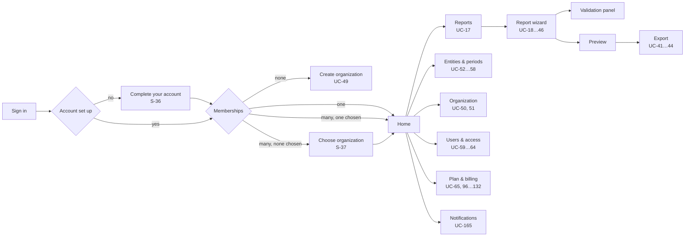

# ESG Platform — Interface and Interaction Design Specification (MVP)

| Field | Value |
|---|---|
| Document ID | design_spec.md |
| Version | 1.0 |
| Status | Consolidated baseline |
| Date | 2026-08-17 |
| Consolidates | *ESG Platform Interface and Interaction Design Specification (MVP)* (primary source); *ESG Platform Use Case Register (MVP)* (UC identifiers); *ESG Platform Functional Requirements (MVP)* (FR identifiers); *ESG Platform System Actors (MVP)* (actor codes) |

---

## 1. Purpose and scope

### 1.1 What this document is

This is the canonical design specification for every human-facing surface of the ESG Platform: the tenant application, the administrative console, the generated documents, and notifications. It states what the interface must do and why, in terms that survive a change of framework, component library or visual identity.

### 1.2 What this document is not

It is not a visual style guide, a page-by-page mockup set, or a component library implementation. It defines the rules a mockup must satisfy and the contract a component library must fulfil. Pixel values, brand colour values and font families are deliberately absent from the source material and therefore absent here; they are supplied by the visual identity layer (§11.2) and swapped without touching this document — including, where required, by substituting the Moldovan state design system wholesale (§11.7).

### 1.3 Normative conventions

- Design rules carry the stable identifiers `UX-n` and use *shall*. They are citable from designs, backlog items and review checklists, and are not renumbered once assigned. All `UX-n` identifiers in this document are reproduced verbatim from the source specification.
- Screen identifiers are `S-nn` for tenant screens and `A-nn` for administrative screens, reproduced verbatim.
- Use cases are `UC-01 … UC-176`. Functional requirements are `FR-1 … FR-173`. Non-functional requirements are `NFR-1` … `NFR-93` (MVP) and `NFR-94` … `NFR-105` (deferred). Design decisions are `D-n`. Architecture decisions are `AD-1 … AD-14`.
- Actor codes are the letter codes `CA`, `RC`, `OA`, `PA`, `BO`, `SYS`. There is no `ACT-*` scheme.
- Descriptive prose carries no obligation.

### 1.4 Scope boundary

MVP scope is the VSME Basic Module B1–B11 **and the Comprehensive Module C1–C9** (promoted 25 Aug 2026, `problem_overview.md` OQ-12 — Comprehensive is a report-level scope flag per D-A, additive over Basic and sold as its own plan scope), self-serve billing, and three live locales — RO (source), EN, RU (§9.1, OQ-1, resolved 18 Aug 2026).

Deliberately not designed for MVP: per-user density switching; user-configurable dashboards; in-product chat support; report collaboration with simultaneous multi-user editing and presence; commenting and review workflow on disclosures; notification assignment and escalation chains; right-to-left support for a fourth locale; native mobile applications; Comprehensive Module screens beyond the Basic Module; XBRL viewer surfaces (Phase 2); advisor and buyer portal surfaces (Phase 2 relationship types).

Each deferred item is an addition to the screen inventory (§4.4) and the component inventory (§11.5) when its requirement is admitted, not a redesign of this specification.

### 1.5 Companion documents and precedence

This document is one of seven baseline files. Each register is owned by exactly one file:

| File | Owns |
|---|---|
| `problem_overview.md` | Problem statement, scope, closed scope decisions |
| `actors.md` | Actors `CA`, `RC`, `OA`, `PA`, `BO`, `SYS` |
| `use_cases.md` | `UC-01` … `UC-176`, design decisions `D-1` … `D-14` |
| `functional_requirements.md` | `FR-1` … `FR-173` |
| `non_functional_requirements.md` | `NFR-1` … `NFR-93` (MVP) and `NFR-94` … `NFR-105` (deferred) |
| `architecture.md` | `AD-1` … `AD-14`, `DR-1` … `DR-11` — this file consolidates, and replaces, the two source titles *Architecture Overview (MVP)* and *System Architecture (MVP)* |
| `design_spec.md` (this file) | `UX-1` … `UX-138`, `S-01` … `S-37`, `A-01` … `A-20` |

Where this document and any of those disagree, they win on their subject and this document is amended.

---

## 2. Design principles and rationale

### 2.1 The single design mandate

> **NFR-76** — a user with no sustainability training completes a first Basic Module report unaided, at ≥ 80 % task success within the target completion time.

Everything in this document is subordinate to that sentence. The platform's competitive position is not that it stores ESG data — a spreadsheet does that — but that it converts a standard written for accountants into a sequence of questions a company owner can answer. The interface is the product. A correct backend behind an interface that an SME owner abandons at module B3 has produced nothing.

### 2.2 Two structural facts

- **The work is intermittent.** A VSME report is assembled over weeks, in short sessions, by people whose day job is something else. Nothing may depend on a session being completed in one sitting, on one device, by one person.
- **The work is seasonal and deadline-bound.** Volume concentrates in April–May, peaking in the final two weeks of May (Art. 33(3), Law 287/2017). Under deadline pressure users do not read; they scan, guess and retry. Every screen shall be designed for the hurried, not the attentive, reader.

### 2.3 Principles

Each principle is stated with the consequence that makes it testable. A principle with no consequence is decoration.

| # | Principle | Consequence |
|---|---|---|
| P1 | **Ask, never quiz.** The user answers questions about their own business; they are never asked to interpret the standard. | Every field carries plain-language help authored at the reading level of a non-specialist (NFR-78). Regulatory citations are available on demand, never in the primary label. |
| P2 | **Never present what will be rejected.** Applicability is resolved before display, not validated after entry. | Conditional fields are shown or hidden live from B1 answers (UC-26, UC-28). The system never renders a field and then refuses its value on grounds the system already knew. |
| P3 | **A gap is an answer.** Absence is always an explicit, reasoned state. | Eight terminal states, never a silent blank (§6.4). "Not material", "not available" and "nil return" are first-class and carried into exports. |
| P4 | **Progress is never lost.** | Autosave without a save action, offline queueing, lossless resume across device and session (UC-35, UC-36), draft flush before logout (UC-06). |
| P5 | **State the consequence before the action.** | Every destructive, irreversible or entitlement-reducing action discloses precisely what changes, before it is committed (NFR-80). |
| P6 | **One finding, one destination.** | Every error, warning and notification resolves to the exact field, record or screen that fixes it (UC-39, UC-166). A message that says something is wrong without saying where is a defect. |
| P7 | **Compliance is legible.** | Version pinning, factor-set version, override attribution, change history and export provenance are visible to the user, not buried in an audit table (UC-34, UC-44, UC-47). |
| P8 | **Money is explained.** | Every charge shows net, VAT with rate and basis, gross, currency and — where a payment rail is unavailable — the reason it is unavailable (UC-112). |
| P9 | **Accessibility is structural, not remedial.** | WCAG 2.2 AA is a design input to the component contract (§10), not an audit performed on finished screens. It extends to the exported PDF (PDF/UA-1). |

### 2.4 Anti-goals

The interface shall not attempt: dashboard-first design (the primary object is a report in progress, not a metrics wall); gamification of compliance progress; AI-authored narrative content presented as the user's own disclosure; dense enterprise data grids as the primary tenant surface; or a mobile-first data-entry model (see §11.4).

---

## 3. Users, contexts of use and device assumptions

### 3.1 Actors as design inputs

Actor definitions are normative in *System Actors (MVP)*. This table adds only what design needs.

| Actor | Typical person | Frequency | Primary device | Domain expertise | Design consequence |
|---|---|---|---|---|---|
| **RC** Reporting Contributor | Owner, office manager, accountant, external bookkeeper | Weeks of intermittent sessions, once a year | Desktop / laptop ≥ 1024 px; tablet for review | None to low | The wizard is the whole product for this actor. Optimise for resumption and for answering without prior knowledge. |
| **OA** Organization Administrator | Owner or finance lead; often the same human as RC | Setup, then oversight; billing events | Desktop | Low on ESG, moderate on business admin | Administration is a *separate mode*, not a permission-filtered variant of the report. |
| **CA** Common Access | Any authenticated user | Every session | Any | — | Account, credential, membership and notification surfaces are identical for all actors. |
| **BO** Billing Operator | Internal finance | Daily, in queues | Desktop, dual-monitor | High | Exception-queue design, keyboard-first, information-dense. Opposite end of the density scale from RC. |
| **PA** Platform Administrator | Internal operations, content, translation | Campaign-shaped (a publish, a migration) | Desktop | High | Staged, reversible, previewable operations with explicit blast-radius disclosure. |
| **SYS** System | — | — | — | — | Has no interface, but *every* SYS use case terminates in something a human sees: a notification, a state change, an exception in a queue. Each shall have a named destination surface (§6.12). |

### 3.2 Surfaces

| Surface | Audience | Auth realm | Device target | Design system relationship |
|---|---|---|---|---|
| **Tenant application** | CA, RC, OA | Tenant session | Entry ≥ 1024 px · full operation at tablet · full readability at phone | Canonical consumer of the design system |
| **Administrative console** | PA, BO | Separate realm, separate host, mandatory MFA | Desktop only (`wide` and `extra`, UX-77) | Same tokens and primitives, different density and composition (§12). **Romanian-only interface**, no locale segment in its URLs — amended 19 Aug 2026, `non_functional_requirements.md` NFR-23 and `architecture.md` OQ-42. Strings are still message keys, so this narrows how many catalogues the chrome ships in, not whether wording is configuration |
| **Generated document** (PDF, Excel) | External readers — banks, buyers, auditors | None | Print and screen reading | Separate print layer sharing tokens; typography and layout diverge deliberately (§11.8) |
| **Notification** (in-app, email) | All | Tenant session / none | Any, including phone | In-app uses the design system; email uses a constrained, client-tolerant subset (§6.12) |
| **External checkout** (acquirer, MIA) | OA | Provider-controlled | Provider-controlled | **Not designable.** The platform designs the hand-off and the return, never the payment page itself (§6.11) |

**UX-1** Every surface shall be reachable and operable without reference to any other surface. A user shall never be told to "ask an administrator" without being told who that administrator is.

### 3.3 Device and connectivity assumptions

Four named breakpoints, defined by capability rather than device. Values live in tokens; the source specifies no pixel values other than the `wide` entry threshold of 1024 px.

| Name | Capability | Tenant behaviour |
|---|---|---|
| `compact` | Phone | Full readability and review; wizard navigation collapses; sustained entry discouraged but not blocked |
| `medium` | Tablet | **Fully operable**, including data entry (NFR-77) |
| `wide` | Laptop ≥ 1024 px | **Optimised for sustained entry** (NFR-8): module list, field content and validation panel simultaneously visible |
| `extra` | Large desktop | Additional context, not additional density — comparatives and history gain space |

**Connectivity.** Assume intermittent, moderate-quality connections and mid-range hardware on 4G for the web-vitals budget (§8.5).

### 3.4 Language context

Interface language, export language and email language are selected independently (UC-14, UC-48; source cites FR-169). Romanian and Russian VSME labels are both platform-authored and carry no official EFRAG standing — **corrected 31 Aug 2026**, when `problem_overview.md` OQ-5 closed and the `2026-05-01` package turned out to ship an empty Romanian label linkbase; **English alone is official at this version**. The interface says so at the point of export selection, not in a help centre. Three locales are live at MVP — Romanian as source, English and Russian each separately authored — resolved 18 Aug 2026; see §9.1 and OQ-1.

**UX-135** Every locale that distinguishes them shall address the reader in the **formal register**, on every surface, without exception — Romanian *dumneavoastră*, Russian *вы*. English has no T-V distinction and is unaffected. **Set 27 Aug 2026, project owner**, closing a question the set had never asked.

It is one rule and not a per-surface judgement, because the surfaces do not partition the way an intuition about "onboarding versus product" suggests. Measured on 27 Aug 2026, Romanian was split almost evenly — informal across the credential funnel (`register`, `verify`, `signIn`, `factor`, `resetRequest`, `setPassword`) and formal across `social`, `invitation`, `credentials` and `organizationUnavailable` — and the two met **inside a single viewport**: S-01 rendered *"Intră în contul tău"* directly beside *"Continuați cu Google"*, because the provider buttons belong to a different namespace from the form they sit under. A rule drawn at the screen boundary would not have caught that, since it is not a screen boundary.

Three things decided it, and the first is the one that makes it cheap:

- **Russian had already chosen.** All eleven namespaces were formal, authored that way independently. Choosing formal changes one file; choosing informal would have meant rewriting Romanian *and* overriding a consistent choice already made in Russian.
- **The register is a property of the product, not of the moment.** This is a statutory-filing tool whose reader is an SME owner, an accountant or a bookkeeper producing a document with legal force. The identity funnel is six namespaces of what will be roughly fifty; the in-product surfaces were already formal, and every screen still to be written — reports, the calculator, exports, invoices, dunning — is closer to them than to a sign-up form.
- **A split register is not a style preference, it is an inconsistency the reader can see.** Task 26.3 already has a reader crossing between S-03 and S-01 twice inside a minute, and the pronoun changed each way.

Accepted cost: formal Romanian is wordier, so the UX-73 +40 % expansion budget is measured against a longer source. That is a layout constraint to meet, not a reason to address the reader inconsistently.

**UX-137** *(Added 12 Sep 2026, closing the name half of OQ-16.)* A person supplies a **given name**
and a **family name** (FR-9). The **display name is derived from them and never stored**, as
`given family` in all three locales — Romanian, English and Russian all place the given name first
in address. Where one part is absent the other stands alone; where both are, the account's email
address stands in. The **monogram** is the first character of each part present, folded to upper
case — one character where only one part is, and none where neither is, in which case the surface
shows its glyph rather than a letter.

**Derived rather than stored, and that is the rule's substance.** A stored display name is a third
value free to disagree with the two it was built from — a rename that updates the parts and not the
composite, or the reverse, with nothing able to say which is right. Deriving it makes the
disagreement unrepresentable, and costs one pure function.

**One order, and the condition under which it stops being enough.** None of the three MVP locales
reverses the order, so the rule states one and no per-locale table exists to keep in step. A locale
whose convention *does* reverse it — Hungarian, Japanese — is registered by FR-63 without redesigning
a screen, and what changes then is **this rule**, not the schema: the two parts are already stored
separately, which is what keeps that amendment a presentation change. Writing the condition down now
is the point of recording it at all.

**It is a presentation rule, so it binds every surface that shows a person**: S-05's greeting, the
account menu's monogram and name, S-16's member list, change attribution (§5's S-15 line), and the
notification and email surfaces that address a recipient. The report cover is **not** among them —
FR-15 makes the contact name printed there the organization's own field, entered on S-15, and it is
not this account's name.

**Three of the five are built; the other two are deferred and each names what it waits on** (task
140, 12 Sep 2026 — recorded here because this is the rule that enumerates them, and a deferral
nobody wrote down is indistinguishable from an omission). The greeting, the account menu and S-16's
list render the derived name. **Change attribution does not**: `profile-attribution.tsx` names the
last editor by address, and converting it is not this rule applied a fourth time but an **API**
change first — the line reads `core.field_change`, whose `actor_id` is a bare uuid by design
(§7.1 permits one cross-schema foreign key and it is not that one), so the name must be resolved at
read time and the organization profile's wire shape carries only `email` today. **The notification
and email surfaces are unbuilt** (tasks 49 … 52) and inherit the rule when they arrive rather than
owing a conversion. Both are the *assumption meanwhile*: until each lands, a person is named by
their address on those surfaces, which is UX-137's own fallback rather than a different rule.

---

## 4. Information architecture and navigation model

### 4.1 The object model as the user experiences it

```
User account  (personal: profile, credentials, language, notification preferences)
  └── Membership → Organization          ← exactly one is "active" per session
        ├── Reporting entity             ← one or many; most SMEs hold one
        │     └── Reporting period       ← pins template + taxonomy version, links prior period
        │           └── Report
        │                 └── Module B1 … B11
        │                       └── Disclosure field  ← the atomic unit of the product
        ├── Users & access
        ├── Plan, usage, billing account, invoices
        └── Notifications (scoped to the active organization)
```

**UX-2** The active organization shall be visible at all times on every authenticated screen, and shall never be inferred from a URL segment or a request header — it is a property of the session (UC-16).

**Amended 15 Sep 2026 (project owner, task 83) — at compact width the active organization is in the drawer.** Below the medium frame the global bar names no organization; the workspace drawer names it in full, with the switcher's control beside it. `EasyESG Workspace.dc.html` draws a band under the bar at that frame instead, and the drawer was chosen over it. What that gives up is stated here rather than left to be discovered: **at compact width the organization is one tap away, not visible at all times.** The truncated name compact width drew until then — a long name cut to `Fa…` at 375 px — did not meet the sentence above either.

**UX-3** Switching the active organization shall return the user to the equivalent screen in the new organization where one exists, and to that organization's home otherwise. It shall never silently discard unsaved work; unsynced changes are flushed first.

**The equivalent screen, decided 15 Sep 2026 (project owner, task 83).** A screen belonging to the account rather than to an organization — its credentials — is the same in every organization and stays. A section's own screen — Home, Reports, Entities & periods, Organization, Users & access — is its own equivalent, where the role held in the new organization may open it. A screen for one record — a report, an entity, a period — and a form that creates one are equivalent to their section's screen, because the record belongs to the organization just left. Anything else, and a section the new role may not open, returns to that organization's home. **Whether the new role may open a section is the api's answer after the switch**, never a table of roles kept in a front end: the role is read from the membership on every request (AD-12).

**UX-4** Every addressable state — a report module, a validation finding, an invoice, an admin queue filter — shall have a stable, shareable, bookmarkable address that restores the same state on load. Deep links are how notifications discharge P6.

### 4.2 Navigation tiers

Three tiers, and no fourth.

| Tier | Contains | Persistence |
|---|---|---|
| **Global** | Active organization switcher, notification centre, user menu (profile, language, sign out), help | Present on every authenticated screen |
| **Workspace** | Home · Reports · Entities & periods · Organization · Users & access · Plan & billing | Present outside the wizard; collapsed or hidden inside it |
| **Contextual** | Module list within a report; tab set within a record; step sequence within a flow | Scoped to the current object |

**Amended 10 Sep 2026 (project owner) — the workspace tier opens with `Home`, and this table had
five entries where the prototype draws six.** `EasyESG Workspace.dc.html` renders the tier as a
52 px band of six items on every artboard at every width — `Home · Reports · Entities & periods ·
Organization · Users & access · Plan & billing` — with **Home first and carrying the current-item
underline** on the home artboard, and abbreviated to `Home · Reports · Entities · Organization ·
Users · Billing` at the narrow width. The five above came from the prototype's own annotation
caption, which omits Home; the artboards it annotates do not. Where the two disagree the artboards
govern, per OQ-10 — they are the delivered design.

**Home is a tab as well as a hub, and §4.3 is not contradicted.** That flow diagram shows Home as
the branch point a signed-in reader lands on; the tier makes all six peers reachable from any of
them, which is what a persistent tier means. The brand mark also links Home (a web convention the
artboards keep) and that is not a duplicate: the tier states where you are, the brandmark does not.

**Amended 15 Sep 2026 (project owner, task 83) — at compact width the switcher is the drawer's.** Below the medium frame the global tier's organization switcher sits in the workspace drawer, beside the name it switches, and the bar carries neither. UX-2 records what that costs.

**UX-5** The wizard shall suppress the workspace tier and replace it with the module list, so that the user's only navigational choice inside a report is *which module*. Exit from the wizard shall be a single, always-visible, explicitly labelled control that states that work is saved.

### 4.3 Primary navigation flow



**UX-136** *(Added 10 Sep 2026 with task 112. The second clause is the project owner's instruction; the destination rule and both carve-outs below were argued from §4.3 and task 25.4 and are the author's.)* **The diagram above is entered by an address as well as by a submission, and it is a gate in both directions.** A request for a screen that requires a session and carries none shall be answered by a way to obtain one, preserving the address as the return destination; a request for a screen whose completion **issues** a session, from a caller who already holds one, shall be answered by resolving the branch above — never by the form. The second half is the one this rule was written for: served the form again, a signed-in reader who submits it replaces their live session in place, and on the registration screen does so as a different account, with nothing on screen saying that this is what happened.

Two clauses bound it, and each is a remedy rather than a nuance. **The destination is the branch, not the home screen** — a member of nothing sent to S-05 lands in an empty workspace stating that they belong to an organization no one can name, which is the failure S-04 exists to distinguish (§4.3, UC-49). And **issuing a session is narrower than the credential set**: password reset and set-password *recover a credential* and shall stay reachable to a signed-in reader, because a reset link is opened on whatever device is to hand and that device is frequently one already signed in (UC-08, UC-09). Confirming an address and accepting an invitation are likewise ordinary things for a signed-in reader to do (UC-03, UC-15) and are not gated.

**The first clause says *that* the gate answers and *what it must preserve*; it takes no position on how, and deliberately does not cite UX-38 for the whole of it.** UX-38 governs a narrower case — *session **expiry***, with UC-07's precondition *"a session has expired through inactivity or timeout"* — where there is preserved context and queued work to return to, and it requires re-authentication *"inline over the preserved context, never as a redirect to a blank sign-in screen"*. This clause is wider: a visitor who has never signed in reaches it too, and has no context for anything to be inline over. So the two compose rather than one containing the other. **Where both apply, UX-38 governs.** **On S-07 it is met since task 92** *(amended 15 Sep 2026)* — the wizard, which is where the queued work UX-38 exists to protect actually is: a write refused for want of a session, or a step change or exit that finds the session gone, opens re-authentication over the step, and the step is never left. **Everywhere else it is still unmet** — the session tier redirects with `?return=`, which is what UX-38's second sentence rules out — and that includes a reload or a typed address inside the wizard and the global tier's links from it, which no screen can intercept; the same gap on a cold `/home` or `/account/credentials` is unowned and unscheduled, and saying so is the point of this sentence. Nothing task 92 ships changes this rule.

What this rule adds, and what nothing said before, is that the **other** direction is a gate at all.

**A control that *offers* a session-issuing address is not a violation of this rule, and its wording may become one.** The public tier's *Sign in* and *Create an account* are session-blind by §5.1b's own requirement — *"they carry no session: nothing on them may read or imply an active organization"* — so a signed-in reader who presses one is answered by the branch, which is the right destination and needs no variant. What is not covered by that is a control offered as a **remedy** to a reader the screen already knows is signed in: S-03's unusable-invitation exit and the acceptance-problem callout both read *"Go to sign in"* to someone who has one, so the words now describe something that cannot happen, which is `CLAUDE.md`'s user-facing-text rule rather than this one. **Task 114** owns them.

**UX-6** The authenticated home screen shall answer three questions above the fold, in this order: *what needs my attention*, *where did I leave off*, *what is the state of everything*. For a single-entity organization this reduces to one resumable report and its completion state; the same template shall scale to a multi-entity organization without a different screen (UC-67).

### 4.4 Screen inventory (sitemap)

Screens are design containers; a screen may serve several use cases and a use case may span several screens. Identifiers are verbatim from the source. The archetype column refers to §4.6.

| # | Screen | Actor | Serves | Archetype |
|---|---|---|---|---|
| S-01 | Sign in / register / provider choice | CA | UC-01 … 05, UC-194, UC-195 | Focus |
| S-02 | Verify email · reset password · set password | CA | UC-03, 08, 09 | Focus |
| S-03 | Accept invitation | CA | UC-15 | Focus |
| S-04 | Create organization | OA | UC-49 | Focus |
| S-05 | Home / organization overview | all | UC-16, 67 | Workspace |
| S-06 | Reports index | RC, OA | UC-17 | Index |
| S-07 | **Report wizard — module step** | RC | UC-18 … 31, 37, 45, 46, 183 … 192 | Wizard |
| S-08 | Validation panel (in-wizard, persistent) | RC | UC-37 … 40 | Panel |
| S-09 | Carbon calculator | RC | UC-32 … 34 | Wizard sub-flow |
| S-10 | Report preview | RC | UC-41 | Document |
| S-11 | Export dialogue and history | RC | UC-42 … 44, 48 | Panel + Index |
| S-12 | Field change history | RC, OA | UC-47 | Panel |
| S-13 | Entities index and entity record | OA | UC-52 … 55 | Index + Record |
| S-14 | Reporting periods | OA | UC-56 … 58 | Index + Record |
| S-15 | Organization profile and identifiers | OA | UC-50, 51 | Record |
| S-16 | Users & access | OA | UC-59 … 64, 175 | Index |
| S-17 | Plan, entitlements and usage | OA | UC-65, 66 | Status |
| S-18 | Plan comparison and selection | OA | UC-96 … 98 | Comparison |
| S-19 | Order, summary and confirmation | OA | UC-110 … 115 | Wizard |
| S-20 | Payment hand-off and return | OA | UC-116 … 121 | Focus + Status |
| S-21 | Payment instruments | OA | UC-118, 119 | Index |
| S-22 | Invoices and documents | OA | UC-132, 157 | Index |
| S-23 | Billing account | OA | UC-108 | Record |
| S-24 | Subscription status and history | OA | UC-99 … 107 | Status + Index |
| S-25 | Enterprise request | OA | UC-153 | Focus |
| S-26 | Notification centre | CA | UC-165 … 167 | Index |
| S-27 | Profile, language, notification preferences | CA, all | UC-13, 14, 168 | Record |
| S-28 | Credentials and linked identities | CA | UC-10 … 12, UC-193 | Record |
| S-29 | Marketing home | VI | UC-177 | *escalated — OQ-17* |
| S-30 | Legal documents (terms · privacy · cookies) | VI, all | UC-178 | *escalated — OQ-17* |
| S-31 | Cookie choice | VI | UC-179 | Focus |
| S-32 | Help centre | VI, CA | UC-180 | Index |
| S-33 | Help article | VI, CA | UC-181 | *escalated — OQ-17* |
| S-34 | Write to support | VI, CA | UC-182 | Focus |
| S-35 | Organization unavailable | CA | UC-16 (failure path) | Focus |
| S-36 | Complete your account | CA | UC-02, UC-03 | Focus |
| S-37 | Choose organization | CA | UC-16 | Focus |
| A-01 | Admin sign-in (MFA) | PA, BO | UC-68 | Focus |
| A-02 | Organization register | PA | UC-69 | Index |
| A-03 | Content and translation console | PA | UC-71 … 74 | Editor + Publish |
| A-04 | Taxonomy versions, mappings, migration runs | PA | UC-75 … 79 | Editor + Batch |
| A-05 | Factor sets, thresholds, validation rules | PA | UC-80 … 82 | Editor |
| A-06 | Adoption metrics | PA | UC-83, 84 | Dashboard |
| A-07 | Support access request and audit log | PA | UC-85, 86 | Focus + Index |
| A-08 | Admin accounts and system audit log | PA | UC-87, 88 | Index |
| A-09 | Plan catalogue, entitlements, pricing, discounts | BO | UC-89 … 95 | Editor |
| A-10 | Reconciliation workspace | BO | UC-137 … 140 | Exception queue |
| A-11 | Collections and dunning | BO | UC-141 … 144 | Exception queue |
| A-12 | Invoicing, credit notes, numbering series | BO | UC-126 … 136 | Index + Record |
| A-13 | e-Factura transmission exceptions | BO | UC-130 | Exception queue |
| A-14 | Refunds and chargebacks | BO | UC-145 … 147 | Exception queue |
| A-15 | Enterprise quotes and contracts | BO | UC-153 … 159 | Record |
| A-16 | Revenue, VAT export, billing audit ledger | BO | UC-160 … 164 | Dashboard + Index |
| A-17 | Notification categories and templates | PA | UC-176 | Editor + Publish |
| A-18 | Identity provider configuration | PA | UC-70 | Editor (built as Record) |
| A-19 | My credentials (operator's own password, second factor, recovery codes) | PA, BO | UC-212 | Record |
| A-20 | Accept an administrator invitation | PA, BO | UC-87 | Focus |

**Count:** 57 screens — 37 tenant (`S-01 … S-37`) and 20 administrative (`A-01 … A-20`). **S-37 was added 15 Sep 2026** with task 83, when §4.3's *Choose organization* step became a screen of its own rather than a prompt in the global tier. **S-36 was added 14 Sep 2026** with task 155, when a provider registration gained its password and name steps. **A-20 was added 13 Sep 2026** with task 67.4, when account creation moved to invitation: the invitee sets their own password and second factor on a screen A-01 cannot be, since A-01 admits a credential that already exists. *(This line read 52 and `S-01 … S-34` until 12 Sep 2026; S-35 was added with task 25.4 on 25 Aug 2026 and carries both an inventory row and a §5 entry, so the count had been one short of its own table for a fortnight — found while adding A-19.)* **A-19 was added 12 Sep 2026** with UC-212 and FR-80's amendment: the realm had no surface for an operator's own credentials at all, and it is a screen of its own rather than a region on A-08 because A-08 is *other people's* accounts — putting self-service there is two ideas on one screen. `S-29 … S-34` were added 24 Aug 2026 closing OQ-12, with the Visitor actor (`actors.md` §4) and UC-177 … UC-182 that UX-7 requires them to trace to. **UX-7 gains no exemption class** — the horn OQ-12 offered — because these screens now trace to use cases like every other, which is what the rule asks for rather than a way around it.

### 4.5 Use cases served without a dedicated screen

Three use cases are served by global-tier elements and inline patterns rather than dedicated screens:

| Use case | Destination |
|---|---|
| UC-06 — log out | User menu, with draft flush per UX-37 |
| UC-07 — re-authenticate after session expiry | Inline over preserved context, UX-38 |
| UC-16 — switch active organization | Global switcher, UX-2, UX-3 — and S-37 where the session has chosen no organization (OQ-6, amended) |

`SYS` use cases have no screen of their own and terminate in a destination named under UX-61.

**UX-7** No screen shall exist that is not traceable to at least one use case, and no use case with a human actor shall be without a screen, a named global-tier pattern or a **named exemption below**. **Amended 18 Aug 2026 (OQ-5) — two exemption classes, each exhaustively enumerated.** *Pattern-discharged:* **UC-35** (autosave in-progress report data) and **UC-36** (resume an in-progress report draft), both discharged by the draft-integrity pattern inside S-07 (UX-34 … UX-39) — they are continuous behaviours of a screen, not destinations, and inventing inventory entries for them would make the inventory describe things that are not screens. *Inactive at MVP:* **UC-122** (pay through the merchant-of-record checkout), registered as an adapter and inactive per D-8 and FR-114; it gains a screen when the rail is activated, not before. Any addition to either list is an amendment to this rule, not a note. The inventory in §4.4 remains the coverage contract.

> **Resolved 18 Aug 2026 (OQ-6) — UC-16 is split by behaviour, not assigned twice.** UC-16 is *View memberships **and** switch active organization*, which is two behaviours in one use case. **S-05 owns "view memberships"** — the list of organizations the user belongs to is screen content. **The global-tier switcher owns "switch active organization"** — changing session scope is a persistent global action available from every screen, not a behaviour of any one of them. A coverage audit counts UC-16 once, against both owners, with no double count.

> **Amended 15 Sep 2026 (project owner, task 83) — where the session has chosen no organization, the switch is S-37's.** The switcher names the organization a session acts for, so a session acting for none has no switcher to choose from: the global tier draws its empty state (UX-2). §4.3's *Choose organization* step is therefore a screen, S-37, and it owns *switch active organization* in exactly that state — after sign-in, and wherever a choice left stale by a removal is met. A coverage audit still counts UC-16 once, now against three owners of three behaviours: S-05 views the memberships, the switcher switches between them, and S-37 chooses where none is chosen.

> **Resolved 9 Sep 2026 (task 103) — an address that resolves to no screen is a pattern, not a
> screen.** Two surfaces answer a request that reaches no destination: **not found**, where the
> address does not exist, and **not yet available**, where the route is real and its screen has not
> shipped. Neither is an inventory row in §4.4, and the reason is UX-7's own test rather than an
> exemption from it — UX-7 governs *screens*, and every screen it governs is a destination serving a
> use case. These are the application's answer when **no** destination applies, so there is no use
> case to trace to and none worth inventing; that is the same reasoning which keeps UC-06, UC-07 and
> UC-16 in the table above rather than in §4.4. They are defined instead as the `error — not found`
> and `error — not yet available` states in §8.1, and they are drawn in the **Focus** archetype's
> centred column wherever the surrounding layout does not already supply one. **Two surfaces rather
> than one state with a flag**, because the reader's next step differs: a wrong address is corrected
> by going somewhere real, and a deferred one is corrected by waiting. **This does not close
> OQ-21**, which asks the neighbouring question — when a *destination* needs an `S-nn` row — and is
> untouched by a rule about the absence of one. §4.4's count stays at 52.

### 4.6 Page archetypes

Ten templates. Every screen is an instance of one; a screen that fits none is an escalation to design review, not a licence to invent — a clause used once, on 24 Aug 2026, and answered by the tenth row below rather than by an exception.

| Archetype | Purpose | Fixed elements | Notes |
|---|---|---|---|
| **Focus** | One task, no navigation | Single column, centred, one primary action | Auth, invitation, organization creation, payment return |
| **Index** | Find one among many | Filter, sort, empty state, row action, pagination or progressive load | Never the primary tenant surface; always has an empty state that teaches |
| **Record** | View and edit one object's attributes | Identity header, grouped fields, save/cancel affordance, change attribution | Explicit save, unlike the wizard |
| **Wizard** | Ordered progression with completion state | Step list, step content, progress, autosave indicator, exit | The report, the calculator, the order |
| **Panel** | Auxiliary context beside a primary task | Dismissible, non-modal, retains position | Validation, history, export |
| **Document** | Faithful preview of a rendered artefact | Page-shaped, paginated, print-accurate | Report preview |
| **Status** | Current state of a long-lived thing | State name, what it means, what changes it, next date | Subscription, plan, entitlements |
| **Exception queue** | Work a human must resolve | Dense table, saved filters, bulk action, per-item resolution with mandatory rationale | Admin only; keyboard-first |
| **Dashboard** | Aggregate view | Figures with confidence marking, period filter, export | Admin only; never the tenant home |
| **Content** | Be read | Reading measure rather than the workspace grid — 64–70ch for prose, up to 100ch for wider blocks; heading hierarchy as the navigation; a peer strip where the page is one of a set; no primary action required; no chrome of its own beyond the public shell | The only archetype with no authenticated instance, and the only one §14.2 permits the framework to cache |

**UX-8** Each archetype shall define every state in §8.1 before any instance of it is designed.

**Resolved 24 Aug 2026 (OQ-17) — a tenth archetype, not a composition.** The nine were derived from an authenticated application and had no template for a page whose job is to be read, which only became visible when `S-29`, `S-30` and `S-33` entered the inventory. **OQ-7's own test decided it**: OQ-7 rejected promoting compositions to archetypes because that "would put two names on one state set", and the inverse applies here — composing *Content* from *Document* would put one name on two different sets, since Document's states are those of a generating artefact preview (loading, pending — async, partial) and a reading surface's are ready, error — recoverable and error — not found. The eight states **Content** excludes are excluded because nothing on it is a task; that exclusion list is the argument for the row. **Derived from the delivered prototypes**, per OQ-10 — the reading measures above are the dominant values in `EasyESG Public Legal.dc.html` (70ch across thirty blocks) and `EasyESG Public Home.dc.html` (64ch), and the peer strip is the legal set's tab strip. Values are to be extracted through `packages/ui`, never copied as markup.

**Resolved 18 Aug 2026 (OQ-7).** Two labels in the inventory are not among the nine: *Wizard sub-flow* (S-09) and *Comparison* (S-18). They are **compositions, not archetypes** — S-09 composes **Wizard**, S-18 composes **Index/Status** — and the rule is now stated rather than implied: **a composition inherits the complete state set of its base archetype and defines no states of its own.** That satisfies UX-8, which requires every archetype to define every state before an instance is designed: a composition has a full state definition, inherited. Adding two more archetypes was rejected — it would put two names on one state set, which is what OQ-4's validation-state finding shows going wrong elsewhere.

---

## 5. Screen specifications

### 5.0 How to read these specifications

Each screen below is specified against a fixed template: identifier and name (verbatim), purpose, primary actors, entry points, layout and regions, content and data shown, controls and actions, states, validation behaviour, exits, and related use cases and functional requirements.

Three limits on what follows must be stated plainly, because the alternative is invention:

1. **Layout and regions** are given as the fixed elements the screen inherits from its archetype (§4.6) plus any region the source names explicitly (for example the wizard's module list, the disclosure field anatomy, the save-state indicator). The source specifies no per-screen wireframes, no column allocations and no pixel geometry. Where nothing further is stated, this document says so rather than filling the gap.
2. **States** are drawn from the eleven-state model in §8.1. Only the states the source makes applicable are listed. `UX-90` requires every applicable state to be designed before implementation; the enumeration here is the checklist, not a design.
3. **Entry points and exits** are derived from the navigation flow (§4.3), the use case preconditions, and the notification deep-link obligation (UX-4, UX-63). Where a route is not evidenced in the sources it is not asserted.

### 5.1 Tenant screens

### S-01 — Sign in / register / provider choice

- **Purpose:** admit a user to the platform, or create the account that will hold their memberships.
- **Primary actors:** CA.
- **Archetype:** Focus.
- **Entry points:** unauthenticated arrival at the tenant application; an expired invitation or reset link that requires a fresh sign-in; **a live invitation handed off from S-03** (added 25 Aug 2026, task 26.3) — which carries `?return=` back to S-03 and, on the registration route, the invitation itself, so the account created there is already verified and the invitee returns able to accept. The screen states which organization is inviting them, because a credential form arrived at from an email link is otherwise unexplained.
- **Layout and regions:** single column, centred, one primary action (Focus fixed elements). Email/password entry and the enabled social provider choices are presented on the same surface — **one card, with the provider choices below the rule inside it, and the route to password reset on the password field's own label row** (added 4 Sep 2026 from the artboard, which draws all three at 1440, 834 and 390; this row previously read *"no further per-screen layout is specified in the source"*, which left placement to whoever built the screen and produced a reset link floating below the card).
- **Content and data shown:** email address and password inputs; **on the register step, a given name and a family name, both required** (FR-9, UX-137; `design_spec.md` OQ-16's name half closed 12 Sep 2026 — the artboard drew one *full name* field and the product stores two, because a monogram and a salutation each need to know which part is which); **the choice to be kept signed in on this device**; the set of currently enabled identity providers (Google and Microsoft at MVP, per FR-2, enabled or disabled through A-18 / FR-82); route to registration; route to password reset.
- **Controls and actions:** sign in with password; sign in with a provider; register; request a password reset; **choose whether the session persists on this device — the choice governs the credential form, the provider choices being plain anchors that carry no client state**; **supply a second-factor code, or a recovery code instead, where the account has one enrolled**.
- **States:** loading — initial; **second factor required** — a staged step reached only after a correct password on an *enrolled* account, offering the code field and the route to a recovery code (UC-194, UC-195; added 26 Aug 2026); error — recoverable (failed credential, rate-limited, locked out after threshold, per FR-4); error — recoverable (a wrong or spent second-factor code, which leaves the user on the staged step to retype it and counts toward the same FR-4 threshold); error — recoverable (verification pending — the account is unverified and the presented password was **correct**; the answer names verification as the blocker and routes to S-02's resend. Added 21 Aug 2026, `architecture.md` OQ-57 — a wrong password on an unverified account stays inside the uniform failed-credential state); error — permission (an identity presented that is linked to no account is offered registration rather than silently signed in, UC-05).
- **Validation behaviour:** credential failures are rate-limited and locked out after a threshold. **UX-108** applies with force here: no cognitive function test shall be required to sign in, and password managers and paste shall work everywhere.
- **Exits:** per §4.3 — no memberships → S-04; exactly one membership → S-05; more than one → S-05 where the session names one still held, and S-37 otherwise (added 15 Sep 2026, task 83). Registration by password exits to the verification challenge (S-02).
- **Use cases:** UC-01, UC-02, UC-03 (provider-asserted case), UC-04, UC-05, **UC-194, UC-195**.
- **FRs:** FR-1, FR-2, FR-4, FR-82. **Requirements:** NFR-95.

**The second-factor step was added 26 Aug 2026** (task 27.2's open-question batch), with UC-194 and
UC-195. It is the same two-step shape A-01 already stages for the admin realm and it is deliberately
**not** the same screen: NFR-65 keeps the two realms disjoint, so the tenant step is built here over
task 21's sign-in rather than reached from the console's. Two properties the artboard must hold.
**An account with no factor is never challenged** — NFR-95 is opt-in, and a step everyone sees is
enforcement. And the step must not say more than a correct password already says: reaching it
discloses that this account has a factor, which is why nothing before the password may hint at one
(NFR-64).

**It is a staged step with its own address** (`/sign-in/factor`, built 27 Aug 2026). That is not a
contradiction: S-02 is already one `S-nn` over three routes, and UX-4 requires an addressable state
to be addressable. What makes the step *staged* is its precondition — it renders only while the
sign-in challenge is held, and opened directly it returns the reader to the password. Two
affordances share it, per the controls list above: the authenticator code, and the recovery code
offered on the same surface rather than behind a support request, because UX-108's point is that a
person without their authenticator must not need a second device to get in. The step carries its
own **expired** state, since the challenge is time-bounded and the reader may be reading it from a
phone screen: the form is replaced by what happened, what it means and the way back to S-01
(NFR-79), not by a refusal that invites a retype the server would reject.

### S-02 — Verify email · reset password · set password

- **Purpose:** prove control of an email address, and set or replace a password from a link.
- **Primary actors:** CA.
- **Archetype:** Focus.
- **Entry points:** a time-limited verification link; a single-use, time-limited reset link; the reset-request route from S-01.
- **Layout and regions:** single column, centred, one primary action. No further per-screen layout is specified in the source.
- **Content and data shown:** the address being verified or reset; the password policy; for a reset request, a response identical whether or not the address is registered (UC-08). **For an account holding no password, the set-password step and its success read as setting a password rather than replacing one** — the link sent to such an account says so (added 14 Sep 2026, task 155; `architecture.md` §12.5.6's task-155 row (8)).
- **Controls and actions:** request a reset; set a new password; confirm verification; **request a new confirmation link** (added 20 Aug 2026, `architecture.md` OQ-55 — the link expires in 24 h while the unverified account lives 7 days, so this is the state's only exit). Like the reset request, its response is identical whether or not the address is registered.
- **States:** loading — initial; success (account active, next step offered); error — recoverable (link expired, link already consumed, password fails policy).
- **Validation behaviour:** password policy enforced on entry with the three-part message formula (§8.2). **The policy is stated as of 20 Aug 2026** — ≥ 8 and ≤ 128 characters requiring a lowercase letter, an uppercase letter, a digit and one further character (`architecture.md` §12.5.6, OQ-51); it is displayed before entry rather than only on failure, and **UX-108** binds here as it does on S-01, so paste and password-manager autofill must work on every field. Account enumeration is prevented by an invariant response. Consuming a reset link invalidates all existing sessions for the account (FR-6), which the screen must state as a consequence before it happens (P5).
- **Exits:** on verification, the founding-organization flow (S-04) or a pending invitation (S-03) becomes available — **or, for an account registered through a provider, S-36's password step, open for 15 minutes from the confirmation** (added 14 Sep 2026, task 155); on reset completion, S-01.
- **Use cases:** UC-03, UC-08, UC-09.
- **FRs:** FR-3, FR-6.

### S-03 — Accept invitation

- **Purpose:** convert an invitation into a membership with an assigned role.
- **Primary actors:** CA.
- **Archetype:** Focus.
- **Entry points:** the single-use invitation link sent from S-16.
- **Layout and regions:** single column, centred, one primary action. No further per-screen layout is specified in the source.
- **Content and data shown:** the inviting organization; the role being granted (edit or view-only); the invited email address, to which the invitation is bound.
- **Controls and actions:** create an account by password; create an account by provider; sign in to link an existing account; accept. **Amended 25 Aug 2026 (task 26.3's unknowns batch, project owner):** the first three are **routes, not forms**. S-03 hands off to S-01 carrying `?return=` back to itself, rather than hosting a second copy of the registration and sign-in forms — which keeps this screen a true Focus (one task, one primary action, and `accept` is it) and keeps S-01 the single place a credential is entered. The registration route additionally carries the invitation, so the account it creates is already verified (FR-3, `architecture.md` §12.5.6's task-26.2 row); without that the invitee would wait for a second email in the one flow that amendment exists to spare them.
- **States:** loading — initial; error — recoverable (invitation expired, already used, revoked — and **not found**, added 25 Aug 2026: a mistyped or truncated link is its own sentence rather than a variant of "expired", and `architecture.md` §12.5.6's task-26.2 row carries the four as a closed vocabulary the API publishes); error — permission (a provider identity asserting an address other than the invited one is refused, UC-15 — **and equally an existing session signed in as any other address**, which is the same refusal reached without a provider). **The permission state carries its own resolving action (25 Aug 2026):** it names the address the invitation is bound to alongside the one currently signed in, and offers to sign out and return here as the invited person — the second way out being to ask the administrator for an invitation to the address actually in use.
- **Validation behaviour:** the invitation binds to the invited email address; a social sign-in is accepted only where the provider asserts that same address.
- **Exits:** S-05 in the newly joined organization. **An invitee who registered through a provider completes S-36 first and returns here to accept** (added 14 Sep 2026, task 155).
- **Use cases:** UC-15.
- **FRs:** FR-11.

### S-04 — Create organization

- **Purpose:** create the organization record and make its creator its administrator.
- **Primary actors:** OA (the creating user is granted the role by the act, D-1).
- **Archetype:** Focus.
- **Entry points:** a verified account with no memberships (§4.3); an existing user creating an additional organization.
- **Layout and regions:** single column, centred, one primary action. No further per-screen layout is specified in the source.
- **Content and data shown:** legal name, country, contact details.
- **Controls and actions:** create.
- **States:** loading — initial; error — recoverable; success (administrator role granted, home offered).
- **Validation behaviour:** required-field validation on the identity fields; the deeper fiscal and identifier validation belongs to S-15 and S-23.
- **Exits:** S-05.
- **Use cases:** UC-49.
- **FRs:** FR-13, FR-14.

### S-05 — Home / organization overview

- **Purpose:** answer, above the fold and in this order, *what needs my attention*, *where did I leave off*, *what is the state of everything* (UX-6).
- **Primary actors:** all authenticated actors in the tenant realm (CA, RC, OA).
- **Archetype:** Workspace composition (global tier + workspace tier + content).
- **Entry points:** sign-in; organization switch; notification deep link; wizard exit; the workspace navigation.
- **Layout and regions:** global tier persistent (organization switcher, notification centre, user menu, help); workspace tier present; content answers the three UX-6 questions in order. The same template shall scale from a single-entity organization to a multi-entity organization without a different screen.
- **Content and data shown:** the resumable report and its completion state; every entity and period in the organization with completion and validation status (UC-67, FR-23); attention items.
- **Controls and actions:** resume a report; open an entity or period; switch active organization; open the notification centre.
- **States:** empty — first use (no entity or period yet: teaches the object and offers the one action that creates it); loading — initial (skeleton matching final layout); loading — refresh (prior content stays visible); partial (some data resolved, some failed, with per-part retry); **error — permission** (added 7 Sep 2026 with task 32.4, and it is S-06's addition of 5 Sep applied where it also holds: the overview read is open to every member, so a request whose organization did not resolve arrives here rather than at a role refusal — UX-1's boundary, naming who can grant access. It was implemented before it was listed, which is the omission UX-90 calls a defect); error — recoverable; read-only (view-only membership: the same entries, and the one write — starting a report — absent, per FR-25's clause).
- **Two amendments taken with task 30.5** (29 Aug 2026, project owner), both because the prototype describes a screen with data behind it and this one has none yet. **UX-6's three regions ship as one**, named for what it will hold: all three are report-derived, reports arrive with task 31, and three "nothing yet" boxes above the fold teach a reader that two thirds of their home is broken where one honest region says the product is unfinished here. Task 32.4 splits it into UX-6's order once there is data to order. **The heading names the active organization, not the reader.** *"Good afternoon, Ana"* needed a display name registration did not collect (OQ-16) and a time-of-day the server cannot know for the reader; the organization's name is what UX-2 already requires to be visible and is the more useful thing on a screen whose whole job is orientation. **OQ-16's name half closed 12 Sep 2026 and registration now collects one, so the first half of that condition is met — and task 140 built it.** The greeting is the `h1`, naming the reader by UX-137's derived display name, and the organization moved to the `hgroup`'s tagline beside the role: that is the artboard's own anatomy, and it keeps the second of task 30.5's two reasons intact rather than discarding it with the first. The organization must stay visible (UX-2) and it does, twice — on the band's plate and on this line. **The name may be the address**, for an account predating task 139 or a provider sign-up whose assertion carried none, and that is UX-137's fallback rather than a case this screen special-cases. **The second half of that condition — the time of day — is still not met, and it did not block the greeting**: the salutation is a plain one because the server cannot know the reader's local hour, the session carrying a locale and not a zone. **That half belongs to this amendment and not to OQ-16**, whose two questions are the register's name field and its consent checkbox; citing OQ-16 for a clock is the conflation OQ-23 and OQ-24 were each raised to undo. So it is *Bine ați venit* / *Welcome* / *Добро пожаловать*, each authored in its own locale and each formal (UX-135), where *bună ziua* would have been one of three times of day picked blind.
- **The arrival sentence** (recorded 26 Aug 2026, review; built with task 30.5): `POST /invitations/acceptance` answers a `grant` of `created` / `reactivated` / `already_member`, and S-03's exit lands here — so this screen says which happened. Without it somebody who already had access sees exactly the landing a new member sees, and learns nothing from having clicked.
- **The three regions, split with task 32.4** (7 Sep 2026), which is what the amendment above deferred. UX-6's order is built from what exists: *what needs my attention* is every entity and period whose filing is not settled, soonest deadline first, with a passed due date marked; *where did I leave off* is the report touched most recently, resuming through S-07's own resolver rather than at a step this screen picks; *what is the state of everything* is FR-23's table, one row per entity and period **including the periods no report has been opened against** — which is the row the readiness question most needs and the reason the overview reads periods rather than reports (`architecture.md` §12.5.6). **Completion and validation status are refused, not drawn empty**, their owners recorded: the roll-up is task 41.3's and findings are task 40's, exactly as S-06 refused the same two columns. **No *due soon* threshold is invented** — deadline lead times are FR-173's notification configuration, unbuilt — so the screen states a deadline that has **passed**, which is a comparison rather than a number somebody chose, read in the period's own timezone because NFR-34 makes that a legal question. **UX-13 is discharged on the row rather than assumed**: a locked period and a view-only membership both remove a row's action, so the locked one says so — three causes must never produce one indistinguishable read-only state, and the third (a suspended entitlement, UC-142) is task 54's and absent rather than guessed at. **UX-6's *"and its completion state"* is the half deferred with those two refused columns**, named here so the deferral is visible where the rule is rather than only where the columns are. **The resume region renders only when there is a report to resume**, and it is a sentence and a link rather than a fourth copy of a row: UX-6 orders three questions and says a single-entity organization *"reduces to one resumable report"*, which a third drawing of the same row would contradict.
- **`loading — initial` became a region's rather than the screen's** (11 Sep 2026, task 115). The four regions are sibling Server Components and only the overview waits on a read of its own (`GET /periods`); the heading and the membership list resolve from the memberships the global tier is already reading, so the shell paints and the filings stream in behind one Suspense boundary. **The skeleton matches the region's commonest shape, not its widest**, which is the judgement *"matching the final layout"* leaves once a region can resolve four ways: three filing panels is what an organization with filings gets and what every reader sees after their first visit, while the empty, permission and recoverable-error arms are each a panel too — so the shift on those is a panel's height rather than a screen's. A spinner was built first and was wrong: UX-115 reserves those for *"indeterminate waits with no known shape"*, and here the shape is known — the uncertainty is over which of four, not whether there is one.
- **Validation behaviour:** none of its own; it presents roll-ups computed by the validation service (§6.4).
- **Exits:** S-06, S-07, S-13, S-14, S-15, S-16, S-17, S-26.
- **Use cases:** UC-16, UC-67.
- **FRs:** FR-12, FR-23.

### S-06 — Reports index

- **Purpose:** find the entity/period combination to work on.
- **Primary actors:** RC, OA.
- **Archetype:** Index.
- **Entry points:** workspace navigation — live since task 32.2.2, which is when this screen became the first thing §4.2's set points at; S-05; a return from the creation flow. **The workspace navigation tier is built with this screen** (26 Aug 2026, task 26.4's batch): S-16 is the first `(app)/(workspace)` instance, and §4.2's second tier is a named entry in §11.5's inventory, so it lands in `packages/ui` with its state set rather than as chrome inlined in a layout (UX-89). **Task 30.1 built the global tier above it (29 Aug 2026)** and, rather than extending this tier's link set, took one entry out of it: S-28 sat here only because no account corner existed to hold it, and §4.2 puts credentials under the user menu. The set grows again with tasks 30.3, 30.4 and 30.5, whose screens are the ones §4.2 actually names here.
- **Layout and regions:** Index fixed elements — filter, sort, empty state, row action, pagination or progressive load. **All five ship (26 Aug 2026, task 26.4's batch), pagination included**, even though `/members` and `/invitations` are unpaginated by design — the API bounds the collection by the plan's seat allowance, so the paging is over the loaded list. Decided by the project owner against building a partial instance of the archetype: S-16 is the product's **first Index**, and what it does is what the next four Index screens will be read as licence to do.
- **Content and data shown:** accessible entities and periods with completion and validation summary, reflecting per-report permissions so a view-only member sees the same entries without edit affordances (UC-17, FR-25). **Amended 5 Sep 2026 (task 32.2.2):** each row also carries the report's **scope**, its **last activity** and its **pinned template and taxonomy versions** — the last because DR-4 is only checkable by a reader if the pin is on the screen. The completion and validation summary is refused with its owners named (tasks 41.3 and 40; `architecture.md` §12.5.6), and *last activity* ships without the actor the artboard draws, which is §6.13/UX-68's and has no owner yet.
- **Controls and actions:** filter; sort; open a report.
- **States:** empty — first use (teaching empty state, per Index note in §4.6); empty — filtered (distinguishes "nothing matches" from "nothing exists" and offers to clear the filter); loading — initial; loading — refresh; error — recoverable; **error — permission** (added 5 Sep 2026 with task 32.2.2: the read is open to every member, so this is the state a request whose organization did not resolve arrives in — the same state S-13 and S-15 carry, and distinct from the one below); read-only (view-only membership — the two writes disappear and the entries do not, which is FR-25's clause read literally).
- **Validation behaviour:** none of its own.
- **Exits:** S-07; the report creation flow (see OQ-21), which returns here on cancel.
- **Use cases:** UC-17, and UC-18 through the creation flow.
- **FRs:** FR-25, and FR-26 through the creation flow.

### S-07 — Report wizard — module step

- **Purpose:** the whole product for the RC actor: capture the eleven Basic Module sections B1–B11 — and, when the report's scope flag is Comprehensive, the nine C1–C9 sections additively over them (FR-177, OQ-12) — as a sequence of answerable questions.
- **Primary actors:** RC.
- **Archetype:** Wizard.
- **Entry points:** S-06; S-05 resume; a validation finding deep link (UX-22); a notification deep link (UX-63); return from S-09, S-10, S-11.
- **Layout and regions:**
  - Workspace tier suppressed and replaced by the **module list** (UX-5), persistent and always visible, carrying a per-module state indicator.
  - **Step header** showing, without scrolling, the module name in plain language alongside its standard reference (`B8 — Workforce characteristics`), completion and validation state, and how many fields remain outstanding (UX-11).
  - **Step content** composed of disclosure fields (§7.1), constrained to the reading measure of UX-74.
  - **Save-state indicator** in one fixed location (UX-35).
  - **Exit control**, single, always visible, explicitly labelled, stating that work is saved (UX-5).
  - **Validation panel** (S-08) beside the step content, simultaneously visible at `wide` (§3.3).
- **Content and data shown:** disclosure field labels, help text, values, units, state markers; prior-period value adjacent to the current input where a prior period exists (UX-31); provenance for values derived elsewhere, such as B3 from the calculator (UX-12); B1 values pre-populated from the entity master record but editable in place (FR-27, UX-109).
- **Controls and actions:** enter a value; choose a unit from a constrained list; mark a field not available with a reason; declare a section omitted as classified or sensitive information; carry a prior value forward per field or per module; run validation; open the calculator; open field history; preview; export; exit.
- **States:** empty — first use (a period newly opened, no answers yet); loading — initial (skeleton matching final layout, no shift on resolve); loading — refresh; partial; error — recoverable; error — permission; **read-only** (a locked period UC-57, a view-only membership, or a suspended entitlement UC-142 — same layout as edit mode with affordances removed and a persistent banner naming which of the three causes applies and what restores editing, UX-13); offline / queued; pending — async (export or calculation in flight); success.
- **Validation behaviour:** inline at the point of entry and rolled up per module and per report (UX-20); conditional fields appear and disappear live from B1 answers with an announcement naming the cause (UX-26, UX-27); a value entered into a field that subsequently disappears is retained and the user is told so (UX-28); year-over-year movement beyond a configured threshold raises `inconsistency`, not `error`, and states both values and the change (UX-33); B1 shall be completed before any conditional module is presented (UX-9).
- **Exits:** exit control → S-05 or S-06; S-08; S-09; S-10; S-11; S-12.
- **Use cases:** UC-18, UC-19, UC-20, UC-21, UC-22, UC-23, UC-24, UC-25, UC-26, UC-27, UC-28, UC-29, UC-30, UC-31, UC-37, UC-45, UC-46; and, through the draft-integrity pattern, UC-35 and UC-36 (see OQ-5).
- **FRs:** FR-24, FR-26, FR-27, FR-28, FR-29, FR-30, FR-31, FR-32, FR-37, FR-38, FR-39, FR-40, FR-46, FR-47.

### S-08 — Validation panel (in-wizard, persistent)

- **Purpose:** make an eleven-module report navigable by finding, and present validation as a working tool rather than a gate.
- **Primary actors:** RC.
- **Archetype:** Panel.
- **Entry points:** S-07 (persistent, simultaneously visible at `wide`); a deep link to a specific finding (UX-4).
- **Layout and regions:** dismissible, non-modal, retains position (Panel fixed elements). Positioned beside the step content.
- **Content and data shown:** findings grouped and rolled up per module and per report; the rule explanation for each finding; the roll-up discounting modules declared omitted as classified or sensitive (UX-21).
- **Controls and actions:** run or re-run validation — the primary control is *check my report*, not *submit* (UX-24); select a finding.
- **States:** empty — first use; empty — filtered; loading — initial; pending — async (validation in flight, with inline progress on the roll-up while the wizard stays interactive, §8.5); error — recoverable; read-only.
- **Validation behaviour:** this screen *is* the validation surface. Validation is runnable at any completeness and is idempotent (UX-24). Every finding shall be a link that moves focus to the originating field, scrolls it into view, and displays the rule explanation (UX-22); silent scroll without focus movement is an accessibility failure (§10.4).
- **Exits:** focus moves into the originating field in S-07; export warning path into S-11.
- **Use cases:** UC-37, UC-38, UC-39, UC-40.
- **FRs:** FR-40, FR-41, FR-42, FR-43.

### S-09 — Carbon calculator

- **Purpose:** turn utility invoices into Scope 1 and location-based Scope 2 figures without asking the user to convert anything.
- **Primary actors:** RC.
- **Archetype:** Wizard sub-flow (an instance of Wizard, §4.6).
- **Entry points:** S-07 from the B3 module step; a provenance route from a B3 derived field (UX-12).
- **Layout and regions:** Wizard fixed elements — step list, step content, progress, autosave indicator, exit — scoped as a sub-flow of the report wizard. Inputs organised by energy source and by site.
- **Content and data shown:** consumption by source (electricity, natural gas, diesel, heating fuel and so on) and by site, in the units of the user's own invoices; raw inputs, which remain visible and editable after calculation as the permanent assurance record (UX-41); results with the derivation available in one step — input → conversion → factor applied → result — naming the factor set version (UX-42); an override's superseded computed value alongside the substituted one, with attribution (UX-43); a non-blocking notice where the factor set has been updated since the result was computed, naming the pinned version and offering recalculation (UX-44).
- **Controls and actions:** enter consumption; choose unit; calculate; annotate; override with a reason; recalculate against a newer factor set.
- **States:** empty — first use; loading — initial; pending — async (calculation, though at p95 ≤ 1 s synchronous presentation is acceptable, §8.5); error — recoverable; read-only; success.
- **Validation behaviour:** units are fixed or chosen from a constrained list, never free text (UX-14). An override requires a reason and shall never present an unexplained substituted figure (UX-43). Results write into the B3 fields, where the standard validation rules then apply.
- **Exits:** back to the B3 step in S-07.
- **Use cases:** UC-32, UC-33, UC-34.
- **FRs:** FR-33, FR-34, FR-35, FR-36; consumes FR-71.

### S-10 — Report preview

- **Purpose:** let the user see the artefact a bank, buyer or auditor will read, before anything leaves the platform.
- **Primary actors:** RC.
- **Archetype:** Document.
- **Entry points:** S-07; S-11.
- **Layout and regions:** page-shaped, paginated, print-accurate (Document fixed elements). The rendering follows the document layout system of §11.8, not the interface layout.
- **Content and data shown:** the fully assembled report — narrative, indicator tables, comparatives — in the same content, same order and with the same marked gaps as the export (UX-45); override attribution markers (UX-43); version pin indicators.
- **Controls and actions:** paginate; proceed to export.
- **States:** loading — initial; pending — async (assembly); error — recoverable; read-only by nature.
- **Validation behaviour:** none of its own; unresolved findings and reasoned gaps appear visibly marked rather than omitted (UX-25, UX-119).
- **Exits:** S-11; back to S-07.
- **Use cases:** UC-41.
- **FRs:** FR-48.

### S-11 — Export dialogue and history

- **Purpose:** produce the distributable artefact, and keep every previously distributed artefact retrievable exactly as distributed.
- **Primary actors:** RC.
- **Archetype:** Panel + Index.
- **Entry points:** S-07; S-10; a notification announcing a completed export job (UX-46).
- **Layout and regions:** Panel for the dialogue (dismissible, non-modal, retains position); Index for the history (filter, sort, empty state, row action).
- **Content and data shown:**
  - Dialogue: exactly two decisions and no more — **format** (PDF · EFRAG Excel) and **language**, independent of interface language (UX-47). Where a language whose labels are platform-authored is selected — Romanian and Russian at `2026-05-01`, per T-14 as amended — a statement that those labels carry no official EFRAG standing, with **English** recommended for a bank or EU buyer. Where the report is pinned to a superseded taxonomy version, the choice between migration and export-against-original with an explicit notice (UX-48). Where findings are unresolved, an explicit warning listing what is unresolved (UX-25).
  - History: format, language, taxonomy version, timestamp and generating user for every prior export (UX-49).
- **Controls and actions:** choose format; choose language; export; migrate first; export against the original version; re-download any prior artefact.
- **States:** empty — first use (no exports yet); empty — filtered; loading — initial; **pending — async** (the defining state: export is presented as a job from the first interaction, with immediate acknowledgement, a named place to watch, and freedom to leave the screen; beyond 30 s the result is delivered by notification, UX-46, §8.5); error — recoverable; read-only (new exports blocked under suspension, UC-142, while previously generated documents remain downloadable, UX-54).
- **Validation behaviour:** export is permitted with unresolved findings after the explicit warning; it is never silently blocked, and it never proceeds silently against a version the report was not prepared under.
- **Exits:** the produced file; the notification centre (S-26) for a long-running job; back to S-07 or S-10.
- **Use cases:** UC-42, UC-43, UC-44, UC-48.
- **FRs:** FR-44, FR-49, FR-50, FR-51, FR-52, FR-53.

### S-12 — Field change history

- **Purpose:** make attribution legible at the point of the value, not only in an audit screen (P7).
- **Primary actors:** RC, OA.
- **Archetype:** Panel.
- **Entry points:** the field itself in S-07 (UX-68); S-05 or S-13 for record-level history.
- **Layout and regions:** dismissible, non-modal, retains position. Presented as a timeline / history list (§11.5).
- **Content and data shown:** per field — who changed the value, when, and what the previous value was. Attribution is retained for users removed from the organization (UX-69, FR-55).
- **Controls and actions:** open from a field; close; navigate entries.
- **States:** empty — first use (no changes yet); loading — initial; loading — refresh; error — recoverable; read-only by nature.
- **Validation behaviour:** none.
- **Exits:** back to the originating field.
- **Use cases:** UC-47.
- **FRs:** FR-54, FR-55.

### S-13 — Entities index and entity record

- **Purpose:** maintain the legal entities that are reported on, and the boundary each reports against.
- **Primary actors:** OA.
- **Archetype:** Index + Record.
- **Entry points:** workspace navigation; S-05.
- **Layout and regions:** Index (filter, sort, empty state, row action, pagination) for the list; Record (identity header, grouped fields, explicit save/cancel, change attribution) for the entity.
- **Content and data shown:** legal form; NACE code(s); site locations; consolidation basis and, where consolidated, the subsidiaries inside the reporting boundary (UC-54, FR-19); archived state.
- **Controls and actions:** create; edit; define consolidation scope; archive.
- **States:** empty — first use (teaching empty state offering entity creation); empty — filtered; loading — initial; loading — refresh; error — recoverable; error — permission; read-only (entitlement-reduced entities, UC-151); success.
- **Validation behaviour:** explicit save with field-level validation on the Record archetype, unlike the wizard. Entity master data is retained point-in-time so a closed period's report continues to reflect the values in force (FR-18) — a consequence the interface states before an edit that would otherwise read as retroactive. Archiving is a consequence-disclosing action (§6.14): historical reports and exports remain intact and the interface says so.
- **Exits:** S-14 for the entity's periods; S-05.
- **Use cases:** UC-52, UC-53, UC-54, UC-55.
- **FRs:** FR-17, FR-18, FR-19, FR-20.

### S-14 — Reporting periods

- **Purpose:** open, lock and reopen the period that a report is prepared against.
- **Primary actors:** OA.
- **Archetype:** Index + Record.
- **Entry points:** S-13; workspace navigation; S-05.
- **Layout and regions:** Index for the period list; Record for the period.
- **Content and data shown:** fiscal year, start and end dates; the optional due date, distinct from the period end, which deadline notifications count down to (UC-56); the pinned template and taxonomy version (version pin indicator, §11.5); the linked preceding period from which comparatives resolve; lock state; and, where reopened, the persistent fact that the period was reopened together with the stated reason (UX-72).
- **Controls and actions:** open a period; lock; reopen with a stated reason.
- **States:** empty — first use; empty — filtered; loading — initial; error — recoverable; error — permission; read-only (locked); success.
- **Validation behaviour:** date and range validation on open. Locking and reopening are both irreversible-class actions under UX-71: they shall be visually and verbally distinguished from ordinary actions and shall state the compensating mechanism. Reopening requires a stated reason and is displayed thereafter — an amendment must look like an amendment (UX-72).
- **Exits:** S-07 for the report in the period; S-13.
- **Use cases:** UC-56, UC-57, UC-58.
- **FRs:** FR-21, FR-22, FR-45, FR-66.

### S-15 — Organization profile and identifiers

- **Purpose:** maintain the legal identity that propagates into every report the organization produces.
- **Primary actors:** OA.
- **Archetype:** Record.
- **Entry points:** workspace navigation; S-05.
- **Layout and regions:** identity header, grouped fields, save/cancel affordance, change attribution.
- **Content and data shown:** legal form, registered name, registered address, contact details; entity identifiers — **the IDNO as primary, and an LEI as an optional additional identifier** (UC-51); and **the contact name and address printed on the report cover** (FR-15, amended 29 Aug 2026 with task 30.3 — the prototype drew the region and no requirement named it; it is a second contact, not a rename of the platform one). *(Corrected 28 Aug 2026: this line carried the pre-amendment scheme — LEI primary with DUNS, EU ID or PermID as fallback — which `architecture.md` OQ-18 reversed on 18 Aug 2026. DUNS, EU ID and PermID are not modelled at MVP and this screen must not offer them.)*
- **The LEI field is labelled, never abbreviated bare** (28 Aug 2026, raised by the project owner). To a Moldovan reader **LEI reads as the currency** — the leu, plural *lei* — so a field labelled `LEI` on a screen that also carries fiscal data invites an SME owner to type an amount into an identifier. The hazard is specific to this product's market and does not exist in the standard's own English documentation, which is why it survived four documents unnoticed. The label carries the expansion in each locale, with the abbreviation in parentheses rather than alone — *Identificator de entitate juridică (LEI)* / *Legal Entity Identifier (LEI)* / *Идентификатор юридического лица (LEI)* — and the help text says what it is and that most Moldovan SMEs do not hold one, so an empty field reads as expected rather than as an omission. This is a labelling rule, not a new component: the field is the inventory's text field (UX-89).
- **Change attribution names the person, not only the moment** (29 Aug 2026, project owner, task 30.3). The artboard draws *"Last changed by Ana R. · 3 August 2026 · history"*, and `GET /organization` answered a timestamp and no actor — the same gap OQ-19 records for S-28's *"from Chișinău"*. It is closed here rather than deferred: the actor is read from `core.field_change`, the audit trail the capture trigger already writes (task 14), so the screen states what the database recorded rather than a second attribution the application maintains beside it. **The *history* link is not built here** — it is S-12's destination, and S-12 had no task until one was appended on the same day.
- **Controls and actions:** edit; save; cancel.
- **States:** loading — initial; loading — refresh; error — recoverable; error — permission; read-only; success.
- **Validation behaviour:** identifier format and checksum are validated on entry (FR-16), because an identifier that fails validation downstream in EFRAG's own tooling is expensive to discover at filing time. Messages follow the three-part formula (§8.2). Every change is attributed and timestamped, and the propagation consequence is stated.
- **Three regions the prototype draws here belong elsewhere, and the screen must not offer them** (29 Aug 2026, task 30.3, applying OQ-20's precedent). **VAT registration, the e-Factura recipient and the callout about issued invoices** are FR-106's billing account and belong to S-23, which is also where the Exits row already sends the reader. **A default language for reports** is not an organization setting at all: FR-52 makes export language a choice taken *per export*, at S-11, explicitly independent of the interface language — an organization-level default would be a second answer to a question that already has one. The artboard also **omits** legal form and the LEI, both of which the Content row above requires.
- **Exits:** S-05; S-23 for the billing counterpart.
- **Use cases:** UC-50, UC-51.
- **FRs:** FR-15, FR-16.

### S-16 — Users & access

- **Purpose:** answer the question "who can see our ESG data", and control the answer.
- **Primary actors:** OA.
- **Archetype:** Index.
- **Entry points:** workspace navigation; S-05.
- **Layout and regions:** Index fixed elements — filter, sort, empty state, row action, pagination or progressive load.
- **Content and data shown:** every user with access, their role, status (active or pending invitation) and last activity (UC-59); pending invitations; seat consumption against the plan's entitlement (§6.10). **The list is one union across two collections** — `/members` and `/invitations` — assembled in the read model, which is what task 25.1's schema records in advance: a pending invitation is not a member, and the single list is what the screen makes of them. **Seat consumption was deferred on 26 Aug 2026 (task 26.4's batch) and is undeferred here (12 Sep 2026, task 142).** The deferral's reason was exact: UX-50 requires the limit, the allowance, current consumption and the upgrade path *in that order*, only consumption was knowable before `EntitlementPort` had an implementation, and a partial region would invite the reader to infer a ceiling nothing was checking. **Task 142 makes the ceiling real without waiting for entitlements** — a configured `seat_allowance` artefact (AD-4) enforced at invitation and at membership creation, counted over the same union this screen renders — so three of the four values become knowable and the fourth, the upgrade path, is absent while no plan exists to upgrade to — **a deferral of FR-102's upgrade-path clause, recorded on FR-102** (13 Sep 2026). UX-50 itself does not permit the absence, which this sentence claimed until task 142's parent-close review. The region and the gate state ship here rather than at 54.2, and what 54.2 changes is the *source* of the allowance, not this screen.
- **Controls and actions:** invite by email with an edit or view-only role; resend an invitation; revoke an invitation; change a role; remove a member; promote a member to Organization Administrator; send a manual reminder to a user about an outstanding report (UC-175).
- **States:** empty — first use; empty — filtered; loading — initial; loading — refresh; error — recoverable; error — permission; success. Entitlement gate state where an invitation would exceed the seat allowance (§6.10, UX-50). **Two further arms of the seat region (13 Sep 2026, task 142's batch):** an approaching-limit warning against the counter when **one** seat remains (UX-52 — the threshold the S-13 and S-17 artboards already draw, *"one left"*); and **partial — seat count unavailable**, where the API answers that the ceiling cannot be read (`allowance: null`): the list renders, the counter says the count cannot be shown, and the invite panel says invitations are paused rather than offering a form the API would refuse (fail closed, `architecture.md` §12.5.6). **A failed request for the count is not this arm** — it is the screen's *error — recoverable*, as a failed read of the list is, because which control the invite panel offers depends on it and a screen missing it would have to guess. At the ceiling the form is **not offered** rather than disabled, for the same reason. **A lapsed invitation holds a seat** until it is revoked, so the gate's way out names revoking an invitation or removing someone's access; the upgrade path stays absent while no plan exists.
- **Validation behaviour:** email format on invite. Revocation invalidates the outstanding link immediately. Removing a member is a consequence-disclosing action naming the specific user (UX-70), and the interface shall state at the point of removal that their historical contributions remain attributed in the change history (UX-69). An invitation beyond the seat entitlement follows the quota path and states the limit, the allowance, current consumption and the upgrade path in that order (UX-50).
- **Exits:** S-17 or S-18 from the entitlement gate; S-05.
- **Use cases:** UC-59, UC-60, UC-61, UC-62, UC-63, UC-64, UC-175.
- **FRs:** FR-56, FR-57, FR-58, FR-59, FR-60; FR-173 for the reminder path.
- **Where the prototype exceeds this row (26 Aug 2026, project owner, from task 26.4's build).**
  `EasyESG Organization Admin.dc.html` draws five things this row does not list, and **this row
  governs** — OQ-10's standing rule, of which this is the worked example. Access is drawn **per
  entity** (an *Entities* column, an "Entities · at least one" invite field, over "Access is granted
  per entity"); nothing normative says so — FR-56 … FR-60 are organization-scoped throughout and
  `architecture.md` §6.5 states that a member holds exactly one role per organization, with
  per-report rights computed rather than granted. The prototype also lists **removed** members with
  a *Restore* action (no use case names a restore verb; the nearest built thing is task 26.2's
  `reactivated` grant, reached by re-inviting), shows **display names and initials** where the member
  record carries an address and no name — **the one item on this list that was built rather than
  governed away** (task 140, 12 Sep 2026): task 139 gave the account a name and UX-137 binds this
  list among the surfaces that show a person, so the row renders the derived name with the monogram
  in the account menu beside it. The address stays beneath it, because every sentence this screen
  says about a row names the address. An **invitation** keeps an address alone, nobody holding it
  yet — states that **"two administrators is the minimum the plan
  enforces"** where FR-60 sets the minimum at one, and presents the invite as a **modal** where the
  built screen uses a panel below the list. Per-entity access in particular is a data-model
  decision — it would need an entity dimension on the membership record and a second tenancy binding
  in every RLS policy — and becomes a live question only if an `FR` is written for it.

### S-17 — Plan, entitlements and usage

- **Purpose:** state plainly what the organization is entitled to and how much of it is consumed.
- **Primary actors:** OA.
- **Archetype:** Status.
- **Entry points:** workspace navigation; S-05; an entitlement gate from any gated action (§6.10); a quota-approach notification.
- **Layout and regions:** Status fixed elements — state name, what it means, what changes it, next date.
- **Content and data shown:** current plan (Free, Standard, Enterprise); the specific entitlements and quotas it grants; the current billing cycle and next renewal date; usage counters derived from the metering stream — reporting entities, active users, reports created, exports by format, API calls — each shown against the entitlement limit rather than as a bare number (UC-66, FR-105). **Note (13 Sep 2026, task 142):** S-16's interim seat ceiling counts active members **and pending invitations, lapsed ones included**, as held seats, while this counter lists *active users* and its artboard draws a pending invitation among the free seats. The two definitions disagree and are named here rather than reconciled: which one S-17 shows, and whether the metered count keeps S-16's, is task 54.2's with this screen (`architecture.md` §12.5.6).
- **Controls and actions:** view; route to plan comparison; route to subscription status.
- **States:** loading — initial; loading — refresh; partial (a counter unavailable while others resolve); error — recoverable; read-only by nature. Approaching-limit warning shown against the counter in context, before the limit is reached (UX-52).
- **Validation behaviour:** none of its own.
- **Exits:** S-18; S-24; S-25.
- **Use cases:** UC-65, UC-66.
- **FRs:** FR-90, FR-105.

### S-18 — Plan comparison and selection

- **Purpose:** make the plan decision without contacting sales.
- **Primary actors:** OA.
- **Archetype:** Comparison (composed of Index and Status elements, §4.6).
- **Entry points:** S-17; an entitlement gate (UX-50); a trial-expiry notification.
- **Layout and regions:** published plans side by side with entitlements, quotas and price per cycle. Comparison table component (§11.5).
- **Content and data shown:** entitlements, quotas and price for each cycle per published plan; which limits the organization's *actual* consumption would exceed on each (UC-96); trial availability and terms where the plan version offers one.
- **Controls and actions:** select a plan and cycle; start a trial; request Enterprise terms.
- **States:** loading — initial; error — recoverable; read-only; success.
- **Validation behaviour:** none of its own; the order it creates carries the validation (S-19).
- **Exits:** S-19 for a self-serve plan; S-25 for Enterprise (Enterprise never passes through self-serve checkout, D-12, FR-142).
- **Use cases:** UC-96, UC-97, UC-98.
- **FRs:** FR-91, FR-92, FR-93.

### S-19 — Order, summary and confirmation

- **Purpose:** carry commercial intent to a confirmed, evidenced agreement without surprising the buyer on price or rail.
- **Primary actors:** OA.
- **Archetype:** Wizard.
- **Entry points:** S-18; S-24 for a cycle or unit change; S-25 acceptance path.
- **Layout and regions:** Wizard fixed elements — step list, step content, progress, autosave indicator, exit. Money summary component (§11.5) as the confirmation region.
- **Content and data shown:** plan version, cycle, quantity; discount code and its effect; **net amount, VAT rate and basis, gross total, currency** before confirmation (UX-55); the payment rails available for that total, with any excluded rail shown as unavailable **with its reason** — for example MIA excluded because the total exceeds the configured ceiling (UX-56); the terms being accepted; order status through its lifecycle, including the reference the payer must quote and what happens if payment does not arrive (UC-114).
- **Controls and actions:** apply a discount code; choose a rail; confirm and accept terms; track status; cancel an unpaid order.
- **States:** loading — initial; pending — async (awaiting payment, awaiting reconciliation); error — recoverable; success; read-only (once paid or provisioned).
- **Validation behaviour:** a discount code is validated at entry against plan eligibility, validity window and remaining redemptions, and an invalid or exhausted code is rejected with the reason rather than silently ignored (UC-111, FR-109). Confirmation records the accepted terms version, timestamp and acting user (FR-111). Cancelling an unpaid order voids any associated proforma and is a consequence-disclosing action (UX-70).
- **Exits:** S-20 for an external rail; S-22 for the proforma on the transfer rail; S-24 on provisioning.
- **Use cases:** UC-110, UC-111, UC-112, UC-113, UC-114, UC-115.
- **FRs:** FR-108, FR-109, FR-110, FR-111, FR-112, FR-113.

### S-20 — Payment hand-off and return

- **Purpose:** leave the platform for a licensed provider and come back with a truthful account of what happened.
- **Primary actors:** OA.
- **Archetype:** Focus + Status.
- **Entry points:** S-19; the provider's return redirect; a resumed indeterminate order.
- **Layout and regions:** Focus for the hand-off (single column, centred, one primary action); Status for the return (state name, what it means, what changes it, next date). The provider's own page is not designable (§3.2).
- **Content and data shown:** on hand-off — a warning that the user is leaving, the provider's name, and what returns them (UX-57); on the transfer rail — the payment reference as the single most prominent element, copyable in one action, alongside the proforma and the consequence of omitting the reference (UX-59); on return — the outcome.
- **Controls and actions:** proceed to the provider; copy the payment reference; download the proforma; retry; return to the order.
- **States:** all four return outcomes shall be designed — **success**, **failure**, **cancellation** and **abandonment mid-challenge** (UX-58); **pending — async** for an indeterminate return, showing *pending* with what happens next and when, rather than an error; error — recoverable; loading — initial.
- **Validation behaviour:** the platform shall never imitate a payment form — no card fields exist anywhere in the product (PCI SAQ-A, UX-57, FR-115). The order shall survive the round trip without duplication (UX-58). Saved-card consent is an explicit, separately recorded act, distinct from paying once, and worded as a recurring authorisation (UX-60).
- **Exits:** S-24 on provisioning; S-19 on failure or cancellation; S-22 for the invoice; S-21 for instrument management.
- **Use cases:** UC-116, UC-117, UC-118, UC-119, UC-120, UC-121.
- **FRs:** FR-114, FR-115, FR-116, FR-117, FR-118, FR-119.

### S-21 — Payment instruments

- **Purpose:** keep automatic renewal working, and make its failure modes visible before they bite.
- **Primary actors:** OA.
- **Archetype:** Index.
- **Entry points:** S-20; S-24; a payment-failure notification.
- **Layout and regions:** Index fixed elements. Instruments shown as masked descriptors only (FR-115).
- **Content and data shown:** stored instruments with masked descriptor; which is the default for renewal; consent state for recurring authorisation.
- **Controls and actions:** add; replace; remove; set default.
- **States:** empty — first use; loading — initial; error — recoverable; success; read-only.
- **Validation behaviour:** removing the last instrument on an auto-renewing subscription is a consequence-disclosing action that warns renewal will fail, rather than letting the organization discover it at suspension (UC-119, FR-117, UX-70).
- **Exits:** S-24; S-20 for adding an instrument through the provider.
- **Use cases:** UC-118, UC-119.
- **FRs:** FR-117.

### S-22 — Invoices and documents

- **Purpose:** give the customer permanent access to the fiscal documents they are obliged to retain.
- **Primary actors:** OA.
- **Archetype:** Index.
- **Entry points:** workspace navigation; S-19; S-20; an invoice-delivery notification; a dunning notification.
- **Layout and regions:** Index fixed elements — filter, sort, empty state, row action, pagination.
- **Content and data shown:** number, date, period, amount, VAT, status, payment date; proformas; credit notes; the customer's own purchase-order or contract reference reproduced on every invoice issued under it (UC-157); the recorded exchange rate on a foreign-currency document.
- **Controls and actions:** filter; download a document; record a purchase-order reference.
- **States:** empty — first use; empty — filtered; loading — initial; loading — refresh; error — recoverable; **read-only that survives entitlement loss** — invoice history and document download remain available after downgrade, cancellation and lapse, because the retention obligation outlives the subscription (UC-132, FR-128, UX-54).
- **Validation behaviour:** format validation on the purchase-order reference only; fiscal document content is not editable from the tenant surface (FR-125).
- **Exits:** S-23; S-24.
- **Use cases:** UC-132, UC-157.
- **FRs:** FR-128, FR-146.

### S-23 — Billing account

- **Purpose:** hold the fiscal identity of the invoiced legal person, which is not always the reporting entity.
- **Primary actors:** OA.
- **Archetype:** Record.
- **Entry points:** workspace navigation; S-19; an e-Factura rejection notification.
- **Layout and regions:** identity header, grouped fields, save/cancel affordance, change attribution.
- **Content and data shown:** registered legal name, IDNO, VAT registration code where registered, legal address, billing contact (UC-108).
- **Controls and actions:** edit; save; cancel.
- **States:** loading — initial; error — recoverable; read-only; success.
- **Validation behaviour:** fiscal identifier format is validated on entry and, where a lookup is available, existence and VAT status are verified (UC-109, FR-107). The consequence is stated: an invoice carrying an invalid fiscal code is rejected by the national e-Factura platform and cannot be corrected by editing (D-10) — so the message must be a three-part message, not a bare format error.
- **Exits:** S-22; S-24.
- **Use cases:** UC-108.
- **FRs:** FR-106, FR-107.

### S-24 — Subscription status and history

- **Purpose:** expose the subscription state machine plainly, because "past due" and "suspended" have different consequences and a customer must be able to tell which they are in.
- **Primary actors:** OA.
- **Archetype:** Status + Index.
- **Entry points:** S-17; S-19; S-20; a dunning, suspension, trial-expiry or renewal notification.
- **Layout and regions:** Status for the current state (state name, what it means, what changes it, next date); Index for the change history.
- **Content and data shown:** current state — trialling, active, past due, suspended, cancelled, lapsed; the plan version in force; entitlements granted; billing cycle; renewal or expiry date; next amount due; the full change history with date, acting user and resulting entitlements (UC-107). Under suspension: the exact amount, the date, and the single action that restores service (UX-54).
- **Controls and actions:** change billing cycle; upgrade; downgrade; add or remove billable units; enable or disable auto-renewal; cancel; reactivate.
- **States:** loading — initial; loading — refresh; error — recoverable; read-only; success; and the entitlement-reduced state in which previously generated documents remain downloadable (UX-54, FR-104).
- **Validation behaviour:** before any entitlement reduction — downgrade, cancellation, lapse — the interface shall list **by name** the entities and reports that will become read-only under the deterministic retention rule, and shall state explicitly that nothing is deleted (UX-53, UC-101, UC-151, FR-103, FR-104, NFR-80). Upgrade is immediate; downgrade takes effect at the end of the paid period; cancellation is not immediate termination. Each is a consequence-disclosing action naming the specific objects affected (UX-70).
- **Exits:** S-18; S-19; S-21; S-22.
- **Use cases:** UC-99, UC-100, UC-101, UC-102, UC-103, UC-104, UC-105, UC-106, UC-107.
- **FRs:** FR-90, FR-94, FR-95, FR-96, FR-97, FR-98; consumes FR-103, FR-104.

### S-25 — Enterprise request

- **Purpose:** be the entry point to the contract path, since Enterprise never passes through self-serve checkout.
- **Primary actors:** OA.
- **Archetype:** Focus.
- **Entry points:** S-18; S-17.
- **Layout and regions:** single column, centred, one primary action.
- **Content and data shown:** entity count, user count, required capabilities; what happens next.
- **Controls and actions:** submit the request.
- **States:** loading — initial; error — recoverable; success (a tracked opportunity created, not an email sent, FR-142); pending — async while the quote is prepared.
- **Validation behaviour:** required-field validation with three-part messages.
- **Exits:** back to S-17 or S-18; the quote arrives by notification and is handled by BO in A-15.
- **Use cases:** UC-153.
- **FRs:** FR-142.

### S-26 — Notification centre

- **Purpose:** be persistent storage for everything the system needs a human to know, not a stream of transient toasts.
- **Primary actors:** CA.
- **Archetype:** Index.
- **Entry points:** the global tier, from any authenticated screen, with the unread count visible there (UX-62).
- **Layout and regions:** Index fixed elements. Notification item component (§11.5) carrying category, subject link and read state.
- **Content and data shown:** notifications addressed to the user in the active organization; unread count; category; the deep link to the object that raised each one (UX-63).
- **Controls and actions:** open a notification; mark read; dismiss; route to preferences.
- **States:** empty — first use (teaching empty state); empty — filtered; loading — initial; loading — refresh; error — recoverable.
- **Validation behaviour:** none. Read state is per user: one recipient reading an organization-wide notice shall not clear it for colleagues (UX-64). A notice raised while the user was signed out is waiting on return (UX-62).
- **Exits:** the subject of the notification — a module in S-07, a period in S-14, an invoice in S-22, and so on; S-27 for preferences.
- **Use cases:** UC-165, UC-166, UC-167.
- **FRs:** FR-160, FR-161, FR-162.

### S-27 — Profile, language, notification preferences

- **Purpose:** hold what is personal to the user rather than to any organization they belong to.
- **Primary actors:** CA (all actors).
- **Archetype:** Record.
- **Entry points:** the global tier user menu; S-26.
- **Layout and regions:** identity header, grouped fields, save/cancel affordance.
- **Content and data shown:** **given name and family name, with the derived display name shown as it will appear elsewhere** (FR-9, UX-137 — amended 12 Sep 2026 from *"display name"*, which named a field the schema never carried); contact email; interface language; notification preferences **per category and per channel**, with transactional categories — security, account, invoice delivery, payment failure — shown as mandatory and non-disableable **with the reason stated** (UX-65, FR-163).
- **Controls and actions:** edit profile; set interface language; set per-category, per-channel preferences.
- **States:** loading — initial; error — recoverable; success; read-only for the mandatory categories.
- **Validation behaviour:** email format; language selection persists to the profile and applies on every subsequent login and device (FR-10). Preferences follow the user across organizations.
- **Exits:** S-26; S-28.
- **Use cases:** UC-13, UC-14, UC-168.
- **FRs:** FR-9, FR-10, FR-163.

### S-28 — Credentials and linked identities

- **Purpose:** let a user keep at least one working way in, and no fewer.
- **Primary actors:** CA.
- **Archetype:** Record.
- **Entry points:** the global tier user menu; S-27.
- **Layout and regions:** identity header, grouped fields, save/cancel affordance.
- **Content and data shown:** password state; linked provider identities; **second-factor state, and how many recovery codes remain unspent**; **during enrolment, the Enrolment code component — the QR symbol beside the base32 secret it encodes** (§11.5, added 12 Sep 2026 with task 143; the API has returned the `otpauth://` Key Uri since task 27.2 and nothing drew it, leaving this screen's own copy — *"Scan or enter this code"* — offering a scan that was not there).
- **Controls and actions:** change password; link a provider; unlink a provider; **enrol a second factor; turn it off; re-issue recovery codes**.
- **States:** loading — initial; **pending confirmation** (returned from a provider with a link awaiting the password); error — recoverable; error — permission; success.
- **Validation behaviour:** changing a password requires the current one (FR-7). A link is established only after authentication by an existing credential — a provider assertion alone is never sufficient (UC-11, FR-8). The system refuses to remove the last remaining credential and prompts the user to set a password first, with the consequence stated: an account with no usable credential is unrecoverable and takes its organization memberships down with it (UC-12, UX-70). **Enrolling or turning off a second factor requires the current password**, for the reason the link rule already gives — a second factor is the control that survives a compromised session, so a compromised session must not be able to install or strip one (UC-193). **Enrolment is not complete until a current code is returned**, and the recovery codes are shown exactly once, which the screen must say before it shows them rather than after.
- **Exits:** S-27.
- **Use cases:** UC-10, UC-11, UC-12, **UC-193**.
- **FRs:** FR-7, FR-8. **Requirements:** NFR-95.

**Linking asks for the password *after* the provider round trip, not before** (27 Aug 2026, task
27.7's batch). FR-8 requires an existing credential before a link is established, and the OAuth
redirect sits in the middle of the flow — so the screen returns from the provider with the link
pending and asks then, in one state that says what it is for. The alternative, sealing the password
into the short-lived transaction cookie before leaving, would put a live password into browser
storage for the duration of a provider round trip, which nothing else in this product does with
one. The consequence for this entry's **States** row is a further designed state — *pending
confirmation*, reached only by returning from a provider — and it is a state rather than a modal
because a user who abandons it must be able to leave the screen with nothing half-done.

**The prototype's resting shape is not what was built, and that is OQ-19** (28 Aug 2026). The artboard draws each section as a summary plus one trigger; the screen renders grouped fields, per this entry's own
Layout row. The register row carries the precedence reasoning and the two things it leaves open.

**The three TOTP rows above were added 26 Aug 2026** (task 27.2's open-question batch), and the
addition is the screen catching up with `non_functional_requirements.md` C-3: NFR-95 promoted
opt-in TOTP for tenant users into MVP on 18 Aug 2026, and this entry — the only screen where a
user manages their own credentials — went on listing a password and a provider list. UC-193 …
UC-195 were appended in the same batch. **The challenge and recovery paths belong to S-01, not
here** (UC-194, UC-195): they happen during sign-in, on the artboard that already stages a
credential step, and S-28 is where the factor is *managed* rather than answered.

### S-35 — Organization unavailable

**Added 25 Aug 2026 (task 25.4), and it is an addition to the inventory rather than a note** — UX-7
makes a new screen an amendment. It is numbered 35 because S-29 … S-34 are the public tier
(§5.1b, 24 Aug 2026); the identifier is appended, never inserted.

- **Purpose:** say plainly that the platform could not determine which organizations this account
  belongs to, and offer the way out — rather than land a signed-in person in an empty workspace that
  implies they belong to none.
- **Primary actors:** CA.
- **Archetype:** Focus.
- **Entry points:** the post-sign-in branch (§4.3), by password or by provider, when the membership
  read fails. No navigation reaches it and nothing links to it; arriving is always a consequence.
- **Layout and regions:** single column, centred, one primary action — the Focus fixed elements.
- **Content and data shown:** NFR-79's three parts and nothing else: the membership list could not
  be loaded, so the workspace cannot be opened yet; try again, or sign out. **It states no
  membership count**, because not knowing one is the entire reason the screen exists.
- **Controls and actions:** retry; sign out.
- **States:** error — recoverable (its only state; the screen *is* an error state).
- **Validation behaviour:** none of its own.
- **Exits:** the branch, re-run — so S-04, S-05, S-37, or back here. Sign-out exits to S-01.
- **Use cases:** UC-16 (failure path).
- **FRs:** FR-12.

**Why not S-05's own error state, which §4.6 and S-05's `States` line already provide.** That was
the alternative and it was considered: S-05 specifies "partial (some data resolved, some failed,
with per-part retry); error — recoverable", which fits. It was declined by the project owner on the
grounds that the branch has not resolved *where the user belongs*, so sending them to the
organization overview asserts an organization — and until task 30.5 builds S-05 they would see a
blank page rather than an explanation. The cost is recorded: two screens now own a "could not load
your organizations" state, and 30.5 must not duplicate this one's wording.

### S-36 — Complete your account

**Added 14 Sep 2026 (task 155), and an addition to the inventory** — UX-7 makes a new screen an
amendment, and the identifier is appended after S-35. `architecture.md` §12.5.6's task-155 row
carries the decisions behind it.

- **Purpose:** finish an account registered through Google or Microsoft before it can do anything
  else — a password, so the account survives its provider being withdrawn (UC-70), and the two name
  parts a provider's single display name cannot be trusted to split (OQ-16's closure; UX-137 derives
  the display name from them).
- **Primary actors:** CA.
- **Archetype:** Focus.
- **Entry points:** §4.3's branch, whenever the signed-in account is in setup — after a provider
  registration, and at the next sign-in of an account that was active with no password; S-02's
  confirmation, where the provider did not assert the address; and a provider registration begun on
  S-03. No navigation reaches it; arriving is always a consequence. **On S-02's path the password step
  is served at S-01's registration address** — `/register/password`, while the confirmation's single-use
  grant is held — as S-01's factor step is served at `/sign-in/factor`: the account has no session until
  the password is set, so it cannot yet reach an address that needs one. **That step issues a session,
  so UX-136 binds it**, and serving it inside the registration address is what puts it under that gate:
  a caller already holding a session is answered by §4.3's branch rather than the form, which would
  otherwise replace the session held with the confirmed account's (moved from `/verify/password` on
  15 Sep 2026, task 155's second parent-close review). The name step that follows is at S-36's own
  address.
- **Layout and regions:** single column, centred, one primary action per step (the Focus fixed
  elements); the two steps in order, the second reached only once the first is done, with the step's
  position stated.
- **Content and data shown:** step one — the account's address and the password policy, stated
  before entry (OQ-51); step two — the given name and the family name, the given name pre-filled from
  what the provider sent, and the interface language, pre-selected from the account's own.
- **Controls and actions:** set the password; save the names and language; sign out, on both steps
  wherever a session is held. On S-02's path, where there is none yet, **keep me signed in on this
  device** sits beside the password, because that step signs the person in (`architecture.md`
  §12.5.6's task-155 row (4)), and S-01 is the way on once the grant has lapsed.
- **States:** loading — initial; pending — async (a step's submission); error — recoverable (the
  password fails the policy; a name is missing; **the 15-minute window for the first password has
  closed**, whose way out is signing in with the provider again, or requesting a password link from
  S-01, which an account in setup is sent like an active one — UC-08); error — the setup cannot be read
  (whose way out is signing out and in again, S-01 being closed to a reader who holds a session);
  success (the account active,
  and the next destination offered).
- **Validation behaviour:** the password policy with the three-part message formula (§8.2), and
  **UX-108** — paste and password-manager autofill work on every field; both names required (FR-2 and `architecture.md` §12.5.6's task-155 row (2); FR-9 names the two
  fields, UX-137 derives the display name from them). Nothing else is reachable while the account is in setup: the api refuses it, and every
  `(app)` route sends it here.
- **Exits:** §4.3's branch — S-04, S-05, S-35 or S-37 — or S-03 when the registration began there. Sign-out
  exits to S-01.
- **Use cases:** UC-02, UC-03.
- **FRs:** FR-2, FR-3, FR-9.

### S-37 — Choose organization

**Added 15 Sep 2026 (task 83), and an addition to the inventory** — UX-7 makes a new screen an
amendment, and the identifier is appended after S-36. §4.3 always drew this step; until then it had no
screen, and the post-sign-in branch sent the reader to S-05 to choose from the global tier. The project
owner chose a screen of its own, answering the state wherever it is met; `architecture.md` §12.5.6's
task-83 row carries the decisions.

- **Purpose:** ask an account that belongs to several organizations, and has chosen none for this
  session, which one to act for — rather than open a workspace whose every read is refused because no
  organization is in scope. UX-2 makes the choice deliberate, so the platform never picks one.
- **Primary actors:** CA.
- **Archetype:** Focus.
- **Entry points:** §4.3's branch after sign-in, by password or by provider, when several memberships
  are held and the session names none of them; **and any screen that needs an active organization,
  requested in that same state** — the workspace and the wizard alike. That includes a session whose
  chosen organization has since removed the account (FR-59), which leaves a choice that no longer
  resolves. No navigation links to it; arriving is always a consequence. A reader for whom an
  organization is resolved, or who holds no membership at all, is answered by §4.3's branch rather than
  by this screen — UX-136's reading, applied to organization scope.
- **Layout and regions:** single column, centred (the Focus fixed elements); the organizations as one
  list, each entry the choice itself.
- **Content and data shown:** each organization the account is an active member of, with its name and
  the role held in it — the role alone, as the switcher's detail line is (task 30.1); a sentence saying
  the choice applies to this session and can be changed from the organization switcher at any time.
- **Controls and actions:** choose an organization; create another organization (S-04). Sign-out is
  the global tier's.
- **States:** ready; pending — async (a choice's submission); error — recoverable (no answer arrived, whose
  way out is choosing again); error — recoverable (the organization chosen no longer counts the account
  among its members, whose way out is the list read again and another choice). **A list that cannot be
  read is not a state of this screen** (amended 15 Sep 2026, task 83.3): the screen asks §4.3's branch
  whether it applies, and the branch answers S-35 for that, as it does after sign-in.
- **Validation behaviour:** none of its own. The api admits a choice only among the account's own active
  memberships.
- **Exits:** the address that was requested, when a screen needing an organization sent the reader here
  — as S-01's `?return=` is honoured — and the chosen organization's S-05 otherwise.
- **Use cases:** UC-16.
- **FRs:** FR-12.

### 5.1b Public tier screens

`S-29 … S-34` are the unauthenticated surface — `architecture.md` §15.4's ninth step, `design/IMPLEMENTATION_PLAN.md` Phase 10, and the `(public)` route group in `apps/web`. Two properties hold across all six and are stated once here rather than per screen. They are the **only** screens `architecture.md` §14.2 permits the framework to cache, because they are the only tenant-independent ones. And they carry no session: nothing on them may read or imply an active organization, which is what keeps `web-public-is-a-leaf` — the CI rule forbidding `features/public` from importing an authenticated feature — enforceable rather than aspirational.

**Three of the six are the reason §4.6 has ten archetypes rather than nine.** `S-29`, `S-30` and `S-33` are long-form reading surfaces, and the nine — derived from an authenticated application — had no template for one. §4.6 makes that an escalation rather than a licence to invent; it was escalated as **OQ-17** and closed the same day with the **Content** archetype, drawn from the delivered prototypes. `S-31` and `S-34` are Focus, `S-32` is Index.

### S-29 — Marketing home

- **Purpose:** let a prospective customer decide whether the platform produces the report they need, before spending an email address on it.
- **Primary actors:** VI.
- **Archetype:** Content.
- **Entry points:** direct arrival at the platform's public address; a search result; the brand mark from any public screen.
- **Layout and regions:** full-width banded sections over the `--content-max` measure, at UX-73's three frames. The prototype's bands are a deep pine hero, then white, slate and pine-tinted sections; real interface fragments stand in for imagery, and UX-87's icon and illustration placeholders mean nothing here depends on an image existing.
- **Content and data shown:** what the platform produces and for whom; the eleven Basic sections named; how the work is sequenced; what it costs per company per reporting year; what is asked before signing up; where the answers sit and who can see them. **The pricing section presents FR-61 plan presentation copy**, which `task.md` task 76 serves and task 53 populates — until both exist, what it presents is a `task.md` task 74 decision, recorded there rather than assumed here.
- **Controls and actions:** register; sign in; language choice; routes to the help centre and the legal set.
- **States:** ready; error — system (the content read path unavailable, which must degrade to the page without its pricing section rather than to an error page, since the page's job is reachable without it).
- **Validation behaviour:** none of its own.
- **Exits:** S-01 for register or sign in; S-32; S-30.
- **Use cases:** UC-177.
- **FRs:** — (see `functional_requirements.md` G-9).

### S-30 — Legal documents (terms · privacy · cookies)

- **Purpose:** state what is being agreed to and how personal data is handled, before either is agreed to.
- **Primary actors:** VI, and every authenticated actor through the footer.
- **Archetype:** Content.
- **Entry points:** the `SiteFooter` legal links, present on every screen that renders it; S-29; a link from the registration screen.
- **Layout and regions:** one shared layout treating the three documents as a set — a tab strip across them, a plain-language summary above the formal text of each. Reading measure, not the workspace grid.
- **Content and data shown:** terms of service; privacy notice; cookie policy. **Where the text lives is a `task.md` task 75 decision and is open**: FR-61 as narrowed by `architecture.md` OQ-43 names help-centre articles and plan presentation copy and *not* legal documents, so a terms change is either a release or a store entry — and it carries a version and an effective date either way, which is a property this screen must display whichever answer is taken.
- **Controls and actions:** move between the documents; reach the cookie choice (S-31).
- **Open:** **how many documents the set holds is OQ-18.** This entry is written for three because three is what every normative source says; the prototype's tab strip draws five, adding a data processing agreement and a sub-processor list. The peer strip is a fixed element of the Content archetype either way, so the count changes the scope of task 75 and not the shape of this screen.
- **States:** ready; error — system.
- **Validation behaviour:** none of its own.
- **Exits:** S-31; back to the entry point.
- **Use cases:** UC-178.
- **FRs:** — (see `functional_requirements.md` G-9). NFR-5 is the obligation this screen discharges; no FR is written against it, which §7.3 of `non_functional_requirements.md` records as deliberate.

### S-31 — Cookie choice

- **Purpose:** tell the reader what is set before it is set.
- **Primary actors:** VI.
- **Archetype:** Focus.
- **Entry points:** first arrival at any public screen. *The cookie policy is no longer an entry point for changing a previous answer* — there is no answer to change (OQ-23).
- **Layout and regions:** Focus fixed elements — single column, one primary action — presented without obscuring the content behind it, since a reader who has not yet read the disclosure must still be able to reach the privacy notice that explains it.
- **Content and data shown:** every cookie the site sets, by purpose; what it does not set; storage that is not a cookie.
- **Controls and actions:** open the cookie policy; dismiss. **No accept or decline** — OQ-23 established that nothing non-essential is set, so there is nothing to consent to.
- **States:** ready; error — system. *ready — answered* is gone with the choice it restated.
- **Validation behaviour:** the disclosure is a factual claim about shipped code, so it is verified against the build rather than authored as copy.
- **Exits:** back to the screen the reader was on; S-30.
- **Use cases:** UC-179.
- **FRs:** — (see `functional_requirements.md` G-9).
- **Open:** — **Closed 10 Sep 2026 by OQ-23**: neither recorded nor implied, because the platform sets no non-essential storage and strictly necessary cookies require information rather than consent. The disclosure obligation stands and this screen discharges it; whether it remains a distinct screen or folds into the cookie policy is task 75.1's.

### S-32 — Help centre

- **Purpose:** get the reader to the one piece of guidance their task needs, whether or not they have an account.
- **Primary actors:** VI, CA.
- **Archetype:** Index.
- **Entry points:** the help affordance, which **UX-109** requires to sit in the same place on every screen; S-29; a deep link.
- **Layout and regions:** Index fixed elements — filter, empty state, row action. The signed-in and signed-out variants are **one screen with a session-dependent shell**, not two screens: the content is identical and only the surrounding chrome differs, which is the same relationship S-01 holds across its three artboards.
- **Content and data shown:** articles grouped by what the reader is doing; the most-read set; the full library. Every article names the module it belongs to.
- **States:** loading; ready; empty — the empty state teaches, per the Index archetype; error — system.
- **Validation behaviour:** none of its own.
- **Exits:** S-33; S-34; back into the product for a signed-in reader.
- **Use cases:** UC-180.
- **FRs:** FR-61.

### S-33 — Help article

- **Purpose:** answer one question in the reader's own terms.
- **Primary actors:** VI, CA.
- **Archetype:** Content.
- **Entry points:** S-32; a deep link; a contextual help affordance from the screen the article is about.
- **Layout and regions:** reading measure, with the module the article belongs to named at the top.
- **Content and data shown:** the article in the active locale, from the FR-61 store's published entries. A locale fallback is reported (FR-64), which reaches FR-61 content because catalogue gaps fail the build instead.
- **Controls and actions:** return to the help centre; contact support; follow the article into the product where it names a screen.
- **States:** loading; ready; error — not found (an unpublished or withdrawn article has no address, since `config.entry_schedule` holds only what is in force); error — system.
- **Validation behaviour:** none of its own.
- **Exits:** S-32; S-34; the screen the article is about.
- **Use cases:** UC-181.
- **FRs:** FR-61, FR-64.

### S-34 — Write to support

- **Purpose:** reach a person when the published guidance does not answer the question.
- **Primary actors:** VI, CA.
- **Archetype:** Focus.
- **Entry points:** S-32; S-33.
- **Layout and regions:** Focus fixed elements — single column, one primary action.
- **Content and data shown:** what to say, and what the reader will get back. For a signed-in reader, what the platform already knows and will not re-request (**UX-109**, Redundant Entry).
- **Controls and actions:** send the request.
- **States:** ready; loading — submitting; error — recoverable; ready — sent, showing the reference the reader can quote.
- **Validation behaviour:** the reference shown on success is a reference the reader is expected to cite, which the user-facing-text rule permits explicitly — it is not internal jargon.
- **Exits:** back to S-32.
- **Use cases:** UC-182.
- **FRs:** — (see `functional_requirements.md` G-9).
- **Open:** **the channel is undecided** — an address the screen publishes, a form posting to the API and dispatching through the outbox, or an external helpdesk (`task.md` task 77). UC-85's precondition that "a support request exists with a ticket reference" has never had a source that creates one; this screen is where that gap becomes a build decision.

### 5.2 Administrative screens

The administrative console shares tokens and primitives with the tenant application and deliberately diverges in density and composition (§12). All administrative screens: target `wide` and `extra` viewports only (UX-77); use compact density; are keyboard-first and bulk-capable; and sit behind a separate auth realm on a separate host with mandatory MFA (§3.2). Those properties are stated once here and are not repeated per screen. Every operation with cross-tenant blast radius follows the single pattern of UX-123 (§12.2).

**The console chrome** (task 67.1, as `EasyESG Admin Console Screens.dc.html` draws it on every signed-in frame): a dark top bar — the wordmark, the realm chip and the operator's realm at one end, the account menu at the other — above a dark side navigation in two headed sections, *Platform* and *Billing*, marking the current destination. **Two rules bound what it shows, both the project owner's (13 Sep 2026).** **It carries what renders** — `GlobalTier`'s standing rule on the tenant surface, applied here: a destination enters the navigation with its screen, so the navigation held nothing until A-02 shipped and, since task 67.3, holds A-02 — and since task 67.4 A-08 — for a Platform Administrator and nothing yet for a Billing Operator, and the artboard's environment chip, command hint, build line and queue badges each arrive with what they point at. **And an operator sees their own realm's section only**: actors.md gives PA no billing authority and BO no platform authority, so the other section would be a list of refusals. That is presentation and not a boundary — `AdminRealmGuard` (task 67.3) is what refuses. The artboard names a person (*Ana Ceban*) where an administrator account holds an address and a role, so the bar names the realm and the menu the address, with no monogram (UX-137 derives one only from a name). **A-19, the operator's own credentials, is the menu's first item** (project owner, 14 Sep 2026, task 151), for both privilege levels — never a navigation destination, since the navigation is drawn per realm and A-19 belongs to neither.

### A-01 — Admin sign-in (MFA)

- **Purpose:** admit an internal operator to a realm with cross-organization visibility.
- **Primary actors:** PA, BO.
- **Archetype:** Focus.
- **Entry points:** direct arrival at the administrative host; A-20's success, which lands here with the new operator's account created and a notice saying so (task 67.4).
- **Layout and regions:** single column, centred, one primary action. No further per-screen layout is specified in the source.
- **Content and data shown:** credential entry; the second factor challenge; **the recovery sign-in — the address, the password and one recovery code together** (task 144).
- **Controls and actions:** authenticate; complete the second factor; **sign in with a recovery code instead, where the authenticator is lost or the account is locked** — the one way back from a lock that needs no other operator (`architecture.md` §12.5.6's task-144 row). **It is a third step in the same card, with two ways in** (project owner, 14 Sep 2026, task 151): the factor step's *Use a recovery code · Lost your device?*, which the artboard draws, carrying the address the challenge verified; and the lockout refusal on the credential step, carrying the address just typed — a locked account never reaches the factor step. The step asks for the address (prefilled from either way in, and never put in the URL), the password again, and one recovery code; *use another account* returns to the credential step.
- **States:** loading — initial; error — recoverable (failed credential, failed factor; **a recovery sign-in refused — one answer for a wrong address, password or code, or a code already used**); error — permission; **success after a recovery sign-in — the operator lands on A-19, whose arrival notice says how many codes remain and that a lost authenticator is set up again there**.
- **Validation behaviour:** multi-factor authentication is mandatory (FR-75). Elevated credentials are held apart from ordinary tenant accounts. **UX-108** applies: no cognitive function test, and password managers and paste shall work. **A recovery sign-in judges the code before the password**, so a lock still ends password guessing, and it spends the code and releases the lock together.
- **Exits:** the console home for the operator's privilege level — **A-02 for a Platform Administrator, A-10 for a Billing Operator** (project owner, 13 Sep 2026, task 67.1). PA's is the register support triage starts from, and the first destination in its section; BO's is the reconciliation workspace — the largest of the daily exception queues actors.md gives the role, and the one A-11, A-13 and A-14's work routes from. A same-app address carried by the realm guard's `?redirect=` still wins over the home. **Until a billing screen renders, a Billing Operator lands on an address whose screen has not shipped**, which is the consequence accepted with the choice rather than a gap in it. **After a recovery sign-in, A-19, whatever `?redirect=` carried** (project owner, 14 Sep 2026, task 151): the operator has just spent a code, and perhaps lost an authenticator, and the screen that can re-enrol one and issue new codes is the one that should say so.
- **Use cases:** UC-68, UC-212.
- **FRs:** FR-75, FR-80.

### A-02 — Organization register

- **Purpose:** support triage and operational oversight without crossing the tenant-data boundary.
- **Primary actors:** PA.
- **Archetype:** Index.
- **Entry points:** console navigation — the first destination in the platform section, and a Platform Administrator's console home (A-01's exit); a support request.
- **Layout and regions:** dense table (compact density, §12.1), with the selected organization's account-level record in a side panel beside it. **No saved filters** — the project owner's decision, 13 Sep 2026 (task 67.3): every view the artboard draws asks a billing or report-state question (*suspended with drafts*, *no report yet*, *trial ending*), and this screen may ask neither.
- **Content and data shown:** account-level metadata only — the organization's **name** and **IDNO** (how support finds an account), **registration date**, **active entity count**, **report count**, and **activity**, defined as the most recent sign-in by any active member. **Never report content** (FR-76, FR-77, D-5): a report *count* is account-level metadata, while a report's stage, drafts, findings and values are content and are not shown. **Plan is a recorded deferral, not an empty column** (project owner, 13 Sep 2026): no plan records exist until billing ships, and PA holds no billing authority (actors.md), so FR-76's plan field joins the register with the billing context — assumed meanwhile that triage runs without it; if it cannot, the column moves ahead of billing and this line is what changes. The artboard's owner name, member counts, unpaid amounts and billing trail are not shown for the same two reasons.
- **Controls and actions:** search by name or IDNO; sort; pagination — each held in the URL (UX-4), the selected record too; open an organization's account-level record; raise a support-access request (A-07), **which appears with A-07 itself (task 67.9)** rather than as a control that cannot act. The artboard's CSV export, column picker and j/k/⏎ keyboard model are not built (same decision).
- **States:** empty — first use (no organization has registered; added 13 Sep 2026, because an Index always carries both empty states, §4.6); empty — filtered; loading — initial; loading — refresh; error — recoverable; error — permission (the boundary explained, naming what would be required to cross it — a Platform Administrator's account; a Billing Operator reaching this address is refused by the server, `AdminRealmGuard`).
- **Validation behaviour:** the absence of report content is a designed state, not an empty state: the console shall make the boundary explicit rather than showing a blank region — the record panel says what it holds, what it never holds, and that reading an organization's content takes a support-access grant.
- **Exits:** A-07.
- **Use cases:** UC-69.
- **FRs:** FR-76, FR-77.

### A-03 — Content and translation console

- **Purpose:** make the content edited by people who cannot deploy — help-centre articles and plan presentation copy — editable as data, and hold the locale registry and the translation-gap queue. **Amended 19 Aug 2026 (architecture.md OQ-43):** label, help-text and validation-message wording moved into committed message catalogues and is no longer edited here; a catalogue gap is now caught by a build-time parity gate rather than surfacing in this queue.
- **Primary actors:** PA.
- **Archetype:** Editor + Publish.
- **Entry points:** console navigation; the untranslated-key queue; a content review gate (§13.4).
- **Layout and regions:** editor for the FR-61 content set per locale; publish surface following UX-123 — preview → scope disclosure → confirm → progress → result → revert.
- **Content and data shown:** FR-61 content keys with their value per locale; platform-authored terms marked as such (UX-93); the queue of keys that fell back to the default locale at runtime in that content (UC-74); the diff against the EFRAG template on a version rollout, where EFRAG publishes an official translation of a VSME label — read against the committed label catalogue for that taxonomy version.
- **Controls and actions:** edit an article or plan description; register an additional locale; publish a reviewed set; revert a publication; review the fallback queue; review the EFRAG label diff.
- **States:** empty — filtered; loading — initial; pending — async (publication in progress); partial; error — recoverable; success.
- **Validation behaviour:** publication is an explicit, versioned, reversible step rather than a side effect of editing, so half-finished translations are never live (FR-62). Scope disclosure names how many organizations and reports are affected before confirmation (UX-123).
- **Exits:** back to the queue; the system audit log (A-08) records the publication.
- **Use cases:** UC-71, UC-72, UC-73, UC-74.
- **FRs:** FR-61, FR-62, FR-63, FR-64, FR-74.

### A-04 — Taxonomy versions, mappings, migration runs

- **Purpose:** absorb an EFRAG version change without silently restating anybody's filed report.
- **Primary actors:** PA.
- **Archetype:** Editor + Batch.
- **Entry points:** console navigation; an EFRAG release.
- **Layout and regions:** editor for the version record and the field mapping; batch surface for the migration run following UX-123.
- **Content and data shown:** registered template and taxonomy versions with the uploaded artefact and the explicit backwards-compatibility determination; the field mapping between outgoing and incoming versions, covering added, removed and semantically altered fields; the exposure view — every report still pinned to a superseded version, grouped by organization and by version (UC-77); the preserved pre-migration state.
- **Controls and actions:** register a version; author a mapping; list affected reports; execute a migration run in bulk or report-by-report with manual review; notify affected organizations.
- **States:** loading — initial; pending — async (migration run, with progress); partial (some reports migrated, some failed, with per-part retry); error — recoverable; success with result summary and one-step revert or documented compensation (UX-123).
- **Validation behaviour:** migration is a versioned transformation with a preserved pre-migration state, never an in-place overwrite (FR-69). A breaking change is migrated report-by-report with manual review. Blast radius — how many organizations, how many reports — is disclosed before confirmation.
- **Exits:** the notification path (FR-70, FR-166) reaching tenants; A-08.
- **Use cases:** UC-75, UC-76, UC-77, UC-78, UC-79.
- **FRs:** FR-65, FR-66, FR-67, FR-68, FR-69, FR-70.

### A-05 — Factor sets, thresholds, validation rules

- **Purpose:** hold the calculation and rule layer as configuration, because thresholds move with the standard and with Moldova's transposing legislation.
- **Primary actors:** PA.
- **Archetype:** Editor.
- **Entry points:** console navigation; an annual factor update; a legislative change.
- **Layout and regions:** editor per rule family, with the UX-123 publication pattern where the change has cross-tenant blast radius.
- **Content and data shown:** versioned, effective-dated emission and conversion factor sets; conditional-applicability thresholds (the ≥ 50-employee turnover threshold, the ≥ 150-employee gender pay gap threshold, sector-driven and site-driven applicability); validation rule definitions and the message each fires.
- **Controls and actions:** add a factor set version; edit a threshold; edit a rule and its message; publish.
- **States:** loading — initial; pending — async (publication); error — recoverable; success with revert.
- **Validation behaviour:** existing computed results retain the factor version they were computed under, so a factor update never silently restates a filed report (FR-35, FR-71); the interface shall state that consequence at the point of publication. Content-only and rule-only changes apply without a redeploy (FR-74).
- **Exits:** the notification path to affected organizations (FR-166); A-08.
- **Use cases:** UC-80, UC-81, UC-82.
- **FRs:** FR-71, FR-72, FR-73, FR-74.

### A-06 — Adoption metrics

- **Purpose:** hold the evidence the Phase 2 go/no-go decision rests on.
- **Primary actors:** PA.
- **Archetype:** Dashboard.
- **Entry points:** console navigation.
- **Layout and regions:** Dashboard fixed elements — figures with confidence marking, period filter, export. Charts are admin-only at MVP (§11.5).
- **Content and data shown:** SMEs completing a full report; exports by format; average completion time; export-usage rate; filterable by period and segment. Low-volume figures are **marked low-confidence** rather than presented as reliable (FR-83).
- **Controls and actions:** filter by period and segment; export the metrics.
- **States:** empty — filtered; loading — initial; partial; error — recoverable.
- **Validation behaviour:** the confidence marking is a required presentation, not an optional annotation.
- **Exits:** the exported extract.
- **Use cases:** UC-83, UC-84.
- **FRs:** FR-83.

### A-07 — Support access request and audit log

- **Purpose:** make it possible to help a customer, and evident that the help was observed.
- **Primary actors:** PA.
- **Archetype:** Focus + Index.
- **Entry points:** A-02 (an organization's record); a support ticket.
- **Layout and regions:** Focus for the request; Index for the log. While access is active, the console shall display **its own expiry countdown** (UX-124), beside the organization's reports, read-only.
- **Content and data shown:** the request — organization, ticket reference, reason (which the organization reads), duration (**60 minutes, fixed**) and mode (**read-only, fixed**); requests awaiting the organization's answer; the active grant with its countdown and, under it, the organization's reports and each module's values, read-only; the log — requester, organization, ticket, reason, what the organization decided and who decided it, how the grant ended, and what was accessed (FR-79).
- **Controls and actions:** raise a request; open the organization's reports under a live grant; end access early — **any Platform Administrator, on any grant**; review the log — **every Platform Administrator reads the whole of it** (project owner, 14 Sep 2026, task 67.9). **There is no extension**: a longer need is a new request with its own reason, which needs its own grant.
- **States:** loading — initial; pending — async (a request awaiting the organization; a grant in effect, with countdown); error — permission; success; read-only (the log is reviewable but not editable from within the console, FR-79; the reports under a grant).
- **Validation behaviour:** a stated reason and a ticket reference are mandatory. **The organization grants it** (FR-78, amended 14 Sep 2026): an Organization Administrator of the named organization answers a request, nobody at the platform can grant it on the organization's behalf, and **a request nobody answers lapses after 24 hours**. Access expires automatically without administrator action (FR-78). Standing access to tenant report data does not exist at any point (FR-77, D-5).
- **Exits:** the organization's reports, read-only, for the granted window; A-02.
- **The organization's side** (project owner, 14 Sep 2026, task 67.9) is not a screen but a banner across the signed-in tenant screens (UX-124): **every active Organization Administrator** sees a pending request — the operator's address, the ticket, the reason — with *Grant* and *Decline*; while access lasts **every member** sees it, with the time left, and **any Organization Administrator** can end it. There is no email until the notification tasks (49 … 52), so a request is seen when an administrator next opens the application.
- **Use cases:** UC-85, UC-86.
- **FRs:** FR-78, FR-79.

### A-08 — Admin accounts and system audit log

- **Purpose:** separate internal privileges from one another, and make a platform-side change explicable after the fact.
- **Primary actors:** PA.
- **Archetype:** Index.
- **Entry points:** console navigation — the platform section's second destination, after A-02.
- **Layout and regions:** two dense tables on one screen, as the artboard draws them: the accounts, with the selected account's record — or the invitation form — in a side panel beside them, and below them the system audit log. **The log's filters are held in the URL, and there are no named saved views** (task 67.4, 13 Sep 2026): the artboard draws none, and a view kept is its address, which is A-02's decision applied to a second Index rather than a new one.
- **Content and data shown:** **the accounts** — each operator's address, realm (Platform Administrator or Billing Operator), state (active, locked, suspended, removed; and for a pending invitation, invited or lapsed), and last sign-in. **Every account has its second factor by construction** — an account comes into existence only when its invitee confirms one (A-20) — so the artboard's MFA column reads *not enrolled* only for an invitation, and is drawn as its state. The artboard's person names are not shown: an administrator account holds an address and a realm (the console chrome's reason, task 67.1). **The support-access column counts each operator's support-access requests in the last 30 days, whatever became of them** (project owner, 14 Sep 2026, task 67.9) — who leans on the privilege is what reviewing it needs. **The record** states what the realm may and may not do — powers are by realm, not by person. **The log** — time, operator, action, and the account or invitation it acted on — holds administrator account changes and every admin sign-in attempt from task 67.4, and version rollouts, content publications, migration runs and factor-set updates join it with A-03, A-04 and A-05. The artboard's **scope** column arrives with the first operation that discloses a blast radius (UX-123), and its **audit export** is not built (A-02's precedent). **Privilege levels within the Platform Administrator role are a recorded deferral** (project owner, 13 Sep 2026): the realm is the level this screen sets, and FR-80's separation of content, operations and support rights lands with task 67.5 (A-03), the first screen a level would gate — a level with nothing behind it gates nothing, and its acceptance test cannot run before then. Assumed meanwhile: every Platform Administrator holds every platform power, which the record states. If a level is needed sooner, the account model gains it by expand→migrate and this line is what changes.
- **Controls and actions:** **invite an administrator** — an address and a realm — which emails a single-use link valid for 24 hours (§12.5.6); **resend** an invitation, which replaces its link, and **revoke** it; **suspend** an account and **reactivate** it; **remove** an account's access, finally — a removed account cannot be restored, and inviting its address again creates a new account with its own history; **release a lockout**; filter the log by operator, action and date range. **A Platform Administrator manages both realms' accounts** (`actors.md` OQ-6, closed 13 Sep 2026). **There is no realm change** — the two realms are separate accounts, not two checkboxes on one, so an operator who changes function is removed and invited anew — and **no second-factor reset**: a lost device is the operator's own re-enrolment, A-19 (tasks 144, 151). An operator cannot suspend or remove their own account, nor the last active Platform Administrator.
- **States:** empty — first use (the log holds no event yet); empty — filtered (the log); loading — initial; loading — refresh; pending — an action in flight on a row; error — recoverable; error — permission (a Billing Operator reaching the address, refused by `AdminRealmGuard`); success (the action's result announced in place); read-only (the log — no edit affordance anywhere, as the artboard states).
- **Validation behaviour:** **suspension and removal are consequence-disclosing actions** naming the account and what happens to what it holds (UX-70): its sessions end on their next request; removal also states that it cannot be undone and that every entry the account made stays attributed to it. An invitation to an address already held by an account that is not removed, or already carrying a pending invitation, is refused with its resolution. Content, operations and support functions do not require one another's rights (FR-80) — deferred as above.
- **Exits:** A-20, for the invitee, by the emailed link.
- **Use cases:** UC-87, UC-88.
- **FRs:** FR-80, FR-81.

### A-09 — Plan catalogue, entitlements, pricing, discounts

- **Purpose:** let packaging and pricing change more often than the compliance core, without a release.
- **Primary actors:** BO.
- **Archetype:** Editor.
- **Entry points:** console navigation.
- **Layout and regions:** editor per plan version; the publication of a plan version change follows UX-123, since it has cross-tenant blast radius.
- **Content and data shown:** plan record with code, description and positioning; entitlements and quotas as declarative data — entities, seats, reports per period, exports by format, API allowance, module access, support tier; prices per currency and per cycle, authored rather than converted; version and grandfathering choice; publication and retirement state; discount codes and trial terms per plan version.
- **Controls and actions:** create a plan; set entitlements; set prices; version a plan with an explicit grandfathering choice; publish; retire; define a discount; define trial terms.
- **States:** loading — initial; pending — async (version publication); error — recoverable; success with revert or documented compensation.
- **Validation behaviour:** a plan version change discloses scope — how many subscriptions are affected, and under which grandfathering outcome — before confirmation (UX-123). Retirement closes a plan to new subscriptions without terminating anyone's service, and the interface states that.
- **Exits:** A-16 for the revenue consequence.
- **Use cases:** UC-89, UC-90, UC-91, UC-92, UC-93, UC-94, UC-95.
- **FRs:** FR-84, FR-85, FR-86, FR-87, FR-88, FR-89.

### A-10 — Reconciliation workspace

- **Purpose:** keep the bank transfer rail from becoming a manual back office, and work the exceptions when it does.
- **Primary actors:** BO.
- **Archetype:** Exception queue.
- **Entry points:** console navigation; a statement import; an unmatched-payment event.
- **Layout and regions:** dense table, saved filters, bulk action, per-item resolution with mandatory rationale (Exception queue fixed elements); keyboard-first.
- **Content and data shown:** imported statement lines; open orders and invoices; confident automatic matches; exceptions — missing or mistyped reference, partial payment, overpayment, third-party payment, duplicate.
- **Controls and actions:** import a statement by file or bank API; accept or reject a proposed match; resolve an exception; manually mark an invoice paid.
- **States:** empty — first use; empty — filtered; loading — initial; loading — refresh; partial; error — recoverable; success.
- **Validation behaviour:** **UX-125** — every manual resolution requires a rationale, because each is a financial assertion. Manual settlement is written to the immutable billing audit ledger (FR-134). Provisioning follows a confident match.
- **Exits:** A-12 for the invoice; A-16 for the ledger entry.
- **Use cases:** UC-137, UC-138, UC-139, UC-140.
- **FRs:** FR-131, FR-132, FR-133, FR-134.

### A-11 — Collections and dunning

- **Purpose:** escalate an unpaid invoice on a schedule that is configuration, and stop the moment it is paid.
- **Primary actors:** BO.
- **Archetype:** Exception queue.
- **Entry points:** console navigation; a dunning-exhausted event.
- **Layout and regions:** dense table, saved filters, bulk action, per-item resolution with mandatory rationale; keyboard-first.
- **Content and data shown:** overdue invoices with amount, due date passed, dunning stage, and the date service will be restricted; suspended subscriptions; write-off candidates.
- **Controls and actions:** configure the sequence and intervals; advance or halt a sequence; suspend; restore; write off with reason and accounting treatment.
- **States:** empty — filtered; loading — initial; loading — refresh; error — recoverable; success.
- **Validation behaviour:** **UX-125** applies to a write-off. Suspension makes out-of-entitlement reports and entities read-only and blocks new exports while leaving previously generated documents downloadable, and the tenant-side statement of exactly what changed and how to restore it is mandatory (FR-136, UX-54). A write-off leaves the fiscal document in the ledger rather than deleting it, and the interface offers no affordance implying deletion.
- **Exits:** A-12; A-16.
- **Use cases:** UC-141, UC-142, UC-143, UC-144.
- **FRs:** FR-135, FR-136, FR-137, FR-138.

### A-12 — Invoicing, credit notes, numbering series

- **Purpose:** issue and correct fiscal documents under Moldovan constraints, without ever editing an issued one.
- **Primary actors:** BO.
- **Archetype:** Index + Record.
- **Entry points:** console navigation; A-10; A-11; A-14.
- **Layout and regions:** Index for the document register; Record for a single document and for the numbering series configuration.
- **Content and data shown:** proformas and fiscal invoices with supplier and buyer fiscal identifiers, service description, net amount, VAT rate and amount, total, and the stated VAT basis; credit notes and corrective invoices referencing their original; the numbering series per document type per fiscal year, including the annual roll; the recorded National Bank of Moldova rate on a foreign-currency document; e-Factura acknowledgement and identifier; delivery timestamp and channel.
- **Controls and actions:** issue a credit note or corrective invoice; configure and monitor a numbering series; inspect a document; inspect its transmission and delivery record.
- **States:** loading — initial; loading — refresh; pending — async (transmission); partial; error — recoverable; **read-only for every issued document** — an issued invoice is immutable and its effect changes only through a credit note (FR-125, D-10); success.
- **Validation behaviour:** issuing an invoice and consuming an invoice number are irreversible-by-design actions under **UX-71**: they shall be visually and verbally distinguished from ordinary actions and shall state the compensating mechanism, which is the credit note. Numbers are allocated at issuance under a lock and never reserved optimistically (FR-123). An untransmitted invoice is never marked delivered.
- **Exits:** A-13 on a transmission failure; A-16 for the ledger.
- **Use cases:** UC-126, UC-127, UC-128, UC-129, UC-130, UC-131, UC-132, UC-133, UC-134, UC-135, UC-136.
- **FRs:** FR-121, FR-122, FR-123, FR-124, FR-125, FR-126, FR-127, FR-128, FR-129, FR-130.

### A-13 — e-Factura transmission exceptions

- **Purpose:** treat a failed B2B transmission as a compliance exposure rather than a delivery inconvenience.
- **Primary actors:** BO.
- **Archetype:** Exception queue.
- **Entry points:** A-12; a transmission rejection event.
- **Layout and regions:** dense table, saved filters, bulk action, per-item resolution with mandatory rationale; keyboard-first.
- **Content and data shown:** the rejection reason per invoice — schema failure, unknown or mismatched fiscal code, platform outage; the underlying data that must be corrected; reissue state.
- **Controls and actions:** inspect a rejection; correct the underlying data; reissue.
- **States:** empty — filtered (the healthy state); loading — initial; pending — async (retransmission); error — recoverable; success.
- **Validation behaviour:** the invoice is never silently marked delivered on a failed transmission (FR-127). A rejection caused by an invalid buyer fiscal code routes back to the tenant's billing account data (S-23), which cannot be fixed by editing the invoice.
- **Exits:** A-12.
- **Use cases:** UC-130.
- **FRs:** FR-127.

### A-14 — Refunds and chargebacks

- **Purpose:** reverse money and entitlements as two separate, evidenced steps.
- **Primary actors:** BO.
- **Archetype:** Exception queue.
- **Entry points:** console navigation; a chargeback notification from the acquirer.
- **Layout and regions:** dense table, saved filters, per-item resolution with mandatory rationale; keyboard-first.
- **Content and data shown:** refund cases with rail and amount; the generated credit note; chargeback cases with the evidence pack assembled from the order, the recorded terms acceptance and usage records; outcome.
- **Controls and actions:** issue a full or partial refund; assemble and submit evidence; record an outcome.
- **States:** loading — initial; pending — async (rail processing, dispute in flight); error — recoverable; success.
- **Validation behaviour:** **UX-125** applies. Refund authority is separated from invoice issuance authority, so no single account can both raise a charge and reverse it (FR-139) — a separation the console must make visible rather than merely enforce server-side. Entitlement reversal applies read-only treatment rather than deletion (FR-141).
- **Exits:** A-12 for the credit note; A-16 for the ledger.
- **Use cases:** UC-145, UC-146, UC-147.
- **FRs:** FR-139, FR-140, FR-141.

### A-15 — Enterprise quotes and contracts

- **Purpose:** keep sold terms and configured terms from drifting apart.
- **Primary actors:** BO.
- **Archetype:** Record.
- **Entry points:** console navigation; an S-25 quote request.
- **Layout and regions:** Record per opportunity, quote and contract — identity header, grouped fields, explicit save, change attribution.
- **Content and data shown:** the tracked opportunity; the quote as **structured data** — negotiated entitlement set, price, currency, billing schedule, validity date; the executed contract — term length, notice period, negotiated entitlements, SLA, price protection, and any non-standard clause with billing consequences; the additive per-subscription entitlement overrides; the custom billing schedule; approaching expiry and renewal state.
- **Controls and actions:** prepare and issue a quote; record a signed contract; provision a subscription from the contract; schedule custom billing; initiate renewal; record renegotiation or expiry.
- **States:** loading — initial; error — recoverable; success; read-only (an accepted quote, an executed contract).
- **Validation behaviour:** provisioning is by additive entitlement override, not a bespoke plan per customer (FR-145), which the editor must make structurally impossible to bypass. An unrenewed contract follows the standard lapse path rather than abrupt termination (FR-147), and the interface states that.
- **Exits:** A-12 for invoicing; A-16.
- **Use cases:** UC-153, UC-154, UC-155, UC-156, UC-157, UC-158, UC-159.
- **FRs:** FR-142, FR-143, FR-144, FR-145, FR-146, FR-147.

### A-16 — Revenue, VAT export, billing audit ledger

- **Purpose:** know what was charged, what was received, and be able to evidence both.
- **Primary actors:** BO.
- **Archetype:** Dashboard + Index.
- **Entry points:** console navigation.
- **Layout and regions:** Dashboard for the revenue view (figures with confidence marking, period filter, export); Index for the ledger and the settlement reconciliation.
- **Content and data shown:** recognised and deferred revenue, active subscriptions by plan, monthly recurring revenue, churn, collection rate, days sales outstanding; VAT rates and the rules selecting treatment by residency and VAT status, each with an effective date; the period's invoices, credit notes, payments and VAT summary including MDL equivalents of foreign-currency documents; the append-only ledger of every financial event, attributed and timestamped; acquirer and instant-rail settlement reports reconciled against recorded payments, with missing settlements, fee discrepancies and timing differences identified.
- **Controls and actions:** maintain VAT rates and rules; filter; export the revenue and VAT report; reconcile settlements; review the ledger.
- **States:** empty — filtered; loading — initial; loading — refresh; partial; error — recoverable; success; **append-only read-only** for the ledger.
- **Validation behaviour:** **UX-126** — the billing audit ledger shall be presented as append-only: entries are superseded, never edited, and the interface shall offer no affordance that implies otherwise. A VAT rate change is effective-dated and requires no deployment (FR-148).
- **Exits:** the exported extract; A-12.
- **Use cases:** UC-160, UC-161, UC-162, UC-163, UC-164.
- **FRs:** FR-148, FR-149, FR-150, FR-151, FR-152.

### A-17 — Notification categories and templates

- **Purpose:** make a notice's behaviour — channels, classification, lead times, repeat interval — configuration rather than a release. **Amended 19 Aug 2026 (architecture.md OQ-43):** template wording moved into the committed message catalogues, because a category cannot exist without code calling `raise()` for it, so its words always arrive with that release. What an operator tunes here is behaviour.
- **Primary actors:** PA.
- **Archetype:** Editor + Publish.
- **Entry points:** console navigation.
- **Layout and regions:** editor for the category catalogue; publish surface following UX-123. Template wording is shown read-only, resolved from the catalogue by category key.
- **Content and data shown:** the category catalogue — default channels, transactional-or-optional classification, deadline lead times, and the interval at which an outstanding-report notice repeats; the rendered in-app and email wording per locale, read-only, so an operator can see what a classification change affects.
- **Controls and actions:** edit a category's behaviour; publish; revert.
- **States:** loading — initial; pending — async (publication); error — recoverable; success with revert.
- **Validation behaviour:** transactional classification determines non-suppressibility on S-27, so reclassifying a category is a consequence-disclosing action naming what changes for recipients (FR-163, UX-65). Email templates shall degrade to plain text and shall not depend on images or external CSS to be comprehensible (UX-66) — a template-level obligation this editor must enforce.
- **Exits:** A-08 records the publication.
- **Use cases:** UC-176.
- **FRs:** FR-173.

### A-18 — Identity provider configuration

- **Purpose:** withdraw or rotate a provider without stranding users or redeploying.
- **Primary actors:** PA.
- **Archetype:** Editor — **built as §4.6's Record** (14 Sep 2026, task 67.11): §4.6 defines no Editor, and the layout below lists Record's fixed elements word for word.
- **Entry points:** console navigation; a credential expiry or leak.
- **Layout and regions:** editor per provider — identity header, grouped fields, explicit save, change attribution. **The providers as a list — name, state, the accounts using it, the last change — with the chosen provider's record beside it, the choice in the URL** (UX-4).
- **Content and data shown:** registered providers with client credentials, requested scopes and redirect configuration; enabled or disabled state. **Amended 14 Sep 2026** (project owner, task 67.11): **the providers are the two FR-2 names**, each registered once it holds a client id; the requested scopes are shown read-only at FR-2's three, with the reason; **the client secret is shown as held or not held by the server — never a value — with the setting that holds it and that a change to it takes a restart**, so the screen says which half it edits rather than implying it edits both (the deferral in `architecture.md` §12.5.6's task-24 row, until task 154); **the accounts linked to the provider, and how many of them hold no other credential** — the one figure taken from the artboard; the operator and time of the last change.
- **Controls and actions:** register; enable; disable; rotate credentials. **Amended 14 Sep 2026:** register is saving a provider's first client id; rotation is saving a new client id, while the client secret rotates in the environment until task 154; edit the issuer and the redirect addresses; save and cancel.
- **States:** loading — initial; **pending — a save, enable or disable in flight**; error — recoverable; **error — permission (a Billing Operator reaching the address, refused by `AdminRealmGuard`); error — conflict (another operator saved this provider first)**; success.
- **Validation behaviour:** disabling a provider is a consequence-disclosing action: it stops new registrations and links through that provider while leaving existing accounts able to authenticate by another credential, and the interface shall state which of the two it does (UC-70, FR-82, UX-70). Credential rotation happens here rather than through a redeploy. **Amended 14 Sep 2026** (task 67.11): the disabling confirmation names the provider, the accounts using it, and those with no other credential — who recover through a password reset, which gives them a first password (UC-09) — and states that nobody is signed out; **enabling is refused, with the reason, while the provider has no client id, no redirect address or no client secret held**; saving an enabled provider's settings is confirmed, because it changes live sign-in within seconds. **Declined from the artboard** (project owner, 14 Sep 2026): the national eID gateway and SAML (D-6 keeps enterprise SSO out of MVP); sign-in and failure counts, the degraded state and the connection test (the platform records no per-provider sign-in telemetry to draw them from); and the seven-day advance notice before disabling (the notification tasks 49 … 52 are not built, and a leaked secret cannot wait a week).
- **Exits:** the effect is visible on S-01.
- **Use cases:** UC-70.
- **FRs:** FR-82.

---

### A-19 — My credentials

- **Purpose:** let an operator rotate their own password, second factor and recovery codes without another operator acting.
- **Primary actors:** PA, BO — **a Billing Operator holds the same password and mandatory second factor, and A-08 has no second-factor reset** (project owner, 14 Sep 2026, task 144).
- **Archetype:** Record.
- **Entry points:** **the account menu, for both roles** (project owner, 14 Sep 2026, task 151) — not the console navigation, which is drawn per realm, so a personal screen filed under *Platformă* or *Facturare* would read as that realm's work; a lost or replaced authenticator device; **A-01, after a recovery sign-in, arriving with a notice**.
- **Layout and regions:** Record archetype — identity header, grouped sections per credential, explicit save per section, change attribution.
- **Content and data shown:** password state; second-factor state; how many recovery codes remain unspent **and when the set was issued — or that none has been, since this screen is the only thing that mints them** (task 144); **during re-enrolment, the Enrolment code component — the QR symbol beside the base32 secret it encodes** (§11.5).
- **Controls and actions:** change password, optionally terminating other sessions; re-enrol a second factor; issue or re-issue recovery codes. **Every one of them asks for the current password**, on the rule task 27.5 established for the tenant realm: a route that changes a credential from behind a session must not let a stolen session outlive the password its owner reaches for. **Here that includes the confirming step of a re-enrolment**, which carries the current password as well as the code (§12.5.6's task-144 row), so a stolen session alone never completes one — the field stays filled across the two steps, so it is typed once.
- **States** (UX-90's pass, task 151): **loading — initial**, for the recovery-code region only — the password and the second factor need no read, since every operator holds both; **empty — first use** — *no recovery codes issued*, saying what they are for and offering the one action that issues a set; **partial** — the recovery-code read failed while the password and the second factor stay usable, with a retry for that region alone; **error — recoverable** — a refusal as the api words it, in three parts (a wrong current password, a code that is not current, the attempt window spent); **success** — what changed and what comes next, standing until the next action begins; **enrolling** — the staged secret and its QR until a current code confirms it; **showing codes** — the new set, shown once, with *shown once* said before the list and an acknowledgement before it goes; **attention — no codes left** — a set issued and every code spent, a warning carrying the issue action; **arrival after a recovery sign-in** — a notice naming how many codes remain, that a lost authenticator is set up again here, and that a new set replaces the old. **Not applicable, each for its reason:** empty — filtered and loading — refresh (there is no list and no poll); error — permission (every operator of either role holds credentials, and a lost session is A-01's to answer); read-only (none of UX-13's causes reaches a credential); offline / queued and pending — async (every action completes in its request and nothing queues); error — not found and error — not yet available (the address is the operator's own and always resolves).
- **Validation behaviour:** re-enrolment activates only on a confirming code, so a scan that silently failed cannot lock the operator out — the factor in force keeps signing them in until then. A recovery code is single-use and the remaining count is shown rather than the codes themselves. Consequence disclosure on *terminate my other sessions* (UX-70).
- **Exits:** back to the console home. A password change that terminates other sessions leaves this one live — FR-7's *other*, applied here.
- **Use cases:** UC-212.
- **FRs:** FR-80.

**Not on A-08, and not a variant of S-28.** A-08 manages other administrators (UC-87); this screen is the operator's own credentials, and the two answer different questions about different people. S-28 is the tenant equivalent and shares its *shape* but not its realm — NFR-65 keeps the credentials, tables and session disjoint, so the two screens are siblings rather than one screen with a flag.

### A-20 — Accept an administrator invitation

- **Purpose:** turn an invitation into an operator account holding its own credential and its mandatory second factor, without either passing through another person.
- **Primary actors:** PA, BO — the invitee, who holds neither role until this screen completes.
- **Archetype:** Focus.
- **Entry points:** the link in the invitation email A-08 sends — the only one. No navigation reaches it.
- **Layout and regions:** Focus fixed elements — single column, one primary action per step — inside the console's Focus layout with its realm chip, as A-01 is: the invitee should know which realm they are joining before typing anything.
- **Content and data shown:** the invited address and realm; the password policy's requirements as the password is typed (OQ-51); **the Enrolment code component — the QR symbol beside the base32 secret it encodes** (§11.5); the confirming code.
- **Controls and actions:** set a password; scan or type the secret; confirm with a current code, which creates the account; continue to A-01.
- **States:** loading — initial (the link is being read); ready; **enrolling** — the staged secret and its symbol, until a code confirms them; error — recoverable (a password the policy refuses, a code that is not current); error — not acceptable (the link expired, was revoked, was replaced by a resend, or was already used — each stated as what happened, and that a Platform Administrator can send a new invitation); error — system; success (the account exists; continue to sign in).
- **Validation behaviour:** **the account exists only once the code confirms** — a scan that silently failed creates nothing, which is A-19's and S-28's rule for the same reason. UX-108 applies: no cognitive function test, and paste and password managers work. The link is single-use and lives 24 hours from when it was last sent (§12.5.6's task-67.4 row).
- **Exits:** A-01, where the new operator signs in with the password and factor just set — the one path that records a sign-in, so acceptance issues no session of its own.
- **Use cases:** UC-87 (the invitee's half of account creation); UC-68's precondition, *an elevated administrator account exists with MFA enrolled*.
- **FRs:** FR-80, FR-75.

**A screen of its own, not a step of A-01.** A-01 admits someone who already holds a credential; this one creates the credential, and the two share a layout and nothing else. **Added 13 Sep 2026 with task 67.4**, when the project owner chose invitation over a handed-over secret: a password and a TOTP seed shown to the inviting operator would pass a credential through a second person, which is the thing UC-68's "elevated credentials are held apart" exists to prevent.

## 6. Key interaction patterns

Patterns are defined once here and referenced from the screen specifications. This section carries the substance of the specification.

### 6.1 The report authoring wizard

**UX-9** The wizard shall present the report's sections as a persistent, always-visible list with a per-module state indicator, and shall permit free navigation between them. Sequence is guidance, not a gate — except that **B1 shall be completed before any conditional module is presented**, because B1 answers determine applicability (UC-19, P2). **Amended 25 Aug 2026 (`problem_overview.md` OQ-12):** the list was "the eleven Basic Module sections"; with Comprehensive promoted it is eleven or twenty depending on the report's scope flag (D-A), so the rule now names the report's sections rather than a count. Everything else about the rule is unchanged, B1's precedence included — it gates C's conditional sections for the same reason it gates B's.

**UX-10** Opening a report shall place the user at the module where work last happened and, where nothing has been answered, at the first incomplete step — never at the beginning (UC-18, UC-36). **Amended 2 Sep 2026 (task 35.3, project owner):** the rule read "the first incomplete step" alone; FR-39's restored position and this rule are one rule, recorded in `architecture.md` §12.5.6.

**UX-11** Each module step shall show, without scrolling: the module name in plain language alongside its standard reference (`B8 — Workforce characteristics`), its completion and validation state, and how many fields remain outstanding.

**UX-12** A module shall be completable in any order internally, and shall never block on an adjacent module's data. Where a value is derived elsewhere (B3 from the calculator), the field shall show its provenance and a route to the source rather than being disabled without explanation.

**UX-13** Read-only mode — a locked period (UC-57), a view-only membership, or a suspended entitlement (UC-142) — shall use the *same* layout as edit mode with affordances removed and a persistent banner stating which of the three causes applies and what restores editing. Three different causes shall never produce one indistinguishable read-only screen.

The eleven Basic Module steps, with their conditional dependencies, are:

| Step | Module | Conditional behaviour |
|---|---|---|
| B1 | Basis for preparation | Drives applicability for every subsequent module; pre-populated from entity master data (FR-27) and editable in place |
| B2 | Practices, policies and future initiatives | Principal narrative module with structured yes/no anchors |
| B3 | Energy and GHG emissions | Normally derived from the carbon calculator (§6.8); completable by direct entry |
| B4 | Pollution | Commonly resolves to not-applicable **by rule** (FR-28, VSME ¶13), which asks for no rationale (§6.5) |
| B5 | Biodiversity | Applicability is site-driven from the B1 site geolocations |
| B6 | Water | Sector-driven relevance, resolved by rule; VSME carries no materiality assessment, so there is no determination to document (amended 9 Sep 2026, task 36.13) |
| B7 | Resource use, circular economy and waste | Narrative and quantitative content captured together |
| B8 | Workforce characteristics | Employee turnover appears once B1 headcount reaches 50 or more |
| B9 | Health and safety | Zero is an affirmative disclosure (`nil_return`) |
| B10 | Remuneration, collective bargaining and training | Unadjusted gender pay gap appears once B1 headcount reaches 150 or more |
| B11 | Corruption and bribery | Nil return is an affirmative disclosure (`nil_return`) |

### 6.2 The disclosure field

The single most-repeated component in the product. Its anatomy is normative.

```
┌────────────────────────────────────────────────────────────────┐
│ Label (plain language)                          [state marker] │
│ Help text — one or two sentences, plain language               │
│ ┌──────────────────────────┐ ┌──────────┐                      │
│ │ value input              │ │ unit     │  ← unit fixed or     │
│ └──────────────────────────┘ └──────────┘    chosen, never free│
│ Prior period: 1 240 MWh  ·  [Carry forward]   ← where a prior  │
│ ⓘ state message: what / consequence / action    period exists  │
│ [Mark not available ▾]                        ← always present │
│ ⌄ Why this is asked · standard reference · example             │
└────────────────────────────────────────────────────────────────┘
```

This anatomy is the source's only screen-level layout diagram. The field-level conventions it implies are stated in §7.

### 6.3 Conditional and dynamic field applicability

**UX-26** Conditional fields (turnover at ≥ 50 employees, gender pay gap at ≥ 150, site-driven biodiversity, sector-driven water) shall appear and disappear live as B1 answers change (UC-26, UC-28, UC-81).

**UX-27** When a field appears or disappears, the change shall be announced — a brief, non-modal, dismissible explanation naming the B1 answer that caused it. Fields shall not materialise silently; an unexplained new required field at deadline reads as a system fault.

**UX-28** Where a conditional field disappears after being answered, the entered value shall be retained and restored if the condition returns, and the user shall be told it has been retained rather than discarded.

### 6.4 Validation presentation and finding-to-field navigation

Eight terminal states. They are a design vocabulary, not merely a data enum.

Marks and colour roles below are from the delivered visual layer (18 Aug 2026, §11.3). **Every state carries a mark, a text label and a colour role** — remove the colour and the state still reads, which is what makes the monochrome print layer possible and what UX-23 requires.

| State | Mark | Meaning to the user | Field treatment | Colour role | Counts as resolved? |
|---|---|---|---|---|---|
| `ok` | ✓ | Answered and coherent | Neutral, no marker in the field itself | `state.ok` | Yes |
| `missing` | ! | Required and unanswered | Attention marker, non-alarming — nothing is wrong yet | `state.attention` | No |
| `inconsistency` | ≠ | Conflicts with another value | Warning, with a link to the conflicting field | `state.warning` | No |
| `error` | × | Violates a rule outright | Error, blocking within the field | `state.error` | No |
| `invalid_url` | × | Reference does not resolve | Error role, failing URL shown verbatim | `state.error` | No |
| `not_available` | — | Declared unavailable with reason | Reasoned marker, reason shown inline | `state.reasoned` | Yes — reasoned |
| `not_material` | ⊘ | **Unreachable since 9 Sep 2026** (task 36.13): VSME permits no omission on materiality grounds, so nothing writes this state. It remains in the vocabulary and the migration's `CHECK` because a `CHECK` is frozen history. The section omission it used to describe is now a **B1 disclosure** (FR-31), not a field state | — | `state.reasoned` | Yes — reasoned |
| `nil_return` | 0 | Affirmatively zero | Neutral, labelled as an affirmative zero — **never an empty box** | `state.neutral` | Yes |

Eight design states, **six colour roles** — `error` and `invalid_url` share one, `not_available` and `not_material` share another. That is deliberate: colour carries severity, the mark and label carry identity.

**UX-20** Validation state shall be shown inline at the point of entry *and* rolled up per module and per report (UC-37, UC-38). Neither presentation replaces the other.

**UX-21** The roll-up shall discount modules declared omitted as classified or sensitive information, so a legitimate omission does not depress the completion figure (UC-38). *(Ground realigned 9 Sep 2026 with FR-31; the rule is unchanged.)*

**UX-22** Every finding shall be a link that moves focus to the originating field, scrolls it into view, and displays the rule explanation (UC-39). Silent scroll without focus movement is a failure of §10.

**UX-23** Colour shall never be the sole carrier of state (§10.2). Each state has an icon, a text label and a colour role.

**UX-24** Validation shall be runnable at any completeness and shall be idempotent (UC-40). The interface shall present it as a working tool, not a pre-export gate — the primary control is *check my report*, not *submit*.

**UX-25** Export shall be permitted with unresolved findings after an explicit warning listing what is unresolved, and the gaps shall appear visibly marked in the produced document (UC-42, FR-44, BR-VAL-4 — corrected 18 Aug 2026 from the source's unresolvable "§15.4", OQ-8).

> **Vocabulary note — resolved 18 Aug 2026 (OQ-4). The machine states are canonical.** UC-37 and FR-40's enum is the contract: it is the API value, the stored value and the name used in `packages/contracts`, normalised to `SCREAMING_SNAKE_CASE` on the wire. The eight design states above remain the design vocabulary and become presentation labels derived from it, with the mapping declared once in `packages/contracts` and nowhere else.
>
> Reconciling the two exposed that the eight-state list is not a superset of six — it **conflates three different axes**, and separating them is the substance of this decision:
>
> | Design state | Canonical home |
> |---|---|
> | `ok` · `missing` · `inconsistency` · `error` · `invalid_url` · `not_available` | `ValidationState` — `OK`, `MISSING_VALUE`, `VALUE_INCONSISTENCY`, `ERROR`, `INVALID_URL`, `NOT_AVAILABLE`. Six field-level validation outcomes (UC-37, FR-40) |
> | `not_material` | **Not a field validation state, and since 9 Sep 2026 not a state at all** (task 36.13) — what the roll-up discounts is a section declared omitted as classified or sensitive, which is a B1 disclosure. Historically: section-level materiality (FR-41, UX-21). Its own enum, on the module, not the field |
> | `nil_return` | **Not a validation state.** An affirmative zero is a property of the *answer*, not of its validation — a field carrying `nil_return` is `OK`. Belongs to answer semantics (UX-119's zero-versus-gap distinction) |
>
> The practical consequence is that a field can be `OK` *and* an affirmative zero *inside* a module declared omitted, which the flat eight-state enum could not express — it forced one of the three to win. §6.4's table stands as the design's presentation contract; §10's requirement that each state carry an icon, a label and a colour role applies to all eight as displayed, across all three axes.

### 6.5 Omitted, not applicable, not available

**UX-29** Declaring a section omitted as classified or sensitive information (UC-30) shall be reversible, and shall visibly change the module's state in the module list to a distinct third value — neither complete nor incomplete. **Amended 9 Sep 2026 (project owner, task 36.13):** this read *"Declaring a section not material … shall require a rationale"*. VSME permits no omission on materiality grounds (¶19, ¶21) and asks for no rationale — ¶24(b) requires the undertaking to indicate *which* disclosure was omitted, which the declaration itself does. The third state and the reversibility are unchanged and are what this rule is for.

**UX-30** The declaration shall be presented as a statement a third party will read in the export, and the interface shall say so at the point of entry. This is the difference between a stated omission and an evasion. **Amended 9 Sep 2026 (project owner, task 36.13):** it read *"the rationale shall be presented as text"*, and there is no rationale — what a reader sees is the omission itself, listed in B1 under ¶24(b), which is a stronger claim than a sentence the undertaking wrote about itself. The obligation this rule carries — *say so at the point of entry* — is unchanged and is the half that had to be built.

### 6.6 Prior-period comparatives and carry-forward

**UX-31** Where a prior period exists, its value shall be shown adjacent to the current input at the point of entry, not in a separate comparison view (UC-45).

**UX-32** Carry-forward shall be a per-field action with an optional module-level bulk action, and every carried value shall remain visibly marked as carried until edited or explicitly confirmed (UC-46).

**UX-33** A year-over-year movement beyond a configured proportional threshold shall raise an `inconsistency`, not an `error` — the movement may be real. The message shall state both values and the change.

### 6.7 Autosave, offline queueing and draft recovery

**UX-34** There shall be no save button in the wizard. Values persist on blur or step change (UC-35).

**UX-35** Save state shall be continuously visible in one fixed location with four states: *saved*, *saving*, *queued — no connection*, *failed*. The indicator shall be text-labelled, not an icon alone, and shall be announced to assistive technology on change (§10.4).

**UX-36** Acknowledgement shall follow durable commit, not optimistic local state, within the p95 ≤ 250 ms budget. Where the budget is exceeded the indicator shall move to *saving* rather than showing a false *saved*.

**UX-37** Offline changes shall queue locally and retry. The user shall be warned while anything is unsynced, and shall be warned again — with a chance to cancel — on any navigation away, sign-out or organization switch that would abandon a queue (UC-06, UC-35).

**UX-38** Session expiry shall not lose work: on re-authentication the user returns to the exact screen and record, and queued changes are submitted (UC-07). Re-authentication shall be presented inline over the preserved context, never as a redirect to a blank sign-in screen.

**UX-39** Resumption shall restore field values, wizard position and validation state on any device (UC-36). **Cross-logged 2 Sep 2026 (task 35.3):** field values and position are restored from the store — position as the module where work last happened, per report; validation state is recomputed by task 41's validation rather than resumed, which FR-43's idempotent validation makes equivalent (`architecture.md` §12.5.6).

### 6.8 The carbon calculator

**UX-40** The calculator shall accept consumption **in the units of the user's own invoices**, by source and by site (UC-32). Unit conversion is the system's work, never the user's.

**UX-41** Raw inputs shall remain visible and editable after calculation, presented as the permanent record they are — the assurance trail depends on them.

**UX-42** Results shall be shown with their derivation available in one step: input → conversion → factor applied → result, naming the factor set version (UC-33).

**UX-43** An override (UC-34) shall require a reason, shall display the superseded computed value alongside the substituted one, and shall carry an attribution marker into the preview and the export. An unexplained substituted figure shall never be presentable.

**UX-44** Where a factor set is updated after a result was computed, the report shall show a non-blocking notice naming the pinned version and offering recalculation. A filed figure is never silently restated (P7).

### 6.9 Preview and export flow

**UX-45** Preview shall be a faithful rendering of the export — same content, same order, same marked gaps — not an approximation (UC-41).

**UX-46** Export shall be presented as an asynchronous job from the first interaction: the user requests it, receives immediate acknowledgement with a place to watch, and may leave the screen. Where a job exceeds 30 s the result is delivered by notification (§8.5).

**UX-47** The export dialogue shall require two decisions and no more: **format** (PDF · EFRAG Excel) and **language** (independent of interface language, UC-48). Where a language whose VSME labels are platform-authored is selected, the dialogue shall state that those labels carry no official EFRAG standing, and shall recommend the language that does for a bank or EU buyer. **Amended 31 Aug 2026** (project owner), from *"where Russian is selected … recommend RO or EN"*: opening EFRAG's published package for task 33.2 showed **Romanian is a stub** — the `2026-05-01` taxonomy ships label linkbases for 23 languages of which twelve carry labels, and `ro` holds zero, matching the Digital Template's own twelve-language selection. So **English alone carries official standing at this version**, and the old wording recommended Romanian for exactly the reader — a bank or an EU buyer — for whom the distinction exists. The rule is written against *which labels are official* rather than naming locales, because EFRAG ships the `ro` stub as a file it evidently intends to fill; NFR-12's quarterly watch is what re-checks it, and task 33.2's extractor fails loudly if a stub becomes populated.

**UX-48** Where a report is pinned to a superseded taxonomy version, the dialogue shall offer migration or export-against-original with an explicit notice, and shall not proceed silently (UC-43).

**UX-49** Export history shall show format, language, taxonomy version, timestamp and generating user, and every prior artefact shall remain re-downloadable exactly as distributed (UC-44).

### 6.10 Entitlement, quota and read-only

**UX-50** A quota block shall state the limit reached, what the current plan allows, current consumption, and the upgrade path — in that order (UC-150). "Upgrade to continue" alone is non-compliant with NFR-79.

**UX-51** Reporting work in progress shall never be lost to a quota block, and a started report shall always be finishable and exportable (UC-150). Quota gates apply at creation boundaries, never mid-task.

**UX-52** Approaching-limit warnings shall appear against the counter in context (UC-66, UC-149), before the limit, not only as a notification.

**UX-53** Before any entitlement reduction — downgrade, cancellation, lapse — the interface shall list **by name** the entities and reports that will become read-only under the deterministic retention rule (UC-101, UC-151, NFR-80). Nothing is deleted, and the interface shall say so explicitly, because "downgrade" is otherwise read as "data loss".

**UX-54** Suspension (UC-142) shall keep previously generated documents downloadable, and shall state the exact amount, the date, and the single action that restores service.

### 6.11 Checkout and the external payment round-trip

**UX-55** The order summary shall show net, VAT rate and basis, gross, and currency before confirmation (UC-112).

**UX-56** Payment rails shall be presented with availability reasons. Where MIA is excluded because the total exceeds the configured ceiling, the option shall be shown as unavailable **with the reason**, never omitted (UC-112, P8).

**UX-57** The hand-off to an external provider shall warn the user they are leaving, name the provider, and state what returns them. The platform shall never imitate a payment form — no card fields exist anywhere in the product (PCI SAQ-A).

**UX-58** The return path shall be designed for all four outcomes: success, failure, cancellation and **abandonment mid-challenge**. An order shall survive the round trip without duplication, and a user returning to an indeterminate state shall see *pending*, with what happens next and when, rather than an error (UC-117).

**UX-59** The bank-transfer path shall present the payment reference as the single most prominent element, copyable in one action, alongside the proforma and the consequence of omitting the reference (UC-121).

**UX-60** Saved-card consent (UC-118) shall be an explicit, separately-recorded act, distinct from paying once, and worded as a recurring authorisation.

### 6.12 The notification centre and notification model

**UX-61** Every SYS use case shall terminate in a named destination: the notification centre, an admin exception queue, or a visible state change on the affected object. No system action shall be invisible to the humans it affects.

**UX-62** The notification centre shall be persistent storage with an unread count visible from any screen — not transient toasts (UC-165). A notice raised while the user was signed out is waiting on return.

**UX-63** Every notification shall be a link to the object that raised it (UC-166, P6).

**UX-64** Read state shall be per-user; one recipient reading an organization-wide notice shall not clear it for colleagues (UC-167).

**UX-65** Preferences shall be per category, per channel, and transactional categories — security, account, invoice delivery, payment failure — shall be shown as mandatory and non-disableable, with the reason stated (UC-168).

**UX-66** Email shall render in the recipient's own language, degrade to plain text, carry a working unsubscribe on optional categories only, and shall not depend on images or external CSS to be comprehensible.

**UX-67** Transient toasts are permitted **only** for confirmation of a user's own immediate action, shall never carry information available nowhere else, and shall never be the sole carrier of an error.

### 6.13 Traceability and change history

**UX-68** Field-level history — who, when, previous value — shall be reachable from the field itself, not only from a separate audit screen (UC-47).

**UX-69** History shall remain attributed to users removed from the organization; removing access shall never erase the trail (UC-63), and the interface shall state this at the point of removal.

### 6.14 Destructive and irreversible actions

**UX-70** Every destructive, overwriting or irreversible action shall require explicit confirmation that **names the specific object and the specific consequence** (NFR-80). Generic "Are you sure?" is prohibited.

**UX-71** Actions that are irreversible by law or design — issuing an invoice, consuming an invoice number, locking then reopening a period, publishing a content set, executing a migration run — shall be visually and verbally distinguished from ordinary actions, and shall state the compensating mechanism where one exists (a credit note, a revert, a preserved pre-migration state).

**UX-72** Reopening a locked period shall require a stated reason and shall display, thereafter, that the period was reopened (UC-58) — an amendment must look like an amendment.

---

## 7. Form and input design conventions

### 7.1 Field anatomy and required elements

Every disclosure field follows the anatomy in §6.2: plain-language label, state marker, help text, value input, unit, prior-period comparative with carry-forward where a prior period exists, state message, the always-present "not available" declaration, and progressive disclosure carrying the rationale, standard reference and example.

### 7.2 Units

**UX-14** Every quantitative field shall carry an explicit unit, either fixed by the taxonomy or chosen from a constrained list. Free-text units are prohibited — they are the primary source of unusable ESG data.

Units the standard requires are captured as such: MWh for energy, tCO₂e for emissions, m³ for water, kilogrammes or tonnes for mass, hectares or km² for area, and the hazardous/non-hazardous split for waste (FR-29). **Amended 9 Sep 2026 (project owner, task 36.9):** this sentence read *"headcount and FTE for workforce"*, and **neither is a unit the standard states** — task 91.4 measured the seven it does state, and B8's counts carry none of them, which is OQ-22's subject rather than this list's. The two words are not fictions: they are B1's admitted *bases* for a count (`TypeOfNumberOfEmployees`), which is a disclosure rather than a unit. Derived intensity figures are computed, not typed. In the calculator, the user enters the unit their own invoice uses and conversion is the system's work (UX-40).

**Cross-logged 8 Sep 2026 (task 91.4) — the first branch is real, the second is now built, and the standard leaves a third of the fields with neither.** EFRAG states admitted units in a `measurementGuidance` label role reaching **42** reportable elements, of which 38 state a unit list: **25 fix one unit** (shown) and **13 admit several** (chosen from). The remaining **40 of the 78 quantitative elements state no unit at all** — `EnergyConsumptionFromFuels` and `EnergyConsumptionFromSelfGeneratedElectricity` among them, while their own `TotalEnergyConsumption` carries `[utr:MWh]` — so the sentence above is unmet on those fields: they render no unit and store none. **This is not a deferral with an owner**, unlike UX-17's: the source does not exist to extract, and inventing a unit the standard does not state would put a figure on a filing under a unit EFRAG never named. Recorded as **OQ-22** rather than paraphrased. The four intensity elements are a separate case and are correctly excluded — their guidance is a *ratio* in prose, and *derived intensity figures are computed, not typed*.

### 7.3 Required, optional and conditional

Applicability is resolved before display, never validated after entry (P2). A field is therefore in exactly one of three conditions:

| Condition | Presentation |
|---|---|
| Applicable and required | Shown; `missing` until answered; counts against the module's outstanding count (UX-11) |
| Applicable and conditional | Shown or hidden live from B1 answers, with the appearance or disappearance announced and its cause named (UX-26, UX-27); a value entered before disappearance is retained (UX-28) |
| Not applicable | Not rendered. The system never renders a field and then refuses its value on grounds it already knew (P2) |

### 7.4 "Not available, with reason"

**UX-15** Every field shall offer the "not available, with reason" declaration (UC-31) as a first-class action, not as an alternative discovered after failing to answer.

It is a terminal state distinct from `missing` (D-4, FR-32), it satisfies validation as a *reasoned* resolution rather than suppressing it, and the stated reason is carried into both export formats.

### 7.5 Nil and zero as affirmative disclosure

**UX-16** Zero shall be enterable and distinguishable from unanswered in every numeric field. In B9 and B11 zero is an affirmative disclosure (`nil_return`) and shall be labelled as such, not rendered as an empty box.

### 7.6 Help text and progressive disclosure

**UX-17** Help text shall be visible by default at one to two sentences. Standard references, worked examples and rationale sit behind progressive disclosure. The user shall never have to open anything to answer a normal question (P1). **Cross-logged 2 Sep 2026 (task 91.1, `architecture.md` OQ-59):** EFRAG's own `documentation` labels cover 22 of 143 elements at `2026-05-01` and are shown; the remaining 121 render no help until task **94** authors it — the requirement is unmet there, stated rather than paraphrased.

**UX-18** Field labels, help text and validation messages are content, not code (UC-71). No design shall depend on a specific string length; every layout shall tolerate a **+40 % expansion** from the Romanian source (§9.5).

### 7.7 Narrative inputs

**UX-19** Narrative fields shall show a length indication and a soft target derived from the reference corpus, never a hard limit unless the taxonomy imposes one, and shall support paragraph structure only — no rich formatting that the PDF and Excel exports cannot faithfully carry. **The soft target is deferred (task 36.2, 3 Sep 2026): no reference corpus exists in this repository**, so the control ships with the count, the paragraph-only structure and no hard limit, and the target arrives with a corpus — `architecture.md` §12.5.6 records what is assumed meanwhile.

**UX-74** applies to narrative inputs specifically: they shall match the 60–75 character reading measure, because a full-width textarea produces unreadable text and worse writing.

### 7.8 Redundant entry

**UX-109** Information already supplied is never re-requested — entity master data pre-populates B1 (UC-19) rather than being retyped. The pre-populated values remain editable in the report, because B1 is a disclosure rather than master data (D-2, FR-27).

### 7.9 Form control inventory

The form controls a component library must supply, each with every applicable state from §8.1: Text · Textarea · Number-with-unit · Select · Combobox · Multi-select · Radio group · Checkbox · Switch · Date · Date range · Currency · File upload · Fieldset · Form-level error summary.

---

## 8. Feedback, messaging and error handling conventions

### 8.1 The state model

**UX-90** Every screen, panel and domain component shall define all applicable states before implementation. An undefined state is a defect, not an omission.

| State | Requirement |
|---|---|
| **Empty — first use** | Teaches what the object is and offers the one action that creates it. Never a bare "no data". |
| **Empty — filtered** | Distinguishes "nothing matches" from "nothing exists", and offers to clear the filter. |
| **Loading — initial** | Skeleton matching final layout; no layout shift on resolve. |
| **Loading — refresh** | Prior content stays visible and readable; never blanked. |
| **Partial** | Some data resolved, some failed: shows both, names what is missing, offers retry for that part only. |
| **Error — recoverable** | Three-part message (§8.2) plus retry. |
| **Error — permission** | Explains the boundary and names who can grant access (UX-1). |
| **Read-only** | Names which of the three causes applies and what restores editing (UX-13). |
| **Offline / queued** | Explicit, persistent, non-alarming; states what is queued and what happens next. |
| **Pending — async** | Names the job, where the result appears, and roughly when. |
| **Success** | Confirms *what* happened and offers the next step; never a bare toast for a consequential action. **It shows only while nothing on screen differs from what was stored, and a refusal stands until the next attempt, edits included** — the reader is editing *because* it was refused (project owner, 11 Sep 2026; decided on S-15 in task 129, written here and applied to S-13 and S-14 by task 134). |
| **Error — not found** | The address resolves to nothing and never will. Names the address as what is wrong rather than the reader, and offers a route back into the product. |
| **Error — not yet available** | The address is a real route whose screen has not shipped. Says so plainly — never an error, never a bare `404` — and names where the reader can go instead. |

**Reconciled 9 Sep 2026 (task 103) — §4.6 named a state this table did not carry.** The **Content**
archetype's row has read *"a reading surface's are ready, error — recoverable and error — not
found"* since OQ-17 closed on 24 Aug 2026, while the table above listed no `error — not found` at
all. UX-90 makes an undefined state a defect, so an archetype was requiring a state the model never
defined. The two rows above close that. The second is the one the archetype did not anticipate: an
address that is real and has simply not shipped yet is a different fact from one that does not
exist, and it earns a different sentence and a different next step.

### 8.2 The message formula

**UX-92** Every error and system message shall state, in this order: **what failed · what the consequence is · what action resolves it** (NFR-79). No message ships without all three parts.

> *Not:* "Validation error in B8."
> *But:* "Employee turnover is required because you reported 50 or more employees in B1. Until it is answered, B8 stays incomplete and the report cannot be marked ready. Enter the number of employees who left during the period."

### 8.3 Message placement

| Vehicle | Permitted use |
|---|---|
| Inline field message | The state of one field, at the point of entry (UX-20) |
| Form-level error summary | At the top of the form, with links to each field (UX-111) |
| Callout (info · attention · warning · error · success) | Context-scoped feedback within a region |
| Banner (persistent, page-level) | A standing condition: read-only cause (UX-13), unsynced queue (UX-37), superseded version pin |
| Consequence dialogue | Before a destructive, overwriting or irreversible action, naming object and consequence (UX-70) |
| Toast | **Only** confirmation of a user's own immediate action. Never information available nowhere else, and never the sole carrier of an error (UX-67) |
| Notification centre | Anything the user must still see after they leave the screen or the session (UX-61, UX-62) |

### 8.4 Finding-to-destination discipline

Every error, warning and notification resolves to the exact field, record or screen that fixes it (P6, UX-22, UX-63). A message that says something is wrong without saying where is a defect, not a rough edge.

### 8.5 Performance-shaped feedback

The NFR budgets are design constraints, not backend-only concerns.

| Budget | Design consequence |
|---|---|
| Interactive read p95 ≤ 300 ms | No loading affordance below ~300 ms — a flashing skeleton reads as instability |
| Autosave ack p95 ≤ 250 ms | Indicator moves to *saving* only beyond the budget (UX-36) |
| Validation p95 ≤ 2 s | Inline progress on the roll-up; the wizard stays interactive throughout |
| Calculation p95 ≤ 1 s | Synchronous presentation is acceptable; anything slower moves to the async pattern of §6.9 |
| Export p95 ≤ 10 s, async beyond 30 s | Always presented as a job (UX-46); notification is the delivery channel past 30 s |
| Entitlement p95 ≤ 20 ms | Gating shall not produce a visible delay; never render an action then retract it |
| LCP ≤ 2.5 s · INP ≤ 200 ms at p75, 4G mid-range | Above-the-fold content is server-rendered; heavy panels (history, preview, charts) load on demand |

**UX-115** Skeletons shall match the final layout so that resolution causes no layout shift. Spinners are reserved for indeterminate waits with no known shape.

**UX-116** Under the April–May load, no interface element shall depend on a background poll more frequent than the state it reflects actually changes.

**Amended 12 Sep 2026 with `architecture.md` AD-15.** Where a surface is accelerated by the push gateway, the accelerator is how it updates **sooner** without raising a poll frequency — it is this rule's remedy, not an exception to it. Intervals do not change because a socket exists, and `architecture.md` OQ-36 sets them: unread count 60 s, S-16's access list 30 s, order state 3 s within its bounded window, export job state 5 s. Every poll stops while the tab is hidden, which is the control that makes the budget hold rather than the intervals themselves.

**UX-138** *(Added 12 Sep 2026 with AD-15.)* A surface accelerated by the push gateway shall be **indistinguishable from the same surface on its poll, except that it updates sooner**. No control, no copy and no screen state shall depend on the connection being live: there is no *connected*, *disconnected* or *reconnecting* affordance, and §8.1's state set gains none.

This is the reason S-26 and S-16 need no new states under UX-8 and UX-90, and it is **honest only because the polling floor makes the connection genuinely invisible** — a reader whose socket never connects sees a correct screen on its own schedule, not a degraded one. Were the floor removed, the connection would become a thing the reader must know about, and this rule would have to be withdrawn rather than reinterpreted. It also settles a question that would otherwise be asked once per screen: an accelerated surface shows no *live* badge, because a badge for a channel that carries no content tells the reader nothing they can act on.

---

## 9. Localization and content design

### 9.1 Locales supported — resolved 18 August 2026

The sources did not agree on how many locales are live at MVP. **Settled by the requirements owner: three — Romanian as source, English and Russian, each separately authored.** Ratified into NFR-23 and FR-63; the table below is the record of the disagreement and what each source said before it was closed.

| Source | Statement |
|---|---|
| *Interface and Interaction Design Specification (MVP)* | "Three live locales — Romanian (source), English, Russian." Scope line: "three locales". Russian VSME labels are platform-authored and carry no official EFRAG standing, stated at the point of export selection (UX-47, UX-98) |
| *Use Case Register (MVP)*, UC-14 | "The user selects Romanian or English for the application interface." |
| *Functional Requirements (MVP)*, FR-63 | "…with Romanian and English live at MVP and no architectural limit to two" |
| *Use Case Register (MVP)*, UC-73 | Registering an additional locale is described as adding one "beyond Romanian and English" — a PA configuration task, not a development task |

Both readings were internally coherent: RO/EN as the requirement baseline, with Russian either an admitted third locale or one registered through UC-73 after MVP. The decision takes the interface specification's reading, so **all three design consequences are in MVP scope**: the Russian caveat pattern (UX-47, UX-98) ships, Cyrillic typeface coverage (UX-84) is an MVP procurement constraint, and the +40 % expansion budget is measured across three locales. NFR-23 and FR-63 are amended accordingly; UC-73 continues to govern any *fourth* locale.

**The caveat pattern is factually confirmed, and it is wider than this paragraph first said.** Russian is not an EU language and is not in EFRAG's official template or taxonomy label set — that much was right. **Amended 1 Sep 2026 (task 33.2)**: the sentence continued *"NFR-24's official-label obligation applies to RO/EN alone"*, and opening the published `2026-05-01` package showed **Romanian is a stub** — twelve of 23 label linkbases carry labels and `ro` holds zero. So of the three live locales **NFR-24 binds English alone**, Romanian and Russian VSME labels are both platform-authored, and UX-47's statement covers both. It remains a correct disclosure rather than a defensive one; it simply names two locales, including the source. See OQ-1, closed, and T-14 as amended.

### 9.2 Translatable content model

**UX-93** A single glossary shall be the source of truth for every domain term in every locale. Where EFRAG publishes an official translation of a VSME label, it is used verbatim and diffed against the template on every version rollout. Platform-authored terms are marked as such in the content console.

Content is data, not code (FR-61): labels, help text, validation messages, notification templates and email templates are all versioned, editable through A-03 and A-17, and published as an explicit, reversible, all-tenant step (FR-62). Every string is a content key; none is hardcoded (§13.4).

**UX-97** Where a string falls back to the source locale at runtime, the user sees the fallback without decoration; the gap is logged to the translation review queue (UC-74). A visible "missing translation" marker is prohibited in the tenant interface.

### 9.3 Export language independence

Interface language, export language and email language are three independent selections:

| Selection | Where set | Rule |
|---|---|---|
| Interface language | S-27, per user profile | Persists across devices and sessions (FR-10) |
| Export language | S-11, per export | Independent of interface language (UX-47, UC-48, FR-52); recorded in export history |
| Email language | Resolved per recipient | Email renders in the recipient's own language, resolved per recipient rather than per notification (UX-66, FR-169) |

**UX-98** The platform-authored-label caveat (§6.9, UX-47) shall appear at the point of export language selection and on the exported document itself, not only in documentation. **Amended 31 Aug 2026** with UX-47: it read *"the Russian caveat"*, and at `2026-05-01` it covers **Romanian as well** — including the source locale, which is the one most readers will export in.

### 9.4 Voice and term handling

Plain, specific, unhurried, second person. The reader is a competent business owner who does not know the standard. Regulatory vocabulary is translated at first use and never used to establish authority.

**UX-91** The interface shall not use "ESG", "materiality", "Scope 2", "value chain" or "double materiality" in a primary label without a plain-language gloss available in one step.

### 9.5 Localization constraints on layout

**UX-94** Layouts shall tolerate **+40 %** string expansion from the Romanian source without truncation, reflow into unreadability, or loss of an action.

**UX-95** No layout shall depend on string length, sentence structure or word order. Concatenated sentence fragments are prohibited; every message is a whole, translatable unit with named placeholders.

**UX-96** Numbers, dates, currency and units shall be formatted per locale, and the same value shall never appear in two formats on one screen.

---

## 10. Accessibility requirements

**Target: WCAG 2.2 AA on every tenant-facing screen; PDF/A-2a + PDF/UA-1 on record-intended exports** (NFR-75 as amended, NFR-82 as amended, EN 301 549 v4.x aligned).

This exceeds the WCAG 2.1 baseline of the Moldovan Unified Design Model (§11.7) and of EU Directive 2016/2102 as commonly transposed, so a MUD-themed public-sector deployment inherits a higher standard rather than a lower one (UX-133).

### 10.1 Structure

**UX-99** Every screen shall have a correct heading hierarchy, landmark regions, a skip link, and a document title reflecting the current object and state.

**UX-100** Semantic elements shall carry semantic meaning natively; ARIA is a supplement to correct structure, never a substitute for it.

### 10.2 Perception

**UX-101** Contrast: ≥ 4.5:1 for body text, ≥ 3:1 for large text, non-text UI components and state indicators — in both colour schemes.

**UX-102** No information shall be carried by colour alone (UX-23), by shape alone, or by position alone.

**UX-103** Content shall reflow without loss at 400 % zoom and shall remain usable with author styles overridden.

### 10.3 Operation

**UX-104** Every function shall be reachable and completable by keyboard, in a logical order, with no traps.

**UX-105** **Focus Appearance (2.4.11/2.4.13):** the focus indicator shall meet the minimum area and contrast requirements against every background it can appear on, and shall never be suppressed.

**UX-106** **Target Size (2.5.8):** interactive targets shall meet the 24 × 24 minimum, with exceptions used only where the criterion permits. This binds inline field actions — "not available", "carry forward", finding links — which are exactly where the temptation to shrink is greatest.

**UX-107** **Dragging Movements (2.5.7):** any reordering or drag interaction shall have a single-pointer alternative.

**UX-108** **Accessible Authentication (3.3.8):** no cognitive function test shall be required to sign in. Password managers and paste shall work everywhere. This constrains the sign-in and MFA design from the outset, not at audit.

**UX-109** **Consistent Help (3.2.6)** and **Redundant Entry (3.3.7):** help is in the same place on every screen, and information already supplied is never re-requested — entity master data pre-populates B1 (UC-19) rather than being retyped.

### 10.4 Forms and dynamic content

**UX-110** Every input shall have a programmatically associated visible label; placeholders are never labels.

**UX-111** Errors shall be identified in text, associated with their input, and summarised at the top of the form with links to each field.

**UX-112** Asynchronous state changes — autosave, validation completion, export ready, applicability change — shall be announced through polite live regions. Autosave shall not produce announcement noise on every keystroke; it announces on transition only (UX-35).

**UX-113** Focus shall be managed explicitly on step change, dialogue open and close, panel open, and finding navigation, and shall always return to a sensible origin.

### 10.5 Verification

**UX-114** Automated checks in CI, plus manual keyboard and screen-reader audit of the wizard, plus veraPDF conformance validation of exports, plus moderated usability testing with ≥ 8 representative Moldovan SME participants before launch and on any wizard restructure (NFR-75, NFR-76, NFR-82).

---

## 11. Visual design system references

> **The visual identity layer was delivered on 18 August 2026 and this section now carries values.** The original source deliberately omitted them — "pixel values, brand colour values and font families are deliberately absent — they are supplied by the visual identity layer and swapped without touching this document" — and §11 accordingly specified only structure. That layer now exists.
>
> **`design/tokens.css` is the single source of truth for every value below.** It is authored against the three-tier architecture UX-78 already required, and it graduates to `packages/ui/src/styles/tokens.css` when that package is scaffolded — moved, not copied, because two token files is how a design system dies. The rendered reference is `design/screens/` (fourteen hi-fi prototypes); `design/HANDOFF.md` is the as-delivered record and is **superseded by this section** — where the two differ, §11 governs, and the handoff is provenance.
>
> Values below are reproduced from the token set rather than restated independently, so a change is made in `tokens.css` and reflected here, never the reverse. **OQ-2 is closed**: the handoff covered colour, type, space, shape, elevation and motion, and UX-73's grid geometry — the one gap it left — was set from standard conventions on the same date, using steps the space scale already contained.

### 11.1 Layout grid and measure

**UX-73** Layout shall be defined by a **12-column fluid grid**. Column counts, not pixel widths, are the unit of layout description in any design artefact. Design frames are **1440 · 834 · 390**, and every screen in `design/screens/` is drawn at all three.

**Values set 18 Aug 2026, closing OQ-2** — standard conventions, taken from the existing space scale rather than invented:

| Token | Value | Notes |
|---|---|---|
| `--content-max` | **1200px** | Shell maximum. Regions inside may be narrower and are — the delivered screens use an ~1080px content card and a ~700px reading column |
| `--grid-columns` | **12** | Fluid: each column is `1fr`, so no integer column width is implied or needed |
| `--grid-gutter` | **24px** (`--space-6`) | At ≥ 1024, the `wide` threshold of §3.3 |
| `--grid-gutter-narrow` | **16px** (`--space-5`) | The column gutter below 1024. ~~And the page margin at every width~~ — amended 10 Sep 2026, see below |
| `--page-gutter` | **16px** (`--space-5`) · **32px** (`--space-7`) · **48px** (`--space-8`) | The page's inline inset at compact · medium · wide. Added 10 Sep 2026 |
| `--page-block` | **24px** (`--space-6`) · **48px** (`--space-8`) | The page's block inset at compact · medium and above |

**Amended 10 Sep 2026 (project owner) — the page margin is its own token, and it is not 16px at
every width.** `--grid-gutter-narrow` is the gutter *between columns*; the distance from the frame
to the content is a different value, and conflating them is what left it unowned. `(workspace)`'s
`<main>`, the global bar and the workspace nav are the only three places `--page-gutter` is applied,
so the page has one edge — before this they used 48px, 24px and 16px respectively and the three
staggered visibly, while **four screens had each declared the content value** (three at `--space-8`
vertical, one at `--space-7`, only one bumping the gutter at ≥ 1024) and **two — S-06 and S-28 —
declared none at all** and sat flush against the frame. Both of those carried a comment stating that
the archetype owned the frame; `IndexShell` and `RecordShell` never did.

**The values are measured, not conventional.** `EasyESG Workspace.dc.html` insets content and both
bands by 16px at the 390 frame, 32px at 834 and **56px** at 1440. The wide step is **48px**, the
nearest space step, because the rule below forbids a gutter the scale does not contain and 56px is
not one — while the artboards' other two values are exact steps, which is what made 56 read as an
eyeball rather than a considered exception. The 8px deviation is recorded here rather than left to
be rediscovered as a mismatch.

**The workspace column is fluid.** No `max-inline-size` is applied to it: the artboards draw the
content edge to edge at every frame, so `--content-max` remains a ceiling available to surfaces that
want one — the public tier uses it — and is not a default this group imposes. Regions inside still
bound themselves; `RecordShell` holds 78ch and prose holds `--measure-text`.

**The middle step reuses an existing boundary rather than inventing one.** `medium` has no specified
pixel width — that is **OQ-13**, still open — so the 640px boundary already in
`global-bar.module.css` carries the change of step, and `wide` uses §3.3's stated 1024px. If OQ-13
closes on a different value, this token's breakpoint moves with it and nothing else does.

Two consequences worth stating rather than leaving to be rediscovered. **The gutter is not a free value** — it is a space step, so a layout cannot introduce a gutter the scale does not contain, which is UX-85 applied to layout. And **`--content-max` is a ceiling, not a target**: it bounds the shell, while UX-74's reading measure independently bounds text at `--measure-text` (68ch, ≈ 700px at body 15/24). A screen that stretches prose to 1200px satisfies this rule and violates UX-74.

**UX-74** Body text and help text shall be constrained to a comfortable reading measure (approximately 60–75 characters). Narrative disclosure inputs shall match that measure — a full-width textarea produces unreadable text and worse writing.

### 11.2 Token architecture

**UX-78** All visual values shall be expressed as tokens in three tiers, and no component shall reference a tier-1 token directly.

```
Tier 1  primitive     --pine-600 · --slate-100 · --space-4 · --radius-2 · --motion-quick
   ↓    (raw literals — the only place a literal exists; tier 2 may read it, nothing else)
Tier 2  semantic      --surface-default · --text-muted · --border-focus · --accent
   ↓    --state-ok · --state-attention · --state-warning · --state-error
   ↓    --state-reasoned · --state-neutral · --state-pending
Tier 3  component     --field-border-rest · --field-border-invalid · --field-border-missing
        --field-surface-reasoned · --wizard-step-complete · --savestate-queued
```

**These are the authored token names, not examples.** A component reading a tier-1 variable is a defect, catchable in review and in CI by grepping component sources for `--pine-`, `--slate-`, `--space-`, `--radius-` and the raw hue names.

**UX-79** Swapping the entire visual identity shall require editing tier 1 only — and tier 3 only where a component maps to a different role. Components never change. This is the operational meaning of "framework-agnostic" and shall be verified by producing a second, deliberately different theme before launch; the MUD-approximating theme of §11.7 is that verification.

**Where the dark scheme sits in these two rules** — recorded 12 Sep 2026 with task 82, and corrected the same day after review, because the first draft claimed more than was true. A **scheme is not an identity**: the same brand on a different ground. The dark palette is authored as a second set of **tier-1 ramp** literals and applied by **re-pointing tier 2** inside one `prefers-color-scheme` block.

Two honest qualifications, both of which the first draft elided:

- **Not every literal is on tier 1, and the cascade diagram's parenthesis overstates.** `--scrim`, the three elevation levels and the global bar's three white-alpha rules hold their own values at tier 3. Each is an **alpha over black or white** rather than a palette colour, and the reason is recorded where they are declared: an alpha composites correctly against any tier-1 brand colour, which is what keeps UX-79's re-skin true for them. Read the parenthesis as *every palette literal*.
- **The dark block re-points fourteen tier-3 tokens, and UX-79's tier-3 clause is not what permits it.** That clause covers a *component* whose semantic role changes under a re-skin. These tokens are re-pointed for a different reason: they **read tier 1 directly**, bypassing tier 2, which the diagram above says only tier 2 may do. `tokens.css` states the departure at the skeleton greys — *"tier 1 directly, as fourteen tier-3 tokens here already do, because neither grey has a tier-2 role"* — and the dark block is that departure's running cost, paid by hand every time the scheme moves. It is a **standing departure recorded here for the first time**, not a thing UX-79 sanctioned; `tokens.spec.ts` is what keeps it from growing silently.

**Components change in neither case**, which is the property both rules exist to protect, and none did.

**UX-80** Every semantic token shall be defined for both light and dark schemes and shall satisfy §10.2 contrast in both. Dark scheme support is a token obligation from the start, whether or not the toggle ships at MVP — retrofitting it after twenty screens is the expensive path.

**UX-80a** Focus shall be a **two-layer ring** — `0 0 0 2px var(--border-focus), 0 0 0 4px var(--border-focus-halo)` — applied globally to `:focus-visible` on every interactive element. **No component may remove an outline without replacing it.** Two layers rather than one because a single ring is illegible on either `--surface-default` or `--surface-sunken` depending on its colour; two are legible on both.

### 11.3 Colour roles

Colour is specified by role, never by hue — application code names the role, never the hue. The ramps below are tier 1 and exist so tier 2 can point at them.

**Accent — pine, exactly one.** `#2E6A4F` (`--pine-600`). Primary action and active state only, **never a validation state**, so an accent button is never mistaken for a success marker.

Pine: `50 #EDF5F0` · `100 #D6E8DE` · `200 #ADD1BE` · `300 #7CB49A` · `400 #4E8F72` · `500 #3A7A5C` · **`600 #2E6A4F`** · `700 #245540` · `800 #1B4031` · `900 #132C22`

**Neutral — slate, cool, chroma under 0.02.** Carries roughly 90% of every screen.
`0 #FFFFFF` · `25 #FAFBFC` · `50 #F4F6F8` · `100 #E8ECF0` · `200 #D5DBE2` · `300 #B4BDC7` · **`400 #838D99`** · **`500 #65717C`** · `700 #3A434C` · `900 #161B20`

**Two steps moved on 12 Sep 2026 (task 82), and the reason is that nothing had ever measured them.** `400` was `#8B96A3` and `500` was `#67737F`. The contrast spec that shipped with the dark scheme measured `--border-strong` at **2.77:1** on `--surface-sunken`, under UX-101's 3:1 for a non-text UI component — and §11.5 requires a field at rest to look enterable — and `--text-muted` at **4.47:1** on the same surface, three hundredths under 4.5:1. Both were light-scheme defects that had shipped; each step had exactly one consumer, so the correction was made at tier 1. The live figures for every pairing are in `packages/ui/src/styles/contrast-record.md`, regenerated by the spec that gates them.

**The dark palette's literals are the one set §11 does not reproduce, deliberately.** Task 82 added 25 tier-1 values — `--pine-dark-50 … 900`, `--slate-dark-0 … 900`, and one legible step plus one dark tint per state hue. They live in `packages/ui/src/styles/tokens.css` and are **measured** rather than restated here, because a second copy of 25 hexes is the drift this section's own preamble exists to prevent and the contrast record is a better reader's map than a list of values. This narrows the preamble's *"§11 carries every value"* — a narrowing taken 12 Sep 2026 with the scheme, not an omission.

**State hues — one text-safe step and one tint each, no ramps.** Deliberate: there is no room to improvise a shade.

| Role | Hue | Text-safe | Tint |
|---|---|---|---|
| Attention | amber | `#9A6510` | `#FDF4E3` |
| Warning | rust | `#B4501A` | `#FDF0E8` |
| Error | crimson | `#B32318` | `#FDEDEB` |
| Reasoned | iris | `#5A4FA3` | `#F0EFF9` |
| Pending | azure | `#0E6FA8` | `#E9F3FA` |

**Iris for `reasoned` is load-bearing, not decorative.** A declared gap is neither an answer nor an omission: green reads as complete, amber as outstanding. A hue from neither family is the only honest option, and it leaves the accent free for actions. This is UX-81 given a value.

Steps at 600 and above pass 4.5:1 on `surface.default`; 300 and below are surfaces and tints only.

**Semantic roles, with measured contrast:**

| Token | Source | Applied to | Contrast |
|---|---|---|---|
| `--surface-default` | slate.0 | Card, field, panel — the reading plane | — |
| `--surface-sunken` | slate.50 | Page ground, well, read-only field | — |
| `--text-default` | slate.900 | Labels, values, headings | 16.4:1 |
| `--text-body` | slate.700 | Help text, prose, message bodies | 10.3:1 |
| `--text-muted` | slate.500 | Captions, units, metadata — never sole carrier | 4.99:1 |
| `--border-default` | slate.200 | Card edge, divider, table rule | 1.4:1 |
| `--border-strong` | slate.400 | Input at rest — a field must look enterable | 3.37:1 |
| `--border-focus` | pine.600 + pine.200 | Two-layer ring, legible on every surface | 5.9:1 |
| `--accent` | pine.600 | Primary action, active nav | 5.9:1 |

| Role | Applied to |
|---|---|
| `surface` / `surface.raised` / `surface.sunken` | Page, card, panel, well |
| `text.default` / `text.muted` / `text.on-accent` | Content hierarchy |
| `border.default` / `border.strong` / `border.focus` | Separation and focus |
| `accent` | Primary action, active state — exactly one accent |
| `state.ok` · `state.attention` · `state.warning` · `state.error` · `state.reasoned` · `state.neutral` | The eight disclosure states of §6.4, mapped onto six roles |
| `state.pending` | Asynchronous work in flight — export, payment, reconciliation |

**UX-81** `state.reasoned` — covering `not_available` and `nil_return`, and historically `not_material`, which task 36.13 made unreachable — shall be visually distinct from both `ok` and `missing`. A reasoned gap is neither a completed answer nor an omission, and conflating it with either misrepresents the report.

### 11.4 Responsive strategy and density

Breakpoint names and capabilities are in §3.3.

**UX-75** The design target is `wide`. `medium` shall be a complete, non-degraded implementation of the same tasks. `compact` shall guarantee reading, reviewing, notification handling, approval and payment — the tasks an owner performs away from a desk — and shall present sustained data entry as possible but not optimised.

**UX-76** No task shall be *unavailable* at `compact` without an explicit statement of why and what device to use. Silent hiding of functionality by viewport is prohibited.

**UX-77** The administrative console targets `wide` and `extra` only, and shall state this rather than degrading (§12).

**Density.** Two density modes sharing one token set: **comfortable** (tenant default — infrequent users, high stakes per field) and **compact** (admin queues — trained operators, high volume). No third mode, and no per-user density switching at MVP.

**The steps, set 12 Sep 2026 (project owner), closing `architecture.md` OQ-44.** Under `[data-density="compact"]` the tier-1 space scale's **steps 4 through 8 each take the value of the step below** — `--space-4` becomes 8 px, `--space-5` 12 px, `--space-6` 16 px, `--space-7` 24 px, `--space-8` 32 px. Steps 1–3 and 9–10 do not move, type roles do not move, and radius, colour, elevation and motion do not move. It is authored once in `packages/ui/src/styles/tokens.css`, which is what UX-127 requires and what `apps/admin` has been waiting on since it declared the attribute and deliberately authored no values.

**Why the scale itself rather than a semantic layer.** The textbook shape is a tier-2 role — `--pad-control`, `--gap-stack` — that the density selector remaps, and it was declined on a count: the delivered library holds **172 direct `var(--space-N)` references across 32 files** against four tier-2 spacing roles, so a role-based remap is a 32-file sweep before the selector does anything, where redefining the scale changes no component at all. The cost is that `--space-6` does not mean 24 px inside the console — which is what a density mode is, rather than a side-effect of one.

### 11.5 Component inventory

The contract a component library must satisfy. Each entry requires every applicable state from §8.1. **Every specimen is rendered in every variant and state in `design/screens/EasyESG Components.dc.html`**, which is the reference for anything ambiguous below.

Six additions the delivered set makes to this inventory, each recorded because it is a decision rather than a detail:

- **Buttons are four variants and there is no fifth** — primary, secondary, ghost, destructive. Minimum target 24×24 everywhere, and 40 px height on anything a first-time user must hit (WCAG 2.2 Target Size, NFR-75).
- **A field at rest uses `--border-strong`, not `--border-default`** — a field must look enterable. This is the single most repeated mistake in enterprise form design and it is a token-level decision, not a per-component one.
- **Nothing in Feedback ships with fewer than three parts** — what happened, so what, and what now. Toasts confirm the *user's own* action; anything the *system* decided gets an inline message or banner.
- **The reporting-period picker is its own component**, separate from the date picker: reporting periods are the one place where a wrong date is expensive and invisible.
- **The reference sheet's library column binds only where the library is already pinned** — decided 26 Aug 2026 (project owner), on task 26.4's component review. `EasyESG Components.dc.html` names a shadcn/ui file and a Radix primitive under each entry ("the library supplies behaviour, focus management and ARIA; the values here supply the identity"), and this repository pins **Radix** but never shadcn/ui, `cva` or TanStack Table. So the sheet is authoritative for **anatomy, states and tokens** — which is all the sentence above it claims — and its library column is a note on how the specimen was built, *except* for Radix, which the delivered set adopts wherever the sheet names it. Select is Radix Select; the consequence dialogue is Radix AlertDialog; the data table stays hand-authored until a screen needs a column model.

  The reason is not fidelity to the sheet. **Every floating surface must live in one stacking world.** A native modal `<dialog>` occupies the browser's top layer while a Radix menu portals to `document.body`, so a select inside a native dialogue renders *behind its own backdrop* — a defect invisible until the two are composed, which UX-47's export dialogue (format and language, both chosen inside a dialogue) is the first screen to do. Choosing one world removes the bug class instead of the bug. The cost is paid knowingly: the platform's own top layer, `inert` background and `::backdrop` are better than any JS reimplementation of them, and are given up so that menus, tooltips, popovers, comboboxes and date pickers all compose with dialogues by construction.

- **A control carries a *tone* beside its variant, and the two are orthogonal** — added 4 Sep 2026 with task 74.1's public chrome. The variant says what the action **is**; the tone says what surface it is **on**. This is not a fifth button variant and the bullet above stands unamended: `--accent` is `--pine-600` and both dark bands are `--pine-800`, so a primary button on the chrome band sits at about 1.4:1 and the pairing has to **invert** rather than dim. `LanguageSwitcher` had already reached this answer alone (`SWITCHER_TONE`, task 20's dark Focus header); `Button` now shares the word rather than inventing a second one for it, and the tokens are tier 3 (`--button-band-*`) so UX-79's "re-skinning edits tier 1 only" survives.

  **Navigation's *Global bar* row serves both chromes, and there is no second band.** §4.2 describes the authenticated tier and §5.1b the public one, and neither names a component; UX-89's test for an inventory addition is a difference in **anatomy**, and there is none — brand at one end, actions at the other, one row, with the bar's own documented empty state (no organization plate) being exactly what an unauthenticated screen renders. Two differences are real and are the caller's, not the band's: the public actions slot holds three nodes where the authenticated corner holds one, so it wraps at the 390 frame where the authenticated band must not; and the section nav the marketing prototype draws arrives with the sections it points at (`task.md` task 74.3), which is the point at which this row should be re-read rather than assumed.

**Domain components** exist in no library and each owns its own state machine: **disclosure field** (the most-repeated component in the product — label, help text, input, unit, state marker, reason capture, prior-period value, carry-forward action, change-history entry point) · **module card** · **wizard shell** · **validation panel** · **completeness meter**, which reports resolved / reasoned / outstanding and **never a single percentage** · **carbon calculator row** (invoice quantity in the user's own unit → derived tonnes CO₂e, factor set, override).

**Five system states** the inventory must carry beyond the disclosure states of §6.4: loading, partial, pending, offline, success. No loading affordance appears below 300 ms; skeletons match the final layout; spinners are only for indeterminate waits with no known shape.

**Primitives** — Button (primary · secondary · subtle · destructive) · Link · Icon · Badge · Tag · Avatar · Divider · Skeleton · Spinner · Progress · Tooltip · Popover.

**Form controls** — Text · Textarea · Number-with-unit · Select · Combobox · Multi-select · Radio group · Checkbox · Switch · Date · Date range · Currency · File upload · Fieldset · Form-level error summary · **One-time code**.

**One-time code was added 26 Aug 2026** (task 27.4), and it is the first true addition to this enumeration rather than a variant of something already in it — which is what UX-89 means by *an addition to the inventory, reviewed once and reused*. The A-01 artboard draws it as six cells; S-01's second-factor step (UC-194) is its second consumer, and a one-off in either screen would be the defect UX-89 names.

**It is one input painted to look like several, and that is UX-108 rather than a preference.** Accessible Authentication requires paste and password managers to work everywhere, and the platform's own autofill — the code an authenticator sheet offers, and what a browser fills from an SMS — targets a *single* field carrying `autocomplete="one-time-code"`. Six inputs, which is how this control is usually built, defeat all of it: autofill has no single target, a paste lands in one cell, and a screen reader announces six unlabelled fields where there is one question. The cells are presentation, hidden from assistive technology, painted from the value.

**The code-window countdown the artboard draws beside the label is a slot, not part of the control.** Its two consumers time different things — a 30-second TOTP step on A-01, and the five-minute challenge of `architecture.md` §12.5.6's task-27.3 row on S-01 — so a timer inside the component would count a window it cannot know, and every consumer would inherit a per-second re-render of a shared control.

**Skeleton was built 11 Sep 2026 (task 115), and it is the row catching up rather than a new one.**
§11.5 has enumerated it among the primitives since the inventory was written and `Spinner`'s
contract has depended on it for as long — *"spinners are only for indeterminate waits with no known
shape"* is only a rule if the known-shape case has somewhere to go — but nothing had built it, so
every screen that needed `loading — initial` either blocked or reached for the spinner. **Its
applicable §8.1 set is empty, and that is stated rather than left to infer**: a skeleton cannot be
empty, erroring, read-only or pending; it *is* the affordance those states resolve into, which is
the same clarification `ChromeDrawer`'s row makes for its own short set. What it does carry is the
two requirements this section already states — *no loading affordance appears below 300 ms*, built
as a delayed animation because a server-rendered fallback has no "before" for a transition to run
from; and *skeletons match the final layout*, which the consumer owns, since a bar fills its
container and every screen's measurements stay in that screen's stylesheet.

**Feedback** — Inline field message · Callout (info · attention · warning · error · success) · Banner (persistent, page-level) · Toast (UX-67) · Empty state · Error state · Confirmation dialogue · Consequence dialogue (§6.14).

**Navigation** — Global bar · Organization switcher · Workspace nav · **Chrome drawer** · **Console nav** · Wizard step list · Tabs · Breadcrumb · Pagination · Back-to-context

**Console nav added 13 Sep 2026 (task 67.1)** — the administrative console's side navigation, drawn on every signed-in frame of `EasyESG Admin Console Screens.dc.html`: vertical, in headed sections, the current destination marked by a left rule and a weight change beside `aria-current`. **A row of its own rather than a Workspace nav variant**, because the anatomy differs — headed sections, a vertical list, and a count slot beside each destination that the artboard fills with exception-queue badges — which is UX-89's test rather than a skin. Its applicable §8.1 states are rest · hover · focus · current, and **empty**: a section with no destinations is omitted, and a navigation with none renders nothing — the console's state until its first screen ships (§5.2). **The Global bar serves the console through a tone, not a second band**: the anatomy is the band's — brand at one end, actions at the other — and what differs is the surface, dark neutral where the tenant band is brand-dark, which is what `BUTTON_TONE` and `SWITCHER_TONE` already express. The account menu takes the same tone, and on the console it has no language row — the console is Romanian-only (architecture.md OQ-42), so a submenu offering one choice would decide nothing. Both the band and the navigation hold the same dark values in both schemes, as the global bar's own rules do.

**Chrome drawer added 10 Sep 2026 (task 108)** — §4.2's chrome at `compact`, drawn as
`EasyESG Workspace.dc.html`'s specimen captioned *"390 · workspace tier as a drawer"*: the
wordmark and a close control, the workspace sections, a rule, then the global tier's own entries.
UX-73 draws every screen at 1440 · 834 · 390 and this is the third frame's answer to a band of
five destinations that does not fit one; the band itself has no compact form and hides below the
same boundary the trigger appears at. **It is a row of its own rather than the Workspace nav's
compact variant** because it carries both tiers: §4.2's workspace sections *and* the user menu's
entries, the compact bar having no avatar. Its applicable §8.1 states are closed · open · rest ·
hover · focus · current — no loading or error, since every destination is a link it already holds.

**It carries what renders** (`GlobalTier`'s standing rule): the specimen's *Plan & billing* is
Phase 7's, *Notifications* task 50.2's and *Help centre* task 77.5's, and each arrives with its
screen. **The language choice is in it although the specimen omits it**, which is UX-76 rather
than a preference — the compact bar drops the account menu, so a locale switch left out here
would be a task made unavailable by viewport with no statement of why. control.

**Data display** — Data table (sortable, filterable, selectable) · Definition list · Key figure · Comparison table · Timeline / history list · Status chip · Chart (admin only at MVP) · **Enrolment code** (a QR symbol beside the secret it encodes).

**Enrolment code was added 12 Sep 2026** (task 143), the second true addition to this inventory after One-time code and recorded for the same reason UX-89 gives. It renders an `otpauth://` Key Uri as an SVG symbol **beside**, never instead of, the base32 secret: the scan is the fast path and the typed secret is the one that works on a desktop authenticator, a screen reader and a printed recovery sheet, so neither is a fallback for the other. Its applicable §8.1 states are the ones a symbol can actually be in — **the URI absent** (the secret and its instructions stand alone), and **loading**, since the offer is fetched. There is no error state: an encoder that cannot encode a URI this product minted is a defect, not a state to design. Both consumers are credential screens — S-28 and A-19 — and a one-off in either is the defect UX-89 names. **Its colours do not follow the scheme** (task 143, 13 Sep 2026, project owner): dark modules on a light plate in both, because a camera rather than a person reads the symbol and a reflectance-reversed QR is one ISO/IEC 18004 leaves a scanner free not to decode (`architecture.md` §12.5.6's task-143 row). The plate's own ground is the quiet zone — four modules on every side — so the symbol never borrows the card's colour for the margin a scanner needs.

**Domain components** — the ones that carry the product:

| Component | Defined in | Notes |
|---|---|---|
| Disclosure field | §6.2 | The atomic unit; every variant shares one anatomy |
| Module card / step | §6.1, §6.4 | Carries the roll-up state including *reasoned* |
| Validation finding | §6.4 | Always a link to the field |
| Save-state indicator | §6.7 | Text-labelled, announced on change |
| Comparative cell | §6.6 | Prior value + carry-forward action + carried marker |
| Calculation trace | §6.8 | Input → conversion → factor version → result |
| Override marker | §6.8 | Attribution + superseded value |
| Entitlement gate | §6.10 | Limit, allowance, consumption, path. **The path may be absent only where it is deferred** — S-16's seat block while no plan exists, recorded on FR-102 — and the component makes the caller state that rather than omit it (first built by task 142) |
| Usage counter | §6.10 | Consumption against a limit, in context, with UX-52's approaching warning — marked by tint and dot, and always stated in words. **Added 13 Sep 2026 (task 142)**: the artboards draw it on S-13, S-16 and S-17 and no row named it, so each would have been a one-off deciding what "approaching" looks like. Not the gate — this is the line beside an action before it is pressed, the gate is the block after |
| Consequence list | §6.10, §6.14 | Names affected objects before commit |
| Payment rail selector | §6.11 | Availability with reasons |
| Money summary | §6.11 | Net · VAT rate and basis · gross · currency |
| Notification item | §6.12 | Category, subject link, read state |
| Version pin indicator | §6.9 | Taxonomy / template / factor-set version in force |
| Provenance chip | §6.13 | Who, when, from where |

**UX-89** No screen shall introduce a one-off component. A need not met by this inventory is an addition to the inventory, reviewed once and reused. **Amended 14 Sep 2026 (project owner): the inventory has two homes.** A component both applications need is this section's and `packages/ui`'s, with its §8.1 state set. **A component only one application needs lives in that application's own component folders** — beside the screen under `features/`, or in the app's `shared/` (and `realm/` in the console) when several of its screens read it — laid out by the two folder skills, and never inlined in a route file. It keeps what makes an inventory component safe: colour, space and type only from the token cascade (UX-127), every string a catalogue key, and the application's own accessibility checks over it. **It moves to `packages/ui` the day the other application needs it**, rather than being copied. The amendment's occasion is task 67.9: A-07's 500-character reason shipped as a single-line field because a bound multi-line control read as an inventory change out of that task's scope — the rule was making the worse answer look like the compliant one.

### 11.6 Typography, space, shape, elevation, iconography, motion

**UX-82** Type shall be specified as a **role scale**, not a font list. Any typeface satisfying §9.5, §10 and UX-84 may be substituted. The delivered families are **Onest** (weights 400/500/600/700) for text and **IBM Plex Mono** (400/500) for identifiers, token names, payment references and code, both self-hosted.

| Role | Spec |
|---|---|
| `display` | Onest 600 · 40/44 · −0.02em |
| `heading.1` | Onest 600 · 28/34 |
| `heading.2` | Onest 600 · 21/26 |
| `heading.3` | Onest 600 · 17/22 |
| `body` | Onest 400 · 15/24 · max 68ch |
| `body.strong` | Onest 600 · 15/24 |
| `label` | Onest 600 · 14/20 |
| `caption` | Onest 400 · 13/19 |
| `numeric` | Onest 500 · 19/26 · **tabular lining figures** |
| `code` | IBM Plex Mono 400 · 14/22 |

**UX-83** A **tabular-lining numeric** treatment shall be used for every quantity, figure, money amount and identifier, so that columns align and digits do not shift between states.

**UX-84** The typeface shall carry complete Romanian diacritics (ș, ț with **comma-below**, not the Turkish cedilla forms, plus ă, â, î) and **full Cyrillic** coverage. A typeface substituting cedillas is disqualified regardless of appearance — Romanian readers see it immediately. **Now unconditional**: the locale question it was contingent on is closed at three live locales (§9.1, OQ-1). The realistic failure is not typeface choice but **font subsetting silently dropping Cyrillic**, which passes English review unnoticed; the self-hosted subsets are verified for both scripts at Phase 0, not at the end.

**UX-85** Spacing shall derive from a single 4px-based scale; **arbitrary values are prohibited**.

`--space-1 2` · `--space-2 4` · `--space-3 8` · `--space-4 12` · `--space-5 16` · `--space-6 24` · `--space-7 32` · `--space-8 48` · `--space-9 64` · `--space-10 96`

The two densities of §11.4 come from this one scale, differing only in which steps they choose — **comfortable** is the tenant default, **compact** belongs to the admin queues. Radius: `--radius-1 3px` inputs, chips, markers · `--radius-2 6px` cards and panels · `--radius-3 10px` dialogues · `--radius-pill` status chips only. **Nothing is rounder than a dialogue.**

**UX-86** Elevation shall carry meaning — **transience, not importance** — and never decoration. Exactly three levels: `--elevation-0` flat, for content, so **a card does not float**; `--elevation-1` `0 1px 2px rgba(22,27,32,.06), 0 2px 6px rgba(22,27,32,.05)` for popover and sticky bar; `--elevation-2` `0 4px 12px rgba(22,27,32,.10), 0 12px 32px rgba(22,27,32,.10)` for dialogues and re-authentication.

**UX-87** Icons shall be a single coherent set, shall never appear without an accessible name, and shall never be the sole carrier of meaning for state or action.

**UX-88** Motion shall be functional only: state transitions, entry and exit of transient surfaces, and progress. Nothing essential shall be conveyed by animation alone, and `prefers-reduced-motion` drops every motion to an instant state change. Four durations and **one curve**, which are the only permitted values: `--motion-instant 80ms` hover, focus, checkbox · `--motion-quick 160ms` toast, tooltip, inline message · `--motion-panel 240ms` validation panel, dialogue, applicability change · `--motion-ease cubic-bezier(.2, 0, .2, 1)` — no bounce, no overshoot.

**All values above are reproduced from `design/tokens.css`, which is authoritative.** UX-87's icon set is the one remaining placeholder — the prototypes use text glyphs (`✓ ! ≠ × — ⊘ 0`) where a real set belongs; pick one coherent set at 20 px and 24 px on a 24 px box, each with an accessible name, none the sole carrier of state or action. Illustration and photography are likewise placeholders and nothing in the set depends on imagery.

### 11.7 National baseline — the Unified Design Model (MUD)

| | |
|---|---|
| **Name** | *Modelul Unitar de Design* (MUD) — the Unified Design Model |
| **Owner** | Agenția de Guvernare Electronică (AGE) |
| **Legal basis** | Government Decision **HG 677/2025**, and AGE Director Order 3005-094 of 29 October 2025 |
| **Launched** | 11 November 2025 |
| **Location** | `https://mud.egov.md` · contact `design@egov.md` |
| **Structure** | Scop și Principii · **Fundamente** (colour, typography, spacing, icons, base styles) · **Componente** · **Șabloane și Modele** |
| **Accessibility baseline** | WCAG **2.1** |
| **Documentation language** | Romanian |
| **Licence** | **CC BY-NC-ND 4.0** — attribution, **non-commercial**, **no derivatives** |
| **Binding on** | Mandatory for service providers and specialised central public authorities building electronic platforms, services and official websites, under the State Information Resources Coordination Methodology. Voluntary for other public bodies. |

Under the private-SaaS posture recorded in *Private Monetization Architecture*, this platform is a commercial product and MUD is **not binding on it**. Two facts nonetheless make MUD a first-class design input: the public-sector deployment is an explicit target (a ministry-operated national platform repositioned as a future Licensee/Enterprise customer, at which point MUD conformance becomes a procurement precondition); and familiarity is a usability asset, since the target user has already used MPass, MSign and the `servicii.gov.md` portal.

The licence is a real constraint. CC BY-NC-ND 4.0 prohibits both commercial use and derivative works, so a commercial SaaS cannot lawfully ship MUD's foundations, components or assets — nor a modified version of them — on the strength of the public licence alone.

**UX-129** The platform shall be designed to be **MUD-compatible without being MUD-dependent**. MUD shall be treatable as an alternative theme and component mapping applied at tier 1 and tier 3 of the token architecture (§11.2), never as an assumption baked into layout, component contracts or interaction patterns.

**UX-130** The design system shall maintain a **MUD mapping table** — platform component → nearest MUD component, with divergences and their reasons recorded. The table is a deliverable (§13.5) and is reviewed whenever MUD publishes a new version.

**UX-131** MUD assets, components, foundations and derivative works **shall not be incorporated into the commercial product** without written licensing clearance from AGE beyond CC BY-NC-ND 4.0. Until such clearance exists, MUD informs *convention* — naming, structure, interaction expectations — and contributes no code, no asset and no token value. Obtaining a position from AGE on commercial and public-deployment licensing is an open action, owned outside the design team (OQ-3).

**UX-132** Where a public-sector deployment is in scope, MUD conformance shall be satisfied by swapping the theme and the component mapping — not by redesigning screens, flows or content. §4.4, §4.6, §6 and §8.1 are theme-independent by construction and shall remain so.

**UX-133** MUD's WCAG 2.1 baseline shall be treated as a **floor, not a target**. This specification holds WCAG 2.2 AA (§10), which is a superset; a MUD-themed deployment inherits the higher standard and shall not regress to 2.1.

**UX-134** MUD documentation is Romanian-only. Any MUD-derived convention adopted here shall be restated in this specification's own terms and translated into all live locales, so that no design obligation exists solely in a document the delivery team may not be able to read.

**Second theme.** The second theme required by UX-79 shall be a **MUD-approximating theme** built from MUD's publicly previewable foundations, converting an abstract portability claim into standing evidence for a public-sector tender.

### 11.8 The generated document as a design surface

The PDF is what a bank, buyer or auditor reads. It is a designed artefact, not a print of the screen.

**UX-117** The document shall have its own layout and typographic system, sharing tokens with the interface but not its layout: a cover carrying entity, period, module scope, taxonomy version and generation date; a contents list; one section per module in standard order; indicator tables with comparatives; and a provenance page naming template version, taxonomy version, factor-set version and generating user.

**UX-118** Print structure shall be controlled explicitly — page breaks, running headers, page counters, table header repetition, orphan and widow control, and no table split that separates a figure from its unit.

**UX-119** Gaps shall be marked visibly and consistently: `not available` with its stated reason, a section omitted as classified or sensitive named as such, and unresolved findings shown rather than omitted (UC-42, UX-25). A reader shall never be unable to tell the difference between a zero, a gap and an omission.

**UX-120** Structure shall be tagged for accessibility — reading order, heading levels, table header scope, alternative text, artefact marking — and validated against PDF/UA-1 and PDF/A-2a in the export regression suite.

**UX-121** The document shall be legible in monochrome print. No state, emphasis or distinction shall depend on colour.

**UX-122** The Excel export preserves the official EFRAG template's own presentation exactly; the platform contributes values and nothing else. Its only design surface is the interface that produces it (§6.9).

---

## 12. Administrative interface specifics

Same tokens, same primitives, deliberately different composition.

### 12.1 Divergence from the tenant surface

| Dimension | Tenant | Admin |
|---|---|---|
| Density | Comfortable | Compact (§11.4) |
| Primary archetype | Wizard | Exception queue |
| Input model | Pointer-first, guided | Keyboard-first, bulk-capable |
| Expertise assumed | None | High |
| Viewport support | compact → extra | wide and extra only (UX-77) |

### 12.2 The blast-radius pattern

**UX-123** Every operation with cross-tenant blast radius — content publication, taxonomy migration, factor-set update, plan version change — shall follow one pattern: **preview → scope disclosure (how many organizations, how many reports) → confirm → progress → result → one-step revert or documented compensation** (UC-72, UC-78, UC-80, UC-92).

This pattern governs A-03, A-04, A-05, A-09 and A-17.

### 12.3 Support access

**UX-124** Support access to tenant content shall require a stated reason and a ticket reference, shall display its own expiry countdown while active, and shall be visibly logged (UC-85, UC-86). The console shall make it evident that the access is observed. **Amended 14 Sep 2026 (project owner, task 67.9): and the organization shall see it.** An Organization Administrator grants or declines a pending request from a banner on the tenant surface; while access lasts, every member of the organization sees a banner naming the operator, the ticket, the reason and the time left, from which an Organization Administrator can end it (A-07's *organization's side*).

### 12.4 Exception queues as financial assertions

**UX-125** Exception queues shall require a rationale on every manual resolution — unmatched payment, manual mark-paid, write-off, refund — because each is a financial assertion (UC-139, UC-140, UC-144).

This governs A-10, A-11, A-13 and A-14.

### 12.5 The append-only ledger

**UX-126** The billing audit ledger shall be presented as append-only: entries are superseded, never edited, and the interface shall offer no affordance that implies otherwise (UC-163).

---

## 13. Traceability: screen ↔ use case ↔ functional requirement

### 13.1 Screen ↔ use case ↔ FR matrix

Use case citations reproduce the *Serves* column of §4.4 verbatim. FR citations are resolved from the `Source UC` column of the FR register; all lie within `FR-1 … FR-173`.

**Four rows cite no FR, and the dash is a record rather than an omission.** S-29, S-30, S-31 and S-34 serve UC-177, UC-178, UC-179 and UC-182, which originate no functional requirement — `functional_requirements.md` §9.4 **G-9** records that as a real gap, deliberately not closed by inventing numbers outside the MVP block, with the acceptance criteria living in §5.1b of this document instead. S-30's obligation is discharged non-functionally by NFR-5, for which G-4 is the precedent. *(The six public-tier rows were added 25 Aug 2026: they entered §4.4 with §5.1b on 24 Aug and this table was not updated in the same edit.)*

| Screen | Name | Actors | Use cases | Functional requirements |
|---|---|---|---|---|
| S-01 | Sign in / register / provider choice | CA | UC-01 … 05, UC-194, UC-195 | FR-1, FR-2, FR-4, FR-82, NFR-95 |
| S-02 | Verify email · reset password · set password | CA | UC-03, 08, 09 | FR-3, FR-6 |
| S-03 | Accept invitation | CA | UC-15 | FR-11 |
| S-04 | Create organization | OA | UC-49 | FR-13, FR-14 |
| S-05 | Home / organization overview | all | UC-16, 67 | FR-12, FR-23 |
| S-06 | Reports index | RC, OA | UC-17 | FR-25 |
| S-07 | Report wizard — module step | RC | UC-18 … 31, 37, 45, 46 | FR-24, FR-26, FR-27, FR-28, FR-29, FR-30, FR-31, FR-32, FR-37, FR-38, FR-39, FR-40, FR-46, FR-47 |
| S-08 | Validation panel (in-wizard, persistent) | RC | UC-37 … 40 | FR-40, FR-41, FR-42, FR-43 |
| S-09 | Carbon calculator | RC | UC-32 … 34 | FR-33, FR-34, FR-35, FR-36 (consumes FR-71) |
| S-10 | Report preview | RC | UC-41 | FR-48 |
| S-11 | Export dialogue and history | RC | UC-42 … 44, 48 | FR-44, FR-49, FR-50, FR-51, FR-52, FR-53 |
| S-12 | Field change history | RC, OA | UC-47 | FR-54, FR-55 |
| S-13 | Entities index and entity record | OA | UC-52 … 55 | FR-17, FR-18, FR-19, FR-20 |
| S-14 | Reporting periods | OA | UC-56 … 58 | FR-21, FR-22, FR-45, FR-66 |
| S-15 | Organization profile and identifiers | OA | UC-50, 51 | FR-15, FR-16 |
| S-16 | Users & access | OA | UC-59 … 64, 175 | FR-56, FR-57, FR-58, FR-59, FR-60, FR-173 |
| S-17 | Plan, entitlements and usage | OA | UC-65, 66 | FR-90, FR-105 |
| S-18 | Plan comparison and selection | OA | UC-96 … 98 | FR-91, FR-92, FR-93 |
| S-19 | Order, summary and confirmation | OA | UC-110 … 115 | FR-108, FR-109, FR-110, FR-111, FR-112, FR-113 |
| S-20 | Payment hand-off and return | OA | UC-116 … 121 | FR-114, FR-115, FR-116, FR-117, FR-118, FR-119 |
| S-21 | Payment instruments | OA | UC-118, 119 | FR-117 |
| S-22 | Invoices and documents | OA | UC-132, 157 | FR-128, FR-146 |
| S-23 | Billing account | OA | UC-108 | FR-106, FR-107 |
| S-24 | Subscription status and history | OA | UC-99 … 107 | FR-90, FR-94, FR-95, FR-96, FR-97, FR-98 (consumes FR-103, FR-104) |
| S-25 | Enterprise request | OA | UC-153 | FR-142 |
| S-26 | Notification centre | CA | UC-165 … 167 | FR-160, FR-161, FR-162 |
| S-27 | Profile, language, notification preferences | CA, all | UC-13, 14, 168 | FR-9, FR-10, FR-163 |
| S-28 | Credentials and linked identities | CA | UC-10 … 12, UC-193 | FR-7, FR-8, NFR-95 |
| S-29 | Marketing home | VI | UC-177 | — (G-9) |
| S-30 | Legal documents (terms · privacy · cookies) | VI, all | UC-178 | — (G-9); NFR-5 is the obligation this screen discharges |
| S-31 | Cookie choice | VI | UC-179 | — (G-9) |
| S-32 | Help centre | VI, CA | UC-180 | FR-61 |
| S-33 | Help article | VI, CA | UC-181 | FR-61, FR-64 |
| S-34 | Write to support | VI, CA | UC-182 | — (G-9) |
| S-35 | Organization unavailable | CA | UC-16 (failure path) | FR-12 |
| S-36 | Complete your account | CA | UC-02, UC-03 | FR-2, FR-3, FR-9 |
| S-37 | Choose organization | CA | UC-16 | FR-12 |
| A-01 | Admin sign-in (MFA) | PA, BO | UC-68, UC-212 | FR-75, FR-80 |
| A-02 | Organization register | PA | UC-69 | FR-76, FR-77 |
| A-03 | Content and translation console | PA | UC-71 … 74 | FR-61, FR-62, FR-63, FR-64, FR-74 |
| A-04 | Taxonomy versions, mappings, migration runs | PA | UC-75 … 79 | FR-65, FR-66, FR-67, FR-68, FR-69, FR-70 |
| A-05 | Factor sets, thresholds, validation rules | PA | UC-80 … 82 | FR-71, FR-72, FR-73, FR-74 |
| A-06 | Adoption metrics | PA | UC-83, 84 | FR-83 |
| A-07 | Support access request and audit log | PA | UC-85, 86 | FR-78, FR-79 |
| A-08 | Admin accounts and system audit log | PA | UC-87, 88 | FR-80, FR-81 |
| A-09 | Plan catalogue, entitlements, pricing, discounts | BO | UC-89 … 95 | FR-84, FR-85, FR-86, FR-87, FR-88, FR-89 |
| A-10 | Reconciliation workspace | BO | UC-137 … 140 | FR-131, FR-132, FR-133, FR-134 |
| A-11 | Collections and dunning | BO | UC-141 … 144 | FR-135, FR-136, FR-137, FR-138 |
| A-12 | Invoicing, credit notes, numbering series | BO | UC-126 … 136 | FR-121 … FR-130 |
| A-13 | e-Factura transmission exceptions | BO | UC-130 | FR-127 |
| A-14 | Refunds and chargebacks | BO | UC-145 … 147 | FR-139, FR-140, FR-141 |
| A-15 | Enterprise quotes and contracts | BO | UC-153 … 159 | FR-142, FR-143, FR-144, FR-145, FR-146, FR-147 |
| A-16 | Revenue, VAT export, billing audit ledger | BO | UC-160 … 164 | FR-148, FR-149, FR-150, FR-151, FR-152 |
| A-17 | Notification categories and templates | PA | UC-176 | FR-173 |
| A-18 | Identity provider configuration | PA | UC-70 | FR-82 |
| A-19 | My credentials | PA, BO | UC-212 | FR-80 |
| A-20 | Accept an administrator invitation | PA, BO | UC-87 | FR-80, FR-75 |
| *(global tier)* | User menu — log out | CA | UC-06 | FR-5 |
| *(inline)* | Re-authentication over preserved context | CA | UC-07 | FR-5 |
| *(global tier)* | Organization switcher | CA | UC-16 | FR-12 |

### 13.2 Design rule group ↔ requirements discharged

Reproduced from the source specification's traceability table, including its own ordering. **Four FR ranges were corrected on 18 Aug 2026 against the FR register (OQ-9); the source's own values are shown struck through.** Remaining observations are noted in §13.3 rather than corrected here.

| Design area | Rules | Discharges |
|---|---|---|
| Surfaces and IA | UX-1 … UX-8 | UC-16, UC-67, ~~FR-56 … 60~~ → **FR-12, FR-23, FR-75**, NFR-16 |
| Report wizard | UX-9 … UX-13 | UC-17 … 31, NFR-8, NFR-76 |
| Disclosure field | UX-14 … UX-19 | UC-19 … 31, ~~FR-13 … 40~~ → **FR-24 … FR-32**, NFR-78 |
| Validation | UX-20 … UX-25 | UC-37 … 40, ~~FR-41 … 45~~ → **FR-40 … FR-44** |
| Applicability | UX-26 … UX-30 | UC-26, 28, 30, 81, ~~FR-46~~ → **FR-28** |
| Comparatives | UX-31 … UX-33 | UC-45, 46 |
| Draft integrity | UX-34 … UX-39 | UC-06, 07, 35, 36, NFR-40 |
| Calculator | UX-40 … UX-44 | UC-32 … 34, FR-33 … 36 |
| Preview and export | UX-45 … UX-49 | UC-41 … 44, 48, NFR-42, NFR-82 |
| Entitlement | UX-50 … UX-54 | UC-101, 142, 149 … 151, NFR-80 |
| Checkout | UX-55 … UX-60 | UC-110 … 121, NFR-74 |
| Notifications | UX-61 … UX-67 | UC-165 … 176, NFR-106 … 109 |
| Traceability | UX-68 … UX-69 | UC-47, 63 |
| Destructive actions | UX-70 … UX-72 | UC-57, 58, NFR-80 |
| Layout | UX-73 … UX-77 | NFR-8, NFR-77 |
| National baseline (MUD) | UX-129 … UX-134 | HG 677/2025, NFR-16, NFR-75, NFR-88; Licensee/Enterprise path (UC-153 … 159) |
| Foundations | UX-78 … UX-88 | NFR-16, NFR-75 |
| Components | UX-89 | NFR-88 |
| States | UX-90 | NFR-79 |
| Content | UX-91 … UX-98 | UC-71 … 74, NFR-23 … 25, NFR-78, NFR-79 |
| Accessibility | UX-99 … UX-114 | NFR-75, NFR-76, NFR-82 |
| Performance | UX-115 … UX-116 | NFR-38 … 46 |
| Document design | UX-117 … UX-122 | UC-42, 43, NFR-75, NFR-82 |
| Admin console | UX-123 … UX-126 | UC-68 … 88, 137 … 164, NFR-65 |
| Governance | UX-127 … UX-128 | NFR-85 … 89 |

### 13.3 Coverage observations

All identifiers cited in this document fall inside `UC-01` … `UC-182` (extended from `UC-176` on 25 Aug 2026: the public tier added UC-177 … UC-182 with the Visitor actor on 24 Aug, and this sentence was not amended with it), `FR-1` … `FR-173`, `NFR-1` … `NFR-105`, and `NFR-106` … `NFR-109` (ratified into `non_functional_requirements.md` §4.16, 18 Aug 2026). The following are consistency observations against the source's own citations, carried forward as open questions rather than silently corrected:

| Observation | Detail | Logged as |
|---|---|---|
| Two RC use cases have no screen in the inventory | UC-35 (autosave in-progress report data) and UC-36 (resume an in-progress report draft) are RC use cases discharged by the draft-integrity pattern (§6.7) inside S-07, but neither appears in any *Serves* column. UX-7 requires every human-actor use case to have a screen or a named global-tier pattern; the pattern exists, the inventory entry does not | OQ-5 |
| One OA use case has no screen | UC-122 (pay through the merchant-of-record checkout) is an OA use case, registered as an adapter and inactive at MVP (D-8, FR-114). No screen serves it, which is consistent with its inactivity but leaves UX-7 formally unmet | OQ-5 |
| ~~UC-16 is listed twice~~ | **Resolved** — split by behaviour: S-05 owns *view memberships*, the global-tier switcher owns *switch active organization*, and S-37 owns it where none is chosen (amended 15 Sep 2026, task 83) | OQ-6, closed |
| ~~§13.2 FR ranges do not align with the FR register in four rows~~ **Resolved — all four corrected in §13.2** | *Surfaces and IA* cites FR-56 … 60, which are the users-and-access requirements rather than IA. *Disclosure field* cites FR-13 … 40, which begins at organization creation rather than at report authoring (FR-24). *Validation* cites FR-41 … 45, whereas validation is FR-40 … FR-44 and FR-45 is a comparatives requirement. *Applicability* cites FR-46, which is the prior-period display requirement, whereas applicability is FR-28 | OQ-9 |
| ~~Two archetype labels are not among the nine~~ | **Resolved** — *Wizard sub-flow* (S-09) and *Comparison* (S-18) are compositions inheriting their base's full state set | OQ-7, closed |
| ~~One internal cross-reference does not resolve~~ | **Resolved** — UX-25 now cites UC-42, FR-44, BR-VAL-4; UX-122 stands on FR-50, FR-51, NFR-20 | OQ-8, closed |

### 13.4 Definition of done for a screen

A screen is complete when: every state in §8.1 is designed · every string is a content key, none hardcoded · the layout survives +40 % expansion in all live locales · keyboard path and focus order are specified · the accessible name of every control is specified · loading, error and permission behaviour are specified · every action is traceable to a use case · every message satisfies the three-part formula · behaviour is specified at all four breakpoints · dark scheme is verified.

**Review gates.**

| Gate | Checks |
|---|---|
| Design review | Archetype conformance, component reuse, state completeness, consequence disclosure |
| Content review | Reading level, three-part messages, glossary conformance, all live locales (NFR-78, NFR-79) |
| Accessibility review | §10, automated plus manual, before merge |
| Usability testing | ≥ 8 SME participants, before launch and on any wizard restructure (NFR-76) |
| Print review | §11.8, on every taxonomy or template version rollout |

### 13.5 Governance and governed artefacts

**UX-127** Tokens are the single source of truth, authored once and consumed identically by the tenant application, the admin console, the print layer and email. A value that exists only in a design file or only in code is a defect.

**UX-128** This specification is versioned alongside the FR/NFR registers. A change to a `UX-n` rule is an amendment recorded with its rationale, not a silent edit.

Artefacts this specification governs, **with their delivered locations as of 18 Aug 2026**: token set — `design/tokens.css`, graduating to `packages/ui/src/styles/` at Phase 0 (a second, MUD-approximating theme per §11.7 is still outstanding) · screen designs — `design/screens/`, fourteen hi-fi prototypes covering every screen in the §4.4 inventory at 1440/834/390 · component library with documented states · **MUD mapping table (UX-130)** · page archetype templates · screen designs per §4.4 and §5 · content and glossary sets per locale · print stylesheet and document templates · email templates · accessibility conformance record · usability test report.

---

## 14. Open questions

| ID | Question | Why it matters | Owner |
|---|---|---|---|
| OQ-1 | **Closed 18 Aug 2026 — three live locales: RO source, EN and RU separately authored.** Ratified into NFR-23 and FR-63 per `architecture.md` §17.1 / `non_functional_requirements.md` C-3. Russian is separately authored, never machine-translated. | Resolved, and all three dependencies are now in MVP scope: the Russian export caveat (UX-47, UX-98) ships, full Cyrillic typeface coverage is an MVP procurement constraint (UX-84), and the +40 % expansion budget is measured against Romanian as source across three locales. **Confirmed independently:** Russian is not an EU language and is not in EFRAG's official template or taxonomy label set, so the caveat pattern is factually correct as written — Russian VSME labels are platform-authored with no EFRAG standing. **The clause that followed — *"and NFR-24 applies to RO/EN only"* — was corrected 1 Sep 2026 (task 33.2): `ro`'s label linkbase in the published package is a stub, so NFR-24 binds EN alone and the caveat covers Romanian too** (T-14, UX-47, UX-98, `problem_overview.md` OQ-5, all as amended). | Requirements owner — decided. Also closed in `actors.md` OQ-9 and `non_functional_requirements.md` C-3 |
| OQ-2 | **Closed 18 Aug 2026 — the visual identity layer is delivered and §11 carries every value.** `design/tokens.css` is the single source of truth: pine accent ramp, cool slate neutrals, five state hues with a text-safe step and a tint each, the 4px space scale, four radii, three elevations, four motion durations and one curve, the Onest / IBM Plex Mono families with ten type roles, a two-layer focus ring, and — set in the same pass from standard conventions — the layout values UX-73 required: **`--content-max` 1200px, 12 fluid columns, gutter 24px at ≥1024 and 16px below**, all drawn from the existing space scale rather than invented. | Every `UX-n` rule in §11 is now verifiable against a value, and the second theme UX-79 requires can be produced because tier 1 is swappable. `packages/ui` can fix its layout primitive at Phase 0 without a screen inventing its own. **One placeholder remains and is not this question**: UX-87's icon set — the prototypes use text glyphs where a real set belongs. | Visual identity layer — delivered and complete |
| OQ-3 | **AGE's written position on licensing MUD** for (a) a commercial deployment and (b) a public-sector deployment of this platform. Until it exists, UX-131 stands and MUD contributes convention only — no code, no asset, no token value | Determines whether the MUD-approximating second theme can ship, and what "MUD conformance" costs in a public-sector tender | Owned outside the design team |
| OQ-4 | **Closed 18 Aug 2026 — the machine states (UC-37, FR-40) are canonical; the design states are presentation labels derived from them.** The mapping is declared once in `packages/contracts`. Reconciliation exposed that the eight design states span three axes, not one: six are field validation outcomes, `not_material` is section-level materiality (FR-41) and `nil_return` is answer semantics. See the resolved vocabulary note in §6.4. | Resolved. The component contract, the API and the test suite are written against one enum — `ValidationState` — and the two mis-filed states move to the axes that own them, which the flat list could not express simultaneously. | Requirements owner with design — decided |
| OQ-5 | **Closed 18 Aug 2026 — UX-7 gains two exhaustively enumerated exemption classes**, rather than the inventory gaining invented entries. *Pattern-discharged:* UC-35 and UC-36, inside S-07's draft-integrity pattern. *Inactive at MVP:* UC-122, per D-8/FR-114. | Resolved. The question offered exactly this choice and the exemption is the right half: UC-35 and UC-36 are continuous behaviours of a screen rather than destinations, so an inventory entry for them would make the inventory describe things that are not screens — weakening the coverage contract UX-7 exists to hold. Both lists are closed sets; adding to either is an amendment to UX-7. | Design — decided |
| OQ-6 | **Closed 18 Aug 2026 — split by behaviour, not assigned twice.** S-05 owns *view memberships* (screen content); the global-tier switcher owns *switch active organization* (a session-scope action available everywhere). **Amended 15 Sep 2026 (project owner, task 83):** S-37 owns the switch where the session has chosen no organization, since the switcher needs one to name (§4.5). | Resolved, and the double count is gone: a coverage audit counts UC-16 once, against two owners of two distinct behaviours. The apparent duplication was the use case's own name — "view memberships **and** switch active organization" — carrying two behaviours that genuinely live in different places. | Design — decided |
| OQ-7 | **Closed 18 Aug 2026 — they are compositions, not archetypes**, and the inheritance rule is now stated: a composition inherits the complete state set of its base and defines none of its own. *Wizard sub-flow* (S-09) composes Wizard; *Comparison* (S-18) composes Index/Status. | Resolved. UX-8 is satisfied because a composition has a full state definition, inherited. Promoting them to archetypes ten and eleven was rejected: it would put two names on one state set, which is the same defect OQ-4 found in the validation vocabulary. | Design — decided |
| OQ-8 | **Closed 18 Aug 2026 — the citation is corrected to the obligation it actually depends on.** UX-25 now cites **UC-42, FR-44 and BR-VAL-4** (export permitted with unresolved findings after explicit warning, gaps marked visibly). The source's "§15.4" was unresolvable — its §15 has no numbered subsections. | Resolved. Traceability from the normative rule to its obligation holds. UX-122's citation was checked in the same pass and needs no change — it stands on FR-50, FR-51 and NFR-20, which resolve. | Design — decided |
| OQ-9 | **Closed 18 Aug 2026 — all four corrected in §13.2**, with the source's values struck through rather than deleted. *Surfaces and IA* ~~FR-56 … 60~~ → **FR-12, FR-23, FR-75** (the FRs UC-16 and UC-67 actually discharge, plus the administrative-surface split). *Disclosure field* ~~FR-13 … 40~~ → **FR-24 … FR-32**. *Validation* ~~FR-41 … 45~~ → **FR-40 … FR-44**. *Applicability* ~~FR-46~~ → **FR-28**. | Resolved. The traceability table is what a reviewer uses to check that a design discharges its requirements, and three of the four wrong ranges would have produced a **false pass** — citing requirements the design does not discharge while omitting the ones it does. Ranges verified against `architecture.md` §17.5's component-to-FR map. | Design, with the requirements owner — decided |
| OQ-10 | **Closed 18 Aug 2026 — the screen designs exist.** `design/screens/` holds fourteen hi-fi prototypes covering the public site, identity, workspace, all eleven Basic modules and the nine Comprehensive ones, the calculator, organization admin, commerce, help centre, the 22-screen admin console and the exported document — each drawn at 1440 / 834 / 390. | Resolved. §5 is no longer a brief for artefacts that do not exist; the artefacts §13.5 declares governed are now delivered and version-controlled. Two standing caveats carried from the handoff: **icons are placeholders** (text glyphs stand in for a real set — UX-87) and **illustration and photography are placeholders**, with nothing in the set depending on imagery. The prototypes are inline-styled by an authoring constraint of their format; values are exact and are to be extracted through `packages/ui`, never copied as markup. **Their authority is over values, not over content or scope (added 26 Aug 2026, project owner, from task 26.4).** Where a prototype shows a capability §5's screen row does not list, or that no `FR` requires, **§5 and `functional_requirements.md` govern and the prototype is ahead of scope** — a prototype owns neither the scope boundary (`problem_overview.md`) nor what the system does (`functional_requirements.md`), and treating a drawn affordance as a requirement is how a screen acquires a data model nobody asked for. Such a capability becomes a real question only when someone writes the requirement. The worked example is S-16 below. | Design — delivered |
| OQ-11 | **Closed 18 Aug 2026 — ratified as NFR-106 … NFR-109** into `non_functional_requirements.md` §4.16: dispatch p95 ≤ 60 s; exponential retry bounded at 24 h with suppression on first hard bounce; ≥ 99% accepted transactional-mail delivery, SPF/DKIM/DMARC-aligned; delivery records retained for organization life + 1 year. | Resolved. The notification centre (S-26) and the email surface now have a latency to design for (60 s p95 governs whether the centre needs optimistic display), and a retention behaviour to expose (organization life + 1 year, readable independently of the centre itself). | Requirements owner — decided. Also closed in `use_cases.md` OQ-5, `functional_requirements.md` OQ-3, `non_functional_requirements.md` OQ-13 and `architecture.md` OQ-2 |
| OQ-12 | **Closed 24 Aug 2026 — the six screens are numbered `S-29 … S-34`, and the Visitor (`VI`) is an MVP actor with `UC-177 … UC-182`.** Decided by the project owner over the row's own two horns. | **Resolved, and neither horn was taken.** The row offered *identifiers plus a third UX-7 exemption class*, or *the inventory declaring the unauthenticated surface out of scope*. The first buys the screens their state sets and their coverage but weakens the rule; the second closes the register row while leaving §5 silent, so `task.md` tasks 74–77 would have stayed exactly as unstartable as before — it answers the question without solving what the question was blocking. Making the visitor an actor removes the need for an exemption at all: **UX-7 is unamended**, because these screens now trace to use cases like every other. Cost accepted and paid in the same change: `actors.md` gains VI in §3, §4, §5's matrix and §8; `use_cases.md` gains UC-177 … UC-182 and a Public tier module; `actors.md` §6.2 splits, keeping the *public disclosure portal reader* out of MVP (FR-174) while the *visitor* comes in — the two senses of "unauthenticated" that one sentence had been carrying. **What it surfaced:** three of the six fit none of §4.6's nine archetypes, which §4.6 makes an escalation rather than a licence to invent — now **OQ-17**. And two screens carry an open question rather than a mechanism: S-31's consent recording is OQ-16, S-34's support channel is `task.md` task 77. Neither is closed here | Design, with the requirements owner — decided |
| OQ-13 | **`compact`, `medium` and `extra` have no pixel values.** §3.3 gives four named breakpoints and exactly one number — the `wide` entry threshold of 1024 px — and says "values live in tokens". `tokens.css` contains no breakpoint tokens | **Open.** The three design frames (1440 / 834 / 390, UX-73) are the obvious candidates but are frames, not thresholds, and UX-76 prohibits silently hiding functionality by viewport — which is unverifiable without the boundaries. Needed at Phase 0, since every component built before it is settled encodes a guess |
| OQ-14 | **Closed 12 Sep 2026 by task 82 — `tokens.css` carries a second tier-1 palette and a `prefers-color-scheme` block.** The question was never *whether*: UX-80 had decided it, and this row tracked unbuilt work. What it tracked is now built — `--pine-dark-*`, `--slate-dark-*` and one legible step plus a dark tint per state hue, with tier 2 re-pointed inside a single media block. **A full second palette rather than the light one re-pointed** (project owner, over a recommendation to re-point): the five state tints are near-white by construction and have no counterpart at any step of the light ramps, so a partial palette was never on offer. **`prefers-color-scheme` and no toggle**, which is exactly what UX-80 obliges — the tokens, *"whether or not the toggle ships at MVP"* — and no requirement or screen specifies one. | **The deliverable was the verification, and it is a gate rather than a table.** `packages/ui/src/styles/tokens.spec.ts` parses the stylesheet, resolves every token through its `var()` chain per scheme, measures every pairing the product renders against UX-101 in both, asserts that no colour-bearing token is left un-re-pointed, and regenerates `contrast-record.md` — failing if the committed copy is stale, which is `openapi:check`'s shape folded into the spec. **It found three defects that had shipped in the light palette**, all invisible until something measured them: `--border-strong` at 2.77:1 on the page ground where §11.5 requires a field to look enterable, `--text-muted` at 4.47:1 on the same surface, and a component in `apps/admin` reading `--pine-400` directly against UX-78. A fourth was caught in the dark palette before it shipped — `--text-muted` at 4.32:1 on `--surface-raised`, the account menu's address line and every select and combobox description, a pairing light could not fail because it made that surface identical to `--surface-default`. | Design — decided |
| OQ-15 | **Closed 19 Aug 2026 — Lucide** (`lucide-react` **1.32.0**, pinned and rationalised in `architecture.md` §12.1). An ISC-licensed, stroke-consistent set drawn on a 24 px box — UX-87's geometry — rendered as React components that take an accessible name per instance, tree-shakeable so only used icons ship, and inheriting `currentColor` so the tier-2 semantic tokens stay the only colour authority (UX-78). Heroicons was declined for coverage (~300 icons runs out before the domain glyphs do); Phosphor for its six weights, which invite exactly the incoherence UX-87's "one coherent set" exists to prevent | Resolved. Phase 1 (component library) is no longer blocked on this question. The eight disclosure-state glyphs map to named Lucide icons during Phase 1 — UX-102's prohibition on shape-alone meaning governs each mapping — and the prototypes' text glyphs (`✓ ! ≠ × — ⊘ 0`) remain placeholders until that pass | Product owner with design — decided |
| OQ-16 | **The Register prototype captures more than S-01 specifies and the API accepts.** `EasyESG Identity.dc.html`'s Register artboard shows a *full name* field and a *Terms of Service / Privacy Notice consent* checkbox; §5's S-01 content list ("email address and password inputs") and the task-19 registration API (`RegisterAccountRequestDto`: email + password) have neither. The artboard also states a pre-OQ-51 password rule ("at least 10 characters"), superseded by the closed policy (`architecture.md` OQ-51: 8–128 characters, four classes) | **Closed 12 Sep 2026 on the name half — registration captures a name, and it is two fields rather than the artboard's one** (project owner, with the Stage 1 re-cut). The account stores a **given name** and a **family name**; the display name is derived from them and never stored, per **UX-137**. S-01 gains both as required fields, and the invitation-registration path of task 26.2 asks for them too. FR-9 is amended in the same edit to name the two stored fields. **The columns are nullable and that is not a contradiction of "required"**: `identity.account` has live rows that cannot be backfilled, and a provider sign-up seeds the fields from the assertion's `displayName` without being able to guarantee both parts — so the *form* requires what the *schema* must tolerate the absence of, which is why UX-137 specifies a fallback at all. **The consent half is not closed here — it is split out as OQ-24**, on OQ-23's precedent, because it is a legal question that needs an API and identity-schema change and deciding it alongside a name field would close it by adjacency | Requirements owner with design — decided |
| OQ-17 | **Closed 24 Aug 2026 — a tenth archetype, `Content`.** Raised and closed the same day: raised by OQ-12 putting six unauthenticated screens into the inventory, closed once it was established that the delivered prototypes already specify the template. | **Resolved.** Two things had to be separated to answer it. **UX-8 versus UX-90:** UX-8 requires an archetype to define its states before an instance is designed, and §4.6 gives each archetype Purpose, Fixed elements and Notes — **no archetype in this document carries a written state set**, and §5.0's second limit says the per-screen enumeration is "the checklist, not a design". So a states pass in the prototype is a **UX-90** obligation at implementation, owned by `task.md` tasks 74, 75 and 77, and never was a precondition of defining an archetype. Holding the tenth to a bar the nine do not meet was the error, corrected here. **The decision** — tenth row rather than a composition of *Document* — follows OQ-7's own test, applied in §4.6. **The evidence** is the delivered set (OQ-10): three widths of the marketing home, the legal set's shared layout with its tab strip, banner fragment and preferences panel, and the help centre in signed-in and guest variants. That is more than most of the nine were written from | Design — decided |
| OQ-18 | **How many legal documents does the platform publish — three or five?** `EasyESG Public Legal.dc.html`'s tab strip carries **five**: terms of service, privacy notice, cookies, **data processing agreement** and **sub-processors**. Every other source says three — `design/HANDOFF.md` describes the file as "01 Terms of service · 02 Privacy notice · 03 Cookie policy · 04 The cookie choice", `apps/web`'s `SiteFooter` has linked to exactly three since task 20, and S-30 above is written for three | **Open — surfaced 24 Aug 2026 while deriving the Content archetype from the prototypes.** Not resolved by reading the mockup: §1.5 makes a prototype a rendered reference and never a normative source (OQ-10), so five tabs are evidence that someone intended five, not a decision that there are. It matters because the two extra are not marketing pages — a **data processing agreement** is the Article 28 instrument a customer's own compliance function will ask for, and a **sub-processor list** is already named in `non_functional_requirements.md` §4.6 as a compliance artefact with a quarterly review (NFR-27). Publishing them is a commitment to maintaining them. Blocks the scope of S-30 and `task.md` task 75, and belongs with that task's batch | Requirements owner with legal |
| OQ-19 | **S-28's resting shape: the artboard draws summary rows with one trigger each; §5's row says "grouped fields".** `EasyESG Identity.dc.html` shows, at all three widths, *"Last changed 12 February 2026 from Chișinău"* beside a **Change password** button, *"! Off"* beside **Turn on**, and a closing callout stating why the last credential cannot be unlinked. The screen built by task 27.7 renders open forms instead, with one record-level re-authentication field. | **Open, and deliberately not closed by the refactor of 28 Aug 2026** — the project owner was offered the rebuild and chose the narrower fix, so what shipped is the duplicate-field defect corrected inside the existing shape. **The implementation is not simply wrong:** OQ-10 makes a prototype authoritative over *values*, not content or scope, and §5's own Layout row for S-28 reads "identity header, grouped fields, save/cancel affordance" — which is what was built, so the two sources disagree and §5 governs. Two things are genuinely unresolved. **The attribution** — *last changed … from Chișinău* is password state §5's Content row arguably does list, and no API read returns it, so rendering it is an API change rather than a screen change. **The closing callout** — the artboard tells the reader why the last credential cannot be removed *before* they try; the screen says it only as the API's refusal afterwards, which is a worse place to learn it. Rebuilding to the artboard additionally needs a disclosure component §11.5 does not carry, which UX-89 makes an inventory addition with all eleven §8.1 states designed first. Assumed meanwhile: grouped fields are correct, and §5 governs. **Untouched by task 143 (12 Sep 2026), and saying so is the point:** adding the Enrolment code component puts a QR inside the second-factor section during enrolment, which changes what that section *contains* and not whether the screen rests as summary rows or as grouped fields. This row stays open and task 143 must not be read as having settled it by adjacency | Design with the requirements owner |
| OQ-20 | **S-04's artboard draws five fields; UC-49, §5 and the API name three between them.** `EasyESG Workspace.dc.html` shows **Legal name · IDNO · VAT code · Primary activity (CAEM-2) · Reporting currency**, each with help text asserting behaviour — *"13 digits · state identification number"*, *"Determines which sector questions appear in your report"*, *"Changeable until the first figure is entered"*. UC-49's main success scenario step 1 reads *"legal name, country, contact details"*; §5's Content row for S-04 says the same three; `CreateOrganizationRequestDto` (task 29.1) accepts `name`, `countryCode`, `contactEmail`, `contactPhone`. **Country, which all three of those carry and which selects the legal-form vocabulary, is on none of the three artboards.** | **Closed 29 Aug 2026 (project owner) — §5 governs S-04, and neither extra field is admitted.** Three decisions, taken on the escalation rather than by building: **reporting currency is deferred with its assumption recorded** — the platform serves Moldova-resident SMEs and BR-INV-5 already makes MDL the ledger currency, so a per-organization *choice* buys nothing until a second currency exists, and any monetary disclosure is denominated MDL; **what must change if that is wrong** is C8, revenues from certain sectors (UC-190), and task 79.8 is where it becomes knowable. **Primary activity stays on the reporting entity** — FR-17 governs, S-04 collects none, and S-13 owns it; modelling it on the organization as well would give conditional applicability two sources that can disagree, and for a multi-entity organization the entity's answer is the correct one. **S-04 builds §5's four fields** — legal name, country, contact email, contact phone — with country rendered even though the vocabulary holds one entry at MVP, because it is data (AD-4), it selects the legal-form set and it prints on the report. The analysis that produced those answers follows. OQ-10 already settles precedence: a prototype is authoritative over *values*, never content or scope, so the screen would follow §5. What that does not settle is whether two of the extra fields are requirements nobody wrote down. **Two of the four are traceable elsewhere and are not this question:** VAT registration code is FR-106's, on the **billing account**, which that requirement makes *"distinct from the organization profile"*; and IDNO is FR-16's, which §5's own S-04 Validation row defers to S-15 — though `architecture.md` OQ-18's rationale argues the other way in passing, calling IDNO *"the only candidate that is actually populated for every organization **at signup**"*, so the two sources lean opposite ways and the artboard follows the rationale rather than the requirement. **Two are genuinely unowned. Primary activity:** sector-driven applicability is real — `problem_overview.md` names *"water sector-driven"* — but FR-17 puts NACE on the **reporting entity**, not the organization, and task 29.3 registered CAEM Rev.2 as country-scoped configuration for entities; the artboard asserts an organization-level activity drives report content, which no FR states. **Reporting currency:** it appears in **no document in the set**. Every currency in the requirements is billing's — FR-86 prices, FR-110 order totals, FR-129 the BNM rate, FR-150 MDL equivalents — and no Basic-module disclosure carries a monetary amount (UC-28's B10 is minimum-wage *compliance*, coverage and hours, with a pay **gap** as a percentage). The Comprehensive module is where one would bite: **C8 is revenues from certain sectors** (UC-190, task 79.8), and `problem_overview.md` OQ-12 brought C1–C9 into MVP scope. So the deadline is real — P-11 puts what is expensive to retrofit on day one, and task 78.1's scope flag lands with task 31. | Requirements owner with design; the currency half also touches `architecture.md` §7 before task 78 |
| OQ-21 | **The report creation flow is a screen with no `S-nn`, and it now ships.** §4.4 goes S-06 (Index) → S-07 (Wizard) with no record screen between them, so the flow UC-18 needs — choose an entity, choose a period, see the pins it will copy, create — belongs to no inventory row. It is not S-06's *Record* mode the way `/entities/new` is S-13's, because S-06's archetype is `Index` alone; and it is not S-07, which is the wizard the flow exits into. Two things ride on the absence: the **archetype** (it is Focus-shaped — one task, one primary action — but renders inside `(workspace)` with §4.2's tier, which Focus's fixed elements exclude), and the **state set** UX-8 requires before an instance is designed. | **Open, and deliberately not closed by task 32.3.** The screen was built because §4.6 requires S-06's teaching empty state to offer the first action and there was nothing to offer; recording the question is the part that was owed. **Assumed meanwhile:** it is S-06's creation flow rather than a screen of its own, its archetype question is real (it is the first `(workspace)` screen whose shape is Focus-like), and its states are the three the read has — ready, error — permission, error — recoverable — plus the two *nothing to offer* cases, which ship as three-part Callouts naming what to do instead. **What changes if that is wrong:** an `S-nn` row in §4.4 with a §5 entry and a states pass under UX-90, which is a documentation change and not a rebuild. The count in §4.4 moves with it. **Precedent both ways:** S-35 was added to §4.4 by task 25.4 for a failure path; `/entities/new` needed no row because S-13's own row reads *Index + Record*. | Design, with the requirements owner |
| OQ-22 | **40 of the 78 quantitative VSME elements state no unit, and UX-14 requires every quantitative field to carry one.** Raised 8 Sep 2026 by task 91.4's spec review, after that task built both of UX-14's branches and measured what they cover. EFRAG's `measurementGuidance` role reaches 42 elements; the rest — two of B3's three energy breakdown rows among them — have no stated unit anywhere in the published package, so FR-29's *"captured in the stated unit"* has no unit to name there. | **Open.** Three answers are visible and none is free: platform-authored units per element, which puts a figure on a filing under a unit EFRAG never stated; asking EFRAG, which is a regulatory-watch action on NFR-12's cycle rather than a task; or amending UX-14 to bind only the fields the standard states a unit for, which is honest and weakens the rule that exists because unit-less ESG data is unusable. **What holds meanwhile:** those fields render no unit and store `unit_code` null — visible as a gap rather than wrong, which is the conservative direction. | Requirements owner, with the regulatory watch (NFR-12) |
| OQ-23 | **Raised and closed 10 Sep 2026 — neither, because the platform sets no non-essential storage.** Raised as its own row because S-31, UC-179 and `task.md` had all been citing **OQ-16** for this, and OQ-16 is a different question in this register — the Register artboard's name field and consent checkbox, still open. The cookie question had no row, and closing it under a borrowed number would have written a cookie decision onto an S-01 question. **Established from the code, not from the prototype:** seven cookies platform-wide and every one strictly necessary — `easyesg_session`, `NEXT_LOCALE`, `easyesg_social`, `easyesg_factor_challenge` and `easyesg_pending_link` on the tenant surface, `easyesg_admin_session` and `easyesg_admin_challenge` on the operator console's own origin — with **no analytics, advertising or third-party code** in `apps/web`, `apps/admin` or `packages/ui`, and the fonts self-hosted, so the public pages make no external request at all. Law 195/2024 aligns with the ePrivacy standard, under which strictly necessary cookies require **information, not consent**. | **Resolved, and both horns were wrong.** The question offered *recorded* or *implied*; the answer is that no consent is required, so there is nothing to record and nothing to imply. **S-31 keeps the disclosure job its §5 entry already said does not depend on the answer being stored, and loses its accept/decline controls** — amended there in this edit, because a control with nothing to act on is normative text the decision falsified. **Whether S-31 then survives as a distinct screen or folds into the cookie policy is task 75.1's**, not decided here. **What was assumed, and what re-opens this:** that the product ships no non-essential storage. Analytics, an advertising pixel, an embedded third-party player or a font service re-opens it as a new row, and the consent mechanism must ship in the *same* change — UC-179's own business rule makes the policy a factual claim about the build, so it may not be false for even one release. The prototype's `esg_stats` cookie and its accept/decline banner assumed analytics that was never built. | Design — decided |
| OQ-24 | **Must acceptance of the Terms of Service and Privacy Notice be *recorded* rather than implied?** Split out of OQ-16 on 12 Sep 2026 when that row's name half closed, on the precedent OQ-23 set on 10 Sep 2026: OQ-16 was one row carrying two unrelated questions, and the rows citing it could not say which they meant. `EasyESG Identity.dc.html`'s Register artboard draws a consent checkbox; §5's S-01 content list has none, and nothing in the identity schema records an acceptance | **Open, and deliberately not closed by the Stage 1 name work.** It is a legal and compliance question, not a screen one: recording consent means a stored acceptance with its document version and timestamp — an API and identity-schema change — and it touches the legal documents of OQ-18 and task 75, whose count is itself unsettled. What holds meanwhile is the implied acceptance the shipped screen states in its copy. What changes if it is wrong: a migration, a field on the register command, and a re-acceptance flow for accounts created before it | Legal with the requirements owner |

---

## 15. Appendix A — External references

| Reference | Bearing on this specification |
|---|---|
| Modelul Unitar de Design — AGE (`https://mud.egov.md/`) | The Moldovan state design system: foundations, components, templates and patterns. Governs §11.7. Contact `design@egov.md` |
| AGE launch announcement, 11 November 2025 | Establishes the legal basis (HG 677/2025, Order 3005-094 of 29 Oct 2025), the mandatory scope, the WCAG 2.1 baseline and the CC BY-NC-ND 4.0 licence |
| HG 677/2025 (legis.md) | The Government Decision implementing MUD. Authoritative text for who is bound and from when |
| IPN — common rules and a unified visual language for public institution websites | Confirms mandatory application to service providers and central public authorities, recommended for local institutions |
| eGov4Dev integration hub | Where MPass / MSign / MPay integration libraries and brand components live — relevant if a public-sector deployment ever replaces the platform's own identity or payment rails |
| WCAG 2.2 (W3C) · EN 301 549 v4.x | The accessibility standard this specification holds (§10), a superset of MUD's baseline |
| EFRAG VSME Digital Template and XBRL taxonomy | Source of element keys, official label translations and the Excel export's presentation (§6.9, §11.8) |
| Art. 33(3), Law 287/2017 | The filing deadline that produces the April–May seasonal load (§2.2) |

**Open action, owned outside design:** obtain AGE's written position on licensing MUD for (a) a commercial deployment and (b) a public-sector deployment of this platform. Until it exists, UX-131 stands and MUD contributes convention only (OQ-3).
