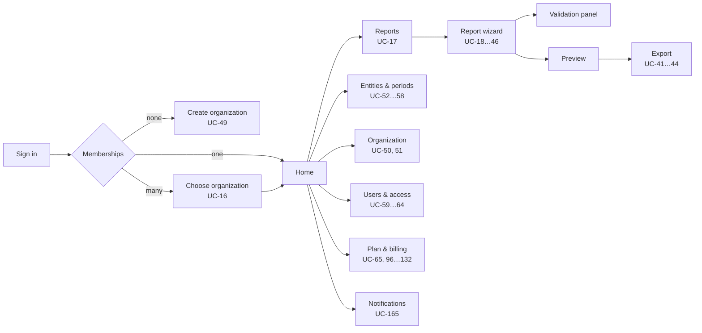

# ESG Platform — Interface and Interaction Design Specification (MVP)

| Field | Value |
|---|---|
| Document ID | design_spec.md |
| Version | 1.0 |
| Status | Consolidated baseline |
| Date | 2026-08-17 |
| Consolidates | *ESG Platform Interface and Interaction Design Specification (MVP)* (primary source); *ESG Platform Use Case Register (MVP)* (UC identifiers); *ESG Platform Functional Requirements (MVP)* (FR identifiers); *ESG Platform System Actors (MVP)* (actor codes) |

---

## 1. Purpose and scope

### 1.1 What this document is

This is the canonical design specification for every human-facing surface of the ESG Platform: the tenant application, the administrative console, the generated documents, and notifications. It states what the interface must do and why, in terms that survive a change of framework, component library or visual identity.

### 1.2 What this document is not

It is not a visual style guide, a page-by-page mockup set, or a component library implementation. It defines the rules a mockup must satisfy and the contract a component library must fulfil. Pixel values, brand colour values and font families are deliberately absent from the source material and therefore absent here; they are supplied by the visual identity layer (§11.2) and swapped without touching this document — including, where required, by substituting the Moldovan state design system wholesale (§11.7).

### 1.3 Normative conventions

- Design rules carry the stable identifiers `UX-n` and use *shall*. They are citable from designs, backlog items and review checklists, and are not renumbered once assigned. All `UX-n` identifiers in this document are reproduced verbatim from the source specification.
- Screen identifiers are `S-nn` for tenant screens and `A-nn` for administrative screens, reproduced verbatim.
- Use cases are `UC-01 … UC-176`. Functional requirements are `FR-1 … FR-173`. Non-functional requirements are `NFR-1` … `NFR-93` (MVP) and `NFR-94` … `NFR-105` (deferred). Design decisions are `D-n`. Architecture decisions are `AD-1 … AD-14`.
- Actor codes are the letter codes `CA`, `RC`, `OA`, `PA`, `BO`, `SYS`. There is no `ACT-*` scheme.
- Descriptive prose carries no obligation.

### 1.4 Scope boundary

MVP scope is the VSME Basic Module B1–B11, self-serve billing, and the locale set discussed in §9.1 (unresolved between sources).

Deliberately not designed for MVP: per-user density switching; user-configurable dashboards; in-product chat support; report collaboration with simultaneous multi-user editing and presence; commenting and review workflow on disclosures; notification assignment and escalation chains; right-to-left support for a fourth locale; native mobile applications; Comprehensive Module screens beyond the Basic Module; XBRL viewer surfaces (Phase 2); advisor and buyer portal surfaces (Phase 2 relationship types).

Each deferred item is an addition to the screen inventory (§4.4) and the component inventory (§11.5) when its requirement is admitted, not a redesign of this specification.

### 1.5 Companion documents and precedence

This document is one of seven baseline files. Each register is owned by exactly one file:

| File | Owns |
|---|---|
| `problem_overview.md` | Problem statement, scope, closed scope decisions |
| `actors.md` | Actors `CA`, `RC`, `OA`, `PA`, `BO`, `SYS` |
| `use_cases.md` | `UC-01` … `UC-176`, design decisions `D-1` … `D-14` |
| `functional_requirements.md` | `FR-1` … `FR-173` |
| `non_functional_requirements.md` | `NFR-1` … `NFR-93` (MVP) and `NFR-94` … `NFR-105` (deferred) |
| `architecture.md` | `AD-1` … `AD-14`, `DR-1` … `DR-11` — this file consolidates, and replaces, the two source titles *Architecture Overview (MVP)* and *System Architecture (MVP)* |
| `design_spec.md` (this file) | `UX-1` … `UX-134`, `S-01` … `S-28`, `A-01` … `A-18` |

Where this document and any of those disagree, they win on their subject and this document is amended.

---

## 2. Design principles and rationale

### 2.1 The single design mandate

> **NFR-76** — a user with no sustainability training completes a first Basic Module report unaided, at ≥ 80 % task success within the target completion time.

Everything in this document is subordinate to that sentence. The platform's competitive position is not that it stores ESG data — a spreadsheet does that — but that it converts a standard written for accountants into a sequence of questions a company owner can answer. The interface is the product. A correct backend behind an interface that an SME owner abandons at module B3 has produced nothing.

### 2.2 Two structural facts

- **The work is intermittent.** A VSME report is assembled over weeks, in short sessions, by people whose day job is something else. Nothing may depend on a session being completed in one sitting, on one device, by one person.
- **The work is seasonal and deadline-bound.** Volume concentrates in April–May, peaking in the final two weeks of May (Art. 33(3), Law 287/2017). Under deadline pressure users do not read; they scan, guess and retry. Every screen shall be designed for the hurried, not the attentive, reader.

### 2.3 Principles

Each principle is stated with the consequence that makes it testable. A principle with no consequence is decoration.

| # | Principle | Consequence |
|---|---|---|
| P1 | **Ask, never quiz.** The user answers questions about their own business; they are never asked to interpret the standard. | Every field carries plain-language help authored at the reading level of a non-specialist (NFR-78). Regulatory citations are available on demand, never in the primary label. |
| P2 | **Never present what will be rejected.** Applicability is resolved before display, not validated after entry. | Conditional fields are shown or hidden live from B1 answers (UC-26, UC-28). The system never renders a field and then refuses its value on grounds the system already knew. |
| P3 | **A gap is an answer.** Absence is always an explicit, reasoned state. | Eight terminal states, never a silent blank (§6.4). "Not material", "not available" and "nil return" are first-class and carried into exports. |
| P4 | **Progress is never lost.** | Autosave without a save action, offline queueing, lossless resume across device and session (UC-35, UC-36), draft flush before logout (UC-06). |
| P5 | **State the consequence before the action.** | Every destructive, irreversible or entitlement-reducing action discloses precisely what changes, before it is committed (NFR-80). |
| P6 | **One finding, one destination.** | Every error, warning and notification resolves to the exact field, record or screen that fixes it (UC-39, UC-166). A message that says something is wrong without saying where is a defect. |
| P7 | **Compliance is legible.** | Version pinning, factor-set version, override attribution, change history and export provenance are visible to the user, not buried in an audit table (UC-34, UC-44, UC-47). |
| P8 | **Money is explained.** | Every charge shows net, VAT with rate and basis, gross, currency and — where a payment rail is unavailable — the reason it is unavailable (UC-112). |
| P9 | **Accessibility is structural, not remedial.** | WCAG 2.2 AA is a design input to the component contract (§10), not an audit performed on finished screens. It extends to the exported PDF (PDF/UA-1). |

### 2.4 Anti-goals

The interface shall not attempt: dashboard-first design (the primary object is a report in progress, not a metrics wall); gamification of compliance progress; AI-authored narrative content presented as the user's own disclosure; dense enterprise data grids as the primary tenant surface; or a mobile-first data-entry model (see §11.4).

---

## 3. Users, contexts of use and device assumptions

### 3.1 Actors as design inputs

Actor definitions are normative in *System Actors (MVP)*. This table adds only what design needs.

| Actor | Typical person | Frequency | Primary device | Domain expertise | Design consequence |
|---|---|---|---|---|---|
| **RC** Reporting Contributor | Owner, office manager, accountant, external bookkeeper | Weeks of intermittent sessions, once a year | Desktop / laptop ≥ 1024 px; tablet for review | None to low | The wizard is the whole product for this actor. Optimise for resumption and for answering without prior knowledge. |
| **OA** Organization Administrator | Owner or finance lead; often the same human as RC | Setup, then oversight; billing events | Desktop | Low on ESG, moderate on business admin | Administration is a *separate mode*, not a permission-filtered variant of the report. |
| **CA** Common Access | Any authenticated user | Every session | Any | — | Account, credential, membership and notification surfaces are identical for all actors. |
| **BO** Billing Operator | Internal finance | Daily, in queues | Desktop, dual-monitor | High | Exception-queue design, keyboard-first, information-dense. Opposite end of the density scale from RC. |
| **PA** Platform Administrator | Internal operations, content, translation | Campaign-shaped (a publish, a migration) | Desktop | High | Staged, reversible, previewable operations with explicit blast-radius disclosure. |
| **SYS** System | — | — | — | — | Has no interface, but *every* SYS use case terminates in something a human sees: a notification, a state change, an exception in a queue. Each shall have a named destination surface (§6.12). |

### 3.2 Surfaces

| Surface | Audience | Auth realm | Device target | Design system relationship |
|---|---|---|---|---|
| **Tenant application** | CA, RC, OA | Tenant session | Entry ≥ 1024 px · full operation at tablet · full readability at phone | Canonical consumer of the design system |
| **Administrative console** | PA, BO | Separate realm, separate host, mandatory MFA | Desktop only | Same tokens and primitives, different density and composition (§12) |
| **Generated document** (PDF, Excel) | External readers — banks, buyers, auditors | None | Print and screen reading | Separate print layer sharing tokens; typography and layout diverge deliberately (§11.8) |
| **Notification** (in-app, email) | All | Tenant session / none | Any, including phone | In-app uses the design system; email uses a constrained, client-tolerant subset (§6.12) |
| **External checkout** (acquirer, MIA) | OA | Provider-controlled | Provider-controlled | **Not designable.** The platform designs the hand-off and the return, never the payment page itself (§6.11) |

**UX-1** Every surface shall be reachable and operable without reference to any other surface. A user shall never be told to "ask an administrator" without being told who that administrator is.

### 3.3 Device and connectivity assumptions

Four named breakpoints, defined by capability rather than device. Values live in tokens; the source specifies no pixel values other than the `wide` entry threshold of 1024 px.

| Name | Capability | Tenant behaviour |
|---|---|---|
| `compact` | Phone | Full readability and review; wizard navigation collapses; sustained entry discouraged but not blocked |
| `medium` | Tablet | **Fully operable**, including data entry (NFR-77) |
| `wide` | Laptop ≥ 1024 px | **Optimised for sustained entry** (NFR-8): module list, field content and validation panel simultaneously visible |
| `extra` | Large desktop | Additional context, not additional density — comparatives and history gain space |

**Connectivity.** Assume intermittent, moderate-quality connections and mid-range hardware on 4G for the web-vitals budget (§8.5).

### 3.4 Language context

Interface language, export language and email language are selected independently (UC-14, UC-48; source cites FR-169). Russian VSME labels are platform-authored and carry no official EFRAG standing; the interface says so at the point of export selection, not in a help centre. The number of live locales is an unresolved conflict between sources — see §9.1 and OQ-1.

---

## 4. Information architecture and navigation model

### 4.1 The object model as the user experiences it

```
User account  (personal: profile, credentials, language, notification preferences)
  └── Membership → Organization          ← exactly one is "active" per session
        ├── Reporting entity             ← one or many; most SMEs hold one
        │     └── Reporting period       ← pins template + taxonomy version, links prior period
        │           └── Report
        │                 └── Module B1 … B11
        │                       └── Disclosure field  ← the atomic unit of the product
        ├── Users & access
        ├── Plan, usage, billing account, invoices
        └── Notifications (scoped to the active organization)
```

**UX-2** The active organization shall be visible at all times on every authenticated screen, and shall never be inferred from a URL segment or a request header — it is a property of the session (UC-16).

**UX-3** Switching the active organization shall return the user to the equivalent screen in the new organization where one exists, and to that organization's home otherwise. It shall never silently discard unsaved work; unsynced changes are flushed first.

**UX-4** Every addressable state — a report module, a validation finding, an invoice, an admin queue filter — shall have a stable, shareable, bookmarkable address that restores the same state on load. Deep links are how notifications discharge P6.

### 4.2 Navigation tiers

Three tiers, and no fourth.

| Tier | Contains | Persistence |
|---|---|---|
| **Global** | Active organization switcher, notification centre, user menu (profile, language, sign out), help | Present on every authenticated screen |
| **Workspace** | Reports · Entities & periods · Organization · Users & access · Plan & billing | Present outside the wizard; collapsed or hidden inside it |
| **Contextual** | Module list within a report; tab set within a record; step sequence within a flow | Scoped to the current object |

**UX-5** The wizard shall suppress the workspace tier and replace it with the module list, so that the user's only navigational choice inside a report is *which module*. Exit from the wizard shall be a single, always-visible, explicitly labelled control that states that work is saved.

### 4.3 Primary navigation flow



**UX-6** The authenticated home screen shall answer three questions above the fold, in this order: *what needs my attention*, *where did I leave off*, *what is the state of everything*. For a single-entity organization this reduces to one resumable report and its completion state; the same template shall scale to a multi-entity organization without a different screen (UC-67).

### 4.4 Screen inventory (sitemap)

Screens are design containers; a screen may serve several use cases and a use case may span several screens. Identifiers are verbatim from the source. The archetype column refers to §4.6.

| # | Screen | Actor | Serves | Archetype |
|---|---|---|---|---|
| S-01 | Sign in / register / provider choice | CA | UC-01 … 05 | Focus |
| S-02 | Verify email · reset password · set password | CA | UC-03, 08, 09 | Focus |
| S-03 | Accept invitation | CA | UC-15 | Focus |
| S-04 | Create organization | OA | UC-49 | Focus |
| S-05 | Home / organization overview | all | UC-16, 67 | Workspace |
| S-06 | Reports index | RC, OA | UC-17 | Index |
| S-07 | **Report wizard — module step** | RC | UC-18 … 31, 37, 45, 46 | Wizard |
| S-08 | Validation panel (in-wizard, persistent) | RC | UC-37 … 40 | Panel |
| S-09 | Carbon calculator | RC | UC-32 … 34 | Wizard sub-flow |
| S-10 | Report preview | RC | UC-41 | Document |
| S-11 | Export dialogue and history | RC | UC-42 … 44, 48 | Panel + Index |
| S-12 | Field change history | RC, OA | UC-47 | Panel |
| S-13 | Entities index and entity record | OA | UC-52 … 55 | Index + Record |
| S-14 | Reporting periods | OA | UC-56 … 58 | Index + Record |
| S-15 | Organization profile and identifiers | OA | UC-50, 51 | Record |
| S-16 | Users & access | OA | UC-59 … 64, 175 | Index |
| S-17 | Plan, entitlements and usage | OA | UC-65, 66 | Status |
| S-18 | Plan comparison and selection | OA | UC-96 … 98 | Comparison |
| S-19 | Order, summary and confirmation | OA | UC-110 … 115 | Wizard |
| S-20 | Payment hand-off and return | OA | UC-116 … 121 | Focus + Status |
| S-21 | Payment instruments | OA | UC-118, 119 | Index |
| S-22 | Invoices and documents | OA | UC-132, 157 | Index |
| S-23 | Billing account | OA | UC-108 | Record |
| S-24 | Subscription status and history | OA | UC-99 … 107 | Status + Index |
| S-25 | Enterprise request | OA | UC-153 | Focus |
| S-26 | Notification centre | CA | UC-165 … 167 | Index |
| S-27 | Profile, language, notification preferences | CA, all | UC-13, 14, 168 | Record |
| S-28 | Credentials and linked identities | CA | UC-10 … 12 | Record |
| A-01 | Admin sign-in (MFA) | PA, BO | UC-68 | Focus |
| A-02 | Organization register | PA | UC-69 | Index |
| A-03 | Content and translation console | PA | UC-71 … 74 | Editor + Publish |
| A-04 | Taxonomy versions, mappings, migration runs | PA | UC-75 … 79 | Editor + Batch |
| A-05 | Factor sets, thresholds, validation rules | PA | UC-80 … 82 | Editor |
| A-06 | Adoption metrics | PA | UC-83, 84 | Dashboard |
| A-07 | Support access request and audit log | PA | UC-85, 86 | Focus + Index |
| A-08 | Admin accounts and system audit log | PA | UC-87, 88 | Index |
| A-09 | Plan catalogue, entitlements, pricing, discounts | BO | UC-89 … 95 | Editor |
| A-10 | Reconciliation workspace | BO | UC-137 … 140 | Exception queue |
| A-11 | Collections and dunning | BO | UC-141 … 144 | Exception queue |
| A-12 | Invoicing, credit notes, numbering series | BO | UC-126 … 136 | Index + Record |
| A-13 | e-Factura transmission exceptions | BO | UC-130 | Exception queue |
| A-14 | Refunds and chargebacks | BO | UC-145 … 147 | Exception queue |
| A-15 | Enterprise quotes and contracts | BO | UC-153 … 159 | Record |
| A-16 | Revenue, VAT export, billing audit ledger | BO | UC-160 … 164 | Dashboard + Index |
| A-17 | Notification categories and templates | PA | UC-176 | Editor + Publish |
| A-18 | Identity provider configuration | PA | UC-70 | Editor |

**Count:** 46 screens — 28 tenant (`S-01 … S-28`) and 18 administrative (`A-01 … A-18`).

### 4.5 Use cases served without a dedicated screen

Three use cases are served by global-tier elements and inline patterns rather than dedicated screens:

| Use case | Destination |
|---|---|
| UC-06 — log out | User menu, with draft flush per UX-37 |
| UC-07 — re-authenticate after session expiry | Inline over preserved context, UX-38 |
| UC-16 — switch active organization | Global switcher, UX-2, UX-3 |

`SYS` use cases have no screen of their own and terminate in a destination named under UX-61.

**UX-7** No screen shall exist that is not traceable to at least one use case, and no use case with a human actor shall be without a screen or a named global-tier pattern. The inventory in §4.4 is the coverage contract.

> Note: UC-16 appears both in the S-05 *Serves* column and in the no-dedicated-screen list above. Both statements are reproduced as written; see OQ-6.

### 4.6 Page archetypes

Nine templates. Every screen is an instance of one; a screen that fits none is an escalation to design review, not a licence to invent.

| Archetype | Purpose | Fixed elements | Notes |
|---|---|---|---|
| **Focus** | One task, no navigation | Single column, centred, one primary action | Auth, invitation, organization creation, payment return |
| **Index** | Find one among many | Filter, sort, empty state, row action, pagination or progressive load | Never the primary tenant surface; always has an empty state that teaches |
| **Record** | View and edit one object's attributes | Identity header, grouped fields, save/cancel affordance, change attribution | Explicit save, unlike the wizard |
| **Wizard** | Ordered progression with completion state | Step list, step content, progress, autosave indicator, exit | The report, the calculator, the order |
| **Panel** | Auxiliary context beside a primary task | Dismissible, non-modal, retains position | Validation, history, export |
| **Document** | Faithful preview of a rendered artefact | Page-shaped, paginated, print-accurate | Report preview |
| **Status** | Current state of a long-lived thing | State name, what it means, what changes it, next date | Subscription, plan, entitlements |
| **Exception queue** | Work a human must resolve | Dense table, saved filters, bulk action, per-item resolution with mandatory rationale | Admin only; keyboard-first |
| **Dashboard** | Aggregate view | Figures with confidence marking, period filter, export | Admin only; never the tenant home |

**UX-8** Each archetype shall define every state in §8.1 before any instance of it is designed.

Two archetype labels appear in the inventory that are not in this table of nine: *Wizard sub-flow* (S-09) and *Comparison* (S-18). They are treated here as instances of **Wizard** and **Index/Status** composition respectively; the source does not define them separately (OQ-7).

---

## 5. Screen specifications

### 5.0 How to read these specifications

Each screen below is specified against a fixed template: identifier and name (verbatim), purpose, primary actors, entry points, layout and regions, content and data shown, controls and actions, states, validation behaviour, exits, and related use cases and functional requirements.

Three limits on what follows must be stated plainly, because the alternative is invention:

1. **Layout and regions** are given as the fixed elements the screen inherits from its archetype (§4.6) plus any region the source names explicitly (for example the wizard's module list, the disclosure field anatomy, the save-state indicator). The source specifies no per-screen wireframes, no column allocations and no pixel geometry. Where nothing further is stated, this document says so rather than filling the gap.
2. **States** are drawn from the eleven-state model in §8.1. Only the states the source makes applicable are listed. `UX-90` requires every applicable state to be designed before implementation; the enumeration here is the checklist, not a design.
3. **Entry points and exits** are derived from the navigation flow (§4.3), the use case preconditions, and the notification deep-link obligation (UX-4, UX-63). Where a route is not evidenced in the sources it is not asserted.

### 5.1 Tenant screens

### S-01 — Sign in / register / provider choice

- **Purpose:** admit a user to the platform, or create the account that will hold their memberships.
- **Primary actors:** CA.
- **Archetype:** Focus.
- **Entry points:** unauthenticated arrival at the tenant application; an expired invitation or reset link that requires a fresh sign-in.
- **Layout and regions:** single column, centred, one primary action (Focus fixed elements). Email/password entry and the enabled social provider choices are presented on the same surface. No further per-screen layout is specified in the source.
- **Content and data shown:** email address and password inputs; the set of currently enabled identity providers (Google and Microsoft at MVP, per FR-2, enabled or disabled through A-18 / FR-82); route to registration; route to password reset.
- **Controls and actions:** sign in with password; sign in with a provider; register; request a password reset.
- **States:** loading — initial; error — recoverable (failed credential, rate-limited, locked out after threshold, per FR-4); error — permission (an identity presented that is linked to no account is offered registration rather than silently signed in, UC-05).
- **Validation behaviour:** credential failures are rate-limited and locked out after a threshold. **UX-108** applies with force here: no cognitive function test shall be required to sign in, and password managers and paste shall work everywhere.
- **Exits:** per §4.3 — no memberships → S-04; exactly one membership → S-05; more than one → organization choice then S-05. Registration by password exits to the verification challenge (S-02).
- **Use cases:** UC-01, UC-02, UC-03 (provider-asserted case), UC-04, UC-05.
- **FRs:** FR-1, FR-2, FR-4, FR-82.

### S-02 — Verify email · reset password · set password

- **Purpose:** prove control of an email address, and set or replace a password from a link.
- **Primary actors:** CA.
- **Archetype:** Focus.
- **Entry points:** a time-limited verification link; a single-use, time-limited reset link; the reset-request route from S-01.
- **Layout and regions:** single column, centred, one primary action. No further per-screen layout is specified in the source.
- **Content and data shown:** the address being verified or reset; the password policy; for a reset request, a response identical whether or not the address is registered (UC-08).
- **Controls and actions:** request a reset; set a new password; confirm verification.
- **States:** loading — initial; success (account active, next step offered); error — recoverable (link expired, link already consumed, password fails policy).
- **Validation behaviour:** password policy enforced on entry with the three-part message formula (§8.2). Account enumeration is prevented by an invariant response. Consuming a reset link invalidates all existing sessions for the account (FR-6), which the screen must state as a consequence before it happens (P5).
- **Exits:** on verification, the founding-organization flow (S-04) or a pending invitation (S-03) becomes available; on reset completion, S-01.
- **Use cases:** UC-03, UC-08, UC-09.
- **FRs:** FR-3, FR-6.

### S-03 — Accept invitation

- **Purpose:** convert an invitation into a membership with an assigned role.
- **Primary actors:** CA.
- **Archetype:** Focus.
- **Entry points:** the single-use invitation link sent from S-16.
- **Layout and regions:** single column, centred, one primary action. No further per-screen layout is specified in the source.
- **Content and data shown:** the inviting organization; the role being granted (edit or view-only); the invited email address, to which the invitation is bound.
- **Controls and actions:** create an account by password; create an account by provider; sign in to link an existing account; accept.
- **States:** loading — initial; error — recoverable (invitation expired, already used, revoked); error — permission (a provider identity asserting an address other than the invited one is refused, UC-15).
- **Validation behaviour:** the invitation binds to the invited email address; a social sign-in is accepted only where the provider asserts that same address.
- **Exits:** S-05 in the newly joined organization.
- **Use cases:** UC-15.
- **FRs:** FR-11.

### S-04 — Create organization

- **Purpose:** create the organization record and make its creator its administrator.
- **Primary actors:** OA (the creating user is granted the role by the act, D-1).
- **Archetype:** Focus.
- **Entry points:** a verified account with no memberships (§4.3); an existing user creating an additional organization.
- **Layout and regions:** single column, centred, one primary action. No further per-screen layout is specified in the source.
- **Content and data shown:** legal name, country, contact details.
- **Controls and actions:** create.
- **States:** loading — initial; error — recoverable; success (administrator role granted, home offered).
- **Validation behaviour:** required-field validation on the identity fields; the deeper fiscal and identifier validation belongs to S-15 and S-23.
- **Exits:** S-05.
- **Use cases:** UC-49.
- **FRs:** FR-13, FR-14.

### S-05 — Home / organization overview

- **Purpose:** answer, above the fold and in this order, *what needs my attention*, *where did I leave off*, *what is the state of everything* (UX-6).
- **Primary actors:** all authenticated actors in the tenant realm (CA, RC, OA).
- **Archetype:** Workspace composition (global tier + workspace tier + content).
- **Entry points:** sign-in; organization switch; notification deep link; wizard exit; the workspace navigation.
- **Layout and regions:** global tier persistent (organization switcher, notification centre, user menu, help); workspace tier present; content answers the three UX-6 questions in order. The same template shall scale from a single-entity organization to a multi-entity organization without a different screen.
- **Content and data shown:** the resumable report and its completion state; every entity and period in the organization with completion and validation status (UC-67, FR-23); attention items.
- **Controls and actions:** resume a report; open an entity or period; switch active organization; open the notification centre.
- **States:** empty — first use (no entity or period yet: teaches the object and offers the one action that creates it); loading — initial (skeleton matching final layout); loading — refresh (prior content stays visible); partial (some data resolved, some failed, with per-part retry); error — recoverable; read-only.
- **Validation behaviour:** none of its own; it presents roll-ups computed by the validation service (§6.4).
- **Exits:** S-06, S-07, S-13, S-14, S-15, S-16, S-17, S-26.
- **Use cases:** UC-16, UC-67.
- **FRs:** FR-12, FR-23.

### S-06 — Reports index

- **Purpose:** find the entity/period combination to work on.
- **Primary actors:** RC, OA.
- **Archetype:** Index.
- **Entry points:** workspace navigation; S-05.
- **Layout and regions:** Index fixed elements — filter, sort, empty state, row action, pagination or progressive load.
- **Content and data shown:** accessible entities and periods with completion and validation summary, reflecting per-report permissions so a view-only member sees the same entries without edit affordances (UC-17, FR-25).
- **Controls and actions:** filter; sort; open a report.
- **States:** empty — first use (teaching empty state, per Index note in §4.6); empty — filtered (distinguishes "nothing matches" from "nothing exists" and offers to clear the filter); loading — initial; loading — refresh; error — recoverable; read-only (view-only membership).
- **Validation behaviour:** none of its own.
- **Exits:** S-07.
- **Use cases:** UC-17.
- **FRs:** FR-25.

### S-07 — Report wizard — module step

- **Purpose:** the whole product for the RC actor: capture the eleven Basic Module sections B1–B11 as a sequence of answerable questions.
- **Primary actors:** RC.
- **Archetype:** Wizard.
- **Entry points:** S-06; S-05 resume; a validation finding deep link (UX-22); a notification deep link (UX-63); return from S-09, S-10, S-11.
- **Layout and regions:**
  - Workspace tier suppressed and replaced by the **module list** (UX-5), persistent and always visible, carrying a per-module state indicator.
  - **Step header** showing, without scrolling, the module name in plain language alongside its standard reference (`B8 — Workforce characteristics`), completion and validation state, and how many fields remain outstanding (UX-11).
  - **Step content** composed of disclosure fields (§7.1), constrained to the reading measure of UX-74.
  - **Save-state indicator** in one fixed location (UX-35).
  - **Exit control**, single, always visible, explicitly labelled, stating that work is saved (UX-5).
  - **Validation panel** (S-08) beside the step content, simultaneously visible at `wide` (§3.3).
- **Content and data shown:** disclosure field labels, help text, values, units, state markers; prior-period value adjacent to the current input where a prior period exists (UX-31); provenance for values derived elsewhere, such as B3 from the calculator (UX-12); B1 values pre-populated from the entity master record but editable in place (FR-27, UX-109).
- **Controls and actions:** enter a value; choose a unit from a constrained list; mark a field not available with a reason; declare a section not material with a rationale; carry a prior value forward per field or per module; run validation; open the calculator; open field history; preview; export; exit.
- **States:** empty — first use (a period newly opened, no answers yet); loading — initial (skeleton matching final layout, no shift on resolve); loading — refresh; partial; error — recoverable; error — permission; **read-only** (a locked period UC-57, a view-only membership, or a suspended entitlement UC-142 — same layout as edit mode with affordances removed and a persistent banner naming which of the three causes applies and what restores editing, UX-13); offline / queued; pending — async (export or calculation in flight); success.
- **Validation behaviour:** inline at the point of entry and rolled up per module and per report (UX-20); conditional fields appear and disappear live from B1 answers with an announcement naming the cause (UX-26, UX-27); a value entered into a field that subsequently disappears is retained and the user is told so (UX-28); year-over-year movement beyond a configured threshold raises `inconsistency`, not `error`, and states both values and the change (UX-33); B1 shall be completed before any conditional module is presented (UX-9).
- **Exits:** exit control → S-05 or S-06; S-08; S-09; S-10; S-11; S-12.
- **Use cases:** UC-18, UC-19, UC-20, UC-21, UC-22, UC-23, UC-24, UC-25, UC-26, UC-27, UC-28, UC-29, UC-30, UC-31, UC-37, UC-45, UC-46; and, through the draft-integrity pattern, UC-35 and UC-36 (see OQ-5).
- **FRs:** FR-24, FR-26, FR-27, FR-28, FR-29, FR-30, FR-31, FR-32, FR-37, FR-38, FR-39, FR-40, FR-46, FR-47.

### S-08 — Validation panel (in-wizard, persistent)

- **Purpose:** make an eleven-module report navigable by finding, and present validation as a working tool rather than a gate.
- **Primary actors:** RC.
- **Archetype:** Panel.
- **Entry points:** S-07 (persistent, simultaneously visible at `wide`); a deep link to a specific finding (UX-4).
- **Layout and regions:** dismissible, non-modal, retains position (Panel fixed elements). Positioned beside the step content.
- **Content and data shown:** findings grouped and rolled up per module and per report; the rule explanation for each finding; the roll-up discounting modules declared not material (UX-21).
- **Controls and actions:** run or re-run validation — the primary control is *check my report*, not *submit* (UX-24); select a finding.
- **States:** empty — first use; empty — filtered; loading — initial; pending — async (validation in flight, with inline progress on the roll-up while the wizard stays interactive, §8.5); error — recoverable; read-only.
- **Validation behaviour:** this screen *is* the validation surface. Validation is runnable at any completeness and is idempotent (UX-24). Every finding shall be a link that moves focus to the originating field, scrolls it into view, and displays the rule explanation (UX-22); silent scroll without focus movement is an accessibility failure (§10.4).
- **Exits:** focus moves into the originating field in S-07; export warning path into S-11.
- **Use cases:** UC-37, UC-38, UC-39, UC-40.
- **FRs:** FR-40, FR-41, FR-42, FR-43.

### S-09 — Carbon calculator

- **Purpose:** turn utility invoices into Scope 1 and location-based Scope 2 figures without asking the user to convert anything.
- **Primary actors:** RC.
- **Archetype:** Wizard sub-flow (an instance of Wizard, §4.6).
- **Entry points:** S-07 from the B3 module step; a provenance route from a B3 derived field (UX-12).
- **Layout and regions:** Wizard fixed elements — step list, step content, progress, autosave indicator, exit — scoped as a sub-flow of the report wizard. Inputs organised by energy source and by site.
- **Content and data shown:** consumption by source (electricity, natural gas, diesel, heating fuel and so on) and by site, in the units of the user's own invoices; raw inputs, which remain visible and editable after calculation as the permanent assurance record (UX-41); results with the derivation available in one step — input → conversion → factor applied → result — naming the factor set version (UX-42); an override's superseded computed value alongside the substituted one, with attribution (UX-43); a non-blocking notice where the factor set has been updated since the result was computed, naming the pinned version and offering recalculation (UX-44).
- **Controls and actions:** enter consumption; choose unit; calculate; annotate; override with a reason; recalculate against a newer factor set.
- **States:** empty — first use; loading — initial; pending — async (calculation, though at p95 ≤ 1 s synchronous presentation is acceptable, §8.5); error — recoverable; read-only; success.
- **Validation behaviour:** units are fixed or chosen from a constrained list, never free text (UX-14). An override requires a reason and shall never present an unexplained substituted figure (UX-43). Results write into the B3 fields, where the standard validation rules then apply.
- **Exits:** back to the B3 step in S-07.
- **Use cases:** UC-32, UC-33, UC-34.
- **FRs:** FR-33, FR-34, FR-35, FR-36; consumes FR-71.

### S-10 — Report preview

- **Purpose:** let the user see the artefact a bank, buyer or auditor will read, before anything leaves the platform.
- **Primary actors:** RC.
- **Archetype:** Document.
- **Entry points:** S-07; S-11.
- **Layout and regions:** page-shaped, paginated, print-accurate (Document fixed elements). The rendering follows the document layout system of §11.8, not the interface layout.
- **Content and data shown:** the fully assembled report — narrative, indicator tables, comparatives — in the same content, same order and with the same marked gaps as the export (UX-45); override attribution markers (UX-43); version pin indicators.
- **Controls and actions:** paginate; proceed to export.
- **States:** loading — initial; pending — async (assembly); error — recoverable; read-only by nature.
- **Validation behaviour:** none of its own; unresolved findings and reasoned gaps appear visibly marked rather than omitted (UX-25, UX-119).
- **Exits:** S-11; back to S-07.
- **Use cases:** UC-41.
- **FRs:** FR-48.

### S-11 — Export dialogue and history

- **Purpose:** produce the distributable artefact, and keep every previously distributed artefact retrievable exactly as distributed.
- **Primary actors:** RC.
- **Archetype:** Panel + Index.
- **Entry points:** S-07; S-10; a notification announcing a completed export job (UX-46).
- **Layout and regions:** Panel for the dialogue (dismissible, non-modal, retains position); Index for the history (filter, sort, empty state, row action).
- **Content and data shown:**
  - Dialogue: exactly two decisions and no more — **format** (PDF · EFRAG Excel) and **language**, independent of interface language (UX-47). Where Russian is selected, a statement that Russian VSME labels are platform-authored and carry no official EFRAG standing, with RO or EN recommended for a bank or EU buyer. Where the report is pinned to a superseded taxonomy version, the choice between migration and export-against-original with an explicit notice (UX-48). Where findings are unresolved, an explicit warning listing what is unresolved (UX-25).
  - History: format, language, taxonomy version, timestamp and generating user for every prior export (UX-49).
- **Controls and actions:** choose format; choose language; export; migrate first; export against the original version; re-download any prior artefact.
- **States:** empty — first use (no exports yet); empty — filtered; loading — initial; **pending — async** (the defining state: export is presented as a job from the first interaction, with immediate acknowledgement, a named place to watch, and freedom to leave the screen; beyond 30 s the result is delivered by notification, UX-46, §8.5); error — recoverable; read-only (new exports blocked under suspension, UC-142, while previously generated documents remain downloadable, UX-54).
- **Validation behaviour:** export is permitted with unresolved findings after the explicit warning; it is never silently blocked, and it never proceeds silently against a version the report was not prepared under.
- **Exits:** the produced file; the notification centre (S-26) for a long-running job; back to S-07 or S-10.
- **Use cases:** UC-42, UC-43, UC-44, UC-48.
- **FRs:** FR-44, FR-49, FR-50, FR-51, FR-52, FR-53.

### S-12 — Field change history

- **Purpose:** make attribution legible at the point of the value, not only in an audit screen (P7).
- **Primary actors:** RC, OA.
- **Archetype:** Panel.
- **Entry points:** the field itself in S-07 (UX-68); S-05 or S-13 for record-level history.
- **Layout and regions:** dismissible, non-modal, retains position. Presented as a timeline / history list (§11.5).
- **Content and data shown:** per field — who changed the value, when, and what the previous value was. Attribution is retained for users removed from the organization (UX-69, FR-55).
- **Controls and actions:** open from a field; close; navigate entries.
- **States:** empty — first use (no changes yet); loading — initial; loading — refresh; error — recoverable; read-only by nature.
- **Validation behaviour:** none.
- **Exits:** back to the originating field.
- **Use cases:** UC-47.
- **FRs:** FR-54, FR-55.

### S-13 — Entities index and entity record

- **Purpose:** maintain the legal entities that are reported on, and the boundary each reports against.
- **Primary actors:** OA.
- **Archetype:** Index + Record.
- **Entry points:** workspace navigation; S-05.
- **Layout and regions:** Index (filter, sort, empty state, row action, pagination) for the list; Record (identity header, grouped fields, explicit save/cancel, change attribution) for the entity.
- **Content and data shown:** legal form; NACE code(s); site locations; consolidation basis and, where consolidated, the subsidiaries inside the reporting boundary (UC-54, FR-19); archived state.
- **Controls and actions:** create; edit; define consolidation scope; archive.
- **States:** empty — first use (teaching empty state offering entity creation); empty — filtered; loading — initial; loading — refresh; error — recoverable; error — permission; read-only (entitlement-reduced entities, UC-151); success.
- **Validation behaviour:** explicit save with field-level validation on the Record archetype, unlike the wizard. Entity master data is retained point-in-time so a closed period's report continues to reflect the values in force (FR-18) — a consequence the interface states before an edit that would otherwise read as retroactive. Archiving is a consequence-disclosing action (§6.14): historical reports and exports remain intact and the interface says so.
- **Exits:** S-14 for the entity's periods; S-05.
- **Use cases:** UC-52, UC-53, UC-54, UC-55.
- **FRs:** FR-17, FR-18, FR-19, FR-20.

### S-14 — Reporting periods

- **Purpose:** open, lock and reopen the period that a report is prepared against.
- **Primary actors:** OA.
- **Archetype:** Index + Record.
- **Entry points:** S-13; workspace navigation; S-05.
- **Layout and regions:** Index for the period list; Record for the period.
- **Content and data shown:** fiscal year, start and end dates; the optional due date, distinct from the period end, which deadline notifications count down to (UC-56); the pinned template and taxonomy version (version pin indicator, §11.5); the linked preceding period from which comparatives resolve; lock state; and, where reopened, the persistent fact that the period was reopened together with the stated reason (UX-72).
- **Controls and actions:** open a period; lock; reopen with a stated reason.
- **States:** empty — first use; empty — filtered; loading — initial; error — recoverable; error — permission; read-only (locked); success.
- **Validation behaviour:** date and range validation on open. Locking and reopening are both irreversible-class actions under UX-71: they shall be visually and verbally distinguished from ordinary actions and shall state the compensating mechanism. Reopening requires a stated reason and is displayed thereafter — an amendment must look like an amendment (UX-72).
- **Exits:** S-07 for the report in the period; S-13.
- **Use cases:** UC-56, UC-57, UC-58.
- **FRs:** FR-21, FR-22, FR-45, FR-66.

### S-15 — Organization profile and identifiers

- **Purpose:** maintain the legal identity that propagates into every report the organization produces.
- **Primary actors:** OA.
- **Archetype:** Record.
- **Entry points:** workspace navigation; S-05.
- **Layout and regions:** identity header, grouped fields, save/cancel affordance, change attribution.
- **Content and data shown:** legal form, registered name, registered address, contact details; entity identifiers — LEI as primary, with DUNS, EU ID or PermID as fallback (UC-51).
- **Controls and actions:** edit; save; cancel.
- **States:** loading — initial; loading — refresh; error — recoverable; error — permission; read-only; success.
- **Validation behaviour:** identifier format and checksum are validated on entry (FR-16), because an identifier that fails validation downstream in EFRAG's own tooling is expensive to discover at filing time. Messages follow the three-part formula (§8.2). Every change is attributed and timestamped, and the propagation consequence is stated.
- **Exits:** S-05; S-23 for the billing counterpart.
- **Use cases:** UC-50, UC-51.
- **FRs:** FR-15, FR-16.

### S-16 — Users & access

- **Purpose:** answer the question "who can see our ESG data", and control the answer.
- **Primary actors:** OA.
- **Archetype:** Index.
- **Entry points:** workspace navigation; S-05.
- **Layout and regions:** Index fixed elements — filter, sort, empty state, row action, pagination or progressive load.
- **Content and data shown:** every user with access, their role, status (active or pending invitation) and last activity (UC-59); pending invitations; seat consumption against the plan's entitlement (§6.10).
- **Controls and actions:** invite by email with an edit or view-only role; resend an invitation; revoke an invitation; change a role; remove a member; promote a member to Organization Administrator; send a manual reminder to a user about an outstanding report (UC-175).
- **States:** empty — first use; empty — filtered; loading — initial; loading — refresh; error — recoverable; error — permission; success. Entitlement gate state where an invitation would exceed the seat allowance (§6.10, UX-50).
- **Validation behaviour:** email format on invite. Revocation invalidates the outstanding link immediately. Removing a member is a consequence-disclosing action naming the specific user (UX-70), and the interface shall state at the point of removal that their historical contributions remain attributed in the change history (UX-69). An invitation beyond the seat entitlement follows the quota path and states the limit, the allowance, current consumption and the upgrade path in that order (UX-50).
- **Exits:** S-17 or S-18 from the entitlement gate; S-05.
- **Use cases:** UC-59, UC-60, UC-61, UC-62, UC-63, UC-64, UC-175.
- **FRs:** FR-56, FR-57, FR-58, FR-59, FR-60; FR-173 for the reminder path.

### S-17 — Plan, entitlements and usage

- **Purpose:** state plainly what the organization is entitled to and how much of it is consumed.
- **Primary actors:** OA.
- **Archetype:** Status.
- **Entry points:** workspace navigation; S-05; an entitlement gate from any gated action (§6.10); a quota-approach notification.
- **Layout and regions:** Status fixed elements — state name, what it means, what changes it, next date.
- **Content and data shown:** current plan (Free, Standard, Enterprise); the specific entitlements and quotas it grants; the current billing cycle and next renewal date; usage counters derived from the metering stream — reporting entities, active users, reports created, exports by format, API calls — each shown against the entitlement limit rather than as a bare number (UC-66, FR-105).
- **Controls and actions:** view; route to plan comparison; route to subscription status.
- **States:** loading — initial; loading — refresh; partial (a counter unavailable while others resolve); error — recoverable; read-only by nature. Approaching-limit warning shown against the counter in context, before the limit is reached (UX-52).
- **Validation behaviour:** none of its own.
- **Exits:** S-18; S-24; S-25.
- **Use cases:** UC-65, UC-66.
- **FRs:** FR-90, FR-105.

### S-18 — Plan comparison and selection

- **Purpose:** make the plan decision without contacting sales.
- **Primary actors:** OA.
- **Archetype:** Comparison (composed of Index and Status elements, §4.6).
- **Entry points:** S-17; an entitlement gate (UX-50); a trial-expiry notification.
- **Layout and regions:** published plans side by side with entitlements, quotas and price per cycle. Comparison table component (§11.5).
- **Content and data shown:** entitlements, quotas and price for each cycle per published plan; which limits the organization's *actual* consumption would exceed on each (UC-96); trial availability and terms where the plan version offers one.
- **Controls and actions:** select a plan and cycle; start a trial; request Enterprise terms.
- **States:** loading — initial; error — recoverable; read-only; success.
- **Validation behaviour:** none of its own; the order it creates carries the validation (S-19).
- **Exits:** S-19 for a self-serve plan; S-25 for Enterprise (Enterprise never passes through self-serve checkout, D-12, FR-142).
- **Use cases:** UC-96, UC-97, UC-98.
- **FRs:** FR-91, FR-92, FR-93.

### S-19 — Order, summary and confirmation

- **Purpose:** carry commercial intent to a confirmed, evidenced agreement without surprising the buyer on price or rail.
- **Primary actors:** OA.
- **Archetype:** Wizard.
- **Entry points:** S-18; S-24 for a cycle or unit change; S-25 acceptance path.
- **Layout and regions:** Wizard fixed elements — step list, step content, progress, autosave indicator, exit. Money summary component (§11.5) as the confirmation region.
- **Content and data shown:** plan version, cycle, quantity; discount code and its effect; **net amount, VAT rate and basis, gross total, currency** before confirmation (UX-55); the payment rails available for that total, with any excluded rail shown as unavailable **with its reason** — for example MIA excluded because the total exceeds the configured ceiling (UX-56); the terms being accepted; order status through its lifecycle, including the reference the payer must quote and what happens if payment does not arrive (UC-114).
- **Controls and actions:** apply a discount code; choose a rail; confirm and accept terms; track status; cancel an unpaid order.
- **States:** loading — initial; pending — async (awaiting payment, awaiting reconciliation); error — recoverable; success; read-only (once paid or provisioned).
- **Validation behaviour:** a discount code is validated at entry against plan eligibility, validity window and remaining redemptions, and an invalid or exhausted code is rejected with the reason rather than silently ignored (UC-111, FR-109). Confirmation records the accepted terms version, timestamp and acting user (FR-111). Cancelling an unpaid order voids any associated proforma and is a consequence-disclosing action (UX-70).
- **Exits:** S-20 for an external rail; S-22 for the proforma on the transfer rail; S-24 on provisioning.
- **Use cases:** UC-110, UC-111, UC-112, UC-113, UC-114, UC-115.
- **FRs:** FR-108, FR-109, FR-110, FR-111, FR-112, FR-113.

### S-20 — Payment hand-off and return

- **Purpose:** leave the platform for a licensed provider and come back with a truthful account of what happened.
- **Primary actors:** OA.
- **Archetype:** Focus + Status.
- **Entry points:** S-19; the provider's return redirect; a resumed indeterminate order.
- **Layout and regions:** Focus for the hand-off (single column, centred, one primary action); Status for the return (state name, what it means, what changes it, next date). The provider's own page is not designable (§3.2).
- **Content and data shown:** on hand-off — a warning that the user is leaving, the provider's name, and what returns them (UX-57); on the transfer rail — the payment reference as the single most prominent element, copyable in one action, alongside the proforma and the consequence of omitting the reference (UX-59); on return — the outcome.
- **Controls and actions:** proceed to the provider; copy the payment reference; download the proforma; retry; return to the order.
- **States:** all four return outcomes shall be designed — **success**, **failure**, **cancellation** and **abandonment mid-challenge** (UX-58); **pending — async** for an indeterminate return, showing *pending* with what happens next and when, rather than an error; error — recoverable; loading — initial.
- **Validation behaviour:** the platform shall never imitate a payment form — no card fields exist anywhere in the product (PCI SAQ-A, UX-57, FR-115). The order shall survive the round trip without duplication (UX-58). Saved-card consent is an explicit, separately recorded act, distinct from paying once, and worded as a recurring authorisation (UX-60).
- **Exits:** S-24 on provisioning; S-19 on failure or cancellation; S-22 for the invoice; S-21 for instrument management.
- **Use cases:** UC-116, UC-117, UC-118, UC-119, UC-120, UC-121.
- **FRs:** FR-114, FR-115, FR-116, FR-117, FR-118, FR-119.

### S-21 — Payment instruments

- **Purpose:** keep automatic renewal working, and make its failure modes visible before they bite.
- **Primary actors:** OA.
- **Archetype:** Index.
- **Entry points:** S-20; S-24; a payment-failure notification.
- **Layout and regions:** Index fixed elements. Instruments shown as masked descriptors only (FR-115).
- **Content and data shown:** stored instruments with masked descriptor; which is the default for renewal; consent state for recurring authorisation.
- **Controls and actions:** add; replace; remove; set default.
- **States:** empty — first use; loading — initial; error — recoverable; success; read-only.
- **Validation behaviour:** removing the last instrument on an auto-renewing subscription is a consequence-disclosing action that warns renewal will fail, rather than letting the organization discover it at suspension (UC-119, FR-117, UX-70).
- **Exits:** S-24; S-20 for adding an instrument through the provider.
- **Use cases:** UC-118, UC-119.
- **FRs:** FR-117.

### S-22 — Invoices and documents

- **Purpose:** give the customer permanent access to the fiscal documents they are obliged to retain.
- **Primary actors:** OA.
- **Archetype:** Index.
- **Entry points:** workspace navigation; S-19; S-20; an invoice-delivery notification; a dunning notification.
- **Layout and regions:** Index fixed elements — filter, sort, empty state, row action, pagination.
- **Content and data shown:** number, date, period, amount, VAT, status, payment date; proformas; credit notes; the customer's own purchase-order or contract reference reproduced on every invoice issued under it (UC-157); the recorded exchange rate on a foreign-currency document.
- **Controls and actions:** filter; download a document; record a purchase-order reference.
- **States:** empty — first use; empty — filtered; loading — initial; loading — refresh; error — recoverable; **read-only that survives entitlement loss** — invoice history and document download remain available after downgrade, cancellation and lapse, because the retention obligation outlives the subscription (UC-132, FR-128, UX-54).
- **Validation behaviour:** format validation on the purchase-order reference only; fiscal document content is not editable from the tenant surface (FR-125).
- **Exits:** S-23; S-24.
- **Use cases:** UC-132, UC-157.
- **FRs:** FR-128, FR-146.

### S-23 — Billing account

- **Purpose:** hold the fiscal identity of the invoiced legal person, which is not always the reporting entity.
- **Primary actors:** OA.
- **Archetype:** Record.
- **Entry points:** workspace navigation; S-19; an e-Factura rejection notification.
- **Layout and regions:** identity header, grouped fields, save/cancel affordance, change attribution.
- **Content and data shown:** registered legal name, IDNO, VAT registration code where registered, legal address, billing contact (UC-108).
- **Controls and actions:** edit; save; cancel.
- **States:** loading — initial; error — recoverable; read-only; success.
- **Validation behaviour:** fiscal identifier format is validated on entry and, where a lookup is available, existence and VAT status are verified (UC-109, FR-107). The consequence is stated: an invoice carrying an invalid fiscal code is rejected by the national e-Factura platform and cannot be corrected by editing (D-10) — so the message must be a three-part message, not a bare format error.
- **Exits:** S-22; S-24.
- **Use cases:** UC-108.
- **FRs:** FR-106, FR-107.

### S-24 — Subscription status and history

- **Purpose:** expose the subscription state machine plainly, because "past due" and "suspended" have different consequences and a customer must be able to tell which they are in.
- **Primary actors:** OA.
- **Archetype:** Status + Index.
- **Entry points:** S-17; S-19; S-20; a dunning, suspension, trial-expiry or renewal notification.
- **Layout and regions:** Status for the current state (state name, what it means, what changes it, next date); Index for the change history.
- **Content and data shown:** current state — trialling, active, past due, suspended, cancelled, lapsed; the plan version in force; entitlements granted; billing cycle; renewal or expiry date; next amount due; the full change history with date, acting user and resulting entitlements (UC-107). Under suspension: the exact amount, the date, and the single action that restores service (UX-54).
- **Controls and actions:** change billing cycle; upgrade; downgrade; add or remove billable units; enable or disable auto-renewal; cancel; reactivate.
- **States:** loading — initial; loading — refresh; error — recoverable; read-only; success; and the entitlement-reduced state in which previously generated documents remain downloadable (UX-54, FR-104).
- **Validation behaviour:** before any entitlement reduction — downgrade, cancellation, lapse — the interface shall list **by name** the entities and reports that will become read-only under the deterministic retention rule, and shall state explicitly that nothing is deleted (UX-53, UC-101, UC-151, FR-103, FR-104, NFR-80). Upgrade is immediate; downgrade takes effect at the end of the paid period; cancellation is not immediate termination. Each is a consequence-disclosing action naming the specific objects affected (UX-70).
- **Exits:** S-18; S-19; S-21; S-22.
- **Use cases:** UC-99, UC-100, UC-101, UC-102, UC-103, UC-104, UC-105, UC-106, UC-107.
- **FRs:** FR-90, FR-94, FR-95, FR-96, FR-97, FR-98; consumes FR-103, FR-104.

### S-25 — Enterprise request

- **Purpose:** be the entry point to the contract path, since Enterprise never passes through self-serve checkout.
- **Primary actors:** OA.
- **Archetype:** Focus.
- **Entry points:** S-18; S-17.
- **Layout and regions:** single column, centred, one primary action.
- **Content and data shown:** entity count, user count, required capabilities; what happens next.
- **Controls and actions:** submit the request.
- **States:** loading — initial; error — recoverable; success (a tracked opportunity created, not an email sent, FR-142); pending — async while the quote is prepared.
- **Validation behaviour:** required-field validation with three-part messages.
- **Exits:** back to S-17 or S-18; the quote arrives by notification and is handled by BO in A-15.
- **Use cases:** UC-153.
- **FRs:** FR-142.

### S-26 — Notification centre

- **Purpose:** be persistent storage for everything the system needs a human to know, not a stream of transient toasts.
- **Primary actors:** CA.
- **Archetype:** Index.
- **Entry points:** the global tier, from any authenticated screen, with the unread count visible there (UX-62).
- **Layout and regions:** Index fixed elements. Notification item component (§11.5) carrying category, subject link and read state.
- **Content and data shown:** notifications addressed to the user in the active organization; unread count; category; the deep link to the object that raised each one (UX-63).
- **Controls and actions:** open a notification; mark read; dismiss; route to preferences.
- **States:** empty — first use (teaching empty state); empty — filtered; loading — initial; loading — refresh; error — recoverable.
- **Validation behaviour:** none. Read state is per user: one recipient reading an organization-wide notice shall not clear it for colleagues (UX-64). A notice raised while the user was signed out is waiting on return (UX-62).
- **Exits:** the subject of the notification — a module in S-07, a period in S-14, an invoice in S-22, and so on; S-27 for preferences.
- **Use cases:** UC-165, UC-166, UC-167.
- **FRs:** FR-160, FR-161, FR-162.

### S-27 — Profile, language, notification preferences

- **Purpose:** hold what is personal to the user rather than to any organization they belong to.
- **Primary actors:** CA (all actors).
- **Archetype:** Record.
- **Entry points:** the global tier user menu; S-26.
- **Layout and regions:** identity header, grouped fields, save/cancel affordance.
- **Content and data shown:** display name; contact email; interface language; notification preferences **per category and per channel**, with transactional categories — security, account, invoice delivery, payment failure — shown as mandatory and non-disableable **with the reason stated** (UX-65, FR-163).
- **Controls and actions:** edit profile; set interface language; set per-category, per-channel preferences.
- **States:** loading — initial; error — recoverable; success; read-only for the mandatory categories.
- **Validation behaviour:** email format; language selection persists to the profile and applies on every subsequent login and device (FR-10). Preferences follow the user across organizations.
- **Exits:** S-26; S-28.
- **Use cases:** UC-13, UC-14, UC-168.
- **FRs:** FR-9, FR-10, FR-163.

### S-28 — Credentials and linked identities

- **Purpose:** let a user keep at least one working way in, and no fewer.
- **Primary actors:** CA.
- **Archetype:** Record.
- **Entry points:** the global tier user menu; S-27.
- **Layout and regions:** identity header, grouped fields, save/cancel affordance.
- **Content and data shown:** password state; linked provider identities.
- **Controls and actions:** change password; link a provider; unlink a provider.
- **States:** loading — initial; error — recoverable; error — permission; success.
- **Validation behaviour:** changing a password requires the current one (FR-7). A link is established only after authentication by an existing credential — a provider assertion alone is never sufficient (UC-11, FR-8). The system refuses to remove the last remaining credential and prompts the user to set a password first, with the consequence stated: an account with no usable credential is unrecoverable and takes its organization memberships down with it (UC-12, UX-70).
- **Exits:** S-27.
- **Use cases:** UC-10, UC-11, UC-12.
- **FRs:** FR-7, FR-8.

### 5.2 Administrative screens

The administrative console shares tokens and primitives with the tenant application and deliberately diverges in density and composition (§12). All administrative screens: target `wide` and `extra` viewports only (UX-77); use compact density; are keyboard-first and bulk-capable; and sit behind a separate auth realm on a separate host with mandatory MFA (§3.2). Those properties are stated once here and are not repeated per screen. Every operation with cross-tenant blast radius follows the single pattern of UX-123 (§12.2).

### A-01 — Admin sign-in (MFA)

- **Purpose:** admit an internal operator to a realm with cross-organization visibility.
- **Primary actors:** PA, BO.
- **Archetype:** Focus.
- **Entry points:** direct arrival at the administrative host.
- **Layout and regions:** single column, centred, one primary action. No further per-screen layout is specified in the source.
- **Content and data shown:** credential entry; the second factor challenge.
- **Controls and actions:** authenticate; complete the second factor.
- **States:** loading — initial; error — recoverable (failed credential, failed factor); error — permission.
- **Validation behaviour:** multi-factor authentication is mandatory (FR-75). Elevated credentials are held apart from ordinary tenant accounts. **UX-108** applies: no cognitive function test, and password managers and paste shall work.
- **Exits:** the console home for the operator's privilege level.
- **Use cases:** UC-68.
- **FRs:** FR-75.

### A-02 — Organization register

- **Purpose:** support triage and operational oversight without crossing the tenant-data boundary.
- **Primary actors:** PA.
- **Archetype:** Index.
- **Entry points:** console navigation; a support request.
- **Layout and regions:** dense table with saved filters (compact density, §12.1).
- **Content and data shown:** account-level metadata only — registration date, entity count, plan, activity. **Never report content** (FR-76, FR-77, D-5).
- **Controls and actions:** search; filter; open an organization's account-level record; raise a support-access request (A-07).
- **States:** empty — filtered; loading — initial; loading — refresh; error — recoverable; error — permission (the boundary explained, naming what would be required to cross it).
- **Validation behaviour:** the absence of report content is a designed state, not an empty state: the console shall make the boundary explicit rather than showing a blank region.
- **Exits:** A-07.
- **Use cases:** UC-69.
- **FRs:** FR-76, FR-77.

### A-03 — Content and translation console

- **Purpose:** make every field label, help text and validation message editable as data, so a wording correction reaches users without a release.
- **Primary actors:** PA.
- **Archetype:** Editor + Publish.
- **Entry points:** console navigation; the untranslated-key queue; a content review gate (§13.4).
- **Layout and regions:** editor for the string set per locale; publish surface following UX-123 — preview → scope disclosure → confirm → progress → result → revert.
- **Content and data shown:** content keys with their value per locale; platform-authored terms marked as such (UX-93); the queue of keys that fell back to the default locale at runtime (UC-74); the diff against the EFRAG template on a version rollout, where EFRAG publishes an official translation of a VSME label.
- **Controls and actions:** edit a string; register an additional locale; publish a reviewed set; revert a publication; review the fallback queue.
- **States:** empty — filtered; loading — initial; pending — async (publication in progress); partial; error — recoverable; success.
- **Validation behaviour:** publication is an explicit, versioned, reversible step rather than a side effect of editing, so half-finished translations are never live (FR-62). Scope disclosure names how many organizations and reports are affected before confirmation (UX-123).
- **Exits:** back to the queue; the system audit log (A-08) records the publication.
- **Use cases:** UC-71, UC-72, UC-73, UC-74.
- **FRs:** FR-61, FR-62, FR-63, FR-64, FR-74.

### A-04 — Taxonomy versions, mappings, migration runs

- **Purpose:** absorb an EFRAG version change without silently restating anybody's filed report.
- **Primary actors:** PA.
- **Archetype:** Editor + Batch.
- **Entry points:** console navigation; an EFRAG release.
- **Layout and regions:** editor for the version record and the field mapping; batch surface for the migration run following UX-123.
- **Content and data shown:** registered template and taxonomy versions with the uploaded artefact and the explicit backwards-compatibility determination; the field mapping between outgoing and incoming versions, covering added, removed and semantically altered fields; the exposure view — every report still pinned to a superseded version, grouped by organization and by version (UC-77); the preserved pre-migration state.
- **Controls and actions:** register a version; author a mapping; list affected reports; execute a migration run in bulk or report-by-report with manual review; notify affected organizations.
- **States:** loading — initial; pending — async (migration run, with progress); partial (some reports migrated, some failed, with per-part retry); error — recoverable; success with result summary and one-step revert or documented compensation (UX-123).
- **Validation behaviour:** migration is a versioned transformation with a preserved pre-migration state, never an in-place overwrite (FR-69). A breaking change is migrated report-by-report with manual review. Blast radius — how many organizations, how many reports — is disclosed before confirmation.
- **Exits:** the notification path (FR-70, FR-166) reaching tenants; A-08.
- **Use cases:** UC-75, UC-76, UC-77, UC-78, UC-79.
- **FRs:** FR-65, FR-66, FR-67, FR-68, FR-69, FR-70.

### A-05 — Factor sets, thresholds, validation rules

- **Purpose:** hold the calculation and rule layer as configuration, because thresholds move with the standard and with Moldova's transposing legislation.
- **Primary actors:** PA.
- **Archetype:** Editor.
- **Entry points:** console navigation; an annual factor update; a legislative change.
- **Layout and regions:** editor per rule family, with the UX-123 publication pattern where the change has cross-tenant blast radius.
- **Content and data shown:** versioned, effective-dated emission and conversion factor sets; conditional-applicability thresholds (the ≥ 50-employee turnover threshold, the ≥ 150-employee gender pay gap threshold, sector-driven and site-driven applicability); validation rule definitions and the message each fires.
- **Controls and actions:** add a factor set version; edit a threshold; edit a rule and its message; publish.
- **States:** loading — initial; pending — async (publication); error — recoverable; success with revert.
- **Validation behaviour:** existing computed results retain the factor version they were computed under, so a factor update never silently restates a filed report (FR-35, FR-71); the interface shall state that consequence at the point of publication. Content-only and rule-only changes apply without a redeploy (FR-74).
- **Exits:** the notification path to affected organizations (FR-166); A-08.
- **Use cases:** UC-80, UC-81, UC-82.
- **FRs:** FR-71, FR-72, FR-73, FR-74.

### A-06 — Adoption metrics

- **Purpose:** hold the evidence the Phase 2 go/no-go decision rests on.
- **Primary actors:** PA.
- **Archetype:** Dashboard.
- **Entry points:** console navigation.
- **Layout and regions:** Dashboard fixed elements — figures with confidence marking, period filter, export. Charts are admin-only at MVP (§11.5).
- **Content and data shown:** SMEs completing a full report; exports by format; average completion time; export-usage rate; filterable by period and segment. Low-volume figures are **marked low-confidence** rather than presented as reliable (FR-83).
- **Controls and actions:** filter by period and segment; export the metrics.
- **States:** empty — filtered; loading — initial; partial; error — recoverable.
- **Validation behaviour:** the confidence marking is a required presentation, not an optional annotation.
- **Exits:** the exported extract.
- **Use cases:** UC-83, UC-84.
- **FRs:** FR-83.

### A-07 — Support access request and audit log

- **Purpose:** make it possible to help a customer, and evident that the help was observed.
- **Primary actors:** PA.
- **Archetype:** Focus + Index.
- **Entry points:** A-02; a support ticket.
- **Layout and regions:** Focus for the request; Index for the log. While access is active, the console shall display **its own expiry countdown** (UX-124).
- **Content and data shown:** the request — stated reason and ticket reference, scope, duration; the log — requester, organization, reason and what was accessed (FR-79).
- **Controls and actions:** raise a request; end access early; review the log.
- **States:** loading — initial; pending — async (grant in effect, with countdown); error — permission; success; read-only (the log is reviewable but not editable from within the console, FR-79).
- **Validation behaviour:** a stated reason and a ticket reference are mandatory. Access expires automatically without administrator action (FR-78). Standing access to tenant report data does not exist at any point (FR-77, D-5).
- **Exits:** the scoped tenant data for the granted window; A-02.
- **Use cases:** UC-85, UC-86.
- **FRs:** FR-78, FR-79.

### A-08 — Admin accounts and system audit log

- **Purpose:** separate internal privileges from one another, and make a platform-side change explicable after the fact.
- **Primary actors:** PA.
- **Archetype:** Index.
- **Entry points:** console navigation.
- **Layout and regions:** dense tables with saved filters.
- **Content and data shown:** administrator accounts with separable privilege levels; the platform-wide log of version rollouts, content publications, migration runs, factor-set updates and administrator account changes.
- **Controls and actions:** create, modify and deactivate an administrator account; set privilege level; filter and review the log.
- **States:** empty — filtered; loading — initial; loading — refresh; error — recoverable; error — permission; read-only (the log).
- **Validation behaviour:** deactivating an account is a consequence-disclosing action naming the account and what it currently holds (UX-70). Content, operations and support functions do not require one another's rights (FR-80).
- **Exits:** none beyond the console.
- **Use cases:** UC-87, UC-88.
- **FRs:** FR-80, FR-81.

### A-09 — Plan catalogue, entitlements, pricing, discounts

- **Purpose:** let packaging and pricing change more often than the compliance core, without a release.
- **Primary actors:** BO.
- **Archetype:** Editor.
- **Entry points:** console navigation.
- **Layout and regions:** editor per plan version; the publication of a plan version change follows UX-123, since it has cross-tenant blast radius.
- **Content and data shown:** plan record with code, description and positioning; entitlements and quotas as declarative data — entities, seats, reports per period, exports by format, API allowance, module access, support tier; prices per currency and per cycle, authored rather than converted; version and grandfathering choice; publication and retirement state; discount codes and trial terms per plan version.
- **Controls and actions:** create a plan; set entitlements; set prices; version a plan with an explicit grandfathering choice; publish; retire; define a discount; define trial terms.
- **States:** loading — initial; pending — async (version publication); error — recoverable; success with revert or documented compensation.
- **Validation behaviour:** a plan version change discloses scope — how many subscriptions are affected, and under which grandfathering outcome — before confirmation (UX-123). Retirement closes a plan to new subscriptions without terminating anyone's service, and the interface states that.
- **Exits:** A-16 for the revenue consequence.
- **Use cases:** UC-89, UC-90, UC-91, UC-92, UC-93, UC-94, UC-95.
- **FRs:** FR-84, FR-85, FR-86, FR-87, FR-88, FR-89.

### A-10 — Reconciliation workspace

- **Purpose:** keep the bank transfer rail from becoming a manual back office, and work the exceptions when it does.
- **Primary actors:** BO.
- **Archetype:** Exception queue.
- **Entry points:** console navigation; a statement import; an unmatched-payment event.
- **Layout and regions:** dense table, saved filters, bulk action, per-item resolution with mandatory rationale (Exception queue fixed elements); keyboard-first.
- **Content and data shown:** imported statement lines; open orders and invoices; confident automatic matches; exceptions — missing or mistyped reference, partial payment, overpayment, third-party payment, duplicate.
- **Controls and actions:** import a statement by file or bank API; accept or reject a proposed match; resolve an exception; manually mark an invoice paid.
- **States:** empty — first use; empty — filtered; loading — initial; loading — refresh; partial; error — recoverable; success.
- **Validation behaviour:** **UX-125** — every manual resolution requires a rationale, because each is a financial assertion. Manual settlement is written to the immutable billing audit ledger (FR-134). Provisioning follows a confident match.
- **Exits:** A-12 for the invoice; A-16 for the ledger entry.
- **Use cases:** UC-137, UC-138, UC-139, UC-140.
- **FRs:** FR-131, FR-132, FR-133, FR-134.

### A-11 — Collections and dunning

- **Purpose:** escalate an unpaid invoice on a schedule that is configuration, and stop the moment it is paid.
- **Primary actors:** BO.
- **Archetype:** Exception queue.
- **Entry points:** console navigation; a dunning-exhausted event.
- **Layout and regions:** dense table, saved filters, bulk action, per-item resolution with mandatory rationale; keyboard-first.
- **Content and data shown:** overdue invoices with amount, due date passed, dunning stage, and the date service will be restricted; suspended subscriptions; write-off candidates.
- **Controls and actions:** configure the sequence and intervals; advance or halt a sequence; suspend; restore; write off with reason and accounting treatment.
- **States:** empty — filtered; loading — initial; loading — refresh; error — recoverable; success.
- **Validation behaviour:** **UX-125** applies to a write-off. Suspension makes out-of-entitlement reports and entities read-only and blocks new exports while leaving previously generated documents downloadable, and the tenant-side statement of exactly what changed and how to restore it is mandatory (FR-136, UX-54). A write-off leaves the fiscal document in the ledger rather than deleting it, and the interface offers no affordance implying deletion.
- **Exits:** A-12; A-16.
- **Use cases:** UC-141, UC-142, UC-143, UC-144.
- **FRs:** FR-135, FR-136, FR-137, FR-138.

### A-12 — Invoicing, credit notes, numbering series

- **Purpose:** issue and correct fiscal documents under Moldovan constraints, without ever editing an issued one.
- **Primary actors:** BO.
- **Archetype:** Index + Record.
- **Entry points:** console navigation; A-10; A-11; A-14.
- **Layout and regions:** Index for the document register; Record for a single document and for the numbering series configuration.
- **Content and data shown:** proformas and fiscal invoices with supplier and buyer fiscal identifiers, service description, net amount, VAT rate and amount, total, and the stated VAT basis; credit notes and corrective invoices referencing their original; the numbering series per document type per fiscal year, including the annual roll; the recorded National Bank of Moldova rate on a foreign-currency document; e-Factura acknowledgement and identifier; delivery timestamp and channel.
- **Controls and actions:** issue a credit note or corrective invoice; configure and monitor a numbering series; inspect a document; inspect its transmission and delivery record.
- **States:** loading — initial; loading — refresh; pending — async (transmission); partial; error — recoverable; **read-only for every issued document** — an issued invoice is immutable and its effect changes only through a credit note (FR-125, D-10); success.
- **Validation behaviour:** issuing an invoice and consuming an invoice number are irreversible-by-design actions under **UX-71**: they shall be visually and verbally distinguished from ordinary actions and shall state the compensating mechanism, which is the credit note. Numbers are allocated at issuance under a lock and never reserved optimistically (FR-123). An untransmitted invoice is never marked delivered.
- **Exits:** A-13 on a transmission failure; A-16 for the ledger.
- **Use cases:** UC-126, UC-127, UC-128, UC-129, UC-130, UC-131, UC-132, UC-133, UC-134, UC-135, UC-136.
- **FRs:** FR-121, FR-122, FR-123, FR-124, FR-125, FR-126, FR-127, FR-128, FR-129, FR-130.

### A-13 — e-Factura transmission exceptions

- **Purpose:** treat a failed B2B transmission as a compliance exposure rather than a delivery inconvenience.
- **Primary actors:** BO.
- **Archetype:** Exception queue.
- **Entry points:** A-12; a transmission rejection event.
- **Layout and regions:** dense table, saved filters, bulk action, per-item resolution with mandatory rationale; keyboard-first.
- **Content and data shown:** the rejection reason per invoice — schema failure, unknown or mismatched fiscal code, platform outage; the underlying data that must be corrected; reissue state.
- **Controls and actions:** inspect a rejection; correct the underlying data; reissue.
- **States:** empty — filtered (the healthy state); loading — initial; pending — async (retransmission); error — recoverable; success.
- **Validation behaviour:** the invoice is never silently marked delivered on a failed transmission (FR-127). A rejection caused by an invalid buyer fiscal code routes back to the tenant's billing account data (S-23), which cannot be fixed by editing the invoice.
- **Exits:** A-12.
- **Use cases:** UC-130.
- **FRs:** FR-127.

### A-14 — Refunds and chargebacks

- **Purpose:** reverse money and entitlements as two separate, evidenced steps.
- **Primary actors:** BO.
- **Archetype:** Exception queue.
- **Entry points:** console navigation; a chargeback notification from the acquirer.
- **Layout and regions:** dense table, saved filters, per-item resolution with mandatory rationale; keyboard-first.
- **Content and data shown:** refund cases with rail and amount; the generated credit note; chargeback cases with the evidence pack assembled from the order, the recorded terms acceptance and usage records; outcome.
- **Controls and actions:** issue a full or partial refund; assemble and submit evidence; record an outcome.
- **States:** loading — initial; pending — async (rail processing, dispute in flight); error — recoverable; success.
- **Validation behaviour:** **UX-125** applies. Refund authority is separated from invoice issuance authority, so no single account can both raise a charge and reverse it (FR-139) — a separation the console must make visible rather than merely enforce server-side. Entitlement reversal applies read-only treatment rather than deletion (FR-141).
- **Exits:** A-12 for the credit note; A-16 for the ledger.
- **Use cases:** UC-145, UC-146, UC-147.
- **FRs:** FR-139, FR-140, FR-141.

### A-15 — Enterprise quotes and contracts

- **Purpose:** keep sold terms and configured terms from drifting apart.
- **Primary actors:** BO.
- **Archetype:** Record.
- **Entry points:** console navigation; an S-25 quote request.
- **Layout and regions:** Record per opportunity, quote and contract — identity header, grouped fields, explicit save, change attribution.
- **Content and data shown:** the tracked opportunity; the quote as **structured data** — negotiated entitlement set, price, currency, billing schedule, validity date; the executed contract — term length, notice period, negotiated entitlements, SLA, price protection, and any non-standard clause with billing consequences; the additive per-subscription entitlement overrides; the custom billing schedule; approaching expiry and renewal state.
- **Controls and actions:** prepare and issue a quote; record a signed contract; provision a subscription from the contract; schedule custom billing; initiate renewal; record renegotiation or expiry.
- **States:** loading — initial; error — recoverable; success; read-only (an accepted quote, an executed contract).
- **Validation behaviour:** provisioning is by additive entitlement override, not a bespoke plan per customer (FR-145), which the editor must make structurally impossible to bypass. An unrenewed contract follows the standard lapse path rather than abrupt termination (FR-147), and the interface states that.
- **Exits:** A-12 for invoicing; A-16.
- **Use cases:** UC-153, UC-154, UC-155, UC-156, UC-157, UC-158, UC-159.
- **FRs:** FR-142, FR-143, FR-144, FR-145, FR-146, FR-147.

### A-16 — Revenue, VAT export, billing audit ledger

- **Purpose:** know what was charged, what was received, and be able to evidence both.
- **Primary actors:** BO.
- **Archetype:** Dashboard + Index.
- **Entry points:** console navigation.
- **Layout and regions:** Dashboard for the revenue view (figures with confidence marking, period filter, export); Index for the ledger and the settlement reconciliation.
- **Content and data shown:** recognised and deferred revenue, active subscriptions by plan, monthly recurring revenue, churn, collection rate, days sales outstanding; VAT rates and the rules selecting treatment by residency and VAT status, each with an effective date; the period's invoices, credit notes, payments and VAT summary including MDL equivalents of foreign-currency documents; the append-only ledger of every financial event, attributed and timestamped; acquirer and instant-rail settlement reports reconciled against recorded payments, with missing settlements, fee discrepancies and timing differences identified.
- **Controls and actions:** maintain VAT rates and rules; filter; export the revenue and VAT report; reconcile settlements; review the ledger.
- **States:** empty — filtered; loading — initial; loading — refresh; partial; error — recoverable; success; **append-only read-only** for the ledger.
- **Validation behaviour:** **UX-126** — the billing audit ledger shall be presented as append-only: entries are superseded, never edited, and the interface shall offer no affordance that implies otherwise. A VAT rate change is effective-dated and requires no deployment (FR-148).
- **Exits:** the exported extract; A-12.
- **Use cases:** UC-160, UC-161, UC-162, UC-163, UC-164.
- **FRs:** FR-148, FR-149, FR-150, FR-151, FR-152.

### A-17 — Notification categories and templates

- **Purpose:** make adding a notice or changing its wording configuration rather than a release.
- **Primary actors:** PA.
- **Archetype:** Editor + Publish.
- **Entry points:** console navigation.
- **Layout and regions:** editor for the category catalogue and the per-locale templates; publish surface following UX-123.
- **Content and data shown:** the category catalogue — default channels, transactional-or-optional classification, deadline lead times, and the interval at which an outstanding-report notice repeats; in-app and email templates per locale.
- **Controls and actions:** edit a category; author a template per locale; publish; revert.
- **States:** loading — initial; pending — async (publication); error — recoverable; success with revert.
- **Validation behaviour:** transactional classification determines non-suppressibility on S-27, so reclassifying a category is a consequence-disclosing action naming what changes for recipients (FR-163, UX-65). Email templates shall degrade to plain text and shall not depend on images or external CSS to be comprehensible (UX-66) — a template-level obligation this editor must enforce.
- **Exits:** A-08 records the publication.
- **Use cases:** UC-176.
- **FRs:** FR-173.

### A-18 — Identity provider configuration

- **Purpose:** withdraw or rotate a provider without stranding users or redeploying.
- **Primary actors:** PA.
- **Archetype:** Editor.
- **Entry points:** console navigation; a credential expiry or leak.
- **Layout and regions:** editor per provider — identity header, grouped fields, explicit save, change attribution.
- **Content and data shown:** registered providers with client credentials, requested scopes and redirect configuration; enabled or disabled state.
- **Controls and actions:** register; enable; disable; rotate credentials.
- **States:** loading — initial; error — recoverable; success.
- **Validation behaviour:** disabling a provider is a consequence-disclosing action: it stops new registrations and links through that provider while leaving existing accounts able to authenticate by another credential, and the interface shall state which of the two it does (UC-70, FR-82, UX-70). Credential rotation happens here rather than through a redeploy.
- **Exits:** the effect is visible on S-01.
- **Use cases:** UC-70.
- **FRs:** FR-82.

---

## 6. Key interaction patterns

Patterns are defined once here and referenced from the screen specifications. This section carries the substance of the specification.

### 6.1 The report authoring wizard

**UX-9** The wizard shall present the eleven Basic Module sections as a persistent, always-visible list with a per-module state indicator, and shall permit free navigation between them. Sequence is guidance, not a gate — except that **B1 shall be completed before any conditional module is presented**, because B1 answers determine applicability (UC-19, P2).

**UX-10** Opening a report shall place the user at the first incomplete step, not at the beginning (UC-18).

**UX-11** Each module step shall show, without scrolling: the module name in plain language alongside its standard reference (`B8 — Workforce characteristics`), its completion and validation state, and how many fields remain outstanding.

**UX-12** A module shall be completable in any order internally, and shall never block on an adjacent module's data. Where a value is derived elsewhere (B3 from the calculator), the field shall show its provenance and a route to the source rather than being disabled without explanation.

**UX-13** Read-only mode — a locked period (UC-57), a view-only membership, or a suspended entitlement (UC-142) — shall use the *same* layout as edit mode with affordances removed and a persistent banner stating which of the three causes applies and what restores editing. Three different causes shall never produce one indistinguishable read-only screen.

The eleven Basic Module steps, with their conditional dependencies, are:

| Step | Module | Conditional behaviour |
|---|---|---|
| B1 | Basis for preparation | Drives applicability for every subsequent module; pre-populated from entity master data (FR-27) and editable in place |
| B2 | Practices, policies and future initiatives | Principal narrative module with structured yes/no anchors |
| B3 | Energy and GHG emissions | Normally derived from the carbon calculator (§6.8); completable by direct entry |
| B4 | Pollution | Commonly resolves to not-applicable, recorded explicitly with rationale (§6.5) |
| B5 | Biodiversity | Applicability is site-driven from the B1 site geolocations |
| B6 | Water | Sector-driven relevance; supports a documented immateriality determination |
| B7 | Resource use, circular economy and waste | Narrative and quantitative content captured together |
| B8 | Workforce characteristics | Employee turnover appears once B1 headcount reaches 50 or more |
| B9 | Health and safety | Zero is an affirmative disclosure (`nil_return`) |
| B10 | Remuneration, collective bargaining and training | Unadjusted gender pay gap appears once B1 headcount reaches 150 or more |
| B11 | Corruption and bribery | Nil return is an affirmative disclosure (`nil_return`) |

### 6.2 The disclosure field

The single most-repeated component in the product. Its anatomy is normative.

```
┌────────────────────────────────────────────────────────────────┐
│ Label (plain language)                          [state marker] │
│ Help text — one or two sentences, plain language               │
│ ┌──────────────────────────┐ ┌──────────┐                      │
│ │ value input              │ │ unit     │  ← unit fixed or     │
│ └──────────────────────────┘ └──────────┘    chosen, never free│
│ Prior period: 1 240 MWh  ·  [Carry forward]   ← where a prior  │
│ ⓘ state message: what / consequence / action    period exists  │
│ [Mark not available ▾]                        ← always present │
│ ⌄ Why this is asked · standard reference · example             │
└────────────────────────────────────────────────────────────────┘
```

This anatomy is the source's only screen-level layout diagram. The field-level conventions it implies are stated in §7.

### 6.3 Conditional and dynamic field applicability

**UX-26** Conditional fields (turnover at ≥ 50 employees, gender pay gap at ≥ 150, site-driven biodiversity, sector-driven water) shall appear and disappear live as B1 answers change (UC-26, UC-28, UC-81).

**UX-27** When a field appears or disappears, the change shall be announced — a brief, non-modal, dismissible explanation naming the B1 answer that caused it. Fields shall not materialise silently; an unexplained new required field at deadline reads as a system fault.

**UX-28** Where a conditional field disappears after being answered, the entered value shall be retained and restored if the condition returns, and the user shall be told it has been retained rather than discarded.

### 6.4 Validation presentation and finding-to-field navigation

Eight terminal states. They are a design vocabulary, not merely a data enum.

| State | Meaning to the user | Field treatment | Counts as resolved? |
|---|---|---|---|
| `ok` | Answered and coherent | Neutral, no marker | Yes |
| `missing` | Required and unanswered | Attention marker, non-alarming | No |
| `inconsistency` | Conflicts with another value | Warning, with a link to the conflicting field | No |
| `error` | Violates a rule outright | Error, blocking within the field | No |
| `invalid_url` | Reference does not resolve | Error, with the failing URL shown | No |
| `not_available` | Declared unavailable with reason | Distinct marker, reason shown inline | Yes — reasoned |
| `not_material` | Section declared immaterial with rationale | Section-level, collapses the module body | Yes — reasoned |
| `nil_return` | Affirmatively zero | Neutral, labelled as an affirmative zero | Yes |

**UX-20** Validation state shall be shown inline at the point of entry *and* rolled up per module and per report (UC-37, UC-38). Neither presentation replaces the other.

**UX-21** The roll-up shall discount modules declared not material, so a legitimately excluded module does not depress the completion figure (UC-38).

**UX-22** Every finding shall be a link that moves focus to the originating field, scrolls it into view, and displays the rule explanation (UC-39). Silent scroll without focus movement is a failure of §10.

**UX-23** Colour shall never be the sole carrier of state (§10.2). Each state has an icon, a text label and a colour role.

**UX-24** Validation shall be runnable at any completeness and shall be idempotent (UC-40). The interface shall present it as a working tool, not a pre-export gate — the primary control is *check my report*, not *submit*.

**UX-25** Export shall be permitted with unresolved findings after an explicit warning listing what is unresolved, and the gaps shall appear visibly marked in the produced document (UC-42; source cites §15.4, see OQ-8).

> **Vocabulary note.** The use case register and the FR register name five machine states in upper case — `OK`, `MISSING VALUE`, `VALUE INCONSISTENCY`, `ERROR`, `INVALID URL` — plus the declared-not-available state (UC-37, FR-40). The design vocabulary above is an eight-state superset in lower snake case. The two are reconcilable (`missing` ↔ `MISSING VALUE`, `inconsistency` ↔ `VALUE INCONSISTENCY`, and the three reasoned states elaborate what the registers treat as one declared state), and both spellings are reproduced here rather than harmonised silently. See OQ-4.

### 6.5 Not material, not applicable, not available

**UX-29** Declaring a section not material (UC-30) shall require a rationale, shall be reversible, and shall visibly change the module's state in the module list to a distinct third value — neither complete nor incomplete.

**UX-30** The rationale shall be presented as text a third party will read in the export, and the interface shall say so at the point of entry. This is the difference between a considered exclusion and an evasion.

### 6.6 Prior-period comparatives and carry-forward

**UX-31** Where a prior period exists, its value shall be shown adjacent to the current input at the point of entry, not in a separate comparison view (UC-45).

**UX-32** Carry-forward shall be a per-field action with an optional module-level bulk action, and every carried value shall remain visibly marked as carried until edited or explicitly confirmed (UC-46).

**UX-33** A year-over-year movement beyond a configured proportional threshold shall raise an `inconsistency`, not an `error` — the movement may be real. The message shall state both values and the change.

### 6.7 Autosave, offline queueing and draft recovery

**UX-34** There shall be no save button in the wizard. Values persist on blur or step change (UC-35).

**UX-35** Save state shall be continuously visible in one fixed location with four states: *saved*, *saving*, *queued — no connection*, *failed*. The indicator shall be text-labelled, not an icon alone, and shall be announced to assistive technology on change (§10.4).

**UX-36** Acknowledgement shall follow durable commit, not optimistic local state, within the p95 ≤ 250 ms budget. Where the budget is exceeded the indicator shall move to *saving* rather than showing a false *saved*.

**UX-37** Offline changes shall queue locally and retry. The user shall be warned while anything is unsynced, and shall be warned again — with a chance to cancel — on any navigation away, sign-out or organization switch that would abandon a queue (UC-06, UC-35).

**UX-38** Session expiry shall not lose work: on re-authentication the user returns to the exact screen and record, and queued changes are submitted (UC-07). Re-authentication shall be presented inline over the preserved context, never as a redirect to a blank sign-in screen.

**UX-39** Resumption shall restore field values, wizard position and validation state on any device (UC-36).

### 6.8 The carbon calculator

**UX-40** The calculator shall accept consumption **in the units of the user's own invoices**, by source and by site (UC-32). Unit conversion is the system's work, never the user's.

**UX-41** Raw inputs shall remain visible and editable after calculation, presented as the permanent record they are — the assurance trail depends on them.

**UX-42** Results shall be shown with their derivation available in one step: input → conversion → factor applied → result, naming the factor set version (UC-33).

**UX-43** An override (UC-34) shall require a reason, shall display the superseded computed value alongside the substituted one, and shall carry an attribution marker into the preview and the export. An unexplained substituted figure shall never be presentable.

**UX-44** Where a factor set is updated after a result was computed, the report shall show a non-blocking notice naming the pinned version and offering recalculation. A filed figure is never silently restated (P7).

### 6.9 Preview and export flow

**UX-45** Preview shall be a faithful rendering of the export — same content, same order, same marked gaps — not an approximation (UC-41).

**UX-46** Export shall be presented as an asynchronous job from the first interaction: the user requests it, receives immediate acknowledgement with a place to watch, and may leave the screen. Where a job exceeds 30 s the result is delivered by notification (§8.5).

**UX-47** The export dialogue shall require two decisions and no more: **format** (PDF · EFRAG Excel) and **language** (independent of interface language, UC-48). Where Russian is selected, the dialogue shall state that Russian VSME labels are platform-authored and carry no official EFRAG standing, and shall recommend RO or EN for a bank or EU buyer.

**UX-48** Where a report is pinned to a superseded taxonomy version, the dialogue shall offer migration or export-against-original with an explicit notice, and shall not proceed silently (UC-43).

**UX-49** Export history shall show format, language, taxonomy version, timestamp and generating user, and every prior artefact shall remain re-downloadable exactly as distributed (UC-44).

### 6.10 Entitlement, quota and read-only

**UX-50** A quota block shall state the limit reached, what the current plan allows, current consumption, and the upgrade path — in that order (UC-150). "Upgrade to continue" alone is non-compliant with NFR-79.

**UX-51** Reporting work in progress shall never be lost to a quota block, and a started report shall always be finishable and exportable (UC-150). Quota gates apply at creation boundaries, never mid-task.

**UX-52** Approaching-limit warnings shall appear against the counter in context (UC-66, UC-149), before the limit, not only as a notification.

**UX-53** Before any entitlement reduction — downgrade, cancellation, lapse — the interface shall list **by name** the entities and reports that will become read-only under the deterministic retention rule (UC-101, UC-151, NFR-80). Nothing is deleted, and the interface shall say so explicitly, because "downgrade" is otherwise read as "data loss".

**UX-54** Suspension (UC-142) shall keep previously generated documents downloadable, and shall state the exact amount, the date, and the single action that restores service.

### 6.11 Checkout and the external payment round-trip

**UX-55** The order summary shall show net, VAT rate and basis, gross, and currency before confirmation (UC-112).

**UX-56** Payment rails shall be presented with availability reasons. Where MIA is excluded because the total exceeds the configured ceiling, the option shall be shown as unavailable **with the reason**, never omitted (UC-112, P8).

**UX-57** The hand-off to an external provider shall warn the user they are leaving, name the provider, and state what returns them. The platform shall never imitate a payment form — no card fields exist anywhere in the product (PCI SAQ-A).

**UX-58** The return path shall be designed for all four outcomes: success, failure, cancellation and **abandonment mid-challenge**. An order shall survive the round trip without duplication, and a user returning to an indeterminate state shall see *pending*, with what happens next and when, rather than an error (UC-117).

**UX-59** The bank-transfer path shall present the payment reference as the single most prominent element, copyable in one action, alongside the proforma and the consequence of omitting the reference (UC-121).

**UX-60** Saved-card consent (UC-118) shall be an explicit, separately-recorded act, distinct from paying once, and worded as a recurring authorisation.

### 6.12 The notification centre and notification model

**UX-61** Every SYS use case shall terminate in a named destination: the notification centre, an admin exception queue, or a visible state change on the affected object. No system action shall be invisible to the humans it affects.

**UX-62** The notification centre shall be persistent storage with an unread count visible from any screen — not transient toasts (UC-165). A notice raised while the user was signed out is waiting on return.

**UX-63** Every notification shall be a link to the object that raised it (UC-166, P6).

**UX-64** Read state shall be per-user; one recipient reading an organization-wide notice shall not clear it for colleagues (UC-167).

**UX-65** Preferences shall be per category, per channel, and transactional categories — security, account, invoice delivery, payment failure — shall be shown as mandatory and non-disableable, with the reason stated (UC-168).

**UX-66** Email shall render in the recipient's own language, degrade to plain text, carry a working unsubscribe on optional categories only, and shall not depend on images or external CSS to be comprehensible.

**UX-67** Transient toasts are permitted **only** for confirmation of a user's own immediate action, shall never carry information available nowhere else, and shall never be the sole carrier of an error.

### 6.13 Traceability and change history

**UX-68** Field-level history — who, when, previous value — shall be reachable from the field itself, not only from a separate audit screen (UC-47).

**UX-69** History shall remain attributed to users removed from the organization; removing access shall never erase the trail (UC-63), and the interface shall state this at the point of removal.

### 6.14 Destructive and irreversible actions

**UX-70** Every destructive, overwriting or irreversible action shall require explicit confirmation that **names the specific object and the specific consequence** (NFR-80). Generic "Are you sure?" is prohibited.

**UX-71** Actions that are irreversible by law or design — issuing an invoice, consuming an invoice number, locking then reopening a period, publishing a content set, executing a migration run — shall be visually and verbally distinguished from ordinary actions, and shall state the compensating mechanism where one exists (a credit note, a revert, a preserved pre-migration state).

**UX-72** Reopening a locked period shall require a stated reason and shall display, thereafter, that the period was reopened (UC-58) — an amendment must look like an amendment.

---

## 7. Form and input design conventions

### 7.1 Field anatomy and required elements

Every disclosure field follows the anatomy in §6.2: plain-language label, state marker, help text, value input, unit, prior-period comparative with carry-forward where a prior period exists, state message, the always-present "not available" declaration, and progressive disclosure carrying the rationale, standard reference and example.

### 7.2 Units

**UX-14** Every quantitative field shall carry an explicit unit, either fixed by the taxonomy or chosen from a constrained list. Free-text units are prohibited — they are the primary source of unusable ESG data.

Units the standard requires are captured as such: MWh for energy, tCO₂e for emissions, m³ for water, headcount and FTE for workforce, the hazardous/non-hazardous split for waste, and headcount broken down by contract type, gender and country (FR-29). Derived intensity figures are computed, not typed. In the calculator, the user enters the unit their own invoice uses and conversion is the system's work (UX-40).

### 7.3 Required, optional and conditional

Applicability is resolved before display, never validated after entry (P2). A field is therefore in exactly one of three conditions:

| Condition | Presentation |
|---|---|
| Applicable and required | Shown; `missing` until answered; counts against the module's outstanding count (UX-11) |
| Applicable and conditional | Shown or hidden live from B1 answers, with the appearance or disappearance announced and its cause named (UX-26, UX-27); a value entered before disappearance is retained (UX-28) |
| Not applicable | Not rendered. The system never renders a field and then refuses its value on grounds it already knew (P2) |

### 7.4 "Not available, with reason"

**UX-15** Every field shall offer the "not available, with reason" declaration (UC-31) as a first-class action, not as an alternative discovered after failing to answer.

It is a terminal state distinct from `missing` (D-4, FR-32), it satisfies validation as a *reasoned* resolution rather than suppressing it, and the stated reason is carried into both export formats.

### 7.5 Nil and zero as affirmative disclosure

**UX-16** Zero shall be enterable and distinguishable from unanswered in every numeric field. In B9 and B11 zero is an affirmative disclosure (`nil_return`) and shall be labelled as such, not rendered as an empty box.

### 7.6 Help text and progressive disclosure

**UX-17** Help text shall be visible by default at one to two sentences. Standard references, worked examples and rationale sit behind progressive disclosure. The user shall never have to open anything to answer a normal question (P1).

**UX-18** Field labels, help text and validation messages are content, not code (UC-71). No design shall depend on a specific string length; every layout shall tolerate a **+40 % expansion** from the Romanian source (§9.5).

### 7.7 Narrative inputs

**UX-19** Narrative fields shall show a length indication and a soft target derived from the reference corpus, never a hard limit unless the taxonomy imposes one, and shall support paragraph structure only — no rich formatting that the PDF and Excel exports cannot faithfully carry.

**UX-74** applies to narrative inputs specifically: they shall match the 60–75 character reading measure, because a full-width textarea produces unreadable text and worse writing.

### 7.8 Redundant entry

**UX-109** Information already supplied is never re-requested — entity master data pre-populates B1 (UC-19) rather than being retyped. The pre-populated values remain editable in the report, because B1 is a disclosure rather than master data (D-2, FR-27).

### 7.9 Form control inventory

The form controls a component library must supply, each with every applicable state from §8.1: Text · Textarea · Number-with-unit · Select · Combobox · Multi-select · Radio group · Checkbox · Switch · Date · Date range · Currency · File upload · Fieldset · Form-level error summary.

---

## 8. Feedback, messaging and error handling conventions

### 8.1 The state model

**UX-90** Every screen, panel and domain component shall define all applicable states before implementation. An undefined state is a defect, not an omission.

| State | Requirement |
|---|---|
| **Empty — first use** | Teaches what the object is and offers the one action that creates it. Never a bare "no data". |
| **Empty — filtered** | Distinguishes "nothing matches" from "nothing exists", and offers to clear the filter. |
| **Loading — initial** | Skeleton matching final layout; no layout shift on resolve. |
| **Loading — refresh** | Prior content stays visible and readable; never blanked. |
| **Partial** | Some data resolved, some failed: shows both, names what is missing, offers retry for that part only. |
| **Error — recoverable** | Three-part message (§8.2) plus retry. |
| **Error — permission** | Explains the boundary and names who can grant access (UX-1). |
| **Read-only** | Names which of the three causes applies and what restores editing (UX-13). |
| **Offline / queued** | Explicit, persistent, non-alarming; states what is queued and what happens next. |
| **Pending — async** | Names the job, where the result appears, and roughly when. |
| **Success** | Confirms *what* happened and offers the next step; never a bare toast for a consequential action. |

### 8.2 The message formula

**UX-92** Every error and system message shall state, in this order: **what failed · what the consequence is · what action resolves it** (NFR-79). No message ships without all three parts.

> *Not:* "Validation error in B8."
> *But:* "Employee turnover is required because you reported 50 or more employees in B1. Until it is answered, B8 stays incomplete and the report cannot be marked ready. Enter the number of employees who left during the period."

### 8.3 Message placement

| Vehicle | Permitted use |
|---|---|
| Inline field message | The state of one field, at the point of entry (UX-20) |
| Form-level error summary | At the top of the form, with links to each field (UX-111) |
| Callout (info · attention · warning · error · success) | Context-scoped feedback within a region |
| Banner (persistent, page-level) | A standing condition: read-only cause (UX-13), unsynced queue (UX-37), superseded version pin |
| Consequence dialogue | Before a destructive, overwriting or irreversible action, naming object and consequence (UX-70) |
| Toast | **Only** confirmation of a user's own immediate action. Never information available nowhere else, and never the sole carrier of an error (UX-67) |
| Notification centre | Anything the user must still see after they leave the screen or the session (UX-61, UX-62) |

### 8.4 Finding-to-destination discipline

Every error, warning and notification resolves to the exact field, record or screen that fixes it (P6, UX-22, UX-63). A message that says something is wrong without saying where is a defect, not a rough edge.

### 8.5 Performance-shaped feedback

The NFR budgets are design constraints, not backend-only concerns.

| Budget | Design consequence |
|---|---|
| Interactive read p95 ≤ 300 ms | No loading affordance below ~300 ms — a flashing skeleton reads as instability |
| Autosave ack p95 ≤ 250 ms | Indicator moves to *saving* only beyond the budget (UX-36) |
| Validation p95 ≤ 2 s | Inline progress on the roll-up; the wizard stays interactive throughout |
| Calculation p95 ≤ 1 s | Synchronous presentation is acceptable; anything slower moves to the async pattern of §6.9 |
| Export p95 ≤ 10 s, async beyond 30 s | Always presented as a job (UX-46); notification is the delivery channel past 30 s |
| Entitlement p95 ≤ 20 ms | Gating shall not produce a visible delay; never render an action then retract it |
| LCP ≤ 2.5 s · INP ≤ 200 ms at p75, 4G mid-range | Above-the-fold content is server-rendered; heavy panels (history, preview, charts) load on demand |

**UX-115** Skeletons shall match the final layout so that resolution causes no layout shift. Spinners are reserved for indeterminate waits with no known shape.

**UX-116** Under the April–May load, no interface element shall depend on a background poll more frequent than the state it reflects actually changes.

---

## 9. Localization and content design

### 9.1 Locales supported — unresolved conflict between sources

The sources do not agree on how many locales are live at MVP, and this document does not resolve the conflict by choosing.

| Source | Statement |
|---|---|
| *Interface and Interaction Design Specification (MVP)* | "Three live locales — Romanian (source), English, Russian." Scope line: "three locales". Russian VSME labels are platform-authored and carry no official EFRAG standing, stated at the point of export selection (UX-47, UX-98) |
| *Use Case Register (MVP)*, UC-14 | "The user selects Romanian or English for the application interface." |
| *Functional Requirements (MVP)*, FR-63 | "…with Romanian and English live at MVP and no architectural limit to two" |
| *Use Case Register (MVP)*, UC-73 | Registering an additional locale is described as adding one "beyond Romanian and English" — a PA configuration task, not a development task |

Both readings are internally coherent: RO/EN is the requirement baseline and Russian is either an admitted third locale or a locale registered through UC-73 after MVP. The design consequences differ materially — the Russian caveat pattern (UX-47, UX-98), the Cyrillic typeface obligation (UX-84), and the +40 % expansion budget all assume Russian is live. **This is logged as OQ-1 and must be settled by the requirements owner, not by design.**

### 9.2 Translatable content model

**UX-93** A single glossary shall be the source of truth for every domain term in every locale. Where EFRAG publishes an official translation of a VSME label, it is used verbatim and diffed against the template on every version rollout. Platform-authored terms are marked as such in the content console.

Content is data, not code (FR-61): labels, help text, validation messages, notification templates and email templates are all versioned, editable through A-03 and A-17, and published as an explicit, reversible, all-tenant step (FR-62). Every string is a content key; none is hardcoded (§13.4).

**UX-97** Where a string falls back to the source locale at runtime, the user sees the fallback without decoration; the gap is logged to the translation review queue (UC-74). A visible "missing translation" marker is prohibited in the tenant interface.

### 9.3 Export language independence

Interface language, export language and email language are three independent selections:

| Selection | Where set | Rule |
|---|---|---|
| Interface language | S-27, per user profile | Persists across devices and sessions (FR-10) |
| Export language | S-11, per export | Independent of interface language (UX-47, UC-48, FR-52); recorded in export history |
| Email language | Resolved per recipient | Email renders in the recipient's own language, resolved per recipient rather than per notification (UX-66, FR-169) |

**UX-98** The Russian caveat (§6.9, UX-47) shall appear at the point of export language selection and on the exported document itself, not only in documentation.

### 9.4 Voice and term handling

Plain, specific, unhurried, second person. The reader is a competent business owner who does not know the standard. Regulatory vocabulary is translated at first use and never used to establish authority.

**UX-91** The interface shall not use "ESG", "materiality", "Scope 2", "value chain" or "double materiality" in a primary label without a plain-language gloss available in one step.

### 9.5 Localization constraints on layout

**UX-94** Layouts shall tolerate **+40 %** string expansion from the Romanian source without truncation, reflow into unreadability, or loss of an action.

**UX-95** No layout shall depend on string length, sentence structure or word order. Concatenated sentence fragments are prohibited; every message is a whole, translatable unit with named placeholders.

**UX-96** Numbers, dates, currency and units shall be formatted per locale, and the same value shall never appear in two formats on one screen.

---

## 10. Accessibility requirements

**Target: WCAG 2.2 AA on every tenant-facing screen; PDF/A-2a + PDF/UA-1 on record-intended exports** (NFR-75 as amended, NFR-82 as amended, EN 301 549 v4.x aligned).

This exceeds the WCAG 2.1 baseline of the Moldovan Unified Design Model (§11.7) and of EU Directive 2016/2102 as commonly transposed, so a MUD-themed public-sector deployment inherits a higher standard rather than a lower one (UX-133).

### 10.1 Structure

**UX-99** Every screen shall have a correct heading hierarchy, landmark regions, a skip link, and a document title reflecting the current object and state.

**UX-100** Semantic elements shall carry semantic meaning natively; ARIA is a supplement to correct structure, never a substitute for it.

### 10.2 Perception

**UX-101** Contrast: ≥ 4.5:1 for body text, ≥ 3:1 for large text, non-text UI components and state indicators — in both colour schemes.

**UX-102** No information shall be carried by colour alone (UX-23), by shape alone, or by position alone.

**UX-103** Content shall reflow without loss at 400 % zoom and shall remain usable with author styles overridden.

### 10.3 Operation

**UX-104** Every function shall be reachable and completable by keyboard, in a logical order, with no traps.

**UX-105** **Focus Appearance (2.4.11/2.4.13):** the focus indicator shall meet the minimum area and contrast requirements against every background it can appear on, and shall never be suppressed.

**UX-106** **Target Size (2.5.8):** interactive targets shall meet the 24 × 24 minimum, with exceptions used only where the criterion permits. This binds inline field actions — "not available", "carry forward", finding links — which are exactly where the temptation to shrink is greatest.

**UX-107** **Dragging Movements (2.5.7):** any reordering or drag interaction shall have a single-pointer alternative.

**UX-108** **Accessible Authentication (3.3.8):** no cognitive function test shall be required to sign in. Password managers and paste shall work everywhere. This constrains the sign-in and MFA design from the outset, not at audit.

**UX-109** **Consistent Help (3.2.6)** and **Redundant Entry (3.3.7):** help is in the same place on every screen, and information already supplied is never re-requested — entity master data pre-populates B1 (UC-19) rather than being retyped.

### 10.4 Forms and dynamic content

**UX-110** Every input shall have a programmatically associated visible label; placeholders are never labels.

**UX-111** Errors shall be identified in text, associated with their input, and summarised at the top of the form with links to each field.

**UX-112** Asynchronous state changes — autosave, validation completion, export ready, applicability change — shall be announced through polite live regions. Autosave shall not produce announcement noise on every keystroke; it announces on transition only (UX-35).

**UX-113** Focus shall be managed explicitly on step change, dialogue open and close, panel open, and finding navigation, and shall always return to a sensible origin.

### 10.5 Verification

**UX-114** Automated checks in CI, plus manual keyboard and screen-reader audit of the wizard, plus veraPDF conformance validation of exports, plus moderated usability testing with ≥ 8 representative Moldovan SME participants before launch and on any wizard restructure (NFR-75, NFR-76, NFR-82).

---

## 11. Visual design system references

> **Statement of what the source does and does not specify.** The primary source states explicitly that "pixel values, brand colour values and font families are deliberately absent — they are supplied by the visual identity layer and swapped without touching this document". Accordingly this section reproduces the *structure* the source defines — a three-tier token architecture, a colour-role list, a typographic role scale, spacing/elevation/icon/motion rules, breakpoint names, density modes, a 12-column grid, a reading measure, and a component inventory — and specifies **no** hex values, **no** typeface names, **no** font sizes, **no** spacing values, **no** radii, **no** shadow values, **no** motion durations and **no** breakpoint pixel values other than the `wide` entry threshold of 1024 px. Those are open items, logged as OQ-2.

### 11.1 Layout grid and measure

**UX-73** Layout shall be defined by a **12-column fluid grid** with a fixed gutter step and a maximum content width. Column counts, not pixel widths, are the unit of layout description in any design artefact. (The gutter step and the maximum content width are named as required but not valued — OQ-2.)

**UX-74** Body text and help text shall be constrained to a comfortable reading measure (approximately 60–75 characters). Narrative disclosure inputs shall match that measure — a full-width textarea produces unreadable text and worse writing.

### 11.2 Token architecture

**UX-78** All visual values shall be expressed as tokens in three tiers, and no component shall reference a tier-1 token directly.

```
Tier 1  primitive     colour.blue.600 · space.4 · size.font.3 · radius.2
   ↓    (raw values — the only place a literal exists)
Tier 2  semantic      surface.default · text.muted · border.focus
   ↓    state.attention · state.warning · state.error · state.reasoned
Tier 3  component     field.border.rest · field.border.invalid · wizard.step.complete
```

The token names above are the source's illustrative examples of the naming *shape*; they are not an authored token set and carry no values.

**UX-79** Swapping the entire visual identity shall require editing tier 1 only. This is the operational meaning of "framework-agnostic" and shall be verified by producing a second, deliberately different theme before launch.

**UX-80** Every semantic token shall be defined for both light and dark schemes and shall satisfy §10.2 contrast in both. Dark scheme support is a token obligation from the start, whether or not the toggle ships at MVP.

### 11.3 Colour roles

Colour is specified by role, never by hue. No hue, hex or named colour is specified anywhere in the source.

| Role | Applied to |
|---|---|
| `surface` / `surface.raised` / `surface.sunken` | Page, card, panel, well |
| `text.default` / `text.muted` / `text.on-accent` | Content hierarchy |
| `border.default` / `border.strong` / `border.focus` | Separation and focus |
| `accent` | Primary action, active state — exactly one accent |
| `state.ok` · `state.attention` · `state.warning` · `state.error` · `state.reasoned` · `state.neutral` | The eight disclosure states of §6.4, mapped onto six roles |
| `state.pending` | Asynchronous work in flight — export, payment, reconciliation |

**UX-81** `state.reasoned` — covering `not_available`, `not_material` and `nil_return` — shall be visually distinct from both `ok` and `missing`. A reasoned gap is neither a completed answer nor an omission, and conflating it with either misrepresents the report.

### 11.4 Responsive strategy and density

Breakpoint names and capabilities are in §3.3.

**UX-75** The design target is `wide`. `medium` shall be a complete, non-degraded implementation of the same tasks. `compact` shall guarantee reading, reviewing, notification handling, approval and payment — the tasks an owner performs away from a desk — and shall present sustained data entry as possible but not optimised.

**UX-76** No task shall be *unavailable* at `compact` without an explicit statement of why and what device to use. Silent hiding of functionality by viewport is prohibited.

**UX-77** The administrative console targets `wide` and `extra` only, and shall state this rather than degrading (§12).

**Density.** Two density modes sharing one token set: **comfortable** (tenant default — infrequent users, high stakes per field) and **compact** (admin queues — trained operators, high volume). No third mode, and no per-user density switching at MVP.

### 11.5 Component inventory

The contract a component library must satisfy. Each entry requires every applicable state from §8.1.

**Primitives** — Button (primary · secondary · subtle · destructive) · Link · Icon · Badge · Tag · Avatar · Divider · Skeleton · Spinner · Progress · Tooltip · Popover.

**Form controls** — Text · Textarea · Number-with-unit · Select · Combobox · Multi-select · Radio group · Checkbox · Switch · Date · Date range · Currency · File upload · Fieldset · Form-level error summary.

**Feedback** — Inline field message · Callout (info · attention · warning · error · success) · Banner (persistent, page-level) · Toast (UX-67) · Empty state · Error state · Confirmation dialogue · Consequence dialogue (§6.14).

**Navigation** — Global bar · Organization switcher · Workspace nav · Wizard step list · Tabs · Breadcrumb · Pagination · Back-to-context control.

**Data display** — Data table (sortable, filterable, selectable) · Definition list · Key figure · Comparison table · Timeline / history list · Status chip · Chart (admin only at MVP).

**Domain components** — the ones that carry the product:

| Component | Defined in | Notes |
|---|---|---|
| Disclosure field | §6.2 | The atomic unit; every variant shares one anatomy |
| Module card / step | §6.1, §6.4 | Carries the roll-up state including *reasoned* |
| Validation finding | §6.4 | Always a link to the field |
| Save-state indicator | §6.7 | Text-labelled, announced on change |
| Comparative cell | §6.6 | Prior value + carry-forward action + carried marker |
| Calculation trace | §6.8 | Input → conversion → factor version → result |
| Override marker | §6.8 | Attribution + superseded value |
| Entitlement gate | §6.10 | Limit, allowance, consumption, path |
| Consequence list | §6.10, §6.14 | Names affected objects before commit |
| Payment rail selector | §6.11 | Availability with reasons |
| Money summary | §6.11 | Net · VAT rate and basis · gross · currency |
| Notification item | §6.12 | Category, subject link, read state |
| Version pin indicator | §6.9 | Taxonomy / template / factor-set version in force |
| Provenance chip | §6.13 | Who, when, from where |

**UX-89** No screen shall introduce a one-off component. A need not met by this inventory is an addition to the inventory, reviewed once and reused.

### 11.6 Typography, space, shape, elevation, iconography, motion

**UX-82** Type shall be specified as a **role scale**, not a font list: `display` · `heading.1–3` · `body` · `body.strong` · `caption` · `label` · `numeric` · `code`. Any typeface satisfying §9.5 and §10 may be substituted.

**UX-83** A **tabular-lining numeric** treatment shall be used for every quantity, figure, money amount and identifier, so that columns align and digits do not shift between states.

**UX-84** The typeface shall carry complete Romanian diacritics (ș, ț with comma-below, ă, â, î) and full Cyrillic coverage. A typeface failing either is disqualified regardless of appearance.

**UX-85** Spacing shall derive from a single geometric scale; arbitrary values are prohibited.

**UX-86** Elevation shall carry meaning — layering and transience — not decoration. Maximum three levels.

**UX-87** Icons shall be a single coherent set, shall never appear without an accessible name, and shall never be the sole carrier of meaning for state or action.

**UX-88** Motion shall be functional only: state transitions, entry and exit of transient surfaces, and progress. Durations come from tokens; every motion shall honour reduced-motion preferences; nothing essential shall be conveyed by animation alone.

No typeface name, no size scale value, no spacing value, no radius, no elevation value and no motion duration is specified in the source (OQ-2). The Cyrillic-coverage obligation in UX-84 is contingent on the locale question in §9.1 (OQ-1).

### 11.7 National baseline — the Unified Design Model (MUD)

| | |
|---|---|
| **Name** | *Modelul Unitar de Design* (MUD) — the Unified Design Model |
| **Owner** | Agenția de Guvernare Electronică (AGE) |
| **Legal basis** | Government Decision **HG 677/2025**, and AGE Director Order 3005-094 of 29 October 2025 |
| **Launched** | 11 November 2025 |
| **Location** | `https://mud.egov.md` · contact `design@egov.md` |
| **Structure** | Scop și Principii · **Fundamente** (colour, typography, spacing, icons, base styles) · **Componente** · **Șabloane și Modele** |
| **Accessibility baseline** | WCAG **2.1** |
| **Documentation language** | Romanian |
| **Licence** | **CC BY-NC-ND 4.0** — attribution, **non-commercial**, **no derivatives** |
| **Binding on** | Mandatory for service providers and specialised central public authorities building electronic platforms, services and official websites, under the State Information Resources Coordination Methodology. Voluntary for other public bodies. |

Under the private-SaaS posture recorded in *Private Monetization Architecture*, this platform is a commercial product and MUD is **not binding on it**. Two facts nonetheless make MUD a first-class design input: the public-sector deployment is an explicit target (a ministry-operated national platform repositioned as a future Licensee/Enterprise customer, at which point MUD conformance becomes a procurement precondition); and familiarity is a usability asset, since the target user has already used MPass, MSign and the `servicii.gov.md` portal.

The licence is a real constraint. CC BY-NC-ND 4.0 prohibits both commercial use and derivative works, so a commercial SaaS cannot lawfully ship MUD's foundations, components or assets — nor a modified version of them — on the strength of the public licence alone.

**UX-129** The platform shall be designed to be **MUD-compatible without being MUD-dependent**. MUD shall be treatable as an alternative theme and component mapping applied at tier 1 and tier 3 of the token architecture (§11.2), never as an assumption baked into layout, component contracts or interaction patterns.

**UX-130** The design system shall maintain a **MUD mapping table** — platform component → nearest MUD component, with divergences and their reasons recorded. The table is a deliverable (§13.5) and is reviewed whenever MUD publishes a new version.

**UX-131** MUD assets, components, foundations and derivative works **shall not be incorporated into the commercial product** without written licensing clearance from AGE beyond CC BY-NC-ND 4.0. Until such clearance exists, MUD informs *convention* — naming, structure, interaction expectations — and contributes no code, no asset and no token value. Obtaining a position from AGE on commercial and public-deployment licensing is an open action, owned outside the design team (OQ-3).

**UX-132** Where a public-sector deployment is in scope, MUD conformance shall be satisfied by swapping the theme and the component mapping — not by redesigning screens, flows or content. §4.4, §4.6, §6 and §8.1 are theme-independent by construction and shall remain so.

**UX-133** MUD's WCAG 2.1 baseline shall be treated as a **floor, not a target**. This specification holds WCAG 2.2 AA (§10), which is a superset; a MUD-themed deployment inherits the higher standard and shall not regress to 2.1.

**UX-134** MUD documentation is Romanian-only. Any MUD-derived convention adopted here shall be restated in this specification's own terms and translated into all live locales, so that no design obligation exists solely in a document the delivery team may not be able to read.

**Second theme.** The second theme required by UX-79 shall be a **MUD-approximating theme** built from MUD's publicly previewable foundations, converting an abstract portability claim into standing evidence for a public-sector tender.

### 11.8 The generated document as a design surface

The PDF is what a bank, buyer or auditor reads. It is a designed artefact, not a print of the screen.

**UX-117** The document shall have its own layout and typographic system, sharing tokens with the interface but not its layout: a cover carrying entity, period, module scope, taxonomy version and generation date; a contents list; one section per module in standard order; indicator tables with comparatives; and a provenance page naming template version, taxonomy version, factor-set version and generating user.

**UX-118** Print structure shall be controlled explicitly — page breaks, running headers, page counters, table header repetition, orphan and widow control, and no table split that separates a figure from its unit.

**UX-119** Gaps shall be marked visibly and consistently: `not available` with its stated reason, `not material` with its rationale, and unresolved findings shown rather than omitted (UC-42, UX-25). A reader shall never be unable to tell the difference between a zero, a gap and an omission.

**UX-120** Structure shall be tagged for accessibility — reading order, heading levels, table header scope, alternative text, artefact marking — and validated against PDF/UA-1 and PDF/A-2a in the export regression suite.

**UX-121** The document shall be legible in monochrome print. No state, emphasis or distinction shall depend on colour.

**UX-122** The Excel export preserves the official EFRAG template's own presentation exactly; the platform contributes values and nothing else. Its only design surface is the interface that produces it (§6.9).

---

## 12. Administrative interface specifics

Same tokens, same primitives, deliberately different composition.

### 12.1 Divergence from the tenant surface

| Dimension | Tenant | Admin |
|---|---|---|
| Density | Comfortable | Compact (§11.4) |
| Primary archetype | Wizard | Exception queue |
| Input model | Pointer-first, guided | Keyboard-first, bulk-capable |
| Expertise assumed | None | High |
| Viewport support | compact → extra | wide and extra only (UX-77) |

### 12.2 The blast-radius pattern

**UX-123** Every operation with cross-tenant blast radius — content publication, taxonomy migration, factor-set update, plan version change — shall follow one pattern: **preview → scope disclosure (how many organizations, how many reports) → confirm → progress → result → one-step revert or documented compensation** (UC-72, UC-78, UC-80, UC-92).

This pattern governs A-03, A-04, A-05, A-09 and A-17.

### 12.3 Support access

**UX-124** Support access to tenant content shall require a stated reason and a ticket reference, shall display its own expiry countdown while active, and shall be visibly logged (UC-85, UC-86). The console shall make it evident that the access is observed.

### 12.4 Exception queues as financial assertions

**UX-125** Exception queues shall require a rationale on every manual resolution — unmatched payment, manual mark-paid, write-off, refund — because each is a financial assertion (UC-139, UC-140, UC-144).

This governs A-10, A-11, A-13 and A-14.

### 12.5 The append-only ledger

**UX-126** The billing audit ledger shall be presented as append-only: entries are superseded, never edited, and the interface shall offer no affordance that implies otherwise (UC-163).

---

## 13. Traceability: screen ↔ use case ↔ functional requirement

### 13.1 Screen ↔ use case ↔ FR matrix

Use case citations reproduce the *Serves* column of §4.4 verbatim. FR citations are resolved from the `Source UC` column of the FR register; all lie within `FR-1 … FR-173`.

| Screen | Name | Actors | Use cases | Functional requirements |
|---|---|---|---|---|
| S-01 | Sign in / register / provider choice | CA | UC-01 … 05 | FR-1, FR-2, FR-4, FR-82 |
| S-02 | Verify email · reset password · set password | CA | UC-03, 08, 09 | FR-3, FR-6 |
| S-03 | Accept invitation | CA | UC-15 | FR-11 |
| S-04 | Create organization | OA | UC-49 | FR-13, FR-14 |
| S-05 | Home / organization overview | all | UC-16, 67 | FR-12, FR-23 |
| S-06 | Reports index | RC, OA | UC-17 | FR-25 |
| S-07 | Report wizard — module step | RC | UC-18 … 31, 37, 45, 46 | FR-24, FR-26, FR-27, FR-28, FR-29, FR-30, FR-31, FR-32, FR-37, FR-38, FR-39, FR-40, FR-46, FR-47 |
| S-08 | Validation panel (in-wizard, persistent) | RC | UC-37 … 40 | FR-40, FR-41, FR-42, FR-43 |
| S-09 | Carbon calculator | RC | UC-32 … 34 | FR-33, FR-34, FR-35, FR-36 (consumes FR-71) |
| S-10 | Report preview | RC | UC-41 | FR-48 |
| S-11 | Export dialogue and history | RC | UC-42 … 44, 48 | FR-44, FR-49, FR-50, FR-51, FR-52, FR-53 |
| S-12 | Field change history | RC, OA | UC-47 | FR-54, FR-55 |
| S-13 | Entities index and entity record | OA | UC-52 … 55 | FR-17, FR-18, FR-19, FR-20 |
| S-14 | Reporting periods | OA | UC-56 … 58 | FR-21, FR-22, FR-45, FR-66 |
| S-15 | Organization profile and identifiers | OA | UC-50, 51 | FR-15, FR-16 |
| S-16 | Users & access | OA | UC-59 … 64, 175 | FR-56, FR-57, FR-58, FR-59, FR-60, FR-173 |
| S-17 | Plan, entitlements and usage | OA | UC-65, 66 | FR-90, FR-105 |
| S-18 | Plan comparison and selection | OA | UC-96 … 98 | FR-91, FR-92, FR-93 |
| S-19 | Order, summary and confirmation | OA | UC-110 … 115 | FR-108, FR-109, FR-110, FR-111, FR-112, FR-113 |
| S-20 | Payment hand-off and return | OA | UC-116 … 121 | FR-114, FR-115, FR-116, FR-117, FR-118, FR-119 |
| S-21 | Payment instruments | OA | UC-118, 119 | FR-117 |
| S-22 | Invoices and documents | OA | UC-132, 157 | FR-128, FR-146 |
| S-23 | Billing account | OA | UC-108 | FR-106, FR-107 |
| S-24 | Subscription status and history | OA | UC-99 … 107 | FR-90, FR-94, FR-95, FR-96, FR-97, FR-98 (consumes FR-103, FR-104) |
| S-25 | Enterprise request | OA | UC-153 | FR-142 |
| S-26 | Notification centre | CA | UC-165 … 167 | FR-160, FR-161, FR-162 |
| S-27 | Profile, language, notification preferences | CA, all | UC-13, 14, 168 | FR-9, FR-10, FR-163 |
| S-28 | Credentials and linked identities | CA | UC-10 … 12 | FR-7, FR-8 |
| A-01 | Admin sign-in (MFA) | PA, BO | UC-68 | FR-75 |
| A-02 | Organization register | PA | UC-69 | FR-76, FR-77 |
| A-03 | Content and translation console | PA | UC-71 … 74 | FR-61, FR-62, FR-63, FR-64, FR-74 |
| A-04 | Taxonomy versions, mappings, migration runs | PA | UC-75 … 79 | FR-65, FR-66, FR-67, FR-68, FR-69, FR-70 |
| A-05 | Factor sets, thresholds, validation rules | PA | UC-80 … 82 | FR-71, FR-72, FR-73, FR-74 |
| A-06 | Adoption metrics | PA | UC-83, 84 | FR-83 |
| A-07 | Support access request and audit log | PA | UC-85, 86 | FR-78, FR-79 |
| A-08 | Admin accounts and system audit log | PA | UC-87, 88 | FR-80, FR-81 |
| A-09 | Plan catalogue, entitlements, pricing, discounts | BO | UC-89 … 95 | FR-84, FR-85, FR-86, FR-87, FR-88, FR-89 |
| A-10 | Reconciliation workspace | BO | UC-137 … 140 | FR-131, FR-132, FR-133, FR-134 |
| A-11 | Collections and dunning | BO | UC-141 … 144 | FR-135, FR-136, FR-137, FR-138 |
| A-12 | Invoicing, credit notes, numbering series | BO | UC-126 … 136 | FR-121 … FR-130 |
| A-13 | e-Factura transmission exceptions | BO | UC-130 | FR-127 |
| A-14 | Refunds and chargebacks | BO | UC-145 … 147 | FR-139, FR-140, FR-141 |
| A-15 | Enterprise quotes and contracts | BO | UC-153 … 159 | FR-142, FR-143, FR-144, FR-145, FR-146, FR-147 |
| A-16 | Revenue, VAT export, billing audit ledger | BO | UC-160 … 164 | FR-148, FR-149, FR-150, FR-151, FR-152 |
| A-17 | Notification categories and templates | PA | UC-176 | FR-173 |
| A-18 | Identity provider configuration | PA | UC-70 | FR-82 |
| *(global tier)* | User menu — log out | CA | UC-06 | FR-5 |
| *(inline)* | Re-authentication over preserved context | CA | UC-07 | FR-5 |
| *(global tier)* | Organization switcher | CA | UC-16 | FR-12 |

### 13.2 Design rule group ↔ requirements discharged

Reproduced verbatim from the source specification's traceability table, including its own ordering. Apparent mis-citations in the FR ranges are noted in §13.3 rather than corrected here.

| Design area | Rules | Discharges |
|---|---|---|
| Surfaces and IA | UX-1 … UX-8 | UC-16, UC-67, FR-56 … 60, NFR-16 |
| Report wizard | UX-9 … UX-13 | UC-17 … 31, NFR-8, NFR-76 |
| Disclosure field | UX-14 … UX-19 | UC-19 … 31, FR-13 … 40, NFR-78 |
| Validation | UX-20 … UX-25 | UC-37 … 40, FR-41 … 45 |
| Applicability | UX-26 … UX-30 | UC-26, 28, 30, 81, FR-46 |
| Comparatives | UX-31 … UX-33 | UC-45, 46 |
| Draft integrity | UX-34 … UX-39 | UC-06, 07, 35, 36, NFR-40 |
| Calculator | UX-40 … UX-44 | UC-32 … 34, FR-33 … 36 |
| Preview and export | UX-45 … UX-49 | UC-41 … 44, 48, NFR-42, NFR-82 |
| Entitlement | UX-50 … UX-54 | UC-101, 142, 149 … 151, NFR-80 |
| Checkout | UX-55 … UX-60 | UC-110 … 121, NFR-74 |
| Notifications | UX-61 … UX-67 | UC-165 … 176, NFR-106 … 109 |
| Traceability | UX-68 … UX-69 | UC-47, 63 |
| Destructive actions | UX-70 … UX-72 | UC-57, 58, NFR-80 |
| Layout | UX-73 … UX-77 | NFR-8, NFR-77 |
| National baseline (MUD) | UX-129 … UX-134 | HG 677/2025, NFR-16, NFR-75, NFR-88; Licensee/Enterprise path (UC-153 … 159) |
| Foundations | UX-78 … UX-88 | NFR-16, NFR-75 |
| Components | UX-89 | NFR-88 |
| States | UX-90 | NFR-79 |
| Content | UX-91 … UX-98 | UC-71 … 74, NFR-23 … 25, NFR-78, NFR-79 |
| Accessibility | UX-99 … UX-114 | NFR-75, NFR-76, NFR-82 |
| Performance | UX-115 … UX-116 | NFR-38 … 46 |
| Document design | UX-117 … UX-122 | UC-42, 43, NFR-75, NFR-82 |
| Admin console | UX-123 … UX-126 | UC-68 … 88, 137 … 164, NFR-65 |
| Governance | UX-127 … UX-128 | NFR-85 … 89 |

### 13.3 Coverage observations

All identifiers cited in this document fall inside `UC-01` … `UC-176`, `FR-1` … `FR-173`, `NFR-1` … `NFR-105`, and the proposed `NFR-106` … `NFR-109` (architecture.md §17.3, pending ratification). The following are consistency observations against the source's own citations, carried forward as open questions rather than silently corrected:

| Observation | Detail | Logged as |
|---|---|---|
| Two RC use cases have no screen in the inventory | UC-35 (autosave in-progress report data) and UC-36 (resume an in-progress report draft) are RC use cases discharged by the draft-integrity pattern (§6.7) inside S-07, but neither appears in any *Serves* column. UX-7 requires every human-actor use case to have a screen or a named global-tier pattern; the pattern exists, the inventory entry does not | OQ-5 |
| One OA use case has no screen | UC-122 (pay through the merchant-of-record checkout) is an OA use case, registered as an adapter and inactive at MVP (D-8, FR-114). No screen serves it, which is consistent with its inactivity but leaves UX-7 formally unmet | OQ-5 |
| UC-16 is listed twice | It appears both in the S-05 *Serves* column and in the "served by global-tier elements" list (§4.5) | OQ-6 |
| §13.2 FR ranges do not align with the FR register in four rows | *Surfaces and IA* cites FR-56 … 60, which are the users-and-access requirements rather than IA. *Disclosure field* cites FR-13 … 40, which begins at organization creation rather than at report authoring (FR-24). *Validation* cites FR-41 … 45, whereas validation is FR-40 … FR-44 and FR-45 is a comparatives requirement. *Applicability* cites FR-46, which is the prior-period display requirement, whereas applicability is FR-28 | OQ-9 |
| Two archetype labels used in the inventory are not among the nine defined | *Wizard sub-flow* (S-09) and *Comparison* (S-18) | OQ-7 |
| One internal cross-reference does not resolve | UX-25 and UX-122 cite "§15.4" of the source; the source's §15 has no numbered subsections | OQ-8 |

### 13.4 Definition of done for a screen

A screen is complete when: every state in §8.1 is designed · every string is a content key, none hardcoded · the layout survives +40 % expansion in all live locales · keyboard path and focus order are specified · the accessible name of every control is specified · loading, error and permission behaviour are specified · every action is traceable to a use case · every message satisfies the three-part formula · behaviour is specified at all four breakpoints · dark scheme is verified.

**Review gates.**

| Gate | Checks |
|---|---|
| Design review | Archetype conformance, component reuse, state completeness, consequence disclosure |
| Content review | Reading level, three-part messages, glossary conformance, all live locales (NFR-78, NFR-79) |
| Accessibility review | §10, automated plus manual, before merge |
| Usability testing | ≥ 8 SME participants, before launch and on any wizard restructure (NFR-76) |
| Print review | §11.8, on every taxonomy or template version rollout |

### 13.5 Governance and governed artefacts

**UX-127** Tokens are the single source of truth, authored once and consumed identically by the tenant application, the admin console, the print layer and email. A value that exists only in a design file or only in code is a defect.

**UX-128** This specification is versioned alongside the FR/NFR registers. A change to a `UX-n` rule is an amendment recorded with its rationale, not a silent edit.

Artefacts this specification governs: token set (with a second, MUD-approximating theme per §11.7) · component library with documented states · **MUD mapping table (UX-130)** · page archetype templates · screen designs per §4.4 and §5 · content and glossary sets per locale · print stylesheet and document templates · email templates · accessibility conformance record · usability test report.

---

## 14. Open questions

| ID | Question | Why it matters | Owner |
|---|---|---|---|
| OQ-1 | **How many locales are live at MVP — RO/EN or RO/EN/RU?** The interface specification states three live locales (Romanian source, English, Russian); UC-14 and FR-63 state Romanian and English, with UC-73 treating any further locale as a post-MVP registration task. **This conflict is unresolved and is not resolved here.** | Determines whether the Russian export caveat pattern (UX-47, UX-98) is MVP scope, whether full Cyrillic typeface coverage is an MVP procurement constraint (UX-84), and what the +40 % expansion budget is measured against | Requirements owner, not design. Also logged in `actors.md` OQ-9, and in `non_functional_requirements.md` C-3 as an unratified amendment |
| OQ-2 | **No visual design tokens are specified anywhere in the source.** There are no hex or named colour values, no typeface names, no type size scale values, no spacing scale values, no radii, no elevation/shadow values, no motion durations, and no breakpoint pixel values other than the `wide` entry threshold of 1024 px. The gutter step and maximum content width required by UX-73 are named but not valued | Every `UX-n` rule in §11 is a contract that a token set must satisfy; until the token set exists, none of them can be verified. The second theme required by UX-79 also cannot be produced | Visual identity layer / design system owner |
| OQ-3 | **AGE's written position on licensing MUD** for (a) a commercial deployment and (b) a public-sector deployment of this platform. Until it exists, UX-131 stands and MUD contributes convention only — no code, no asset, no token value | Determines whether the MUD-approximating second theme can ship, and what "MUD conformance" costs in a public-sector tender | Owned outside the design team |
| OQ-4 | **Validation state vocabulary is spelled two ways.** The UC and FR registers name five upper-case machine states plus a declared-not-available state (UC-37, FR-40); this specification names eight lower snake-case design states (§6.4). They are reconcilable but not harmonised | A component contract, an API and a test suite cannot all be written against two spellings of the same enum | Requirements owner with design |
| OQ-5 | **UC-35, UC-36 and UC-122 have no screen inventory entry.** UC-35 and UC-36 are discharged by the draft-integrity pattern within S-07; UC-122 is inactive at MVP | UX-7 declares the inventory the coverage contract. Either the inventory gains explicit entries or UX-7 gains an explicit exemption for pattern-discharged use cases | Design |
| OQ-6 | **UC-16 is assigned twice** — to S-05 and to the global-tier switcher | Ambiguity about which surface owns the behaviour, and a double count in any coverage audit | Design |
| OQ-7 | **Two archetype labels are undefined.** *Wizard sub-flow* (S-09) and *Comparison* (S-18) are used in the inventory but are not among the nine archetypes. This document treats them as compositions of Wizard and of Index/Status respectively | UX-8 requires each archetype to define every state before any instance is designed; an undefined archetype has no state definition to inherit | Design |
| OQ-8 | **Broken internal cross-reference.** UX-25 and UX-122 cite "§15.4" of the source, which does not exist | Traceability from a normative rule to the obligation it depends on | Design |
| OQ-9 | **Four FR ranges in the source traceability table do not match the FR register** (see §13.3) | The traceability table is the artefact a reviewer uses to check that a design discharges its requirements; a wrong range makes the check produce a false pass | Design, with the requirements owner |
| OQ-10 | **No wireframes, per-screen layouts or column allocations exist.** The source contains exactly one layout diagram (the disclosure field anatomy, §6.2) and one flow diagram (§4.3). Screen-level layout in §5 is therefore expressed as archetype-inherited regions plus the regions the source names explicitly | The screen designs listed in §13.5 as governed artefacts do not yet exist; §5 is the brief for them, not a substitute | Design |
| OQ-11 | **Notification non-functional properties are unspecified.** The FR register records that FR-160 … FR-173 have no NFR counterpart: delivery latency, retry bounds, email deliverability and retention of delivery records are open | The notification centre (S-26) and the email surface cannot be designed for a latency or retention behaviour that has not been stated | Requirements owner. Also logged in `use_cases.md` OQ-5, `functional_requirements.md` OQ-3, `non_functional_requirements.md` OQ-13 and `architecture.md` OQ-2; the four proposals now carry `NFR-106` … `NFR-109` |

---

## 15. Appendix A — External references

| Reference | Bearing on this specification |
|---|---|
| Modelul Unitar de Design — AGE (`https://mud.egov.md/`) | The Moldovan state design system: foundations, components, templates and patterns. Governs §11.7. Contact `design@egov.md` |
| AGE launch announcement, 11 November 2025 | Establishes the legal basis (HG 677/2025, Order 3005-094 of 29 Oct 2025), the mandatory scope, the WCAG 2.1 baseline and the CC BY-NC-ND 4.0 licence |
| HG 677/2025 (legis.md) | The Government Decision implementing MUD. Authoritative text for who is bound and from when |
| IPN — common rules and a unified visual language for public institution websites | Confirms mandatory application to service providers and central public authorities, recommended for local institutions |
| eGov4Dev integration hub | Where MPass / MSign / MPay integration libraries and brand components live — relevant if a public-sector deployment ever replaces the platform's own identity or payment rails |
| WCAG 2.2 (W3C) · EN 301 549 v4.x | The accessibility standard this specification holds (§10), a superset of MUD's baseline |
| EFRAG VSME Digital Template and XBRL taxonomy | Source of element keys, official label translations and the Excel export's presentation (§6.9, §11.8) |
| Art. 33(3), Law 287/2017 | The filing deadline that produces the April–May seasonal load (§2.2) |

**Open action, owned outside design:** obtain AGE's written position on licensing MUD for (a) a commercial deployment and (b) a public-sector deployment of this platform. Until it exists, UX-131 stands and MUD contributes convention only (OQ-3).
